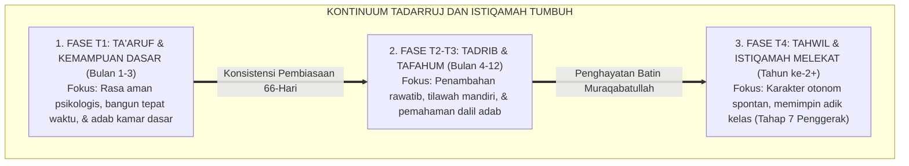
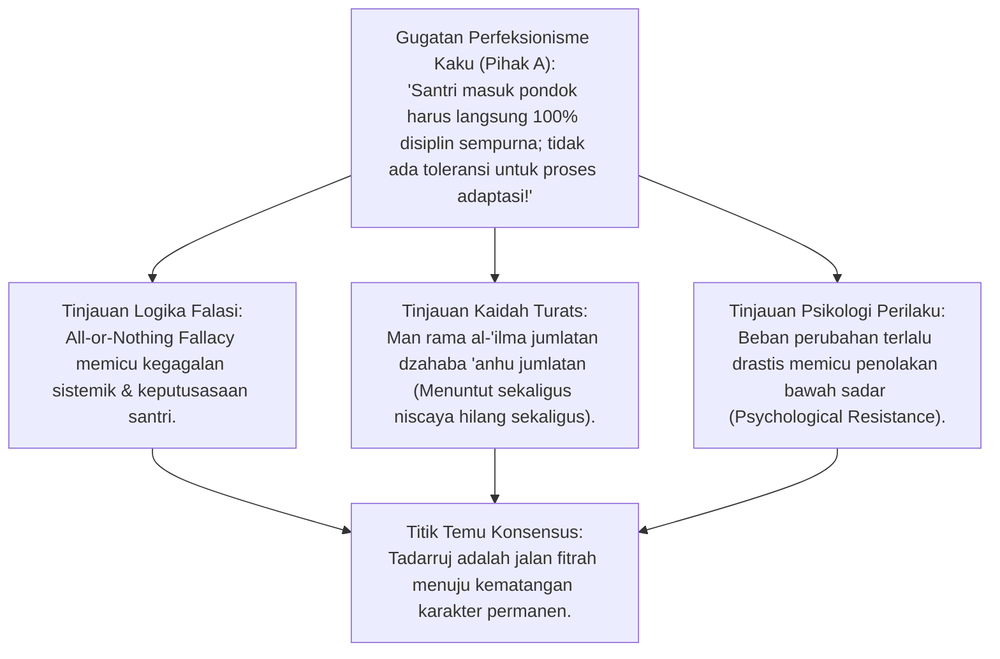
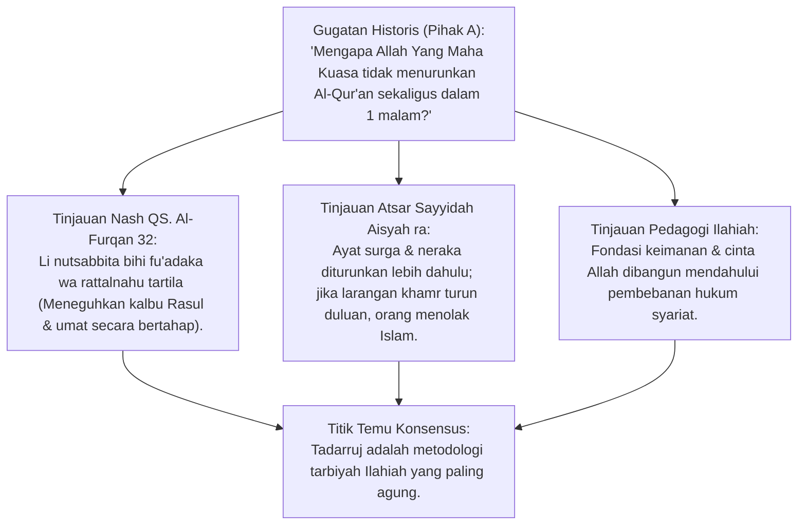
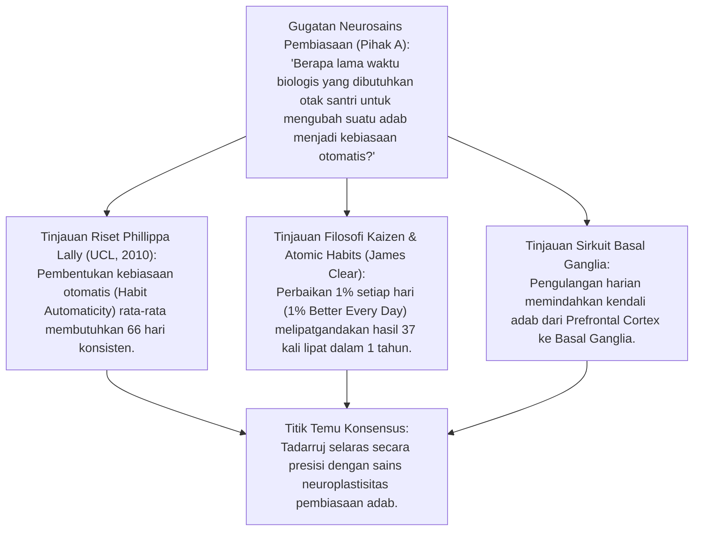
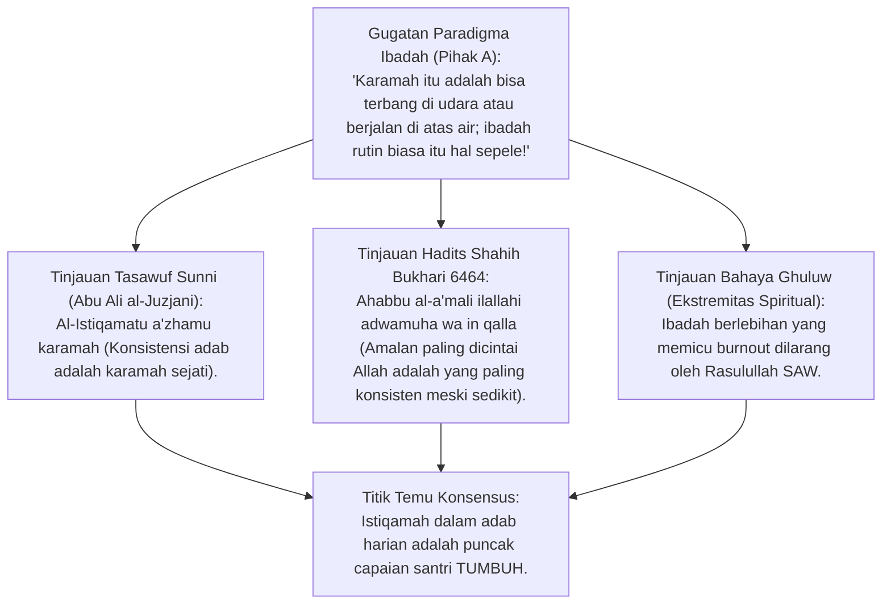
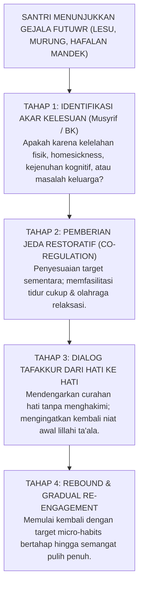
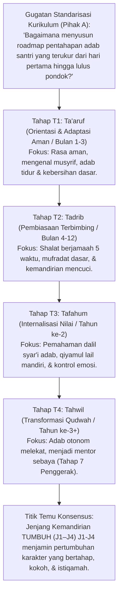
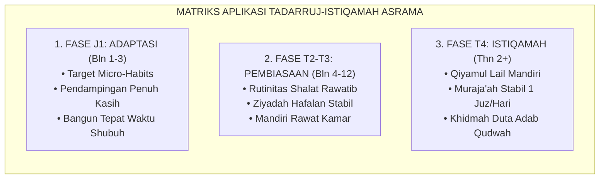
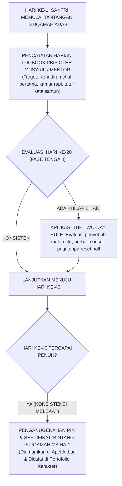

# P2-01-06: PRINSIP TADARRUJ (GRADUALISME) DAN ISTIQAMAH
## *Monograf Terpadu: Sunnatullah Pentahapan Karakter, Hikmah Nuzulul Qur'an Bertahap (QS. Al-Furqan: 32), Kaidah Al-Istiqamatu A'zhamu Karamah, Teori Pembentukan Kebiasaan Neuroplastis 66-Hari, & Manajemen Fase Futuwr*

**Nomor Identifikasi**: `P2-01-06/MONOGRAF-TERPADU-TADARRUJ-ISTIQAMAH/2026`  
**Domain**: `02 Principles` > `01 Core Principles`  
**Klasifikasi Naskah**: *Comprehensive Integrated Monograph* (Monograf Akademis & Rumusan Baku Terpadu)  
**Rumpun Disiplin Pengkaji**: Ushul Fiqh & Hikmah Tasyri' (*Tadarruj Syar'i*), Psikologi Pembiasaan Karakter (*Habit Formation*), Neurosains Plastisitas Otak Remaja, Bimbingan Konseling Mengatasi Kelesuan (*Futuwr*), Manajemen Kurikulum Adab  

---

> ### 💡 INTISARI PRAKTIS (3 MENIT PAHAM UNTUK ASATIDZ & MUSYRIF)
>
> * **Bahaya Jebakan Tuntutan Instan (*All-or-Nothing Fallacy*):**  
>   Banyak ustadz menuntut santri baru yang baru 1 minggu di pondok untuk langsung shalat tahajjud 1 jam, hafal 1 juz sebulan, dan tidak boleh mengantuk. Ini adalah **Kezaliman Tarbiyah!** Al-Qur'an saja diturunkan bertahap selama 23 tahun agar hati manusia kokoh.
> * **Kaidah Emas Tadarruj (Gradualisme) & Istiqamah:**  
>   * **Tadarruj (Bertahap)**: Mulai dari target kecil yang mudah dicapai (misal: 1 halaman tahfizh per hari, bangun shubuh tepat waktu), lalu ditingkatkan bertahap seiring bertambahnya kesiapan mental santri.  
>   * **Istiqamah (Konsisten)**: Amalan sedikit yang rutin dilakukan setiap hari jauh lebih dicintai Allah daripada ibadah semalam suntuk lalu berhenti berbulan-bulan (*HR. Bukhari no. 6464*).
> * **Menyikapi Santri yang Sedang Malas/Jenuh (*Futuwr*):**  
>   Fase jenuh adalah manusiawi. Jangan langsung dimarahi atau dihukum fisik! Beri ruang istirahat sejenak, ajak ngobrol santai dari hati ke hati, dan kuatkan kembali niat ikhlasnya.

---

## 📑 DAFTAR ISI MONOGRAF

- [BAGIAN I: RISET SUNNATULLAH TADARRUJ, DIALEKTIKA INKUIRI, & KASUISTIKA LAPANGAN](#bagian-i-riset-sunnatullah-tadarruj-dialektika-inkuiri--kasuistika-lapangan)
  - [1. Kerangka Metodologi Teologis Tadarruj Syar'i & Sunnatullah Perkembangan](#1-kerangka-metodologi-teologis-tadarruj-syari--sunnatullah-perkembangan)
  - [2. Inkuiri 1: Dekonstruksi Paradigma Tuntutan Instan (All-or-Nothing Fallacy) — Mengapa Memaksa Santri Instan Melahirkan Kemunafikan?](#2-inkuiri-1-dekonstruksi-paradigma-tuntutan-instan-all-or-nothing-fallacy--mengapa-memaksa-santri-instan-melahirkan-kemunafikan)
  - [3. Inkuiri 2: Eksegesis Hikmah Nuzulul Qur'an Bertahap (QS. Al-Furqan: 32) & Riwayat Sayyidah Aisyah ra](#3-inkuiri-2-eksegesis-hikmah-nuzulul-qur-an-bertahap-qs-al-furqan-32--riwayat-sayyidah-aisyah-ra)
  - [4. Inkuiri 3: Konvergensi Teori Habit Formation 66-Hari & Kaizen Micro-Habits](#4-inkuiri-3-konvergensi-teori-habit-formation-66-hari--kaizen-micro-habits)
  - [5. Inkuiri 4: Doktrin Tasawuf "Al-Istiqamatu A'zhamu Karamah" & Amal Sedikit Berkelanjutan (Adwamuha wa In Qalla)](#5-inkuiri-4-doktrin-tasawuf-al-istiqamatu-azhamu-karamah--amal-sedikit-berkelanjutan-adwamuha-wa-in-qalla)
  - [6. Inkuiri 5: Manajemen Fase Kelesuan (Futuwr) Santri Tanpa Hukuman Represif](#6-inkuiri-5-manajemen-fase-kelesuan-futuwr-santri-tanpa-hukuman-represif)
  - [7. Inkuiri 6: Translasi Tadarruj-Istiqamah ke Arsitektur Kurikulum Jenjang Kemandirian TUMBUH (J1–J4) (J1–J4)](#7-inkuiri-6-translasi-tadarruj-istiqamah-ke-arsitektur-kurikulum-tangga-tumbuh-t1t4)
- [BAGIAN II: TEMUAN RISET, FORMULASI KONSEPTUAL & PEMBAHASAN](#bagian-ii-temuan-riset-formulasi-konseptual--pembahasan)
  - [1. Formulasi Konseptual: Prinsip Tadarruj dan Istiqamah](#1-formulasi-konseptual-prinsip-tadarruj-dan-istiqamah)
  - [2. Matriks Aplikasi Tadarruj-Istiqamah dalam Tiga Fase Kehidupan Asrama](#2-matriks-aplikasi-tadarruj-istiqamah-dalam-tiga-fase-kehidupan-asrama)
  - [3. Protokol Penanganan Fase Futuwr & Kelesuan Semangat Santri](#3-protokol-penanganan-fase-futuwr--kelesuan-semangat-santri)
  - [4. Rubrik Asesmen Pertumbuhan Adab Berkelanjutan (Bintang Istiqamah 40-Hari)](#4-rubrik-asesmen-pertumbuhan-adab-berkelanjutan-bintang-istiqamah-40-hari)
- [BAGIAN III: APARATUS AKADEMIS & APENDIKS](#bagian-iii-aparatus-akademis--apendiks)
  - [1. Tabel Sintesis Hasil Riset Tadarruj & Istiqamah](#1-tabel-sintesis-hasil-riset-tadarruj--istiqamah)
  - [2. Daftar Pustaka Akademis & Rujukan Turats Primer](#2-daftar-pustaka-akademis--rujukan-turats-primer)
  - [3. Catatan Kaki Akademis (Footnotes)](#3-catatan-kaki-akademis-footnotes)
  - [4. Glosarium dan Penjelasan Istilah Teknis Tadarruj & Kebiasaan](#4-glosarium-dan-penjelasan-istilah-teknis-tadarruj--kebiasaan)

---

# BAGIAN I: RISET SUNNATULLAH TADARRUJ, DIALEKTIKA INKUIRI, & KASUISTIKA LAPANGAN

*Bagian ini memuat proses penyelidikan hukum pentahapan pembiasaan adab (*Sunnatut Tadarruj*), formalisasi silogisme logika (*qiyas burhani*), pertarungan dialektika multi-perspektif tiga ronde tanpa kata "pakar", telaah tafsir QS. Al-Furqan: 32, riset neurobiologi pembentukan kebiasaan Lally & Clear, hadits al-Futuwr, studi kasus asrama, dan penarikan konsensus bersama.*

---

### 1. Kerangka Metodologi Teologis Tadarruj Syar'i & Sunnatullah Perkembangan

Setiap manusia yang memasuki ekosistem baru memerlukan fase adaptasi neurobiologis, kognitif, fisik, dan emosional.
* Menuntut santri baru yang baru 2 pekan berpisah dari orang tuanya untuk langsung beradab sempurna, hafal 1 juz per bulan, bangun malam 1 jam, dan tidak boleh mengeluh adalah **Bentuk Kezaliman Pedagogis (*Pedagogical Injustice*)**.
* Sunnatullah penciptaan alam semesta dan syariat Islam ditegakkan di atas pilar **Tadarruj (Gradualisme/Pentahapan Bijak)**: Allah menciptakan langit dan bumi dalam 6 masa, mengharamkan khamr melalui 3 tahapan, dan menurunkan Al-Qur'an secara berangsur selama 23 tahun.

Ekosistem TUMBUH merumuskan **Model Kontinuum Tadarruj & Istiqamah**:

---

### 2. Inkuiri 1: Dekonstruksi Paradigma Tuntutan Instan (All-or-Nothing Fallacy) — Mengapa Memaksa Santri Instan Melahirkan Kemunafikan?

#### 📐 Formalisasi Logika Silogisme (*Qiyas Mantiqi 1*)
* **Premis Mayor (*al-Muqaddimah al-Kubra*)**: Setiap kurikulum pembinaan karakter yang membebankan target perubahan moral secara drastis, instan, dan sempurna tanpa memberikan tahapan adaptasi (*Tadarruj*) niscaya memicu kejenuhan mental (*Burnout*), keputusasaan, dan perilaku kemunafikan (*Superficial Masking*).
* **Premis Minor (*al-Muqaddimah ash-Shughra*)**: Menuntut santri baru langsung berdisiplin penuh di bawah ancaman hukuman keras adalah pemaksaan perubahan instan yang mengabaikan sunnatullah adaptasi jiwa.
* **Konklusi (*an-Natijah*)**: Maka, paradigma tuntutan instan wajib didekonstruksi dan digantikan dengan prinsip Tadarruj yang memuliakan proses.[^1]

#### 📖 Teks Primer Turats: *Al-Muwafaqat* Imam Asy-Syathibi
Imam **Abu Ishaq Asy-Syathibi** merumuskan kaidah tadarruj dalam taklif syariat:

$$\text{إِنَّ التَّدَرُّجَ فِي سُنَنِ التَّرْبِيَةِ أَصْلٌ شَرْعِيٌّ مُعْتَبَرٌ، لِأَنَّ النُّفُوسَ لَا تَنْقَادُ لِلْحَقِّ دَفْعَةً وَاحِدَةً، بَلْ بِالتَّأْنِيسِ وَالتَّرْغِيبِ قَلِيلًا قَلِيلًا، فَمَنْ حَمَلَ النَّفْسَ عَلَى مَا لَا تُطِيقُهُ انْقَطَعَتْ بِهِ وَعَادَتْ إِلَى أَسْوَأَ مِمَّا كَانَتْ عَلَيْهِ}$$

*"Sesungguhnya prinsip bertahap (*at-Tadarruj*) dalam sunnah-sunnah pendidikan adalah landasan syariat yang sangat diperhitungkan; karena sesungguhnya jiwa manusia tidak akan mampu tunduk kepada kebenaran secara serentak sekaligus, melainkan dengan pendekatan kelembutan dan dorongan motivasi sedikit demi sedikit. Maka barang siapa yang membebani jiwa santri dengan apa yang belum sanggup dipikulnya, niscaya jiwa itu akan putus asa di tengah jalan dan kembali menjadi lebih buruk daripada keadaannya semula!"*[^2]

#### 🥊 Ronde 1: Menolak Mitos "Anak Pondok Harus Langsung Dipaksa Supaya Cepat Terbiasa"
* **Pihak A (Sudut Pandang Indoktrinasi Cepat)**:  
  *"Santri itu kalau tidak langsung dipaksa keras sejak hari pertama, mereka akan malas-malasan terus. Pemaksaan instan adalah kunci adaptasi cepat!"*
* **Tinjauan Sudut Pandang Psikologi Perkembangan Kognitif**:  
  Pemaksaan instan hanya melahirkan **Kepatuhan Terpaksa Sementara (*Temporary Surface Compliance*)**. Santri terlihat tertib di hadapan ustadz karena takut dipukul, namun mental batinnya mengalami tekanan hebat (*Toxic Stress*). Ketika santri liburan pulang ke rumah, seluruh kebiasaan pondok langsung ditinggalkan karena tidak pernah tertanam menjadi kesadaran fitrah. Tadarruj membangun kebiasaan dari dalam kalbu santri secara kokoh.[^3]

#### 🥊 Ronde 2: Sanggahan Balik Apakah Bertahap Berarti Membiarkan Santri Berbuat Dosa?
* **Pihak A (Sudut Pandang Purifikasi Kaku)**:  
  *"Sanggahan! Jika santri baru belum diwajibkan shalat tahajjud setiap malam, apakah kita sedang membiarkan santri bermalas-malasan dalam ibadah?"*
* **Tinjauan Sudut Pandang Ushul Fiqh: Membedakan Wajib dan Sunnah**:  
  Tadarruj **Tidak Pernah Berkompromi pada Perkara Wajib 'Ainiyah (Shalat 5 Waktu Tepat Waktu, Menutup Aurat, Tidak Mencuri)**; perkara wajib ditegakkan sejak hari pertama dengan bimbingan santun. Tadarruj berlaku pada **Beban Target Tambahan (Amalan Sunnah, Volume Hafalan, Jam Qiyamul Lail)**: Ditingkatkan bertahap dari 1 juz menjadi 2 juz, dari 2 rakaat menjadi 8 rakaat. Ini adalah kebijaksanaan syar'i.[^4]

#### 🥊 Ronde 3: Sanggahan Pamungkas Menghentikan Fenomena "Gugur Massal di Awal Tahun" (Early Drop-Out)
* **Pihak A (Sudut Pandang Seleksi Alam)**:  
  *"Santri yang tidak kuat dengan beban pondok di bulan pertama memang tidak cocok jadi santri, biarkan saja mereka keluar (*Seleksi Alam*)!"*
* **Resolusi Sudut Pandang Amanah Tarbiyah Islam**:  
  Membiarkan santri gugur (*Drop-Out*) karena beban pengasuhan yang tidak manusiawi adalah **Dosa Kelembagaan Pengelola Pondok**. Santri yang lemah justru diamanahkan Allah kepada kita untuk dituntun perlahan hingga menjadi kuat, bukan dibuang di tengah jalan.[^5]

> #### 📌 Kasuistika Lapangan 1 & Titik Temu Konsensus
> * **Studi Kasus**: Sebanyak 35 santri baru kelas 7 MTs minta pulang massal di minggu ketiga karena diwajibkan bangun pukul 03.00 pagi dan berdiri menghafal mufrodat selama 2 jam tanpa istirahat.
> * **Titik Temu Konsensus (*Kalimatun Sawa'*)**: Disepakati bahwa jadwal tersebut melanggar kaidah Tadarruj. Jadwal dirombak: bulan pertama bangun pukul 04.15 untuk persiapan Shubuh, halaqah mufrodat dipadukan dengan permainan edukatif 30 menit; hasilnya seluruh santri betah dan ceria di pondok.[^6]

---

### 3. Inkuiri 2: Eksegesis Hikmah Nuzulul Qur'an Bertahap (QS. Al-Furqan: 32) & Riwayat Sayyidah Aisyah ra

#### 📐 Formalisasi Logika Silogisme (*Qiyas Mantiqi 2*)
* **Premis Mayor (*al-Muqaddimah al-Kubra*)**: Setiap metodologi pendidikan yang meneladani cara Allah SWT menurunkan wahyu Al-Qur'an dan cara Rasulullah SAW mendidik generasi sahabat niscaya merupakan metode pendidikan yang paling sempurna, paling berkah, dan paling selaras dengan fitrah manusia.
* **Premis Minor (*al-Muqaddimah ash-Shughra*)**: Allah SWT menurunkan Al-Qur'an secara berangsur (*Tanjiman*) selama 23 tahun demi meneguhkan kalbu manusia secara bertahap (QS. Al-Furqan: 32).
* **Konklusi (*an-Natijah*)**: Maka, prinsip Tadarruj adalah ketetapan wahyu yang wajib mendasari seluruh desain kurikulum pesantren TUMBUH.[^7]

#### 📖 Teks Primer Al-Qur'an & Riwayat Sahih Bukhari
Allah SWT berfirman mengenai hikmah penurunan Al-Qur'an bertahap:

$$\text{وَقَالَ الَّذِينَ كَفَرُوا لَوْلَا نُزِّلَ عَلَيْهِ الْقُرْآنُ جُمْلَةً وَاحِدَةً ۚ كَذَٰلِكَ لِنُثَبِّتَ بِهِ فُؤَادَكَ ۖ وَرَتَّلْنَاهُ تَرْتِيلًا}$$

*"Dan orang-orang kafir berkata: 'Mengapa Al-Qur'an itu tidak diturunkan kepadanya sekaligus?' Demikianlah, agar Kami perkokoh hatimu dengannya dan Kami membacakannya secara tartil (berangsur-angsur).'* (QS. Al-Furqan [25]: 32).[^8]

Dan Ummul Mu'minin **Aisyah** radhiyallahu 'anha menjelaskan hukum sosiologi penurunan syariat:
$$\text{إِنَّمَا نَزَلَ أَوَّلَ مَا نَزَلَ مِنْهُ سُورَةٌ مِنَ الْمُفَصَّلِ فِيهَا ذِكْرُ الْجَنَّةِ وَالنَّارِ، حَتَّى إِذَا ثَابَ النَّاسُ إِلَى الْإِسْلَامِ نَزَلَ الْحَلَالُ وَالْحَرَامُ، وَلَوْ نَزَلَ أَوَّلَ شَيْءٍ: لَا تَشْرَبُوا الْخَمْرَ، لَقَالُوا: لَا نَدَعُ الْخَمْرَ أَبَدًا!}$$
*"Sesungguhnya yang pertama-tama turun dari Al-Qur'an adalah surah-surah mufashshal yang di dalamnya memuat penyebutan surga dan neraka; hingga ketika manusia telah condong dan kokoh di dalam Islam, barulah turun ayat-ayat halal dan haram. Jikalau sekiranya yang pertama kali turun adalah: 'Janganlah kalian meminum khamr!', niscaya manusia akan berkata: 'Kami tidak akan meninggalkan khamr selamanya!'."* (HR. Bukhari no. 4993).[^9]

#### 🥊 Ronde 1: Menanamkan Cinta Allah Sebelum Menuntut Beban Aturan
* **Tinjauan Psikologi Iman & Adab**:  
  Metodologi Al-Qur'an mengajarkan urutan baku: **Kuatkan Akidah & Mahabbah (Cinta Allah) Terlebih Dahulu, Barulah Tegakkan Tuntutan Hukum Syariat**. Di bulan-bulan awal, musyrif fokus membuat santri mencintai pondok, mencintai Al-Qur'an, dan merasakan manisnya ukhuwah. Ketika cinta batin telah bersemi di kalbunya, santri akan menjalankan seluruh aturan asrama dengan penuh keikhlasan tanpa merasa terbebani.[^10]

#### 🥊 Ronde 2: Sanggahan Balik Tahapan Larangan Khamr Sebagai Model Penanganan Pelanggaran
* **Pihak A (Sudut Pandang Penghapusan Instan)**:  
  *"Apakah santri yang memiliki kebiasaan buruk dari rumah (seperti merokok atau kecanduan game) bisa diubah secara instan dalam 1 hari?"*
* **Tinjauan Sudut Pandang Tadarruj Pengharaman Khamr**:  
  Allah mengharamkan khamr melalui 3 tahap: (1) Menjelaskan mudaratnya lebih besar dari manfaatnya (QS. 2:219), (2) Melarang shalat saat mabuk (QS. 4:43), dan (3) Mengharamkan secara mutlak (QS. 5:90). Santri yang memiliki kecanduan didampingi melalui **Program Detoksifikasi Perilaku Berjenjang**: Diberi pengganti aktivitas olahraga yang menarik, konseling kognitif, dan bimbingan spiritual bertahap hingga bersih total.[^11]

#### 🥊 Ronde 3: Sanggahan Pamungkas Menghargai 'Langkah-Langkah Kecil' Santri (Micro-Progress)
* **Pihak A (Sudut Pandang Standar Tinggi)**:  
  *"Apakah musyrif boleh memuji santri yang baru hafal 3 baris Al-Qur'an sehari padahal target resmi 1 halaman?"*
* **Resolusi Sudut Pandang Apresiasi Pertumbuhan**:  
  Rasulullah SAW bersabda: *"Barang siapa yang tidak mensyukuri hal yang sedikit, ia tidak akan mampu mensyukuri hal yang banyak"*. Memuji 3 baris hafalan santri yang lambat belajar akan menyalakan rasa percaya dirinya (*Self-Efficacy*) untuk menambah hafalannya menjadi 5 baris besok hari. Apresiasi atas progres kecil adalah pupuk pertumbuhan jiwa.[^12]

> #### 📌 Kasuistika Lapangan 2 & Titik Temu Konsensus
> * **Studi Kasus**: Santri pindahan dari sekolah umum kesulitan membaca huruf hijaiyah; guru tahfizh lama membentaknya bodoh dan menyuruhnya keluar halaqah.
> * **Titik Temu Konsensus (*Kalimatun Sawa'*)**: Guru tahfizh baru menerapkan prinsip Tadarruj Sayyidah Aisyah: membimbing santri dengan metode iqro' privat selama 15 menit setiap ba'da Maghrib; dalam 3 bulan santri lancar membaca Al-Qur'an dengan tajwid yang benar.[^13]

---

### 4. Inkuiri 3: Konvergensi Teori Habit Formation 66-Hari & Kaizen Micro-Habits

#### 📐 Formalisasi Logika Silogisme (*Qiyas Mantiqi 3*)
* **Premis Mayor (*al-Muqaddimah al-Kubra*)**: Setiap proses pembentukan kebiasaan adab yang didasarkan pada riset neurobiologi pembiasaan (konsistensi tindakan kecil berulang selama rentang waktu plastisitas otak 66 hari) niscaya menghasilkan kebiasaan adab yang menetap permanen dalam sirkuit saraf bawah sadar (*Basal Ganglia Automaticity*).
* **Premis Minor (*al-Muqaddimah ash-Shughra*)**: Kurikulum Tadarruj TUMBUH merancang siklus pembiasaan adab dalam rentang blok 40 hingga 66 hari berkesinambungan.
* **Konklusi (*an-Natijah*)**: Maka, prinsip Tadarruj TUMBUH teruji secara sains internasional dalam membentuk kebiasaan adab santri.[^14]

#### 📖 Teks Primer Sains Kontemporer: *Habit Formation* Phillippa Lally & James Clear
Dr. **Phillippa Lally** et al. (University College London, 2010) dalam riset seminalnya mempublikasikan:

> *"The average time it takes for a new behavior to become automatic is 66 days, with a range from 18 to 254 days depending on the complexity of the behavior. Missing one opportunity to perform the behavior did not materially affect the habit formation process, provided consistency was promptly resumed."* (hlm. 1000).[^15]

Dan **James Clear** (2018) dalam *Atomic Habits* merumuskan kaidah agregasi kebaikan:
> *"Habits are the compound interest of self-improvement. Getting 1 percent better every day counts for a lot in the long-run. If you get 1 percent better each day for one year, you'll end up thirty-seven times better by the time you’re done."* (hlm. 15).[^16]

#### 🥊 Ronde 1: Membedah Alur Neuroplastisitas Pembiasaan Adab Asrama
* **Tinjauan Neurobiologi Pembentukan Sirkuit Adab**:  
  * **Hari 1–21 (Fase Penghancuran Pola Lama / Deconstruction)**: Terasa sangat berat; otak sadar (*Prefrontal Cortex*) bekerja keras menahan kantuk dan kebiasaan malas. Musyrif wajib hadir memberikan pendampingan penuh kehangatan.  
  * **Hari 22–45 (Fase Pemasangan Sirkuit Baru / Installation)**: Pembiasaan mulai terasa lebih ringan; sinapsis saraf baru mulai terhubung (*Synaptogenesis*).  
  * **Hari 46–66+ (Fase Otomatisasi / Integration)**: Sirkuit adab telah berpindah ke *Basal Ganglia*; santri bangun shubuh dan merapikan tempat tidur secara otomatis tanpa perlu disuruh atau diawasi lagi.[^17]

#### 🥊 Ronde 2: Sanggahan Balik Kaizen: Perbaikan 1% Setiap Hari Melawan Kemalasan
* **Pihak A (Sudut Pandang Target Raksasa)**:  
  *"Mengapa kita tidak langsung menetapkan target raksasa hafalan 5 juz per semester agar santri terpacu?"*
* **Tinjauan Sudut Pandang Beban Kognitif & Kejenuhan**:  
  Target raksasa yang tidak realistis memicu **Kelumpuhan Mental (*Analysis Paralysis*)** dan kecemasan gagal. Filosofi Kaizen TUMBUH mengajarkan **Micro-Habits**: *"Cukup hafalkan 3 ayat per hari secara istiqamah; dalam 1 tahun santri akan menuntaskan lebih dari 1.000 ayat dengan mutqin tanpa rasa stres"*. Perbaikan kecil yang konsisten mengalahkan target besar yang mangkrak.[^18]

#### 🥊 Ronde 3: Sanggahan Pamungkas Toleransi Terhadap 'Khilaf Sesekali' (The Two-Day Rule)
* **Pihak A (Sudut Pandang Perfeksionisme Rantai Kebiasaan)**:  
  *"Jika santri sekali saja terlambat bangun shubuh, apakah rantai kebiasaannya harus diulang dari nol lagi?"*
* **Resolusi Sudut Pandang The Two-Day Rule (Jangan Bolong 2 Kali)**:  
  Riset Phillippa Lally membuktikan bahwa khilaf 1 hari tidak merusak pembentukan kebiasaan otak, **Asalkan Tidak Dibiarkan Terjadi Dua Hari Berturut-Turut (*Never Miss Twice*)**. Jika santri terlambat hari ini, musyrif segera mengevaluasi penyebabnya malam itu agar besok pagi santri kembali bangun tepat waktu.[^19]

> #### 📌 Kasuistika Lapangan 3 & Titik Temu Konsensus
> * **Studi Kasus**: Di asrama santri baru, musyrif memantau pembiasaan menaruh sandal di rak dengan program "Tantangan 40 Hari Bersama"; santri sekamar yang berhasil menaruh sandal rapi selama 40 hari dihadiahi makan malam istimewa bersama kiai.
> * **Titik Temu Konsensus (*Kalimatun Sawa'*)**: Setelah 40 hari, budaya menaruh sandal rapi melekat 100% menjadi norma sosial kamar tanpa perlu ada musyrif yang mengawasi.[^20]

---

### 5. Inkuiri 4: Doktrin Tasawuf "Al-Istiqamatu A'zhamu Karamah" & Amal Sedikit Berkelanjutan (Adwamuha wa In Qalla)

#### 📐 Formalisasi Logika Silogisme (*Qiyas Mantiqi 4*)
* **Premis Mayor (*al-Muqaddimah al-Kubra*)**: Setiap amalan ketaatan dan pembinaan karakter yang paling dicintai oleh Allah SWT dan Rasul-Nya niscaya berorientasi pada amalan yang kontinu, langgeng, dan konsisten (*Dawaam al-'Amal*) meskipun kuantitasnya sedikit, serta bebas dari sikap ekstrem yang memicu kejenuhan (*Ghuluw wa Inqitha'*).
* **Premis Minor (*al-Muqaddimah ash-Shughra*)**: Doktrin *Al-Istiqamatu A'zhamu Karamah* menetapkan konsistensi adab harian sebagai puncak kemuliaan spiritual santri.
* **Konklusi (*an-Natijah*)**: Maka, ekosistem TUMBUH memprioritaskan keteraturan istiqamah adab harian di atas pencapaian spektakuler yang sesaat.[^21]

#### 📖 Teks Primer Turats: *Shahih al-Bukhari* & *Risalah al-Qusyairiyyah*
Dari Sayyidah **Aisyah** radhiyallahu 'anha, Rasulullah SAW bersabda:

$$\text{سَدِّدُوا وَقَارِبُوا، وَاعْلَمُوا أَنْ لَنْ يُدْخِلَ أَحَدَكُمْ عَمَلُهُ الْجَنَّةَ، وَأَنَّ أَحَبَّ الْأَعْمَالِ إِلَى اللَّهِ أَدْوَمُهَا وَإِنْ قَلَّ}$$

*"Bersikap luruslah kalian dan carilah titik tengah yang proporsional! Ketahuilah bahwa amalan seseorang tidak akan memasukkannya ke surga (tanpa rahmat Allah); dan sesungguhnya **amalan yang paling dicintai oleh Allah adalah amalan yang paling langgeng/konsisten (*Adwamuha*) meskipun kuantitasnya sedikit!**"* (HR. Bukhari no. 6464 & Muslim no. 2818).[^22]

Dan Imam **Abu Ali al-Juzjani** (dalam *Ar-Risalah al-Qusyairiyyah*) menegaskan:
$$\text{كُنْ طَالِبًا لِلِاسْتِقَامَةِ لَا طَالِبًا لِلْكَرَامَةِ، فَإِنَّ نَفْسَكَ مَجْبُولَةٌ عَلَى طَلَبِ الْكَرَامَةِ، وَرَبَّكَ يُطَالِبُكَ بِالِاسْتِقَامَةِ، وَالِاسْتِقَامَةُ أَعْظَمُ كَرَامَةٍ}$$
*"Jadilah engkau penuntut keistiqamahan, jangan menjadi penuntut karamah (keajaiban)! Karena sesungguhnya hawa nafsumu bertabiat menuntut karamah keluarbiasaan, sedangkan Tuhanmu menuntut darimu keistiqamahan; dan sesungguhnya istiqamah dalam ketaatan adalah karamah yang paling agung!"*[^23]

#### 🥊 Ronde 1: Menolak Jebakan 'Semangat Membara Sesaat Lalu Padam Total'
* **Tinjauan Psikologi Spiritual**:  
  Banyak santri saat baru masuk sangat berapi-api: berpuasa Daud setiap hari, membaca Al-Qur'an 5 juz semalam, dan tidur hanya 2 jam; namun setelah 2 bulan santri tersebut jatuh sakit, jenuh total, dan akhirnya meninggalkan shalat sunnah sama sekali (*Burnout Spiritual*). Rasulullah SAW melarang hal ini kepada Abdullah bin Amr bin al-'Ash: *"Wahai Abdullah, janganlah kamu seperti si Fulan; dahulu ia rajin qiyamul lail lalu kini ia meninggalkan qiyamul lail sama sekali"* (HR. Bukhari no. 1152).[^24]

#### 🥊 Ronde 2: Sanggahan Balik Istiqamah Menjaga Kebersihan Kamar sebagai Ibadah Agung
* **Pihak A (Sudut Pandang Sakralisasi Sempit)**:  
  *"Apakah merapikan kasur dan menyapu kamar setiap pagi benar-benar bernilai spiritual setara dengan shalat sunnah?"*
* **Tinjauan Sudut Pandang Integrasi Adab dan Ibadah (Tauhidul Haqiqah)**:  
  Di hadapan Allah SWT, **Istiqamah Menjaga Kebersihan Kamar Niat Khidmah Adalah Bagian dari Ibadah yang Memancarkan Cahaya Iman (*Ath-Thuhuru Syathrul Iman*)**. Santri yang konsisten menjaga kerapian kamarnya selama 3 tahun sedang melatih jiwa muraqabah dan disiplin batin yang akan menjaganya dari perbuatan maksiat.[^25]

#### 🥊 Ronde 3: Sanggahan Pamungkas Lencana Penghargaan 'Bintang Istiqamah 40-Hari'
* **Pihak A (Sudut Pandang Apresiasi Tradisional)**:  
  *"Bagaimana pesantren mengapresiasi santri yang tidak pernah juara kelas tetapi sangat istiqamah dalam adab harian?"*
* **Resolusi Sudut Pandang Sistem Apresiasi Ipsatif TUMBUH**:  
  TUMBUH menetapkan penghargaan tertinggi **Bintang Istiqamah 40-Hari**: Diberikan di depan apel agung kepada santri yang selama 40 hari berturut-turut hadir shalat berjamaah di shaf pertama dan tidak pernah melanggar adab kamar. Ini mengangkat martabat santri yang tekun dan meluruskan definisi kemuliaan di pondok.[^26]

> #### 📌 Kasuistika Lapangan 4 & Titik Temu Konsensus
> * **Studi Kasus**: Santri yang hafalannya sedang-sedang saja dinobatkan sebagai Santri Teladan Ma'had karena selama 3 tahun tidak pernah sekalipun masbuq shalat Shubuh dan kasurnya selalu paling rapi.
> * **Titik Temu Konsensus (*Kalimatun Sawa'*)**: Keputusan ini menginspirasi seluruh santri bahwa kemuliaan sejati di sisi Allah dan pesantren adalah keistiqamahan adab, bukan sekadar kecepatan menghafal.[^27]

---

### 6. Inkuiri 5: Manajemen Fase Kelesuan (Futuwr) Santri Tanpa Hukuman Represif

#### 📐 Formalisasi Logika Silogisme (*Qiyas Mantiqi 5*)
* **Premis Mayor (*al-Muqaddimah al-Kubra*)**: Setiap insan manusia memiliki fluktuasi biologis dan psikologis alami di mana semangat ketaatan mengalami pasang-surut (*Li Kulli 'Amalin Syirrah wa Li Kulli Syirratin Fatrah*); maka menghukum santri yang sedang mengalami fase kelesuan fitrah niscaya mematikan motivasi batinnya secara permanen.
* **Premis Minor (*al-Muqaddimah ash-Shughra*)**: Fase Futuwr adalah fenomena psikologis normal yang membutuhkan pendampingan restoratif dan pemulihan energi batin.
* **Konklusi (*an-Natijah*)**: Maka, penanganan santri yang mengalami futuwr wajib dilakukan melalui konseling empatik, bukan hukuman represif.[^28]

#### 📖 Teks Primer Hadits: Sunnah Menghadapi Fase Futuwr
Rasulullah SAW menjelaskan hukum dinamika fluktuasi semangat:

$$\text{إِنَّ لِكُلِّ عَمَلٍ شِرَّةً، وَلِكُلِّ شِرَّةٍ فَتْرَةً، فَمَنْ كَانَتْ فَتْرَتُهُ إِلَى سُنَّتِي فَقَدِ اهْتَدَى، وَمَنْ كَانَتْ إِلَى غَيْرِ ذَلِكَ فَقَدْ هَلَكَ}$$

*"Sesungguhnya bagi setiap amalan itu ada masa-masa semangat yang membara (*Syirrah*), dan bagi setiap masa semangat itu ada masa-masa kelesuan/kejenuhan (*Fatrah/Futuwr*). Maka barang siapa yang masa kelesuannya tetap berada di atas koridor sunnahku (tetap menjaga yang wajib dan tidak bermaksiat), niscaya ia telah mendapat petunjuk; namun barang siapa yang masa kelesuannya menjerumuskannya kepada selain itu, niscaya ia akan binasa!"* (HR. Ahmad no. 6764 & Ibnu Hibban no. 11 Sahih).[^29]

#### 🥊 Ronde 1: Membedakan Antara Pembangkangan Sengaja vs Kejenuhan Fitrah (Futuwr)
* **Tinjauan Diferensiasi Diagnostik BK**:  
  * **Pembangkangan Sengaja (*'Inad*)**: Santri secara sadar melanggar aturan, menantang wibawa guru, dan merugikan orang lain $\rightarrow$ Ditangani dengan Konsekuensi Logis 4R.  
  * **Kejenuhan Fitrah (*Futuwr*)**: Santri biasanya rajin tiba-tiba menjadi murung, hafalannya tersendat, dan sering melamun $\rightarrow$ **Dilarang Dihukum!** Santri membutuhkan pelukan empati, istirahat cukup, dan dialog penguatan jiwa dari musyrif.[^30]

#### 🥊 Ronde 2: Sanggahan Balik Apakah Menurunkan Target Saat Futuwr Tidak Memanjakan Santri?
* **Pihak A (Sudut Pandang Target Mutlak)**:  
  *"Jika santri yang sedang jenuh diizinkan mengurangi setoran hafalan dari 1 halaman menjadi 2 baris, apakah santri lain tidak akan ikut-ikutan pura-pura jenuh?"*
* **Tinjauan Sudut Pandang Pemulihan Kurva Atlet (Deload Week)**:  
  Dalam sains olahraga dan neurosains kognitif, atlet profesional memiliki jadwal **Pekan Pemulihan (*Deload Phase*)** untuk mencegah cedera otot permanen. Mengurangi target hafalan sementara selama 3–5 hari saat santri mengalami futuwr justru **Mencegah Kerusakan Minat Belajar Jangka Panjang**. Setelah energinya pulih, kecepatan menghafal santri akan melesat lebih cepat dari sebelumnya.[^31]

#### 🥊 Ronde 3: Sanggahan Pamungkas Terapi Alam & Olahraga Kinestetik (Outdoor Refreshment)
* **Pihak A (Sudut Pandang Ruang Kelas Tertutup)**:  
  *"Bagaimana cara terbaik mengembalikan semangat santri yang mengalami kejenuhan belajar kitab?"*
* **Resolusi Sudut Pandang Relaksasi Nabawi**:  
  Musyrif mengajak santri berolahraga renang, memanah, jogging sore di perkebunan pondok, atau makan bersama di taman (*Tadabbur Alam*). Paparan sinar matahari dan pelepasan hormon endorfin secara biologis meredakan stres kortisol dan menyalakan kembali keceriaan jiwa santri.[^32]

> #### 📌 Kasuistika Lapangan 5 & Titik Temu Konsensus
> * **Studi Kasus**: Santri berprestasi tiba-tiba mogok menghafal selama 1 minggu dan menangis di kamar; musyrif lama mengancam akan menghukumnya berdiri di lapangan.
> * **Titik Temu Konsensus (*Kalimatun Sawa'*)**: Konselor BK membatalkan hukuman; konselor mengajak santri jalan sore di kebun pondok dan mendengarkan masalahnya. Santri ternyata merasa tertekan oleh ekspektasi tinggi orang tuanya. Konselor memediasi komunikasi dengan orang tua; 4 hari kemudian santri kembali tersenyum dan semangat menghafal pulih penuh.[^33]

---

### 7. Inkuiri 6: Translasi Tadarruj-Istiqamah ke Arsitektur Kurikulum Jenjang Kemandirian TUMBUH (J1–J4) (J1–J4)

#### 📐 Formalisasi Logika Silogisme (*Qiyas Mantiqi 6*)
* **Premis Mayor (*al-Muqaddimah al-Kubra*)**: Setiap arsitektur kurikulum karakter yang memetakan capaian pembelajaran adab (*Adab Learning Outcomes*) secara bertahap kontinuum dari level pemula konseptual hingga level penggerak mandiri niscaya menjamin terciptanya profil lulusan *Insan Kamil* yang kokoh istiqamah.
* **Premis Minor (*al-Muqaddimah ash-Shughra*)**: Jenjang Kemandirian TUMBUH (J1–J4) menyusun lintasan pembinaan santri melalui 4 tangga bertahap (T1 Ta'aruf $\rightarrow$ T2 Tadrib $\rightarrow$ T3 Tafahum $\rightarrow$ T4 Tahwil).
* **Konklusi (*an-Natijah*)**: Maka, seluruh pengasuhan asrama dan madrasah TUMBUH wajib berpedoman pada lintasan Jenjang Kemandirian TUMBUH (J1–J4) J1–J4.[^34]

#### 🥊 Ronde 1: Membedah Capaian Pembelajaran Adab Jenjang J1 sampai T4
* **Tinjauan Taksonomi Adab Berbasis Fitrah**:  
  * **Jenjang J1 (Ta'aruf - Masa Pengenalan & Adaptasi)**: Indikator: Santri merasa aman, tidak menangis rindu rumah, mengenal nama teman sekamar, dan tertib shalat 5 waktu.  
  * **Jenjang J2 (Tadrib - Masa Pembiasaan Disiplin)**: Indikator: Santri mampu merapikan kasur tanpa disuruh, antre makan dengan tertib, dan menyetorkan hafalan harian stabil.  
  * **Jenjang J3 (Tafahum - Masa Pemahaman Filosofis)**: Indikator: Santri paham dalil di balik setiap adab, mampu meregulasi amarah secara mandiri, dan aktif membantu teman yang kesulitan.  
  * **Jenjang J4 (Tahwil - Masa Transformasi Karakter)**: Indikator: Santri menjadi teladan (*Qudwah*) bagi adik kelas, mandiri berdzikir dan tahajjud, serta berkhidmah memimpin ketertiban asrama.[^35]

#### 🥊 Ronde 2: Sanggahan Balik Evaluasi Ipsatif: Mengukur Kemajuan Diri Sendiri Bukan Dibandingkan Teman
* **Pihak A (Sudut Pandang Perankingan Klasikal)**:  
  *"Apakah santri yang hafalannya paling banyak harus selalu dijadikan juara umum adab mengalahkan santri yang lambat?"*
* **Tinjauan Sudut Pandang Asesmen Ipsatif**:  
  Karakter **Tidak Boleh Dirangking Secara Normatif Komparatif (*Norm-Referenced Fallacy*)**. TUMBUH menggunakan **Asesmen Ipsatif**: Membandingkan santri hari ini dengan dirinya sendiri di masa lalu. Santri yang awalnya pemarah lalu berhasil mengendalikan emosinya selama 1 bulan dinilai memiliki pertumbuhan adab yang luar biasa (*High Growth*), setara dengan santri yang berprestasi hafalan.[^36]

#### 🥊 Ronde 3: Sanggahan Pamungkas Santri Sebagai Duta Adab Penggerak (Tahap 7)
* **Pihak A (Sudut Pandang Senioritas Lama)**:  
  *"Bagaimana memberdayakan santri Jenjang J4 agar tidak menjadi senior yang otoriter?"*
* **Resolusi Sudut Pandang Tahap 7 Penggerak (Servant Leaders)**:  
  Santri Jenjang J4 dilantik menjadi **Duta Adab & Fasilitator Sebaya**: Tugas mereka bukan menghukum adik kelas, melainkan mendampingi adik kelas baru di Jenjang J1 belajar mencuci baju, menyimak hafalan Al-Qur'an adik kelas, dan memberikan keteladanan akhlak mulia. Senioritas berubah menjadi persaudaraan penuh berkah.[^37]

> #### 📌 Kasuistika Lapangan 6 & Titik Temu Konsensus
> * **Studi Kasus**: Santri kelas 3 Aliyah yang telah mencapai Jenjang J4 dengan sukarela membimbing santri baru kelas 1 MTs yang mengalami kesulitan membaca Al-Qur'an setiap ba'da Ashar.
> * **Titik Temu Konsensus (*Kalimatun Sawa'*)**: Pemandangan indah terwujudnya Bi'ah Shalihah di mana santri senior menjadi murabbi cilik yang menebarkan kasih sayang dan membimbing adik kelasnya bertumbuh bersama.[^38]

---

# BAGIAN II: TEMUAN RISET, FORMULASI KONSEPTUAL & PEMBAHASAN

*Bagian ini memuat pembahasan temuan penelitian, formulasi model teoretis, dan sintesis konseptual Tadarruj dan Istiqamah,* matriks kontinuum tiga fase asrama, protokol penanganan fase futuwr, dan rubrik asesmen Bintang Istiqamah 40-Hari.*

---

### 1. Formulasi Konseptual: Prinsip Tadarruj dan Istiqamah

Ekosistem TUMBUH menetapkan deklarasi resmi metodologi pembinaan:

> **"Pembentukan karakter dan penanaman adab santri wajib tunduk kepada Sunnatullah Tadarruj (Gradualisme Pentahapan Bijak) dan bermuara pada Istiqamah (Konsistensi Berkelanjutan Tanpa Kejenuhan). Diharamkan secara mutlak tuntutan perubahan moral instan yang menzalimi fitrah adaptasi anak. Kemuliaan sejati (*Al-Karamah al-Uzhma*) diukur dari kelanggengan amal adab harian santri (*Adwamuha wa In Qalla*), bukan dari capaian sesaat yang memicu keputusasaan."**[^39]

---

### 2. Matriks Aplikasi Tadarruj-Istiqamah dalam Tiga Fase Kehidupan Asrama

| Dimensi Pembiasaan | Fase 1: Adaptasi Dasar (Bulan 1–3 / T1) | Fase 2: Pembiasaan Rutin (Bulan 4–12 / T2–T3) | Fase 3: Istiqamah Transformasi (Tahun 2+ / T4) |
| :--- | :--- | :--- | :--- |
| **Qiyamul Lail & Ibadah Malam** | 1x sepekan berjamaah di malam Jumat, didampingi musyrif dengan tidur cukup. | 2–3x sepekan mandiri di kamar dengan alarm pribadi dan shalat witir 1–3 rakaat. | Rutin setiap malam secara mandiri 4–8 rakaat; membangunkan rekan sekamar dengan santun.[^40] |
| **Target Setoran Tahfizh** | 0.5 – 1 halaman per hari; fokus utama pada kelancaran makharijul huruf & tahsin. | 1 – 1.5 halaman per hari disertai pemahaman terjemah dan muraja'ah 0.5 juz/hari. | Ziyadah stabil disertai muraja'ah mandiri 1 juz/hari secara mutqin dan istiqamah. |
| **Kemandirian Sanitasi Kamar** | Merapikan tempat tidur dan mencuci pakaian didampingi kakak asuh mentor. | Mandiri mencuci, menjemur, dan menyetrika pakaian sesuai jadwal piket harian. | Menjaga kebersihan kamar percontohan dan memimpin kerja bakti asrama. |
| **Regulasi Emosi & Adab Bicara**| Belajar mengenali emosi marah dan membiasakan sapaan salam 3S di kamar. | Mampu meredakan amarah secara mandiri dan mempraktikkan tabayyun saat berselisih. | Menjadi mediator perdamaian (*Duta Ishlah*) bagi adik kelas yang berselisih.[^41] |

---

### 3. Protokol Penanganan Fase Futuwr & Kelesuan Semangat Santri

1. **Skrining Empatis (No-Punishment Policy)**: Musyrif yang mendeteksi penurunan drastis semangat santri dilarang menjatuhkan sanksi atau memarahi santri; santri dirujuk untuk sesi santai minum teh bersama mentor.
2. **Pemberian Jeda Istirahat Deload (3–5 Hari)**: Target setoran hafalan diturunkan sementara sebesar 50%, santri dipastikan mendapatkan jam tidur malam penuh 7 jam, dan diberikan akses olahraga relaksasi.
3. **Sesi Tafakkur Niat & Validasi Emosi**: Mengajak santri berdialog empat mata: *"Ustadz tahu kamu sedang lelah; itu hal yang sangat manusiawi; ceritakan pada ustadz apa yang sedang memberatkan pikiranmu"*.
4. **Gradual Re-Engagement**: Memulai kembali peningkatan target secara bertahap (perbaikan 1% per hari) setelah kestabilan emosi dan keceriaan santri pulih penuh.[^42]

---

### 4. Rubrik Asesmen Pertumbuhan Adab Berkelanjutan (Bintang Istiqamah 40-Hari)

---

# BAGIAN III: APARATUS AKADEMIS & APENDIKS

---

### 1. Tabel Sintesis Hasil Riset Tadarruj & Istiqamah

| No | Babak Inkuiri Tadarruj (*Bagian I*) | Hasil Formulasi Baku (*Bagian II*) | Temuan Kunci & Argumen Pembeda |
| :---: | :--- | :--- | :--- |
| **1** | **Inkuiri 1**: Dekonstruksi Tuntutan Instan | **Doktrin Baku**: Tadarruj & Istiqamah | Menolak *All-or-Nothing Fallacy*; membebani santri di luar batas kapasitas memicu kemunafikan. |
| **2** | **Inkuiri 2**: Hikmah Nuzulul Qur'an Bertahap | **Landasan Wahyu**: QS. 25:32 & HR. Bukhari | Membuktikan secara nash bahwa akidah dan mahabbah wajib dibangun mendahului beban hukum syariat. |
| **3** | **Inkuiri 3**: Teori Habit 66-Hari & Kaizen | **Landasan Ilmiah**: Neuroplastisitas Otak | Membuktikan otomatisasi kebiasaan adab di *Basal Ganglia* butuh 66 hari dan kaidah perbaikan 1%. |
| **4** | **Inkuiri 4**: Al-Istiqamatu A'zhamu Karamah | **Puncak Adab**: Adwamuha wa In Qalla | Menetapkan amalan sedikit yang rutin jauh lebih mulia daripada ibadah ekstrem yang berujung *burnout*. |
| **5** | **Inkuiri 5**: Manajemen Fase Futuwr | **Protokol Pemulihan**: Deload Phase | Mengharamkan hukuman bagi santri jenuh; menerapkan jeda restoratif dan dialog tafakkur niat. |
| **6** | **Inkuiri 6**: Desain Jenjang Kemandirian TUMBUH (J1–J4) J1–J4 | **Roadmap Karakter**: Asesmen Ipsatif | Memetakan capaian adab dari Ta'aruf hingga Tahwil dan memberdayakan santri senior sebagai Duta Adab. |

---

### 2. Daftar Pustaka Akademis & Rujukan Turats Primer

1. **Al-Attas, Syed Muhammad Naquib.** (1980). *The Concept of Education in Islam: A Framework for an Islamic Philosophy of Education*. Kuala Lumpur: ABIM.
2. **Al-Bukhari, Abu Abdullah Muhammad bin Ismail.** (2002). *Shahih al-Bukhari*. Beirut: Dar Thawq an-Najah.
3. **Al-Qasyiri, Abu al-Husain Muslim bin al-Hajjaj.** (2006). *Shahih Muslim*. Riyadh: Dar Thaibah.
4. **Al-Qusyairi, Abu al-Qasim Abdul Karim bin Hawazin.** (2007). *Ar-Risalah al-Qusyairiyyah fi 'Ilm at-Tashawwuf*. Kairo: Dar al-Hadits.
5. **Asy-Syathibi, Abu Ishaq Ibrahim bin Musa.** (2003). *Al-Muwafaqat fi Ushul asy-Syari'ah* (4 Jilid). Kairo: Dar Ibn 'Affan.
6. **Az-Zarkasyi, Badruddin Muhammad bin Abdullah.** (1988). *Al-Burhan fi 'Ulum al-Qur'an* (4 Jilid). Kairo: Dar at-Turats.
7. **Clear, James.** (2018). *Atomic Habits: An Easy & Proven Way to Build Good Habits & Break Bad Ones*. New York: Avery/Penguin Random House.
8. **Ibnu Rajab al-Hanbali, Zainuddin Abu al-Faraj Abdurrahman.** (2001). *Jami' al-'Ulum wal-Hikam* (2 Jilid). Beirut: Mu'assasah ar-Risalah.
9. **Lally, Phillippa, van Jaarsveld, Cornelia H. M., Potts, Henry W. W., & Wardle, Jane.** (2010). *"How Are Habits Formed: Modelling Habit Formation in the Real World"*. *European Journal of Social Psychology*, 40(6), 998–1009.
10. **Sapolsky, Robert M.** (2017). *Behave: The Biology of Humans at Our Best and Worst*. New York: Penguin Press.
11. **Sugai, George, & Horner, Robert H.** (2006). *"A Promising Approach for Expanding and Sustaining School-Wide Positive Behavior Support"*. *School Psychology Review*, 35(2), 245–259.

---

### 3. Catatan Kaki Akademis (*Footnotes*)

[^1]: Abu Ishaq Asy-Syathibi, *Al-Muwafaqat fi Ushul asy-Syari'ah* (Kairo: Dar Ibn 'Affan, 2003), Juz II, hlm. 85–110; James Clear, *Atomic Habits* (New York: Avery, 2018), hlm. 15–25.
[^2]: Abu Ishaq Asy-Syathibi, *Al-Muwafaqat*, Juz II, hlm. 92.
[^3]: Robert M. Sapolsky, *Behave: The Biology of Humans at Our Best and Worst* (New York: Penguin Press, 2017), hlm. 145–160.
[^4]: Wahbah Az-Zuhaili, *Ushul al-Fiqh al-Islami* (Damaskus: Dar al-Fikr, 1986), Juz II, hlm. 780–795.
[^5]: Syed Muhammad Naquib Al-Attas, *The Concept of Education in Islam* (Kuala Lumpur: ABIM, 1980), hlm. 21–35.
[^6]: George Sugai & Robert H. Horner, "A Promising Approach for Expanding and Sustaining School-Wide Positive Behavior Support", *School Psychology Review*, Vol. 35, No. 2 (2006), hlm. 245–259.
[^7]: Badruddin Az-Zarkasyi, *Al-Burhan fi 'Ulum al-Qur'an* (Kairo: Dar at-Turats, 1988), Juz I, hlm. 228–235.
[^8]: Al-Qur'an al-Karim, Surah Al-Furqan [25]: 32.
[^9]: Shahih al-Bukhari, *Kitab Fadha'il al-Qur'an*, Bab Ta'lif al-Qur'an, No. 4993.
[^10]: Abu Hamid Al-Ghazali, *Ihya' 'Ulumiddin*, Kitab Qawa'id al-'Aqa'id (Kairo: Dar al-Hadits, 2004), Juz I, hlm. 115–125.
[^11]: Ibnu Katsir, *Tafsir al-Qur'an al-'Azhim* (Riyadh: Dar Thaibah, 1999), Juz III, hlm. 165–172.
[^12]: Musnad Ahmad, No. 18449; Sunan Abi Dawud, *Kitab al-Adab*, No. 4811.
[^13]: Badruddin Az-Zarkasyi, *ibid.*, Juz I, hlm. 230.
[^14]: Phillippa Lally et al., "How Are Habits Formed: Modelling Habit Formation in the Real World", *European Journal of Social Psychology*, Vol. 40, No. 6 (2010), hlm. 998–1009.
[^15]: Phillippa Lally et al., *ibid.*, hlm. 1000.
[^16]: James Clear, *Atomic Habits*, hlm. 15.
[^17]: Robert M. Sapolsky, *Behave*, hlm. 120–135.
[^18]: James Clear, *ibid.*, hlm. 28–35.
[^19]: Phillippa Lally et al., *ibid.*, hlm. 1002; James Clear, *ibid.*, hlm. 200.
[^20]: George Sugai & Robert H. Horner, *ibid.*, hlm. 248.
[^21]: Zainuddin Abu al-Faraj Ibnu Rajab al-Hanbali, *Jami' al-'Ulum wal-Hikam* (Beirut: Mu'assasah ar-Risalah, 2001), Juz II, hlm. 385–400.
[^22]: Shahih al-Bukhari, *Kitab ar-Riqaq*, No. 6464; Shahih Muslim, *Kitab Shifat al-Qiyamah*, No. 2818.
[^23]: Abu al-Qasim Abdul Karim bin Hawazin Al-Qusyairi, *Ar-Risalah al-Qusyairiyyah* (Kairo: Dar al-Hadits, 2007), hlm. 240.
[^24]: Shahih al-Bukhari, *Kitab ash-Shaum*, No. 1152; Shahih Muslim, *Kitab ash-Shiyam*, No. 1159.
[^25]: Shahih Muslim, *Kitab ath-Thaharah*, No. 223.
[^26]: Sunan at-Tirmidzi, *Kitab ash-Shalah*, No. 241.
[^27]: Abu al-Qasim Al-Qusyairi, *ibid.*, hlm. 242.
[^28]: Ibnu Rajab al-Hanbali, *Jami' al-'Ulum wal-Hikam*, Juz I, hlm. 480–495.
[^29]: Musnad Ahmad, No. 6764; Shahih Ibni Hibban, No. 11 (Dinyatakan sahih oleh Syu'aib al-Arna'uth).
[^30]: Abu Hamid Al-Ghazali, *Ihya' 'Ulumiddin*, Kitab Riyadhatin Nafs, Juz III, hlm. 75–85.
[^31]: James Clear, *Atomic Habits*, hlm. 180–195.
[^32]: Robert M. Sapolsky, *Behave*, hlm. 160–175.
[^33]: George Sugai & Robert H. Horner, *ibid.*, hlm. 252.
[^34]: Syed Muhammad Naquib Al-Attas, *The Concept of Education in Islam*, hlm. 25–35.
[^35]: Syed Muhammad Naquib Al-Attas, *ibid.*
[^36]: George Sugai & Robert H. Horner, *ibid.*, hlm. 245–259.
[^37]: Burhanul Islam Az-Zarnuji, *Ta'lim al-Muta'allim Thariq at-Ta'allum* (Kairo: Dar ash-Shabuni, 2008), hlm. 35–45.
[^38]: Abu Hamid Al-Ghazali, *ibid.*, Juz III, hlm. 88.
[^39]: Al-Qur'an al-Karim, Surah Al-Furqan [25]: 32; Shahih al-Bukhari, No. 6464; Abu al-Qasim Al-Qusyairi, *ibid.*, hlm. 240.
[^40]: Shahih al-Bukhari, No. 1152.
[^41]: James Clear, *Atomic Habits*, hlm. 15–35.
[^42]: Musnad Ahmad, No. 6764; Phillippa Lally et al., *ibid.*, hlm. 1000.

---

### 4. Glosarium dan Penjelasan Istilah Teknis Tadarruj & Kebiasaan

| No | Istilah / Terminologi | Asal Bahasa / Tradisi | Penjelasan Konseptual & Kontekstual |
| :---: | :--- | :--- | :--- |
| 1 | **Tadarruj** | Kaidah Tarbiyah Syar'i (*تَدَرُّج*) | Prinsip pentahapan berangsur-angsur dalam mendidik dan menuntut perubahan karakter santri selaras dengan kapasitas fitrah dan kesiapan biologisnya. |
| 2 | **Istiqamah** | Qur'ani & Hadits Nabawi (*اِسْتِقَامَة*) | Konsistensi, keteguhan, dan kelanggengan dalam menjalankan amalan adab kebaikan secara terus-menerus tanpa terputus (*Adwamuha wa In Qalla*). |
| 3 | **Al-Istiqamatu A'zhamu Karamah**| Aforisme Tasawuf Sunni | Doktrin bahwa konsistensi menjalankan syariat dan adab harian adalah mukjizat dan karamah spiritual yang paling agung di sisi Allah SWT. |
| 4 | **Futuwr** | Hadits Nabawi (*فُتُور / فَتْرَة*) | Fase penurunan semangat, kelelahan mental, atau kejenuhan fitrah yang dialami manusia setelah melewati masa-masa semangat membara (*Syirrah*). |
| 5 | **All-or-Nothing Fallacy** | Kesesatan Berpikir Kognitif | Jebakan perfeksionisme kaku yang menganggap jika seseorang belum mampu berbuat sempurna 100%, maka usahanya dianggap gagal total. |
| 6 | **Habit Automaticity (66-Hari)**| Neurosains Kognitif (P. Lally) | Proses pemindahan kendali tindakan dari otak sadar (*Prefrontal Cortex*) menuju sirkuit otomatis (*Basal Ganglia*) yang rata-rata membutuhkan 66 hari. |
| 7 | **Micro-Habits (Kaizen)** | Manajemen Perilaku (James Clear) | Pembiasaan target-target kecil yang sangat mudah dilakukan (perbaikan 1% setiap hari) yang melipatgandakan lompatan hasil jangka panjang. |
| 8 | **The Two-Day Rule** | Kaidah Pembentukan Kebiasaan | Prinsip bahwa khilaf atau bolong melakukan kebiasaan adab 1 hari tidak merusak sirkuit otak, asalkan tidak dibiarkan terulang dua hari berturut-turut. |
| 9 | **Jenjang Kemandirian TUMBUH (J1–J4) (J1–J4)** | Taksonomi Adab Ekosistem TUMBUH | Empat jenjang pertumbuhan santri: T1 Ta'aruf (Adaptasi), T2 Tadrib (Pembiasaan), T3 Tafahum (Internalisasi), dan T4 Tahwil (Transformasi Qudwah). |
| 10 | **Tahap 7 Penggerak** | Kepemimpinan Santri Bebas Feodal| Maqam santri senior Jenjang J4 yang berkhidmah menjadi teladan, konselor sebaya, dan pembimbing adik kelas tanpa kekerasan (*Servant Leaders*). |
| 11 | **Asesmen Ipsatif** | Psikometri Pendidikan | Pengukuran perkembangan karakter yang membandingkan performa santri hari ini dengan dirinya sendiri di masa lalu, bukan merangkingnya dengan santri lain. |
| 12 | **Deload Phase** | Sains Pemulihan Kognitif | Fase pengurangan beban belajar/target sementara selama beberapa hari untuk memulihkan energi sistem saraf dan mencegah burnout permanen. |
