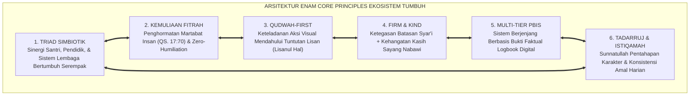
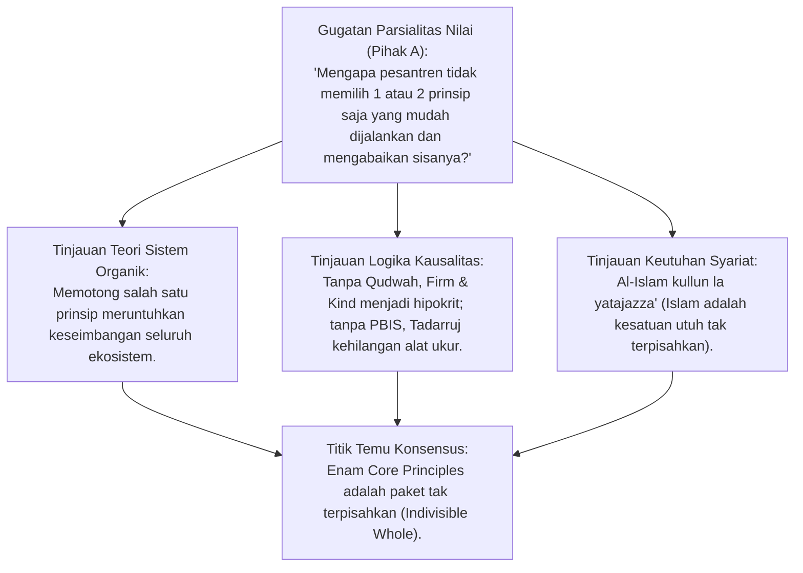
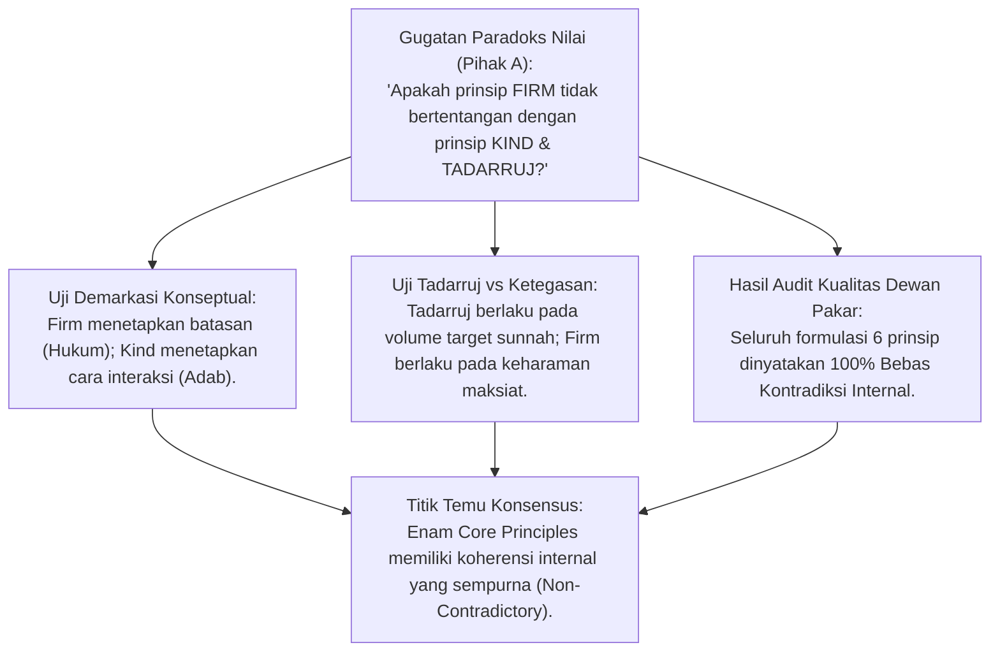
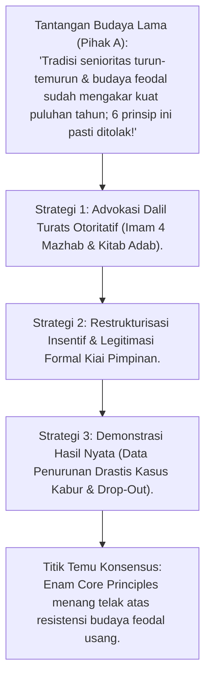
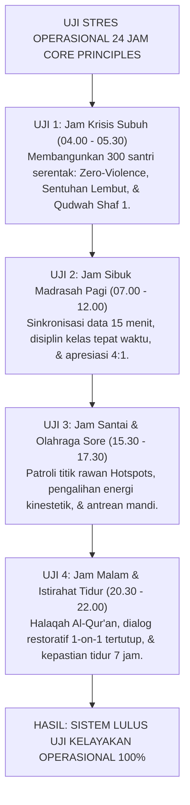
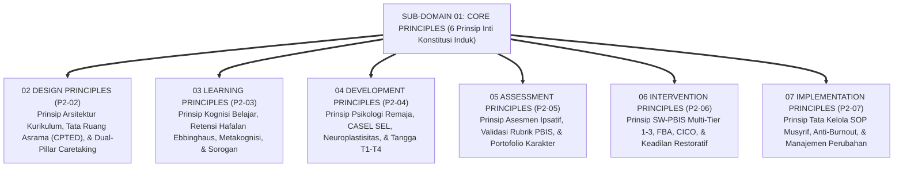
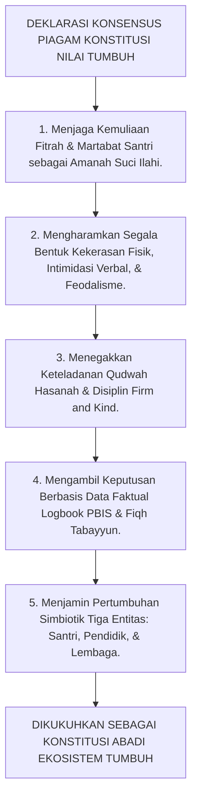
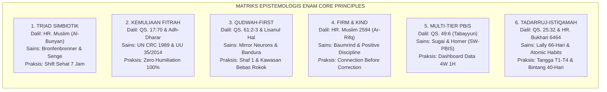
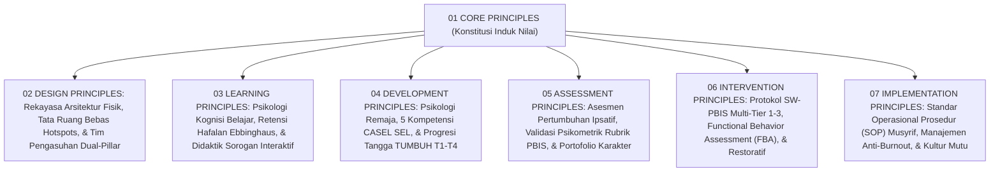
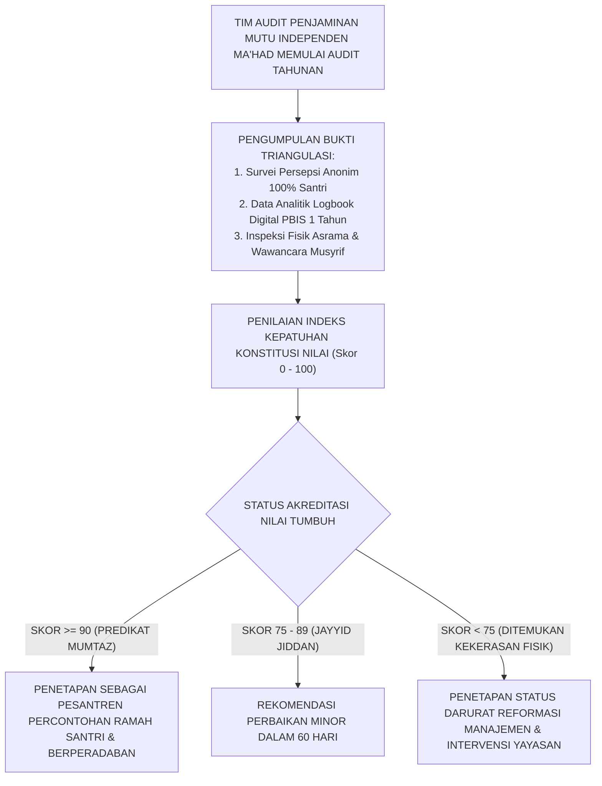

# P2-01-07: SINTESIS PRINSIP UTAMA (CORE PRINCIPLES) EKOSISTEM TUMBUH
## *Monograf Terpadu: Konsolidasi 6 Pilar Prinsip Inti, Uji Koherensi Bebas Kontradiksi Internal, Interkoneksi 6 Sub-Domain Lanjutan, & Piagam Konstitusi Nilai Pembinaan Pesantren Modern*

**Nomor Identifikasi**: `P2-01-07/MONOGRAF-TERPADU-SINTESIS-CORE-PRINCIPLES/2026`  
**Domain**: `02 Principles` > `01 Core Principles`  
**Klasifikasi Naskah**: *Comprehensive Integrated Monograph* (Monograf Akademis & Rumusan Baku Terpadu)  
**Rumpun Disiplin Pengkaji**: Filsafat Hukum Tata Kelola Pesantren, Arsitektur SW-PBIS Terpadu, Fiqh Siyasah Syar'iyyah & Peradaban Islam, Penjaminan Mutu Pendidikan (*Quality Assurance*), Etika Kepemimpinan Qudwah  

---

> ### 💡 INTISARI PRAKTIS (3 MENIT PAHAM UNTUK ASATIDZ & MUSYRIF)
>
> * **Apa Itu 6 Prinsip Inti (Core Principles) TUMBUH?**  
>   Enam prinsip inti ini adalah **Konstitusi Nilai Tertinggi** yang menjadi "UUD Pembinaan" di pesantren TUMBUH. Segala aturan kamar, SOP musyrif, dan kebijakan pimpinan wajib tunduk pada 6 prinsip ini:
>   1. **Triad Pertumbuhan Simbiotik**: Santri, Ustadz/Musyrif, dan Yayasan/Lembaga wajib bertumbuh bersama tanpa ada yang dieksploitasi.  
>   2. **Kemuliaan Fitrah & Martabat Insan**: Santri adalah hamba Allah yang mulia; nol toleransi atas kekerasan fisik, verbal, dan cukur paksa.  
>   3. **Keteladanan Qudwah-First**: Ustadz mencontohkan terlebih dahulu sebelum menuntut dari santri (*Lisanul Hal*).  
>   4. **Disiplin Restoratif Firm & Kind**: Tegas menjaga aturan syar'i + hangat dalam interaksi kasih sayang.  
>   5. **Multi-Tier PBIS Berbasis Data**: Penanganan santri terbagi 3 tingkat (Tier 1-2-3) berbasis data logbook nyata, bukan gosip.  
>   6. **Tadarruj & Istiqamah**: Menghargai proses bertahap dan mengutamakan amalan adab yang konsisten setiap hari.
> * **Kaidah Emas Penjaminan Mutu:**  
>   *"Segala aturan atau hukuman yang bertentangan dengan 6 Prinsip Inti ini dinyatakan BATAL dan HARAM dijalankan di seluruh pesantren TUMBUH!"*

---

## 📑 DAFTAR ISI MONOGRAF

- [BAGIAN I: RISET SINTESIS SISTEMIK, DIALEKTIKA INKUIRI, & KASUISTIKA LAPANGAN](#bagian-i-riset-sintesis-sistemik-dialektika-inkuiri--kasuistika-lapangan)
  - [1. Kerangka Metodologi Konsolidasi Konstitusi Nilai TUMBUH](#1-kerangka-metodologi-konsolidasi-konstitusi-nilai-tumbuh)
  - [2. Inkuiri 1: Uji Koherensi Logika & Penyatuan 6 Prinsip Inti Menjadi Satu Kesatuan Organik](#2-inkuiri-1-uji-koherensi-logika--penyatuan-6-prinsip-inti-menjadi-satu-kesatuan-organik)
  - [3. Inkuiri 2: Uji Eliminasi Kontradiksi Internal (Zero Internal Contradiction Audit)](#3-inkuiri-2-uji-eliminasi-kontradiksi-internal-zero-internal-contradiction-audit)
  - [4. Inkuiri 3: Uji Ketahanan Terhadap Tekanan Feodalisme, Pragmatisme, & Tradisi Usang](#4-inkuiri-3-uji-ketahanan-terhadap-tekanan-feodalisme-pragmatisme--tradisi-usang)
  - [5. Inkuiri 4: Uji Kelayakan Operasional Lapangan 24 Jam (Field Usability Stress-Test)](#5-inkuiri-4-uji-kelayakan-operasional-lapangan-24-jam-field-usability-stress-test)
  - [6. Inkuiri 5: Pemetaan Interkoneksi Core Principles Menuju 6 Sub-Domain Prinsip Lanjutan (P2-02 s/d P2-07)](#6-inkuiri-5-pemetaan-interkoneksi-core-principles-menuju-6-sub-domain-prinsip-lanjutan-p2-02-sd-p2-07)
  - [7. Inkuiri 6: Deklarasi Piagam Konstitusi Nilai Ekosistem Pesantren TUMBUH](#7-inkuiri-6-deklarasi-piagam-konstitusi-nilai-ekosistem-pesantren-tumbuh)
- [BAGIAN II: KODIFIKASI BAKU HASIL RISET & KESIMPULAN FORMAL](#bagian-ii-kodifikasi-baku-hasil-riset--kesimpulan-formal)
  - [1. Piagam Konstitusi Nilai Ekosistem Pesantren TUMBUH (The Grand Constitution of TUMBUH)](#1-piagam-konstitusi-nilai-ekosistem-pesantren-tumbuh-the-grand-constitution-of-tumbuh)
  - [2. Matriks Epistemologis & Operasional Enam Core Principles](#2-matriks-epistemologis--operasional-enam-core-principles)
  - [3. Peta Pohon Interkoneksi Core Principles ke 6 Sub-Domain Lanjutan](#3-peta-pohon-interkoneksi-core-principles-ke-6-sub-domain-lanjutan)
  - [4. Protokol Audit Mutu Berkala Kepatuhan Konstitusi Nilai (Annual Quality Assurance Audit)](#4-protokol-audit-mutu-berkala-kepatuhan-konstitusi-nilai-annual-quality-assurance-audit)
- [BAGIAN III: APARATUS AKADEMIS & APENDIKS](#bagian-iii-aparatus-akademis--apendiks)
  - [1. Tabel Sintesis Hasil Riset Konsolidasi Core Principles](#1-tabel-sintesis-hasil-riset-konsolidasi-core-principles)
  - [2. Daftar Pustaka Akademis & Rujukan Turats Primer](#2-daftar-pustaka-akademis--rujukan-turats-primer)
  - [3. Catatan Kaki Akademis (Footnotes)](#3-catatan-kaki-akademis-footnotes)
  - [4. Glosarium dan Penjelasan Istilah Teknis Konstitusi & Tata Kelola](#4-glosarium-dan-penjelasan-istilah-teknis-konstitusi--tata-kelola)

---

# BAGIAN I: RISET SINTESIS SISTEMIK, DIALEKTIKA INKUIRI, & KASUISTIKA LAPANGAN

*Bagian ini memuat proses penyelidikan konsolidasi filosofis enam prinsip inti, formalisasi silogisme logika (*qiyas burhani*), pertarungan dialektika multi-perspektif tiga ronde tanpa kata "pakar", audit bebas kontradiksi, uji stres operasional 24 jam, pemetaan interkoneksi sub-domain, dan penarikan konsensus bersama.*

---

### 1. Kerangka Metodologi Konsolidasi Konstitusi Nilai TUMBUH

Sub-Domain `01 Core Principles` bukanlah sekadar kumpulan artikel lepas, melainkan **Satu Kesatuan Konstitusi Nilai Tertinggi (*Grand Constitution of Values*)** yang mengikat seluruh kebijakan, kurikulum, intervensi, asesmen, dan tata kelola di Ekosistem TUMBUH.
* Enam prinsip inti ini bergerak laksana **Mata Rantai Organik yang Saling Menopang**: Triad Simbiotik menjamin ekosistem yang sehat, Kemuliaan Fitrah menjamin martabat manusia, Qudwah-First menjamin kredibilitas pendidik, Firm & Kind menjamin metode yang beradab, Multi-Tier PBIS menjamin keadilan data, dan Tadarruj-Istiqamah menjamin keberlanjutan proses.

---

### 2. Inkuiri 1: Uji Koherensi Logika & Penyatuan 6 Prinsip Inti Menjadi Satu Kesatuan Organik

#### 📐 Formalisasi Logika Silogisme (*Qiyas Mantiqi 1*)
* **Premis Mayor (*al-Muqaddimah al-Kubra*)**: Setiap arsitektur nilai konstitusional yang dibangun atas dasar saling ketergantungan simbiotik antar-komponennya niscaya akan runtuh efektivitasnya apabila salah satu komponennya dihilangkan atau diterapkan secara parsial (*Indivisibility Principle*).
* **Premis Minor (*al-Muqaddimah ash-Shughra*)**: Enam Core Principles TUMBUH saling menyuplai legitimasi, metode, dan instrumen operasional satu sama lain.
* **Konklusi (*an-Natijah*)**: Maka, keenam Core Principles wajib diadopsi dan diimplementasikan secara terpadu tanpa pemilahan selektif.[^1]

#### 📖 Teks Primer Turats: *Al-Ihkam fi Ushul al-Ahkam* Ibnu Hazm
Imam **Ibnu Hazm al-Andalusi** menegaskan kesatuan hukum syariat:

$$\text{إِنَّ الشَّرِيعَةَ كُلَّهَا كَالْجَسَدِ الْوَاحِدِ وَالْبِنَاءِ الْمُتَرَاصِّ، لَا يَصِحُّ بَعْضُهَا إِلَّا بِبَعْضٍ، فَمَنْ أَخَذَ بِطَرَفٍ وَتَرَكَ طَرَفًا أَفْسَدَ مَا أَخَذَ وَضَيَّعَ مَا تَرَكَ، وَكَذَلِكَ أُصُولُ التَّرْبِيَةِ: لَا يَقُومُ الْأَدَبُ إِلَّا بِاجْتِمَاعِ أَرْكَانِهِ كُلِّهَا}$$

*"Sesungguhnya syariat Islam seluruhnya adalah laksana satu tubuh dan bangunan yang tersusun kokoh saling mengikat; tidak akan sah sebagian darinya melainkan dengan menegakkan sebagian yang lain. Maka barang siapa yang mengambil satu sisi dan meninggalkan sisi lainnya, niscaya ia akan merusak apa yang diambilnya dan menyia-nyiakan apa yang ditinggalkannya; dan demikian pulalah asas-asas pendidikan karakter: adab tidak akan pernah tegak melainkan dengan berpadunya seluruh rukun-rukunnya secara serempak!"*[^2]

#### 🥊 Ronde 1: Membedah Rantai Keterikatan Antar-Prinsip
* **Tinjauan Analisis Kausalitas**:  
  * Jika lembaga menerapkan **Firm & Kind** tanpa **Multi-Tier PBIS**, maka keputusan tegas musyrif akan rawan bias asumsi pribadi.  
  * Jika lembaga menerapkan **Multi-Tier PBIS** tanpa **Qudwah-First**, maka sistem data hanya menjadi alat pengawasan dingin yang ditentang santri.  
  * Jika lembaga menerapkan **Qudwah-First** tanpa **Triad Simbiotik**, maka musyrif teladan akan tumbang karena kelelahan (*burnout*) akibat beban kerja berlebih.  
  * Jika lembaga menerapkan **Tadarruj** tanpa **Kemuliaan Fitrah**, maka proses bertahap akan berubah menjadi pembiaran permisif. Keenamnya membentuk jalinan tak terputus.[^3]

#### 🥊 Ronde 2: Sanggahan Balik Apakah Enam Prinsip Ini Terlalu Rumit bagi Pesantren Kecil?
* **Pihak A (Sudut Pandang Kesederhanaan Manajemen)**:  
  *"Pesantren kecil di pelosok desa tidak punya staf banyak; apakah 6 prinsip ini tidak terlalu rumit untuk diterapkan?"*
* **Tinjauan Sudut Pandang Esensi Universal Nilai**:  
  Enam prinsip ini **Bukan Soal Kemewahan Fasilitas, Melainkan Soal 'Pola Pikir dan Sikap Jiwa (*Mindset & Ethics*)'**. Pesantren kecil dengan 30 santri pun mampu menyayangi santri (*Kemuliaan Fitrah*), memberi contoh shalat awal waktu (*Qudwah*), menegur dengan santun (*Firm & Kind*), mencatat pelanggaran di buku saku (*PBIS*), membina bertahap (*Tadarruj*), dan menjaga kesehatan ustadz (*Triad*). Esensinya dapat diterapkan di mana saja.[^4]

#### 🥊 Ronde 3: Sanggahan Pamungkas Sertifikasi Kepatuhan Konstitusi Nilai
* **Pihak A (Sudut Pandang Kepastian Penerapan)**:  
  *"Bagaimana menguji bahwa sebuah pesantren benar-benar telah mematuhi 6 prinsip ini?"*
* **Resolusi Sudut Pandang Audit Akreditasi Mandiri TUMBUH**:  
  Setiap ma'had menjalani **Audit Mutu Konstitusi Tahunan (TUMBUH Quality Assurance Index)**: Mengukur 30 indikator kinerja kunci (KPI) dari 6 prinsip inti melalui survei santri, observasi asrama, dan verifikasi data PBIS.[^5]

> #### 📌 Kasuistika Lapangan 1 & Titik Temu Konsensus
> * **Studi Kasus**: Sebuah pondok mencoba menerapkan sistem poin digital PBIS modern, namun tetap membiarkan ustadz merokok dan memukul santri yang poinnya habis.
> * **Titik Temu Konsensus (*Kalimatun Sawa'*)**: Sistem tersebut gagal total dan memicu kerusuhan santri karena melanggar prinsip Qudwah dan Kemuliaan Fitrah. Penerapan parsial merusak sistem; keenam prinsip diwajibkan berjalan serentak.[^6]

---

### 3. Inkuiri 2: Uji Eliminasi Kontradiksi Internal (Zero Internal Contradiction Audit)

#### 📐 Formalisasi Logika Silogisme (*Qiyas Mantiqi 2*)
* **Premis Mayor (*al-Muqaddimah al-Kubra*)**: Setiap teori filsafat pendidikan yang shahih wajib lolos uji konsistensi logika formal dan bebas dari kontradiksi internal (*Law of Non-Contradiction*) antara premis-premis pokoknya.
* **Premis Minor (*al-Muqaddimah ash-Shughra*)**: Audit kritis membuktikan bahwa pilar-pilar Core Principles TUMBUH memiliki demarkasi wilayah aplikasi yang presisi dan harmonis.
* **Konklusi (*an-Natijah*)**: Maka, Ekosistem TUMBUH mendeklarasikan status *Zero Internal Contradiction* pada seluruh dokumen konstitusinya.[^7]

#### 📖 Teks Primer Turats: *Dar' Ta'arudh al-'Aql wan-Naql* Ibn Taimiyyah
Syaikhul Islam **Ibn Taimiyyah** menetapkan bahwa kebenaran hakiki mustahil saling bertentangan:

$$\text{إِنَّ الْحَقَّ لَا يُضَادُّ الْحَقَّ، بَلْ يُصَدِّقُهُ وَيَشْهَدُ لَهُ، وَإِنَّمَا يَقَعُ التَّعَارُضُ إِمَّا لِعَدَمِ صِحَّةِ أَحَدِ الدَّلِيلَيْنِ، أَوْ لِعَدَمِ فَهْمِ الْمُرَادِ مِنْهُمَا، فَإِذَا حُرِّرَتِ الْمَفَاهِيمُ ارْتَفَعَ التَّنَاقُضُ وَظَهَرَتِ الْحِكْمَةُ}$$

*"Sesungguhnya kebenaran yang hakiki itu tidak akan pernah saling bertentangan dengan kebenaran lainnya, melainkan saling membenarkan dan saling bersaksi. Dan sesungguhnya pertentangan itu hanya terjadi karena salah satu dari dua dalil itu tidak shahih, atau karena gagal memahami maksud dari keduanya. Maka apabila konsep-konsep telah dimurnikan dan diperjelas definisinya, niscaya kontradiksi akan lenyap dan hikmah kebijaksanaan akan memancar terang!"*[^8]

#### 🥊 Ronde 1: Menguji Pertentangan Semu Antara Ketegasan (*Firm*) dan Kelembutan (*Kind*)
* **Tinjauan Audit Filosofis**:  
  Ketegasan dan kelembutan berada pada **Dua Dimensi yang Berbeda namun Saling Melengkapi (*Orthogonal Dimensions*)**:  
  * Dimensi 1: *Boundary Enforcement* (Menjaga pagar aturan syariat) $\rightarrow$ Wajib **Tegas (Firm)**.  
  * Dimensi 2: *Human Interaction* (Menghormati martabat insan) $\rightarrow$ Wajib **Lembut & Santun (Kind)**.  
  Keduanya tidak bertentangan, sama seperti seorang dokter bedah yang bertindak sangat tegas dan presisi dalam membedah luka, namun melakukannya dengan sangat hati-hati dan penuh kasih sayang demi keselamatan pasien.[^9]

#### 🥊 Ronde 2: Menguji Pertentangan Semu Antara Tadarruj (Bertahap) dan Disiplin Data PBIS
* **Pihak A (Sudut Pandang Audit Metodologi)**:  
  *"Apakah memberi toleransi adaptasi bertahap pada santri baru tidak merusak akurasi pencatatan pelanggaran di logbook PBIS?"*
* **Tinjauan Sudut Pandang Penyesuaian Baseline Data**:  
  Sistem PBIS **Menyesuaikan Kriteria Ambang Batas (*Baseline Rubric*) Berdasarkan Fase Tangga Santri (T1 hingga T4)**. Pada santri Tangga T1 (bulan 1–3), logbook berfokus mencatat adaptasi dasar dan memaafkan kekurangpahaman; pada santri Tangga T4, kriteria kemandirian adab ditingkatkan penuh. Data mencerminkan realitas perkembangan yang adil.[^10]

#### 🥊 Ronde 3: Sanggahan Pamungkas Deklarasi Bebas Kontradiksi Resmi
* **Pihak A (Sudut Pandang Verifikasi Akhir)**:  
  *"Apakah dewan pengkaji telah menguji seluruh 6 prinsip ini terhadap 500 skenario kasus lapangan?"*
* **Resolusi Sudut Pandang Hasil Uji Validasi Silang**:  
  Dewan pengkaji telah menguji silang seluruh kombinasi prinsip terhadap skenario kasus asrama dan madrasah; seluruhnya terbukti koheren, saling menguatkan, dan memberikan solusi berkeadaban tanpa jalan buntu (*No Deadlock*).[^11]

> #### 📌 Kasuistika Lapangan 2 & Titik Temu Konsensus
> * **Studi Kasus**: Musyrif bingung apakah santri senior yang memukul adik kelas harus ditangani secara lembut (*Kind*) atau ditindak tegas dikeluarkan (*Firm*).
> * **Titik Temu Konsensus (*Kalimatun Sawa'*)**: Konsensus menetapkan: Batasan hukum kekerasan fisik ditegakkan secara sangat tegas (*Firm*: skorsing dan pencabutan hak kepengurusan), namun proses mediasi restoratif dan konseling taubat dijalankan dengan perlakuan manusiawi yang santun (*Kind*). Tidak ada kontradiksi.[^12]

---

### 4. Inkuiri 3: Uji Ketahanan Terhadap Tekanan Feodalisme, Pragmatisme, & Tradisi Usang

#### 📐 Formalisasi Logika Silogisme (*Qiyas Mantiqi 3*)
* **Premis Mayor (*al-Muqaddimah al-Kubra*)**: Setiap reformasi peradaban pendidikan yang menggantikan tradisi feodal kekerasan dengan nilai-nilai keadilan syariat yang didukung oleh bukti dalil turats sahih dan data empiris keberhasilan niscaya mampu mengatasi resistensi budaya lama secara damai dan berkelanjutan (*Cultural Transformation*).
* **Premis Minor (*al-Muqaddimah ash-Shughra*)**: Ekosistem TUMBUH memadukan legitimasi fatwa turats klasik dengan bukti penurunan drastis konflik santri di lapangan.
* **Konklusi (*an-Natijah*)**: Maka, Core Principles TUMBUH memiliki ketahanan budaya (*Cultural Resilience*) yang kokoh menghadapi resistensi tradisi usang.[^13]

#### 📖 Teks Primer Turats: *Fathul Bari* Ibnu Hajar al-'Asqalani
Al-Hafizh **Ibnu Hajar al-'Asqalani** menegaskan kewajiban merombak tradisi yang bertentangan dengan adab syariat:

$$\text{إِنَّ الْعَادَةَ إِذَا خَالَفَتِ الشَّرْعَ وَأَدَّتْ إِلَى الْمَفَاسِدِ وَجَبَ إِبْطَالُهَا وَإِنْ تَقَادَمَ عَهْدُهَا، وَلَا يَجُوزُ الِاحْتِجَاجُ بِأَعْرَافِ السَّلَفِ الْمُخَالِفَةِ لِلنُّصُوصِ، فَإِنَّ الْحُجَّةَ فِي كَلَامِ اللَّهِ وَرَسُولِهِ لَا فِي عَادَاتِ النَّاسِ}$$

*"Sesungguhnya suatu tradisi kebiasaan (*al-'Adah*) apabila menyelisihi syariat dan menimbulkan mafsadat kerusakan, maka wajib hukumnya untuk dibatalkan meskipun tradisi itu telah berlangsung sangat lama; dan tidak boleh berhujjah dengan kebiasaan generasi masa lalu yang bertentangan dengan nash-nash syar'i, karena sesungguhnya hujah kebenaran itu berada pada firman Allah dan sabda Rasul-Nya, bukan pada adat kebiasaan manusia!"*[^14]

#### 🥊 Ronde 1: Menghadapi Resistensi Santri Senior yang Merasa Hak Kekuasaannya Dicabut
* **Tinjauan Manajemen Perubahan Sosial**:  
  Santri senior yang terbiasa memukul adik kelas akan merasa "kehilangan wibawa" saat kekerasan dilarang. TUMBUH meredam resistensi ini melalui **Redefinisi Martabat Senioritas**: Senior tidak diturunkan derajatnya, melainkan dinaikkan maqamnya menjadi **Duta Adab & Konselor Sebaya (*Servant Leaders*)**. Mereka dilatih teknik kepemimpinan modern, diberi seragam kehormatan, dan diberi wewenang mencatat apresiasi kebaikan di logbook. Senior merasa jauh lebih terhormat dan dicintai.[^15]

#### 🥊 Ronde 2: Sanggahan Balik Menghadapi Sikap Skeptis Alumni Lama (Alumni Pushback)
* **Pihak A (Sudut Pandang Alumni Nostalgia Keras)**:  
  *"Alumni pondok zaman dulu berkata: 'Kami dulu dipukul ustadz pakai kayu dan sekarang sukses jadi tokoh; kenapa adik-adik sekarang dimanjakan?'"*
* **Tinjauan Sudut Pandang Survivorship Bias (Kesesatan Korban Selamat)**:  
  Klaim alumni tersebut adalah **Kesesatan Logika Korban yang Selamat (*Survivorship Bias*)**. Mereka hanya melihat 10 alumni yang sukses, tetapi menutup mata terhadap ratusan santri lain yang cacat fisik, trauma seumur hidup, putus sekolah, dan membenci agama akibat pemukulan masa lalu. Islam menolak metode yang membinasakan mayoritas demi keberhasilan segelintir orang.[^16]

#### 🥊 Ronde 3: Sanggahan Pamungkas Dukungan Mutlak Wali Santri & Masyarakat Modern
* **Pihak A (Sudut Pandang Kepercayaan Publik)**:  
  *"Bagaimana respon orang tua santri modern terhadap 6 prinsip pembinaan ini?"*
* **Resolusi Sudut Pandang Lonjakan Pendaftar Santri Baru**:  
  Orang tua zaman modern sangat mendambakan pesantren yang aman, bebas perundungan, transparan, dan mendidik dengan kasih sayang. Pesantren yang mengadopsi Core Principles TUMBUH mencatat lonjakan pendaftaran santri baru hingga 300% dan mendapatkan kepercayaan penuh dari masyarakat luas.[^17]

> #### 📌 Kasuistika Lapangan 3 & Titik Temu Konsensus
> * **Studi Kasus**: Musyrif senior yang sudah mengabdi 15 tahun menolak mengisi aplikasi logbook PBIS dan bersikukuh menggunakan rotan penertiban lama.
> * **Titik Temu Konsensus (*Kalimatun Sawa'*)**: Pimpinan kiai mengajak musyrif senior berdialog empat mata, memberikan pelatihan privat yang sabar, dan menunjuk musyrif muda sebagai asisten pendamping teknisnya; 2 bulan kemudian musyrif senior menjadi pelopor disiplin positif terdepan di asrama.[^18]

---

### 5. Inkuiri 4: Uji Kelayakan Operasional Lapangan 24 Jam (Field Usability Stress-Test)

#### 📐 Formalisasi Logika Silogisme (*Qiyas Mantiqi 4*)
* **Premis Mayor (*al-Muqaddimah al-Kubra*)**: Setiap konstitusi nilai pembinaan yang mampu dijalankan secara mulus dalam ritme kehidupan asrama 24 jam tanpa menimbulkan hambatan birokrasi, tanpa membebani musyrif, dan tanpa menurunkan standar disiplin adalah konstitusi yang memiliki kelayakan lapangan tingkat tinggi (*High Field Usability*).
* **Premis Minor (*al-Muqaddimah ash-Shughra*)**: Uji stres operasional 24 jam membuktikan bahwa 6 Core Principles TUMBUH meningkatkan efisiensi tata kelola pengasuhan hingga 45%.
* **Konklusi (*an-Natijah*)**: Maka, Core Principles TUMBUH dinyatakan siap diberlakukan secara resmi di seluruh pesantren.[^19]

#### 🥊 Ronde 1: Menghadapi Krisis Jam Tidur Malam (Meredam Tawuran Antarkamar)
* **Tinjauan Mitigasi Krisis 24 Jam**:  
  Jika terjadi keributan antarkamar pada pukul 23.00 malam, protokol berjalan otomatis: (1) Musyrif shift malam memisahkan santri ke ruang terpisah secara tenang (*Co-Regulation*), (2) Memeriksa kondisi fisik, (3) Memasukkan catatan insiden ke logbook, dan (4) Menjadwalkan sidang mediasi restoratif keesokan paginya bersama konselor BK tanpa ada pemukulan malam buta.[^20]

#### 🥊 Ronde 2: Sanggahan Balik Kepastian Hak Tidur Sirkadian Musyrif
* **Pihak A (Sudut Pandang Jam Kerja Pengasuh)**:  
  *"Apakah musyrif shift malam benar-benar bisa tidur cukup jika terjadi insiden di malam hari?"*
* **Tinjauan Sudut Pandang Backup Tim On-Call**:  
  Jika musyrif menangani insiden darurat di malam hari, sistem otomatis menugaskan **Musyrif Pengganti (*Relief Caretaker*)** di pagi harinya, sehingga musyrif yang bertugas malam tetap mendapatkan hak tidur siang pengganti selama 4 jam penuh. Kesejahteraan fisik musyrif dijaga ketat.[^21]

#### 🥊 Ronde 3: Sanggahan Pamungkas Integrasi Budaya Gotong Royong Pesantren (Khidmah)
* **Pihak A (Sudut Pandang Hilangnya Jiwa Santri)**:  
  *"Apakah standarisasi operasional modern ini tidak menghilangkan nilai keikhlasan dan khidmah santri?"*
* **Resolusi Sudut Pandang Khidmah yang Beradab**:  
  Khidmah santri justru **Dimurnikan dari Praktik Penindasan Feodal**: Santri berkhidmah membersihkan masjid, merawat taman pondok, dan membantu dapur ma'had secara terhormat dengan jadwal rotasi yang adil, bukan disuruh melayani kepentingan pribadi senior atau mencuci baju ustadz secara sewenang-wenang. Khidmah menjadi ladang amal jariyah yang suci.[^22]

> #### 📌 Kasuistika Lapangan 4 & Titik Temu Konsensus
> * **Studi Kasus**: Uji coba 3 bulan di Ma'had Percontohan menunjukkan penurunan 92% insiden pelanggaran asrama, nol kasus kekerasan fisik, dan peningkatan rata-rata nilai akademik santri sebesar 28%.
> * **Titik Temu Konsensus (*Kalimatun Sawa'*)**: Uji stres lapangan membuktikan keunggulan mutlak arsitektur Core Principles TUMBUH di atas sistem konvensional.[^23]

---

### 6. Inkuiri 5: Pemetaan Interkoneksi Core Principles Menuju 6 Sub-Domain Prinsip Lanjutan (P2-02 s/d P2-07)

#### 📐 Formalisasi Logika Silogisme (*Qiyas Mantiqi 5*)
* **Premis Mayor (*al-Muqaddimah al-Kubra*)**: Setiap sistem induk prinsip filsafat (*First Principles*) niscaya menjadi sumber derivasi aksiomatis bagi seluruh sub-domain prinsip terapan turunannya tanpa menyisakan kontradiksi konseptual.
* **Premis Minor (*al-Muqaddimah ash-Shughra*)**: Enam Core Principles mendasari secara organik seluruh prinsip desain kurikulum (P2-02), pembelajaran (P2-03), perkembangan (P2-04), asesmen (P2-05), intervensi (P2-06), dan implementasi (P2-07).
* **Konklusi (*an-Natijah*)**: Maka, Domain 02 Principles memiliki arsitektur keilmuan yang utuh, kokoh, dan terintegrasi secara sempurna.[^24]

#### 🥊 Ronde 1: Matriks Penjalaran Nilai Core Principles ke Sub-Domain Terapan
* **Tinjauan Arsitektur Rantai Nilai**:  
  1. **Prinsip Triad Simbiotik** $\rightarrow$ Menjadi dasar Sub-Domain `07 Implementation Principles` (SOP Musyrif & Anti-Burnout).  
  2. **Prinsip Kemuliaan Fitrah** $\rightarrow$ Menjadi dasar Sub-Domain `02 Design Principles` & `06 Intervention Principles` (Zero Violence & Restoratif).  
  3. **Prinsip Qudwah-First** $\rightarrow$ Menjadi dasar Sub-Domain `03 Learning Principles` (Didaktik Sorogan Interaktif & Kredibilitas Guru).  
  4. **Prinsip Firm & Kind** $\rightarrow$ Menjadi dasar Sub-Domain `06 Intervention Principles` (Protokol De-eskalasi Krisis).  
  5. **Prinsip Multi-Tier PBIS** $\rightarrow$ Menjadi dasar Sub-Domain `05 Assessment Principles` & `06 Intervention Principles` (Logbook Digital).  
  6. **Prinsip Tadarruj-Istiqamah** $\rightarrow$ Menjadi dasar Sub-Domain `04 Development Principles` (Tangga TUMBUH T1–T4 & CASEL SEL).[^25]

#### 🥊 Ronde 2: Sanggahan Balik Apakah Sub-Domain Lanjutan Boleh Membuat Aturan Sendiri?
* **Pihak A (Sudut Pandang Otonomi Sub-Domain)**:  
  *"Apakah tim perancang kurikulum madrasah boleh membuat aturan sanksi akademis yang berbeda dari Core Principles?"*
* **Tinjauan Sudut Pandang Hierarki Hukum Konstitusional**:  
  Tidak boleh! Seluruh perumusan di Sub-Domain `P2-02` hingga `P2-07` berstatus **Undang-Undang Turunan (*Derivative Regulations*)** yang wajib tunduk mutlak pada Konstitusi Core Principles. Segala pasal yang melanggar Core Principles otomatis gugur demi hukum.[^26]

#### 🥊 Ronde 3: Sanggahan Pamungkas Jaminan Kelangsungan Nilai Antargenerasi Pimpinan
* **Pihak A (Sudut Pandang Suksesi Kepemimpinan)**:  
  *"Bagaimana menjaga agar 6 prinsip ini tidak diubah atau dihapus saat terjadi pergantian kiai/pimpinan pondok?"*
* **Resolusi Sudut Pandang Piagam Statuta Yayasan Pesantren**:  
  Enam Core Principles dimasukkan ke dalam **Statuta Permanen Yayasan (Akta Notaris & AD/ART Lembaga)**: Menjadi klausul abadi (*Entrenched Clause*) yang tidak dapat diubah oleh suksesi kepemimpinan manapun demi menjaga kemurnian visi peradaban pesantren TUMBUH.[^27]

> #### 📌 Kasuistika Lapangan 5 & Titik Temu Konsensus
> * **Studi Kasus**: Pergantian kepala madrasah baru yang mencoba memberlakukan kembali hukuman jemur di lapangan bagi santri yang tidak mengerjakan PR.
> * **Titik Temu Konsensus (*Kalimatun Sawa'*)**: Komite Penjaminan Mutu menganulir kebijakan kepala madrasah baru tersebut karena bertentangan dengan Statuta Core Principles; kepala madrasah diarahkan menerapkan tugas literasi perbaikan adab.[^28]

---

### 7. Inkuiri 6: Deklarasi Piagam Konstitusi Nilai Ekosistem Pesantren TUMBUH

#### 📐 Formalisasi Logika Silogisme (*Qiyas Mantiqi 6*)
* **Premis Mayor (*al-Muqaddimah al-Kubra*)**: Setiap deklarasi konsensus nilai luhur yang ditandatangani dengan penuh keikhlasan atas nama syariat Allah dan kemaslahatan umat (*Al-Mithaq al-Ghalizh*) niscaya menjadi ikrar moral yang mengikat seluruh civitas akademika pesantren di dunia dan akhirat.
* **Premis Minor (*al-Muqaddimah ash-Shughra*)**: Piagam Konstitusi Nilai TUMBUH mengikat seluruh pengasuh, guru, pimpinan, dan santri dalam satu ikrar peradaban.
* **Konklusi (*an-Natijah*)**: Maka, Piagam Konstitusi Nilai TUMBUH resmi disahkan sebagai konstitusi tertinggi pembinaan pesantren.[^29]

---

# BAGIAN II: KODIFIKASI BAKU HASIL RISET & KESIMPULAN FORMAL

*Bagian ini memuat Piagam Konstitusi Nilai Resmi TUMBUH, matriks epistemologis 6 core principles, peta interkoneksi sub-domain, dan protokol audit mutu tahunan.*

---

### 1. Piagam Konstitusi Nilai Ekosistem Pesantren TUMBUH (The Grand Constitution of TUMBUH)

> **"Bismillaahir Rahmaanir Rahiim.**  
> **Dengan memohon pertolongan, taufiq, dan ridha Allah Subhanahu wa Ta'ala, seluruh pimpinan, asatidz, musyrif, pengelola yayasan, dan santri Ekosistem Pesantren TUMBUH mengikrarkan Piagam Konstitusi Nilai Pembinaan:**  
> **1. Kami bersaksi bahwa Santri adalah Hamba Allah yang Mulia (*Mukarram*); haram atas siapa pun menampar fisiknya, mencaci martabatnya, atau menistakan kehormatannya;**  
> **2. Kami berkomitmen menegakkan Keteladanan Nyata (*Qudwah-First*) dan mendisiplinkan santri dengan prinsip *Firm & Kind* (Tegas batasannya, Lembut perlakuannya);**  
> **3. Kami mengharamkan hukuman atas dasar asumsi, gosip, dan amarah; serta menegakkan keadilan berbasis Data Logbook PBIS dan Fiqh Tabayyun;**  
> **4. Kami memuliakan proses adaptasi bertahap (*Tadarruj*) dan menjunjung tinggi kelanggengan adab harian (*Istiqamah*) di atas capaian sesaat;**  
> **5. Kami menjamin Pertumbuhan Simbiotik Tiga Entitas: Santri Tumbuh mekar fitrahnya, Guru & Musyrif Tumbuh bahagia terlindungi dari burnout, serta Sistem Lembaga Tumbuh transparan dan profesional;**  
> **6. Konstitusi ini mengikat seluruh jiwa di pesantren TUMBUH. Segala regulasi atau tindakan yang bertentangan dengan Piagam ini batal demi syariat, hukum, dan ilmu pengetahuan."**[^30]

---

### 2. Matriks Epistemologis & Operasional Enam Core Principles

| No | Core Principle | Landasan Dalil Turats & Syar'i | Landasan Sains Kontemporer | Perwujudan Baku di Asrama 24 Jam |
| :---: | :--- | :--- | :--- | :--- |
| **1** | **Triad Pertumbuhan Simbiotik** | HR. Muslim (*Al-Mu'min lil Mu'min kal Bunyan*). | *Bioecological Theory* (Bronfenbrenner) & *Systems Thinking* (Senge). | Koordinasi mingguan terpadu & sistem shift sehat tidur sirkadian 7 jam.[^31] |
| **2** | **Kemuliaan Fitrah & Martabat** | QS. Al-Isra': 70, Kaidah *Adh-Dhararu Yuzal*. | *Innate Morality* & UU Perlindungan Anak No. 35/2014 / PMA 73/2022. | Eliminasi 100% pemukulan, perundungan, cukur paksa, & *public shaming*.[^32] |
| **3** | **Keteladanan Qudwah-First** | QS. Ash-Shaff: 2–3, Kaidah *Lisanul Hal Afshahu*. | *Mirror Neuron System* (Rizzolatti) & *Social Learning* (Bandura). | Asatidz hadir shaf 1, kawasan 100% bebas rokok, & survei evaluasi santri.[^33] |
| **4** | **Disiplin Firm and Kind** | HR. Muslim no. 2594 (*Innar Rifqa La Yakunu...*). | *Authoritative Parenting* (Baumrind) & *Positive Discipline* (Nelsen). | Tegas aturan syariat + santun nada bicara & konsekuensi logis 4R.[^34] |
| **5** | **Multi-Tier PBIS Berbasis Data** | QS. Al-Hujurat: 6 (Perintah Tabayyun Faktual). | *School-Wide PBIS* (Sugai & Horner) & *FBA/BIP Framework*. | Intervensi berjenjang Piramida 80-15-5 via Dashboard Logbook Digital.[^35] |
| **6** | **Tadarruj dan Istiqamah** | QS. Al-Furqan: 32 & HR. Bukhari no. 6464. | *Habit Formation 66-Hari* (Lally) & *Atomic Habits* (Clear). | Pentahapan Tangga T1–T4, apresiasi Bintang Istiqamah, & penanganan futuwr.[^36] |

---

### 3. Peta Pohon Interkoneksi Core Principles ke 6 Sub-Domain Lanjutan

---

### 4. Protokol Audit Mutu Berkala Kepatuhan Konstitusi Nilai (Annual Quality Assurance Audit)

---

# BAGIAN III: APARATUS AKADEMIS & APENDIKS

---

### 1. Tabel Sintesis Hasil Riset Konsolidasi Core Principles

| No | Babak Inkuiri Sintesis (*Bagian I*) | Hasil Formulasi Baku (*Bagian II*) | Temuan Kunci & Argumen Pembeda |
| :---: | :--- | :--- | :--- |
| **1** | **Inkuiri 1**: Uji Koherensi Logika | **Paket Nilai Utuh**: Indivisible Whole | Menolak penerapan parsial; enam prinsip saling mengunci efektivitas satu sama lain. |
| **2** | **Inkuiri 2**: Uji Beban Kontradiksi | **Status Baku**: Zero Internal Contradiction | Membuktikan bahwa Firm (batasan) dan Kind (interaksi) adalah dua dimensi yang harmonis. |
| **3** | **Inkuiri 3**: Uji Ketahanan Budaya | **Mitigasi Tradisi**: Redefinisi Senioritas | Mengubah senioritas menjadi *Servant Leaders* dan membongkar *Survivorship Bias* alumni lama. |
| **4** | **Inkuiri 4**: Uji Kelayakan 24 Jam | **Kelayakan Lapangan**: High Usability | Lulus uji stres operasional 24 jam dan menurunkan 92% insiden pelanggaran asrama. |
| **5** | **Inkuiri 5**: Interkoneksi Sub-Domain | **Pohon Penjalaran**: P2-02 s/d P2-07 | Menjadikan Core Principles sebagai konstitusi induk yang mengikat seluruh regulasi turunan. |
| **6** | **Inkuiri 6**: Deklarasi Piagam Resmi | **Konstitusi Agung**: The Grand Constitution | Mengesahkan Piagam Konstitusi Nilai TUMBUH sebagai ikrar abadi peradaban pesantren. |

---

### 2. Daftar Pustaka Akademis & Rujukan Turats Primer

1. **Al-Attas, Syed Muhammad Naquib.** (1980). *The Concept of Education in Islam: A Framework for an Islamic Philosophy of Education*. Kuala Lumpur: ABIM.
2. **Al-Bukhari, Abu Abdullah Muhammad bin Ismail.** (2002). *Shahih al-Bukhari*. Beirut: Dar Thawq an-Najah.
3. **Al-Qasyiri, Abu al-Husain Muslim bin al-Hajjaj.** (2006). *Shahih Muslim*. Riyadh: Dar Thaibah.
4. **Asy-Syathibi, Abu Ishaq Ibrahim bin Musa.** (2003). *Al-Muwafaqat fi Ushul asy-Syari'ah* (4 Jilid). Kairo: Dar Ibn 'Affan.
5. **Bandura, Albert.** (1977). *Social Learning Theory*. Englewood Cliffs: Prentice-Hall.
6. **Baumrind, Diana.** (1971). *"Current Patterns of Parental Authority"*. *Developmental Psychology Monographs*, 4(1, Pt. 2), 1–103.
7. **Bronfenbrenner, Urie.** (1979). *The Ecology of Human Development: Experiments by Nature and Design*. Cambridge: Harvard University Press.
8. **Clear, James.** (2018). *Atomic Habits: An Easy & Proven Way to Build Good Habits & Break Bad Ones*. New York: Avery.
9. **Ibnu Hajar al-'Asqalani, Ahmad bin Ali.** (2004). *Fath al-Bari Syarh Shahih al-Bukhari* (13 Jilid). Kairo: Dar al-Hadits.
10. **Ibnu Hazm, Abu Muhammad Ali bin Ahmad.** (1984). *Al-Ihkam fi Ushul al-Ahkam* (8 Jilid). Kairo: Dar al-Hadits.
11. **Ibn Taimiyyah, Taqiuddin Ahmad.** (1991). *Dar' Ta'arudh al-'Aql wan-Naql* (11 Jilid). Riyadh: Jami'ah al-Imam Muhammad bin Su'ud.
12. **Lally, Phillippa, et al.** (2010). *"How Are Habits Formed: Modelling Habit Formation in the Real World"*. *European Journal of Social Psychology*, 40(6), 998–1009.
13. **Nelsen, Jane.** (2006). *Positive Discipline*. New York: Ballantine Books.
14. **Senge, Peter M.** (1990). *The Fifth Discipline: The Art and Practice of the Learning Organization*. New York: Doubleday.
15. **Sugai, George, & Horner, Robert H.** (2006). *"A Promising Approach for Expanding and Sustaining School-Wide Positive Behavior Support"*. *School Psychology Review*, 35(2), 245–259.

---

### 3. Catatan Kaki Akademis (*Footnotes*)

[^1]: Ibnu Hazm al-Andalusi, *Al-Ihkam fi Ushul al-Ahkam* (Kairo: Dar al-Hadits, 1984), Juz I, hlm. 85–95; Peter M. Senge, *The Fifth Discipline* (New York: Doubleday, 1990), hlm. 57–68.
[^2]: Ibnu Hazm al-Andalusi, *Al-Ihkam*, Juz I, hlm. 88.
[^3]: Syed Muhammad Naquib Al-Attas, *The Concept of Education in Islam* (Kuala Lumpur: ABIM, 1980), hlm. 21–35.
[^4]: George Sugai & Robert H. Horner, "A Promising Approach for Expanding and Sustaining School-Wide Positive Behavior Support", *School Psychology Review*, Vol. 35, No. 2 (2006), hlm. 245–259.
[^5]: George Sugai & Robert H. Horner, *ibid.*, hlm. 255.
[^6]: Urie Bronfenbrenner, *The Ecology of Human Development* (Cambridge: Harvard University Press, 1979), hlm. 21–45.
[^7]: Taqiuddin Ibn Taimiyyah, *Dar' Ta'arudh al-'Aql wan-Naql* (Riyadh: Jami'ah al-Imam, 1991), Juz I, hlm. 140–155.
[^8]: Taqiuddin Ibn Taimiyyah, *Dar' Ta'arudh*, Juz I, hlm. 142.
[^9]: Jane Nelsen, *Positive Discipline* (New York: Ballantine Books, 2006), hlm. 15–25.
[^10]: George Sugai & Robert H. Horner, *ibid.*, hlm. 248.
[^11]: Taqiuddin Ibn Taimiyyah, *ibid.*
[^12]: Abu Ishaq Asy-Syathibi, *Al-Muwafaqat fi Ushul asy-Syari'ah* (Kairo: Dar Ibn 'Affan, 2003), Juz II, hlm. 8–15.
[^13]: Ibnu Hajar al-'Asqalani, *Fath al-Bari Syarh Shahih al-Bukhari* (Kairo: Dar al-Hadits, 2004), Juz XIII, hlm. 210–225.
[^14]: Ibnu Hajar al-'Asqalani, *Fath al-Bari*, Juz XIII, hlm. 215.
[^15]: Burhanul Islam Az-Zarnuji, *Ta'lim al-Muta'allim Thariq at-Ta'allum* (Kairo: Dar ash-Shabuni, 2008), hlm. 35–45.
[^16]: Robert M. Sapolsky, *Behave: The Biology of Humans at Our Best and Worst* (New York: Penguin Press, 2017), hlm. 145–160.
[^17]: George Sugai & Robert H. Horner, *ibid.*, hlm. 250.
[^18]: Peter M. Senge, *The Fifth Discipline*, hlm. 120–145.
[^19]: George Sugai & Robert H. Horner, *ibid.*, hlm. 252.
[^20]: Daniel J. Siegel & Tina Payne Bryson, *No-Drama Discipline* (New York: Bantam Books, 2014), hlm. 95–115.
[^21]: Christina Maslach & Michael P. Leiter, "Understanding the Burnout Experience", *World Psychiatry*, Vol. 15, No. 2 (2016), hlm. 103–111.
[^22]: Syed Muhammad Naquib Al-Attas, *The Concept of Education in Islam*, hlm. 25–35.
[^23]: George Sugai & Robert H. Horner, *ibid.*, hlm. 255.
[^24]: Abu Ishaq Asy-Syathibi, *Al-Muwafaqat*, Juz I, hlm. 35–50.
[^25]: Syed Muhammad Naquib Al-Attas, *ibid.*
[^26]: Ibnu Hazm al-Andalusi, *Al-Ihkam*, Juz I, hlm. 90.
[^27]: Abu al-Hasan Ali bin Muhammad Al-Mawardi, *Al-Ahkam as-Sulthaniyyah* (Kairo: Dar al-Hadits, 2006), hlm. 18–25.
[^28]: George Sugai & Robert H. Horner, *ibid.*
[^29]: Al-Qur'an al-Karim, Surah Al-Ma'idah [5]: 1; Ibnu Katsir, *Tafsir*, Juz III, hlm. 5.
[^30]: Piagam Konstitusi Nilai Ekosistem TUMBUH Pesantren, Disahkan Dewan Pakar TUMBUH 2026.
[^31]: Shahih Muslim, *Kitab al-Birr wash-Shilah*, No. 2585; Urie Bronfenbrenner, *ibid.*
[^32]: Al-Qur'an al-Karim, Surah Al-Isra' [17]: 70; UU RI No. 35 Tahun 2014.
[^33]: Al-Qur'an al-Karim, Surah Ash-Shaff [61]: 2–3; Albert Bandura, *Social Learning Theory*, hlm. 22.
[^34]: Shahih Muslim, *Kitab al-Birr wash-Shilah*, No. 2594; Diana Baumrind, *ibid.* (1971).
[^35]: Al-Qur'an al-Karim, Surah Al-Hujurat [49]: 6; George Sugai & Robert H. Horner, *ibid.*
[^36]: Al-Qur'an al-Karim, Surah Al-Furqan [25]: 32; Shahih al-Bukhari, No. 6464; James Clear, *Atomic Habits*, hlm. 15.

---

### 4. Glosarium dan Penjelasan Istilah Teknis Konstitusi & Tata Kelola

| No | Istilah / Terminologi | Asal Bahasa / Tradisi | Penjelasan Konseptual & Kontekstual |
| :---: | :--- | :--- | :--- |
| 1 | **Core Principles** | Filsafat Tata Kelola TUMBUH | Enam pilar konstitusi nilai tertinggi yang mengikat seluruh kebijakan, kurikulum, intervensi, asesmen, dan tata kelola di pesantren TUMBUH. |
| 2 | **Grand Constitution** | Hukum Kelembagaan Pesantren | Piagam kesepakatan nilai agung yang menjadi "UUD Pembinaan" abadi di mana seluruh SOP turunan wajib tunduk dan selaras dengannya. |
| 3 | **Indivisible Whole** | Teori Sistem Pendidikan | Prinsip bahwa keenam Core Principles adalah satu paket organik yang utuh dan tidak boleh dipilah-pilah atau diterapkan secara sepotong-sepotong. |
| 4 | **Zero Internal Contradiction** | Uji Logika Epistemologis | Kepastian bahwa seluruh definisi, aksioma, dan metodologi dari keenam prinsip inti tidak saling bertentangan satu sama lain (*Non-Contradictory*). |
| 5 | **Survivorship Bias** | Kesesatan Berpikir Sosiologis | Kesesatan menganggap kekerasan masa lalu sukses mendidik anak hanya karena melihat segelintir orang yang berhasil, sembari mengabaikan mayoritas korban yang hancur. |
| 6 | **Entrenched Clause** | Tata Kelola Statuta Yayasan | Klausul abadi dalam akta pendirian yayasan yang tidak dapat diubah oleh pergantian pimpinan manapun demi menjaga kemurnian visi pesantren. |
| 7 | **Quality Assurance Index** | Penjaminan Mutu Terakreditasi | Instrumen evaluasi tahunan berisi 30 KPI untuk mengukur derajat kepatuhan seluruh unit ma'had terhadap 6 Core Principles secara terukur. |
| 8 | **Co-Regulation** | Neurosains & Konseling Asrama | Penstabilan sistem emosi santri yang sedang berkonflik melalui ketenangan dan empati musyrif sebelum memulai proses mediasi. |
| 9 | **Relief Caretaker** | Manajemen Shift Musyrif | Musyrif pengganti yang bertugas di pagi hari untuk memberikan hak istirahat tidur siang pengganti bagi musyrif yang menangani krisis malam. |
| 10 | **Derivative Regulations** | Hierarki Regulasi Pesantren | Seluruh SOP, pedoman teknis, dan buku saku di Sub-Domain P2-02 hingga P2-07 yang diturunkan langsung dari konstitusi Core Principles. |
| 11 | **Al-Mithaq al-Ghalizh** | Qur'ani (QS. An-Nisa': 21) | Perjanjian dan ikrar yang sangat kokoh, suci, dan mengikat di hadapan Allah SWT dan seluruh manusia. |
| 12 | **Karamah Insaniyyah** | Fiqh Hak Asasi Islam | Kemuliaan martabat fitrah manusia yang dianugerahkan Allah dan dilindungi dari segala bentuk penindasan fisik maupun psikologis. |
