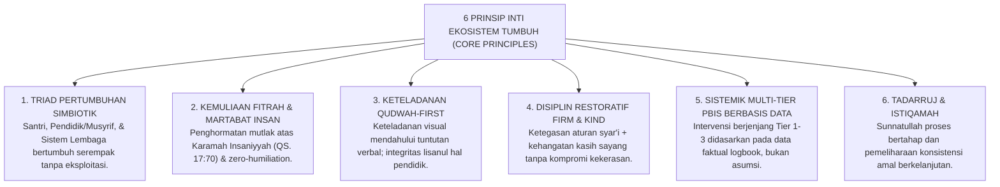
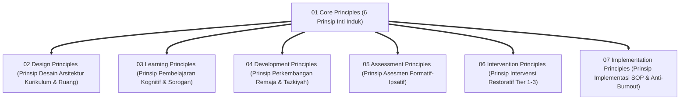

# P2-01-07: SINTESIS PRINSIP UTAMA (CORE PRINCIPLES) EKOSISTEM TUMBUH
## *Konsolidasi 6 Pilar Prinsip Inti: Dari Fondasi Filosofis Menuju Konstitusi Operasional Pengasuhan Pesantren Modern*

**Nomor Identifikasi**: `P2-01-07/SINTESIS-CORE-PRINCIPLES/2026`  
**Domain**: `02 Principles` > `01 Core Principles`  
**Dewan Pakar**: `pakar-filosofi-tumbuh`, `pakar-arsitektur-pbis-restoratif`, `pakar-tata-kelola-qudwah`

---

## 📑 DAFTAR ISI ANALITIS

1. [1. Konsolidasi Enam Prinsip Inti TUMBUH](#1-konsolidasi-enam-prinsip-inti-tumbuh)
2. [2. Matriks Epistemologis & Operasional Enam Core Principles](#2-matriks-epistemologis--operasional-enam-core-principles)
3. [3. Interkoneksi Core Principles dengan 6 Sub-Domain Prinsip Lanjutan](#3-interkoneksi-core-principles-dengan-6-sub-domain-prinsip-lanjutan)
4. [4. Deklarasi Konstitusi Nilai Ekosistem Pesantren TUMBUH](#4-deklarasi-konstitusi-nilai-ekosistem-pesantren-tumbuh)

---

### 1. Konsolidasi Enam Prinsip Inti TUMBUH

Sub-Domain `01 Core Principles` adalah konstitusi nilai tertinggi yang mengikat seluruh kebijakan, operasional, dan relasi di Ekosistem TUMBUH:

---

### 2. Matriks Epistemologis & Operasional Enam Core Principles

| No | Core Principle | Landasan Turats & Dalil Syar'i | Landasan Sains Kontemporer | Perwujudan Operasional di Pesantren |
| :---: | :--- | :--- | :--- | :--- |
| **1** | **Triad Simbiotik** | HR. Muslim (*Al-Mu'min lil Mu'min kal Bunyan*). | *Ecological Systems* (Bronfenbrenner) & *Systems Thinking* (Senge). | Koordinasi mingguan terpadu & sistem shift sehat anti-burnout. |
| **2** | **Kemuliaan Fitrah** | QS. Al-Isra': 70, Kaidah *Adh-Dhararu Yuzal*. | *Innate Morality* (Bloom) & Konvensi Hak Anak PBB 1989. | Eliminasi mutlak pemukulan, perundungan, & pelabelan hina. |
| **3** | **Qudwah-First** | QS. Al-Ahzab: 21, Kaidah *Lisanul Hal Afshahu*. | *Mirror Neuron System* (Rizzolatti) & *Bandura Modeling*. | Asatidz shalat awal waktu & memungut sampah sebelum menegur. |
| **4** | **Firm & Kind** | HR. Muslim (*Innar Rifqa La Yakunu fi Syai'in...*). | *Authoritative Parenting* (Baumrind) & *Positive Discipline*. | Tegas menjaga aturan syar'i + lembut dalam proses restitusi 4R. |
| **5** | **Multi-Tier PBIS** | QS. Al-Hujurat: 6 (Perintah Tabayyun Faktual). | *School-Wide PBIS* (Sugai & Horner) & *FBA/BIP Framework*. | Intervensi Tier 1–3 berbasis data dashboard logbook digital. |
| **6** | **Tadarruj-Istiqamah**| HR. Bukhari (*Ahabbul A'mali Adwamuha*). | *Atomic Habits Marginal Gains* (Clear) & *Kaizen Model*. | Pentahapan target hafalan/ibadah dan apresiasi streak konsistensi. |

---

### 3. Interkoneksi Core Principles dengan 6 Sub-Domain Lanjutan

Enam prinsip inti ini menjadi induk penuntun bagi seluruh sub-domain dalam **Domain 02: Principles**:

---

### 4. Deklarasi Konstitusi Nilai Ekosistem Pesantren TUMBUH

> *"Enam Prinsip Inti ini bukanlah sekadar teks hiasan dinding, melainkan konstitusi hidup yang mengikat seluruh jiwa di Ekosistem TUMBUH: dari Pimpinan Pesantren hingga santri termuda. Segala SOP, regulasi, dan tindakan pengasuhan yang bertentangan dengan keenam prinsip ini batal demi syariat, hukum, dan ilmu pengetahuan."*
