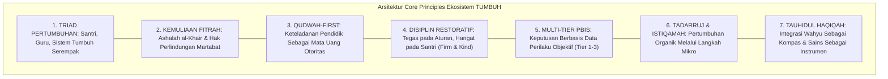

# P2-01-07-Sintesis-Core-Principles-TUMBUH

## Tujuan
Menyintesiskan seluruh 7 Prinsip Utama (*Core Principles*) ekosistem pesantren TUMBUH ke dalam matriks hukum terpadu dan melakukan audit koherensi internal sebelum prinsip-prinsip ini diturunkan ke desain sistem berikutnya.

---

## 1. Arsitektur Sintesis 7 Prinsip Utama

---

## 2. Matriks Evaluasi Koherensi & Uji Celah Internal

| Prinsip Inti | Potensi Deviasi Lapangan | Benteng Perlindungan Konseptual TUMBUH |
| :--- | :--- | :--- |
| **1. Triad Pertumbuhan** | Hanya santri yang dituntut disiplin, asatidz burnout & sistem kaku. | Wajib ada supervisi kesejahteraan asatidz dan evaluasi SOP lembaga secara berkala. |
| **2. Kemuliaan Fitrah** | Pelabelan santri nakal/jahat yang memutus harapan perbaikan. | SOP Disiplin Positif: Menghukum perilaku dengan konsekuensi logis, dilarang mencela pribadi santri. |
| **3. Qudwah-First** | Ustadz/Musyrif banyak ceramah tetapi perilakunya melanggar aturan. | Penilaian kinerja asatidz berbasis indeks keteladanan dan ketaatan SOP harian. |
| **4. Disiplin Restoratif** | Sikap permisif serba boleh tanpa ketegasan aturan. | Keseimbangan **Firm & Kind**: Tegas menegakkan batasan SOP, hangat dalam memperlakukan martabat. |
| **5. Multi-Tier PBIS** | Pengambilan keputusan hukuman berdasarkan gosip/emosi pembina. | Wajib berbasis data faktual logbook PBIS (waktu, lokasi, bukti fisik, tabayyun). |
| **6. Tadarruj & Istiqamah** | Menuntut santri baru langsung sempurna atau sebaliknya putus asa. | Panduan tangga adab bertahap T1 $\rightarrow$ T2 $\rightarrow$ T3 $\rightarrow$ T4 dengan ekspektasi terukur. |

---

## 3. Kesimpulan & Pernyataan Resmi Core Principles

Dengan selesainya perumusan seluruh 7 berkas ini, sub-domain **`01 Core Principles`** dinyatakan:
1. **Koheren & Utuh**: Tidak ada pertentangan antar prinsip; setiap prinsip saling menopang.
2. **Berakar Kuat pada Turats**: Selaras dengan Al-Qur'an, Hadits, Fiqh Tarbiyah, dan Maqashid Syari'ah.
3. **Didukung Bukti Sains Global**: Tervalidasi oleh riset PBIS, CASEL SEL, Observational Learning, dan Behavioral Science.
4. **Bebas Feodalisme & Kekerasan**: Menutup segala celah justifikasi kontak fisik atau penindasan senioritas.

---

## 4. Status Dokumen
* **Status**: ✅ **SELESAI (Status Mutu: A+)**
* **Level**: Subproject Induk
* **Project**: `02 Principles`
* **Subproject**: `01 Core Principles`
* **Langkah Berikutnya**: Melanjutkan ke sub-domain berikutnya: **`02 Design Principles`**.
