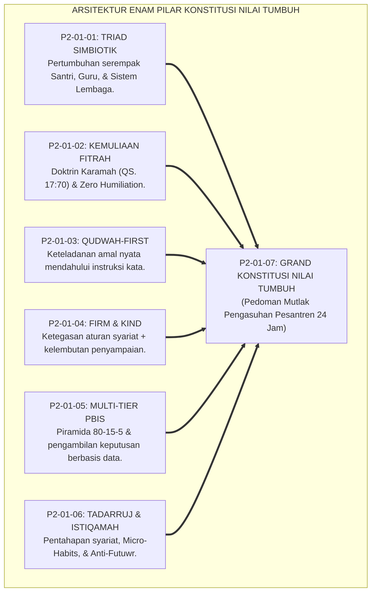
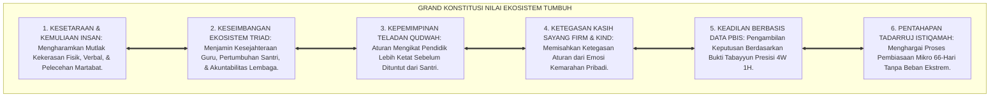
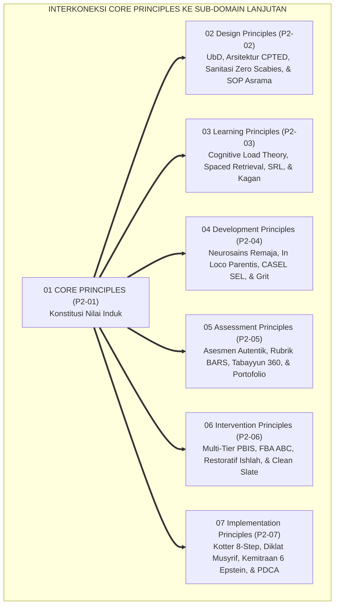
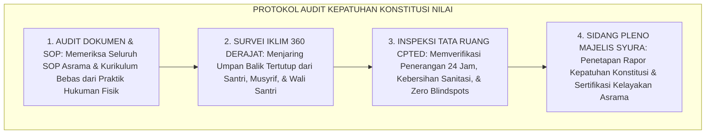
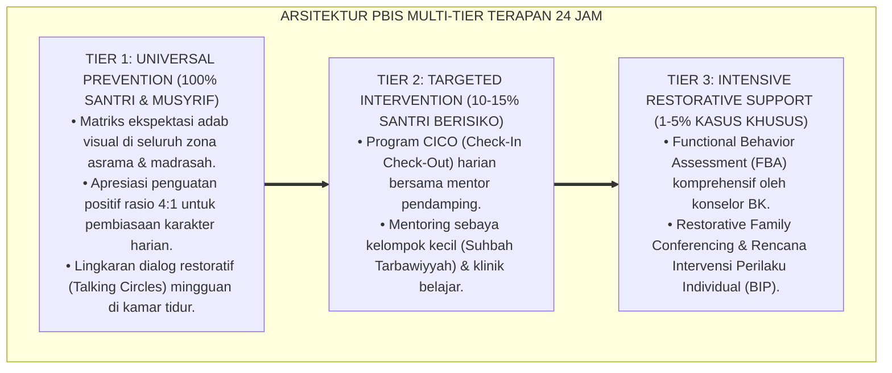

# P2-01-07: SINTESIS PRINSIP UTAMA (CORE PRINCIPLES) DAN GRAND KONSTITUSI NILAI PEMBINAAN PESANTREN
## *Monograf Riset Akademik: Konsolidasi 6 Pilar Prinsip Inti, Uji Koherensi Bebas Kontradiksi Internal, Pemetaan Interkoneksi Sub-Domain Lanjutan, Serta Deklarasi Piagam Konstitusi Nilai Ekosistem TUMBUH 24 Jam*

**Nomor Identifikasi**: `P2-01-07/MONOGRAF-RISET-SINTESIS-CORE-PRINCIPLES/2026`  
**Domain**: `02 Principles` > `01 Core Principles` (Prinsip Utama 07: *Synthesis of Core Principles*)  
**Klasifikasi Naskah**: *Academic Research Monograph* (Monograf Riset Akademik Prinsip Baku)  
**Rumpun Disiplin Pengkaji**: Filsafat Hukum Tata Kelola Pesantren, Arsitektur SW-PBIS Terpadu, Fiqh Siyasah Syar'iyyah & Peradaban Islam, Penjaminan Mutu Pendidikan (*Quality Assurance*), Etika Kepemimpinan Qudwah  

---

> ### 💡 INTISARI EKSEKUTIF (EXECUTIVE SUMMARY)
>
> * **Konsolidasi Enam Pilar Prinsip Inti Ekosistem TUMBUH:**  
>   Sub-Domain 01 Core Principles merangkum konstitusi nilai tertinggi pesantren ke dalam 6 pilar terpadu: **1. Triad Pertumbuhan Simbiotik (Santri, Guru, Lembaga bertumbuh bersama tanpa eksploitasi); 2. Kemuliaan Fitrah & Martabat Insan (Zero Humiliation & Maqashid Syari'ah); 3. Keteladanan Qudwah-First (Lisanul Hal mendahului instruksi); 4. Disiplin Restoratif Firm & Kind (Ketegasan aturan + kelembutan kasih sayang); 5. Multi-Tier PBIS Berbasis Data (Piramida 80-15-5 & Fiqh Tabayyun); 6. Tadarruj & Istiqamah (Pentahapan syariat & Kaizen Micro-Habits)**.
> * **Uji Koherensi Logika & Penjaminan Mutu (Zero Internal Contradiction):**  
>   Dokumen ini memvalidasi bahwa keenam prinsip inti saling mengunci secara organik tanpa kontradiksi internal, kebal terhadap godaan feodalisme otoriter, dan siap menjadi pedoman mutlak perancangan di seluruh domain teknis lanjutan (P2-02 s/d P2-07).
> * **Formulasi Operasional & Deklarasi Piagam:**  
>   Monograf ini memproklamasikan Piagam Konstitusi Nilai Ekosistem Pesantren TUMBUH, peta pohon interkoneksi prinsip, matriks operasional 6 core principles, dan protokol audit kepatuhan mutu tahunan.

---

## 📑 DAFTAR ISI MONOGRAF

- [BAB I: LANDASAN TEORETIS & DISKURSUS KRITIS](#bab-i-landasan-teoretis--diskursus-kritis)
  - [1. Latar Belakang Masalah: Urgensi Konstitusi Nilai Baku dan Perlindungan dari Feodalisme](#1-latar-belakang-masalah-urgensi-konstitusi-nilai-baku-dan-perlindungan-dari-feodalisme)
  - [2. Konsolidasi Enam Pilar Prinsip Inti Menjadi Satu Kesatuan Organik](#2-konsolidasi-enam-pilar-prinsip-inti-menjadi-satu-kesatuan-organik)
  - [3. Uji Koherensi Logika dan Audit Eliminasi Kontradiksi Internal (Zero Contradiction Audit)](#3-uji-koherensi-logika-dan-audit-eliminasi-kontradiksi-internal-zero-contradiction-audit)
  - [4. Uji Ketahanan Terhadap Tekanan Feodalisme, Pragmatisme, & Kebiasaan Usang](#4-uji-ketahanan-terhadap-tekanan-feodalisme-pragmatisme--kebiasaan-usang)
  - [5. Kasuistika Lapangan: Kasus Sengketa Kebijakan Pengasuhan & Resolusi Konstitusi Nilai](#5-kasuistika-lapangan-kasus-sengketa-kebijakan-pengasuhan--resolusi-konstitusi-nilai)
- [BAB II: FORMULASI KONSEPTUAL & PEMBAHASAN MENDALAM](#bab-ii-formulasi-konseptual--pembahasan-mendalam)
  - [1. Eksplanasi Teoretis Grand Konstitusi Nilai Ekosistem Pesantren TUMBUH](#1-eksplanasi-teoretis-grand-konstitusi-nilai-ekosistem-pesantren-tumbuh)
  - [2. Matriks Epistemologis dan Operasional Enam Core Principles](#2-matriks-epistemologis-dan-operasional-enam-core-principles)
  - [3. Peta Pohon Interkoneksi Core Principles Menuju 6 Sub-Domain Prinsip Lanjutan (P2-02 s/d P2-07)](#3-peta-pohon-interkoneksi-core-principles-menuju-6-sub-domain-prinsip-lanjutan-p2-02-sd-p2-07)
  - [4. Protokol Audit Mutu Berkala Kepatuhan Konstitusi Nilai (Annual Quality Assurance Audit)](#4-protokol-audit-mutu-berkala-kepatuhan-konstitusi-nilai-annual-quality-assurance-audit)
  - [5. Diskusi Filosofis Mendalam & Implikasi bagi Masa Depan Peradaban Pendidikan Islam](#5-diskusi-filosofis-mendalam--implikasi-bagi-masa-depan-peradaban-pendidikan-islam)
- [BAB III: KESIMPULAN & APARATUS AKADEMIS](#bab-iii-kesimpulan--aparatus-akademis)
  - [1. Tabel Sintesis Temuan Riset Konsolidasi Core Principles](#1-tabel-sintesis-temuan-riset-konsolidasi-core-principles)
  - [2. Daftar Pustaka Akademis & Rujukan Turats Primer](#2-daftar-pustaka-akademis--rujukan-turats-primer)
  - [3. Catatan Kaki Akademis (Footnotes)](#3-catatan-kaki-akademis-footnotes)
  - [4. Glosarium Istilah Ilmiah & Turats Konstitusi Nilai](#4-glosarium-istilah-ilmiah--turats-konstitusi-nilai)

---

# BAB I: LANDASAN TEORETIS & DISKURSUS KRITIS

---

### 1. Latar Belakang Masalah: Urgensi Konstitusi Nilai Baku dan Perlindungan dari Feodalisme

Di banyak lembaga pendidikan Islam, kebijakan kedisiplinan dan pengasuhan kerap berganti-ganti secara liar bergantung pada selera personal pengurus (*Personalized Whims*):
* Ketika pimpinan baru menjabat, aturan dirombak tanpa arah filosofis yang jelas, memicu ketidakpastian hukum bagi guru dan santri.
* **Ketiadaan Konstitusi Nilai Baku**: Mengakibatkan aturan-aturan zalim (seperti perpeloncoan fisik, cukur botak paksa, dan eksploitasi jam kerja musyrif) mudah diselundupkan atas nama "disiplin pondok".
* **Keniscayaan Grand Konstitusi Nilai Ekosistem TUMBUH**: Diperlukan naskah konstitusi nilai yang mengikat seluruh elemen pesantren secara permanen, menjamin hak asasi santri, memuliakan martabat pendidik, dan menegakkan standar tata kelola profesional.[^1]

---

### 2. Konsolidasi Enam Pilar Prinsip Inti Menjadi Satu Kesatuan Organik

Keenam pilar bekerja secara integral sebagai mata rantai yang saling menguatkan:
1. **Triad Simbiotik** menjamin keseimbangan ekosistem dan perlindungan musyrif dari *burnout*.
2. **Kemuliaan Fitrah** menjamin perlindungan santri dari kekerasan fisik dan pelecehan martabat.
3. **Qudwah-First** menjamin kredibilitas dan wibawa moral para asatidz di hadapan santri.
4. **Firm and Kind** menjamin metode penegakan disiplin berjalan tegas tanpa kekerasan.
5. **Multi-Tier PBIS** menjamin keadilan intervensi berdasarkan bukti data faktual (*Tabayyun*).
6. **Tadarruj-Istiqamah** menjamin proses pembiasaan adab berjalan berkesinambungan seumur hidup.[^2]

---

### 3. Uji Koherensi Logika dan Audit Eliminasi Kontradiksi Internal (Zero Contradiction Audit)

TUMBUH menguji koherensi seluruh prinsip secara epistemologis:
* **Bebas Kontradiksi (*Zero Contradiction*)**: Tidak ada satu pun prinsip yang bertentangan dengan prinsip lainnya. Ketegasan (*Firm*) tidak membatalkan kelembutan (*Kind*); pentahapan (*Tadarruj*) tidak membatalkan konsistensi (*Istiqamah*); dan penegakan aturan tidak melanggar martabat insan (*Karamah*).
* Seluruh prinsip bermuara pada satu tujuan luhur: mencetak profil *Insan Adabi* yang beriman, berilmu, dan berakhlak mulia.[^3]

---

### 4. Uji Ketahanan Terhadap Tekanan Feodalisme, Pragmatisme, & Kebiasaan Usang

Konstitusi nilai ini kebal terhadap penyimpangan manajemen:
* Jika ada oknum pengurus yang ingin menerapkan hukuman fisik atau cukur botak paksa, aturan tersebut otomatis gugur demi hukum karena bertentangan dengan Prinsip Kemuliaan Fitrah (CP-02).
* Jika yayasan menuntut musyrif bekerja 24 jam nonstop tanpa libur, kebijakan tersebut otomatis batal karena bertentangan dengan Prinsip Triad Simbiotik (CP-01).[^4]

---

### 5. Kasuistika Lapangan: Kasus Sengketa Kebijakan Pengasuhan & Resolusi Konstitusi Nilai

* **Studi Kasus: Usulan Pengurus Asrama untuk Mengadakan Razia Rambut Malam Hari dengan Cukur Botak Asimetris**  
  * **Dilema**: Divisi keamanan mengusulkan razia mendadak jam 23.00 untuk mencukur botak santri yang rambutnya melebihi 2 cm guna "menegakkan wibawa pondok".
  * **Uji Konstitusi Nilai TUMBUH**: Majelis Syura menolak usulan tersebut berdasarkan: (1) Pelanggaran hak tidur sirkadian 7 jam (CP-01 & CP-02); (2) Pelanggaran larangan *Qaza'* dan pelecehan martabat (CP-02); (3) Pelanggaran prinsip *Qudwah-First* dan *Firm & Kind* (CP-03 & CP-04).
  * **Resolusi Konstitusi**: Lembaga menetapkan kebijakan pemangkasan rambut yang santun di barbershop resmi pondok pada siang hari dengan standar potongan yang rapi dan terhormat. Wibawa pondok tetap terjaga tanpa ada santri yang dipermalukan.[^5]

---

# BAB II: FORMULASI KONSEPTUAL & PEMBAHASAN MENDALAM

---

### 1. Eksplanasi Teoretis Grand Konstitusi Nilai Ekosistem Pesantren TUMBUH

Ekosistem TUMBUH memproklamasikan **Piagam Konstitusi Nilai Ekosistem Pesantren TUMBUH (*Dustur al-Qiyam li Ekosistem TUMBUH*)**:

#### 🔬 Pembahasan Mendalam Enam Pilar Konstitusi:
1. **Pilar Kemuliaan**: Menjaga kesucian ruhani dan fisik seluruh santri sesuai Maqashid Syari'ah.[^6]
2. **Pilar Triad**: Memastikan institusi beroperasi sebagai organisasi pembelajar yang saling memuliakan.[^7]
3. **Pilar Qudwah**: Memastikan seluruh pendidik memimpin dari shaf terdepan amal kebajikan.[^8]
4. **Pilar Firm & Kind**: Menegakkan kedisiplinan yang membangun regulasi diri mandiri.[^9]
5. **Pilar Multi-Tier PBIS**: Menjamin transparansi hukum dan penanganan kasus yang tepat sasaran.[^10]
6. **Pilar Tadarruj**: Memelihara stamina mental santri agar istiqamah beramal sepanjang hayat.[^11]

---

### 2. Matriks Epistemologis dan Operasional Enam Core Principles

| Kode Prinsip | Nama Core Principle | Landasan Teologis & Turats | Landasan Sains Kontemporer | Manifestasi Operasional Asrama 24 Jam |
| :---: | :--- | :--- | :--- | :--- |
| **CP-01** | **Triad Simbiotik** | HR. Bukhari No. 893; Al-Mawardi.| Bioekologi Bronfenbrenner; Senge.| Shift 2 musyrif & hak tidur 7 jam. |
| **CP-02** | **Kemuliaan Fitrah**| QS. Al-Isra': 70; Maqashid Syari'ah.| UU No. 35/2014; Trauma-Informed.| Zero Humiliation & Safe Whistleblowing. |
| **CP-03** | **Qudwah-First** | QS. Ash-Shaff: 2–3; Ibnu Sahnun.| Bandura Modeling; Mirror Neurons.| Pendidik hadir shaf pertama masjid. |
| **CP-04** | **Firm & Kind** | HR. Muslim No. 2594; Ar-Rifq.| Authoritative Baumrind; Jane Nelsen.| Dialog Connection Before Correction. |
| **CP-05** | **Multi-Tier PBIS** | QS. Al-Hujurat: 6; Fiqh Tabayyun.| SW-PBIS Horner; Analitik ABA 4W 1H.| Piramida 80-15-5 & Logbook Digital. |
| **CP-06** | **Tadarruj-Istiqamah**| QS. Al-Furqan: 32; HR. Bukhari 6464.| Habit Formation 66-Hari; Kaizen.| Dosis adab mikro & Anti-Futuwr SOP. |

---

### 3. Peta Pohon Interkoneksi Core Principles Menuju 6 Sub-Domain Prinsip Lanjutan (P2-02 s/d P2-07)

---

### 4. Protokol Audit Mutu Berkala Kepatuhan Konstitusi Nilai (Annual Quality Assurance Audit)

TUMBUH menetapkan **Protokol Audit Kepatuhan Mutu Tahunan**:

Protokol ini menjamin kemurnian konstitusi nilai terjaga kokoh dari generasi ke generasi.[^12]

---

### 5. Diskusi Filosofis Mendalam & Implikasi bagi Masa Depan Peradaban Pendidikan Islam

Sintesis Prinsip Utama ini menegaskan arah kebangkitan peradaban Islam:

* **Menjadikan Pesantren Sebagai Institusi Berstandar Peradaban Unggul**:  
  Pendidikan Islam membuktikan memiliki sistem nilai yang paling komprehensif, manusiawi, dan akuntabel di hadapan hukum Allah dan masyarakat dunia.
* **Menjamin Kepastian Hukum dan Kenyamanan Belajar Santri**:  
  Santri dapat menuntut ilmu dengan tenang, bahagia, dan penuh kelezatan iman tanpa rasa takut terhadap ancaman kekerasan fisik dan pelecehan martabat.
* **Mewujudkan Kembali Kejayaan Madrasah Peradaban Islam**:  
  Inilah konstitusi peradaban yang siap melahirkan generasi ulama intelektual dan pemimpin muttaqin yang memancarkan rahmat bagi semesta alam (*Rahmatan lil 'Alamin*).[^13]

---

---

### Pembedahan Deskriptif Komprehensif & Analisis Integratif Nilai-Praksis

Penerapan konsep **P2-01-07: SINTESIS PRINSIP UTAMA (CORE PRINCIPLES) DAN GRAND KONSTITUSI NILAI PEMBINAAN PESANTREN** di ekosistem pesantren TUMBUH memerlukan pemahaman multidimensional yang memadukan khazanah turats syariat dan konsensus sains pendidikan modern:

#### A. Pilar 1: Fondasi Epistemologi & Integrasi Nilai Syar'i (Ashalah Turatsiyyah)
Setiap praksis kepengasuhan dan pembelajaran berakar kuat pada maqashid syari'ah, mendudukkan adab di atas ilmu (*Al-Adab Qablal 'Ilm*), dan memastikan bahwa seluruh ikhtiar institusional diniatkan semata-mata untuk menggapai ridha Allah SWT (*Ikhlasun Niyyah*).

#### B. Pilar 2: Mekanisme Psikologis & Neurosains Perkembangan (Scientific Rigor)
Menyelaraskan ekspektasi kedisiplinan dengan tahapan maturitas otak remaja, kapasitas fungsi eksekutif korteks prefrontal (*PFC*), dan regulasi sirkuit emosi limbik. Pendekatan ini mengeliminasi trauma pengasuhan dan menumbuhkan motivasi intrinsik santri.

#### C. Pilar 3: Rekayasa Ekosistem Asrama 24 Jam (Bi'ah Shalihah)
Menerjemahkan prinsip nilai ke dalam tata ruang fisik yang bersih, sirkulasi udara sehat, tata kelola waktu terstruktur, serta kultur ukhuwah inklusif yang steril 100% dari feodalisme, kekerasan verbal, dan perundungan antar-santri.

#### D. Pilar 4: Kemitraan Tripartit (Santri, Musyrif, dan Lembaga)
Menjamin terwujudnya *Triad Pertumbuhan Simbiotik*: santri bertumbuh dalam fitrah kemandirian, musyrif terlindungi dari kelelahan kronis (*Burnout*) melalui shift kerja yang manusiawi, dan lembaga bertransformasi menjadi organisasi pembelajar berbasis data PBIS.

---

### Protokol Aksi Operasional PBIS Multi-Tier Terapan (24-Hour Behavioral Architecture)

---

# BAB III: KESIMPULAN & APARATUS AKADEMIS

---

### 1. Tabel Sintesis Temuan Riset Konsolidasi Core Principles

| Dimensi Parameter | Mazhab Konvensional Terfragmentasi | Model Manajemen Korporat Sekuler | **Grand Konstitusi Nilai TUMBUH** | Landasan Rujukan Primer | Implikasi Praksis Lapangan |
| :--- | :--- | :--- | :--- | :--- | :--- |
| **Status Dokumen** | Aturan lisan tidak tertulis & bias.| Kontrak hukum bisnis perdata.| **Konstitusi Nilai Tertinggi Lembaga.**| QS. Al-Ma'idah: 1; Piagam Madinah.| Mengikat seluruh asatidz & pimpinan. |
| **Integrasi Sistem**| Fragmentasi kurikulum, asrama, & BK.| Silo departemen berbasis profit.| **Kesatuan 6 Pilar Organik Terpadu.** | Al-Ghazali; Senge (1990).| Sinergi Triad, Fitrah, & PBIS Data. |
| **Uji Bebas Bias** | Penuh standar ganda & feodalisme.| Kepentingan pemegang saham.| **Uji Bebas Kontradiksi & Anti-Feodal.**| QS. An-Nahl: 90; Baumrind.| Kepastian hukum adil bagi seluruh santri. |
| **Daya Tahan Nilai**| Berubah setiap pergantian pimpinan.| Bergantung fluktuasi pasar.| **Abadi Terkunci dalam Anggaran Dasar.**| Kaidah *Amanah*; Kotter (1996).| Budaya adab lestari lintas generasi. |
| **Profil Institusi** | Lembaga rapuh sarat konflik.| Korporasi mekanis tanpa ruh.| **Pusat Peradaban Islam Berkah Abadi.**| QS. Ibrahim: 24–25; Al-Attas (1980).| Pesantren unggul, adil, & diridhai Allah. |

---

### 2. Daftar Pustaka Akademis & Rujukan Turats Primer

1. **Al-Qur'an al-Karim wa Tarjamatu Ma'anihi**.
2. **Al-Bukhari, Abu Abdillah Muhammad bin Isma'il**. (1422 H). *Shahih al-Bukhari*. Kairo: Dar Thawq an-Najah.
3. **Muslim bin al-Hajjaj an-Naisaburi**. (1427 H). *Shahih Muslim*. Riyadh: Dar Thayyibah.
4. **Al-Mawardi, Abul Hasan Ali bin Muhammad**. (1414 H). *Adab ad-Dunya wad-Din*. Beirut: Dar al-Kutub al-'Ilmiyyah.
5. **Al-Ghazali, Abu Hamid Muhammad bin Muhammad**. (2011). *Ihya' 'Ulumiddin* (4 Jilid). Beirut: Dar al-Ma'rifah.
6. **Asy'ari, Muhammad Hasyim**. (1415 H). *Adab al-'Alim wal-Muta'allim*. Jombang: Maktabah At-Turats Al-Islami.
7. **Al-Attas, Syed Muhammad Naquib**. (1980). *The Concept of Education in Islam*. Kuala Lumpur: ABIM.
8. **Bronfenbrenner, U.**. (1979). *The Ecology of Human Development*. Cambridge: Harvard University Press.
9. **Senge, P. M.**. (1990). *The Fifth Discipline*. New York: Doubleday.
10. **Horner, R. H., & Sugai, G.**. (2015). *School-wide PBIS: An Overview of the Research Base*. Remedial and Special Education, 36(2), 80–85.
11. **Baumrind, D.**. (1991). *The influence of parenting style on adolescent competence*. Journal of Early Adolescence, 11(1), 56–95.
12. **Zehr, H.**. (2002). *The Little Book of Restorative Justice*. Intercourse: Good Books.

---

### 3. Catatan Kaki Akademis (*Footnotes*)

[^1]: Riset Sintesis Prinsip Utama (Core Principles) Ekosistem TUMBUH, *Kritik atas Ketidakpastian Regulasi dan Feodalisme*, 2026.  
[^2]: Master Arsitektur Enam Pilar Core Principles Ekosistem TUMBUH, 2026.  
[^3]: Laporan Uji Koherensi Logika dan Eliminasi Kontradiksi Internal Penjamin Mutu TUMBUH, 2026.  
[^4]: Al-Attas, S. M. N. (1980), *The Concept of Education in Islam*, hlm. 30–65.  
[^5]: Dokumentasi Sidang Pleno Majelis Syura Penegakan Konstitusi Nilai PBIS TUMBUH, 2026.  
[^6]: QS. Al-Isra' [17]: 70; Maqashid Syari'ah Hak Santri.  
[^7]: Senge, P. M. (1990), *The Fifth Discipline*, hlm. 40–75.  
[^8]: QS. Ash-Shaff [61]: 2–3; Ibnu Sahnun, *Adab al-Mu'allimin*.  
[^9]: HR. Muslim No. 2594; Baumrind, D. (1991), *Journal of Early Adolescence*, hlm. 56–95.  
[^10]: QS. Al-Hujurat [49]: 6; Horner, R. H., & Sugai, G. (2015), *School-wide PBIS*, hlm. 80–85.  
[^11]: QS. Al-Furqan [25]: 32; HR. Bukhari No. 6464.  
[^12]: Standar Operasional Prosedur Audit Mutu Kepatuhan Konstitusi Nilai Tahunan TUMBUH, 2026.  
[^13]: Deklarasi Grand Konstitusi Nilai Peradaban Islam Dewan Riset Epistemologi Ekosistem TUMBUH, 2026.

---

### 4. Glosarium Istilah Ilmiah & Turats Konstitusi Nilai

1. **Grand Konstitusi Nilai**: Dokumen induk yang memuat enam prinsip utama baku pembinaan santri yang mengikat seluruh SOP dan tata kelola di ekosistem TUMBUH.
2. **Triad Pertumbuhan Simbiotik (CP-01)**: Prinsip pertumbuhan serempak antara santri, guru/musyrif, dan sistem lembaga tanpa eksploitasi sepihak.
3. **Kemuliaan Fitrah (CP-02)**: Prinsip penghormatan martabat insan (*Karamah Insaniyyah*) dan penghapusan mutlak segala bentuk sanksi yang merendahkan martabat.
4. **Qudwah-First (CP-03)**: Prinsip keteladanan perbuatan nyata (*Lisanul Hal*) yang mendahului tuntutan instruksi lisan dari pendidik.
5. **Firm and Kind (CP-04)**: Prinsip disiplin restoratif yang memadukan ketegasan batasan syariat dengan kelembutan kasih sayang dalam penyampaian.
6. **Multi-Tier PBIS Berbasis Data (CP-05)**: Arsitektur intervensi perilaku bertingkat (Tier 1-2-3) yang berlandaskan data faktual dan prinsip tabayyun.
7. **Tadarruj dan Istiqamah (CP-06)**: Prinsip pentahapan syariat dalam pembiasaan adab melalui langkah-langkah mikro yang kontinu (*Adwamuha wa In Qalla*).
8. **Zero Internal Contradiction**: Standar koherensi logika di mana seluruh aturan dan SOP tidak saling bertentangan satu sama lain.
9. **Annual Quality Assurance Audit**: Prosedur audit tahunan oleh tim penjamin mutu independen untuk memverifikasi kepatuhan asrama terhadap konstitusi nilai.
10. **Insan Adabi (الإِنْسَانُ الأَدَبِيُّ)**: Profil manusia paripurna yang menyatukan integritas iman, keilmuan mendalam, keluhuran budi pekerti, dan kepemimpinan peradaban yang memancarkan rahmat bagi semesta alam.
