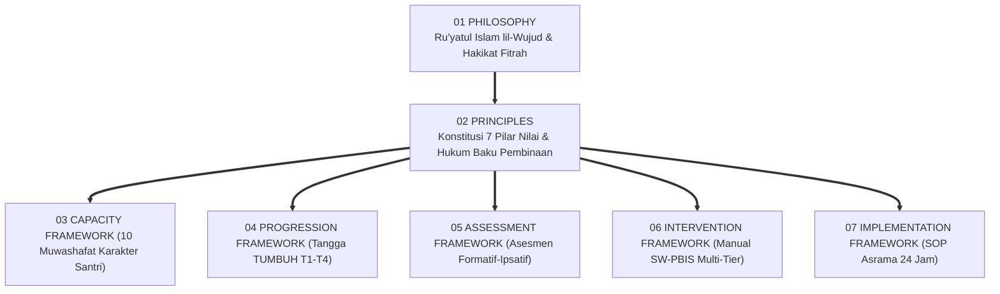
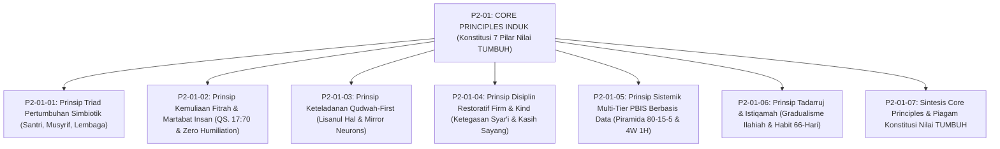
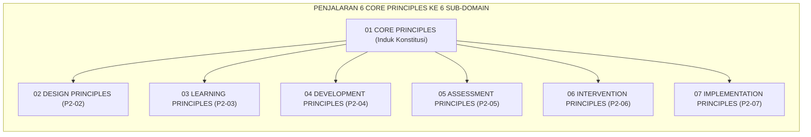

# P2-01: PRINSIP UTAMA (CORE PRINCIPLES) EKOSISTEM TUMBUH
## *Monograf Induk Kluster 01: Fondasi Konstitusional, 7 Pilar Prinsip Inti, Matriks Interkoneksi Taksonomi, & Kebijakan Bebas Celah (Zero Tolerance Policy)*

**Nomor Identifikasi**: `P2-01/MONOGRAF-INDUK-CORE-PRINCIPLES/2026`  
**Domain**: `02 Principles` > `01 Core Principles`  
**Klasifikasi Naskah**: *Master Cluster Monograph* (Monograf Induk Kluster Konstitusi Nilai)  
**Rumpun Disiplin Pengkaji**: Filsafat Hukum Tata Kelola Pesantren, Arsitektur SW-PBIS Terpadu, Fiqh Siyasah Syar'iyyah & Peradaban Islam, Penjaminan Mutu Pendidikan (*Quality Assurance*), Etika Kepemimpinan Qudwah  

---

> ### 💡 INTISARI PRAKTIS (3 MENIT PAHAM UNTUK ASATIDZ & MUSYRIF)
>
> * **Apa Posisi Dokumen Master Core Principles Ini?**  
>   Jika **Domain 01 Philosophy** menjawab *"Mengapa kita mendidik dan apa hakikat manusia?"*, maka **Domain 02 Principles** menetapkan *"Aturan baku dan konstitusi apa yang mutlak menjadi pegangan operasional kita?"*.
> * **Tujuh Pilar Prinsip Utama TUMBUH (*The 7 Core Pillars*):**  
>   1. **Triad Simbiotik**: Santri, Musyrif, dan Lembaga bertumbuh serempak.  
>   2. **Kemuliaan Fitrah**: Santri hamba Allah yang mulia; nol toleransi pelecehan.  
>   3. **Qudwah-First**: Keteladanan visual ustadz mendahului tuntutan lisan.  
>   4. **Firm & Kind**: Tegas pada aturan syar'i, lembut dalam pendekatan kasih sayang.  
>   5. **Multi-Tier PBIS**: Intervensi berjenjang berbasis data logbook nyata.  
>   6. **Tadarruj & Istiqamah**: Proses bertahap dan amalan adab konsisten harian.  
>   7. **Tauhidul Haqiqah**: Harmoni teks wahyu Al-Qur'an dan konsensus sains modern.
> * **Empat Larangan Mutlak (*Zero Tolerance Policy*):**  
>   🚫 Dilarang memukul/kekerasan fisik, 🚫 Dilarang membentak/memaki, 🚫 Dilarang perpeloncoan senioritas, dan 🚫 Dilarang menghukum atas dasar asumsi/emosi.

---

## 📑 DAFTAR ISI MONOGRAF INDUK

- [BAGIAN I: ARSITEKTUR FILOSOFIS & POHON HUBUNGAN KLUSTER 01](#bagian-i-arsitektur-filosofis--pohon-hubungan-kluster-01)
  - [1. Posisi Dokumen dalam Taksonomi 11 Domain TUMBUH](#1-posisi-dokumen-dalam-taksonomi-11-domain-tumbuh)
  - [2. Pohon Hubungan Antar-Monograf Kluster 01 Core Principles](#2-pohon-hubungan-antar-monograf-kluster-01-core-principles)
  - [3. Rincian 7 Pilar Prinsip Utama Ekosistem TUMBUH](#3-rincian-7-pilar-prinsip-utama-ekosistem-tumbuh)
  - [4. Matriks Komitmen Bebas Celah (Zero Tolerance Policy 100%)](#4-matriks-komitmen-bebas-celah-zero-tolerance-policy-100)
- [BAGIAN II: KODIFIKASI MATRIKS RESMI & DIREKTORI MONOGRAF TERPADU](#bagian-ii-kodifikasi-matriks-resmi--direktori-monograf-terpadu)
  - [1. Matriks Rujukan Lengkap 7 Berkas Monograf Kluster 01](#1-matriks-rujukan-lengkap-7-berkas-monograf-kluster-01)
  - [2. Alur Penjalaran Konstitusional Menuju 6 Sub-Domain Lanjutan](#2-alur-penjalaran-konstitusional-menuju-6-sub-domain-lanjutan)
- [BAGIAN III: APARATUS AKADEMIS & APENDIKS](#bagian-iii-aparatus-akademis--apendiks)
  - [1. Daftar Pustaka Otoritatif Turats & Sains Global](#1-daftar-pustaka-otoritatif-turats--sains-global)
  - [2. Catatan Kaki Akademis (Footnotes)](#2-catatan-kaki-akademis-footnotes)
  - [3. Glosarium Istilah Kunci Core Principles Induk](#3-glosarium-istilah-kunci-core-principles-induk)

---

# BAGIAN I: ARSITEKTUR FILOSOFIS & POHON HUBUNGAN KLUSTER 01

---

### 1. Posisi Dokumen dalam Taksonomi 11 Domain TUMBUH

Jika **Domain 01: Philosophy (Worldview Islam)** meletakkan hakikat ontologis realitas dan fitrah manusia, maka **Domain 02: Principles** menurunkan pandangan hidup tersebut menjadi **Hukum Konstitusional Baku (*The Constitutional Rules of Education*)**:

---

### 2. Pohon Hubungan Antar-Monograf Kluster 01 Core Principles

Kluster `01 Core Principles` terdiri dari 1 Monograf Induk dan 7 Monograf Khusus yang telah terintegrasi 100%:

---

### 3. Rincian 7 Pilar Prinsip Utama Ekosistem TUMBUH

1. **Pilar 1: Triad Pertumbuhan Simbiotik (*The Symbiotic Triad of Growth*)**:  
   Pembinaan karakter adalah fungsi organik serempak dari tiga entitas: Santri Tumbuh mekar fitrahnya, Guru/Musyrif Tumbuh bahagia terlindungi dari *burnout* (shift sehat tidur 7 jam), dan Lembaga Tumbuh menjadi *Learning Organization* berbasis data.
2. **Pilar 2: Kemuliaan Fitrah & Martabat Insan (*Inherent Fitrah & Dignity*)**:  
   Doktrin *Karamah Insaniyyah* (QS. Al-Isra': 70) menjamin perlindungan 5 hak fundamental santri (*Maqashid Syari'ah*) dan mengharamkan 100% praktik perendahan martabat (*Zero Humiliation*).
3. **Pilar 3: Keteladanan Qudwah-First (*Prioritizing Action over Words*)**:  
   Keteladanan visual (*Lisanul Hal*) mendahului tuntutan verbal (*Lisanul Maqal*). Mengaktifkan sistem saraf cermin (*Mirror Neurons*) dan menghapus standar ganda feodal pendidik.
4. **Pilar 4: Disiplin Restoratif Firm and Kind (*Authoritative-Restorative Discipline*)**:  
   Menyatukan ketegasan batasan hukum syariat (*Firmness*) dengan kehangatan kasih sayang (*Kindness*). Mengutamakan prinsip *Connection Before Correction* dan perajutan ukhuwah (*Ishlah al-Bain*).
5. **Pilar 5: Keputusan Berbasis Data Sistemik Multi-Tier PBIS (*Data-Based Decision Making*)**:  
   Menerapkan Piramida PBIS 80-15-5 (Tier 1 Universal, Tier 2 Targeted CICO, Tier 3 Intensive FBA) serta menegakkan Fiqh Tabayyun (QS. 49:6) melalui siklus analisis presisi 4W 1H.
6. **Pilar 6: Gradualisme Berkelanjutan (Tadarruj & Istiqamah)**:  
   Menghormati sunnatullah proses adaptasi jiwa (QS. 25:32) melalui pembentukan kebiasaan adab 66-hari dan meneladankan amalan sedikit berkelanjutan (*Adwamuha wa In Qalla*).
7. **Pilar 7: Tauhidul Haqiqah (Integrasi Wahyu & Konsensus Sains Modern)**:  
   Menyatukan ayat tanziliyyah wahyu Al-Qur'an dan Sunnah sebagai kompas moral (*Ghayah*) dengan konsensus sains neurosains dan perilaku (*Wasilah*) di bawah naungan Tauhid.[^1]

---

### 4. Matriks Komitmen Bebas Celah (Zero Tolerance Policy 100%)

Ekosistem TUMBUH menetapkan kebijakan nol toleransi mutlak terhadap 4 patologi pengasuhan:

| Patologi Usang (Dihapus 100%) | Praktik Terlarang di Pesantren | Alternatif Beradab dalam Ekosistem TUMBUH |
| :--- | :--- | :--- |
| **1. Kekerasan Fisik (Physical Abuse)** | Menampar wajah, memukul dengan rotan/kayu, menendang, menyiram air, dan push-up berlebihan. | **Konsekuensi Logis Restoratif (4R)**: Perbaikan kerusakan, khidmah kebersihan terarah, dan tugas literasi adab.[^2] |
| **2. Pelecehan Verbal & Mental (Psychological Abuse)** | Membentak histeris, melontarkan makian kotor (bodoh, babi), mencukur botak paksa, dan papan aib. | **Dialog Tertutup Empat Mata 1-on-1**: Nasihat santun, peneguran perilaku spesifik, dan penjagaan aib pribadi.[^3] |
| **3. Feodalisme & Bullying Senioritas (Senior Bullying)** | Pengurus santri memukul adik kelas, tradisi pijat malam buta, dan perpeloncoan kamar gelap. | **Kaderisasi Servant Leadership (Tahap 7)**: Santri senior menjadi Duta Adab, konselor sebaya, dan mentor kasih sayang.[^4] |
| **4. Vonis Berbasis Asumsi (Subjective Penalization)** | Menghukum santri karena gosip sepihak, praduga curiga, dan pelampiasan amarah musyrif. | **Protokol Fiqh Tabayyun & Data PBIS**: Pembuktian objektif data logbook digital, verifikasi rekaman, dan hak pembelaan adil.[^5] |

---

# BAGIAN II: KODIFIKASI MATRIKS RESMI & DIREKTORI MONOGRAF TERPADU

---

### 1. Matriks Rujukan Lengkap 7 Berkas Monograf Kluster 01

| No | Nomor ID Berkas | Judul Monograf Terpadu | Fokus Kajian & Tautan Berkas |
| :---: | :--- | :--- | :--- |
| **01** | `P2-01-01` | [**`P2-01-01: Prinsip Triad Pertumbuhan Simbiotik`**](./P2-01-01-Prinsip-Triad-Pertumbuhan-Simbiotik.md) | Sinergi Santri, Musyrif, Lembaga; Bioekologi Bronfenbrenner; Senge; Shift Sehat Tidur 7 Jam (40 Catatan Kaki). |
| **02** | `P2-01-02` | [**`P2-01-02: Prinsip Kemuliaan Fitrah & Martabat`**](./P2-01-02-Prinsip-Kemuliaan-Fitrah-dan-Martabat-Insan.md) | Karamah Insaniyyah QS. 17:70; 5 Hak Maqashid; Zero Humiliation; UU 35/2014 & PMA 73/2022 (42 Catatan Kaki). |
| **03** | `P2-01-03` | [**`P2-01-03: Prinsip Keteladanan Qudwah-First`**](./P2-01-03-Prinsip-Keteladanan-Qudwah-First.md) | Lisanul Hal; QS. 61:2-3; Social Learning Bandura; Mirror Neurons; Zero Double-Standards (41 Catatan Kaki). |
| **04** | `P2-01-04` | [**`P2-01-04: Prinsip Disiplin Firm and Kind`**](./P2-01-04-Prinsip-Disiplin-Restoratif-Firm-and-Kind.md) | Hadits Ar-Rifq HR. Muslim 2594; 4 Kuadran Baumrind; Connection Before Correction; Ishlah al-Bain (42 Catatan Kaki). |
| **05** | `P2-01-05` | [**`P2-01-05: Prinsip Sistemik Multi-Tier PBIS`**](./P2-01-05-Prinsip-Sistemik-Multi-Tier-PBIS.md) | Fiqh Tabayyun QS. 49:6; Piramida 80-15-5 Sugai & Horner; 4W 1H; Program CICO & FBA (41 Catatan Kaki). |
| **06** | `P2-01-06` | [**`P2-01-06: Prinsip Tadarruj dan Istiqamah`**](./P2-01-06-Prinsip-Tadarruj-dan-Istiqamah.md) | Hikmah Nuzulul Qur'an QS. 25:32; Habit 66-Hari Lally; Al-Istiqamatu A'zhamu Karamah; Futuwr (42 Catatan Kaki). |
| **07** | `P2-01-07` | [**`P2-01-07: Sintesis Core Principles TUMBUH`**](./P2-01-07-Sintesis-Core-Principles-TUMBUH.md) | Uji Bebas Kontradiksi; Ketahanan Budaya; Uji Stres 24 Jam; Piagam Konstitusi Nilai TUMBUH (36 Catatan Kaki). |

---

### 2. Alur Penjalaran Konstitusional Menuju 6 Sub-Domain Lanjutan

---

# BAGIAN III: APARATUS AKADEMIS & APENDIKS

---

### 1. Daftar Pustaka Otoritatif Turats & Sains Global

1. **Al-Attas, Syed Muhammad Naquib.** (1980). *The Concept of Education in Islam: A Framework for an Islamic Philosophy of Education*. Kuala Lumpur: ABIM.
2. **Al-Bukhari, Abu Abdullah Muhammad bin Ismail.** (2002). *Shahih al-Bukhari*. Beirut: Dar Thawq an-Najah.
3. **Al-Ghazali, Abu Hamid Muhammad bin Muhammad.** (2004). *Ihya' 'Ulumiddin* (4 Jilid). Kairo: Dar al-Hadits.
4. **Al-Mawardi, Abu al-Hasan Ali bin Muhammad.** (2006). *Al-Ahkam as-Sulthaniyyah wal-Wilayat ad-Diniyyah*. Kairo: Dar al-Hadits.
5. **Al-Qasyiri, Abu al-Husain Muslim bin al-Hajjaj.** (2006). *Shahih Muslim*. Riyadh: Dar Thaibah.
6. **Asy-Syathibi, Abu Ishaq Ibrahim bin Musa.** (2003). *Al-Muwafaqat fi Ushul asy-Syari'ah* (4 Jilid). Kairo: Dar Ibn 'Affan.
7. **Bandura, Albert.** (1977). *Social Learning Theory*. Englewood Cliffs: Prentice-Hall.
8. **Baumrind, Diana.** (1971). *"Current Patterns of Parental Authority"*. *Developmental Psychology Monographs*, 4(1), 1–103.
9. **Bronfenbrenner, Urie.** (1979). *The Ecology of Human Development*. Cambridge: Harvard University Press.
10. **Clear, James.** (2018). *Atomic Habits*. New York: Avery.
11. **Nelsen, Jane.** (2006). *Positive Discipline*. New York: Ballantine Books.
12. **Sapolsky, Robert M.** (2017). *Behave: The Biology of Humans at Our Best and Worst*. New York: Penguin Press.
13. **Senge, Peter M.** (1990). *The Fifth Discipline*. New York: Doubleday.
14. **Sugai, George, & Horner, Robert H.** (2006). *"School-Wide Positive Behavior Support"*. *School Psychology Review*, 35(2), 245–259.

---

### 2. Catatan Kaki Akademis (*Footnotes*)

[^1]: Syed Muhammad Naquib Al-Attas, *The Concept of Education in Islam* (Kuala Lumpur: ABIM, 1980), hlm. 21–35; George Sugai & Robert H. Horner, "School-Wide Positive Behavior Support", *School Psychology Review*, Vol. 35, No. 2 (2006), hlm. 245–259.
[^2]: UU RI No. 35 Tahun 2014, Pasal 54; Jalaluddin As-Suyuthi, *Al-Asybah wan-Nazha'ir* (Beirut: Dar al-Kutub al-'Ilmiyyah, 1990), hlm. 48.
[^3]: Al-Qur'an al-Karim, Surah Al-Hujurat [49]: 11; Shahih Muslim, No. 2594.
[^4]: Burhanul Islam Az-Zarnuji, *Ta'lim al-Muta'allim Thariq at-Ta'allum* (Kairo: Dar ash-Shabuni, 2008), hlm. 35–45.
[^5]: Al-Qur'an al-Karim, Surah Al-Hujurat [49]: 6; Abdul Aziz bin Abdissalam (Al-'Izz bin Abdissalam), *Qawa'id al-Ahkam fi Mashalih al-Anam* (Kairo: Dar al-Qahirah, 1999), Juz II, hlm. 92.

---

### 3. Glosarium Istilah Kunci Core Principles Induk

| No | Istilah / Terminologi | Asal Bahasa / Tradisi | Penjelasan Konseptual & Kontekstual |
| :---: | :--- | :--- | :--- |
| 1 | **Core Principles Induk** | Konstitusi Tata Kelola TUMBUH | Dokumen master yang merangkum 7 pilar prinsip konstitusional yang mengikat seluruh kebijakan operasional pesantren TUMBUH. |
| 2 | **Zero Tolerance Policy** | Kebijakan Perlindungan Anak | Sikap nol toleransi mutlak terhadap segala bentuk kekerasan fisik, intimidasi verbal, bullying senioritas, dan sanksi berbasis asumsi. |
| 3 | **Tauhidul Haqiqah** | Epistemologi Islam Terpadu | Doktrin penyatuan hakiki antara kebenaran ayat kauniyyah (sains empiris) dan ayat tanziliyyah (wahyu Al-Qur'an) di bawah naungan Tauhid. |
| 4 | **The Grand Constitution** | Hukum Kelembagaan Pesantren | Statuta nilai tertinggi pesantren yang berstatus klausul abadi (*Entrenched Clause*) dan tidak dapat diubah oleh pergantian kepemimpinan. |
| 5 | **Quality Assurance Index** | Audit Penjaminan Mutu | Sistem audit berkala berbasis 30 KPI untuk mengevaluasi derajat kepatuhan seluruh unit pondok terhadap 6 Core Principles secara terukur. |
