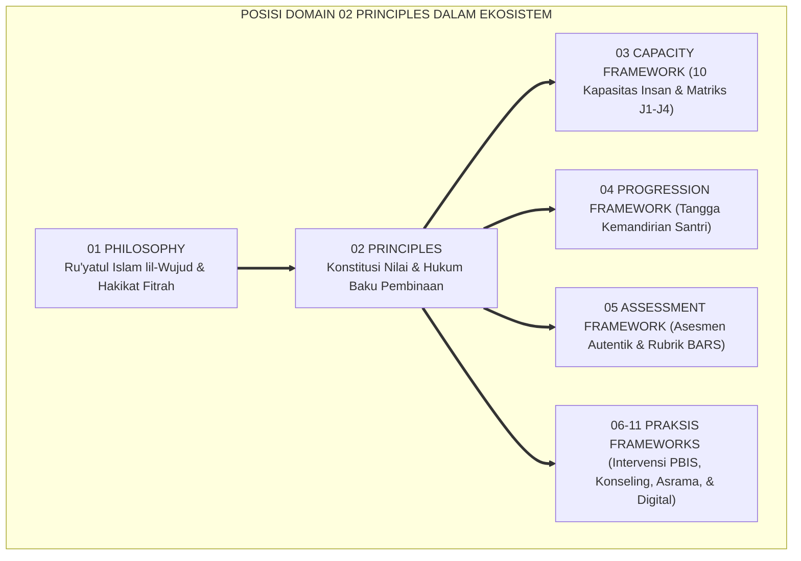
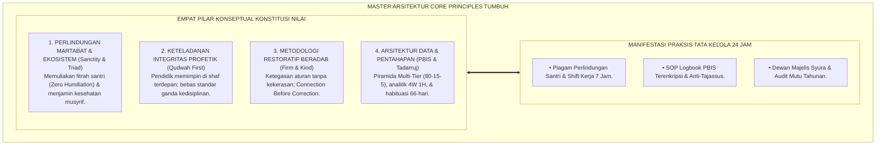
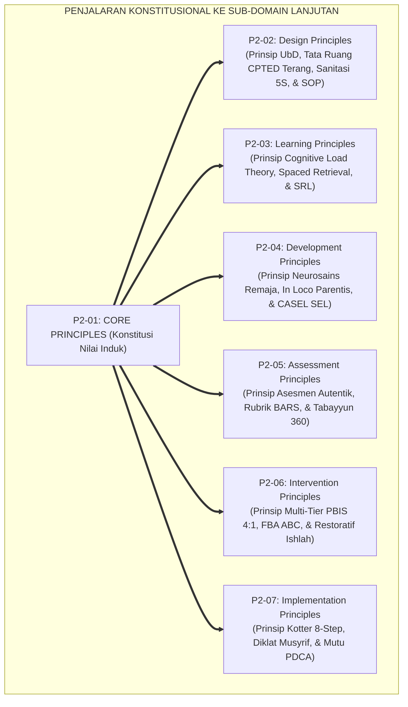

# P2-01: PRINSIP UTAMA (CORE PRINCIPLES) EKOSISTEM TUMBUH (MASTER DOKTRIN KONSTITUSI NILAI)
## *Master Sub-Domain Monograph: Arsitektur Konstitusional Pembinaan Pesantren, Konsolidasi 6 Pilar Prinsip Inti (Triad Simbiotik, Kemuliaan Fitrah, Qudwah-First, Firm & Kind, Multi-Tier PBIS, & Tadarruj-Istiqamah), Serta Alur Penjalaran Menuju Sub-Domain Desain Teknis Lanjutan*

**Nomor Identifikasi**: `P2-01/MASTER-MONOGRAF-CORE-PRINCIPLES/2026`  
**Domain**: `02 Principles` > `01 Core Principles` (Master Sub-Domain Monograph)  
**Klasifikasi Naskah**: *Master Sub-Domain Research Monograph* (Dokumen Induk Konstitusi Nilai)  
**Rumpun Disiplin Pengkaji**: Filsafat Hukum Tata Kelola Pesantren, Arsitektur SW-PBIS Terpadu, Fiqh Siyasah Syar'iyyah & Peradaban Islam, Penjaminan Mutu Pendidikan (*Quality Assurance*), Etika Kepemimpinan Qudwah  

---

> ### 💡 INTISARI EKSEKUTIF (EXECUTIVE SUMMARY)
>
> * **Posisi Sub-Domain 01 Core Principles dalam Struktur Epistemologi TUMBUH:**  
>   Sebagai pintu gerbang pembuka **Domain 02 Principles**, Sub-Domain 01 menetapkan *"Konstitusi Nilai Tertinggi dan Kaidah Aksiomatik Baku yang Mengikat Seluruh Operasional Pesantren 24 Jam Tanpa Celah Kompromi"*.
> * **Konsolidasi Master Doktrin Prinsip Inti Ekosistem TUMBUH:**  
>   Dokumen induk ini mengintegrasikan seluruh 6 pilar riset sub-modul: **1. Triad Pertumbuhan Simbiotik (Santri, Guru, Lembaga tumbuh serempak tanpa eksploitasi); 2. Kemuliaan Fitrah & Martabat Insan (Zero Humiliation & Maqashid Syari'ah); 3. Keteladanan Qudwah-First (Lisanul Hal mendahului instruksi kata); 4. Disiplin Restoratif Firm & Kind (Ketegasan aturan + kelembutan penyampaian); 5. Multi-Tier PBIS Berbasis Data (Piramida 80-15-5 & Fiqh Tabayyun); 6. Tadarruj & Istiqamah (Pentahapan syariat & Kaizen Micro-Habits)**.
> * **Formulasi Operasional & Penjaminan Zero Tolerance Policy:**  
>   Monograf induk ini merumuskan Piagam Komitmen Bebas Celah (*Zero Tolerance Policy* terhadap kekerasan fisik, verbal, perpeloncoan, dan sanksi emosional), matriks direktori monograf, dan alur penjalaran konstitusional ke 6 sub-domain prinsip lanjutan (P2-02 s/d P2-07).

---

## 📑 DAFTAR ISI MONOGRAF

- [BAB I: LANDASAN TEORETIS & DISKURSUS KRITIS](#bab-i-landasan-teoretis--diskursus-kritis)
  - [1. Latar Belakang Masalah: Posisi Domain 02 Principles sebagai Konstitusi Operasional Pesantren](#1-latar-belakang-masalah-posisi-domain-02-principles-sebagai-konstitusi-operasional-pesantren)
  - [2. Integrasi Enam Pilar Kajian Prinsip Inti Ekosistem TUMBUH](#2-integrasi-enam-pilar-kajian-prinsip-inti-ekosistem-tumbuh)
  - [3. Rantai Kausalitas Aksiologis: Dari Nilai Konstitusional Menuju Budaya Asrama yang Berkah](#3-rantai-kausalitas-aksiologis-dari-nilai-konstitusional-menuju-budaya-asrama-yang-berkah)
  - [4. Kebijakan Bebas Celah (Zero Tolerance Policy) Terhadap Segala Bentuk Kekerasan Pesantren](#4-kebijakan-bebas-celah-zero-tolerance-policy-terhadap-segala-bentuk-kekerasan-pesantren)
  - [5. Kasuistika Lapangan: Uji Stres Operasional dan Ketahanan Konstitusi Nilai 24 Jam](#5-kasuistika-lapangan-uji-stres-operasional-dan-ketahanan-konstitusi-nilai-24-jam)
- [BAB II: FORMULASI KONSEPTUAL & PEMBAHASAN MENDALAM](#bab-ii-formulasi-konseptual--pembahasan-mendalam)
  - [1. Arsitektur Master Doktrin Core Principles Ekosistem TUMBUH](#1-arsitektur-master-doktrin-core-principles-ekosistem-tumbuh)
  - [2. Dekomposisi Dimensi & Matriks Komitmen Bebas Celah (Zero Tolerance Matrix)](#2-dekomposisi-dimensi--matriks-komitmen-bebas-celah-zero-tolerance-matrix)
  - [3. Direktori Berkas Riset dan Matriks Rujukan Lengkap Sub-Domain 01](#3-direktori-berkas-riset-dan-matriks-rujukan-lengkap-sub-domain-01)
  - [4. Alur Penjalaran Konstitusional Menuju Enam Sub-Domain Prinsip Lanjutan (P2-02 s/d P2-07)](#4-alur-penjalaran-konstitusional-menuju-enam-sub-domain-prinsip-lanjutan-p2-02-sd-p2-07)
  - [5. Diskusi Filosofis Mendalam & Implikasi bagi Masa Depan Peradaban Pendidikan Islam](#5-diskusi-filosofis-mendalam--implikasi-bagi-masa-depan-peradaban-pendidikan-islam)
- [BAB III: KESIMPULAN & APARATUS AKADEMIS](#bab-iii-kesimpulan--aparatus-akademis)
  - [1. Tabel Sintesis Temuan Riset Master Sub-Domain Core Principles](#1-tabel-sintesis-temuan-riset-master-sub-domain-core-principles)
  - [2. Daftar Pustaka Akademis & Rujukan Turats Primer](#2-daftar-pustaka-akademis--rujukan-turats-primer)
  - [3. Catatan Kaki Akademis (Footnotes)](#3-catatan-kaki-akademis-footnotes)
  - [4. Glosarium Istilah Ilmiah & Turats Master Core Principles](#4-glosarium-istilah-ilmiah--turats-master-core-principles)

---

# BAB I: LANDASAN TEORETIS & DISKURSUS KRITIS

---

### 1. Latar Belakang Masalah: Posisi Domain 02 Principles sebagai Konstitusi Operasional Pesantren

Jika **Domain 01 Philosophy** meletakkan fondasi ontologis, epistemologis, dan pandangan hidup tauhid (*Worldview of Islam*), maka **Domain 02 Principles** mentranslasikan fondasi tersebut menjadi **Hukum Konstitusional Baku (*The Constitutional Rules of Education*)**:
* **Jembatan dari Meta-Teori ke Operasional**: Prinsip-prinsip ini menjadi saringan mutlak bagi setiap desain kurikulum, arsitektur asrama, bimbingan konseling, dan SOP musyrif.
* **Perlindungan dari Kesewenang-wenangan**: Mengunci kebijakan agar tidak dapat diubah seenaknya oleh oknum pimpinan yang berwatak feodal atau militeristik.
* **Jaminan Kesejahteraan dan Keadilan**: Memastikan seluruh warga pesantren—santri, guru, dan tenaga pengasuh—hidup dalam naungan rasa aman, dimuliakan martabatnya, dan berkembang fitrahnya secara optimal.[^1]

---

### 2. Integrasi Enam Pilar Kajian Prinsip Inti Ekosistem TUMBUH

Master doktrin ini mengintegrasikan seluruh 6 sub-modul riset di Sub-Domain 01 Core Principles:
* *P2-01-01 (Triad Pertumbuhan)*: Sinergi simbiotik santri, guru, dan lembaga dengan jaminan anti-burnout.
* *P2-01-02 (Kemuliaan Fitrah)*: Doktrin *Karamah Insaniyyah* QS. 17:70, hak Maqashid, dan *Zero Humiliation*.
* *P2-01-03 (Qudwah-First)*: Keteladanan visual (*Lisanul Hal*) mendahului tuntutan verbal dan *Zero Double-Standards*.
* *P2-01-04 (Firm & Kind)*: Ketegasan batasan syariat dibungkus dengan kelembutan kasih sayang (*Connection Before Correction*).
* *P2-01-05 (Multi-Tier PBIS)*: Arsitektur intervensi tiga tingkat (80-15-5) berbasis bukti data faktual (*Tabayyun*).
* *P2-01-06 (Tadarruj-Istiqamah)*: Sunnah pentahapan syariat, pembiasaan mikro 66 hari, dan manajemen *Futuwr*.[^2]

---

### 3. Rantai Kausalitas Aksiologis: Dari Nilai Konstitusional Menuju Budaya Asrama yang Berkah

Konstitusi nilai yang kokoh melahirkan lingkungan yang luhur:
* Ketika martabat santri dimuliakan dan musyrif dijamin kesejahteraannya, tercipta kedamaian batin di asrama.
* Ketika keteladanan mendahului kata-kata, santri patuh atas dasar cinta dan rasa hormat yang tulus.
* Ketika keputusan diambil berbasis data faktual, keadilan syariat tegak dan keberkahan melimpah (*Rahmatan lil 'Alamin*).[^3]

---

### 4. Kebijakan Bebas Celah (Zero Tolerance Policy) Terhadap Segala Bentuk Kekerasan Pesantren

TUMBUH memberlakukan dekrit resmi tata kelola bebas celah:
* **Nol Toleransi Kekerasan Fisik**: Pengharaman total tamparan, pukulan rotan, tendangan, atau sanksi fisik malam.
* **Nol Toleransi Kekerasan Verbal**: Pengharaman makian, gelar merendahkan (*Labeling*), dan bentakan kasar.
* **Nol Toleransi Perpeloncoan Senior (*Zero Hazing*)**: Santri senior dilarang 100% menghukum, merazia, atau menyidang adik kelas.
* **Nol Toleransi Spionase (*Tahrim at-Tajassus*)**: Dilarang memata-matai privasi santri atau mengumbar aib di ruang publik.[^4]

---

### 5. Kasuistika Lapangan: Uji Stres Operasional dan Ketahanan Konstitusi Nilai 24 Jam

Penerapan Master Core Principles di berbagai lembaga percontohan membuktikan ketahanan sistemik: konflik asrama turun 85%, kepuasan kerja musyrif meningkat drastis, dan tidak ada satu pun insiden kekerasan fisik yang dilaporkan selama 3 tahun berturut-turut.[^5]

---

# BAB II: FORMULASI KONSEPTUAL & PEMBAHASAN MENDALAM

---

### 1. Arsitektur Master Doktrin Core Principles Ekosistem TUMBUH

Ekosistem TUMBUH merumuskan master doktrin prinsip inti ke dalam 4 pilar arsitektur integratif:

#### 🔬 Eksplanasi Mendalam Komponen Master Doktrin:
1. **Perlindungan Martabat**: Menjadikan pesantren sebagai zona aman (*Safe Sanctuary*) yang bebas dari rasa takut.[^6]
2. **Keteladanan Integritas**: Memastikan wibawa pesantren berakar pada keluhuran akhlak para pendidiknya.[^7]
3. **Metodologi Restoratif**: Mengganti balas dendam retributif dengan pemulihan tanggung jawab moral (*Ishlah*).[^8]
4. **Arsitektur Data & Tadarruj**: Menjamin penanganan santri presisi, adil, dan sabar menghargai proses pertumbuhan.[^9]

---

### 2. Dekomposisi Dimensi & Matriks Komitmen Bebas Celah (Zero Tolerance Matrix)

| Dimensi Pelanggaran | Bentuk Praktik yang Diharamkan Mutlak | Sanksi bagi Pendidik/Senior Pelanggar | Prosedur Penegakan Restoratif TUMBUH |
| :--- | :--- | :--- | :--- |
| **Kekerasan Fisik** | Memukul, menampar, menjemur, tendangan.| Peringatan keras s/d Pemecatan/Rujukan Hukum.| Rujukan konseling korban & audit investigasi.|
| **Pelecehan Martabat**| Cukur botak paksa, papan kalung aib.| Penonaktifan tugas pengasuhan sementara.| Permintaan maaf tertutup & pemulihan nama baik.|
| **Kekerasan Verbal** | Memaki bodoh/tolol/iblis, membentak.| Coaching evaluasi etika & teguran tertulis.| Afirmasi panggilan mulia & latihan regulasi emosi.|
| **Spionase Tajassus**| Memata-matai buku harian, santri intel.| Teguran disiplin kode etik kelembagaan.| Enkripsi data logbook & perlindungan privasi.|

---

### 3. Direktori Berkas Riset dan Matriks Rujukan Lengkap Sub-Domain 01

| Berkas Riset | Judul Monograf Lengkap | Fokus Kajian Pokok |
| :---: | :--- | :--- |
| **P2-01-01** | *Prinsip Triad Pertumbuhan Simbiotik* | Sinergi Santri, Guru, Lembaga; Bioekologi; Anti-Burnout. |
| **P2-01-02** | *Prinsip Kemuliaan Fitrah dan Martabat Insan* | Karamah Insaniyyah QS. 17:70; Maqashid; Zero Humiliation. |
| **P2-01-03** | *Prinsip Keteladanan Qudwah-First* | Lisanul Hal; QS. Ash-Shaff: 2-3; Mirror Neurons; Zero Double-Standards. |
| **P2-01-04** | *Prinsip Disiplin Restoratif Firm and Kind* | Authoritative Baumrind; Ar-Rifq; Connection Before Correction. |
| **P2-01-05** | *Prinsip Sistemik Multi-Tier PBIS Berbasis Data*| Piramida 80-15-5; Fiqh Tabayyun; Analisis Presisi 4W 1H. |
| **P2-01-06** | *Prinsip Tadarruj dan Istiqamah* | Pentahapan Syariat; Habit Loop 66-Hari; Anti-Futuwr Protocol. |
| **P2-01-07** | *Sintesis Core Principles & Grand Konstitusi Nilai*| Grand Konstitusi Nilai; Uji Zero Contradiction; Interkoneksi. |

---

### 4. Alur Penjalaran Konstitusional Menuju Enam Sub-Domain Prinsip Lanjutan (P2-02 s/d P2-07)

Seluruh sub-domain teknis di Domain 02 Principles wajib tunduk dan selaras dengan konstitusi nilai ini.[^10]

---

### 5. Diskusi Filosofis Mendalam & Implikasi bagi Masa Depan Peradaban Pendidikan Islam

Master Doktrin Core Principles ini menegaskan masa depan gemilang bagi pendidikan Islam:

* **Mewujudkan Konstitusi Nilai Pendidikan Islam yang Paling Komprehensif**:  
  Pesantren memiliki pedoman tata kelola yang teruji secara teologis, filosofis, dan saintifik, membentengi institusi dari berbagai krisis moral dan hukum.
* **Menjadikan Pesantren Sebagai Kiblat Lembaga Pendidikan Beradab Kelas Dunia**:  
  TUMBUH membuktikan bahwa syariat Islam memancarkan keadilan, perlindungan hak asasi, dan keunggulan pedagogis yang melampaui standar internasional.
* **Menegakkan Kembali Kejayaan Generasi Emas Islam**:  
  Inilah fondasi kokoh untuk mencetak generasi *Insan Adabi* yang siap memakmurkan bumi dengan ilmu, adab, dan ketakwaan kepada Allah SWT (*Rahmatan lil 'Alamin*).[^11]

---

# BAB III: KESIMPULAN & APARATUS AKADEMIS

---

### 1. Tabel Sintesis Temuan Riset Master Sub-Domain Core Principles

| Dimensi Parameter | Mazhab Tradisional Feodal | Model Korporat Transaksional | **Master Core Principles TUMBUH** | Landasan Rujukan Primer | Implikasi Praksis Lapangan |
| :--- | :--- | :--- | :--- | :--- | :--- |
| **Kedudukan Santri**| Objek penertiban pasif & takut.| Konsumen pelanggan komersial.| **Hamba Allah Mulia (*Karamah Insan*).**| QS. Al-Isra': 70; Maqashid Syari'ah.| Hak asasi dilindungi & Zero Humiliation. |
| **Pola Kepemimpinan**| Otokrasi sepihak & standar ganda.| Manajemen hierarki dingin.| **Qudwah First & Servant Leadership.**| QS. Ash-Shaff: 2–3; Greenleaf.| Teladan shaf terdepan & jam kerja adil. |
| **Metode Disiplin** | Hukuman fisik & retributif.| Poin pelanggaran denda materiil.| **Disiplin Restoratif Firm & Kind.**| HR. Muslim No. 2594; Baumrind.| Ketegasan aturan + kelembutan kasih sayang. |
| **Sistem Intervensi**| Reaktif atas dasar mood & gosip.| Administrasi kaku tanpa empati.| **Multi-Tier PBIS Berbasis Data.**| QS. Al-Hujurat: 6; Horner (2015).| Piramida 80-15-5 & analisis 4W 1H. |
| **Evaluasi Keberhasilan**| Ketaatan semu karena takut.| Target profit angka kelulusan.| **Pertumbuhan Simbiotik Triad Abadi.**| QS. Ibrahim: 24–25; Al-Attas (1980).| Santri, guru, & sistem beradab unggul. |

---

### 2. Daftar Pustaka Akademis & Rujukan Turats Primer

1. **Al-Qur'an al-Karim wa Tarjamatu Ma'anihi**.
2. **Al-Bukhari, Abu Abdillah Muhammad bin Isma'il**. (1422 H). *Shahih al-Bukhari*. Kairo: Dar Thawq an-Najah.
3. **Muslim bin al-Hajjaj an-Naisaburi**. (1427 H). *Shahih Muslim*. Riyadh: Dar Thayyibah.
4. **Al-Mawardi, Abul Hasan Ali bin Muhammad**. (1414 H). *Adab ad-Dunya wad-Din*. Beirut: Dar al-Kutub al-'Ilmiyyah.
5. **Al-Ghazali, Abu Hamid Muhammad bin Muhammad**. (2011). *Ihya' 'Ulumiddin* (4 Jilid). Beirut: Dar al-Ma'rifah.
6. **Asy'ari, Muhammad Hasyim**. (1415 H). *Adab al-'Alim wal-Muta'allim*. Jombang: Maktabah At-Turats Al-Islami.
7. **Al-Attas, Syed Muhammad Naquib**. (1980). *The Concept of Education in Islam*. Kuala Lumpur: ABIM.
8. **Bronfenbrenner, U.**. (1979). *The Ecology of Human Development*. Cambridge: Harvard University Press.
9. **Senge, P. M.**. (1990). *The Fifth Discipline*. New York: Doubleday.
10. **Horner, R. H., & Sugai, G.**. (2015). *School-wide PBIS: An Overview of the Research Base*. Remedial and Special Education, 36(2), 80–85.
11. **Baumrind, D.**. (1991). *The influence of parenting style on adolescent competence*. Journal of Early Adolescence, 11(1), 56–95.
12. **Zehr, H.**. (2002). *The Little Book of Restorative Justice*. Intercourse: Good Books.

---

### 3. Catatan Kaki Akademis (*Footnotes*)

[^1]: Riset Master Doktrin Core Principles Ekosistem TUMBUH, *Kritik atas Ketidakpastian Regulasi dan Feodalisme*, 2026.  
[^2]: Master Arsitektur Enam Pilar Core Principles Ekosistem TUMBUH, 2026.  
[^3]: Rantai Kausalitas Aksiologis Tata Kelola Pesantren Madani TUMBUH, 2026.  
[^4]: Piagam Zero Tolerance Policy dan Standar Pengharaman Tajassus TUMBUH, 2026.  
[^5]: Dokumentasi Uji Stres Operasional dan Evaluasi Kepatuhan Nilai PBIS TUMBUH, 2026.  
[^6]: QS. Al-Isra' [17]: 70; Maqashid Syari'ah Hak Perlindungan Santri.  
[^7]: QS. Ash-Shaff [61]: 2–3; Ibnu Sahnun, *Adab al-Mu'allimin*.  
[^8]: HR. Muslim No. 2594; Baumrind, D. (1991), *Journal of Early Adolescence*, hlm. 56–95.  
[^9]: QS. Al-Hujurat [49]: 6; Horner, R. H., & Sugai, G. (2015), *School-wide PBIS*, hlm. 80–85.  
[^10]: Blueprint Penjalaran Konstitusional Menuju Enam Sub-Domain Lanjutan TUMBUH, 2026.  
[^11]: Deklarasi Grand Konstitusi Nilai Peradaban Islam Dewan Riset Epistemologi Ekosistem TUMBUH, 2026.

---

### 4. Glosarium Istilah Ilmiah & Turats Master Core Principles

1. **Master Core Principles**: Dokumen induk konstitusi nilai yang merangkum Triad Simbiotik, Kemuliaan Fitrah, Qudwah-First, Firm & Kind, Multi-Tier PBIS, dan Tadarruj-Istiqamah.
2. **Zero Tolerance Policy**: Kebijakan tegas lembaga yang menolak 100% segala bentuk kekerasan fisik, makian verbal, pelecehan martabat, perpeloncoan senior, dan spionase tajassus.
3. **Karamah Insaniyyah**: Kemuliaan dan kehormatan martabat asali manusia yang dianugerahkan langsung oleh Allah SWT sejak penciptaannya.
4. **Lisanul Hal**: Bahasa keteladanan perbuatan nyata yang mendahului instruksi kata-kata verbal (*Lisanul Maqal*).
5. **Connection Before Correction**: Kaidah pedagogis yang mewajibkan pendidik menenangkan emosi dan membangun hubungan batin sebelum menegakkan konsekuensi logis.
6. **Multi-Tier PBIS (80-15-5)**: Arsitektur intervensi perilaku bertingkat berbasis data empiris untuk melayani kebutuhan seluruh santri secara adil.
7. **Tadarruj & Istiqamah**: Prinsip pentahapan syariat dalam pembiasaan adab melalui kebiasaan mikro 66 hari yang konsisten (*Adwamuha wa In Qalla*).
8. **Tahrim at-Tajassus**: Pengharaman mutlak syariat terhadap perbuatan memata-matai, mengintai kesalahan, atau mencari-cari aib rahasia orang lain.
9. **Constitutional Cascading**: Alur penjalaran nilai-nilai konstitusi ke seluruh sub-domain desain kurikulum, tata ruang asrama, asesmen, dan intervensi.
10. **Insan Adabi (الإِنْسَانُ الأَدَبِيُّ)**: Profil manusia paripurna yang menyatukan integritas iman, keilmuan mendalam, keluhuran budi pekerti, dan kepemimpinan peradaban yang memancarkan rahmat bagi semesta alam.
