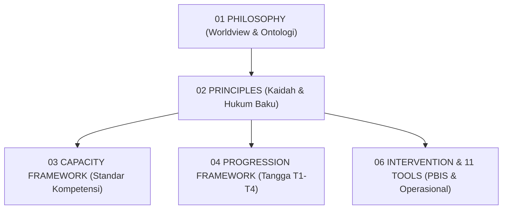
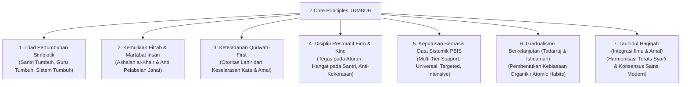

# P2-01-Prinsip-Utama-TUMBUH (Core Principles Induk)

## Tujuan
Menetapkan deklarasi prinsip-prinsip utama (*Core Principles*) yang mengikat seluruh ekosistem pembinaan pesantren TUMBUH, menjembatani fondasi filosofis (*Project 1 Philosophy*) menuju arsitektur kapasitas (*Project 3 Capacity Framework*), intervensi, asesmen, dan operasional harian.

---

## 1. Posisi Dokumen dalam Taksonomi TUMBUH

Jika **Project 1 (Philosophy)** menjawab:
> *"Mengapa kita membina, apa hakikat manusia, dan apa tujuan akhir pertumbuhan?"*

Maka **Project 2 (Principles)** menjawab:
> *"Kaidah dan aturan baku apa yang mutlak menjadi pegangan dalam setiap keputusan, desain kurikulum, intervensi pengasuhan, dan interaksi harian di pesantren?"*

---

## 2. 7 Pilar Prinsip Utama TUMBUH (*The 7 Core Pillars*)

Ekosistem TUMBUH beroperasi di atas 7 pilar prinsip mutlak:

---

## 3. Rincian 7 Pilar Prinsip Utama

### Pilar 1: Triad Pertumbuhan Simbiotik (*Symbiotic Growth Triad*)
Pertumbuhan di pesantren bukan beban sepihak santri. Keberhasilan pembinaan menuntut 3 entitas bertumbuh secara serempak:
* **Santri Tumbuh**: Dari adaptasi menuju kemandirian adab (T1–T4).
* **Guru & Musyrif Tumbuh**: Meningkat kapasitas pedagogi dan konselingnya, terlindungi dari *burnout*.
* **Sistem Lembaga Tumbuh**: Menjadi organisasi pembelajar (*Learning Organization*) dengan SOP adaptif berbasis data.

### Pilar 2: Kemuliaan Fitrah & Martabat Insan (*Inherent Fitrah & Dignity*)
* Santri lahir membawa modal dasar fitrah tauhid dan kebaikan (*QS. Ar-Rum: 30*).
* Setiap santri berhak dijaga kehormatannya (*Karamah Insaniyyah*). Pelanggaran adalah anomali sementara yang butuh pemulihan, bukan vonis kepribadian rusak.

### Pilar 3: Keteladanan Mutlak (*Qudwah-First Leadership*)
* Keteladanan nyata pendidik (*Qudwah Hasanah*) adalah kurikulum hidup yang paling efektif (*Observational Learning*).
* Pendidik dan pengurus santri dilarang menuntut kedisiplinan yang mereka sendiri langgar.

### Pilar 4: Disiplin Restoratif Tegas & Hangat (*Firm and Kind Restorative Discipline*)
* Menghapus mutlak hukuman fisik, caci maki verbal, dan perpeloncoan senioritas.
* Menegakkan disiplin melalui konsekuensi logis, dialog restoratif, dan pemulihan ukhuwah (*Restitution*).

### Pilar 5: Intervensi Sistemik Berbasis Bukti (*Data-Driven Multi-Tier PBIS*)
* Pembinaan tidak reaktif menunggu masalah meledak.
* Menerapkan School-Wide PBIS: **Tier 1 (Universal 80-90%)**, **Tier 2 (Targeted 10-15%)**, dan **Tier 3 (Intensive 1-5%)** berbasis data titik rawan (*hotspots*) dan waktu kejadian.

### Pilar 6: Gradualisme & Konsistensi (*Tadarruj & Istiqamah*)
* Pembentukan karakter mengikuti sunnatullah: berakar dari langkah-langkah kecil (*micro-habits*) yang diulang konsisten dalam rutinitas asrama 24 jam.

### Pilar 7: Tauhidul Haqiqah (*Integration of Revelation & Science*)
* Memadukan teks wahyu Al-Qur'an dan Sunnah sebagai kompas moral (*Ghayah*) dengan metodologi sains modern (Neurosains, CASEL SEL, PBIS) sebagai instrumen teknis (*Wasilah*).

---

## 4. Matriks Komitmen Bebas Celah (*Zero Tolerance Policy*)

Sistem TUMBUH menetapkan kebijakan tanpa toleransi (*Zero Tolerance*) terhadap 4 patologi:
1. 🚫 **Kekerasan Fisik**: Pemukulan, tamparan, push-up berlebihan, atau kontak fisik yang menyakitkan.
2. 🚫 **Kekerasan Verbal & Mental**: Pelabelan negatif, penghinaan martabat di depan umum, atau intimidasi psikologis.
3. 🚫 **Feodalisme & Bullying Senioritas**: Pengurus santri menyiksa atau memperbudak adik kelas.
4. 🚫 **Pengambilan Keputusan Asal-Asalan**: Menghukum santri tanpa tabayyun, tanpa data, atau didasari emosi subjektif pembina.

---

## 5. Status Dokumen
* **Status**: 🌟 **A+ (Dokumen Induk Core Principles)**
* **Klasifikasi**: Project 2 - `02 Principles / 01 Core Principles`
* **Langkah Berikutnya**: Membedah turunan prinsip pilar pertama: **`P2-01-01-Prinsip-Triad-Pertumbuhan-Simbiotik.md`**.
