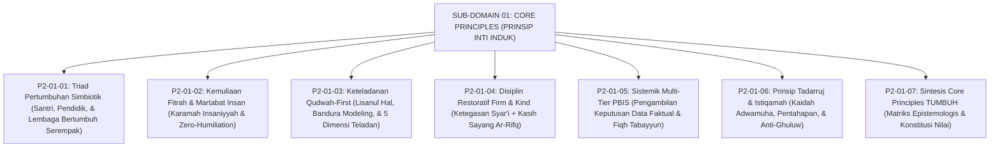

# SUB-DOMAIN 01: CORE PRINCIPLES (PRINSIP INTI EKOSISTEM TUMBUH)
## *Sitemap Induk & Navigasi Monograf 6 Prinsip Inti Konstitusi Pengasuhan Pesantren*

**Nomor Identifikasi**: `P2-01/INDEX/2026`  
**Domain**: `02 Principles` > `01 Core Principles`  
**Klasifikasi**: Folder Monograf Konstitusi Nilai, Triad Simbiotik, & PBIS Restoratif

---

## 🏛️ SITEMAP & NAVIGASI SELURUH BERKAS SUB-DOMAIN 01

Sub-Domain `01 Core Principles` membedah enam prinsip inti yang menjadi konstitusi filosofis-operasional bagi seluruh kebijakan dan interaksi di ekosistem TUMBUH:

---

## 📑 DAFTAR BERKAS MODULAR SUB-DOMAIN 01

| No | Berkas Monograf | Judul Berkas | Fokus Kajian & Rujukan Utama |
| :---: | :--- | :--- | :--- |
| **01** | [**`P2-01-01-Prinsip-Triad-Pertumbuhan-Simbiotik.md`**](./P2-01-01-Prinsip-Triad-Pertumbuhan-Simbiotik.md) | Triad Pertumbuhan Simbiotik | Sinergi serempak Santri, Pendidik/Musyrif (anti-burnout), dan Lembaga (organisasi pembelajar); teori ekologi Bronfenbrenner & Senge. |
| **02** | [**`P2-01-02-Prinsip-Kemuliaan-Fitrah-dan-Martabat-Insan.md`**](./P2-01-02-Prinsip-Kemuliaan-Fitrah-dan-Martabat-Insan.md) | Kemuliaan Fitrah & Martabat Insan | Doktrin *Karamah Insaniyyah* (QS. Al-Isra': 70), 5 hak fundamental santri, kaidah *Adh-Dhararu Yuzal*, & eliminasi mutlak gundul paksa/shaming. |
| **03** | [**`P2-01-03-Prinsip-Keteladanan-Qudwah-First.md`**](./P2-01-03-Prinsip-Keteladanan-Qudwah-First.md) | Keteladanan Qudwah-First | Kaidah *Lisanul Hal Afshahu*, QS. Al-Ahzab: 21, dekonstruksi kemunafikan pedagogis, *Mirror Neurons System*, dan 5 dimensi wajib teladan asatidz. |
| **04** | [**`P2-01-04-Prinsip-Disiplin-Restoratif-Firm-and-Kind.md`**](./P2-01-04-Prinsip-Disiplin-Restoratif-Firm-and-Kind.md) | Disiplin Restoratif Firm & Kind | Menolak dikotomi otoriter vs permisif; sifat *Ar-Rifq* hadits nabawi (HR. Muslim), teori Baumrind & Jane Nelsen, serta restitusi logis 4R. |
| **05** | [**`P2-01-05-Prinsip-Sistemik-Multi-Tier-PBIS.md`**](./P2-01-05-Prinsip-Sistemik-Multi-Tier-PBIS.md) | Sistemik Multi-Tier PBIS Berbasis Data | Eliminasi subjektivitas sanksi, piramida Tier 1–3 SW-PBIS (Sugai & Horner), siklus 4W 1H, dan fiqh Tabayyun (QS. Al-Hujurat: 6). |
| **06** | [**`P2-01-06-Prinsip-Tadarruj-dan-Istiqamah.md`**](./P2-01-06-Prinsip-Tadarruj-dan-Istiqamah.md) | Prinsip Tadarruj & Istiqamah | Gradualisme syariat, kaidah *Ahabbul A'mali Adwamuha* (HR. Bukhari), teori *Atomic Habits*, dan pencegahan sindrom Ghuluw-Futuwr. |
| **07** | [**`P2-01-07-Sintesis-Core-Principles-TUMBUH.md`**](./P2-01-07-Sintesis-Core-Principles-TUMBUH.md) | Sintesis Core Principles TUMBUH | Matriks integrasi 6 prinsip inti induk, piagam konstitusi nilai pesantren, dan jembatan ke Sub-Domain `02 Design Principles` s/d `07 Implementation`. |
