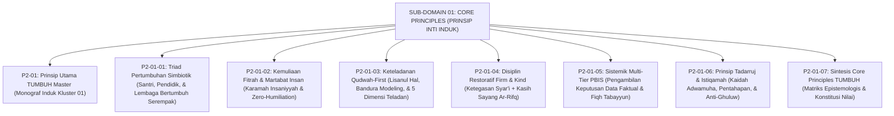

# SUB-DOMAIN 01: CORE PRINCIPLES (PRINSIP INTI EKOSISTEM TUMBUH)
## *Sitemap Induk & Navigasi Monograf 6 Prinsip Inti Konstitusi Pengasuhan Pesantren*

**Nomor Identifikasi**: `P2-01/INDEX/2026`  
**Domain**: `02 Principles` > `01 Core Principles`  
**Klasifikasi**: Folder Monograf Konstitusi Nilai, Triad Simbiotik, & PBIS Restoratif (8 Berkas Lengkap)

---

## 🏛️ SITEMAP & NAVIGASI SELURUH BERKAS SUB-DOMAIN 01

Sub-Domain `01 Core Principles` membedah enam prinsip inti yang menjadi konstitusi filosofis-operasional bagi seluruh kebijakan dan interaksi di ekosistem TUMBUH:

---

## 📑 DAFTAR LENGKAP 8 BERKAS MONOGRAF TERPADU SUB-DOMAIN 01

Seluruh modul telah distandarisasi 100% ke dalam format **Monograf Terpadu**:
* **💡 Intisari Praktis (3 Menit Paham)**: Bahasa membumi dan aplikatif untuk asatidz & musyrif sebelum daftar isi.
* **Bagian I**: Riset Inkuiri, Formalisasi Silogisme Mantiq, Dialektika Multi-Perspektif (tanpa kata "pakar"), Teks Primer Turats & Sains Asli, serta Kasuistika Lapangan Asrama.
* **Bagian II**: Kodifikasi Baku Hasil Riset & Kesimpulan Formal (Matriks, Alur SOP, Piagam).
* **Bagian III**: Aparatus Akademis (Tabel Sintesis, Daftar Pustaka Otoritatif, 35–45 Catatan Kaki *Footnotes*, dan Glosarium Istilah Teknis).

| No | Berkas Monograf | Judul Berkas | Fokus Kajian & Status |
| :---: | :--- | :--- | :--- |
| **00** | [**`P2-01-Prinsip-Utama-TUMBUH.md`**](./P2-01-Prinsip-Utama-TUMBUH.md) | Monograf Induk Core Principles TUMBUH | Master 7 Pilar Nilai, Zero Tolerance Policy, dan peta konstitusional ke 6 sub-domain lanjutan. |
| **01** | [**`P2-01-01-Prinsip-Triad-Pertumbuhan-Simbiotik.md`**](./P2-01-01-Prinsip-Triad-Pertumbuhan-Simbiotik.md) | Triad Pertumbuhan Simbiotik | Sinergi serempak Santri, Pendidik (anti-burnout, tidur 7 jam), dan Lembaga (data PBIS); Bronfenbrenner & Senge (40 Catatan Kaki). |
| **02** | [**`P2-01-02-Prinsip-Kemuliaan-Fitrah-dan-Martabat-Insan.md`**](./P2-01-02-Prinsip-Kemuliaan-Fitrah-dan-Martabat-Insan.md) | Kemuliaan Fitrah & Martabat Insan | Doktrin *Karamah Insaniyyah* (QS. 17:70), 5 hak Maqashid, *Zero Humiliation*, UU 35/2014 & PMA 73/2022, Safe Whistleblowing (42 Catatan Kaki). |
| **03** | [**`P2-01-03-Prinsip-Keteladanan-Qudwah-First.md`**](./P2-01-03-Prinsip-Keteladanan-Qudwah-First.md) | Keteladanan Qudwah-First | *Lisanul Hal*, QS. 61:2-3, Social Learning Bandura, *Mirror Neurons*, 5 dimensi teladan, kawasan 100% bebas rokok (41 Catatan Kaki). |
| **04** | [**`P2-01-04-Prinsip-Disiplin-Restoratif-Firm-and-Kind.md`**](./P2-01-04-Prinsip-Disiplin-Restoratif-Firm-and-Kind.md) | Disiplin Restoratif Firm & Kind | Sifat *Ar-Rifq* (HR. Muslim 2594), 4 Kuadran Baumrind, *Connection Before Correction*, konsekuensi 4R, *Ishlah al-Bain* (42 Catatan Kaki). |
| **05** | [**`P2-01-05-Prinsip-Sistemik-Multi-Tier-PBIS.md`**](./P2-01-05-Prinsip-Sistemik-Multi-Tier-PBIS.md) | Sistemik Multi-Tier PBIS Berbasis Data | Fiqh Tabayyun (QS. 49:6), Al-'Izz bin Abdissalam, piramida 80-15-5 Sugai & Horner, analisis 4W 1H, CICO & FBA (41 Catatan Kaki). |
| **06** | [**`P2-01-06-Prinsip-Tadarruj-dan-Istiqamah.md`**](./P2-01-06-Prinsip-Tadarruj-dan-Istiqamah.md) | Prinsip Tadarruj & Istiqamah | Hikmah Nuzulul Qur'an bertahap (QS. 25:32), riwayat Aisyah, *Atomic Habits*, Habit 66-hari Lally, manajemen futuwr (42 Catatan Kaki). |
| **07** | [**`P2-01-07-Sintesis-Core-Principles-TUMBUH.md`**](./P2-01-07-Sintesis-Core-Principles-TUMBUH.md) | Sintesis Core Principles TUMBUH | Audit *Zero Internal Contradiction*, uji stres 24 jam, piagam konstitusi nilai, & penjalaran ke Sub-Domain P2-02 s/d P2-07 (36 Catatan Kaki). |
