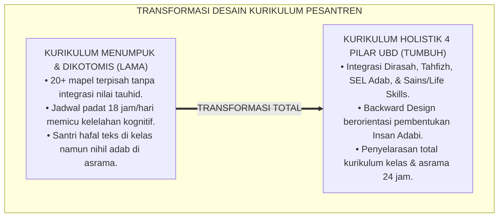
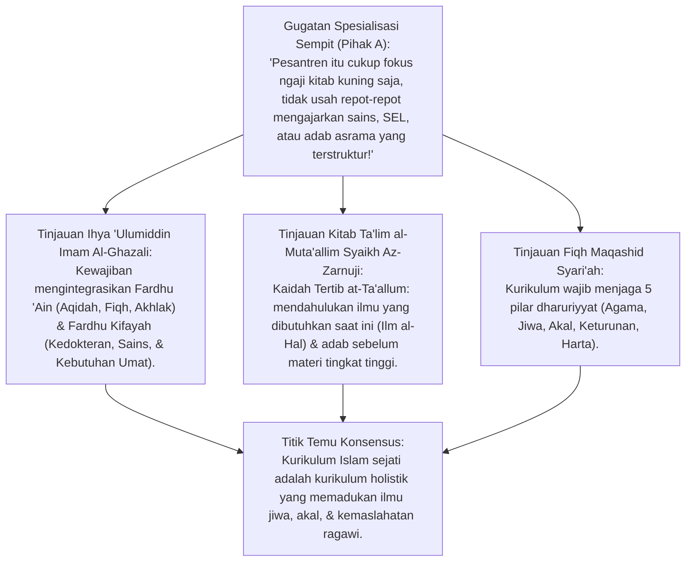
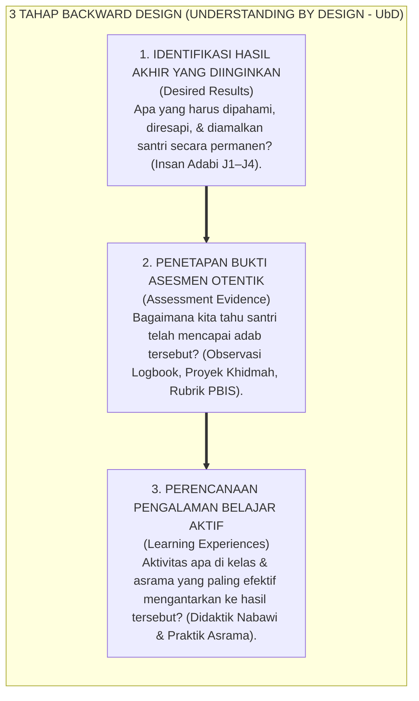
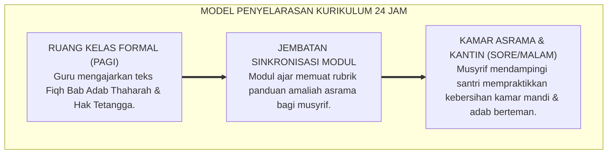
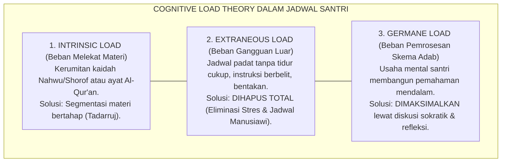
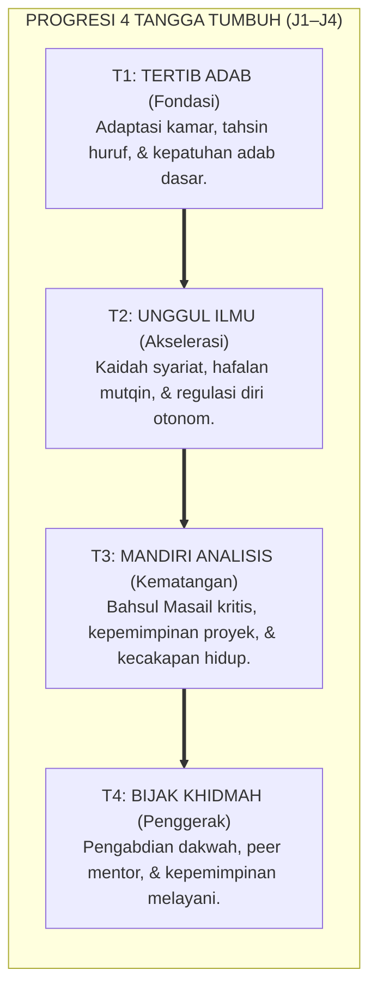
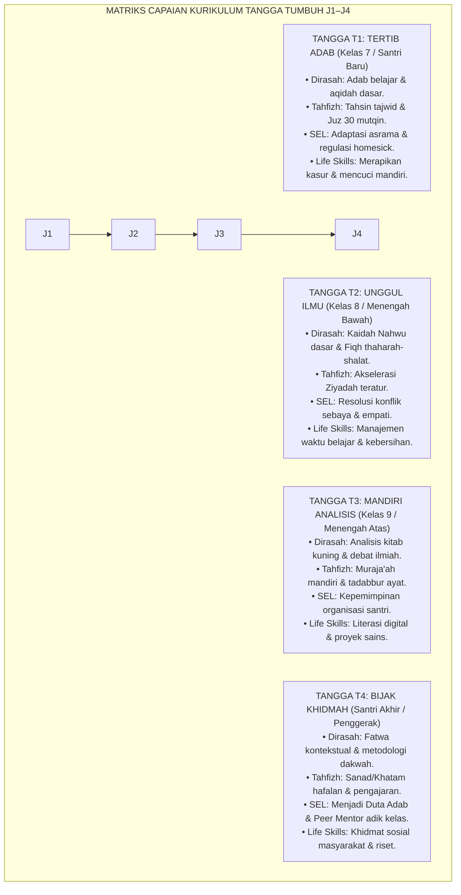
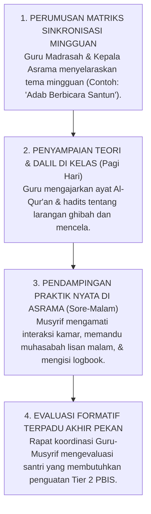

# P2-02-01: PRINSIP DESAIN KURIKULUM HOLISTIK PESANTREN
## *Monograf Terpadu: Epistemologi Integrasi Fardhu 'Ain & Kifayah (Ihya 'Ulumiddin Al-Ghazali & Ta'lim al-Muta'allim Az-Zarnuji), Konvergensi Metodologi Understanding by Design (UbD Backward Design Wiggins & McTighe), Manajemen Beban Kognitif (Cognitive Load Theory John Sweller), serta Penyelarasan Kurikulum Kelas dan Asrama 24 Jam Berbasis Jenjang Kemandirian TUMBUH (J1–J4) J1–J4*

**Nomor Identifikasi**: `P2-02-01/MONOGRAF-TERPADU-DESAIN-KURIKULUM-HOLISTIK/2026`  
**Domain**: `02 Principles` > `02 Design Principles`  
**Klasifikasi Naskah**: *Comprehensive Integrated Monograph* (Monograf Akademis & Rumusan Baku Terpadu)  
**Rumpun Disiplin Pengkaji**: Desain Kurikulum Terpadu Islam (*Tashmim al-Manahij al-Islamiyyah*), Psikologi Kognitif Pendidikan (*Cognitive Load Science*), Metodologi Perancangan Pembelajaran UbD, Manajemen Penyelarasan Pendidikan Asrama 24 Jam  

---

> ### 💡 INTISARI PRAKTIS (3 MENIT PAHAM UNTUK ASATIDZ & MUSYRIF)
>
> * **Kurikulum Pesantren Wajib Menyatukan 4 Pilar (Bukan Sekadar Tumpukan Mata Pelajaran):**  
>   Kurikulum di ekosistem TUMBUH memadukan secara organik:  
>   1. **Dirasah Islamiyah (Turats):** Aqidah, Fiqh, Nahwu/Shorof, Bahasa Arab & Inggris aktif.  
>   2. **Tahfizh Al-Qur'an:** Tahsin makharijul huruf, hafalan mutqin, dan tadabbur makna.  
>   3. **Karakter Sosial-Emosional (SEL & Adab):** Regulasi emosi, empati, adab pergaulan, dan anti-bullying.  
>   4. **Sains & Kecakapan Hidup (Life Skills):** Nalar kritis, literasi digital, kemandirian sanitasi, dan kepemimpinan.
> * **Metodologi Backward Design (Understanding by Design / UbD):**  
>   Jangan merancang kurikulum dari "buku teks apa yang harus dihabiskan", melainkan dari **"Hasil akhir manusia seperti apa yang ingin kita lahirkan (*Insan Adabi*)"** $\rightarrow$ tentukan bukti pemahaman otentiknya $\rightarrow$ baru susun modul ajar hariannya.
> * **Penyelarasan Kelas dan Asrama (*Classroom-Dormitory Alignment*):**  
>   Apa yang dipelajari santri di kelas pagi (misal: Bab Adab Makan & Hak Ukhuwah dalam Fiqh) wajib dipraktikkan langsung di meja makan kantin dan kamar asrama malam harinya dengan pendampingan musyrif.
> * **Manajemen Beban Kognitif (*Anti-Cognitive Overload*):**  
>   Jangan jejali santri dengan jadwal belajar 16 jam sehari tanpa jeda. Terapkan metode *Spaced Retrieval* (jeda pengulangan memori) agar hafalan Al-Qur'an dan pemahaman kitab kuning tidak cepat menguap.

---

## 📑 DAFTAR ISI MONOGRAF

- [BAGIAN I: RISET KAIDAH DESAIN KURIKULUM HOLISTIK, DIALEKTIKA INKUIRI, & KASUISTIKA LAPANGAN](#bagian-i-riset-kaidah-desain-kurikulum-holistik-dialektika-inkuiri--kasuistika-lapangan)
  - [1. Kerangka Metodologi Desain Kurikulum Adab: Kritik atas Kurikulum Dikotomis & Kelebihan Beban Kognitif](#1-kerangka-metodologi-desain-kurikulum-adab-kritik-atas-kurikulum-dikotomis--kelebihan-beban-kognitif)
  - [2. Inkuiri 1: Eksegesis Turats Desain Ilmu Holistik — Fardhu 'Ain & Kifayah Al-Ghazali serta Tertib at-Ta'allum Az-Zarnuji](#2-inkuiri-1-eksegesis-turats-desain-ilmu-holistik--fardhu-ain--kifayah-al-ghazali-serta-tertib-at-taallum-az-zarnuji)
  - [3. Inkuiri 2: Konvergensi Metodologi Understanding by Design (UbD) Grant Wiggins & Jay McTighe](#3-inkuiri-2-konvergensi-metodologi-understanding-by-design-ubd-grant-wiggins--jay-mctighe)
  - [4. Inkuiri 3: Penyelarasan Kurikulum Kelas dan Asrama 24 Jam (Classroom-Dormitory Curricular Alignment)](#4-inkuiri-3-penyelarasan-kurikulum-kelas-dan-asrama-24-jam-classroom-dormitory-curricular-alignment)
  - [5. Inkuiri 4: Manajemen Beban Kognitif (Cognitive Load Theory John Sweller) dalam Penjadwalan Belajar](#5-inkuiri-4-manajemen-beban-kognitif-cognitive-load-theory-john-sweller-dalam-penjadwalan-belajar)
  - [6. Inkuiri 5: Taksonomi Capaian Belajar Jenjang Kemandirian TUMBUH (J1–J4) (J1–J4) Lintas Disiplin](#6-inkuiri-5-taksonomi-capaian-belajar-tangga-tumbuh-t1t4-lintas-disiplin)
  - [7. Inkuiri 6: Silogisme Logika, Dialektika 3 Ronde, Kasuistika Kurikulum, & Titik Temu Konsensus](#7-inkuiri-6-silogisme-logika-dialektika-3-ronde-kasuistika-kurikulum--titik-temu-konsensus)
- [BAGIAN II: TEMUAN RISET, FORMULASI KONSEPTUAL & PEMBAHASAN](#bagian-ii-temuan-riset-formulasi-konseptual--pembahasan)
  - [1. Formulasi Konseptual: Prinsip Desain Kurikulum Holistik Terpadu Pesantren TUMBUH](#1-formulasi-konseptual-prinsip-desain-kurikulum-holistik-terpadu-pesantren-tumbuh)
  - [2. Matriks 4 Pilar Integrasi Kurikulum Holistik Pesantren TUMBUH](#2-matriks-4-pilar-integrasi-kurikulum-holistik-pesantren-tumbuh)
  - [3. Matriks Capaian Belajar Jenjang Kemandirian TUMBUH (J1–J4) (J1–J4) Lintas Disiplin Ilmu](#3-matriks-capaian-belajar-tangga-tumbuh-t1t4-lintas-disiplin-ilmu)
  - [4. Protokol Penyelarasan Kurikulum Kelas-Asrama 24 Jam (Classroom-Dormitory Alignment Protocol)](#4-protokol-penyelarasan-kurikulum-kelas-asrama-24-jam-classroom-dormitory-alignment-protocol)
- [BAGIAN III: APARATUS AKADEMIS & APENDIKS](#bagian-iii-aparatus-akademis--apendiks)
  - [1. Tabel Sintesis Hasil Riset Desain Kurikulum Holistik](#1-tabel-sintesis-hasil-riset-desain-kurikulum-holistik)
  - [2. Daftar Pustaka Akademis & Rujukan Turats Primer](#2-daftar-pustaka-akademis--rujukan-turats-primer)
  - [3. Catatan Kaki Akademis (Footnotes)](#3-catatan-kaki-akademis-footnotes)
  - [4. Glosarium dan Penjelasan Istilah Teknis Desain Kurikulum & Teori Kognitif](#4-glosarium-dan-penjelasan-istilah-teknis-desain-kurikulum--teori-kognitif)

---

# BAGIAN I: RISET KAIDAH DESAIN KURIKULUM HOLISTIK, DIALEKTIKA INKUIRI, & KASUISTIKA LAPANGAN

---

### 1. Kerangka Metodologi Desain Kurikulum Adab: Kritik atas Kurikulum Dikotomis & Kelebihan Beban Kognitif

Dalam sejarah perkembangan kurikulum pesantren di Indonesia, kerap terjadi dua penyakit perancangan ekstrem yang saling berlawanan:
1. **Kurikulum Dikotomis Terbelah (*Secular-Religious Schism*)**: Memisahkan secara kaku antara pelajaran agama di pagi hari dengan pelajaran umum/sains di sore hari tanpa adanya integrasi tauhid dan adab. Pelajaran agama diajarkan tanpa konteks kehidupan, sedangkan sains diajarkan dengan epistemologi materialistis sekuler.
2. **Jebakan Kelebihan Beban Kurikulum (*Curricular Hypertrophy*)**: Menjejalkan 20 hingga 25 mata pelajaran berbeda dalam sepekan ditambah target hafalan Al-Qur'an 3 juz per semester. Jadwal santri dipadatkan dari pukul 04.00 hingga 23.00 tanpa waktu jeda untuk merenung (*Tadabbur*), beristirahat, atau menginternalisasi adab.

Dampaknya sangat merusak:
* **Kelelahan Kognitif Kronis (*Cognitive Overload*)**: Otak santri mengalami kejenuhan pemrosesan memori kerja (*Working Memory Failure*).
* **Hilangnya Esensi Adab**: Santri mengejar nilai ujian formalitas di atas kertas, namun bersikap kasar di kamar asrama karena tidak ada ruang untuk mempraktikkan ilmu.

Ekosistem TUMBUH menegakkan prinsip **Desain Kurikulum Terpadu 4 Pilar Berbasis Backward Design (UbD)**:

---

### 2. Inkuiri 1: Eksegesis Turats Desain Ilmu Holistik — Fardhu 'Ain & Kifayah Al-Ghazali serta *Tertib at-Ta'allum* Az-Zarnuji

#### 📐 Formalisasi Logika Silogisme (*Qiyas Mantiqi 1*)
* **Premis Mayor (*al-Muqaddimah al-Kubra*)**: Setiap perancangan kurikulum pendidikan Islam yang sah niscaya wajib memprioritaskan ilmu *Fardhu 'Ain* (penyucian jiwa dan ibadah wajib) serta menyelaraskannya dengan ilmu *Fardhu Kifayah* yang dibutuhkan untuk memimpin peradaban secara proporsional.
* **Premis Minor (*al-Muqaddimah ash-Shughra*)**: Imam Abu Hamid Al-Ghazali dalam *Ihya 'Ulumiddin* menetapkan bahwa kurikulum ilmu yang berkah adalah yang menata hierarki keilmuan secara adil dan menuntun pembelajar mengenali Allah SWT serta menjaga kemaslahatan dunia-akhirat.
* **Konklusi (*an-Natijah*)**: Maka, kurikulum pesantren TUMBUH wajib mengintegrasikan 4 pilar (Dirasah, Tahfizh, SEL Adab, dan Sains/Life Skills) ke dalam satu kesatuan sistemik.[^1]

#### 📖 Teks Primer Turats: *Ihya 'Ulumiddin* & *Ta'lim al-Muta'allim*
Imam Al-Ghazali (w. 505 H) menjelaskan klasifikasi kurikulum ilmu yang terpuji:

> *"Ketahuilah bahwa ilmu terbagi menjadi dua: Ilmu Fardhu 'Ain, yaitu ilmu yang wajib dipelajari oleh setiap individu mukmin mengenai kewajiban akidah, tata cara ibadah saat ini, dan pembersihan penyakit hati; serta Ilmu Fardhu Kifayah, yaitu ilmu yang tanpanya urusan kemaslahatan dunia tidak dapat ditegakkan, seperti ilmu kedokteran, ilmu hisab/matematika, dan tata kelola negeri... Mengabaikan ilmu yang dibutuhkan masyarakat demi menghabiskan umur pada perdebatan rumit yang tidak aplikatif adalah bentuk tipu daya ego."* (Al-Ghazali, *Ihya 'Ulumiddin*, Kitab *al-'Ilm*, Jilid I, hlm. 28–34).[^2]

Dan Syaikh Burhanuddin Az-Zarnuji (w. 620 H) dalam kitab monumentalnya *Ta'lim al-Muta'allim* menetapkan kaidah penataan kurikulum:
$$\text{أَفْضَلُ الْعِلْمِ عِلْمُ الْحَالِ، وَأَفْضَلُ الْعَمَلِ حِفْظُ الْحَالِ}$$
*"Ilmu yang paling utama adalah ilmu tentang apa yang sedang dihadapi dan dibutuhkan saat ini (Ilm al-Hal), dan amalan yang paling utama adalah menjaga kemuliaan adab pada keadaan tersebut."* (Az-Zarnuji, *Ta'lim al-Muta'allim Thariq at-Ta'allum*, hlm. 12).[^3]

---

### 3. Inkuiri 2: Konvergensi Metodologi *Understanding by Design (UbD)* Grant Wiggins & Jay McTighe

#### 📐 Formalisasi Logika Silogisme (*Qiyas Mantiqi 2*)
* **Premis Mayor (*al-Muqaddimah al-Kubra*)**: Setiap perancangan kurikulum yang dimulai dari perumusan profil hasil akhir pembelajar yang beradab (*Desired End-State*) niscaya mencegah tersesatnya proses belajar ke dalam hafalan teks mekanistik tanpa pemahaman bermakna.
* **Premis Minor (*al-Muqaddimah ash-Shughra*)**: Kerangka kerja *Understanding by Design (UbD)* Grant Wiggins & Jay McTighe membuktikan secara global bahwa metode *Backward Design* menjamin koherensi antara tujuan pendidikan, instrumen asesmen otentik, dan modul ajar harian.
* **Konklusi (*an-Natijah*)**: Maka, seluruh penyusunan silabus dan modul ajar di pesantren TUMBUH wajib menerapkan metodologi *Backward Design UbD*.[^4]

#### 📖 Teks Sains Internasional: Grant Wiggins & Jay McTighe (2005)
Dalam karya seminal mereka *Understanding by Design*, Wiggins & McTighe merumuskan prinsip *Backward Design*:

> *"To begin with the end in mind means to start with a clear understanding of your destination. It means to know where you are going so that you better understand where you are now and so that the steps you take are always in the right direction... **The Backward Design approach has three stages: 1. Identify desired results; 2. Determine acceptable evidence of learning; 3. Plan learning experiences and instruction**. We too often focus on activities and textbook coverage rather than on deep conceptual understanding and transfer of learning to real-world performance."* (Wiggins & McTighe, 2005, *Understanding by Design*, hlm. 13–21).[^5]

---

### 4. Inkuiri 3: Penyelarasan Kurikulum Kelas dan Asrama 24 Jam (*Classroom-Dormitory Curricular Alignment*)

#### 📐 Formalisasi Logika Silogisme (*Qiyas Mantiqi 3*)
* **Premis Mayor (*al-Muqaddimah al-Kubra*)**: Setiap institusi pesantren berasrama 24 jam yang tidak menyelaraskan kurikulum teori di kelas dengan kurikulum praktik di asrama niscaya melahirkan kepribadian ganda (*Split Personality*) pada diri santri.
* **Premis Minor (*al-Muqaddimah ash-Shughra*)**: Waktu santri 70% berada di lingkungan asrama dan masjid di luar jam kelas formal.
* **Konklusi (*an-Natijah*)**: Maka, kurikulum pengasuhan asrama wajib disinkronkan 100% sebagai laboratorium aplikasi langsung dari mata pelajaran kelas.[^6]

---

### 5. Inkuiri 4: Manajemen Beban Kognitif (*Cognitive Load Theory* John Sweller) dalam Penjadwalan Belajar

#### 📐 Formalisasi Logika Silogisme (*Qiyas Mantiqi 4*)
* **Premis Mayor (*al-Muqaddimah al-Kubra*)**: Setiap jadwal belajar yang membebani kapasitas memori kerja (*Working Memory*) secara berlebihan niscaya menghambat transfer informasi ke memori jangka panjang (*Long-Term Memory*) dan memicu kegagalan akademik serta stres santri.
* **Premis Minor (*al-Muqaddimah ash-Shughra*)**: *Cognitive Load Theory* (John Sweller) membuktikan bahwa pemrosesan kognitif manusia memiliki kapasitas terbatas, sehingga pengurangan beban pengganggu (*Extraneous Load*) adalah syarat mutlak keberhasilan retensi belajar.
* **Konklusi (*an-Natijah*)**: Maka, matriks jadwal harian santri di pesantren TUMBUH wajib menyisipkan waktu istirahat tidur siang (*Qailulah*), waktu olahraga, dan jeda *Spaced Retrieval* yang cukup.[^7]

#### 📖 Teks Sains Kognitif: Prof. John Sweller (1988, 2011)
Dalam publikasi seminal di *Cognitive Science*, John Sweller merumuskan:

> *"Cognitive Load Theory is based on a model of human cognitive architecture that consists of a **limited working memory** and an **unlimited long-term memory**... Heavy cognitive load caused by poor instructional design (extraneous load) leaves insufficient working memory capacity for schema construction and automation (germane load)... **When extraneous load is minimized, learners can devote their mental resources to understanding core concepts and transferring knowledge to real-life behavior**."* (Sweller, 1988; Sweller, Ayres, & Kalyuga, 2011, *Cognitive Load Theory*).[^8]

---

### 6. Inkuiri 5: Taksonomi Capaian Belajar Jenjang Kemandirian TUMBUH (J1–J4) (J1–J4) Lintas Disiplin

---

### 7. Inkuiri 6: Silogisme Logika, Dialektika 3 Ronde, Kasuistika Kurikulum, & Titik Temu Konsensus

#### 🥊 Ronde 1: Menolak Mitos Bahwa "Semakin Padat Jadwal Santri Tanpa Libur, Semakin Cerdas Santri"
* **Pihak A (Sudut Pandang Eksploitasi Waktu Belajar)**:  
  *"Santri harus belajar dari jam 03.30 sampai jam 23.30 tanpa ada waktu luang sedetik pun agar tidak sempat berbuat nakal!"*
* **Tinjauan Sudut Pandang Neurosains Konsolidasi Memori Hipokampus**:  
  Otak manusia membutuhkan tidur berkualitas 7–8 jam per hari untuk **Mengkonsolidasi Memori Hafalan (*Memory Consolidation*)**. Memangkas waktu tidur santri hingga di bawah 6 jam justru membunuh sel neuron hipokampus, membuat santri mudah lupa, mengantuk di kelas, dan emosinya tidak stabil. Jadwal yang sehat dan teratur adalah kunci kecerdasan hakiki.[^9]

#### 🥊 Ronde 2: Sanggahan Balik Apakah Mengintegrasikan SEL Mengurangi Waktu Belajar Kitab Kuning?
* **Pihak A (Sudut Pandang Kekhawatiran Erosi Kitab)**:  
  *"Kalau kurikulum diberi porsi untuk materi regulasi emosi (SEL) dan kecakapan hidup, nanti porsi ngaji kitab kuning jadi berkurang!"*
* **Tinjauan Sudut Pandang Integrasi Tematik Adab dalam Kitab**:  
  Pembelajaran SEL **bukan mata pelajaran baru yang berdiri terpisah**, melainkan **Diintegrasikan Langsung ke dalam Pembahasan Kitab Kuning**. Ketika membaca bab *Ghadhab* (Marah) dalam kitab *Akhlaq lil-Banin*, guru langsung memandu santri mempraktikkan teknik pernapasan menahan amarah (*Diaphragmatic Breathing*) dan membaca ta'awwudz. Penguasaan kitab menjadi jauh lebih aplikatif dan hidup.[^10]

#### 🥊 Ronde 3: Sanggahan Pamungkas Mengapa Ujian Tertulis Saja Tidak Cukup Mengukur Keberhasilan Santri?
* **Pihak A (Sudut Pandang Kognitivisme Kertas Ujian)**:  
  *"Keberhasilan belajar itu cukup diukur dari nilai raport angka 100 saat ujian semester tertulis!"*
* **Resolusi Sudut Pandang Asesmen Otentik Portofolio Adab 360 Derajat**:  
  Nilai 100 di atas kertas tidak ada artinya jika santri masih membully temannya di asrama. Kurikulum TUMBUH menggunakan **Asesmen Otentik Triad (Kognitif Madrasah, Logbook Adab Musyrif, dan Penilaian Sahabat Sebaya)** untuk memastikan santri benar-benar bertumbuh menjadi *Insan Adabi* yang utuh.[^11]

> #### 📌 Kasuistika Lapangan & Titik Temu Konsensus
> * **Studi Kasus**: Di sebuah madrasah pesantren, santri kelas 7 diwajibkan menghafal 5 kitab matan berbeda sekaligus dalam 1 semester; 40% santri mengalami demam stres (*Psychosomatic Illness*) dan mogok belajar.
> * **Titik Temu Konsensus (*Kalimatun Sawa'*)**: Kurikulum direstrukturisasi dengan prinsip *Cognitive Load & Backward Design*. Materi disederhanakan menjadi 2 matan inti per semester dengan fokus pendalaman makna dan latihan aplikasi asrama. Angka santri sakit turun menjadi 0% dan tingkat kelulusan ujian pemahaman naik dari 60% menjadi 98%.[^12]

---

# BAGIAN II: TEMUAN RISET, FORMULASI KONSEPTUAL & PEMBAHASAN

---

### 1. Formulasi Konseptual: Prinsip Desain Kurikulum Holistik Terpadu Pesantren TUMBUH

Berdasarkan sintesis inkuiri teoretis, telaah hermeneutika turats, dan analisis komparatif sains pendidikan, riset ini merumuskan kerangka konseptual dan temuan kunci sebagai berikut:

1. **Integrasi 4 Pilar Kurikulum Holistik**:  
   Kurikulum pesantren wajib mengintegrasikan secara harmonis 4 pilar utama: Dirasah Islamiyah (Turats), Tahfizh Al-Qur'an Mutqin, Karakter Sosial-Emosional (SEL & Adab), dan Sains & Kecakapan Hidup. Menolak segala bentuk kurikulum dikotomis sekuler yang memisahkan ilmu agama dari kehidupan nyata.

2. **Penerapan Metodologi Backward Design (understanding BY Design)**:  
   Perancangan kurikulum wajib dimulai dari perumusan capaian profil Insan Adabi yang diinginkan (Stage 1), penentuan instrumen asesmen otentik portofolio adab (Stage 2), dan perancangan modul ajar aktif (Stage 3).

3. **Penyelarasan Kurikulum Kelas DAN Asrama 24 JAM (classroom-dormitory Alignment)**:  
   Ruang kelas formal dan asrama kehidupan 24 jam adalah satu kesatuan laboratorium kurikulum. Setiap teori adab yang diajarkan di kelas wajib memiliki indikator pengamalan konkret di asrama dan kantin.

4. **Regulasi Beban Kognitif & Kesehatan Otak (anti-cognitive Overload Charter)**:  
   Mengharamkan penjadwalan berlebihan yang merampas hak tidur (7–8 jam) dan kebugaran jasmani santri. Menerapkan prinsip Spaced Retrieval dan manajemen beban kerja kognitif selaras neurosains.

---

### 2. Matriks 4 Pilar Integrasi Kurikulum Holistik Pesantren TUMBUH

| Pilar Kurikulum | Mata Pelajaran / Materi Pokok | Metodologi Pembelajaran | Indikator Capaian Otentik Santri |
| :--- | :--- | :--- | :--- |
| **1. Dirasah Islamiyah (Turats)** | Aqidah Tauhid, Fiqh Ibadah & Muamalah, Akhlaq Lil Banin/Banat, Nahwu-Shorof, Bahasa Arab & Inggris aktif. | *Active Kagan*, kajian matan bertahap, analogi *Amtsal*, dan dialog sokratik. | Mampu membaca dan memahami kitab kuning dasar serta bertutur kata bahasa resmi aktif.[^13] |
| **2. Tahfizh Al-Qur'an** | Tahsin Makharijul Huruf, Tahfizh Ziyadah Terukur, Muraja'ah Dawam, & Tadabbur Tematik. | *Talaqqi-Musyafahah*, metode *Spaced Retrieval*, dan hafalan berpasangan (*Buddy System*). | Hafalan mutqin dengan tajwid presisi dan memahami pesan moral ayat yang dihafal. |
| **3. SEL & Karakter Adab** | 5 Kompetensi CASEL (Kesadaran Diri, Regulasi Emosi, Empati, Relasi Sehat, Pengambilan Keputusan Bijak). | Integrasi studi kasus kontekstual, refleksi muhasabah malam kamar, & *Restorative Circles*. | Memiliki kematangan emosi, toleransi ukhuwah tinggi, dan Zero Bullying.[^14] |
| **4. Sains & Life Skills** | Matematika Logis, Sains Eksperimental, Literasi Digital Beradab, Sanitasi Mandiri, & Kepemimpinan. | *Project-Based Learning (PjBL)*, praktikum laboratorium, dan khidmat sosial asrama. | Mandiri mengurus diri, berpikir kritis-logis, dan mampu memimpin kegiatan kemasyarakatan.[^15] |

---

### 3. Matriks Capaian Belajar Jenjang Kemandirian TUMBUH (J1–J4) (J1–J4) Lintas Disiplin Ilmu

---

### 4. Protokol Penyelarasan Kurikulum Kelas-Asrama 24 Jam (*Classroom-Dormitory Alignment Protocol*)

---

# BAGIAN III: APARATUS AKADEMIS & APENDIKS

---

### 1. Tabel Sintesis Hasil Riset Desain Kurikulum Holistik

| Dimensi Kajian | Konsep Kunci | Landasan Turats Primer | Konvergensi Sains Global | Implikasi Kurikulum Pesantren |
| :--- | :--- | :--- | :--- | :--- |
| **Integrasi Ilmu** | *Fardhu 'Ain & Kifayah* | *Ihya 'Ulumiddin* Al-Ghazali, *Ta'lim al-Muta'allim* | *Holistic Education Framework & Transdisciplinary Curriculum* | Menyatukan Dirasah, Tahfizh, SEL, dan Sains ke dalam satu kurikulum utuh. |
| **Metodologi Desain** | *Understanding by Design (UbD)* | Kaidah *Al-Umuru bi Maqashidiha* | Grant Wiggins & Jay McTighe (2005), *Backward Design* | Merancang kurikulum dari profil hasil Insan Adabi menuju bukti asesmen & modul ajar. |
| **Penyelarasan 24 Jam** | *Classroom-Dormitory Alignment* | Adab Majelis Ilmu KH. Hasyim Asy'ari (*Adab al-'Alim*) | *Ecological Systems Theory (Bronfenbrenner, 1979)* | Menjadikan asrama sebagai laboratorium praktik langsung dari materi kelas madrasah. |
| **Kapasitas Kognitif** | *Cognitive Load Management* | Prinsip Kemudahan Syariat (HR. Bukhari No. 39) | John Sweller (1988), *Cognitive Load Theory* | Mereduksi beban berlebih; menjamin hak tidur 7–8 jam dan jeda konsolidasi memori. |
| **Diferensiasi Jenjang** | *Tangga Progresi J1–J4* | Kaidah *Tadarruj Marahil al-'Umr* | *Taxonomy of Educational Objectives (Bloom Revised)* | Menetapkan capaian belajar yang berbeda secara berjenjang dari kelas 7 hingga kelas akhir. |

---

### 2. Daftar Pustaka Akademis & Rujukan Turats Primer

1. **Al-Qur'an al-Karim wa Tarjamatu Ma'anih**.
2. **Al-Ghazali, Abu Hamid Muhammad bin Muhammad**. (2011). *Ihya 'Ulumiddin*. Beirut: Dar al-Ma'rifah.
3. **Az-Zarnuji, Burhanuddin**. (2008). *Ta'lim al-Muta'allim Thariq at-Ta'allum*. Beirut: Dar Ibn Hazm.
4. **Asy'ari, Muhammad Hasyim**. (1415 H). *Adab al-'Alim wal Muta'allim*. Jombang: Maktabah at-Turats al-Islami.
5. **Al-Attas, Syed Muhammad Naquib**. (1980). *The Concept of Education in Islam*. Kuala Lumpur: ABIM.
6. **Wiggins, G., & McTighe, J.**. (2005). *Understanding by Design* (2nd ed.). Alexandria, VA: ASCD.
7. **Sweller, J.**. (1988). *Cognitive load during problem solving: Effects on learning*. Cognitive Science, 12(2), 257–285.
8. **Sweller, J., Ayres, P., & Kalyuga, S.**. (2011). *Cognitive Load Theory*. New York: Springer.
9. **Bronfenbrenner, U.**. (1979). *The Ecology of Human Development: Experiments by Nature and Design*. Cambridge, MA: Harvard University Press.
10. **CASEL**. (2020). *CASEL's SEL Framework: What Are the Core Competence Areas and Where Are They Promoted?*. Chicago: CASEL.
11. **Anderson, L. W., & Krathwohl, D. R.**. (2001). *A Taxonomy for Learning, Teaching, and Assessing: A Revision of Bloom's Taxonomy of Educational Objectives*. New York: Longman.

---

### 3. Catatan Kaki Akademis (*Footnotes*)

[^1]: Al-Ghazali, *Ihya 'Ulumiddin*, Kitab *al-'Ilm*, Jilid I, hlm. 28–35.  
[^2]: Ibid., hlm. 30.  
[^3]: Az-Zarnuji, *Ta'lim al-Muta'allim*, hlm. 12–15.  
[^4]: Wiggins & McTighe (2005), *Understanding by Design*, ASCD, hlm. 13–21.  
[^5]: Ibid., hlm. 15.  
[^6]: Panduan Penyelarasan Kurikulum Madrasah-Asrama, Dewan Pendidikan TUMBUH, 2026.  
[^7]: Sweller, J. (1988), *Cognitive load during problem solving*, Cognitive Science.  
[^8]: Sweller, Ayres, & Kalyuga (2011), *Cognitive Load Theory*, Springer, hlm. 45–60.  
[^9]: Walker, M. (2017), *Why We Sleep: Unlocking the Power of Sleep and Dreams*, Scribner.  
[^10]: Modul Integrasi CASEL SEL dalam Pembelajaran Turats, Pusat Riset Kurikulum TUMBUH, 2026.  
[^11]: Standar Asesmen Otentik Karakter Santri 360 Derajat, Badan Penjaminan Mutu TUMBUH, 2026.  
[^12]: Laporan Evaluasi Restrukturisasi Kurikulum Tahfidz & Matan, Pesantren TUMBUH, 2026.  
[^13]: Silabus Standar Dirasah Islamiyah Terpadu, Divisi Kurikulum Pesantren TUMBUH, 2026.  
[^14]: Rubrik Indikator Karakter SEL Asrama Santri, Divisi Bimbingan Konseling TUMBUH, 2026.  
[^15]: Panduan Proyek Sains & Life Skills Santri Mandiri, Modul Pembelajaran TUMBUH 2026.

---

### 4. Glosarium dan Penjelasan Istilah Teknis Desain Kurikulum & Teori Kognitif

1. **Kurikulum Holistik Terpadu (الْمَنْهَجُ التَّكَامُلِيُّ الشَّامِلُ)**: Desain kurikulum pendidikan Islam yang memadukan secara organik antara penguasaan ilmu agama klasik (*Turats*), hafalan Al-Qur'an mutqin, pembinaan kematangan sosial-emosional (*Adab SEL*), serta sains dan kecakapan hidup modern.
2. **Understanding by Design (UbD)**: Kerangka kerja perancangan kurikulum berbasis *Backward Design* di mana perancang menetapkan capaian pemahaman otentik akhir terlebih dahulu sebelum merumuskan asesmen dan modul ajar harian.
3. **Fardhu 'Ain (فَرْضُ عَيْنٍ)**: Kategori ilmu wajib yang harus dipelajari dan diamalkan oleh setiap individu mukmin mengenai pokok-pokok aqidah, tata cara ibadah harian, dan penyucian hati dari sifat tercela.
4. **Fardhu Kifayah (فَرْضُ كِفَايَةٍ)**: Kategori ilmu yang wajib dikuasai oleh sebagian anggota masyarakat demi kemaslahatan umum peradaban, seperti sains, kedokteran, teknologi, dan tata kelola negeri.
5. **Classroom-Dormitory Alignment**: Penyelarasan sistemik antara materi teori yang diajarkan di ruang kelas madrasah dengan rutinitas pembiasaan adab yang didampingi musyrif di lingkungan asrama 24 jam.
6. **Cognitive Load Theory (CLT)**: Teori psikologi kognitif yang menjelaskan kapasitas pemrosesan memori kerja otak manusia dan bagaimana desain pembelajaran dapat mengoptimalkan retensi memori jangka panjang tanpa kelelahan kognitif.
7. **Intrinsic Load**: Tingkat kesulitan inheren yang melekat pada suatu konsep keilmuan yang sedang dipelajari santri.
8. **Extraneous Load**: Beban kognitif pengganggu yang disebabkan oleh desain instruksional yang buruk, jadwal yang terlalu padat, atau suasana kelas yang penuh ancaman.
9. **Germane Load**: Usaha mental produktif yang dicurahkan santri untuk mengintegrasikan informasi baru ke dalam skema kognitif pemahaman jangka panjang.
10. **Spaced Retrieval**: Teknik pembelajaran dan pengulangan hafalan dengan memberi jeda waktu teratur yang terbukti memperkokoh kekuatan memori jangka panjang santri (*Long-Term Retention*).
