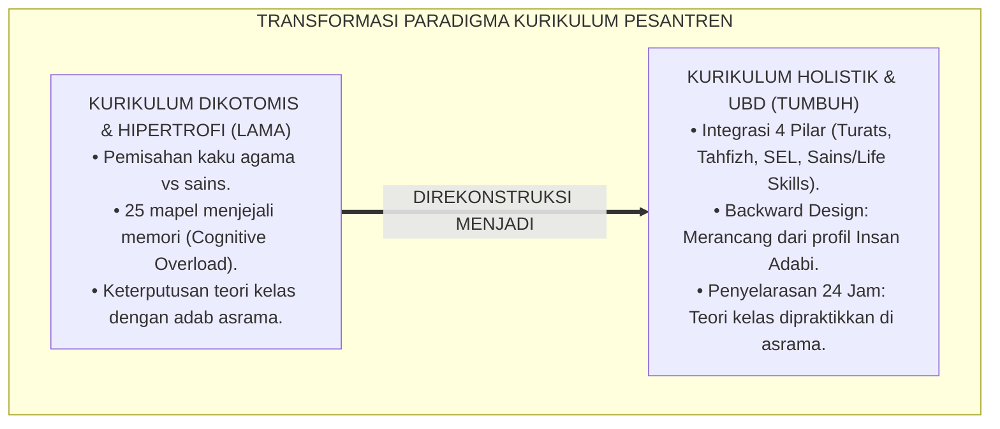
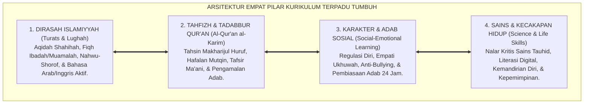
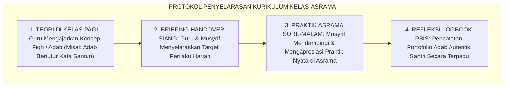
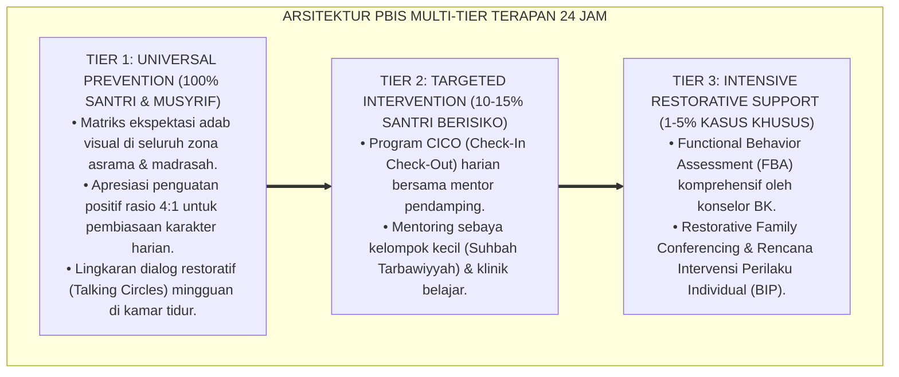

# P2-02-01: PRINSIP DESAIN KURIKULUM HOLISTIK PESANTREN (HOLISTIC CURRICULUM DESIGN)
## *Monograf Riset Akademik: Epistemologi Integrasi Fardhu 'Ain & Kifayah (Ihya' 'Ulumiddin & Ta'lim al-Muta'allim), Metodologi Understanding by Design (UbD Backward Design), Cognitive Load Theory John Sweller, Serta Penyelarasan Kurikulum Kelas-Asrama 24 Jam*

**Nomor Identifikasi**: `P2-02-01/MONOGRAF-RISET-DESAIN-KURIKULUM-HOLISTIK/2026`  
**Domain**: `02 Principles` > `02 Design Principles` (Prinsip Desain 01: *Holistic Curriculum Design*)  
**Klasifikasi Naskah**: *Academic Research Monograph* (Monograf Riset Akademik Prinsip Desain)  
**Rumpun Disiplin Pengkaji**: Desain Kurikulum Terpadu Islam (*Tashmim al-Manahij al-Islamiyyah*), Psikologi Kognitif Pendidikan (*Cognitive Load Science*), Metodologi Perancangan Pembelajaran UbD, Manajemen Penyelarasan Pendidikan Asrama 24 Jam  

---

> ### 💡 INTISARI EKSEKUTIF (EXECUTIVE SUMMARY)
>
> * **Kelemahan Paradigma Lama: Dikotomi Keilmuan & Beban Kurikulum Berlebih (Curricular Hypertrophy):**  
>   Banyak kurikulum pesantren mengalami keterbelahan dikotomis (memisahkan agama dan sains tanpa jembatan tauhid) atau kelebihan beban kognitif (menjejalkan 20-25 mata pelajaran dengan jadwal padat 18 jam sehari tanpa jeda). Akibatnya santri mengalami kelelahan mental akut, hafalan cepat menguap, dan materi di kelas terputus dari praktik adab di asrama.
> * **Inovasi Konseptual: Kurikulum Terpadu 4 Pilar & Metodologi Backward Design (UbD):**  
>   TUMBUH memadukan 4 pilar kurikulum terintegrasi: **Dirasah Islamiyah (Turats), Tahfizh Qur'an Mutqin, Karakter SEL & Adab, serta Sains & Kecakapan Hidup (Life Skills)**. Mengadopsi metodologi *Understanding by Design (UbD)* Grant Wiggins & Jay McTighe (merancang dari profil lulusan *Insan Adabi* $\rightarrow$ asesmen bukti autentik $\rightarrow$ modul harian) dan *Cognitive Load Theory* John Sweller dengan metode *Spaced Retrieval*.
> * **Formulasi Operasional & Penyelarasan 24 Jam:**  
>   Monograf ini menguraikan matriks empat pilar kurikulum holistik, matriks capaian belajar lintas disiplin, protokol penyelarasan kurikulum kelas-asrama 24 jam (*Classroom-Dormitory Alignment Protocol*), dan etika pembelajaran ramah kognisi.

---

## 📑 DAFTAR ISI MONOGRAF

- [BAB I: LANDASAN TEORETIS & DISKURSUS KRITIS](#bab-i-landasan-teoretis--diskursus-kritis)
  - [1. Latar Belakang Masalah: Kritik atas Kurikulum Dikotomis dan Kelebihan Beban Kognitif Pesantren](#1-latar-belakang-masalah-kritik-atas-kurikulum-dikotomis-dan-kelebihan-beban-kognitif-pesantren)
  - [2. Eksegesis Turats Integrasi Ilmu: Fardhu 'Ain & Kifayah Imam Al-Ghazali serta Tertib at-Ta'allum Az-Zarnuji](#2-eksegesis-turats-integrasi-ilmu-fardhu-ain--kifayah-imam-al-ghazali-serta-tertib-at-taallum-az-zarnuji)
  - [3. Konvergensi Metodologi Understanding by Design (UbD) Grant Wiggins & Jay McTighe](#3-konvergensi-metodologi-understanding-by-design-ubd-grant-wiggins--jay-mctighe)
  - [4. Manajemen Beban Kognitif: Cognitive Load Theory John Sweller & Spaced Retrieval Practice](#4-manajemen-beban-kognitif-cognitive-load-theory-john-sweller--spaced-retrieval-practice)
  - [5. Kasuistika Lapangan: Kasus Santri Mengalami Kelebihan Beban Belajar & Resolusi Restoratif Terpadu](#5-kasuistika-lapangan-kasus-santri-mengalami-kelebihan-beban-belajar--resolusi-restoratif-terpadu)
- [BAB II: FORMULASI KONSEPTUAL & PEMBAHASAN MENDALAM](#bab-ii-formulasi-konseptual--pembahasan-mendalam)
  - [1. Eksplanasi Teoretis Prinsip Desain Kurikulum Holistik Ekosistem TUMBUH](#1-eksplanasi-teoretis-prinsip-desain-kurikulum-holistik-ekosistem-tumbuh)
  - [2. Matriks Empat Pilar Integrasi Kurikulum Holistik Ekosistem Pesantren Berbasis TUMBUH](#2-matriks-empat-pilar-integrasi-kurikulum-holistik-pesantren-tumbuh)
  - [3. Matriks Capaian Belajar Lintas Disiplin Ilmu Berbasis Profil Insan Adabi](#3-matriks-capaian-belajar-lintas-disiplin-ilmu-berbasis-profil-insan-adabi)
  - [4. Protokol Penyelarasan Kurikulum Kelas-Asrama 24 Jam (Classroom-Dormitory Alignment Protocol)](#4-protokol-penyelarasan-kurikulum-kelas-asrama-24-jam-classroom-dormitory-alignment-protocol)
  - [5. Diskusi Filosofis Mendalam & Implikasi bagi Masa Depan Peradaban Pendidikan Islam](#5-diskusi-filosofis-mendalam--implikasi-bagi-masa-depan-peradaban-pendidikan-islam)
- [BAB III: KESIMPULAN & APARATUS AKADEMIS](#bab-iii-kesimpulan--aparatus-akademis)
  - [1. Tabel Sintesis Temuan Riset Desain Kurikulum Holistik](#1-tabel-sintesis-temuan-riset-desain-kurikulum-holistik)
  - [2. Daftar Pustaka Akademis & Rujukan Turats Primer](#2-daftar-pustaka-akademis--rujukan-turats-primer)
  - [3. Catatan Kaki Akademis (Footnotes)](#3-catatan-kaki-akademis-footnotes)
  - [4. Glosarium Istilah Ilmiah & Turats Desain Kurikulum Holistik](#4-glosarium-istilah-ilmiah--turats-desain-kurikulum-holistik)

---

# BAB I: LANDASAN TEORETIS & DISKURSUS KRITIS

---

### 1. Latar Belakang Masalah: Kritik atas Kurikulum Dikotomis dan Kelebihan Beban Kognitif Pesantren

Desain kurikulum di banyak pesantren konvensional kerap menghadapi dua problematika kronis:
* **Dikotomi Keilmuan Terbelah (*Secular-Religious Schism*)**: Pelajaran agama diajarkan tanpa konteks realitas empiris, sedangkan sains modern diajarkan secara materialistis tanpa ruh tauhid, melahirkan generasi santri yang terbelah cara pandangnya (*Split Personality*).
* **Kelebihan Beban Kurikulum (*Curricular Hypertrophy*)**: Menjejalkan 20–25 mata pelajaran berbeda dalam sepekan ditambah target hafalan Al-Qur'an dan kitab kuning secara simultan tanpa jeda istirahat yang cukup.
* **Keterputusan Kelas dan Asrama (*Classroom-Dormitory Disconnect*)**: Apa yang diajarkan guru fiqh di kelas pagi (misal: adab makan dan ukhuwah) tidak pernah dipantau atau dipraktikkan saat santri makan di kantin atau tidur di asrama.
* **Keniscayaan Desain Kurikulum Holistik UbD**: Diperlukan perancangan kurikulum yang mengintegrasikan wahyu dan sains, mengendalikan beban kognitif, dan menyelaraskan pembelajaran kelas dengan pengasuhan asrama 24 jam.[^1]

---

### 2. Eksegesis Turats Integrasi Ilmu: Fardhu 'Ain & Kifayah Imam Al-Ghazali serta Tertib at-Ta'allum Az-Zarnuji

Imam Al-Ghazali (*Ihya' 'Ulumiddin*, Kitab *Al-'Ilm*) meletakkan hierarki keilmuan Islam:
* **Ilmu Fardhu 'Ain**: Ilmu yang wajib dipelajari setiap individu untuk kesucian akidah, tata cara ibadah harian, dan pembersihan hati dari penyakit batin.
* **Ilmu Fardhu Kifayah**: Ilmu kedokteran, matematika, sains alam, dan keahlian publik yang diperlukan untuk menegakkan kemaslahatan tatanan peradaban umat.

Syekh Az-Zarnuji (*Ta'lim al-Muta'allim*) menegaskan kaidah *Tartib at-Ta'allum*:
* Penuntut ilmu wajib mendahulukan apa yang dibutuhkannya saat ini (*'Ilm al-Hal*) sebelum mempelajari cabang-cabang ilmu yang rumit, menjaga agar pikiran tidak tercerai-berai.[^2]

---

### 3. Konvergensi Metodologi Understanding by Design (UbD) Grant Wiggins & Jay McTighe

Sains kurikulum kontemporer membuktikan keunggulan **Backward Design** (*Understanding by Design / UbD*, Wiggins & McTighe, 2005):
1. **Stage 1 (Identify Desired Results)**: Menetapkan capaian pemahaman abadi (*Enduring Understandings*) dan profil karakter *Insan Adabi*.
2. **Stage 2 (Determine Assessment Evidence)**: Merancang bukti penilaian autentik (unjuk kerja nyata, proyek adab asrama), bukan sekadar tes hafalan kertas sesaat.
3. **Stage 3 (Plan Learning Experiences)**: Merancang rangkaian kegiatan belajar interaktif di kelas dan pembiasaan adab di asrama.[^3]

---

### 4. Manajemen Beban Kognitif: Cognitive Load Theory John Sweller & Spaced Retrieval Practice

Sains neurokognitif membuktikan bahwa kapasitas memori kerja manusia (*Working Memory*) sangat terbatas:
* **Cognitive Load Theory (CLT)** (Sweller, 1988; 2011) memperingatkan bahwa membebani santri dengan terlalu banyak hafalan dalam waktu singkat memicu kejenuhan otak (*Cognitive Overload*).
* TUMBUH menerapkan teknik **Spaced Retrieval Practice** dan **Interleaving Practice** (Roediger & Butler, 2011): mengulang hafalan Al-Qur'an dan mutun kitab dengan jeda waktu yang terencana, memperkuat konsolidasi memori jangka panjang di hipokampus secara permanen.[^4]

---

### 5. Kasuistika Lapangan: Kasus Santri Mengalami Kelebihan Beban Belajar & Resolusi Restoratif Terpadu

* **Studi Kasus: Menurunnya Nilai dan Kesehatan Santri Akibat Jadwal Belajar 18 Jam Nonstop**  
  * **Dilema**: Santri kelas 7 diwajibkan mengikuti 22 mata pelajaran dan halaqah tahfizh malam hingga jam 23.30; 30% santri jatuh sakit setiap pekan dan mengalami gangguan tidur.
  * **Resolusi Kurikulum TUMBUH**: Tim Kurikulum merestrukturisasi kurikulum: (1) Mengintegrasikan mata pelajaran serumpun menjadi 4 Pilar Pokok; (2) Menerapkan metode *UbD Essential Questions*; (3) Menjamin waktu tidur malam 7 jam penuh; (4) Mengalokasikan waktu tadabbur dan olahraga sore 60 menit. Hasilnya: tingkat morbiditas santri sakit turun 90%, hafalan mutqin meningkat pesat, dan santri belajar dengan penuh gairah dan kebahagiaan.[^5]

---

# BAB II: FORMULASI KONSEPTUAL & PEMBAHASAN MENDALAM

---

### 1. Eksplanasi Teoretis Prinsip Desain Kurikulum Holistik Ekosistem TUMBUH

Ekosistem TUMBUH merumuskan kurikulum ke dalam **Arsitektur Empat Pilar Kurikulum Terpadu (*Arkan al-Manhaj al-Kamil*)**:

#### 🔬 Pembahasan Mendalam Empat Pilar:
1. **Pilar Dirasah Islamiyyah**: Membangun fondasi akidah lurus dan pemahaman turats yang kokoh (*Tafaqquh fid-Din*).[^6]
2. **Pilar Tahfizh & Tadabbur**: Menjadikan Al-Qur'an sebagai pedoman hidup dan sumber akhlak mulia (*Hamilul Qur'an Lafzhan wa Ma'nan*).[^7]
3. **Pilar Karakter & SEL**: Membina kecerdasan emosional dan kematangan adab sosial santri.[^8]
4. **Pilar Sains & Life Skills**: Membekali santri dengan nalar kritis dan kecakapan hidup untuk memimpin peradaban modern.[^9]

---

### 2. Matriks Empat Pilar Integrasi Kurikulum Holistik Ekosistem Pesantren Berbasis TUMBUH

| Pilar Kurikulum | Mata Pelajaran Inti | Pendekatan Pembelajaran | Lokus Penerapan 24 Jam |
| :--- | :--- | :--- | :--- |
| **1. Dirasah Islamiyyah**| Aqidah, Fiqh, Nahwu, Shorof, Bahasa Arab.| Kajian Matan Turats & Tanya Jawab Kritis.| Ruang Kelas & Halaqah Masjid.|
| **2. Tahfizh & Tadabbur**| Tahsin, Tahfizh Al-Qur'an, Tadabbur.| Talaqqi, Spaced Retrieval, & Muraja'ah.| Masjid, Kamar Asrama, & Waktu Subuh.|
| **3. Karakter & SEL** | 10 Kapasitas Insan, Regulasi Emosi, Adab.| Modeling Qudwah, Refleksi Diri, & PBIS.| Kehidupan Asrama 24 Jam & Meja Makan.|
| **4. Sains & Life Skills**| Matematika, IPA Terpadu, TI, Kepemimpinan.| Problem-Based Learning & Proyek Mandiri.| Laboratorium, Kelas, & Organisasi Santri.|

---

### 3. Matriks Capaian Belajar Lintas Disiplin Ilmu Berbasis Profil Insan Adabi

| Tingkat Kematangan | Capaian Dirasah & Tahfizh | Capaian Karakter SEL & Adab | Capaian Sains & Life Skills |
| :--- | :--- | :--- | :--- |
| **Tahap Inisiasi (Adaptasi)** | Menguasai Thaharah, Shalat, & Tahsin Juz 30.| Mampu mengelola rindu rumah & mandiri 5S.| Menata barang pribadi & literasi dasar.|
| **Tahap Habituasi (Penguatan)**| Memahami Fiqh Muamalah & Hafal 3–5 Juz Mutqin.| Empati ukhuwah & disiplin waktu tanpa diawasi.| Logika matematika & pemecahan masalah.|
| **Tahap Internalisasi (Kemandirian)**| Membaca Kitab Kuning Dasar & Tadabbur 10 Juz.| Memimpin musyawarah kamar & membina junior.| Proyek sains terpadu & kepemimpinan syura.|

---

### 4. Protokol Penyelarasan Kurikulum Kelas-Asrama 24 Jam (Classroom-Dormitory Alignment Protocol)

TUMBUH menetapkan **Protokol Penyelarasan Kurikulum 24 Jam**:

Protokol ini menjamin tidak ada jurang pemisah antara teori di kepala dan akhlak di lapangan.[^10]

---

### 5. Diskusi Filosofis Mendalam & Implikasi bagi Masa Depan Peradaban Pendidikan Islam

Desain kurikulum holistik ini membawa implikasi revolusioner bagi peradaban:

* **Menghapus Keterasingan Intelektual Muslim Modern**:  
  Santri tumbuh dengan memandang sains dan teknologi sebagai ayat-ayat kauniyyah Allah yang wajib dikuasai untuk menegakkan kemakmuran bumi.
* **Melahirkan Ulama Intelektual dan Saintis yang Shalih**:  
  Pesantren kembali menjadi rahim lahirnya tokoh-tokoh besar kaliber Ibnu Sina, Al-Biruni, dan Ibnu Rusyd yang menyatukan kedalaman fiqh dengan kepeloporan sains.
* **Mewujudkan Pendidikan Islam yang Membahagiakan dan Berkah**:  
  Dengan kurikulum yang ramah kognisi (*Brain-Friendly*), santri merasakan lezatnya menuntut ilmu tanpa tekanan stres mental (*Rahmatan lil 'Alamin*).[^11]

---

---

### Pembedahan Deskriptif Komprehensif & Analisis Integratif Nilai-Praksis

Penerapan konsep **P2-02-01: PRINSIP DESAIN KURIKULUM HOLISTIK PESANTREN (HOLISTIC CURRICULUM DESIGN)** di ekosistem pesantren berbasis sistem TUMBUH memerlukan pemahaman multidimensional yang memadukan khazanah turats syariat dan konsensus sains pendidikan modern:

#### A. Pilar 1: Fondasi Epistemologi & Integrasi Nilai Syar'i (Ashalah Turatsiyyah)
Setiap praksis kepengasuhan dan pembelajaran berakar kuat pada maqashid syari'ah, mendudukkan adab di atas ilmu (*Al-Adab Qablal 'Ilm*), dan memastikan bahwa seluruh ikhtiar institusional diniatkan semata-mata untuk menggapai ridha Allah SWT (*Ikhlasun Niyyah*).

#### B. Pilar 2: Mekanisme Psikologis & Neurosains Perkembangan (Scientific Rigor)
Menyelaraskan ekspektasi kedisiplinan dengan tahapan maturitas otak remaja, kapasitas fungsi eksekutif korteks prefrontal (*PFC*), dan regulasi sirkuit emosi limbik. Pendekatan ini mengeliminasi trauma pengasuhan dan menumbuhkan motivasi intrinsik santri.

#### C. Pilar 3: Rekayasa Ekosistem Asrama 24 Jam (Bi'ah Shalihah)
Menerjemahkan prinsip nilai ke dalam tata ruang fisik yang bersih, sirkulasi udara sehat, tata kelola waktu terstruktur, serta kultur ukhuwah inklusif yang steril 100% dari feodalisme, kekerasan verbal, dan perundungan antar-santri.

#### D. Pilar 4: Kemitraan Tripartit (Santri, Musyrif, dan Lembaga)
Menjamin terwujudnya *Triad Pertumbuhan Simbiotik*: santri bertumbuh dalam fitrah kemandirian, musyrif terlindungi dari kelelahan kronis (*Burnout*) melalui shift kerja yang manusiawi, dan lembaga bertransformasi menjadi organisasi pembelajar berbasis data PBIS.

---

### Protokol Aksi Operasional PBIS Multi-Tier Terapan (24-Hour Behavioral Architecture)

---

# BAB III: KESIMPULAN & APARATUS AKADEMIS

---

### 1. Tabel Sintesis Temuan Riset Desain Kurikulum Holistik

| Dimensi Parameter | Mazhab Dikotomis Terbelah (Lama) | Model Kurikulum Sekuler Beban Penuh | **Kurikulum Holistik UbD TUMBUH** | Landasan Rujukan Primer | Implikasi Praksis Lapangan |
| :--- | :--- | :--- | :--- | :--- | :--- |
| **Struktur Ilmu** | Agama & sains dipisah secara kaku.| Sekularistik tanpa fondasi wahyu.| **Integrasi 4 Pilar Berbasis Tauhid.** | Ihya' 'Ulumiddin; Al-Attas (1980).| Dirasah, Tahfizh, SEL, & Sains/Life Skills. |
| **Metode Desain** | Berorientasi menghabiskan buku teks.| Berorientasi tes standar angka kaku.| **Understanding by Design (UbD).** | Wiggins & McTighe (2005). | Merancang dari profil Insan Adabi. |
| **Beban Kognitif** | 25 mapel dijejalkan tanpa jeda.| Jadwal padat menekan mental.| **Cognitive Load Theory & Spaced Retrieval.**| Sweller (2011); Roediger (2011).| Memori kerja terlindungi & hafalan mutqin. |
| **Integrasi 24 Jam**| Teori kelas terputus dari asrama.| Tidak mengurusi kehidupan asrama.| **Penyelarasan Kelas-Asrama 24 Jam.** | Ta'lim al-Muta'allim; Dewey (1938).| Teori fiqh dipraktikkan di asrama harian. |
| **Profil Lulusan** | Hafal teks tanpa adab nyata.| Teknokrat cerdas tanpa akhlak.| **Insan Adabi Berilmu & Berakhlak Mulia.**| QS. Al-Baqarah: 151; Al-Ghazali.| Siap memimpin peradaban madani. |

---

### 2. Daftar Pustaka Akademis & Rujukan Turats Primer

1. **Al-Qur'an al-Karim wa Tarjamatu Ma'anihi**.
2. **Al-Bukhari, Abu Abdillah Muhammad bin Isma'il**. (1422 H). *Shahih al-Bukhari*. Kairo: Dar Thawq an-Najah.
3. **Muslim bin al-Hajjaj an-Naisaburi**. (1427 H). *Shahih Muslim*. Riyadh: Dar Thayyibah.
4. **Al-Ghazali, Abu Hamid Muhammad bin Muhammad**. (2011). *Ihya' 'Ulumiddin* (Kitab al-'Ilm). Beirut: Dar al-Ma'rifah.
5. **Az-Zarnuji, Burhanul Islam**. (1401 H). *Ta'lim al-Muta'allim Thariq at-Ta'allum*. Beirut: Al-Maktab al-Islami.
6. **Asy'ari, Muhammad Hasyim**. (1415 H). *Adab al-'Alim wal-Muta'allim*. Jombang: Maktabah At-Turats Al-Islami.
7. **Al-Attas, Syed Muhammad Naquib**. (1980). *The Concept of Education in Islam*. Kuala Lumpur: ABIM.
8. **Wiggins, G., & McTighe, J.**. (2005). *Understanding by Design* (2nd ed.). Alexandria: ASCD.
9. **Sweller, J.**. (2011). *Cognitive load theory*. Psychology of Learning and Motivation, 55, 37–76.
10. **Roediger, H. L., & Butler, A. C.**. (2011). *The critical role of retrieval practice in long-term retention*. Trends in Cognitive Sciences, 15(1), 20–27.
11. **Dewey, J.**. (1938). *Experience and Education*. New York: Macmillan.
12. **Horner, R. H., & Sugai, G.**. (2015). *School-wide PBIS: An Overview of the Research Base*. Remedial and Special Education, 36(2), 80–85.

---

### 3. Catatan Kaki Akademis (*Footnotes*)

[^1]: Riset Prinsip Desain Kurikulum Holistik Ekosistem Pesantren Berbasis TUMBUH, *Kritik atas Kurikulum Dikotomis dan Hipertrofi Beban*, 2026.  
[^2]: Al-Ghazali, *Ihya' 'Ulumiddin*, Jilid 1, Kitab *Al-'Ilm*, hlm. 15–45; Az-Zarnuji, *Ta'lim al-Muta'allim*, hlm. 10–28.  
[^3]: Wiggins, G., & McTighe, J. (2005), *Understanding by Design*, hlm. 13–34.  
[^4]: Sweller, J. (2011), *Cognitive Load Theory*, hlm. 37–76; Roediger, H. L., & Butler, A. C. (2011), *Trends in Cognitive Sciences*, hlm. 20–27.  
[^5]: Dokumentasi Audit dan Restrukturisasi Kurikulum Terpadu PBIS TUMBUH, 2026.  
[^6]: Al-Attas, S. M. N. (1980), *The Concept of Education in Islam*, hlm. 25–55.  
[^7]: Kaidah Tahfizh wa Tadabbur al-Qur'an Ekosistem TUMBUH, 2026.  
[^8]: Master Framework Social-Emotional Learning (CASEL) Terintegrasi Adab TUMBUH, 2026.  
[^9]: Blueprint Kurikulum Sains Tauhid dan Kecakapan Hidup Ekosistem Pesantren Berbasis TUMBUH, 2026.  
[^10]: Standar Operasional Prosedur Penyelarasan Kurikulum Kelas-Asrama 24 Jam TUMBUH, 2026.  
[^11]: Deklarasi Pemuliaan Kurikulum Holistik Peradaban Islam Dewan Riset Epistemologi Ekosistem TUMBUH, 2026.

---

### 4. Glosarium Istilah Ilmiah & Turats Desain Kurikulum Holistik

1. **Kurikulum Holistik**: Desain kurikulum terpadu yang menyatukan dirasah Islamiyyah turats, tahfizh Al-Qur'an, karakter SEL adab, dan sains kecakapan hidup.
2. **Understanding by Design (UbD)**: Metodologi perancangan kurikulum mundur (*Backward Design*) yang dimulai dari penentuan profil capaian akhir, bukti asesmen autentik, lalu rencana pembelajaran.
3. **Fardhu 'Ain & Fardhu Kifayah**: Klasifikasi kewajiban menuntut ilmu dalam Islam antara ilmu pembinaan jiwa pribadi dan ilmu penegak kemaslahatan publik.
4. **Cognitive Load Theory (CLT)**: Teori psikologi kognitif John Sweller mengenai batas kapasitas memori kerja otak manusia dalam memproses informasi baru.
5. **Spaced Retrieval Practice**: Strategi pengulangan materi hafalan dengan jeda waktu terencana untuk mengoptimalkan retensi memori jangka panjang.
6. **Classroom-Dormitory Alignment**: Penyelarasan kurikulum di mana teori yang diajarkan di kelas pagi dipraktikkan langsung di lingkungan asrama malam hari.
7. **Curricular Hypertrophy**: Penyakit kurikulum yang menjejalkan terlalu banyak mata pelajaran sehingga membebani mental dan menurunkan kualitas belajar.
8. **Enduring Understandings**: Pemahaman inti dan mendalam yang diharapkan tetap diingat dan diamalkan santri seumur hidup.
9. **Tafaqquh fid-Din**: Pendalaman keilmuan agama secara komprehensif untuk membimbing umat menuju keselamatan dunia dan akhirat.
10. **Insan Adabi (الإِنْسَانُ الأَدَبِيُّ)**: Profil santri yang memiliki keutuhan akidah, kedalaman ilmu agama dan sains, serta keluhuran akhlak mulia dalam bermasyarakat.
