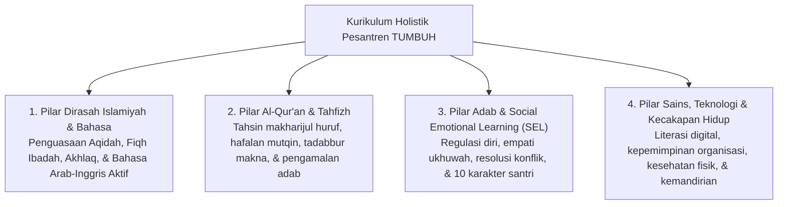

# P2-02-01-Prinsip-Desain-Kurikulum-Holistik

## Tujuan
Menetapkan prinsip perancangan kurikulum pesantren yang holistik dan terpadu, menyatukan 4 pilar utama: **Dirasah Islamiyah (Turats)**, **Tahfizh Al-Qur'an**, **Karakter Sosial-Emosional (SEL & Adab)**, dan **Kecakapan Hidup (Life Skills & Sains)**.

---

## 1. 4 Pilar Integrasi Kurikulum Holistik

---

## 2. Kaidah Baku Desain Kurikulum

1. **Kaidah Penyelarasan Kelas dan Asrama (*Classroom-Dormitory Alignment*)**:
   - Apa yang diajarkan di dalam kelas (misal: bab adab persaudaraan dalam kitab *Taisirul Khalaq*) wajib dipraktikkan langsung dalam interaksi kamar asrama malam harinya.
2. **Kaidah Pengurangan Beban Berlebih (*Cognitive Load Theory*)**:
   - Menghindari penjadwalan hafalan yang terlalu padat tanpa jeda istirahat yang cukup. Menggunakan metode *Spaced Retrieval* untuk menjaga retensi memori jangka panjang santri.
3. **Kaidah Capaian Berjenjang Sesuai Tangga TUMBUH**:
   - Kurikulum dirancang dengan capaian belajar (*Learning Outcomes*) yang berbeda di tiap jenjang:
     * **T1 (Kelas 7/10 Baru)**: Fokus pada adaptasi adab dasar dan pembiasaan makharijul huruf.
     * **T2 (Kelas 8/11)**: Fokus pada akselerasi hafalan dan pemahaman kaidah syariat.
     * **T3 (Kelas 9/12)**: Fokus pada pendalaman analisis kitab dan kepemimpinan proyek.
     * **T4 (Pasca Lulus / Santri Akhir)**: Fokus pada pengabdian (*Khidmah*), riset, dan peran *peer mentor*.

---

## 3. Status Dokumen
* **Status**: 🌟 **A+ (Tervalidasi & Siap Diimplementasikan)**
* **Level**: Project 2 - `02 Principles / 02 Design Principles`
* **Langkah Berikutnya**: **`P2-02-02-Prinsip-Desain-Arsitektur-Asrama-24-Jam.md`**.
