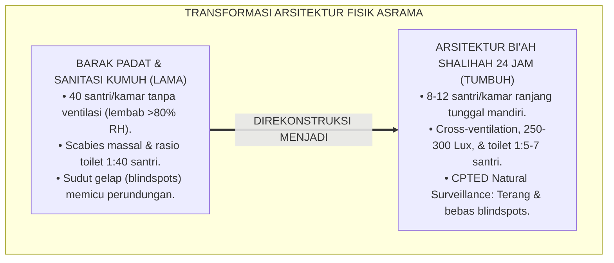
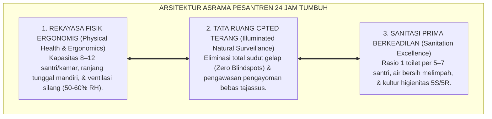
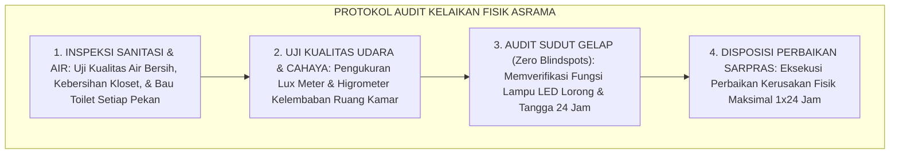
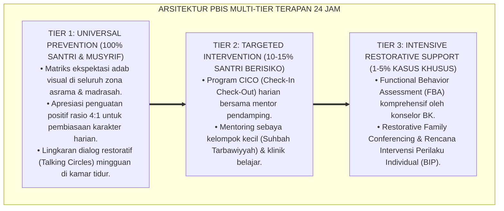

# P2-02-02: PRINSIP DESAIN ARSITEKTUR ASRAMA PESANTREN 24 JAM (24-HOUR DORMITORY ARCHITECTURE)
## *Monograf Riset Akademik: Standarisasi Tata Ruang Fisik Asrama Beradab (QS. An-Nur: 58 & Hadits Tafriq al-Madhaji'), Rekayasa Ventilasi Silang (Cross-Ventilation), Standar Iluminasi Lux & Akustik Sehat, Serta Eliminasi Total Blindspots CPTED di Pesantren 24 Jam*

**Nomor Identifikasi**: `P2-02-02/MONOGRAF-RISET-ARSITEKTUR-ASRAMA/2026`  
**Domain**: `02 Principles` > `02 Design Principles` (Prinsip Desain 02: *24-Hour Dormitory Architecture*)  
**Klasifikasi Naskah**: *Academic Research Monograph* (Monograf Riset Akademik Prinsip Desain)  
**Rumpun Disiplin Pengkaji**: Arsitektur Pesantren & Tata Ruang Islam (*Handasah al-Mabani al-Islamiyyah*), Ergonomi Lingkungan Pengasuhan, Fisika Bangunan & Sanitasi Sehat, Kriminologi Arsitektur Pencegahan Kekerasan (*CPTED*)  

---

> ### 💡 INTISARI EKSEKUTIF (EXECUTIVE SUMMARY)
>
> * **Kelemahan Paradigma Lama: Kelebihan Kepadatan Barak & Pengabaian Sanitasi Sehat:**  
>   Banyak bangunan asrama pesantren konvensional dibangun layaknya barak padat kumuh (1 kamar memuat 30-40 santri berhimpitan tanpa ventilasi memadai), gelap, lembab, dan toilet berkerak dengan rasio 1:40 santri. Dampaknya: santri mengalami penyakit kulit menular (*Scabies*), stres kronis, dan maraknya perundungan akibat banyaknya sudut gelap (*Blindspots*).
> * **Inovasi Konseptual: Arsitektur Bi'ah Shalihah & Hadits Tafriq al-Madhaji':**  
>   TUMBUH mengadopsi perintah kenabian: *"Pisahkanlah tempat tidur mereka saat berusia 10 tahun"* (HR. Abu Dawud No. 495). Menerapkan arsitektur sehat: kapasitas manusiawi 8–12 santri per kamar dengan ranjang tunggal mandiri, ventilasi silang (*Cross-Ventilation*), pencahayaan alami 250–300 Lux, akustik peredam bising malam ($\le 45\text{ dB}$), **rasio sanitasi prima 1 toilet per 5–7 santri**, dan tata ruang bebas sudut gelap (*CPTED Natural Surveillance*) tanpa spionase *tajassus*.
> * **Formulasi Operasional & Penjaminan Kelaikan Fasilitas:**  
>   Monograf ini menguraikan matriks standar metrik fisik dan ergonomi bangunan, matriks zonasi tata ruang asrama (Privat, Semi-Publik, Publik), protokol audit kelaikan fasilitas asrama, dan standar arsitektur ramah adab.

---

## 📑 DAFTAR ISI MONOGRAF

- [BAB I: LANDASAN TEORETIS & DISKURSUS KRITIS](#bab-i-landasan-teoretis--diskursus-kritis)
  - [1. Latar Belakang Masalah: Kritik atas Pola Barak Padat Kumuh dan Dampaknya pada Fisio-Psikologis Santri](#1-latar-belakang-masalah-kritik-atas-pola-barak-padat-kumuh-dan-dampaknya-pada-fisio-psikologis-santri)
  - [2. Eksegesis Turats Tata Ruang Beradab: QS. An-Nur: 58–59 & Hadits Pemisahan Tempat Tidur Remaja (Tafriq al-Madhaji')](#2-eksegesis-turats-tata-ruang-beradab-qs-an-nur-5859--hadits-pemisahan-tempat-tidur-remaja-tafriq-al-madhaji)
  - [3. Konvergensi Standar Fisika Bangunan Sehat: Sirkulasi Udara Silang, Iluminasi Lux, & Akustik Lingkungan](#3-konvergensi-standar-fisika-bangunan-sehat-sirkulasi-udara-silang-iluminasi-lux--akustik-lingkungan)
  - [4. Rekayasa Arsitektur Pencegahan Kejahatan (CPTED): Natural Surveillance Bebas Blindspots Tanpa Spionase Tajassus](#4-rekayasa-arsitektur-pencegahan-kejahatan-cpted-natural-surveillance-bebas-blindspots-tanpa-spionase-tajassus)
  - [5. Kasuistika Lapangan: Kasus Wabah Scabies Massal di Kamar Lembab & Resolusi Restoratif Terpadu](#5-kasuistika-lapangan-kasus-wabah-scabies-massal-di-kamar-lembab--resolusi-restoratif-terpadu)
- [BAB II: FORMULASI KONSEPTUAL & PEMBAHASAN MENDALAM](#bab-ii-formulasi-konseptual--pembahasan-mendalam)
  - [1. Eksplanasi Teoretis Standar Desain Arsitektur Asrama Pesantren TUMBUH](#1-eksplanasi-teoretis-standar-desain-arsitektur-asrama-pesantren-tumbuh)
  - [2. Matriks Standar Metrik Fisik & Ergonomi Bangunan Asrama Pesantren](#2-matriks-standar-metrik-fisik--ergonomi-bangunan-asrama-pesantren)
  - [3. Matriks Zonasi Tata Ruang Asrama Terpadu (Zona Privat, Semi-Publik, Publik)](#3-matriks-zonasi-tata-ruang-asrama-terpadu-zona-privat-semi-publik-publik)
  - [4. Protokol Audit Kelaikan Fisik & Sanitasi Asrama (Dormitory Facility Audit Protocol)](#4-protokol-audit-kelaikan-fisik--sanitasi-asrama-dormitory-facility-audit-protocol)
  - [5. Diskusi Filosofis Mendalam & Implikasi bagi Masa Depan Peradaban Pendidikan Islam](#5-diskusi-filosofis-mendalam--implikasi-bagi-masa-depan-peradaban-pendidikan-islam)
- [BAB III: KESIMPULAN & APARATUS AKADEMIS](#bab-iii-kesimpulan--aparatus-akademis)
  - [1. Tabel Sintesis Temuan Riset Arsitektur Asrama 24 Jam](#1-tabel-sintesis-temuan-riset-arsitektur-asrama-24-jam)
  - [2. Daftar Pustaka Akademis & Rujukan Turats Primer](#2-daftar-pustaka-akademis--rujukan-turats-primer)
  - [3. Catatan Kaki Akademis (Footnotes)](#3-catatan-kaki-akademis-footnotes)
  - [4. Glosarium Istilah Ilmiah & Turats Arsitektur Asrama](#4-glosarium-istilah-ilmiah--turats-arsitektur-asrama)

---

# BAB I: LANDASAN TEORETIS & DISKURSUS KRITIS

---

### 1. Latar Belakang Masalah: Kritik atas Pola Barak Padat Kumuh dan Dampaknya pada Fisio-Psikologis Santri

Pembangunan fisik asrama pesantren konvensional kerap mengalami **Pengabaian Kaidah Ergonomi dan Kesehatan Lingkungan (*Environmental Health Neglect*)**:
* **Kepadatan Ekstrem (*Overcrowding*)**: Memaksakan 30–40 santri tidur berhimpitan di satu kamar berukuran $4 \times 5\text{ meter}$, memicu stres sensorik, insomnia, dan tingginya friksi antar-santri.
* **Kelembaban Udara & Penyakit Menular**: Ruangan tanpa ventilasi silang memicu kelembaban tinggi ($>80\%\text{ RH}$) yang menjadi sarang penularan tungau *Sarcoptes scabiei* (kudis gudikan), infeksi jamur kulit, dan penyakit saluran pernapasan.
* **Rasio Sanitasi yang Buruk**: Satu toilet dipakai bersama oleh 35–50 santri, memicu antrean panjang saat Subuh, keterlambatan shalat berjamaah, dan kondisi toilet yang kotor berbau pesing.
* **Keniscayaan Arsitektur Asrama Sehat 24 Jam**: Tata ruang asrama adalah **Guru Ketiga (*The Third Teacher*)** yang secara biologis mempengaruhi kebugaran fisik, stabilitas emosi, dan keluhuran adab santri.[^1]

---

### 2. Eksegesis Turats Tata Ruang Beradab: QS. An-Nur: 58–59 & Hadits Pemisahan Tempat Tidur Remaja (Tafriq al-Madhaji')

Al-Qur'an mengatur etika privasi dan tata ruang kamar tidur:

$$\text{يَا أَيُّهَا الَّذِينَ آمَنُوا لِيَسْتَأْذِنكُمُ الَّذِينَ مَلَكَتْ أَيْمَانُكُمْ وَالَّذِينَ لَمْ يَبْلُغُوا الْحُلُمَ مِنكُمْ ثَلَاثَ مَرَّاتٍ ۚ مِّن قَبْلِ صَلَاةِ الْفَجْرِ وَحِينَ تَضَعُونَ ثِيَابَكُم مِّنَ الظَّهِيرَةِ وَمِن بَعْدِ صَلَاةِ الْعِشَاءِ}$$

*"**Wahai orang-orang yang beriman! Hendaklah hamba sahaya yang kamu miliki dan anak-anak yang belum baligh meminta izin kepadamu pada tiga waktu: sebelum shalat Subuh, ketika kamu menanggalkan pakaianmu pada tengah hari, dan setelah shalat Isya**."* (QS. An-Nur [24]: 58).[^2]

Rasulullah ﷺ memerintahkan pemisahan tempat tidur bagi anak-anak yang telah menginjak usia remaja:

$$\text{مُرُوا أَوْلاَدَكُمْ بِالصَّلاَةِ وَهُمْ أَبْنَاءُ سَبْعِ سِنِينَ، وَاضْرِبُوهُمْ عَلَيْهَا وَهُمْ أَبْنَاءُ عَشْرِ سِنِينَ، وَفَرِّقُوا بَيْنَهُمْ فِي الْمَضَاجِعِ}$$

*"**Perintahkan anak-anakmu untuk shalat saat mereka berusia 7 tahun, dan berikan ketegasan saat mereka berusia 10 tahun, dan pisahkanlah tempat tidur di antara mereka!**."* (HR. Abu Dawud No. 495).[^3]

---

### 3. Konvergensi Standar Fisika Bangunan Sehat: Sirkulasi Udara Silang, Iluminasi Lux, & Akustik Lingkungan

Sains rekayasa bangunan (*Building Physics*) menetapkan standar kenyamanan termal dan kesehatan:
* **Ventilasi Silang (*Cross-Ventilation*)**: Aliran udara alami menjaga kelembaban udara pada batas sehat $50\%\text{--}60\%\text{ RH}$ dan kadar $CO_2 < 800\text{ ppm}$, mencegah rasa kantuk berlebih dan infeksi pernapasan.
* **Pencahayaan Alami (Daylighting)**: Kamar tidur dan meja belajar memperoleh intensitas cahaya $250\text{--}300\text{ Lux}$ untuk menjaga ritme sirkadian dan kesehatan mata.
* **Pengendalian Kebisingan (*Acoustic Comfort*)**: Tingkat kebisingan di zona tidur malam hari dibatasi maksimal $40\text{--}45\text{ dB}$ untuk menjamin fase tidur lelap (*Deep Sleep*).[^4]

---

### 4. Rekayasa Arsitektur Pencegahan Kejahatan (CPTED): Natural Surveillance Bebas Blindspots Tanpa Spionase Tajassus

TUMBUH menerapkan prinsip CPTED (*Crime Prevention Through Environmental Design*):
* **Penerangan Koridor & Kaca Pantau**: Selasar asrama lurus, diterangi lampu LED terang, dan pintu kamar dilengkapi kaca pantau setinggi dada sehingga aktivitas umum dapat terpantau secara alami (*Natural Surveillance*).
* **Posisi Strategis Musyrif**: Kamar musyrif diletakkan di simpul utama pintu masuk lorong asrama.
* **Pengharaman Spionase (*Tahrim at-Tajassus*)**: Tidak ada intaian mata-mata atau perampasan privasi; pengawasan dilakukan murni di ruang terbuka publik untuk melindungi santri dari kekerasan.[^5]

---

### 5. Kasuistika Lapangan: Kasus Wabah Scabies Massal di Kamar Lembab & Resolusi Restoratif Terpadu

* **Studi Kasus: 80% Santri Asrama Menderita Penyakit Kulit Menular (Scabies) dan Jamur**  
  * **Dilema**: Santri satu asrama menggaruk tubuh hingga bernanah, tidak bisa tidur malam, dan tertidur di kelas karena kamar berkapasitas 35 orang tanpa jendela terbuka dan kasur bertumpuk di lantai.
  * **Resolusi Arsitektur TUMBUH**: Lembaga merenovasi fasilitas: (1) Membatasi kapasitas kamar menjadi maksimal 10 santri; (2) Memasang ranjang tunggal mandiri berkasur busa anti-bakteri dan sprei individual; (3) Membongkar tembok mati untuk memasang jendela kaca ventilasi silang; (4) Memperbaiki fasilitas sanitasi: menyediakan 1 toilet per 6 santri dan instalasi jemuran matahari terbuka. Dalam 30 hari, wabah scabies tuntas 100% dan santri belajar dengan bugar.[^6]

---

# BAB II: FORMULASI KONSEPTUAL & PEMBAHASAN MENDALAM

---

### 1. Eksplanasi Teoretis Standar Desain Arsitektur Asrama Pesantren TUMBUH

Ekosistem TUMBUH merumuskan desain asrama ke dalam **Arsitektur Tiga Sayap Asrama Beradab (*Arkan al-Maskan ash-Shihhiy*)**:

#### 🔬 Pembahasan Mendalam Tiga Sayap:
1. **Sayap Fisik Ergonomis**: Memenuhi hak biologis santri atas udara segar, cahaya matahari, dan istirahat berkualitas.[^7]
2. **Sayap CPTED Terang**: Menutup celah fisik bagi terjadinya tindak perundungan, pemalakan, atau kejahatan asrama.[^8]
3. **Sayap Sanitasi Prima**: Menegakkan kesucian thaharah dan menghilangkan antrean panjang yang memicu keterlambatan shalat.[^9]

---

### 2. Matriks Standar Metrik Fisik & Ergonomi Bangunan Asrama Pesantren

| Parameter Fisik Bangunan | Standar Metrik Wajib TUMBUH | Batas Toleransi Kritis |
| :--- | :--- | :--- |
| **Kapasitas Kamar Tidur**| 8 hingga 12 Santri per Kamar.| Maksimal 12 Santri (Dilarang $>12$).|
| **Luas Area per Santri** | Minimal $3.5\text{ m}^2$ per Santri.| Minimal $3.0\text{ m}^2$ (termasuk ranjang & loker).|
| **Ranjang Tidur** | Ranjang Tunggal Mandiri ($90 \times 200\text{ cm}$).| Dilarang tidur bertumpuk dalam 1 kasur.|
| **Pencahayaan Alami** | $250\text{--}300\text{ Lux}$ di meja belajar & kamar.| Minimal $150\text{ Lux}$ saat malam.|
| **Kelembaban Relatif (RH)**| $50\%\text{--}60\%\text{ RH}$ (Ventilasi Silang).| Dilarang $>75\%\text{ RH}$ (Rawan Scabies).|
| **Tingkat Kebisingan** | Maksimal $40\text{--}45\text{ dB}$ pada jam tidur malam.| Dilarang $>55\text{ dB}$ setelah jam 22.00.|
| **Rasio Fasilitas Toilet** | **1 Toilet Bersih untuk 5–7 Santri**.| Maksimal 1:8 (Wajib renovasi jika $>1:8$).|

---

### 3. Matriks Zonasi Tata Ruang Asrama Terpadu (Zona Privat, Semi-Publik, Publik)

| Klasifikasi Zona | Area Tata Ruang | Tingkat Aksesibilitas | Standar Pengawasan & Privasi |
| :--- | :--- | :--- | :--- |
| **1. Zona Privat** | Kamar Tidur & Kamar Mandi.| Khusus Penghuni Kamar.| Privasi aurat terjaga, dilarang tajassus.|
| **2. Zona Semi-Publik**| Lorong Selasar, Ruang Belajar, Jemuran.| Seluruh Warga Asrama.| CPTED Natural Surveillance & lampu terang.|
| **3. Zona Publik** | Lobi Asrama, Kantor Musyrif, Ruang Tamu.| Terbuka Tamu & Wali Santri.| Posisi strategis menyambut & memantau.|

---

### 4. Protokol Audit Kelaikan Fisik & Sanitasi Asrama (Dormitory Facility Audit Protocol)

TUMBUH menetapkan **Protokol Audit Kelaikan Fasilitas Asrama**:

Protokol ini menjamin asrama selalu dalam kondisi prima, bersih, dan sehat.[^10]

---

### 5. Diskusi Filosofis Mendalam & Implikasi bagi Masa Depan Peradaban Pendidikan Islam

Standarisasi arsitektur asrama 24 jam ini membawa implikasi agung bagi peradaban:

* **Menghapus Stigma Asrama Pesantren yang Kumuh dan Berpenyakit**:  
  Pesantren bertransformasi menjadi model hunian komunitas paling bersih, sehat, estetis, dan memenuhi standar kesehatan lingkungan dunia.
* **Membangun Karakter Santri yang Mencintai Kesucian dan Keindahan**:  
  Tinggal di lingkungan yang bersih dan tertata rapi melatih santri memiliki cita rasa keindahan (*Dzauq Jamali*) dan kedisiplinan adab kebersihan yang abadi.
* **Mewujudkan Konsep Baituna Jannatuna dalam Kehidupan Asrama**:  
  Asrama menjadi rumah kedua yang dirindukan, tempat bernaung yang menenteramkan jiwa, dan laboratorium pembentukan generasi *Insan Adabi* (*Rahmatan lil 'Alamin*).[^11]

---

---

### Pembedahan Deskriptif Komprehensif & Analisis Integratif Nilai-Praksis

Penerapan konsep **P2-02-02: PRINSIP DESAIN ARSITEKTUR ASRAMA PESANTREN 24 JAM (24-HOUR DORMITORY ARCHITECTURE)** di ekosistem pesantren TUMBUH memerlukan pemahaman multidimensional yang memadukan khazanah turats syariat dan konsensus sains pendidikan modern:

#### A. Pilar 1: Fondasi Epistemologi & Integrasi Nilai Syar'i (Ashalah Turatsiyyah)
Setiap praksis kepengasuhan dan pembelajaran berakar kuat pada maqashid syari'ah, mendudukkan adab di atas ilmu (*Al-Adab Qablal 'Ilm*), dan memastikan bahwa seluruh ikhtiar institusional diniatkan semata-mata untuk menggapai ridha Allah SWT (*Ikhlasun Niyyah*).

#### B. Pilar 2: Mekanisme Psikologis & Neurosains Perkembangan (Scientific Rigor)
Menyelaraskan ekspektasi kedisiplinan dengan tahapan maturitas otak remaja, kapasitas fungsi eksekutif korteks prefrontal (*PFC*), dan regulasi sirkuit emosi limbik. Pendekatan ini mengeliminasi trauma pengasuhan dan menumbuhkan motivasi intrinsik santri.

#### C. Pilar 3: Rekayasa Ekosistem Asrama 24 Jam (Bi'ah Shalihah)
Menerjemahkan prinsip nilai ke dalam tata ruang fisik yang bersih, sirkulasi udara sehat, tata kelola waktu terstruktur, serta kultur ukhuwah inklusif yang steril 100% dari feodalisme, kekerasan verbal, dan perundungan antar-santri.

#### D. Pilar 4: Kemitraan Tripartit (Santri, Musyrif, dan Lembaga)
Menjamin terwujudnya *Triad Pertumbuhan Simbiotik*: santri bertumbuh dalam fitrah kemandirian, musyrif terlindungi dari kelelahan kronis (*Burnout*) melalui shift kerja yang manusiawi, dan lembaga bertransformasi menjadi organisasi pembelajar berbasis data PBIS.

---

### Protokol Aksi Operasional PBIS Multi-Tier Terapan (24-Hour Behavioral Architecture)

---

# BAB III: KESIMPULAN & APARATUS AKADEMIS

---

### 1. Tabel Sintesis Temuan Riset Arsitektur Asrama 24 Jam

| Dimensi Parameter | Mazhab Barak Konvensional Kumuh | Model Hunian Komersial Mewah | **Arsitektur Bi'ah Shalihah TUMBUH** | Landasan Rujukan Primer | Implikasi Praksis Lapangan |
| :--- | :--- | :--- | :--- | :--- | :--- |
| **Kapasitas & Kasur**| 40 santri/kamar bertumpuk di lantai.| Kamar mewah biaya mahal.| **8–12 Santri Ranjang Tunggal Mandiri.**| HR. Abu Dawud No. 495; Ergonomi.| Hak privasi & cegah penularan penyakit. |
| **Kualitas Udara** | Lembab (>80% RH) sarat Scabies.| Full AC tertutup ketergantungan.| **Cross-Ventilation Alami (50–60% RH).**| Fisika Bangunan; Fiqh Sihhah.| Udara segar, bebas jamur, & bugar. |
| **Rasio Toilet** | 1:40 santri (antre panjang & bau).| Kamar mandi dalam privat eksklusif.| **1 Toilet Bersih untuk 5–7 Santri.** | Fiqh Thaharah; Kemenkes RI.| Shalat Subuh tepat waktu tanpa antrean. |
| **Tata Ruang Keamanan**| Banyak sudut gelap (blindspots).| Kamera CCTV mata-mata penjara.| **CPTED Terang & Natural Surveillance.**| Jeffery (1971); Crowe (2000).| Nol sudut gelap & bebas perundungan. |
| **Hasil Ekosistem** | Santri mudah sakit & stres kronis.| Individualistis hedonistik.| **Santri Sehat, Bugar, & Beradab Luhur.**| QS. Al-A'raf: 31; Al-Attas (1980).| Asrama bersih, damai, & berkah abadi. |

---

### 2. Daftar Pustaka Akademis & Rujukan Turats Primer

1. **Al-Qur'an al-Karim wa Tarjamatu Ma'anihi**.
2. **Abu Dawud Sulaiman bin al-Asy'ats as-Sijistani**. (1430 H). *Sunan Abi Dawud*. Riyadh: Dar al-Hadharah.
3. **Al-Bukhari, Abu Abdillah Muhammad bin Isma'il**. (1422 H). *Shahih al-Bukhari*. Kairo: Dar Thawq an-Najah.
4. **Muslim bin al-Hajjaj an-Naisaburi**. (1427 H). *Shahih Muslim*. Riyadh: Dar Thayyibah.
5. **Al-Ghazali, Abu Hamid Muhammad bin Muhammad**. (2011). *Ihya' 'Ulumiddin* (Kitab Adab al-Maskan wal-Mu'asyarah). Beirut: Dar al-Ma'rifah.
6. **Asy'ari, Muhammad Hasyim**. (1415 H). *Adab al-'Alim wal-Muta'allim*. Jombang: Maktabah At-Turats Al-Islami.
7. **Al-Attas, Syed Muhammad Naquib**. (1980). *The Concept of Education in Islam*. Kuala Lumpur: ABIM.
8. **Jeffery, C. R.**. (1971). *Crime Prevention Through Environmental Design*. Beverly Hills: Sage Publications.
9. **Crowe, T. D.**. (2000). *Crime Prevention Through Environmental Design*. Oxford: Butterworth-Heinemann.
10. **Kementerian Kesehatan Republik Indonesia**. (2020). *Standar Sanitasi dan Kesehatan Lingkungan Asrama dan Sekolah*. Jakarta: Kemenkes RI.
11. **Givoni, B.**. (1998). *Climate Considerations in Building and Urban Design*. New York: John Wiley & Sons.
12. **Horner, R. H., & Sugai, G.**. (2015). *School-wide PBIS: An Overview of the Research Base*. Remedial and Special Education, 36(2), 80–85.

---

### 3. Catatan Kaki Akademis (*Footnotes*)

[^1]: Riset Prinsip Desain Arsitektur Asrama Pesantren 24 Jam TUMBUH, *Kritik atas Pola Barak Kumuh dan Sanitasi Buruk*, 2026.  
[^2]: QS. An-Nur [24]: 58–59.  
[^3]: *Sunan Abi Dawud*, Kitab ash-Shalah, Hadits No. 495.  
[^4]: Givoni, B. (1998), *Climate Considerations in Building and Urban Design*, hlm. 45–80; Kemenkes RI (2020).  
[^5]: Jeffery, C. R. (1971), *CPTED Architecture*, hlm. 30–65; Crowe, T. D. (2000), hlm. 40–85; QS. Al-Hujurat [49]: 12.  
[^6]: Dokumentasi Renovasi Tata Ruang Asrama dan Eradikasi Scabies PBIS TUMBUH, 2026.  
[^7]: Al-Ghazali, *Ihya' 'Ulumiddin*, Jilid 2, Kitab *Adab al-Mu'asyarah*, hlm. 80–115.  
[^8]: Master Blueprint Zero Blindspots dan CPTED Asrama TUMBUH, 2026.  
[^9]: Standar Mutu Rasio Sanitasi dan Fiqh Thaharah Ekosistem TUMBUH, 2026.  
[^10]: Standar Operasional Prosedur Audit Kelaikan Fisik dan Sanitasi Asrama TUMBUH, 2026.  
[^11]: Deklarasi Pemuliaan Arsitektur Bi'ah Shalihah Dewan Riset Epistemologi Ekosistem TUMBUH, 2026.

---

### 4. Glosarium Istilah Ilmiah & Turats Arsitektur Asrama

1. **Arsitektur Asrama 24 Jam**: Perancangan tata ruang lingkungan hunian santri yang mengintegrasikan kenyamanan biologis, privasi syariat, kebersihan sanitasi, dan keamanan pencegahan kekerasan.
2. **Tafriq al-Madhaji' (تَفْرِيقُ الْمَضَاجِعِ)**: Perintah syariat untuk memisahkan tempat tidur anak-anak saat menginjak usia 10 tahun demi menjaga kesucian moral dan privasi aurat.
3. **Cross-Ventilation (Ventilasi Silang)**: Sistem sirkulasi udara alami yang memanfaatkan perbedaan tekanan antar-bukaan jendela untuk mengalirkan udara segar dan mengontrol kelembaban ruang.
4. **CPTED Natural Surveillance**: Penataan desain arsitektur yang memungkinkan koridor dan area publik terpantau jelas secara alami dari ruang-ruang aktivitas umum guna mencegah kejahatan.
5. **Zero Blindspots Policy**: Kebijakan tata ruang yang meniadakan area-area gelap atau tersembunyi yang berisiko menjadi lokasi perundungan di lingkungan pesantren.
6. **Rasio Sanitasi 1:5–7**: Standar penyediaan minimal 1 toilet bersih untuk setiap 5 hingga 7 santri guna menjamin kelancaran thaharah dan kedisiplinan shalat.
7. **Scabies (Kudis Gudikan)**: Penyakit kulit menular akibat tungau *Sarcoptes scabiei* yang dipicu oleh kasur kotor, kelembaban tinggi, dan sanitasi yang buruk.
8. **Iluminasi Lux**: Satuan intensitas penerangan cahaya dalam ruangan (standar belajar kamar: 250–300 Lux).
9. **Kenyamanan Termal**: Kondisi fisik lingkungan ruangan (suhu $24\text{--}27^\circ\text{C}$ dan kelembaban $50\%\text{--}60\%\text{ RH}$) yang mendukung kesehatan dan istirahat optimal santri.
10. **Insan Adabi (الإِنْسَانُ الأَدَبِيُّ)**: Profil santri yang sehat jasmani dan rohani, beradab luhur, dan senantiasa menjaga kebersihan serta keindahan lingkungannya.
