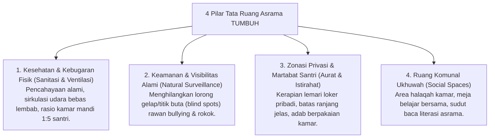

# P2-02-02-Prinsip-Desain-Arsitektur-Asrama-24-Jam

## Tujuan
Menetapkan standar arsitektur dan tata ruang fisik kehidupan asrama (*Dormitory Physical Setting*) untuk menciptakan lingkungan hidup 24 jam yang sehat, aman, meminimalkan potensi pelanggaran (*Hotspots Reduction*), dan mendukung pembentukan karakter beradab.

---

## 1. 4 Pilar Desain Tata Ruang Asrama Pesantren

---

## 2. Standar Fisik Ergonomis Asrama

1. **Rasio Kamar Mandi & Sanitasi (*Nazhafah Standard*)**:
   - Menghindari antrean panjang yang memicu perselisihan dan keterlambatan sholat: rasio ideal 1 kamar mandi untuk maksimal 5–6 santri.
   - Ventilasi pembuangan udara lancar dan sistem drainase anti-genangan.
2. **Eliminasi Titik Buta (*Crime Prevention Through Environmental Design - CPTED*)**:
   - Lorong asrama, tangga, dan area jemuran dirancang terbuka dengan pencahayaan terang minimal 150–200 lux di malam hari.
   - Menempatkan pos kamar Musyrif di titik strategis tengah (*hub visual*) lantai asrama.
3. **Kenyamanan Tidur & Pemulihan Energi (*Sleep Hygiene*)**:
   - Kasur dan ranjang yang kokoh, sirkulasi udara bersih untuk memastikan kualitas tidur santri mencapai fase *Deep Sleep* (mendukung konsolidasi hafalan Al-Qur'an).

---

## 3. Status Dokumen
* **Status**: 🌟 **A+ (Tervalidasi & Siap Diimplementasikan)**
* **Level**: Project 2 - `02 Principles / 02 Design Principles`
* **Langkah Berikutnya**: **`P2-02-03-Prinsip-Desain-SOP-dan-Alur-Kerja-Musyrif.md`**.
