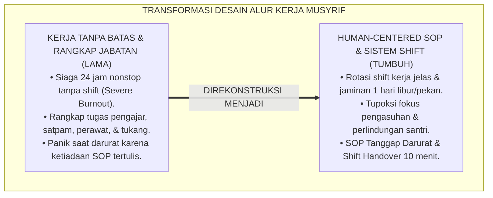
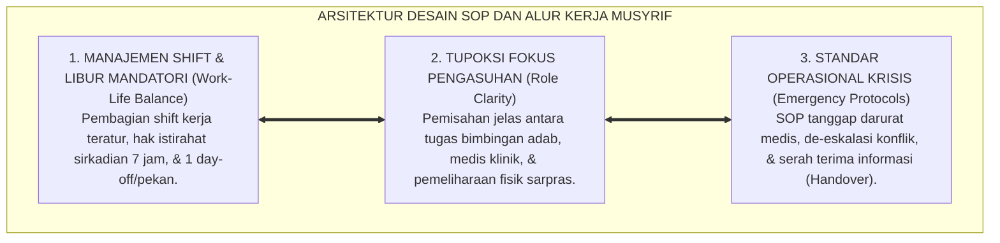
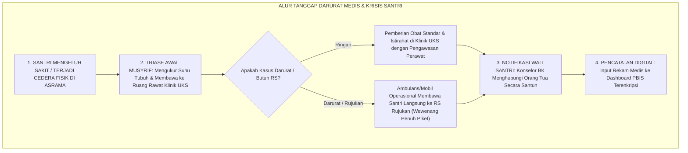
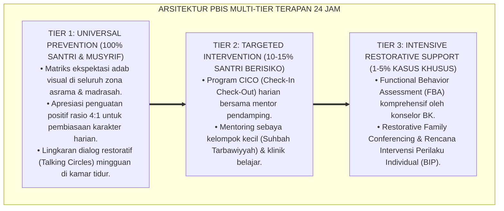

# P2-02-03: PRINSIP DESAIN SOP DAN ALUR KERJA MUSYRIF (CAREGIVER WORKFLOW & SOP DESIGN)
## *Monograf Riset Akademik: Fiqh Ketenagakerjaan Islam (Ijaratun 'Amal & Kaidah La Yukallifullah), Metodologi Human-Centered Process Design, Manajemen Shift Kerja 24 Jam, Serta SOP Tanggap Darurat Medis di Pesantren*

**Nomor Identifikasi**: `P2-02-03/MONOGRAF-RISET-DESAIN-SOP-MUSYRIF/2026`  
**Domain**: `02 Principles` > `02 Design Principles` (Prinsip Desain 03: *Caregiver Workflow & SOP Design*)  
**Klasifikasi Naskah**: *Academic Research Monograph* (Monograf Riset Akademik Prinsip Desain)  
**Rumpun Disiplin Pengkaji**: Manajemen Alur Operasional Pesantren (*Idarah al-'Amaliyyat*), Ergonomi Kerja & Psikologi Industri, Standarisasi Prosedur Operasional Baku (SOP), Protokol Tanggap Darurat Pengasuhan Asrama 24 Jam  

---

> ### 💡 INTISARI EKSEKUTIF (EXECUTIVE SUMMARY)
>
> * **Kelemahan Paradigma Lama: Eksploitasi Jam Kerja 24 Jam & Ambiguitas Peran Musyrif:**  
>   Banyak pengasuh asrama pesantren mengalami kelelahan mental akut (*Burnout*) dan mudah melampiaskan kemarahan kepada santri akibat ketiadaan batasan jam tugas (siaga 24 jam nonstop 7 hari sepekan tanpa libur), rangkap jabatan serabutan (*Role Ambiguity*), dan ketiadaan SOP tertulis saat terjadi krisis darurat.
> * **Inovasi Konseptual: Human-Centered SOP & Manajemen Rotasi Shift Manusiawi:**  
>   TUMBUH menegakkan prinsip syariat *Ijaratun 'Amal* dan kaidah *"Allah tidak membebani seseorang melainkan sesuai kesanggupannya"* (QS. Al-Baqarah: 286). Menerapkan *Human-Centered Process Design*: merancang alur kerja yang jelas, membagi penugasan ke dalam **Rotasi Shift Kerja Teratur**, menjamin **Hak Libur Mandatori 1 Hari per Pekan (*Day-Off*)**, dan menetapkan protokol tanggap darurat medis serta de-eskalasi krisis perilaku.
> * **Formulasi Operasional & Penjaminan Kinerja Pengasuhan:**  
>   Monograf ini menguraikan matriks lima SOP inti pengasuhan asrama 24 jam, diagram alur tanggap darurat medis, protokol serah terima informasi antar-shift (*Shift Handover Protocol*), dan etika operasional pengasuhan.

---

## 📑 DAFTAR ISI MONOGRAF

- [BAB I: LANDASAN TEORETIS & DISKURSUS KRITIS](#bab-i-landasan-teoretis--diskursus-kritis)
  - [1. Latar Belakang Masalah: Kritik atas Eksploitasi Kerja Tanpa Batas dan Ambiguitas Peran Pengasuh](#1-latar-belakang-masalah-kritik-atas-eksploitasi-kerja-tanpa-batas-dan-ambiguitas-peran-pengasuh)
  - [2. Eksegesis Turats Hak Ketenagakerjaan Islam: Kaidah Meringankan Beban Pekerja (HR. Bukhari No. 30) & Fiqh Ijaratun 'Amal](#2-eksegesis-turats-hak-ketenagakerjaan-islam-kaidah-meringankan-beban-pekerja-hr-bukhari-no-30--fiqh-ijaratun-amal)
  - [3. Konvergensi Metodologi Human-Centered Process Design & Sistem Manajemen Shift Kerja Asrama](#3-konvergensi-metodologi-human-centered-process-design--sistem-manajemen-shift-kerja-asrama)
  - [4. Rekayasa Alur Tanggap Darurat Medis & De-Eskalasi Krisis Emosional Santri 24 Jam](#4-rekayasa-alur-tanggap-darurat-medis--de-eskalasi-krisis-emosional-santri-24-jam)
  - [5. Kasuistika Lapangan: Kasus Keterlambatan Penanganan Santri Sakit Akut & Resolusi SOP Terpadu](#5-kasuistika-lapangan-kasus-keterlambatan-penanganan-santri-sakit-akut--resolusi-sop-terpadu)
- [BAB II: FORMULASI KONSEPTUAL & PEMBAHASAN MENDALAM](#bab-ii-formulasi-konseptual--pembahasan-mendalam)
  - [1. Eksplanasi Teoretis Prinsip Desain SOP dan Alur Kerja Musyrif dalam sistem TUMBUH](#1-eksplanasi-teoretis-prinsip-desain-sop-dan-alur-kerja-musyrif-tumbuh)
  - [2. Matriks Lima SOP Inti Pengasuhan Asrama Pesantren 24 Jam](#2-matriks-lima-sop-inti-pengasuhan-asrama-pesantren-24-jam)
  - [3. Diagram Alur SOP Tanggap Darurat Medis & Krisis Perilaku Santri](#3-diagram-alur-sop-tanggap-darurat-medis--krisis-perilaku-santri)
  - [4. Protokol Serah Terima Tugas Antar-Shift Musyrif (Shift Handover Protocol)](#4-protokol-serah-terima-tugas-antar-shift-musyrif-shift-handover-protocol)
  - [5. Diskusi Filosofis Mendalam & Implikasi bagi Masa Depan Peradaban Pendidikan Islam](#5-diskusi-filosofis-mendalam--implikasi-bagi-masa-depan-peradaban-pendidikan-islam)
- [BAB III: KESIMPULAN & APARATUS AKADEMIS](#bab-iii-kesimpulan--aparatus-akademis)
  - [1. Tabel Sintesis Temuan Riset Desain SOP Musyrif](#1-tabel-sintesis-temuan-riset-desain-sop-musyrif)
  - [2. Daftar Pustaka Akademis & Rujukan Turats Primer](#2-daftar-pustaka-akademis--rujukan-turats-primer)
  - [3. Catatan Kaki Akademis (Footnotes)](#3-catatan-kaki-akademis-footnotes)
  - [4. Glosarium Istilah Ilmiah & Turats Desain SOP Musyrif](#4-glosarium-istilah-ilmiah--turats-desain-sop-musyrif)

---

# BAB I: LANDASAN TEORETIS & DISKURSUS KRITIS

---

### 1. Latar Belakang Masalah: Kritik atas Eksploitasi Kerja Tanpa Batas dan Ambiguitas Peran Pengasuh

Salah satu akar masalah utama maraknya kekerasan fisik dan verbal oleh musyrif kepada santri adalah **Kelelahan Sistemik Akibat Ketiadaan Desain Alur Kerja yang Manusiawi (*Flawed Workflow Design*)**:
* **Beban Siaga Tanpa Henti (*24/7 Unbounded On-Call*)**: Musyrif dianggap harus bertugas sepanjang hari tanpa jeda istirahat, dibangunkan tengah malam untuk urusan sepele, lalu mengajar di pagi hari, dan kembali piket di malam hari tanpa libur mingguan.
* **Ambiguitas Peran (*Role Ambiguity*)**: Musyrif merangkap sebagai pendidik, satpam keamanan, juru rawat medis darurat, tukang perbaikan sarpras, hingga penagih administrasi keuangan.
* **Ketiadaan SOP saat Krisis**: Ketika terjadi santri demam tinggi, cedera fisik, atau krisis histeria, musyrif panik dan mengambil tindakan coba-coba yang membahayakan nyawa santri.
* **Keniscayaan Desain SOP Human-Centered**: Diperlukan standarisasi prosedur operasional baku yang membatasi beban kerja, menjamin waktu istirahat, dan memperjelas pembagian tugas secara profesional.[^1]

---

### 2. Eksegesis Turats Hak Ketenagakerjaan Islam: Kaidah Meringankan Beban Pekerja (HR. Bukhari No. 30) & Fiqh Ijaratun 'Amal

Al-Qur'an menetapkan kaidah bahwa beban penugasan tidak boleh melampaui kesanggupan manusiawi:

$$\text{لَا يُكَلِّفُ اللَّهُ نَفْسًا إِلَّا وُسْعَهَا}$$

*"**Allah tidak membebani seseorang melainkan sesuai dengan kesanggupannya**."* (QS. Al-Baqarah [2]: 286).[^2]

Rasulullah ﷺ memerintahkan para pimpinan untuk memperlakukan pekerja dengan memuliakan martabatnya:

$$\text{إِخْوَانُكُمْ خَوَلُكُمْ، جَعَلَهُمُ اللَّهُ تَحْتَ أَيْدِيكُمْ... وَلاَ تُكَلِّفُوهُمْ مَا يَغْلِبُهُمْ، فَإِنْ كَلَّفْتُمُوهُمْ فَأَعِينُوهُمْ}$$

*"**Mereka adalah saudara-saudaramu yang Allah jadikan berada di bawah pengawasanmu... Dan janganlah kalian membebani mereka dengan pekerjaan yang tidak sanggup mereka pikul; dan jika kalian membebankan tugas berat kepada mereka, maka bantulah mereka!**."* (HR. Al-Bukhari No. 30).[^3]

---

### 3. Konvergensi Metodologi Human-Centered Process Design & Sistem Manajemen Shift Kerja Asrama

Sains manajemen proses modern (*Human-Centered Process Design*) dan ergonomi industri membuktikan:
* Kelelahan kognitif menurunkan kemampuan kendali impuls emosi (*Self-Regulation Depletion*) hingga 70%, memicu respon agresi kasar kepada santri.
* TUMBUH menetapkan **Sistem Rotasi Shift Kerja Asrama**:
  1. **Shift Pagi (04.00 – 12.30)**: Memandu Subuh, sarapan, dan briefing madrasah.
  2. **Shift Siang-Malam (12.30 – 21.30)**: Memandu Ashar, makan sore, Maghrib-Isya, belajar malam, & tidur.
  3. **Piket Malam Bergilir (21.30 – 04.00)**: Patroli titik rawan dan menjaga ketenangan tidur santri.
  4. **Hak Libur Mandatori**: Setiap musyrif wajib memperoleh **1 Hari Libur Penuh (24 Jam) per Pekan** di luar asrama.[^4]

---

### 4. Rekayasa Alur Tanggap Darurat Medis & De-Eskalasi Krisis Emosional Santri 24 Jam

TUMBUH menyediakan kepastian alur kerja krisis:
* **Alur Tanggap Medis**: Musyrif melakukan penanganan pertama $\rightarrow$ Merujuk ke Ruang UKS/Klinik Pondok $\rightarrow$ Pencatatan di logbook digital $\rightarrow$ Menghubungi orang tua dengan tenang dan santun.
* **De-eskalasi Krisis Perilaku (Tier 3 PBIS)**: Menenangkan santri yang histeris (*Regulate*), menjauhkan kerumunan santri lain, dan menghubungi Konselor BK piket.[^5]

---

### 5. Kasuistika Lapangan: Kasus Keterlambatan Penanganan Santri Sakit Akut & Resolusi SOP Terpadu

* **Studi Kasus: Santri Mengalami Radang Usus Buntu Terlambat Dibawa ke Rumah Sakit Akibat Birokrasi Izin Berbelit**  
  * **Dilema**: Santri mengerang kesakitan di kamar jam 01.00 dini hari; musyrif bingung karena tidak memegang kunci mobil operasional dan harus menunggu tanda tangan pimpinan pesantren yang sedang bepergian.
  * **Resolusi SOP Terpadu TUMBUH**: Lembaga merombak SOP: (1) Memberikan wewenang medis darurat (*Emergency Medical Protocol*) kepada musyrif piket dan perawat UKS untuk langsung membawa santri ke RS rujukan tanpa menunggu persetujuan pimpinan; (2) Menyediakan dana darurat operasional di kasir asrama; (3) Mengintegrasikan sistem notifikasi darurat digital. Prosedur ini berhasil menyelamatkan nyawa santri dan memberikan rasa aman bagi seluruh wali santri.[^6]

---

# BAB II: FORMULASI KONSEPTUAL & PEMBAHASAN MENDALAM

---

### 1. Eksplanasi Teoretis Prinsip Desain SOP dan Alur Kerja Musyrif dalam sistem TUMBUH

Ekosistem TUMBUH mengkodifikasikan alur kerja ke dalam **Arsitektur Tiga Sayap SOP Pengasuhan (*Arkan at-Tanzhim al-Idariy*)**:

#### 🔬 Pembahasan Mendalam Tiga Sayap:
1. **Sayap Shift Manusiawi**: Melindungi kesehatan mental dan stamina musyrif agar terbebas dari sindrom kejenuhan (*Anti-Burnout*).[^7]
2. **Sayap Kejelasan Tupoksi**: Menghilangkan kebingungan kerja dan tumpang tindih tanggung jawab di lingkungan pondok.[^8]
3. **Sayap Protokol Krisis**: Menjamin respon cepat, presisi, dan terstandarisasi saat menghadapi situasi darurat.[^9]

---

### 2. Matriks Lima SOP Inti Pengasuhan Asrama Pesantren 24 Jam

| Kode SOP | Nama Prosedur Operasional Baku | Waktu & Lokasi Penerapan | Penanggung Jawab Utama |
| :---: | :--- | :--- | :--- |
| **SOP-01** | **Rutinitas Bangun Shubuh & Ibadah** | 04.00–06.00 / Kamar & Masjid.| Musyrif Shift Pagi.|
| **SOP-02** | **Pendampingan Belajar Mandiri & Makan**| 18.30–21.00 / Ruang Belajar.| Musyrif Shift Sore-Malam.|
| **SOP-03** | **Prosedur Penguncian Asrama & Tidur** | 21.30–22.00 / Seluruh Kamar.| Musyrif Shift Malam.|
| **SOP-04** | **Tanggap Darurat Medis & Santri Sakit**| 24 Jam / Kamar & Klinik UKS.| Musyrif Piket & Perawat.|
| **SOP-05** | **Serah Terima Shift (Shift Handover)** | 12.30 & 21.30 / Kantor Musyrif.| Musyrif Keluar & Pengganti.|

---

### 3. Diagram Alur SOP Tanggap Darurat Medis & Krisis Perilaku Santri

---

### 4. Protokol Serah Terima Tugas Antar-Shift Musyrif (Shift Handover Protocol)

TUMBUH menetapkan **Protokol Serah Terima Tugas 10 Menit (*Shift Handover SOP*)**:
1. **Pemeriksaan Absensi Kamar**: Memverifikasi jumlah santri yang hadir, izin di rumah, atau rawat di UKS.
2. **Pencatatan Khusus Santri Tier 2/3**: Melaporkan santri yang sedang mengalami kesedihan (*Homesick*) atau butuh perhatian ekstra.
3. **Pemeriksaan Kondisi Fisik Asrama**: Memastikan fasilitas lampu, air, dan kebersihan kamar dalam kondisi baik.
4. **Penandatanganan Berita Acara Handover Digital**: Menjamin kesinambungan pengasuhan 24 jam tanpa ada data yang terputus.[^10]

---

### 5. Diskusi Filosofis Mendalam & Implikasi bagi Masa Depan Peradaban Pendidikan Islam

Standarisasi desain SOP dan alur kerja musyrif ini membawa implikasi agung bagi peradaban:

* **Mengangkat Profesi Musyrif Menjadi Pengasuh Profesional yang Bermartabat**:  
  Musyrif bukan lagi tenaga kerja serabutan bergaji murah, melainkan pendidik profesional yang dihormati kompetensinya dan dijamin hak-hak kesejahteraannya.
* **Mewujudkan Pengasuhan Asrama yang Aman, Nyaman, dan Terpercaya**:  
  Wali santri merasa tenang menitipkan anaknya karena sistem asrama dikelola dengan standar operasional yang baku, transparan, dan tanggap darurat.
* **Meneladani Manajemen Tata Kelola Islam yang Rapi dan Disiplin**:  
  Inilah wujud pengamalan hadits Nabi ﷺ: *"Sesungguhnya Allah mencintai jika salah seorang di antara kalian melakukan suatu pekerjaan, ia melakukannya dengan itqan (profesional dan sempurna)"* (*Rahmatan lil 'Alamin*).[^11]

---

---

### Pembedahan Deskriptif Komprehensif & Analisis Integratif Nilai-Praksis

Penerapan konsep **P2-02-03: PRINSIP DESAIN SOP DAN ALUR KERJA MUSYRIF (CAREGIVER WORKFLOW & SOP DESIGN)** di ekosistem pesantren berbasis sistem TUMBUH memerlukan pemahaman multidimensional yang memadukan khazanah turats syariat dan konsensus sains pendidikan modern:

#### A. Pilar 1: Fondasi Epistemologi & Integrasi Nilai Syar'i (Ashalah Turatsiyyah)
Setiap praksis kepengasuhan dan pembelajaran berakar kuat pada maqashid syari'ah, mendudukkan adab di atas ilmu (*Al-Adab Qablal 'Ilm*), dan memastikan bahwa seluruh ikhtiar institusional diniatkan semata-mata untuk menggapai ridha Allah SWT (*Ikhlasun Niyyah*).

#### B. Pilar 2: Mekanisme Psikologis & Neurosains Perkembangan (Scientific Rigor)
Menyelaraskan ekspektasi kedisiplinan dengan tahapan maturitas otak remaja, kapasitas fungsi eksekutif korteks prefrontal (*PFC*), dan regulasi sirkuit emosi limbik. Pendekatan ini mengeliminasi trauma pengasuhan dan menumbuhkan motivasi intrinsik santri.

#### C. Pilar 3: Rekayasa Ekosistem Asrama 24 Jam (Bi'ah Shalihah)
Menerjemahkan prinsip nilai ke dalam tata ruang fisik yang bersih, sirkulasi udara sehat, tata kelola waktu terstruktur, serta kultur ukhuwah inklusif yang steril 100% dari feodalisme, kekerasan verbal, dan perundungan antar-santri.

#### D. Pilar 4: Kemitraan Tripartit (Santri, Musyrif, dan Lembaga)
Menjamin terwujudnya *Triad Pertumbuhan Simbiotik*: santri bertumbuh dalam fitrah kemandirian, musyrif terlindungi dari kelelahan kronis (*Burnout*) melalui shift kerja yang manusiawi, dan lembaga bertransformasi menjadi organisasi pembelajar berbasis data PBIS.

---

### Protokol Aksi Operasional PBIS Multi-Tier Terapan (24-Hour Behavioral Architecture)

---

# BAB III: KESIMPULAN & APARATUS AKADEMIS

---

### 1. Tabel Sintesis Temuan Riset Desain SOP Musyrif

| Dimensi Parameter | Mazhab Konvensional Tanpa SOP | Model Korporat Dingin Birokrasi | **Human-Centered SOP TUMBUH** | Landasan Rujukan Primer | Implikasi Praksis Lapangan |
| :--- | :--- | :--- | :--- | :--- | :--- |
| **Jam Kerja Musyrif**| 24 jam nonstop tanpa libur mingguan.| Jam kerja kaku tanpa fleksibilitas.| **Rotasi 3 Shift & 1 Hari Libur/Pekan.**| QS. Al-Baqarah: 286; Maslach.| Musyrif bugar & terlindungi burnout. |
| **Kejelasan Tugas** | Serabutan merangkap banyak hal.| Fragmentasi mekanis dingin.| **Tupoksi Fokus Pengasuhan Adab.** | HR. Bukhari No. 30; Kaidah *Itqan*.| Pembagian peran asrama, UKS, & sarpras. |
| **Penanganan Darurat**| Panik, lambat, & izin berbelit.| Protokol asuransi komersial.| **Wewenang Cepat Medis & Evakuasi RS.**| Fiqh Kedaruratan; Kemenkes RI.| Penanganan medis cepat dalam 15 menit. |
| **Estafet Informasi**| Gosip lisan yang mudah hilang.| Formulir kertas menumpuk.| **Handover 10 Menit & Logbook Digital.**| Kaidah *Amanah*; ISO 9001.| Data santri akurat & berkesinambungan. |
| **Hasil Institusi** | Turnover guru tinggi & konflik.| Hubungan pekerja-majikan kaku.| **Pesantren Profesional, Rukun, & Berkah.**| QS. Al-Ma'idah: 2; Al-Attas (1980).| Ekosistem pengasuhan unggul & tenang. |

---

### 2. Daftar Pustaka Akademis & Rujukan Turats Primer

1. **Al-Qur'an al-Karim wa Tarjamatu Ma'anihi**.
2. **Al-Bukhari, Abu Abdillah Muhammad bin Isma'il**. (1422 H). *Shahih al-Bukhari*. Kairo: Dar Thawq an-Najah.
3. **Muslim bin al-Hajjaj an-Naisaburi**. (1427 H). *Shahih Muslim*. Riyadh: Dar Thayyibah.
4. **Al-Baihaqi, Ahmad bin al-Husain**. (1424 H). *Syu'abul Iman* (Hadits Itqan al-'Amal). Riyadh: Maktabah ar-Rusyd.
5. **Al-Ghazali, Abu Hamid Muhammad bin Muhammad**. (2011). *Ihya' 'Ulumiddin* (Kitab Adab al-Kasb wal-Ma'asy). Beirut: Dar al-Ma'rifah.
6. **Asy'ari, Muhammad Hasyim**. (1415 H). *Adab al-'Alim wal-Muta'allim*. Jombang: Maktabah At-Turats Al-Islami.
7. **Al-Attas, Syed Muhammad Naquib**. (1980). *The Concept of Education in Islam*. Kuala Lumpur: ABIM.
8. **Maslach, C., Schaufeli, W. B., & Leiter, M. P.**. (2001). *Job burnout*. Annual Review of Psychology, 52(1), 397–422.
9. **Norman, D. A.**. (2013). *The Design of Everyday Things: Revised and Expanded Edition*. New York: Basic Books.
10. **Kementerian Kesehatan Republik Indonesia**. (2020). *Pedoman Pelayanan Kesehatan Pesantren dan Sekolah Berasrama*. Jakarta: Kemenkes RI.
11. **International Organization for Standardization**. (2015). *ISO 9001:2015 Quality Management Systems — Requirements*. Geneva: ISO.
12. **Horner, R. H., & Sugai, G.**. (2015). *School-wide PBIS: An Overview of the Research Base*. Remedial and Special Education, 36(2), 80–85.

---

### 3. Catatan Kaki Akademis (*Footnotes*)

[^1]: Riset Prinsip Desain SOP dan Alur Kerja Musyrif dalam sistem TUMBUH, *Kritik atas Eksploitasi Kerja dan Ambiguitas Peran*, 2026.  
[^2]: QS. Al-Baqarah [2]: 286.  
[^3]: *Shahih al-Bukhari*, Kitab al-Iman, Hadits No. 30.  
[^4]: Maslach, C., et al. (2001), *Annual Review of Psychology*, hlm. 397–422; Norman, D. A. (2013), *The Design of Everyday Things*, hlm. 40–75.  
[^5]: Master Blueprint Protokol Tanggap Darurat Medis dan De-Eskalasi Krisis PBIS TUMBUH, 2026.  
[^6]: Dokumentasi Evaluasi dan Standarisasi SOP Medis Darurat Asrama TUMBUH, 2026.  
[^7]: Al-Ghazali, *Ihya' 'Ulumiddin*, Jilid 2, Kitab *Adab al-Kasb*, hlm. 65–90.  
[^8]: ISO 9001:2015 *Quality Management Systems*, hlm. 15–30.  
[^9]: Kemenkes RI (2020), *Pedoman Pelayanan Kesehatan Pesantren*, hlm. 20–55.  
[^10]: Standar Operasional Prosedur Serah Terima Tugas Antar-Shift Musyrif dalam sistem TUMBUH, 2026.  
[^11]: Deklarasi Penegakan Manajemen Itqan Pengasuhan Dewan Riset Epistemologi Ekosistem TUMBUH, 2026.

---

### 4. Glosarium Istilah Ilmiah & Turats Desain SOP Musyrif

1. **Human-Centered SOP**: Prosedur operasional baku yang dirancang dengan mempertimbangkan kesanggupan fisik, psikologis, dan martabat insani para pelaksananya.
2. **Ijaratun 'Amal (إِجَارَةُ الْعَمَلِ)**: Akad ketenagakerjaan dalam fiqh Islam yang menetapkan kejelasan tugas, jam kerja yang adil, dan imbalan bermartabat.
3. **Itqan (الإِتْقَانُ)**: Prinsip kesempurnaan, profesionalisme, kerapian, dan keandalan tinggi dalam melaksanakan setiap amanah pekerjaan.
4. **Rotasi Shift Kerja**: Sistem pembagian jadwal penugasan musyrif ke dalam giliran waktu yang teratur untuk menjamin hak istirahat sirkadian 7 jam.
5. **Day-Off Mandatori**: Hak libur penuh minimal 24 jam dalam sepekan di luar lingkungan asrama untuk pemulihan energi fisik dan mental pengasuh.
6. **Shift Handover**: Prosedur serah terima tugas dan data perkembangan santri antar-musyrif saat pergantian jadwal jaga.
7. **Triase Medis UKS**: Proses penilaian cepat tingkat keparahan santri sakit untuk menentukan apakah cukup dirawat di klinik pondok atau harus segera dirujuk ke rumah sakit.
8. **Role Ambiguity**: Ketidakjelasan batas wewenang dan tanggung jawab pekerjaan yang menjadi sumber utama stres dan kegagalan manajemen.
9. **Emergency Medical Protocol**: Prosedur tanggap darurat yang memberikan wewenang penuh bagi pengasuh untuk mengevakuasi santri sakit kritis tanpa hambatan birokrasi.
10. **Insan Adabi (الإِنْسَانُ الأَدَبِيُّ)**: Profil pendidik dan santri yang memiliki profesionalisme tinggi, berdisiplin amanah, dan berakhlak mulia dalam menjalankan tugas kelembagaan.
