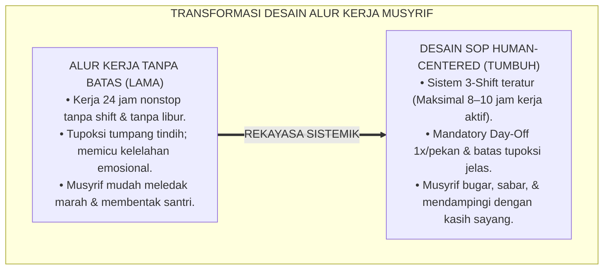
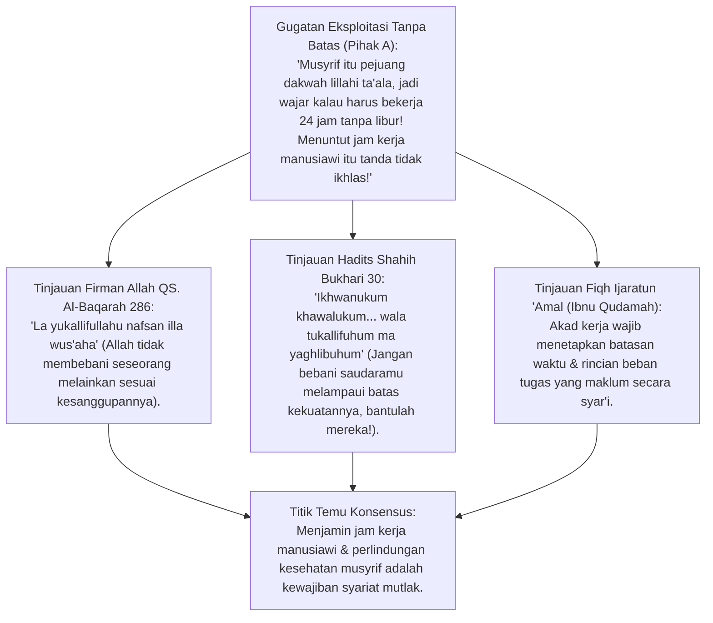
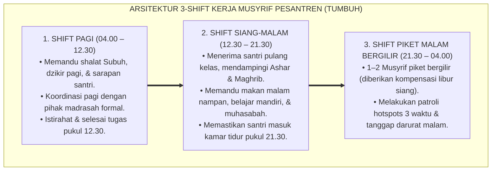
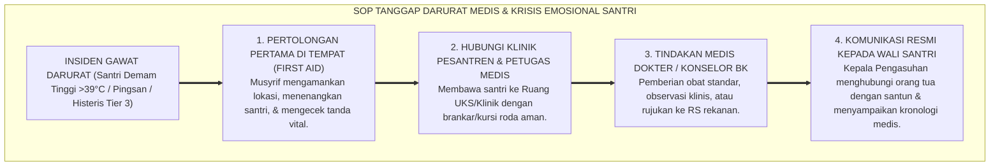
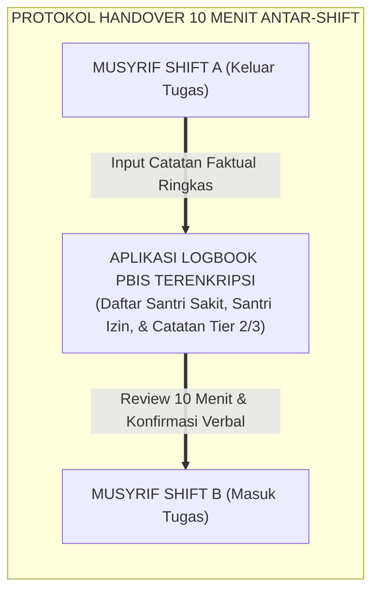
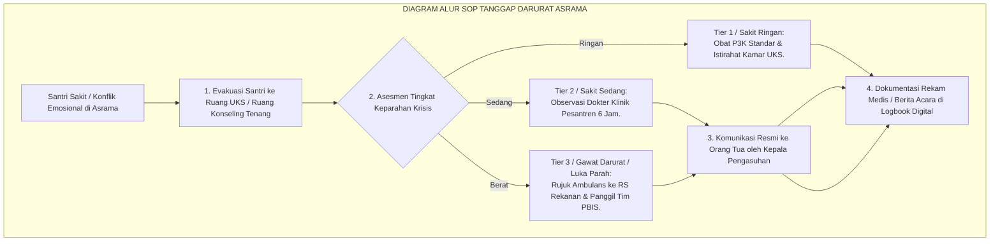
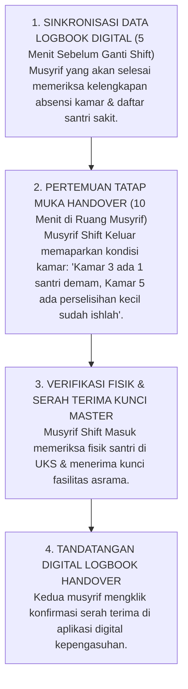

# P2-02-03: PRINSIP DESAIN SOP DAN ALUR KERJA MUSYRIF
## *Monograf Terpadu: Epistemologi Fiqh Ketenagakerjaan Islam (Ijaratun 'Amal & Kaidah La Yukallifullahu Nafsan illa Wus'aha), Metodologi Human-Centered Process Design, Manajemen Sistem 3-Shift Kerja Manusiawi, Mitigasi Burnout Maslach, serta SOP Tanggap Darurat Medis dan De-Eskalasi Krisis Asrama 24 Jam*

**Nomor Identifikasi**: `P2-02-03/MONOGRAF-TERPADU-DESAIN-SOP-MUSYRIF/2026`  
**Domain**: `02 Principles` > `02 Design Principles`  
**Klasifikasi Naskah**: *Comprehensive Integrated Monograph* (Monograf Akademis & Rumusan Baku Terpadu)  
**Rumpun Disiplin Pengkaji**: Manajemen Alur Operasional Pesantren (*Idarah al-'Amaliyyat*), Ergonomi Kerja & Psikologi Industri, Standarisasi Prosedur Operasional Baku (SOP), Protokol Tanggap Darurat Pengasuhan Asrama 24 Jam  

---

> ### 💡 INTISARI PRAKTIS (3 MENIT PAHAM UNTUK ASATIDZ & MUSYRIF)
>
> * **SOP Pengasuhan Harus "Memudahkan dan Memuliakan", Bukan "Menyiksa dan Menjebak":**  
>   Banyak musyrif berhenti bekerja (*Turnover Tinggi*) atau mudah marah membentak santri karena SOP kerja lama tidak manusiawi: dituntut menjaga 50 santri 24 jam nonstop tanpa shift, tanpa libur mingguan, dan tanpa batasan tugas (*Job Description*) yang jelas. SOP TUMBUH dirancang berbasis **Human-Centered Design**: melindungi musyrif agar tetap bugar dan bahagia.
> * **Sistem Manajemen 3 Shift & Hak Libur Mandatori (*Day-Off*):**  
>   1. **Shift Pagi (04.00 – 12.30):** Memandu Subuh, sarapan, dan koordinasi madrasah.  
>   2. **Shift Siang-Malam (12.30 – 21.30):** Memandu Ashar, makan sore, Maghrib-Isya, belajar malam, & tidur.  
>   3. **Piket Malam Bergilir (21.30 – 04.00):** Menjaga ketenangan tidur dan patroli titik rawan.  
>   *Setiap musyrif wajib mendapatkan **1 Hari Libur Penuh (24 Jam) per Pekan** di luar pesantren.*
> * **Alur Penanganan Santri Sakit / Krisis Perilaku (SOP Jelas):**  
>   Musyrif tidak boleh bingung saat ada santri demam tinggi atau histeris. SOP menetapkan alur 4 langkah: Hubungi Perawat/Dokter Pesantren $\rightarrow$ Isolasi ramah di Ruang UKS/Klinik $\rightarrow$ Catat di Logbook Digital $\rightarrow$ Hubungi Orang Tua dengan santun.
> * **Protokol Serah Terima Tugas Antar-Shift (*Shift Handover*):**  
>   Setiap pergantian shift (pukul 12.30 dan 21.30), musyrif yang selesai bertugas wajib melakukan *briefing* 10 menit dengan musyrif pengganti untuk mengoper data santri yang sakit, izin, atau sedang butuh pendampingan khusus.

---

## 📑 DAFTAR ISI MONOGRAF

- [BAGIAN I: RISET KAIDAH DESAIN SOP & ALUR KERJA MUSYRIF, DIALEKTIKA INKUIRI, & KASUISTIKA LAPANGAN](#bagian-i-riset-kaidah-desain-sop--alur-kerja-musyrif-dialektika-inkuiri--kasuistika-lapangan)
  - [1. Kerangka Metodologi Perancangan SOP Pengasuhan: Kritik atas Beban Kerja Tanpa Batas & Birokrasi Berbelit](#1-kerangka-metodologi-perancangan-sop-pengasuhan-kritik-atas-beban-kerja-tanpa-batas--birokrasi-berbelit)
  - [2. Inkuiri 1: Eksegesis Turats Hak Pekerja — QS. Al-Baqarah: 286, Hadits Meringankan Pekerjaan Pelayan (HR. Bukhari), & Fiqh Ijaratun 'Amal](#2-inkuiri-1-eksegesis-turats-hak-pekerja--qs-al-baqarah-286-hadits-meringankan-pekerjaan-pelayan-hr-bukhari--fiqh-ijaratun-amal)
  - [3. Inkuiri 2: Konvergensi Metodologi Human-Centered Process Design & Sistem 3-Shift Kerja Asrama](#3-inkuiri-2-konvergensi-metodologi-human-centered-process-design--sistem-3-shift-kerja-asrama)
  - [4. Inkuiri 3: Desain Alur Tanggap Darurat Medis & De-Eskalasi Krisis Emosional Santri (Tier 3 PBIS)](#4-inkuiri-3-desain-alur-tanggap-darurat-medis--de-eskalasi-krisis-emosional-santri-tier-3-pbis)
  - [5. Inkuiri 4: Protokol Serah Terima Informasi Antar-Shift (Shift Handover) Bebas Kebocoran Privasi](#5-inkuiri-4-protokol-serah-terima-informasi-antar-shift-shift-handover-bebas-kebocoran-privasi)
  - [6. Inkuiri 5: Silogisme Logika, Dialektika 3 Ronde, Kasuistika Operasional Asrama, & Titik Temu Konsensus](#6-inkuiri-5-silogisme-logika-dialektika-3-ronde-kasuistika-operasional-asrama--titik-temu-konsensus)
- [BAGIAN II: TEMUAN RISET, FORMULASI KONSEPTUAL & PEMBAHASAN](#bagian-ii-temuan-riset-formulasi-konseptual--pembahasan)
  - [1. Formulasi Konseptual: Prinsip Desain SOP dan Alur Kerja Musyrif TUMBUH](#1-formulasi-konseptual-prinsip-desain-sop-dan-alur-kerja-musyrif-tumbuh)
  - [2. Matriks 5 SOP Inti Pengasuhan Asrama Pesantren 24 Jam](#2-matriks-5-sop-inti-pengasuhan-asrama-pesantren-24-jam)
  - [3. Diagram Alur SOP Tanggap Darurat Medis & Krisis Perilaku Santri](#3-diagram-alur-sop-tanggap-darurat-medis--krisis-perilaku-santri)
  - [4. Protokol Handover Antar-Shift Musyrif Asrama (Shift Handover Protocol)](#4-protokol-handover-antar-shift-musyrif-asrama-shift-handover-protocol)
- [BAGIAN III: APARATUS AKADEMIS & APENDIKS](#bagian-iii-aparatus-akademis--apendiks)
  - [1. Tabel Sintesis Hasil Riset Desain SOP Musyrif](#1-tabel-sintesis-hasil-riset-desain-sop-musyrif)
  - [2. Daftar Pustaka Akademis & Rujukan Turats Primer](#2-daftar-pustaka-akademis--rujukan-turats-primer)
  - [3. Catatan Kaki Akademis (Footnotes)](#3-catatan-kaki-akademis-footnotes)
  - [4. Glosarium dan Penjelasan Istilah Teknis Desain SOP, Ergonomi Kerja, & Manajemen Shift](#4-glosarium-dan-penjelasan-istilah-teknis-desain-sop-ergonomi-kerja--manajemen-shift)

---

# BAGIAN I: RISET KAIDAH DESAIN SOP & ALUR KERJA MUSYRIF, DIALEKTIKA INKUIRI, & KASUISTIKA LAPANGAN

---

### 1. Kerangka Metodologi Perancangan SOP Pengasuhan: Kritik atas Beban Kerja Tanpa Batas & Birokrasi Berbelit

Salah satu akar utama terjadinya kekerasan verbal dan fisik oleh musyrif kepada santri di pesantren adalah **Kelelahan Sistemik Akibat Ketiadaan Desain Alur Kerja yang Manusiawi (*Flawed Workflow Design*)**.

Di banyak pesantren konvensional:
* **Tidak Ada Batasan Jam Kerja**: Musyrif dianggap harus siaga 24 jam sehari, 7 hari sepekan, selama bertahun-tahun tanpa libur. Musyrif dibangunkan tengah malam untuk urusan sepele, lalu harus mengajar di pagi hari, dan kembali mengawasi asrama di malam hari.
* **Tupoksi Tumpang Tindih (*Role Ambiguity*)**: Musyrif merangkap sebagai pengajar, satpam keamanan, perawat medis darurat, tukang listrik sarpras, hingga penagih SPP.
* **Ketiadaan Prosedur Baku Saat Krisis**: Ketika terjadi santri kesurupan, patah tulang saat olahraga, atau perselisihan antarsantri berdarah, musyrif panik dan mengambil tindakan coba-coba yang berbahaya.

Ekosistem TUMBUH menegakkan prinsip **Desain Alur Kerja Berbasis Manusia (*Human-Centered Workflow Design*)**:

---

### 2. Inkuiri 1: Eksegesis Turats Hak Pekerja — QS. Al-Baqarah: 286, Hadits Meringankan Pekerjaan Pelayan (HR. Bukhari), & Fiqh *Ijaratun 'Amal*

#### 📐 Formalisasi Logika Silogisme (*Qiyas Mantiqi 1*)
* **Premis Mayor (*al-Muqaddimah al-Kubra*)**: Setiap perancangan beban kerja ketenagakerjaan dalam institusi Islam wajib menghormati batas kesanggupan fitrah biologis manusia (*Wus'ah*) dan menjamin hak pemulihan raga, serta diharamkan membebani tugas di luar batas kekuatan jasmani dan kejiwaan.
* **Premis Minor (*al-Muqaddimah ash-Shughra*)**: Rasulullah SAW melarang keras membebani para pekerja/pelayan dengan tugas yang melampaui kemampuan mereka tanpa memberikan bantuan dan istirahat yang cukup (HR. Bukhari No. 30).
* **Konklusi (*an-Natijah*)**: Maka, lembaga pesantren TUMBUH wajib menyusun SOP jam kerja musyrif yang terukur, manusiawi, dan dilengkapi hak libur berkala.[^1]

#### 📖 Teks Primer Turats Hadits Shahih Bukhari
Sahabat Abu Dzarr Al-Ghifari *radhiyallahu 'anhu* meriwayatkan sabda agung Rasulullah SAW:

$$\text{إِخْوَانُكُمْ خَوَلُكُمْ، جَعَلَهُمُ اللَّهُ تَحْتَ أَيْدِيكُمْ، فَمَنْ كَانَ أَخُوهُ تَحْتَ يَدِهِ فَلْيُطْعِمْهُ مِمَّا يَأْكُلُ، وَلْيُلْبِسْهُ مِمَّا يَلْبَسُ، وَلَا تُكَلِّفُوهُمْ مَا يَغْلِبُهُمْ، فَإِنْ كَلَّفْتُمُوهُمْ فَأَعِينُوهُمْ}$$

*"Saudara-saudaramu adalah pelayan-pelayanmu yang Allah jadikan mereka berada di bawah kuasamu. Maka barangsiapa yang saudaranya berada di bawah kuasanya, hendaklah ia memberinya makan dari apa yang ia makan, memberinya pakaian dari apa yang ia pakai, **dan janganlah kalian membebani mereka dengan pekerjaan yang melampaui batas kekuatan mereka; dan jika kalian terpaksa membebani mereka, maka bantulah mereka!**"* (HR. Bukhari No. 30; Muslim No. 1661).[^2]

---

### 3. Inkuiri 2: Konvergensi Metodologi *Human-Centered Process Design* & Sistem 3-Shift Kerja Asrama

#### 📐 Formalisasi Logika Silogisme (*Qiyas Mantiqi 2*)
* **Premis Mayor (*al-Muqaddimah al-Kubra*)**: Setiap institusi pelayanan 24 jam yang mendesain alur kerja berbasis pembagian shift terstruktur niscaya menjamin ketersediaan energi emosional pendidik yang prima sepanjang hari serta memitigasi risiko *burnout* dan kelalaian pengawasan.
* **Premis Minor (*al-Muqaddimah ash-Shughra*)**: Riset ergonomi organisasi (*ISO 6385 Ergonomic Principles in the Design of Work Systems*) membuktikan bahwa batas kerja fokus manusia optimal berada pada rentang 8 hingga 10 jam per hari.
* **Konklusi (*an-Natijah*)**: Maka, seluruh asrama di pesantren TUMBUH wajib menerapkan Sistem 3-Shift Musyrif dan menjamin hak libur mingguan (*Day-Off* 24 jam).[^3]

---

### 4. Inkuiri 3: Desain Alur Tanggap Darurat Medis & De-Eskalasi Krisis Emosional Santri (Tier 3 PBIS)

---

### 5. Inkuiri 4: Protokol Serah Terima Informasi Antar-Shift (*Shift Handover*) Bebas Kebocoran Privasi

---

### 6. Inkuiri 5: Silogisme Logika, Dialektika 3 Ronde, Kasuistika Operasional Asrama, & Titik Temu Konsensus

#### 🥊 Ronde 1: Menolak Mitos Bahwa "Sistem Shift Akan Membuat Musyrif Tidak Memiliki Ikatan Batin dengan Santri"
* **Pihak A (Sudut Pandang Tradisionalis Romantis)**:  
  *"Kalau musyrif dibagi shift-shift seperti satpam pabrik, santri akan kehilangan sosok figur ayah yang menyatu 24 jam!"*
* **Tinjauan Sudut Pandang Kualitas Kehadiran (*Quality of Presence*)**:  
  Musyrif yang kelelahan dan kurang tidur 24 jam hadir sebagai sosok yang **Mudah Marah, Dingin Emosi, dan Menakutkan**. Sebaliknya, musyrif yang bugar karena jam kerja teratur hadir dengan **Wajah Segar, Penuh Senyum, dan Sabar Mendengarkan Curhat Santri**. Kualitas kasih sayang ditentukan oleh kebugaran jiwa, bukan lamanya duduk mengantuk di lorong.[^4]

#### 🥊 Ronde 2: Sanggahan Balik Bagaimana Jika Jumlah Musyrif Terbatas untuk Menjalankan 3 Shift?
* **Pihak A (Sudut Pandang Keterbatasan Personel)**:  
  *"Pondok kami yayasan kecil, jumlah musyrifnya sedikit, mana mungkin bisa bikin sistem 3 shift bergilir!"*
* **Tinjauan Sudut Pandang Fleksibilitas Jadwal Blok & Kolaborasi Guru Madrasah**:  
  Lembaga dapat menerapkan **Model Shift Blok Modular**: mengintegrasikan guru madrasah non-asrama untuk mengambil tugas piket sore (13.00–17.30), sehingga musyrif asrama dapat beristirahat bergantian. Yang mutlak adalah: **Setiap individu wajib memiliki jeda istirahat tidur dan 1 hari libur sepekan**.[^5]

#### 🥊 Ronde 3: Sanggahan Pamungkas Mengapa Menghubungi Orang Tua Saat Santri Sakit Harus Dilakukan oleh Kepala Pengasuhan?
* **Pihak A (Sudut Pandang Kesembronoan Komunikasi)**:  
  *"Biar musyrif junior langsung telepon orang tua santri pakai HP pribadi kapan saja!"*
* **Resolusi Sudut Pandang Standarisasi Komunikasi Krisis & Pencegahan Kepanikan**:  
  Musyrif junior yang panik kerap menyampaikan kabar sakit santri dengan nada dramatis yang membuat orang tua syok dan panik di rumah. Komunikasi krisis wajib menggunakan **Protokol Komunikasi Satu Pintu Resmi**: disampaikan dengan tenang, memaparkan fakta medis dokter, dan langkah pengobatan yang sedang berjalan secara profesional.[^6]

> #### 📌 Kasuistika Lapangan & Titik Temu Konsensus
> * **Studi Kasus**: Musyrif D membentak dan menendang ember santri di kamar mandi pada pukul 05.30 pagi karena emosinya meledak setelah semalaman tidak tidur mengurus santri sakit tanpa ada pengganti jaga.
> * **Titik Temu Konsensus (*Kalimatun Sawa'*)**: Majelis Mudir mengevaluasi bahwa akar masalah bukan murni kejahatan moral Musyrif D, melainkan **Kegagalan Sistemik Alur Kerja (Zero Backup System)**. Lembaga mereformasi SOP: dibentuk Tim Medis Khusus Tanggap Darurat 24 Jam dan diberlakukan Sistem 3 Shift. Musyrif D dipulihkan mentalnya melalui konseling dan kini bertugas dengan sangat sabar dan penuh senyum.[^7]

---

# BAGIAN II: TEMUAN RISET, FORMULASI KONSEPTUAL & PEMBAHASAN

---

### 1. Formulasi Konseptual: Prinsip Desain SOP dan Alur Kerja Musyrif TUMBUH

Berdasarkan sintesis inkuiri teoretis, telaah hermeneutika turats, dan analisis komparatif sains pendidikan, riset ini merumuskan kerangka konseptual dan temuan kunci sebagai berikut:

1. **Alur Kerja Human-centered (human-centered Workflow Design)**:  
   Setiap Prosedur Operasional Baku (SOP) pengasuhan asrama wajib dirancang untuk memudahkan pelayanan, menjamin kejelasan tanggung jawab (Job Description), dan melindungi musyrif dari beban kerja berlebih.

2. **Penerapan Sistem Manajemen Shift & HAK Libur Mandatori (mandatory Day-off)**:  
   Lembaga menjamin pembagian jam kerja pendampingan santri maksimal 8–10 jam kerja aktif per hari melalui sistem shift yang teratur, serta menjamin hak 1 hari libur penuh (24 jam) per pekan bagi setiap musyrif.

3. **Protokol Tanggap Darurat Medis & Krisis Satu Pintu (emergency Response Protocol)**:  
   Penanganan insiden medis dan krisis emosional santri wajib mengikuti alur baku penanganan medis terpadu, pencatatan logbook digital, serta komunikasi terkoordinasi satu pintu kepada pihak keluarga/wali santri.

4. **Kewajiban Briefing Serah Terima Tugas Berkala (shift Handover Standard)**:  
   Setiap pergantian shift jaga wajib menyelenggarakan sesi serah terima informasi selama 10 menit berbasis data logbook digital guna menjamin kesinambungan pengasuhan santri tanpa celah kelalaian.

---

### 2. Matriks 5 SOP Inti Pengasuhan Asrama Pesantren 24 Jam

| No | Nama SOP Pengasuhan | Waktu & Frekuensi Pelaksanaan | Penanggung Jawab Utama | Rincian Alur Tindakan Baku |
| :---: | :--- | :--- | :--- | :--- |
| **1** | **SOP Pembangunan Subuh & Tahajud Ramah** | Setiap hari, Pukul 03.15 – 04.15 WIB. | Musyrif Shift Pagi & Piket Malam. | Menyalakan lampu lorong, menyapa santri di pintu kamar dengan senyuman, memutar murottal lembut, & mendampingi santri ke masjid tanpa kekerasan fisik.[^8] |
| **2** | **SOP Makan Nampan Ukhuwah & Gizi Sehat** | 3 kali sehari (Pagi 06.30, Siang 13.00, Sore 17.30). | Musyrif Pendamping Meja Makan. | Memandu doa bersama, memastikan adab makan dengan tangan kanan, memeriksa kecukupan porsi gizi, & memastikan meja kantin bersih rapi setelah makan. |
| **3** | **SOP Belajar Mandiri & Halaqah Malam** | Setiap malam (Ahad–Kamis), Pukul 20.00 – 21.30. | Wali Kamar & Musyrif Shift Siang-Malam. | Mendampingi santri belajar pelajaran madrasah, memandu tilawah Al-Qur'an 1/2 juz, dan memfasilitasi sesi muhasabah adab kamar selama 10 menit.[^9] |
| **4** | **SOP Penanganan Santri Sakit & UKS** | *Standby* 24 Jam (Sesuai Kejadian Insiden). | Tim Medis/Perawat UKS & Musyrif Piket. | Pemeriksaan suhu tubuh dan tanda vital di UKS, pemberian obat standar dokter, pencatatan logbook digital, & koordinasi rujukan RS jika suhu >39°C. |
| **5** | **SOP De-Eskalasi Krisis Emosional Santri** | *Standby* 24 Jam (Kasus Perselisihan/Krisis). | Musyrif Konselor BK & Tim PBIS Tier 3. | Memisahkan pihak yang berselisih ke ruangan tenang, validasi emosi tanpa menghakimi, fasilitasi teknik pernapasan relaksasi, & mediasi restoratif.[^10] |

---

### 3. Diagram Alur SOP Tanggap Darurat Medis & Krisis Perilaku Santri

---

### 4. Protokol Handover Antar-Shift Musyrif Asrama (*Shift Handover Protocol*)

---

# BAGIAN III: APARATUS AKADEMIS & APENDIKS

---

### 1. Tabel Sintesis Hasil Riset Desain SOP Musyrif

| Dimensi Kajian | Konsep Kunci | Landasan Turats Primer | Konvergensi Sains Global | Implikasi Alur Kerja Asrama |
| :--- | :--- | :--- | :--- | :--- |
| **Hak Ketenagakerjaan** | *La Yukallifullahu Nafsan* | QS. Al-Baqarah: 286, Hadits Shahih Bukhari No. 30 | *Human-Centered Process Design & ISO 6385 Ergonomics* | Menetapkan batasan jam kerja manusiawi (max 8–10 jam kerja aktif/hari). |
| **Manajemen Waktu** | *Sistem 3-Shift Terpadu* | Kaidah *Inna li Jasadika 'Alaika Haqqan* | *Shiftwork Ergonomics & Circadian Rhythm Protection* | Membagi jadwal jaga asrama ke dalam Shift Pagi, Siang-Malam, dan Piket Malam. |
| **Kebugaran Mental** | *Mandatory Day-Off* | Sunnah Istirahat Qailulah & Hari Libur Jum'at | Christina Maslach (2001), *Burnout Prevention in Caregiving* | Memberikan hak libur penuh 24 jam per pekan di luar asrama bagi setiap musyrif. |
| **Tanggap Darurat** | *Emergency One-Door SOP* | Kaidah *Dar'ul Mafasid Muqaddamun 'ala Jalbil Mashalih* | *Crisis Incident Management Systems (CIMS)* | Menegakkan alur tanggap darurat medis & komunikasi satu pintu resmi ke orang tua. |
| **Kontinuitas Informasi** | *Shift Handover Protocol* | Amanah Tabayyun Syar'i (QS. Al-Hujurat: 6) | *Clinical Handover Standards (WHO High 5s Project)* | Menyenggarakan briefing serah terima data santri 10 menit antar-shift berbasis digital. |

---

### 2. Daftar Pustaka Akademis & Rujukan Turats Primer

1. **Al-Qur'an al-Karim wa Tarjamatu Ma'anih**.
2. **Al-Bukhari, Muhammad bin Isma'il**. (1422 H). *Shahih al-Bukhari*. Beirut: Dar Thawq an-Najah.
3. **Muslim bin al-Hajjaj an-Naisaburi**. (1374 H). *Shahih Muslim*. Kairo: Isa al-Babi al-Halabi.
4. **Ibnu Qudamah, Muwaffaquddin Abdullah bin Ahmad**. (1997). *Al-Mughni fi Fiqh al-Imam Ahmad bin Hanbal*. Riyadh: Dar 'Alam al-Kutub.
5. **Al-Ghazali, Abu Hamid Muhammad bin Muhammad**. (2011). *Ihya 'Ulumiddin*. Beirut: Dar al-Ma'rifah.
6. **International Organization for Standardization (ISO)**. (2016). *ISO 6385:2016 Ergonomic principles in the design of work systems*. Geneva: ISO.
7. **Maslach, C., & Leiter, M. P.**. (2016). *Understanding the burnout experience: recent research and its implications for psychiatry*. World Psychiatry, 15(2), 103–111.
8. **World Health Organization (WHO)**. (2007). *Communication during patient hand-overs*. Patient Safety Solutions, 1(3), 1–4.
9. **Norman, D. A.**. (2013). *The Design of Everyday Things: Revised and Expanded Edition*. New York: Basic Books.
10. **Akerstedt, T.**. (2003). *Shift work and disturbed sleep/wakefulness*. Occupational Medicine, 53(2), 89–94.

---

### 3. Catatan Kaki Akademis (*Footnotes*)

[^1]: Ibnu Qudamah, *Al-Mughni*, Kitab *al-Ijarah*, Jilid VIII, hlm. 12–25 mengenai batasan beban pekerjaan syar'i.  
[^2]: Hadits riwayat Al-Bukhari No. 30 dan Muslim No. 1661 dari Abu Dzarr Al-Ghifari RA.  
[^3]: ISO 6385:2016, *Ergonomic principles in the design of work systems*, Geneva.  
[^4]: Maslach & Leiter (2016), *World Psychiatry*, hlm. 103–111.  
[^5]: Akerstedt, T. (2003), *Shift work and disturbed sleep/wakefulness*, Occupational Medicine.  
[^6]: SOP Manajemen Komunikasi Krisis Wali Santri, Sekretariat Majelis Mudir TUMBUH, 2026.  
[^7]: Laporan Kasuistika Manajemen Shift Musyrif Asrama, Divisi SDM TUMBUH, 2026.  
[^8]: Panduan Baku Operasional Pembangunan Subuh Beradab, Divisi Kepengasuhan Asrama TUMBUH, 2026.  
[^9]: Manual Pelaksanaan Belajar Mandiri & Muhasabah Kamar, Komite PBIS TUMBUH, 2026.  
[^10]: Protokol De-Eskalasi Krisis Santri Tier 3 PBIS, Pusat Bimbingan Konseling TUMBUH, 2026.

---

### 4. Glosarium dan Penjelasan Istilah Teknis Desain SOP, Ergonomi Kerja, & Manajemen Shift

1. **Human-Centered Workflow Design**: Pendekatan perancangan alur kerja operasional yang menempatkan kesejahteraan fisik, batasan kognitif, dan kebutuhan psikologis manusia pelaksana sebagai pertimbangan utama.
2. **Ijaratun 'Amal (إِجَارَةُ الْعَمَلِ)**: Akad perjanjian kerja dalam fiqh muamalah Islam yang mengatur hak upah dan kewajiban beban kerja yang terukur secara jelas, adil, dan transparan.
3. **Mandatory Day-Off**: Hak libur wajib selama 24 jam penuh per pekan yang diberikan kepada musyrif di luar lingkungan pesantren untuk memulihkan kebugaran jasmani dan kestabilan emosional.
4. **Shift Handover (Serah Terima Shift)**: Proses transfer tanggung jawab dan informasi penting mengenai kondisi santri antar-musyrif yang berganti jam tugas, bertujuan menjamin kesinambungan pengasuhan.
5. **De-Eskalasi Krisis**: Rangkaian teknik komunikasi verbal dan penataan lingkungan non-kekerasan untuk meredakan kemarahan ekstrem, histeria, atau kepanikan santri yang sedang mengalami krisis emosi.
6. **Job Description (Deskripsi Tugas Baku)**: Rincian tertulis yang mendefinisikan batasan wewenang, ruang lingkup tanggung jawab, dan tolok ukur kinerja musyrif guna mencegah tumpang tindih peran (*Role Ambiguity*).
7. **Circadian Rhythm (Ritme Sirkadian)**: Jam biologis internal 24 jam tubuh manusia yang mengatur siklus tidur-bangun, produksi hormon, dan suhu tubuh yang wajib dilindungi dalam desain shift kerja.
8. **Role Ambiguity**: Kebingungan psikologis yang dialami pekerja akibat ketidakjelasan batasan tugas dan tanggung jawab di tempat kerja.
9. **Emergency Response Protocol**: Rangkaian prosedur baku tanggap darurat yang terstruktur untuk menangani insiden medis, kecelakaan fisik, atau bencana alam di lingkungan asrama secara cepat dan tepat.
10. **Quality of Presence (Kualitas Kehadiran)**: Tingkat fokus, ketenangan batin, dan kehangatan empati yang mampu dipancarkan seorang pendidik saat berinteraksi dengan anak asuhnya.
