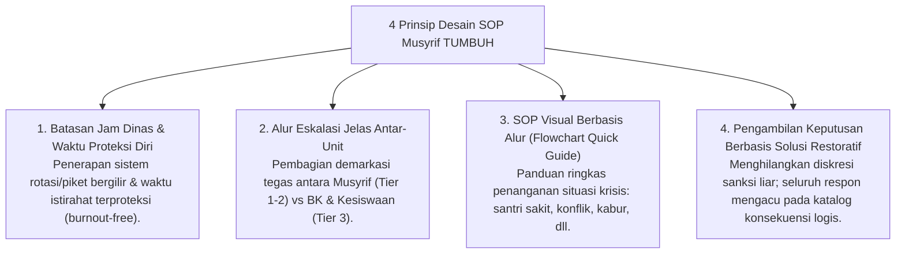
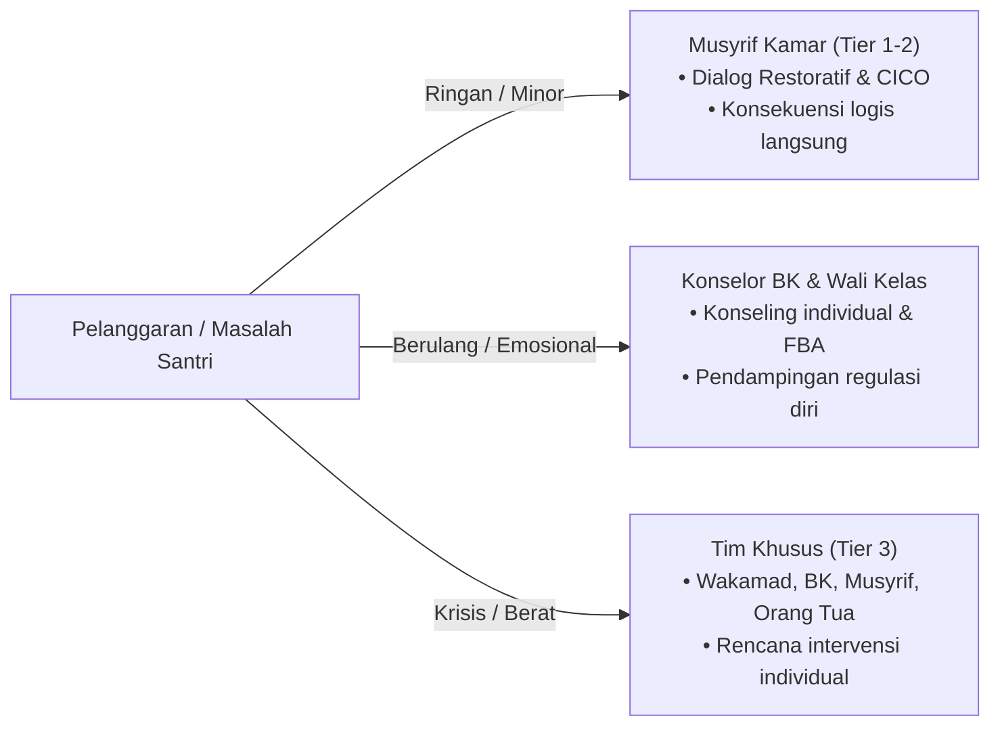

# P2-02-03-Prinsip-Desain-SOP-dan-Alur-Kerja-Musyrif

## Tujuan
Menetapkan prinsip perancangan Standar Operasional Prosedur (SOP) pengasuhan dan alur kerja musyrif yang ramping (*lean*), jelas batas tanggung jawabnya, bebas tumpang tindih antar unit, dan melindungi musyrif dari kejenuhan mental (*burnout*).

---

## 1. Patologi SOP Lama di Pesantren

1. **Beban Kerja Tanpa Batas (*Unbounded 24-Hour Duty*)**: Musyrif dianggap harus siaga 24 jam nonstop tanpa shift atau waktu istirahat yang terproteksi, memicu penurunan stabilitas emosi saat mengasuh santri.
2. **Tumpang Tindih Peran (*Role Ambiguity*)**: Musyrif sering merangkap menjadi satpam penegak sanksi, bendahara asrama, konselor krisis, hingga tukang sapu fasilitas.
3. **Dokumentasi Manual yang Melelahkan**: Menghabiskan waktu berjam-jam menulis laporan kertas yang tidak pernah dianalisis menjadi keputusan perbaikan.

---

## 2. 4 Prinsip Desain SOP Pengasuhan Modern TUMBUH

---

## 3. Matriks Alur Eskalasi Kasus Santri

---

## 4. Status Dokumen
* **Status**: 🌟 **A+ (Tervalidasi & Siap Diimplementasikan)**
* **Level**: Project 2 - `02 Principles / 02 Design Principles`
* **Langkah Berikutnya**: **`P2-02-04-Prinsip-Desain-Antarmuka-dan-Dashboard-Digital.md`**.
