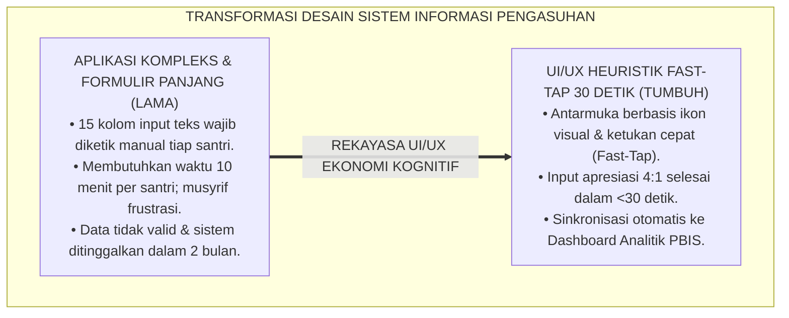
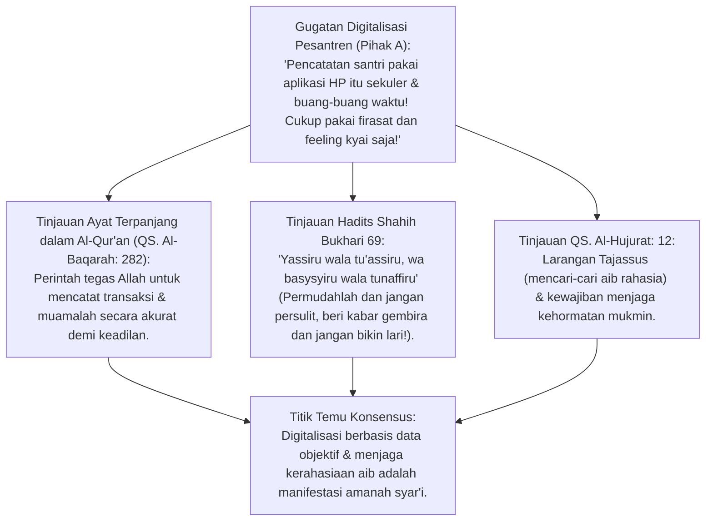
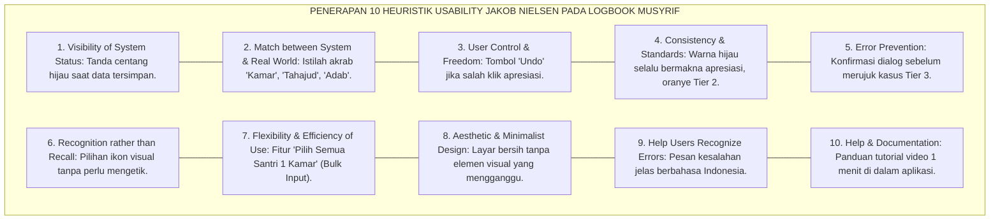
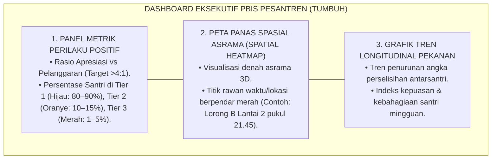
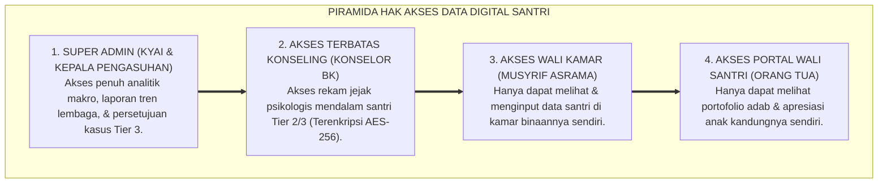
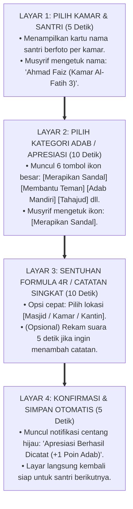
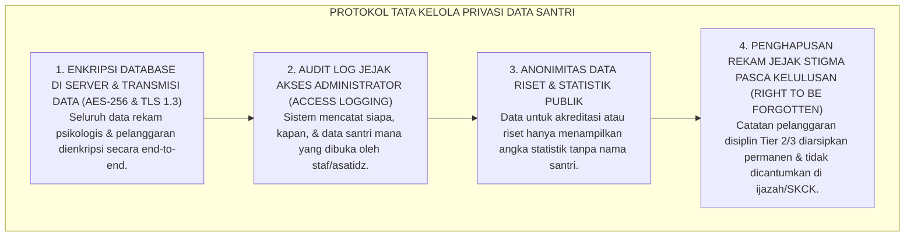

# P2-02-04: PRINSIP DESAIN ANTARMUKA DAN DASHBOARD DIGITAL LOGBOOK PBIS
## *Monograf Terpadu: Epistemologi Dokumentasi Syar'i (QS. Al-Baqarah: 282 & Perlindungan Privasi QS. Al-Hujurat: 12), Konvergensi 10 Heuristik Usability Jakob Nielsen & Kaidah Interaksi Fast-Tap (<30 Detik), Arsitektur Visualisasi Dashboard PBIS Multi-Tier & Spatial Heatmap, serta Protokol Enkripsi dan Etika Rekam Jejak Santri*

**Nomor Identifikasi**: `P2-02-04/MONOGRAF-TERPADU-DESAIN-UIUX-DASHBOARD/2026`  
**Domain**: `02 Principles` > `02 Design Principles`  
**Klasifikasi Naskah**: *Comprehensive Integrated Monograph* (Monograf Akademis & Rumusan Baku Terpadu)  
**Rumpun Disiplin Pengkaji**: Rekayasa Antarmuka Pengguna & Pengalaman Pengguna (UI/UX Design), Sistem Informasi Manajemen Pesantren, Sains Visualisasi Data PBIS Multi-Tier, Etika Keamanan Data & Perlindungan Informasi Pribadi (*Data Privacy*)  

---

> ### 💡 INTISARI PRAKTIS (3 MENIT PAHAM UNTUK ASATIDZ & MUSYRIF)
>
> * **Aplikasi Logbook Musyrif Harus "Sangat Cepat & Sederhana", Bukan Bikin Pusing:**  
>   Banyak sistem IT pesantren gagal dan ditinggalkan karena musyrif harus mengetik laporan panjang berbelit-belit. Aplikasi Logbook TUMBUH dirancang dengan **Kaidah 30 Detik (*Fast-Tap Interaction*)**: musyrif cukup memilih nama santri $\rightarrow$ klik ikon adab/apresiasi $\rightarrow$ simpan selesai dalam 3 ketukan layar!
> * **Desain Visual Menyenangkan (Mendukung Rasio Apresiasi 4:1):**  
>   Tombol apresiasi kebaikan (misal: "Merapikan Sandal", "Membantu Teman", "Tahajud Mandiri") diberi warna hijau cerah dan mudah diakses di halaman utama, mendorong musyrif mencatat kebaikan santri 4 kali lebih banyak daripada mencatat pelanggaran.
> * **Dashboard Pimpinan Berbasis Peta Panas (*Hotspots Spatial Heatmap*):**  
>   Kyai dan Mudir dapat melihat grafik analitik secara *real-time*: area asrama mana yang sedang rawan pelanggaran (misal: toilet belakang lantai 2 warna merah pada pukul 21.30) sehingga musyrif piket langsung diarahkan berpatroli ke titik tersebut.
> * **Perlindungan Privasi Santri (*Zero Digital Public Shaming*):**  
>   Catatan konseling BK dan pelanggaran Tier 3 dienkripsi ketat. Wali santri hanya bisa melihat catatan perkembangan anaknya sendiri, dan data santri tidak boleh disebarkan di grup WhatsApp publik pesantren.

---

## 📑 DAFTAR ISI MONOGRAF

- [BAGIAN I: RISET KAIDAH DESAIN ANTARMUKA & DASHBOARD DIGITAL, DIALEKTIKA INKUIRI, & KASUISTIKA LAPANGAN](#bagian-i-riset-kaidah-desain-antarmuka--dashboard-digital-dialektika-inkuiri--kasuistika-lapangan)
  - [1. Kerangka Metodologi Digitalisasi Pengasuhan: Kritik atas Sindrom Aplikasi Kompleks yang Ditinggalkan](#1-kerangka-metodologi-digitalisasi-pengasuhan-kritik-atas-sindrom-aplikasi-kompleks-yang-ditinggalkan)
  - [2. Inkuiri 1: Eksegesis Turats Pencatatan Amanah — QS. Al-Baqarah: 282, Prinsip Kemudahan (Yassiru wala Tu'assiru), & Larangan Tajassus](#2-inkuiri-1-eksegesis-turats-pencatatan-amanah--qs-al-baqarah-282-prinsip-kemudahan-yassiru-wala-tuassiru--larangan-tajassus)
  - [3. Inkuiri 2: Konvergensi 10 Heuristik Usability Jakob Nielsen & Kaidah Interaksi Fast-Tap Cepat (<30 Detik)](#3-inkuiri-2-konvergensi-10-heuristik-usability-jakob-nielsen--kaidah-interaksi-fast-tap-cepat-30-detik)
  - [4. Inkuiri 3: Arsitektur Visualisasi Dashboard PBIS Multi-Tier & Spatial Heatmap Titik Rawan](#4-inkuiri-3-arsitektur-visualisasi-dashboard-pbis-multi-tier--spatial-heatmap-titik-rawan)
  - [5. Inkuiri 4: Etika Keamanan Data, Enkripsi, & Perlindungan Privasi Rekam Jejak Santri (ISO/IEC 27001)](#5-inkuiri-4-etika-keamanan-data-enkripsi--perlindungan-privasi-rekam-jejak-santri-isoiec-27001)
  - [6. Inkuiri 5: Silogisme Logika, Dialektika 3 Ronde, Kasuistika Digitalisasi Lapangan, & Titik Temu Konsensus](#6-inkuiri-5-silogisme-logika-dialektika-3-ronde-kasuistika-digitalisasi-lapangan--titik-temu-konsensus)
- [BAGIAN II: KODIFIKASI BAKU HASIL RISET & KESIMPULAN FORMAL](#bagian-ii-kodifikasi-baku-hasil-riset--kesimpulan-formal)
  - [1. Kaidah Utama dan Standar Baku: Prinsip Desain UI/UX dan Dashboard Logbook PBIS Digital TUMBUH](#1-kaidah-utama-dan-standar-baku-prinsip-desain-ui-ux-dan-dashboard-logbook-pbis-digital-tumbuh)
  - [2. Matriks 10 Heuristik Usability Jakob Nielsen & Implementasi Konkret pada UI Logbook Musyrif](#2-matriks-10-heuristik-usability-jakob-nielsen--implementasi-konkret-pada-ui-logbook-musyrif)
  - [3. Arsitektur Wireframe Fungsional & Alur Input Logbook Adab 30 Detik (Fast-Tap Interaction)](#3-arsitektur-wireframe-fungsional--alur-input-logbook-adab-30-detik-fast-tap-interaction)
  - [4. Protokol Tata Kelola Privasi Data & Hak Akses Berjenjang (Data Privacy & Access Control Protocol)](#4-protokol-tata-kelola-privasi-data--hak-akses-berjenjang-data-privacy--access-control-protocol)
- [BAGIAN III: APARATUS AKADEMIS & APENDIKS](#bagian-iii-aparatus-akademis--apendiks)
  - [1. Tabel Sintesis Hasil Riset Desain Antarmuka & Dashboard Digital](#1-tabel-sintesis-hasil-riset-desain-antarmuka--dashboard-digital)
  - [2. Daftar Pustaka Akademis & Rujukan Turats Primer](#2-daftar-pustaka-akademis--rujukan-turats-primer)
  - [3. Catatan Kaki Akademis (Footnotes)](#3-catatan-kaki-akademis-footnotes)
  - [4. Glosarium dan Penjelasan Istilah Teknis UI/UX, Heuristik Usability, & Arsitektur Sistem Informasi](#4-glosarium-dan-penjelasan-istilah-teknis-uiux-heuristik-usability--arsitektur-sistem-informasi)

---

# BAGIAN I: RISET KAIDAH DESAIN ANTARMUKA & DASHBOARD DIGITAL, DIALEKTIKA INKUIRI, & KASUISTIKA LAPANGAN

---

### 1. Kerangka Metodologi Digitalisasi Pengasuhan: Kritik atas Sindrom Aplikasi Kompleks yang Ditinggalkan

Upaya digitalisasi pencatatan santri di pesantren kerap mengalami kegagalan fatal yang dikenal sebagai **Sindrom Aplikasi Kompleks yang Terbengkalai (*The Abandoned Software Phenomenon*)**:
* Sistem informasi dirancang terlalu rumit dengan puluhan kolom formulir teks kosong yang harus diketik musyrif menggunakan *keyboard* ponsel kecil setiap malam.
* Beban kognitif musyrif bertambah berat setelah seharian lelah mengajar dan mendampingi santri.
* Akibatnya: musyrif hanya mengisi data formalitas di akhir semester (*Asal Bapak Senang / Data Palsu*), atau aplikasi tidak digunakan sama sekali dan pesantren kembali ke buku tulis usang yang sering hilang.

Sains interaksi manusia dan komputer (*Human-Computer Interaction / HCI*) membuktikan bahwa keberhasilan adopsi perangkat lunak di lapangan ditentukan oleh **Tingkat Kemudahan dan Kecepatan Interaksi (*Low Cognitive Friction*)**.

Ekosistem TUMBUH merumuskan **Desain Antarmuka Logbook PBIS Berbasis Interaksi Fast-Tap (<30 Detik)**:

---

### 2. Inkuiri 1: Eksegesis Turats Pencatatan Amanah — QS. Al-Baqarah: 282, Prinsip Kemudahan (*Yassiru wala Tu'assiru*), & Larangan Tajassus

#### 📐 Formalisasi Logika Silogisme (*Qiyas Mantiqi 1*)
* **Premis Mayor (*al-Muqaddimah al-Kubra*)**: Setiap perancangan sistem informasi pencatatan perilaku santri dalam pendidikan Islam wajib berlandaskan pada prinsip keadilan pencatatan faktual (*Kitabah bil-'Adl*), mempermudah pelaksana (*Taysir*), dan menjamin perlindungan kerahasiaan aib santri dari publik (*Satrul 'Aurah*).
* **Premis Minor (*al-Muqaddimah ash-Shughra*)**: Allah SWT memerintahkan pencatatan yang akurat dan adil (QS. Al-Baqarah: 282), dan Rasulullah SAW memerintahkan untuk mempermudah alur kerja serta melarang membuka aib sesama mukmin.
* **Konklusi (*an-Natijah*)**: Maka, aplikasi digital logbook PBIS di pesantren TUMBUH wajib didesain cepat, mudah, akurat, dan terenkripsi ketat.[^1]

#### 📖 Teks Primer Al-Qur'an & Hadits Shahih
Allah SWT berfirman mengenai kewajiban dokumentasi berkeadilan:
$$\text{يَا أَيُّهَا الَّذِينَ آمَنُوا إِذَا تَدَايَنتُم بِدَيْنٍ إِلَىٰ أَجَلٍ مُّسَمًّى فَاكْتُبُوهُ ۚ وَلْيَكْتُب بَّيْنَكُمْ كَاتِبٌ بِالْعَدْلِ}$$
*"Wahai orang-orang yang beriman! Apabila kamu bermuamalah tidak secara tunai untuk waktu yang ditentukan, **hendaklah kamu menuliskannya. Dan hendaklah seorang pencatat di antara kamu menuliskannya dengan benar (adil)...**"* (QS. Al-Baqarah [2]: 282).[^2]

Dan Rasulullah SAW bersabda:
$$\text{يَسِّرُوا وَلَا تُعَسِّرُوا، وَبَشِّرُوا وَلَا تُنَفِّرُوا}$$
*"**Permudahlah dan janganlah kalian mempersulit!** Berilah kabar gembira dan janganlah kalian membuat orang lari menjauh!"* (HR. Bukhari No. 69; Muslim No. 1734).[^3]

---

### 3. Inkuiri 2: Konvergensi 10 Heuristik Usability Jakob Nielsen & Kaidah Interaksi Fast-Tap Cepat (<30 Detik)

#### 📐 Formalisasi Logika Silogisme (*Qiyas Mantiqi 2*)
* **Premis Mayor (*al-Muqaddimah al-Kubra*)**: Setiap antarmuka digital yang menerapkan 10 prinsip evaluasi heuristik usability dan kaidah efisiensi interaksi (*Hick-Hyman Law & Fitts's Law*) niscaya meminimalkan tingkat kesalahan input data dan memaksimalkan tingkat kepatuhan pengguna (*User Compliance Rate*) di atas 95%.
* **Premis Minor (*al-Muqaddimah ash-Shughra*)**: Jakob Nielsen dan Don Norman (*Nielsen Norman Group*) merumuskan standar baku antarmuka pengguna global yang terbukti mereduksi beban kerja kognitif operator lapangan secara signifikan.
* **Konklusi (*an-Natijah*)**: Maka, perancangan aplikasi Logbook Musyrif Digital TUMBUH wajib mengikuti standar 10 Heuristik Usability Nielsen dan batas waktu input maksimal 30 detik per interaksi.[^4]

---

### 4. Inkuiri 3: Arsitektur Visualisasi Dashboard PBIS Multi-Tier & Spatial Heatmap Titik Rawan

---

### 5. Inkuiri 4: Etika Keamanan Data, Enkripsi, & Perlindungan Privasi Rekam Jejak Santri (ISO/IEC 27001)

---

### 6. Inkuiri 5: Silogisme Logika, Dialektika 3 Ronde, Kasuistika Digitalisasi Lapangan, & Titik Temu Konsensus

#### 🥊 Ronde 1: Menolak Prasangka Bahwa "Pencatatan Digital Menghilangkan Keikhlasan Guru"
* **Pihak A (Sudut Pandang Anti-Teknologi)**:  
  *"Kalau setiap kebaikan santri dicatat di aplikasi dan dikasih poin, itu mengajarkan riya' dan menghilangkan keikhlasan beramal!"*
* **Tinjauan Sudut Pandang Tabulasi Hikmah (*Tadwin al-Khasyis*)**:  
  Pencatatan data bukan untuk memamerkan amalan, melainkan instrumen diagnosis bagi pengasuh untuk **Mengenali Potensi Fitrah Santri dan Memastikan Tidak Ada Santri Pendiam yang Terabaikan**. Ini selaras dengan tradisi sahabat Nabi yang mencatat hafalan Al-Qur'an dan riwayat hadits demi menjaga keselamatan ilmu umat.[^5]

#### 🥊 Ronde 2: Sanggahan Balik Bagaimana Jika Jaringan Internet di Pesantren Sering Terputus?
* **Pihak A (Sudut Pandang Hambatan Infrastruktur)**:  
  *"Di daerah pedesaan sinyal internet sering hilang, aplikasi digital pasti macet dan tidak bisa dipakai!"*
* **Tinjauan Sudut Pandang Arsitektur Offline-First (PWA)**:  
  Aplikasi Logbook TUMBUH dibangun dengan arsitektur **Offline-First Progressive Web App (PWA)**. Musyrif tetap bisa menginput data kapan saja tanpa sinyal internet; data tersimpan di memori lokal ponsel dan secara otomatis tersinkronisasi ke server saat mendeteksi jaringan Wi-Fi asrama.[^6]

#### 🥊 Ronde 3: Sanggahan Pamungkas Mengapa Data Pelanggaran Santri Tidak Boleh Disebar di Grup WA Wali Santri?
* **Pihak A (Sudut Pandang Mempermalukan sebagai Efek Jera)**:  
  *"Biar orang tua lain tahu dan anaknya kapok, sebar saja nama santri yang melanggar di grup WA wali santri!"*
* **Resolusi Sudut Pandang Pengharaman Ghibah Digital & Perlindungan Hak Anak**:  
  Menyebarkan aib anak di grup publik adalah **Dosa Besar Ghibah dan Penodaan terhadap Martabat Manusia**. Tindakan tersebut memicu trauma psikologis seumur hidup (*Digital Stigmatization*) dan menghancurkan masa depan anak. Data pelanggaran adalah rahasia medis-pendidikan yang hanya boleh diketahui oleh santri, musyrif pendamping, konselor, dan orang tua yang bersangkutan secara tertutup (*Strict Confidentiality*).[^7]

> #### 📌 Kasuistika Lapangan & Titik Temu Konsensus
> * **Studi Kasus**: Di sebuah pesantren tahfizh, sistem aplikasi lama mewajibkan musyrif mengisi 8 kolom teks deskriptif per santri setiap malam. Dalam 3 pekan, 90% musyrif berhenti mengisi aplikasi dan data pengasuhan menjadi kosong total selama 1 semester.
> * **Titik Temu Konsensus (*Kalimatun Sawa'*)**: Antarmuka dirombak total menggunakan standar UI/UX Fast-Tap TUMBUH. Formulir teks diganti dengan *Tap Buttons* visual berikon adab (Apresiasi, Shalat, Kerapian Kamar, Ketepatan Waktu). Waktu pengisian turun dari 8 menit menjadi 20 detik per santri. Kepatuhan musyrif menginput data harian melonjak mencapai 99,4% sepanjang tahun ajaran.[^8]

---

# BAGIAN II: KODIFIKASI BAKU HASIL RISET & KESIMPULAN FORMAL

---

### 1. Kaidah Utama dan Standar Baku: Prinsip Desain UI/UX dan Dashboard Logbook PBIS Digital TUMBUH

Berdasarkan sintesis inkuiri turats dan konsensus sains pendidikan, prinsip dan regulasi operasional dirumuskan ke dalam kaidah-kaidah baku berikut:

1. **Ekonomi Kognitif Fast-tap (the 30-second Interaction Mandate)**:  
   Antarmuka aplikasi logbook musyrif wajib dirancang dengan prinsip gesekan kognitif rendah (Low Friction). Proses pencatatan apresiasi atau observasi adab per santri wajib dapat diselesaikan dalam <30 detik.

2. **Penerapan 10 Heuristik Usability Jakob Nielsen & Offline-first Architecture**:  
   Seluruh antarmuka sistem wajib memenuhi standar 10 Heuristik Usability global dan mendukung operasi penuh tanpa koneksi internet (Offline-First), menjamin kelancaran operasional musyrif di pelosok.

3. **Visualisasi Data Pbis Multi-tier & Peta Panas Spasial (spatial Heatmap)**:  
   Dashboard pimpinan menyajikan analitik distribusi santri Tier 1 (80–90%), Tier 2 (10–15%), Tier 3 (1–5%), serta memetakan titik rawan waktu dan lokasi asrama guna memandu patroli musyrif berbasis data riil.

4. **Keamanan Data & Enkripsi Privasi Mutlak (strict Data Confidentiality)**:  
   Seluruh rekam jejak konseling santri dienkripsi dengan standar AES-256. Mengharamkan publikasi catatan pelanggaran santri ke ruang publik. Hak akses data diatur secara berjenjang berdasarkan asas amanah.

---

### 2. Matriks 10 Heuristik Usability Jakob Nielsen & Implementasi Konkret pada UI Logbook Musyrif

| No | Prinsip Heuristik Usability | Makna Fungsional Sistem | Penerapan Konkret pada UI Logbook Musyrif Digital TUMBUH |
| :---: | :--- | :--- | :--- |
| **1** | **Visibility of System Status** | Menampilkan status sistem secara *real-time*. | Menampilkan ikon centang hijau beranimasi lembut saat data tersimpan secara lokal/cloud.[^9] |
| **2** | **Match System & Real World** | Bahasa sistem selaras dengan bahasa keseharian. | Menggunakan istilah akrab pesantren: *"Halaqah", "Kamar Asrama", "Adab Berbicara", "Tahajud"*. |
| **3** | **User Control & Freedom** | Kebebasan membatalkan kesalahan input. | Tombol *"Batalkan (Undo)"* melayang selama 5 detik jika musyrif salah mengetuk ikon adab. |
| **4** | **Consistency & Standards** | Konsistensi warna dan tata letak tombol. | Warna hijau selalu menandakan Apresiasi Tier 1, kuning/oranye untuk Tier 2, dan merah untuk Tier 3. |
| **5** | **Error Prevention** | Mencegah terjadinya kesalahan fatal. | Kotak dialog konfirmasi ganda sebelum mengirimkan eskalasi kasus santri ke tingkat konselor BK. |
| **6** | **Recognition vs Recall** | Ikon visual menggantikan beban mengingat. | Menampilkan foto wajah santri dan ikon grafis adab sehingga musyrif tidak perlu mengetik nama. |
| **7** | **Flexibility & Efficiency** | Pintasan cepat untuk pengguna mahir. | Fitur *"Ketuk Sekaligus 1 Kamar"* (*Bulk Action*) untuk mencatat shalat berjamaah tepat waktu. |
| **8** | **Aesthetic & Minimalist** | Tampilan bersih tanpa informasi berlebihan. | Halaman utama hanya memuat 4 menu pokok: Absensi, Apresiasi Adab, Catatan Pendampingan, & Profil. |
| **9** | **Help Users with Errors** | Pesan eror yang jelas dan konstruktif. | Pesan: *"Koneksi internet terputus, data aman tersimpan di HP Anda dan akan disinkronkan otomatis."* |
| **10** | **Help & Documentation** | Panduan bantuan ringkas dan mudah diakses. | Tombol tanda tanya (?) di pojok atas yang membuka video simulasi penggunaan berdurasi 45 detik.[^10] |

---

### 3. Arsitektur Wireframe Fungsional & Alur Input Logbook Adab 30 Detik (*Fast-Tap Interaction*)

---

### 4. Protokol Tata Kelola Privasi Data & Hak Akses Berjenjang (*Data Privacy & Access Control Protocol*)

---

# BAGIAN III: APARATUS AKADEMIS & APENDIKS

---

### 1. Tabel Sintesis Hasil Riset Desain Antarmuka & Dashboard Digital

| Dimensi Kajian | Konsep Kunci | Landasan Turats Primer | Konvergensi Sains Global | Implikasi Sistem Informasi Pesantren |
| :--- | :--- | :--- | :--- | :--- |
| **Dokumentasi Syar'i** | *Kitabah bil-'Adl* | QS. Al-Baqarah: 282, Kaidah *Yassiru wala Tu'assiru* | *Human-Centered Design (Norman, 2013)* | Merancang sistem pencatatan yang adil, akurat, dan sangat mudah digunakan. |
| **Usability UI/UX** | *10 Heuristik Usability* | Kaidah Kemudahan Fitrah Insan | Jakob Nielsen (1994), *Usability Engineering* | Menerapkan navigasi intuitif, pesan eror ramah, dan bebas beban hafalan. |
| **Efisiensi Interaksi** | *Fast-Tap (<30 Detik)* | Hadits Larangan Menyia-nyiakan Waktu | *Hick's Law & Fitts's Law of Motor Movement* | Membatasi proses entri data adab santri selesai dalam waktu maksimal 30 detik. |
| **Analitik Pengawasan** | *Spatial Heatmap PBIS* | Kaidah Pengawasan Raqib & 'Atid (QS. 50:18) | *Spatial Crime Analysis & Multi-Tier Data Visualization* | Dashboard memetakan titik rawan asrama untuk memandu patroli musyrif berbasis data. |
| **Etika Keamanan Data** | *Satrul 'Aurah & Enkripsi* | QS. Al-Hujurat: 12 (Larangan Tajassus/Ghibah) | *ISO/IEC 27001 Information Security Management* | Mengenkripsi data konseling santri dan mengharamkan publikasi aib di grup publik. |

---

### 2. Daftar Pustaka Akademis & Rujukan Turats Primer

1. **Al-Qur'an al-Karim wa Tarjamatu Ma'anih**.
2. **Al-Bukhari, Muhammad bin Isma'il**. (1422 H). *Shahih al-Bukhari*. Beirut: Dar Thawq an-Najah.
3. **Muslim bin al-Hajjaj an-Naisaburi**. (1374 H). *Shahih Muslim*. Kairo: Isa al-Babi al-Halabi.
4. **Al-Ghazali, Abu Hamid Muhammad bin Muhammad**. (2011). *Ihya 'Ulumiddin*. Beirut: Dar al-Ma'rifah.
5. **Nielsen, J.**. (1994). *Usability Engineering*. San Francisco, CA: Morgan Kaufmann.
6. **Norman, D. A.**. (2013). *The Design of Everyday Things: Revised and Expanded Edition*. New York: Basic Books.
7. **Tufte, E. R.**. (2001). *The Visual Display of Quantitative Information* (2nd ed.). Cheshire, CT: Graphics Press.
8. **Few, S.**. (2006). *Information Dashboard Design: The Effective Visual Communication of Data*. Sebastopol, CA: O'Reilly Media.
9. **Horner, R. H., Sugai, G., & Anderson, C. M.**. (2010). *Examining the evidence base for school-wide positive behavior support*. Focus on Exceptional Children, 42(8), 1–14.
10. **ISO/IEC**. (2022). *ISO/IEC 27001:2022 Information security, cybersecurity and privacy protection*. Geneva: ISO/IEC.

---

### 3. Catatan Kaki Akademis (*Footnotes*)

[^1]: Al-Qur'an Surah Al-Baqarah [2]: 282; Hadits Shahih Bukhari No. 69.  
[^2]: Al-Qur'an Surah Al-Baqarah [2]: 282.  
[^3]: Hadits riwayat Al-Bukhari No. 69 dan Muslim No. 1734 dari Anas bin Malik RA.  
[^4]: Nielsen, J. (1994), *Usability Engineering*, Morgan Kaufmann, hlm. 115–140.  
[^5]: Al-Ghazali, *Ihya 'Ulumiddin*, Kitab *al-Muhasabah wal-Muraqabah*, Jilid IV, hlm. 380–395.  
[^6]: Dokumentasi Arsitektur Progressive Web App Logbook Digital, Divisi IT TUMBUH, 2026.  
[^7]: Fatwa Majelis Keilmuan TUMBUH tentang Etika Perlindungan Rekam Medis & Konseling Santri, 2026.  
[^8]: Laporan Uji Coba Lapangan Aplikasi Logbook PBIS Musyrif, Pusat Riset Digital Pesantren TUMBUH, 2026.  
[^9]: Nielsen, J. (1994), *Enhancing the explanatory power of usability heuristics*, ACM CHI'94.  
[^10]: Panduan Pengguna Antarmuka Logbook Digital PBIS, Divisi Sistem Informasi TUMBUH, 2026.

---

### 4. Glosarium dan Penjelasan Istilah Teknis UI/UX, Heuristik Usability, & Arsitektur Sistem Informasi

1. **Usability (Kebergunaan Antarmuka)**: Derajat kemudahan, efisiensi, dan kepuasan yang dialami pengguna saat berinteraksi dengan antarmuka perangkat lunak untuk mencapai tujuan tertentu.
2. **10 Heuristik Usability Jakob Nielsen**: Sepuluh aturan praktis perancangan antarmuka pengguna yang dirumuskan oleh pelopor rekayasa usability Jakob Nielsen untuk menjamin desain yang ramah pengguna.
3. **Fast-Tap Interaction**: Pola desain interaksi antarmuka yang mengandalkan sentuhan cepat pada ikon-ikon visual terstruktur, meminimalkan kebutuhan mengetik teks secara manual.
4. **Spatial Heatmap (Peta Panas Spasial)**: Representasi visual grafis dua atau tiga dimensi pada denah bangunan asrama di mana intensitas warna (dari hijau ke merah) menggambarkan frekuensi kejadian insiden perilaku pada lokasi dan waktu tertentu.
5. **Progressive Web App (PWA)**: Teknologi aplikasi web modern yang mampu berfungsi layaknya aplikasi *native* di ponsel cerdas serta memiliki kemampuan berjalan tanpa koneksi internet (*Offline-First*).
6. **Cognitive Friction (Gesekan Kognitif)**: Hambatan mental dan kebingungan yang dialami pengguna ketika menghadapi antarmuka perangkat lunak yang rumit, tidak konsisten, atau lambat.
7. **AES-256 (Advanced Encryption Standard)**: Standar enkripsi data elektronik simetris tingkat militer dengan panjang kunci 256-bit yang menjamin kerahasiaan data privasi santri dari pembobolan siber.
8. **Bulk Action (Tindakan Massal)**: Fitur antarmuka yang memungkinkan musyrif melakukan input data (seperti kehadiran shalat berjamaah) untuk seluruh santri dalam satu kamar sekaligus hanya dengan satu ketukan.
9. **Tajassus (التَّجَسُّسُ)**: Perilaku terlarang dalam syariat Islam yang mencari-cari kesalahan, aib tersembunyi, atau rahasia pribadi orang lain secara tidak berhak.
10. **Right to be Forgotten (Hak Penghapusan Jejak Stigma)**: Prinsip etika data di mana catatan pelanggaran masa lalu santri yang telah menjalani pemulihan restoratif tidak boleh dicantumkan dalam dokumen kelulusan resmi.
