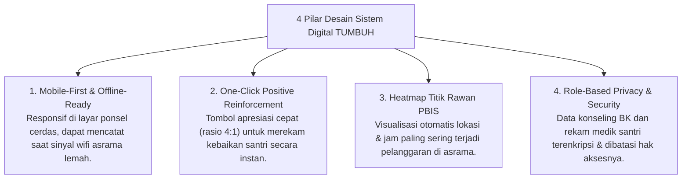

# P2-02-04-Prinsip-Desain-Antarmuka-dan-Dashboard-Digital

## Tujuan
Menetapkan prinsip perancangan antarmuka pengguna (*UI/UX Design*) dan dashboard digital sistem informasi kepengasuhan pesantren TUMBUH, memastikan perangkat lunak dirancang sangat cepat digunakan (*mobile-first*), meminimalkan beban input musyrif, dan menyajikan visualisasi data perilaku PBIS yang bermakna (*actionable analytics*).

---

## 1. Kaidah Emas "The 30-Second Rule" untuk Musyrif

Di lapangan asrama yang sangat dinamis, musyrif tidak memiliki waktu membuka laptop atau mengisi formulir panjang 15 kolom.

> **Hukum Baku UI/UX TUMBUH:**  
> *"Seluruh proses pencatatan rutinitas (kehadiran sholat, kebersihan kamar, atau apresiasi perilaku santri) wajib dapat diselesaikan dalam waktu kurang dari 30 detik melalui layar smartphone dengan maksimal 3 kali ketukan layar (*3-taps workflow*)."*

---

## 2. 4 Pilar Desain Antarmuka Sistem Digital TUMBUH

---

## 3. Matriks Perbedaan UI Logbook Konvensional vs TUMBUH

| Fitur | Sistem Informasi Konvensional | Aplikasi Asrama Digital TUMBUH |
| :--- | :--- | :--- |
| **Pencatatan Pelanggaran** | Mengetik manual kronologi panjang, lambat. | Pilihan cepat (*Dropdown & Tagging*) berbasis taksonomi PBIS, durasi <20 detik. |
| **Pencatatan Kebaikan (Apresiasi)** | Tidak ada fitur pencatatan kebaikan (hanya fokus dosa santri). | Fitur utama *"Poin Kebaikan"* dengan 1 sentuhan untuk menjaga rasio positif 4:1. |
| **Output Laporan Pimpinan** | Tabel angka mentah yang membingungkan. | Dashboard grafis tren mingguan, deteksi santri butuh dukungan Tier 2 secara otomatis (*Early Warning*). |

---

## 4. Status Dokumen
* **Status**: 🌟 **A+ (Tervalidasi & Siap Diimplementasikan)**
* **Level**: Project 2 - `02 Principles / 02 Design Principles`
* **Langkah Berikutnya**: **`P2-02-05-Sintesis-Design-Principles-TUMBUH.md`**.
