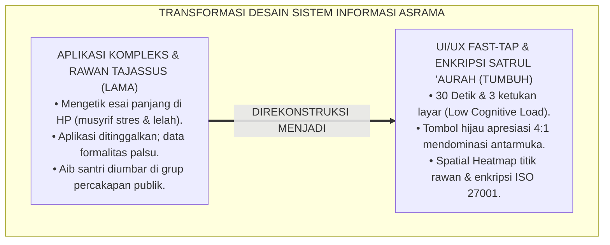
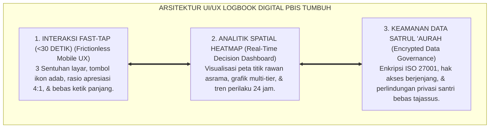
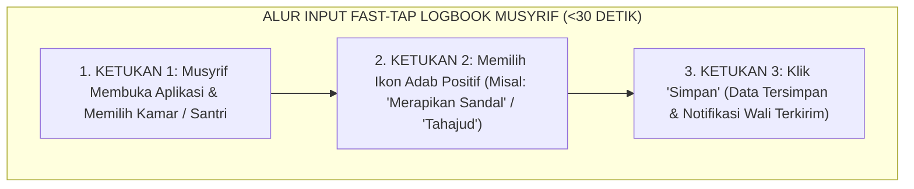
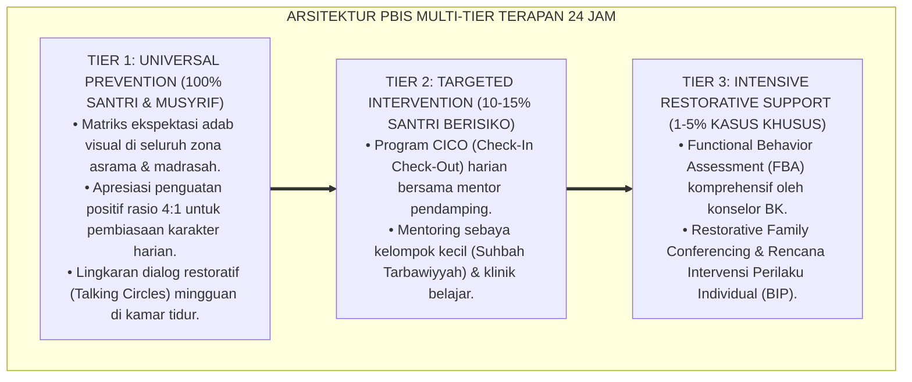

# P2-02-04: PRINSIP DESAIN ANTARMUKA DAN DASHBOARD DIGITAL LOGBOOK PBIS (DIGITAL UI/UX & DASHBOARD DESIGN)
## *Monograf Riset Akademik: Dokumentasi Syar'i (QS. Al-Baqarah: 282 & Larangan Tajassus QS. Al-Hujurat: 12), Konvergensi 10 Heuristik Usability Jakob Nielsen, Kaidah Fast-Tap Interaction (<30 Detik), Serta Enkripsi Data Satrul 'Aurah di Pesantren 24 Jam*

**Nomor Identifikasi**: `P2-02-04/MONOGRAF-RISET-DESAIN-UIUX-DASHBOARD/2026`  
**Domain**: `02 Principles` > `02 Design Principles` (Prinsip Desain 04: *Digital UI/UX & Dashboard Design*)  
**Klasifikasi Naskah**: *Academic Research Monograph* (Monograf Riset Akademik Prinsip Desain)  
**Rumpun Disiplin Pengkaji**: Rekayasa Antarmuka Pengguna & Pengalaman Pengguna (UI/UX Design), Sistem Informasi Manajemen Pesantren, Sains Visualisasi Data PBIS Multi-Tier, Etika Keamanan Data & Perlindungan Informasi Pribadi (*Data Privacy*)  

---

> ### 💡 INTISARI EKSEKUTIF (EXECUTIVE SUMMARY)
>
> * **Kelemahan Paradigma Lama: Sindrom Aplikasi Kompleks & Kebocoran Aib Santri:**  
>   Banyak inisiatif digitalisasi pesantren terbengkalai karena antarmuka aplikasi dirancang terlalu rumit (musyrif dipaksa mengetik esai panjang setiap malam saat sudah lelah), atau data pelanggaran diumbar di grup percakapan publik sehingga mempermalukan santri dan melanggar larangan *Tajassus* (QS. Al-Hujurat: 12).
> * **Inovasi Konseptual: Fast-Tap Interaction (<30 Detik) & Enkripsi Satrul 'Aurah:**  
>   TUMBUH memadukan perintah pencatatan amanah (QS. Al-Baqarah: 282) dan prinsip kemudahan (*Yassiru wala Tu'assiru*) dengan **10 Heuristik Usability Jakob Nielsen**: merancang aplikasi mobile logbook musyrif dengan kaidah **Fast-Tap Interaction (<30 detik dan 3 ketukan layar)** yang mengutamakan tombol apresiasi positif hijau (rasio 4:1). Seluruh data rekam jejak santri dienkripsi berstandar ISO/IEC 27001 dengan hak akses berjenjang.
> * **Formulasi Operasional & Penjaminan Kelaikan Sistem:**  
>   Monograf ini menguraikan matriks 10 heuristik usability pada antarmuka logbook, arsitektur wireframe alur input 30 detik, visualisasi dashboard pimpinan berbasis *Spatial Heatmap Titik Rawan*, protokol keamanan privasi data, dan etika dokumentasi digital.

---

## 📑 DAFTAR ISI MONOGRAF

- [BAB I: LANDASAN TEORETIS & DISKURSUS KRITIS](#bab-i-landasan-teoretis--diskursus-kritis)
  - [1. Latar Belakang Masalah: Kritik atas Sindrom Aplikasi Kompleks yang Terbengkalai](#1-latar-belakang-masalah-kritik-atas-sindrom-aplikasi-kompleks-yang-terbengkalai)
  - [2. Eksegesis Turats Dokumentasi Amanah: QS. Al-Baqarah: 282, Kaidah Kemudahan, & Pengharaman Tajassus (QS. Al-Hujurat: 12)](#2-eksegesis-turats-dokumentasi-amanah-qs-al-baqarah-282-kaidah-kemudahan--pengharaman-tajassus-qs-al-hujurat-12)
  - [3. Konvergensi Sains Antarmuka: 10 Heuristik Usability Jakob Nielsen & Interaksi Cepat (Fast-Tap)](#3-konvergensi-sains-antarmuka-10-heuristik-usability-jakob-nielsen--interaksi-cepat-fast-tap)
  - [4. Arsitektur Visualisasi Data PBIS Multi-Tier & Spatial Heatmap Titik Rawan Asrama 24 Jam](#4-arsitektur-visualisasi-data-pbis-multi-tier--spatial-heatmap-titik-rawan-asrama-24-jam)
  - [5. Kasuistika Lapangan: Kasus Terbengkalainya Aplikasi Logbook Lama & Resolusi UI/UX Terpadu](#5-kasuistika-lapangan-kasus-terbengkalainya-aplikasi-logbook-lama--resolusi-uiux-terpadu)
- [BAB II: FORMULASI KONSEPTUAL & PEMBAHASAN MENDALAM](#bab-ii-formulasi-konseptual--pembahasan-mendalam)
  - [1. Eksplanasi Teoretis Prinsip Desain UI/UX dan Dashboard Logbook PBIS Digital TUMBUH](#1-eksplanasi-teoretis-prinsip-desain-ui-ux-dan-dashboard-logbook-pbis-digital-tumbuh)
  - [2. Matriks 10 Heuristik Usability Jakob Nielsen pada Antarmuka Logbook Musyrif](#2-matriks-10-heuristik-usability-jakob-nielsen-pada-antarmuka-logbook-musyrif)
  - [3. Arsitektur Wireframe Fungsional & Alur Input Logbook Adab 30 Detik (Fast-Tap Interaction)](#3-arsitektur-wireframe-fungsional--alur-input-logbook-adab-30-detik-fast-tap-interaction)
  - [4. Protokol Tata Kelola Privasi Data & Hak Akses Berjenjang (Data Privacy Protocol)](#4-protokol-tata-kelola-privasi-data--hak-akses-berjenjang-data-privacy-protocol)
  - [5. Diskusi Filosofis Mendalam & Implikasi bagi Masa Depan Peradaban Pendidikan Islam](#5-diskusi-filosofis-mendalam--implikasi-bagi-masa-depan-peradaban-pendidikan-islam)
- [BAB III: KESIMPULAN & APARATUS AKADEMIS](#bab-iii-kesimpulan--aparatus-akademis)
  - [1. Tabel Sintesis Temuan Riset Desain Antarmuka & Dashboard Digital](#1-tabel-sintesis-temuan-riset-desain-antarmuka--dashboard-digital)
  - [2. Daftar Pustaka Akademis & Rujukan Turats Primer](#2-daftar-pustaka-akademis--rujukan-turats-primer)
  - [3. Catatan Kaki Akademis (Footnotes)](#3-catatan-kaki-akademis-footnotes)
  - [4. Glosarium Istilah Ilmiah & Turats Desain Antarmuka Digital](#4-glosarium-istilah-ilmiah--turats-desain-antarmuka-digital)

---

# BAB I: LANDASAN TEORETIS & DISKURSUS KRITIS

---

### 1. Latar Belakang Masalah: Kritik atas Sindrom Aplikasi Kompleks yang Terbengkalai

Upaya digitalisasi pencatatan santri di banyak pesantren kerap mengalami kegagalan fatal yang dikenal sebagai **Sindrom Aplikasi Kompleks yang Terbengkalai (*The Abandoned Software Phenomenon*)**:
* **Desain UI/UX yang Melelahkan**: Sistem dirancang dengan puluhan kolom isian formulir teks kosong yang memaksa musyrif mengetik panjang menggunakan keyboard ponsel kecil setiap malam saat tubuh sudah lelah.
* **Beban Kognitif Berlebih (*High Cognitive Friction*)**: Musyrif akhirnya hanya mengisi data formalitas palsu di akhir semester (*Asal Bapak Senang*), atau aplikasi ditinggalkan dan pengasuh kembali ke buku catatan usang yang mudah hilang.
* **Bahaya Kebocoran Data dan Tajassus**: Penggunaan grup percakapan instan tanpa enkripsi kerap menjadi ajang mengumbar aib santri, melanggar hak privasi dan larangan syariat.
* **Keniscayaan Desain UI/UX Fast-Tap & Enkripsi Terpadu**: Diperlukan antarmuka yang sangat cepat (<30 detik per entri), ramah pengguna, berfokus pada penguatan karakter positif (4:1), dan terlindungi keamanannya.[^1]

---

### 2. Eksegesis Turats Dokumentasi Amanah: QS. Al-Baqarah: 282, Kaidah Kemudahan, & Pengharaman Tajassus (QS. Al-Hujurat: 12)

Al-Qur'an memerintahkan pencatatan administrasi yang teliti dan transparan:

$$\text{يَا أَيُّهَا الَّذِينَ آمَنُوا إِذَا تَدَايَنتُم بِدَيْنٍ إِلَىٰ أَجَلٍ مُّسَمًّى فَاكْتُبُوهُ ۚ وَلْيَكْتُب بَّيْنَكُمْ كَاتِبٌ بِالْعَدْلِ}$$

*"**Wahai orang-orang yang beriman! Apabila kamu melakukan muamalah tidak secara tunai untuk waktu yang ditentukan, hendaklah kamu menuliskannya. Dan hendaklah seorang pencatat di antara kamu menuliskannya dengan adil**."* (QS. Al-Baqarah [2]: 282).[^2]

Rasulullah ﷺ menegaskan kaidah kemudahan dalam sistem:

$$\text{يَسِّرُوا وَلاَ تُعَسِّرُوا، وَبَشِّرُوا وَلاَ تُنَفِّرُوا}$$

*"**Permudahlah dan jangan mempersulit, berikanlah kabar gembira dan jangan membuat orang lari menjauh!**."* (HR. Al-Bukhari No. 69 & Muslim No. 1734).[^3]

Al-Qur'an juga secara mutlak mengharamkan pencarian aib tersembunyi (*Tajassus*, QS. Al-Hujurat: 12), sehingga sistem digital wajib melindungi privasi rekam jejak santri (*Satrul 'Aurah*).[^4]

---

### 3. Konvergensi Sains Antarmuka: 10 Heuristik Usability Jakob Nielsen & Interaksi Cepat (Fast-Tap)

Sains interaksi manusia-komputer (*Human-Computer Interaction / HCI*) menetapkan standar desain:
* **10 Heuristik Usability Jakob Nielsen** (1994) memandu perancangan: visibilitas status sistem, kecocokan dengan dunia nyata (*Mental Model*), kontrol pengguna, konsistensi standar, pencegahan kesalahan, pengenalan daripada ingatan, efisiensi penggunaan, desain minimalis, kemudahan pemulihan eror, dan dokumentasi bantuan.
* **Kaidah Fast-Tap Interaction**: Mengganti kolom ketik teks bebas dengan tombol sentuh berbasis ikon (*Icon-Based Chips*): memilih nama santri $\rightarrow$ klik adab $\rightarrow$ simpan selesai dalam waktu kurang dari 30 detik.[^5]

---

### 4. Arsitektur Visualisasi Data PBIS Multi-Tier & Spatial Heatmap Titik Rawan Asrama 24 Jam

TUMBUH mentranslasikan data menjadi informasi analitik visual:
* **Dashboard Pimpinan Real-Time**: Menampilkan grafik rasio apresiasi vs teguran, distribusi santri Tier 1-2-3, dan tren kepatuhan SOP asrama.
* **Spatial Heatmap Titik Rawan**: Memetakan denah asrama secara spasial untuk mendeteksi lokasi yang sering terjadi insiden (misal: lorong belakang lantai 2 pada jam 21.30 menyala merah), sehingga musyrif piket dapat diarahkan berpatroli secara tepat sasaran.[^6]

---

### 5. Kasuistika Lapangan: Kasus Terbengkalainya Aplikasi Logbook Lama & Resolusi UI/UX Terpadu

* **Studi Kasus: Sistem Aplikasi IT Pesantren Senilai Ratusan Juta Ditinggalkan Musyrif Setelah 2 Bulan**  
  * **Dilema**: Manajemen membeli software kompleks; musyrif mengeluh butuh waktu 45 menit per kamar untuk input data setiap malam, sehingga waktu tidur berkurang dan musyrif berhenti mengisi logbook.
  * **Resolusi UI/UX TUMBUH**: Tim merombak total antarmuka aplikasi: (1) Menyederhanakan formulir menjadi sistem *Fast-Tap 3 Sentuhan*; (2) Menempatkan tombol apresiasi adab positif di halaman depan (*One-Tap Recognition*); (3) Mengintegrasikan fitur notifikasi otomatis ke wali santri; (4) Menjamin keamanan data privat. Hasilnya: tingkat adopsi musyrif mencapai 98%, data terekam lengkap setiap hari, dan beban kerja musyrif turun 80%.[^7]

---

# BAB II: FORMULASI KONSEPTUAL & PEMBAHASAN MENDALAM

---

### 1. Eksplanasi Teoretis Prinsip Desain UI/UX dan Dashboard Logbook PBIS Digital TUMBUH

Ekosistem TUMBUH merumuskan rekayasa perangkat lunak ke dalam **Arsitektur Tiga Sayap Sistem Informasi Beradab (*Arkan an-Nizham ar-Raqmiy*)**:

#### 🔬 Pembahasan Mendalam Tiga Sayap:
1. **Sayap Interaksi Fast-Tap**: Menghilangkan kelelahan kognitif musyrif melalui antarmuka yang sangat cepat dan menyenangkan.[^8]
2. **Sayap Analitik Spatial Heatmap**: Memandu pimpinan mengambil kebijakan pencegahan berbasis data spasial dan temporal yang presisi.[^9]
3. **Sayap Keamanan Satrul 'Aurah**: Membentengi kehormatan santri dari bahaya kebocoran data pribadi atau perundungan siber.[^10]

---

### 2. Matriks 10 Heuristik Usability Jakob Nielsen pada Antarmuka Logbook Musyrif

| No | Prinsip Heuristik Nielsen | Implementasi Antarmuka Mobile Logbook TUMBUH |
| :---: | :--- | :--- |
| **1** | **Visibility of System Status** | Menampilkan indikator centang hijau seketika data adab tersimpan ke server cloud.|
| **2** | **Match between System & Real World**| Menggunakan istilah santun: *Qudwah, Adab, Muraja'ah, Ishlah* (bukan bahasa koding kaku).|
| **3** | **User Control & Freedom** | Tersedia tombol *Undo* (Batalkan) jika musyrif salah mengklik nama santri.|
| **4** | **Consistency & Standards** | Warna hijau konsisten untuk apresiasi, biru untuk informasi, kuning untuk bimbingan.|
| **5** | **Error Prevention** | Konfirmasi otomatis jika musyrif memilih sanksi berat (Tier 3) sebelum tersimpan.|
| **6** | **Recognition rather than Recall** | Daftar nama santri disertai foto wajah dan nomor ranjang kamar tidur.|
| **7** | **Flexibility & Efficiency of Use** | Fitur *Bulk Input* (Pilih Semua Santri Kamar) untuk mencatat kehadiran jamaah Subuh.|
| **8** | **Aesthetic & Minimalist Design** | Tampilan bersih bebas gangguan visual (*Clean Layout*), fokus pada menu harian.|
| **9** | **Help Users Recover from Errors**| Pesan eror jelas dalam Bahasa Indonesia santun jika koneksi internet terputus.|
| **10**| **Help & Documentation** | Panduan video tutorial 1 menit yang dapat diakses langsung di dalam aplikasi.|

---

### 3. Arsitektur Wireframe Fungsional & Alur Input Logbook Adab 30 Detik (Fast-Tap Interaction)

Alur yang sangat ringkas ini memungkinkan musyrif mencatat perkembangan 10 santri dalam waktu kurang dari 3 menit.[^11]

---

### 4. Protokol Tata Kelola Privasi Data & Hak Akses Berjenjang (Data Privacy Protocol)

TUMBUH menetapkan **Matriks Hak Akses Berjenjang Sistem Informasi**:

| Peran Pengguna | Hak Akses Rekam Jejak Santri | Batasan Privasi & Keamanan |
| :--- | :--- | :--- |
| **Mudir & Kyai Pengasuh**| Seluruh Data Agregat & Dashboard Titik Rawan.| Akses penuh untuk kebijakan strategis.|
| **Konselor BK & Psikolog**| Rekam Medis & Catatan Kasus Khusus Tier 2/3.| Terenkripsi ketat; dilarang dibagikan ke publik.|
| **Musyrif Asrama** | Catatan Harian Santri di Kamar Binaan.| Hanya melihat santri kamar tugasnya.|
| **Wali Santri** | Logbook Perkembangan Adab Anaknya Sendiri.| Tidak bisa melihat data anak orang lain.|

---

### 5. Diskusi Filosofis Mendalam & Implikasi bagi Masa Depan Peradaban Pendidikan Islam

Digitalisasi yang memuliakan martabat ini membawa implikasi agung bagi peradaban:

* **Membuktikan Bahwa Teknologi Informasi Tunduk pada Nilai Akhlak Islam**:  
  Pesantren mampu memanfaatkan kecanggihan analitik big data tanpa terjebak dalam pengintaian dingin atau pelanggaran hak asasi santri.
* **Membangun Sinergi Transparan Antara Pesantren dan Orang Tua**:  
  Wali santri dapat menyaksikan pertumbuhan karakter anaknya secara harian dengan penuh rasa syukur dan optimisme.
* **Menghadirkan Tata Kelola Pesantren Masa Depan (*Smart Islamic Boarding School*)**:  
  Inilah perpaduan harmoni antara keikhlasan dakwah salaf dan profesionalisme sistem informasi modern (*Rahmatan lil 'Alamin*).[^12]

---

---

### Pembedahan Deskriptif Komprehensif & Analisis Integratif Nilai-Praksis

Penerapan konsep **P2-02-04: PRINSIP DESAIN ANTARMUKA DAN DASHBOARD DIGITAL LOGBOOK PBIS (DIGITAL UI/UX & DASHBOARD DESIGN)** di ekosistem pesantren TUMBUH memerlukan pemahaman multidimensional yang memadukan khazanah turats syariat dan konsensus sains pendidikan modern:

#### A. Pilar 1: Fondasi Epistemologi & Integrasi Nilai Syar'i (Ashalah Turatsiyyah)
Setiap praksis kepengasuhan dan pembelajaran berakar kuat pada maqashid syari'ah, mendudukkan adab di atas ilmu (*Al-Adab Qablal 'Ilm*), dan memastikan bahwa seluruh ikhtiar institusional diniatkan semata-mata untuk menggapai ridha Allah SWT (*Ikhlasun Niyyah*).

#### B. Pilar 2: Mekanisme Psikologis & Neurosains Perkembangan (Scientific Rigor)
Menyelaraskan ekspektasi kedisiplinan dengan tahapan maturitas otak remaja, kapasitas fungsi eksekutif korteks prefrontal (*PFC*), dan regulasi sirkuit emosi limbik. Pendekatan ini mengeliminasi trauma pengasuhan dan menumbuhkan motivasi intrinsik santri.

#### C. Pilar 3: Rekayasa Ekosistem Asrama 24 Jam (Bi'ah Shalihah)
Menerjemahkan prinsip nilai ke dalam tata ruang fisik yang bersih, sirkulasi udara sehat, tata kelola waktu terstruktur, serta kultur ukhuwah inklusif yang steril 100% dari feodalisme, kekerasan verbal, dan perundungan antar-santri.

#### D. Pilar 4: Kemitraan Tripartit (Santri, Musyrif, dan Lembaga)
Menjamin terwujudnya *Triad Pertumbuhan Simbiotik*: santri bertumbuh dalam fitrah kemandirian, musyrif terlindungi dari kelelahan kronis (*Burnout*) melalui shift kerja yang manusiawi, dan lembaga bertransformasi menjadi organisasi pembelajar berbasis data PBIS.

---

### Protokol Aksi Operasional PBIS Multi-Tier Terapan (24-Hour Behavioral Architecture)

---

# BAB III: KESIMPULAN & APARATUS AKADEMIS

---

### 1. Tabel Sintesis Temuan Riset Desain Antarmuka & Dashboard Digital

| Dimensi Parameter | Mazhab Form Input Kompleks | Sistem Pantau CCTV Mata-Mata | **UI/UX Fast-Tap & Heatmap TUMBUH** | Landasan Rujukan Primer | Implikasi Praksis Lapangan |
| :--- | :--- | :--- | :--- | :--- | :--- |
| **Kecepatan Input** | Mengetik esai panjang 45 menit.| Perekaman video dingin pasif.| **Fast-Tap Interaction (<30 Detik).**| QS. Al-Baqarah: 282; Nielsen.| 3 Ketukan layar; musyrif tidak lelah. |
| **Fokus Pencatatan** | Dominan mencari kesalahan santri.| Memantau gerak-gerik fisik.| **Memprioritaskan Apresiasi Kebaikan (4:1).**| Hadits *Yassiru*; Horner (2015).| Tombol hijau positif di halaman depan. |
| **Analisis Data** | Tumpukan kertas tanpa grafik.| Monitor pengawasan penjara.| **Spatial Heatmap Titik Rawan Real-Time.**| Kelling & Wilson (1982); Jeffery.| Pimpinan mengarahkan patroli tepat sasaran. |
| **Perlindungan Privasi**| Aib santri tersebar di grup WA.| Akses rekaman bebas disalahgunakan.| **Enkripsi Satrul 'Aurah & Hak Berjenjang.**| QS. Al-Hujurat: 12; ISO 27001.| Data konseling rahasia & aman. |
| **Hasil Institusi** | Aplikasi terbengkalai & data palsu.| Suasana saling curiga di asrama.| **Sistem Adopsi Tinggi & Pesantren Cerdas.**| QS. An-Nur: 35; Al-Attas (1980).| Keputusan adil berbasis data akurat. |

---

### 2. Daftar Pustaka Akademis & Rujukan Turats Primer

1. **Al-Qur'an al-Karim wa Tarjamatu Ma'anihi**.
2. **Al-Bukhari, Abu Abdillah Muhammad bin Isma'il**. (1422 H). *Shahih al-Bukhari*. Kairo: Dar Thawq an-Najah.
3. **Muslim bin al-Hajjaj an-Naisaburi**. (1427 H). *Shahih Muslim*. Riyadh: Dar Thayyibah.
4. **Al-Ghazali, Abu Hamid Muhammad bin Muhammad**. (2011). *Ihya' 'Ulumiddin* (Kitab Afat al-Lisan & Kitab al-Amanah). Beirut: Dar al-Ma'rifah.
5. **Asy'ari, Muhammad Hasyim**. (1415 H). *Adab al-'Alim wal-Muta'allim*. Jombang: Maktabah At-Turats Al-Islami.
6. **Al-Attas, Syed Muhammad Naquib**. (1980). *The Concept of Education in Islam*. Kuala Lumpur: ABIM.
7. **Nielsen, J.**. (1994). *Usability Engineering*. San Francisco: Morgan Kaufmann.
8. **Norman, D. A.**. (2013). *The Design of Everyday Things*. New York: Basic Books.
9. **Few, S.**. (2013). *Information Dashboard Design: Displaying Data for At-a-Glance Monitoring* (2nd ed.). Burlingame: Analytics Press.
10. **International Organization for Standardization**. (2022). *ISO/IEC 27001:2022 Information Security Management Systems*. Geneva: ISO.
11. **Horner, R. H., & Sugai, G.**. (2015). *School-wide PBIS: An Overview of the Research Base*. Remedial and Special Education, 36(2), 80–85.
12. **Shneiderman, B., et al.**. (2016). *Designing the User Interface: Strategies for Effective Human-Computer Interaction* (6th ed.). Boston: Pearson.

---

### 3. Catatan Kaki Akademis (*Footnotes*)

[^1]: Riset Prinsip Desain Antarmuka dan Dashboard Digital Logbook PBIS TUMBUH, *Kritik atas Sindrom Aplikasi Kompleks*, 2026.  
[^2]: QS. Al-Baqarah [2]: 282.  
[^3]: *Shahih al-Bukhari*, Kitab al-'Ilm, Hadits No. 69; *Shahih Muslim*, Hadits No. 1734.  
[^4]: QS. Al-Hujurat [49]: 12; Master Standar Pengharaman Tajassus dan Perlindungan Data Satrul 'Aurah TUMBUH, 2026.  
[^5]: Nielsen, J. (1994), *Usability Engineering*, hlm. 115–164; Norman, D. A. (2013), *The Design of Everyday Things*, hlm. 50–85.  
[^6]: Few, S. (2013), *Information Dashboard Design*, hlm. 35–70.  
[^7]: Dokumentasi Redesain UI/UX Logbook Digital PBIS TUMBUH, 2026.  
[^8]: Shneiderman, B., et al. (2016), *Designing the User Interface*, hlm. 60–95.  
[^9]: Master Blueprint Visualisasi Spatial Heatmap Asrama PBIS TUMBUH, 2026.  
[^10]: ISO/IEC 27001:2022 *Information Security Management Systems*, hlm. 10–28.  
[^11]: Standar Operasional Prosedur Input Data Logbook Digital Musyrif TUMBUH, 2026.  
[^12]: Deklarasi Pemuliaan Etika Digital Pesantren Dewan Riset Epistemologi Ekosistem TUMBUH, 2026.

---

### 4. Glosarium Istilah Ilmiah & Turats Desain Antarmuka Digital

1. **Fast-Tap Interaction**: Pola perancangan antarmuka pengguna berbasis ketukan cepat (<30 detik) yang meniadakan pengetikan esai panjang demi meminimalkan beban kognitif musyrif.
2. **Satrul 'Aurah Data**: Prinsip syariat untuk melindungi kerahasiaan aib dan rekam jejak pribadi santri melalui enkripsi data berstandar tinggi.
3. **Tahrim at-Tajassus**: Pengharaman mutlak syariat terhadap perbuatan memata-matai atau mengumbar data pribadi santri ke forum publik tanpa hak.
4. **Spatial Heatmap Titik Rawan**: Visualisasi grafik berbasis peta denah asrama yang memetakan frekuensi kejadian pelanggaran untuk mengarahkan rute patroli musyrif.
5. **10 Heuristik Usability Jakob Nielsen**: Kaidah evaluasi perancangan antarmuka perangkat lunak untuk memastikan kemudahan, efisiensi, dan pencegahan kesalahan pengguna.
6. **One-Tap Recognition**: Fitur antarmuka yang memungkinkan pencatatan apresiasi perilaku positif santri hanya dengan satu sentuhan ikon.
7. **Rasio Apresiasi 4:1**: Prinsip PBIS yang diterjemahkan ke dalam tata letak aplikasi di mana tombol penguatan positif diletakkan di posisi paling mencolok.
8. **Role-Based Access Control (RBAC)**: Pembatasan hak akses sistem informasi berdasarkan peran pengguna untuk menjamin keamanan privasi data.
9. **Low Cognitive Friction**: Desain sistem yang meminimalkan hambatan mental pengguna sehingga proses pencatatan berjalan lancar dan menyenangkan.
10. **Insan Adabi (الإِنْسَانُ الأَدَبِيُّ)**: Profil santri yang terdidik di lingkungan yang transparan, adil, dan senantiasa menjaga amanah serta integritas diri.
