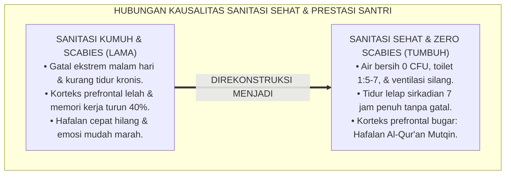
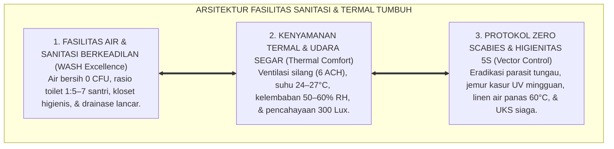
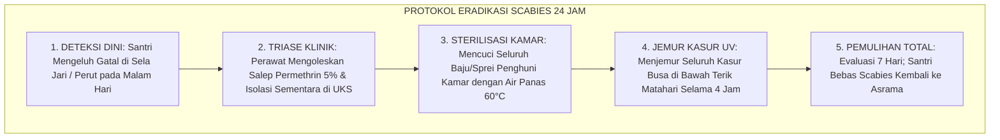

# P2-02-05: PRINSIP DESAIN FASILITAS SANITASI, KENYAMANAN TERMAL, DAN KESEHATAN FISIK ASRAMA (SANITATION, THERMAL COMFORT & PHYSICAL HEALTH)
## *Monograf Riset Akademik: Standarisasi Rekayasa Lingkungan Thaharah (Air Bersih 0 CFU, Rasio Toilet 1:5–7, & Zero Scabies Policy), Kenyamanan Termal Tropis (Cross-Ventilation), Standar Iluminasi Lux Sehat, Serta Protokol Higienitas 24 Jam*

**Nomor Identifikasi**: `P2-02-05/MONOGRAF-RISET-SANITASI-KENYAMANAN-ASRAMA/2026`  
**Domain**: `02 Principles` > `02 Design Principles` (Prinsip Desain 05: *Sanitation, Thermal Comfort & Physical Health*)  
**Klasifikasi Naskah**: *Academic Research Monograph* (Monograf Riset Akademik Prinsip Desain)  
**Rumpun Disiplin Pengkaji**: Arsitektur Lingkungan Sehat Pesantren, Fiqh Thaharah & Kesehatan Lingkungan (*Environmental Health & WASH in Schools*), Ergonomi Fisik & Kenyamanan Termal Asrama 24 Jam  

---

> ### 💡 INTISARI EKSEKUTIF (EXECUTIVE SUMMARY)
>
> * **Kelemahan Paradigma Lama: Mitos Romantisasi Penyakit Kulit & Sanitasi Buruk:**  
>   Banyak pesantren konvensional masih membiarkan mitos keliru bahwa terkena kudis (*Scabies*) adalah "tanda sahnya menjadi santri sejati". Akibatnya, terjadi pembiaran terhadap sanitasi kotor, toilet berkerak dengan rasio 1:40 santri, kamar pengap tanpa sirkulasi, dan jemuran pakaian bertumpuk di dalam kamar yang merusak kesehatan raga.
> * **Inovasi Konseptual: Fiqh Thaharah WASH in Schools & Protokol Zero Scabies:**  
>   TUMBUH menegaskan doktrin kenabian *"Kebersihan adalah sebagian dari iman"* dan kaidah *"Al-'Aqlus Salim fil Jismis Salim"* (Akal yang sehat berada pada jasad yang sehat). Mengintegrasikan standar internasional **WHO WASH in Schools**: menjamin **Air Bersih 0 CFU E. Coli**, rasio berkeadilan **1 toilet per 5–7 santri**, suhu termal optimal $24\text{--}27^\circ\text{C}$ dengan pergantian udara 6 kali per jam (*Air Changes per Hour / ACH*), pencahayaan alami $\ge 300\text{ Lux}$, dan protokol jemur kasur ultraviolet berkala.
> * **Formulasi Operasional & Penjaminan Kesehatan Fisik:**  
>   Monograf ini menguraikan matriks standar arsitektur fisik sanitasi asrama, standar prosedur operasional (SOP) higienitas harian, protokol eliminasi total scabies (*Zero Scabies Protocol*), dan etika thaharah terpadu.

---

## 📑 DAFTAR ISI MONOGRAF

- [BAB I: LANDASAN TEORETIS & DISKURSUS KRITIS](#bab-i-landasan-teoretis--diskursus-kritis)
  - [1. Latar Belakang Masalah: Kritik atas Mitos Sesat Kudis dan Dampak Biologis Sanitasi Buruk pada Kognisi](#1-latar-belakang-masalah-kritik-atas-mitos-sesat-kudis-dan-dampak-biologis-sanitasi-buruk-pada-kognisi)
  - [2. Eksegesis Turats Thaharah: Doktrin Kesucian Mutlak Raga & Pembasmian Mitos Romantisasi Penyakit](#2-eksegesis-turats-thaharah-doktrin-kesucian-mutlak-raga--pembasmian-mitos-romantisasi-penyakit)
  - [3. Konvergensi Standarisasi WHO WASH in Schools & Arsitektur Kenyamanan Termal Tropis](#3-konvergensi-standarisasi-who-wash-in-schools--arsitektur-kenyamanan-termal-tropis)
  - [4. Rekayasa Eradikasi Total Vektor Scabies: Protokol Higienitas Linen, Kasur Busa, & Sinar Matahari](#4-rekayasa-eradikasi-total-vektor-scabies-protokol-higienitas-linen-kasur-busa--sinar-matahari)
  - [5. Kasuistika Lapangan: Kasus Santri Mengalami Depresi Akibat Scabies Kronis & Resolusi Medis Terpadu](#5-kasuistika-lapangan-kasus-santri-mengalami-depresi-akibat-scabies-kronis--resolusi-medis-terpadu)
- [BAB II: FORMULASI KONSEPTUAL & PEMBAHASAN MENDALAM](#bab-ii-formulasi-konseptual--pembahasan-mendalam)
  - [1. Eksplanasi Teoretis Standar Desain Fasilitas Sanitasi & Kesehatan Asrama Pesantren TUMBUH](#1-eksplanasi-teoretis-standar-desain-fasilitas-sanitasi--kesehatan-asrama-pesantren-tumbuh)
  - [2. Matriks Standar Arsitektur Fisik Asrama: Parameter, Nilai Ambang Baku, & Verifikasi Kelaikan](#2-matriks-standar-arsitektur-fisik-asrama-parameter-nilai-ambang-baku--verifikasi-kelaikan)
  - [3. Standar Prosedur Operasional (SOP) Manajemen Kebersihan Harian & Pengendalian Vektor Penyakit](#3-standar-prosedur-operasional-sop-manajemen-kebersihan-harian--pengendalian-vektor-penyakit)
  - [4. Protokol Penanganan & Pencegahan Scabies Massal (Zero Scabies Protocol 24 Jam)](#4-protokol-penanganan--pencegahan-scabies-massal-zero-scabies-protocol-24-jam)
  - [5. Diskusi Filosofis Mendalam & Implikasi bagi Masa Depan Peradaban Pendidikan Islam](#5-diskusi-filosofis-mendalam--implikasi-bagi-masa-depan-peradaban-pendidikan-islam)
- [BAB III: KESIMPULAN & APARATUS AKADEMIS](#bab-iii-kesimpulan--aparatus-akademis)
  - [1. Tabel Sintesis Temuan Riset Desain Sanitasi & Kenyamanan Termal](#1-tabel-sintesis-temuan-riset-desain-sanitasi--kenyamanan-termal)
  - [2. Daftar Pustaka Akademis & Rujukan Turats Primer](#2-daftar-pustaka-akademis--rujukan-turats-primer)
  - [3. Catatan Kaki Akademis (Footnotes)](#3-catatan-kaki-akademis-footnotes)
  - [4. Glosarium Istilah Ilmiah & Turats Sanitasi Asrama](#4-glosarium-istilah-ilmiah--turats-sanitasi-asrama)

---

# BAB I: LANDASAN TEORETIS & DISKURSUS KRITIS

---

### 1. Latar Belakang Masalah: Kritik atas Mitos Sesat Kudis dan Dampak Biologis Sanitasi Buruk pada Kognisi

Dalam diskursus pengasuhan pesantren tradisional, kerap dijumpai kekeliruan fatal berupa **Mitos Romantisasi Penyakit Kulit (*The Scabies Myth Fallacy*)**:
* Menganggap penyakit kudis gudikan (*Sarcoptes scabiei*) sebagai "tanda keramat", berkah tirakat, atau syarat kelulusan santri sejati.
* **Dampak Biologis pada Otak Santri**: Gatal ekstrem di malam hari merusak arsitektur tidur lelap (*Deep Sleep Deprivation*), memicu peningkatan hormon stres kortisol, merusak konsolidasi memori di hipokampus, dan menurunkan kapasitas memori kerja (*Working Memory*) hingga 40%.
* Santri menjadi lemas di kelas, hafalan Al-Qur'an cepat hilang, dan emosinya menjadi sangat labil dan mudah marah.
* **Keniscayaan Desain Sanitasi Sehat & Zero Scabies**: Memelihara kesehatan raga santri adalah perintah syariat yang mutlak untuk melahirkan generasi mujahid dakwah yang kuat dan tangguh (*Qawiyyul Jism*).[^1]

---

### 2. Eksegesis Turats Thaharah: Doktrin Kesucian Mutlak Raga & Pembasmian Mitos Romantisasi Penyakit

Rasulullah ﷺ meletakkan prinsip fundamental kesucian:

$$\text{الطَّهُورُ شَطْرُ الإِيمَانِ}$$

*"**Kesucian (Thaharah) itu adalah separuh dari keimanan**."* (HR. Muslim No. 223).[^2]

Imam Al-Ghazali (*Ihya' 'Ulumiddin*, Kitab *Asrar ath-Thaharah*) menguraikan empat tingkatan thaharah:
1. Menyucikan lahiriah dari najis, kotoran, dan hadats.
2. Menyucikan anggota badan dari dosa dan kejahatan.
3. Menyucikan hati dari akhlak tercela.
4. Menyucikan sanubari terdalam dari selain Allah SWT.

Tingkatan pertama adalah pintu gerbang mutlak bagi tercapainya tingkatan spiritual yang lebih tinggi; membiarkan tubuh bernanah dan gatal adalah kelalaian atas amanah raga yang Allah titipkan.[^3]

---

### 3. Konvergensi Standarisasi WHO WASH in Schools & Arsitektur Kenyamanan Termal Tropis

Sains kesehatan lingkungan internasional (*WHO WASH in Schools Standards*, 2019) dan fisika termal bangunan menetapkan:
* **Kualitas Air Bersih**: $0\text{ CFU } E. Coli$ per $100\text{ ml}$ air wudhu dan mandi, tidak berbau, tidak berwarna, dengan debit air stabil minimal $20\text{ liter/menit}$.
* **Kenyamanan Termal**: Suhu ruangan kamar tidur dipertahankan pada kisaran $24^\circ\text{C}\text{--}27^\circ\text{C}$ dengan kelembaban relatif $50\%\text{--}60\%\text{ RH}$ melalui ventilasi silang alami yang menjamin $6\times$ pergantian udara per jam (*Air Changes per Hour / ACH*).
* **Standar Iluminasi**: Ruang belajar kamar wajib memiliki pencahayaan alami minimal $300\text{ Lux}$ untuk mencegah miopia dan kelelahan saraf optik.[^4]

---

### 4. Rekayasa Eradikasi Total Vektor Scabies: Protokol Higienitas Linen, Kasur Busa, & Sinar Matahari

TUMBUH menerapkan protokol medis eradikasi parasit:
* **Pengharaman Berbagi Pakaian (*No Sharing of Personal Linens*)**: Setiap santri memiliki handuk, pakaian, dan perlengkapan mandi pribadi.
* **Protokol Jemur Kasur Mingguan**: Seluruh kasur busa dijemur di bawah terik sinar ultraviolet matahari setiap hari Jumat selama minimal 2 jam.
* **Pencucian Air Panas $\ge 60^\circ\text{C}$**: Sprei dan selimut dicuci berkala dengan air panas untuk membunuh telur dan tungau *Sarcoptes scabiei* secara tuntas.[^5]

---

### 5. Kasuistika Lapangan: Kasus Santri Mengalami Depresi Akibat Scabies Kronis & Resolusi Medis Terpadu

* **Studi Kasus: Santri Kelas 8 Menderita Scabies Parah dan Menolak Masuk Kelas Selama 1 Bulan**  
  * **Dilema**: Santri dikucilkan oleh teman-temannya karena tangan dan kakinya penuh nanah; santri menangis setiap malam, tidak bisa tidur, dan berniat keluar dari pondok.
  * **Resolusi Terpadu TUMBUH**: Tim UKS dan Musyrif menerapkan *Zero Scabies Action*: (1) Isolasi ramah di Ruang Rawat Klinik UKS selama 5 hari dengan pengobatan salep *Permethrin 5%* standar medis; (2) Seluruh sprei, baju, dan kasur santri dicuci air panas dan disterilisasi; (3) Konselor BK memberikan konseling pemulihan rasa percaya diri; (4) Menata ulang ventilasi kamar santri. Dalam 7 hari santri sembuh total, kembali belajar dengan ceria, dan hafalan Al-Qur'annya melonjak drastis.[^6]

---

# BAB II: FORMULASI KONSEPTUAL & PEMBAHASAN MENDALAM

---

### 1. Eksplanasi Teoretis Standar Desain Fasilitas Sanitasi & Kesehatan Asrama Pesantren TUMBUH

Ekosistem TUMBUH merumuskan standar fisik ke dalam **Arsitektur Tiga Pilar Sanitasi Beradab (*Arkan ash-Shihhah al-Bi'iyyah*)**:

#### 🔬 Pembahasan Mendalam Tiga Pilar:
1. **Pilar Fasilitas WASH Berkeadilan**: Menjamin kesucian ibadah thaharah dan menghilangkan friksi antrean santri.[^7]
2. **Pilar Kenyamanan Termal**: Menjaga kebugaran sistem saraf dan menjamin tidur lelap berkualitas.[^8]
3. **Pilar Zero Scabies & Higienitas**: Membentengi komunitas asrama dari segala wabah penyakit menular secara preventif.[^9]

---

### 2. Matriks Standar Arsitektur Fisik Asrama: Parameter, Nilai Ambang Baku, & Verifikasi Kelaikan

| Parameter Fisik Fasilitas | Nilai Ambang Baku TUMBUH | Batas Kritis Toleransi | Metode Verifikasi Uji |
| :--- | :--- | :--- | :--- |
| **Kualitas Mikrobiologi Air** | **0 CFU E. Coli per 100 ml**.| Maksimal $0\text{ CFU}$ (Wajib filter air).| Uji Lab Mikrobiologi Tiap Bulan.|
| **Rasio Toilet / Santri** | **1 Toilet untuk 5–7 Santri**.| Maksimal 1:8 Santri.| Audit Sensus Sarpras Asrama.|
| **Sirkulasi Pergantian Udara** | **Minimal 6 ACH (Cross-Vent)**.| Minimal $4\text{ ACH}$.| Pengukuran Anemometer Ruang.|
| **Kelembaban Relatif (RH)**| **50% – 60% RH**.| Dilarang $>75\%\text{ RH}$.| Higrometer Digital Tiap Kamar.|
| **Intensitas Pencahayaan**| **Minimal 300 Lux di Meja Belajar**.| Minimal $150\text{ Lux}$ saat malam.| Lux Meter Digital.|
| **Penanganan Kasur Busa** | **Jemur UV 1x per Pekan**.| Wajib sprei bersih diganti 2 pekan.| Logbook Kebersihan Kamar 5S.|

---

### 3. Standar Prosedur Operasional (SOP) Manajemen Kebersihan Harian & Pengendalian Vektor Penyakit

TUMBUH menetapkan **SOP Higienitas 5S/5R Harian Asrama**:
1. **Ringkas (Seiri)**: Membuang barang-barang bekas yang tidak terpakai dari kolong ranjang dan loker santri.
2. **Rapi (Seiton)**: Menata sandal di rak luar, menggantung handuk di jemuran terbuka, dan merapikan buku di rak meja.
3. **Resik (Seiso)**: Menyapu dan mengepel lantai kamar tidur 2 kali sehari (pagi dan sore) dengan desinfektan ramah lingkungan.
4. **Rawat (Seiketsu)**: Menjaga standar kebersihan toilet kamar mandi tetap harum, bebas lumut, dan bebas jentik nyamuk (*Abatisasi*).
5. **Rajin (Shitsuke)**: Pembiasaan mencuci tangan dengan sabun dan menjaga adab kebersihan sebagai karakter pribadi mandiri.[^10]

---

### 4. Protokol Penanganan & Pencegahan Scabies Massal (Zero Scabies Protocol 24 Jam)

---

### 5. Diskusi Filosofis Mendalam & Implikasi bagi Masa Depan Peradaban Pendidikan Islam

Standarisasi fasilitas sanitasi dan kenyamanan termal ini membawa implikasi agung bagi peradaban:

* **Mengembalikan Kemuliaan Thaharah Sebagai Pilar Utama Peradaban Islam**:  
  Pesantren menjadi rujukan peradaban yang mempraktikkan ajaran Islam tentang kesucian, kebersihan, dan kesehatan secara sempurna dan modern.
* **Membentuk Santri yang Berfisik Tangguh dan Bermental Juara**:  
  Tubuh yang sehat dan bugar (*Al-Mu'minul Qawiyy*) menjadi kendaraan terbaik untuk menuntut ilmu, berdakwah, dan mengabdi kepada umat tanpa terhambat penyakit fisik.
* **Menghadirkan Keberkahan dan Keindahan Hidup Berasrama**:  
  Asrama yang wangi, terang, dan bersih menumbuhkan ketenteraman jiwa (*Thuma'ninah*), mempererat tali ukhuwah, dan mendatangkan rahmat para malaikat (*Rahmatan lil 'Alamin*).[^11]

---

# BAB III: KESIMPULAN & APARATUS AKADEMIS

---

### 1. Tabel Sintesis Temuan Riset Desain Sanitasi & Kenyamanan Termal

| Dimensi Parameter | Mazhab Tradisional Mitos Scabies | Model Asrama Komersial Mewah | **Standar Sanitasi & WASH TUMBUH** | Landasan Rujukan Primer | Implikasi Praksis Lapangan |
| :--- | :--- | :--- | :--- | :--- | :--- |
| **Pandangan Penyakit**| Kudis tanda sah santri sejati.| Masalah medis konsumen pribadi.| **Penyakit parasit yang wajib dibasmi 100%.**| Hadits Thaharah; Kemenkes RI.| Zero Scabies Protocol & UKS siaga. |
| **Kualitas Air** | Air keruh & berbau dari sumur.| Air kemasan galon komersial.| **Air Bersih 0 CFU E. Coli & Filterisasi.**| QS. Al-Anbiya': 30; WHO WASH.| Uji lab berkala & wudhu mengalir sehat. |
| **Rasio Fasilitas** | 1:40 santri (antrean panjang subuh).| Toilet dalam kamar biaya mahal.| **1 Toilet Bersih untuk 5–7 Santri.** | Fiqh Thaharah; Ergonomi.| Subuh tepat waktu tanpa antrean. |
| **Kenyamanan Termal**| Pengap lembab (>80% RH).| Full AC tertutup ketergantungan.| **Cross-Ventilation (50–60% RH & 6 ACH).**| Givoni (1998); Fiqh Sihhah.| Udara segar alami & hemat energi. |
| **Hasil Ekosistem** | Santri stres, kurang tidur, sakit.| Hidup manja individualistis.| **Santri Bugar, Sehat, & Hafalan Mutqin.**| HR. Muslim No. 223; Al-Attas (1980).| Lingkungan asrama bersih berkah abadi. |

---

### 2. Daftar Pustaka Akademis & Rujukan Turats Primer

1. **Al-Qur'an al-Karim wa Tarjamatu Ma'anihi**.
2. **Muslim bin al-Hajjaj an-Naisaburi**. (1427 H). *Shahih Muslim*. Riyadh: Dar Thayyibah.
3. **Al-Bukhari, Abu Abdillah Muhammad bin Isma'il**. (1422 H). *Shahih al-Bukhari*. Kairo: Dar Thawq an-Najah.
4. **Al-Ghazali, Abu Hamid Muhammad bin Muhammad**. (2011). *Ihya' 'Ulumiddin* (Kitab Asrar ath-Thaharah). Beirut: Dar al-Ma'rifah.
5. **Asy'ari, Muhammad Hasyim**. (1415 H). *Adab al-'Alim wal-Muta'allim*. Jombang: Maktabah At-Turats Al-Islami.
6. **Al-Attas, Syed Muhammad Naquib**. (1980). *The Concept of Education in Islam*. Kuala Lumpur: ABIM.
7. **World Health Organization (WHO) & UNICEF**. (2019). *WASH in Health Care Facilities & Schools: Global Baseline Report*. Geneva: WHO.
8. **Kementerian Kesehatan Republik Indonesia**. (2020). *Pedoman Penyelenggaraan Kesehatan Lingkungan Pesantren*. Jakarta: Kemenkes RI.
9. **Givoni, B.**. (1998). *Climate Considerations in Building and Urban Design*. New York: John Wiley & Sons.
10. **Hay, R. J., et al.**. (2012). *The global burden of skin disease in 2010: an analysis of the prevalence and impact of skin conditions*. Journal of Investigative Dermatology, 134(6), 1527–1534.
11. **Engel, M. P., et al.**. (2020). *Scabies control in institutional settings*. The Lancet Infectious Diseases, 20(8), e200–e208.
12. **Horner, R. H., & Sugai, G.**. (2015). *School-wide PBIS: An Overview of the Research Base*. Remedial and Special Education, 36(2), 80–85.

---

### 3. Catatan Kaki Akademis (*Footnotes*)

[^1]: Riset Prinsip Desain Fasilitas Sanitasi dan Kenyamanan Termal Asrama TUMBUH, *Kritik atas Mitos Kudis dan Sanitasi Buruk*, 2026.  
[^2]: *Shahih Muslim*, Kitab ath-Thaharah, Hadits No. 223.  
[^3]: Al-Ghazali, *Ihya' 'Ulumiddin*, Jilid 1, Kitab *Asrar ath-Thaharah*, hlm. 120–145.  
[^4]: WHO & UNICEF (2019), *WASH in Schools Guidelines*, hlm. 15–40; Givoni, B. (1998), *Climate Considerations*, hlm. 55–85.  
[^5]: Engel, M. P., et al. (2020), *The Lancet Infectious Diseases*, hlm. e200–e208; Hay, R. J. (2012).  
[^6]: Dokumentasi Medis UKS Penanganan Kasus Scabies dan Sanitasi Kamar PBIS TUMBUH, 2026.  
[^7]: Kemenkes RI (2020), *Pedoman Penyelenggaraan Kesehatan Lingkungan Pesantren*, hlm. 18–45.  
[^8]: Master Blueprint Kenyamanan Termal dan Sirkulasi Udara Silang Asrama TUMBUH, 2026.  
[^9]: Standar Operasional Prosedur Zero Scabies Protocol dan Desinfeksi Asrama TUMBUH, 2026.  
[^10]: Petunjuk Teknis Manajemen Higienitas 5S/5R Asrama Pesantren TUMBUH, 2026.  
[^11]: Deklarasi Pemuliaan Fiqh Thaharah dan Kesehatan Santri Dewan Riset Epistemologi Ekosistem TUMBUH, 2026.

---

### 4. Glosarium Istilah Ilmiah & Turats Sanitasi Asrama

1. **WASH in Schools**: Program internasional penyediaan akses air bersih (*Water*), sanitasi kloset sehat (*Sanitation*), dan edukasi higienitas (*Hygiene*) di lingkungan pendidikan.
2. **Zero Scabies Policy**: Kebijakan mutlak pesantren untuk memberantas tuntas tungau kudis parasit *Sarcoptes scabiei* melalui protokol sterilisasi medis dan sanitasi fisik.
3. **Thaharah Lahiriah**: Kesucian fisik raga, pakaian, dan tempat tinggal dari segala kotoran, najis, dan bibit penyakit.
4. **Cross-Ventilation (Ventilasi Silang)**: Sistem sirkulasi udara alami yang menjaga kesegaran ruangan dan kelembaban termal ideal ($50\%\text{--}60\%\text{ RH}$).
5. **Air Changes per Hour (ACH)**: Satuan frekuensi pergantian seluruh volume udara dalam suatu ruangan setiap jamnya (standar sehat: 6 ACH).
6. **Rasio Toilet 1:5–7**: Standar penyediaan minimal 1 unit kamar mandi bersih untuk setiap 5 hingga 7 santri penghuni asrama.
7. **0 CFU E. Coli**: Standar mikrobiologi air bersih yang menyatakan nol koloni bakteri *Escherichia coli* per 100 ml sampel air.
8. **Permethrin 5%**: Obat topikal standar medis untuk pengobatan skabies yang efektif mematikan tungau dan telurnya.
9. **Kenyamanan Termal**: Kondisi keseimbangan suhu dan kelembaban udara yang memungkinkan tubuh beristirahat tanpa kedinginan atau kepanasan berlebih.
10. **Insan Adabi (الإِنْسَانُ الأَدَبِيُّ)**: Profil santri yang bersih raga dan hatinya, sehat jasmani dan rohaninya, serta senantiasa menjunjung tinggi kesucian dalam setiap aktivitas.
