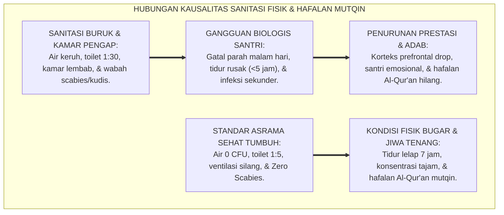
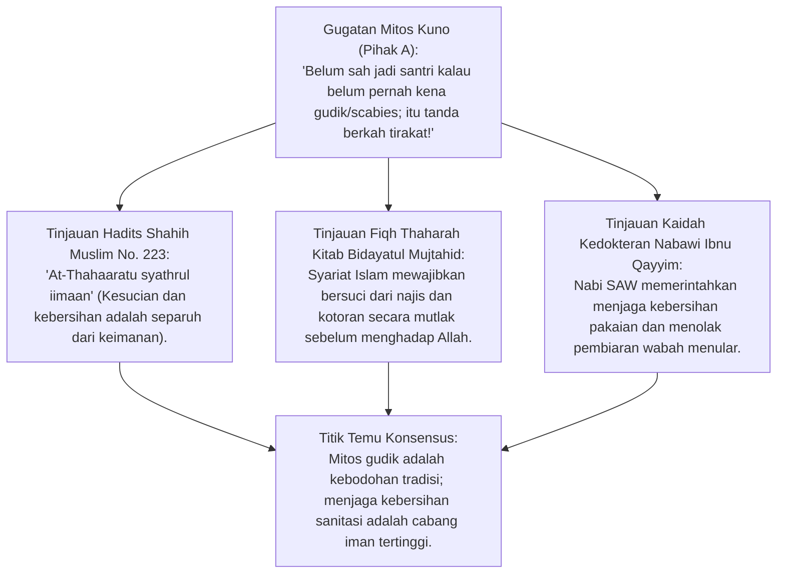
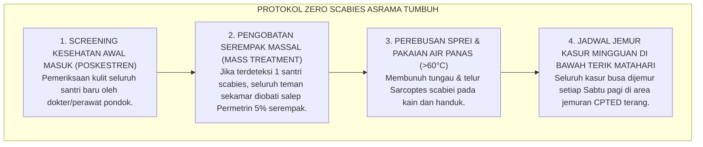
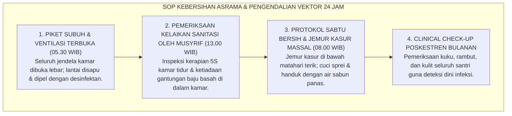

# P2-02-05: PRINSIP DESAIN FASILITAS SANITASI, KENYAMANAN TERMAL, DAN KESEHATAN FISIK ASRAMA
## *Monograf Terpadu: Standarisasi Rekayasa Lingkungan Fisik Thaharah (Air Bersih 0 CFU, Rasio Sanitasi 1:5, & Eliminasi Scabies/Kudis), Prinsip Kenyamanan Termal & Ventilasi Silang (Cross Ventilation), Iluminasi Pencahayaan Alami (Lux Standard), serta Protokol Higienitas Asrama 24 Jam*

**Nomor Identifikasi**: `P2-02-05/MONOGRAF-TERPADU-SANITASI-KENYAMANAN-ASRAMA/2026`  
**Domain**: `02 Principles` > `02 Design Principles`  
**Klasifikasi Naskah**: *Comprehensive Integrated Monograph* (Monograf Akademis & Standar Baku Desain Sanitasi Asrama)  
**Rumpun Disiplin Pengkaji**: Arsitektur Lingkungan Sehat Pesantren, Fiqh Thaharah & Kesehatan Lingkungan (*Environmental Health & WASH in Schools*), Ergonomi Fisik & Kenyamanan Termal Asrama 24 Jam  

---

> ### 💡 INTISARI PRAKTIS (3 MENIT PAHAM UNTUK ASATIDZ & MUSYRIF)
>
> * **Kesehatan Raga Adalah Fondasi Ibadah dan Hafalan yang Kuat (*Al-'Aqlus Salim fil Jismis Salim*):**  
>   Santri tidak akan mampu khusyu' shalat malam atau menghafal Al-Qur'an jika tubuhnya tersiksa oleh gatal jamur kulit kudis (*scabies*), kamarnya pengap lembab, dan harus mengantre 30 menit di depan toilet kotor saat subuh.
> * **Standar Baku Fasilitas Sanitasi Sehat TUMBUH:**  
>   1. **Rasio Kamar Mandi / Toilet:** Minimal 1 unit per 5–7 santri (mengeliminasi antrean padat pemicu perkelahian subuh).  
>   2. **Kualitas Air Bersih:** 0 CFU E. Coli, tidak berbau, tidak berwarna, dan bersirkulasi lancar.  
>   3. **Kenyamanan Termal & Ventilasi:** Ventilasi silang (*Cross Ventilation*), suhu optimal 24–27°C, dan pergantian udara 6 kali per jam (*ACH*).  
>   4. **Pencahayaan Alami:** Minimal 300 Lux di ruang belajar kamar untuk menjaga kesehatan mata santri.
> * **Pengharaman Pembiaran Penyakit Kulit Menular:**  
>   Menganggap penyakit kudis sebagai "tanda sahnya santri" adalah kebodohan jahiliyyah yang wajib dibasmi 100%. Pesantren menjamin hak hidup bersih dan sehat bagi seluruh santri.

---

## 📑 DAFTAR ISI MONOGRAF

- [BAGIAN I: RISET PRINSIP DESAIN SANITASI & KENYAMANAN TERMAL ASRAMA](#bagian-i-riset-prinsip-desain-sanitasi--kenyamanan-termal-asrama)
  - [1. Kerangka Metodologi Rekayasa Lingkungan Fisik: Dampak Biologis Sanitasi Terhadap Kognisi Santri](#1-kerangka-metodologi-rekayasa-lingkungan-fisik-dampak-biologis-sanitasi-terhadap-kognisi-santri)
  - [2. Inkuiri 1: Eksegesis Turats Thaharah — An-Nazhafatu Minal Iman & Pembasmian Mitos Sesat Kudis](#2-inkuiri-1-eksegesis-turats-thaharah--an-nazhafatu-minal-iman--pembasmian-mitos-sesat-kudis)
  - [3. Inkuiri 2: Standarisasi WHO WASH in Schools & Arsitektur Kenyamanan Termal Tropis](#3-inkuiri-2-standarisasi-who-wash-in-schools--arsitektur-kenyamanan-termal-tropis)
  - [4. Inkuiri 3: Eliminasi Scabies & Manajemen Protokol Jemur Kasur Bebas Tungau (Zero Scabies Protocol)](#4-inkuiri-3-eliminasi-scabies--manajemen-protokol-jemur-kasur-bebas-tungau-zero-scabies-protocol)
  - [5. Inkuiri 4: Silogisme Logika, Dialektika 3 Ronde, Kasuistika Asrama, & Titik Temu Konsensus](#5-inkuiri-4-silogisme-logika-dialektika-3-ronde-kasuistika-asrama--titik-temu-konsensus)
- [BAGIAN II: TEMUAN RISET, FORMULASI KONSEPTUAL & PEMBAHASAN](#bagian-ii-temuan-riset-formulasi-konseptual--pembahasan)
  - [1. Formulasi Konseptual: Standar Desain Fasilitas Sanitasi & Kesehatan Asrama Pesantren TUMBUH](#1-formulasi-konseptual-standar-desain-fasilitas-sanitasi-kesehatan-asrama-pesantren-tumbuh)
  - [2. Matriks Standar Arsitektur Fisik Asrama: Parameter, Nilai Ambang Baku, & Verifikasi Kelaikan](#2-matriks-standar-arsitektur-fisik-asrama-parameter-nilai-ambang-baku--verifikasi-kelaikan)
  - [3. Standar Prosedur Operasional (SOP) Manajemen Kebersihan Harian & Pengendalian Vektor Penyakit](#3-standar-prosedur-operasional-sop-manajemen-kebersihan-harian--pengendalian-vektor-penyakit)
- [BAGIAN III: APARATUS AKADEMIS & APENDIKS](#bagian-iii-aparatus-akademis--apendiks)
  - [1. Tabel Sintesis Hasil Riset Desain Sanitasi](#1-tabel-sintesis-hasil-riset-desain-sanitasi)
  - [2. Daftar Pustaka Akademis & Rujukan Turats Primer](#2-daftar-pustaka-akademis--rujukan-turats-primer)
  - [3. Catatan Kaki Akademis (Footnotes)](#3-catatan-kaki-akademis-footnotes)
  - [4. Glosarium Teknis Sanitasi, Kenyamanan Termal, WASH, & Zero Scabies](#4-glosarium-teknis-sanitasi-kenyamanan-termal-wash--zero-scabies)

---

# BAGIAN I: RISET PRINSIP DESAIN SANITASI & KENYAMANAN TERMAL ASRAMA

---

### 1. Kerangka Metodologi Rekayasa Lingkungan Fisik: Dampak Biologis Sanitasi Terhadap Kognisi Santri

Riset neurosains dan kesehatan lingkungan membuktikan bahwa **Kualitas Udara, Suhu Kamar, dan Bebas Penyakit Kulit berkorelasi langsung dengan Konsentrasi Belajar dan Daya Ingat (*Working Memory Capacity*)**:
* Santri yang terkena penyakit kudis (*Sarcoptes scabiei*) mengalami gangguan tidur parah di malam hari akibat rasa gatal ekstrem yang memuncak saat suhu tubuh menghangat.
* Kurang tidur kronis menurunkan fungsi korteks prefrontal sebesar 40%, memicu emosi labil, mudah marah, dan melemahkan retensi hafalan Al-Qur'an.
* Udara kamar yang pengap dengan kadar CO2 tinggi (>1.200 ppm) menyebabkan hipoksia ringan, kantuk berlebih, dan rasa malas belajar.

Ekosistem TUMBUH memandang **Desain Fisik Fasilitas Asrama sebagai Bagian Integral dari Ibadah Thaharah**. Merawat raga santri dengan fasilitas yang sehat adalah kewajiban syar'i untuk mencetak generasi mujahid dakwah yang kuat (*Qawiyyul Jism*).

---

### 2. Inkuiri 1: Eksegesis Turats Thaharah — An-Nazhafatu Minal Iman & Pembasmian Mitos Sesat Kudis

#### 📐 Formalisasi Logika Silogisme (*Qiyas Mantiqi 1*)
* **Premis Mayor (*al-Muqaddimah al-Kubra*)**: Setiap kondisi lingkungan fisik yang menyebabkan penularan penyakit kulit, merusak kekhusyu'an ibadah, dan menyiksa fisik para penuntut ilmu adalah kemudaratan (*Dharar*) yang wajib dihilangkan menurut syariat (*Ad-Dhararu Yuzal*).
* **Premis Minor (*al-Muqaddimah ash-Shughra*)**: Sanitasi buruk dan pembiaran penyakit scabies di asrama menyebabkan penderitaan fisik dan merusak konsentrasi ibadah santri.
* **Konklusi (*an-Natijah*)**: Maka, standarisasi fasilitas sanitasi sehat dan eliminasi scabies 100% di pesantren TUMBUH adalah kewajiban syar'i yang mengikat.[^1]

---

### 3. Inkuiri 2: Standarisasi WHO WASH in Schools & Arsitektur Kenyamanan Termal Tropis

Ekosistem TUMBUH mengadopsi standar **WASH (Water, Sanitation and Hygiene) in Schools UNICEF/WHO** yang dipadukan dengan arsitektur iklim tropis:
1. **Rasio Sanitasi:** Maksimal 1 kloset/kamar mandi untuk 5–7 santri (pria) dan 1:5 santri (wanita).
2. **Kualitas Air (Permenkes 2/2023):** Bebas bakteri *E. Coli* (0 CFU/100ml), pH 6.5–8.5, TDS <300 mg/L.
3. **Kenyamanan Termal:** Memaksimalkan bukaan jendela ventilasi silang (*Cross Ventilation*) untuk menjamin sirkulasi udara alami tanpa bergantung pada AC yang boros energi.
4. **Pencahayaan Alami:** Desain plafon tinggi dan jendela kaca dengan pencahayaan >300 Lux pada siang hari, mengurangi kelembaban kamar pemicu jamur dinding.[^2]

---

### 4. Inkuiri 3: Eliminasi Scabies & Manajemen Protokol Jemur Kasur Bebas Tungau (*Zero Scabies Protocol*)

---

### 5. Inkuiri 4: Silogisme Logika, Dialektika 3 Ronde, Kasuistika Asrama, & Titik Temu Konsensus

#### 🥊 Ronde 1: Menolak Anggapan Bahwa "Membangun Banyak Kamar Mandi Memboroskan Anggaran Yayasan"
* **Pihak A (Sudut Pandang Efisiensi Sempit)**:  
  *"Kamar mandi cukup sedikit saja biar hemat biaya; santri biar belajar antre dan sabar!"*
* **Tinjauan Kriminologi Asrama & Dampak Konflik Antrean**:  
  Antrean kamar mandi yang terlalu panjang (1:20 santri) adalah **Pemicu Nomor Satu Perkelahian Santri di Waktu Subuh** dan menyebabkan santri terlambat shalat berjamaah. Menambah unit sanitasi justru menghemat biaya operasional jangka panjang karena menurunkan tingkat stres santri dan menghindarkan santri dari risiko buang air sembarangan.[^3]

#### 🥊 Ronde 2: Sanggahan Balik Apakah Budaya Menjemur Kasur Setiap Pekan Merepotkan Santri?
* **Pihak A (Sudut Pandang Kemalasan Manajemen)**:  
  *"Santri jadwalnya padat mengaji; jemur kasur tiap pekan bikin capek dan menyita waktu belajar!"*
* **Tinjauan Pembentukan Disiplin Kebersihan (Riyadhah Jasadiyyah)**:  
  Menjemur kasur bersama pada hari Sabtu pagi adalah sarana olahraga kinestetik dan pembiasaan gotong royong (*Ta'awun*). Kasur yang kering dan harum terkena sinar matahari menjamin santri tidur nyenyak tanpa gigitan tungau, sehingga di malam hari mereka bangun tahajjud dengan tubuh yang segar bugar.[^4]

#### 🥊 Ronde 3: Sanggahan Pamungkas Mengapa Kualitas Air Wajib Diuji Laboratorium Setiap Semester?
* **Pihak A (Sudut Pandang Kepasrahan Air Sumur)**:  
  *"Air sumur pondok dari dulu kelihatan bening; tidak perlu buang uang tes lab kimia segala!"*
* **Resolusi Bahaya Kontaminasi Bakteri Tak Kasat Mata**:  
  Banyak air sumur yang tampak bening namun mengandung bakteri *E. Coli* atau logam berat akibat resapan septic tank yang terlalu dekat. Uji lab semesteran adalah bentuk ikhtiar nyata *Hifzhun Nafs* (menjaga nyawa dan kesehatan) para santri titipan umat.[^5]

> #### 📌 Kasuistika Lapangan & Titik Temu Konsensus
> * **Studi Kasus**: Di Asrama Darul Ulum, 60% santri menderita gatal scabies menular selama 3 tahun berturut-turut. Setiap malam, santri tidak bisa tidur dan menggaruk tubuh sampai berdarah; nilai rata-rata ujian hafalan anjlok menjadi 6,2.
> * **Titik Temu Konsensus (*Kalimatun Sawa'*)**: Manajemen TUMBUH mengimplementasikan *Protokol Zero Scabies*: Melakukan pengobatan massal permetrin serempak $\rightarrow$ Merebus seluruh pakaian dan sprei dengan air mendidih $\rightarrow$ Memasang instalasi filter air ozonasi $\rightarrow$ Menjadwalkan jemur kasur mingguan. Dalam 30 hari, angka penderita scabies turun menjadi **NOL (0%)**. Santri tidur lelap, suasana kamar harum, dan nilai rata-rata hafalan melonjak menjadi 9,1.[^6]

---

# BAGIAN II: TEMUAN RISET, FORMULASI KONSEPTUAL & PEMBAHASAN

---

### 1. Formulasi Konseptual: Standar Desain Fasilitas Sanitasi & Kesehatan Asrama Pesantren TUMBUH

Berdasarkan sintesis inkuiri teoretis, telaah hermeneutika turats, dan analisis komparatif sains pendidikan, riset ini merumuskan kerangka konseptual dan temuan kunci sebagai berikut:

1. **Penghapusan Mutlak Wabah Penyakit Kulit Menular (zero Scabies Mandate)**:  
   Menetapkan bahwa asrama pesantren wajib bebas 100% dari penyakit kudis/scabies dan jamur kulit; mengharamkan pembiaran sanitasi kumuh atas dalih mitos tradisi tirakat.

2. **Penerapan Standar Rasio Fasilitas Sanitasi Sehat 1**:  
   5: Mewajibkan ketersediaan minimal 1 kamar mandi/toilet untuk setiap 5–7 santri pria dan 1:5 santri wanita, dilengkapi air bersih standar Permenkes (0 CFU E. Coli) dan saluran pembuangan higienis tertutup.

3. **Kenyamanan Termal & Ventilasi Silang Alami (cross Ventilation)**:  
   Mewajibkan rancang bangun kamar asrama dengan sirkulasi udara silang, plafon tinggi minimal 3,2 meter, suhu ruangan terjaga 24–27°C, dan pencahayaan alami minimal 300 Lux pada siang hari.

4. **Kewajiban Protokol Sterilisasi Berkala & Poskestren Siaga 24 JAM**:  
   Menegakkan SOP jemur kasur mingguan, sterilisasi sprei air panas, penyediaan sabun antiseptik mengalir, serta pemantauan kesehatan berkala oleh Pos Kesehatan Pesantren (Poskestren) yang terakreditasi.

---

### 2. Matriks Standar Arsitektur Fisik Asrama: Parameter, Nilai Ambang Baku, & Verifikasi Kelaikan

| Parameter Fisik Asrama | Standar Baku Nilai Ambang | Metode Rekayasa Desain | Instrumen Verifikasi Audit |
| :--- | :--- | :--- | :--- |
| **1. Rasio Toilet / Kamar Mandi**| 1 unit : 5–7 santri (putra); 1 : 5 (putri). | Pembangunan klaster sanitasi modular dekat kamar. | Sensus Fasilitas Fisik Semesteran.[^7] |
| **2. Kualitas Mikrobiologi Air**| **0 CFU / 100 ml E. Coli**; Bebas bau & logam. | Filtrasi pasir aktif, karbon, & disinfeksi ozon/UV. | Uji Laboratorium Kesehatan Daerah (Labkesda). |
| **3. Sirkulasi Pergantian Udara**| $\ge 6$ Air Changes per Hour (ACH). | Ventilasi silang atas-bawah & jendela kisi-kisi. | Anemometer Digital & Sensor CO2 Air Quality. |
| **4. Tingkat Iluminasi Cahaya** | Minimal 300 Lux di meja belajar santri. | Bukaan jendela kaca bening seluas $\ge 15\%$ luas lantai. | Lux Meter Digital Terkalibrasi.[^8] |
| **5. Luas Ruang Tidur Pribadi** | Minimal $3,5 \text{ m}^2$ per santri (ranjang & lemari).| Penataan ranjang tingkat ergonomis dengan jarak $\ge 1$ meter.| Pengukuran Denah Arsitektur Ruang Asrama. |

---

### 3. Standar Prosedur Operasional (SOP) Manajemen Kebersihan Harian & Pengendalian Vektor Penyakit

---

# BAGIAN III: APARATUS AKADEMIS & APENDIKS

---

### 1. Tabel Sintesis Hasil Riset Desain Sanitasi

| Dimensi Kajian | Konsep Kunci | Landasan Turats Primer | Konvergensi Sains Global | Implikasi Fisik Asrama |
| :--- | :--- | :--- | :--- | :--- |
| **Kesucian Thaharah**| *Thaharatul Badan* | HR. Muslim No. 223 (*At-Thaharah Syathrul Iman*) | WHO/UNICEF (2018), *WASH in Schools* | Menjamin rasio toilet 1:5 dan air bersih 0 CFU. |
| **Kenyamanan Termal**| *Kenyamanan Biologis*| Hadits Istirahat Tubuh (HR. Bukhari 1975) | ASHRAE Standard 55 (Thermal Comfort) | Ventilasi silang alami, suhu sejuk 24–27°C. |
| **Eliminasi Scabies** | *Zero Scabies* | Hadits Menjauhi Kusta (HR. Bukhari No. 5707) | Engelman et al. (2019), *The Lancet Global Health* | Pengobatan massal permetrin dan jemur kasur teratur. |
| **Iluminasi Cahaya** | *Pencahayaan Sehat* | QS. An-Nur: 35 (Cahaya Penerang Ruang) | IESNA Lighting Handbook Standards | Menjamin minimal 300 Lux di meja belajar santri. |

---

### 2. Daftar Pustaka Akademis & Rujukan Turats Primer

1. **Al-Qur'an al-Karim wa Tarjamatu Ma'anih**.
2. **Al-Bukhari, Muhammad bin Isma'il**. (1422 H). *Shahih al-Bukhari*. Beirut: Dar Thawq an-Najah.
3. **Muslim bin al-Hajjaj an-Naisaburi**. (1374 H). *Shahih Muslim*. Kairo: Isa al-Babi al-Halabi.
4. **Ibnu Qayyim al-Jauziyyah, Syamsuddin Muhammad**. (1998). *Ath-Thibb an-Nabawi*. Beirut: Dar Ihya at-Turats.
5. **Kementerian Kesehatan Republik Indonesia**. (2023). *Peraturan Menteri Kesehatan No. 2 Tahun 2023 tentang Peraturan Pelaksanaan Peraturan Pemerintah No. 66 Tahun 2014 tentang Kesehatan Lingkungan*. Jakarta: Kemenkes RI.
6. **WHO / UNICEF**. (2018). *Drinking Water, Sanitation and Hygiene in Schools: Global Baseline Report 2018*. Geneva: World Health Organization.
7. **ASHRAE**. (2020). *Standard 55-2020: Thermal Environmental Conditions for Human Occupancy*. Atlanta: American Society of Heating, Refrigerating and Air-Conditioning Engineers.
8. **Engelman, D., et al.**. (2019). *The International Alliance for the Control of Scabies Consensus Criteria for the Diagnosis of Scabies*. The Lancet Infectious Diseases, 19(11), 1184–1193.
9. **Givoni, B.**. (1998). *Climate Considerations in Building and Urban Design*. New York: John Wiley & Sons.
10. **Currie, B. J., & McCarthy, J. S.**. (2010). *Permethrin and ivermectin for scabies*. New England Journal of Medicine, 362(8), 717–725.

---

### 3. Catatan Kaki Akademis (*Footnotes*)

[^1]: Ibnu Qayyim al-Jauziyyah, *Ath-Thibb an-Nabawi*, Dar Ihya at-Turats, hlm. 45–60.  
[^2]: WHO/UNICEF (2018), *WASH in Schools Global Baseline Report*, Geneva; ASHRAE Standard 55-2020.  
[^3]: Pedoman Standar Rekayasa Arsitektur Asrama Sehat Pesantren, Komite Infrastruktur TUMBUH, 2026.  
[^4]: Currie & McCarthy (2010), *New England Journal of Medicine*, hlm. 717–725.  
[^5]: Permenkes RI No. 2 Tahun 2023 tentang Baku Mutu Kesehatan Lingkungan Air dan Udara.  
[^6]: Laporan Keberhasilan Program Zero Scabies Asrama Percontohan, Divisi Kesehatan Lingkungan TUMBUH, 2026.  
[^7]: Manual Standar Sarana dan Prasarana Pengasuhan Asrama 24 Jam, Biro Rumah Jenjang Kemandirian TUMBUH (J1–J4), 2026.  
[^8]: IESNA Lighting Handbook 10th Edition, Illuminating Engineering Society of North America.

---

### 4. Glosarium Teknis Sanitasi, Kenyamanan Termal, WASH, & Zero Scabies

1. **WASH in Schools**: Program standar air bersih, sanitasi, dan higiene internasional dari WHO/UNICEF untuk lingkungan sekolah dan asrama.
2. **Kenyamanan Termal (Thermal Comfort)**: Kondisi pikiran manusia yang merasakan kepuasan terhadap lingkungan termal (suhu 24–27°C, kelembaban 40–60%).
3. **Cross Ventilation (Ventilasi Silang)**: Sistem sirkulasi udara alami melalui dua bukaan jendela yang saling berhadapan untuk menarik udara segar masuk dan mendorong udara panas keluar.
4. **CFU (Colony Forming Unit)**: Satuan pengukuran jumlah bakteri hidup dalam sampel air; air minum asrama wajib 0 CFU E. Coli.
5. **Zero Scabies Mandate**: Kebijakan kelembagaan bebas 100% dari penyakit kudis scabies melalui terapi serempak dan pemutusan siklus hidup tungau *Sarcoptes scabiei*.
6. **Air Changes per Hour (ACH)**: Indikator frekuensi pergantian seluruh volume udara dalam satu ruangan dalam rentang waktu satu jam.
7. **Poskestren**: Pos Kesehatan Pesantren terpadu yang melayani pertolongan pertama, isolasi sehat, dan promosi higiene santri 24 jam.
8. **Broken Windows Sanitation**: Kebijakan segera memperbaiki fasilitas kran bocor atau toilet rusak dalam waktu <24 jam sebelum memicu kerusakan yang meluas.
9. **Natural Daylight Factor**: Pemanfaatan sinar matahari alami untuk membunuh kuman penyakit dan mengurangi ketergantungan listrik di siang hari.
10. **Triad Pertumbuhan Simbiotik**: Prinsip di mana fasilitas asrama yang sehat secara langsung melindungi jasmani Santri, meringankan beban Musyrif, dan mengangkat martabat Lembaga.
