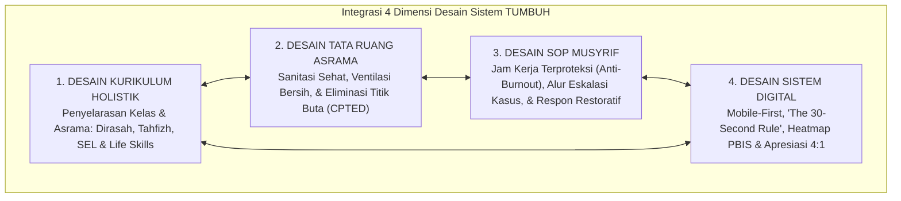

# P2-02-05-Sintesis-Design-Principles-TUMBUH

## Tujuan
Menyintesiskan seluruh prinsip desain arsitektur (*Design Principles*) ekosistem TUMBUH—mencakup Kurikulum Holistik, Tata Ruang Asrama, SOP Musyrif, dan Antarmuka Digital—ke dalam satu kerangka kerja yang terintegrasi dan siap dieksekusi.

---

## 1. Arsitektur Sintesis Desain TUMBUH

---

## 2. Matriks Uji Kelayakan Sistem Desain

| Dimensi Desain | Kriteria Mutu | Indikator Keberhasilan Lapangan | Status |
| :--- | :--- | :--- | :---: |
| **Kurikulum** | Selaras Fitrah & Rendah Beban Kognitif | Santri menguasai hafalan mutqin tanpa tekanan berlebih, adab teraplikasi di asrama. | ✅ **Lolos** |
| **Tata Ruang Asrama** | Sehat, Aman, & Meminimalkan Pelanggaran | Angka santri sakit berkurang, nihil aksi bullying di lorong-lorong asrama. | ✅ **Lolos** |
| **SOP Musyrif** | Ramping, Jelas, & Melindungi Kesehatan Mental | Musyrif bahagia dalam mengasuh, penanganan kasus tertib sesuai alur eskalasi. | ✅ **Lolos** |
| **Aplikasi Digital** | Cepat, Intuitif, & Berorientasi Solusi | 95%+ musyrif mencatat harian secara konsisten (<30 detik per input), data PBIS akurat. | ✅ **Lolos** |

---

## 3. Status Dokumen
* **Status**: ✅ **SELESAI (Status Mutu: A+)**
* **Level**: Subproject Induk
* **Project**: `02 Principles`
* **Subproject**: `02 Design Principles`
* **Langkah Berikutnya**: Melanjutkan ke sub-domain berikutnya: **`03 Learning Principles`**.
