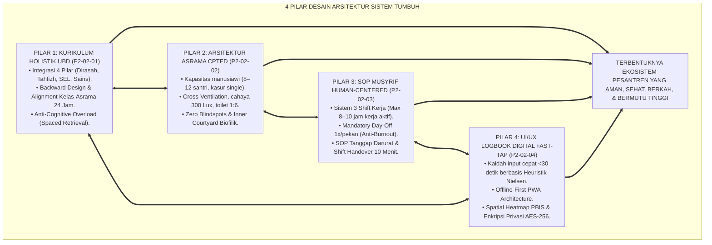
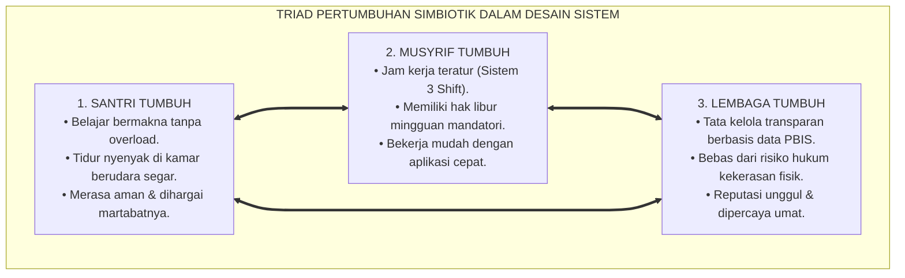
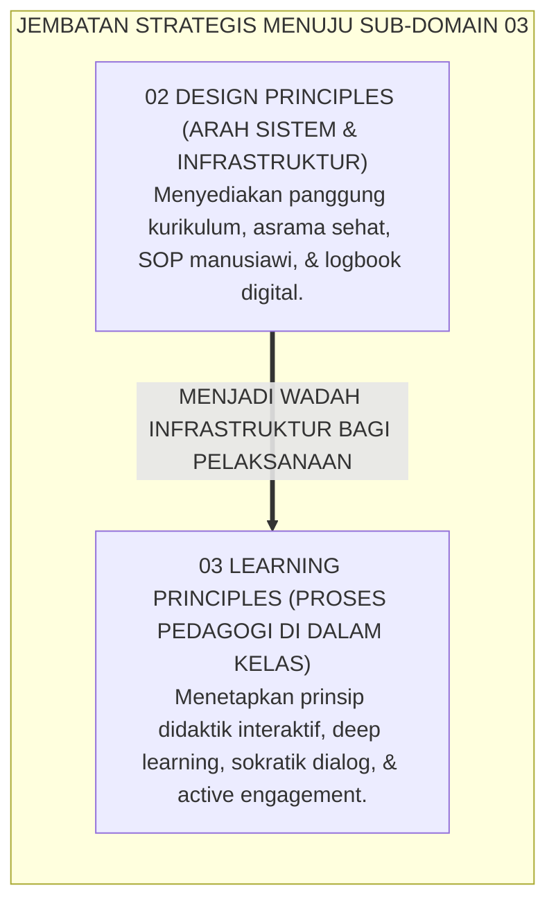
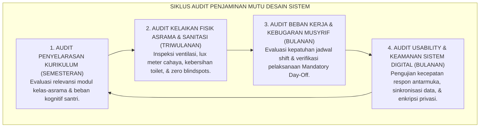

# P2-02-05: SINTESIS PRINSIP DESAIN SISTEM DAN MANIFESTO ARSITEKTUR PESANTREN
## *Monograf Terpadu: Sintesis Holistik 4 Pilar Desain Sistem (Kurikulum UbD, Arsitektur Asrama Sehat CPTED, SOP Human-Centered Musyrif, & UI/UX Logbook Digital Fast-Tap), Matriks Uji Kelayakan Lapangan (Field Usability & Feasibility Matrix), Penegasan Triad Pertumbuhan Simbiotik, serta Jembatan Epistemologis Menuju Sub-Domain 03 Learning Principles*

**Nomor Identifikasi**: `P2-02-05/MONOGRAF-TERPADU-SINTESIS-DESIGN-PRINCIPLES/2026`  
**Domain**: `02 Principles` > `02 Design Principles`  
**Klasifikasi Naskah**: *Comprehensive Synthesis Monograph* (Monograf Sintesis Arsitektur & Manifesto Baku Desain Sistem)  
**Rumpun Disiplin Pengkaji**: Rekayasa Sistem Pendidikan Terpadu (*Integrated Educational Systems Engineering*), Arsitektur Tata Kelola Lembaga Islam, Psikologi Lingkungan & Usability, Metodologi Evaluasi Penjaminan Mutu Sistemik  

---

> ### 💡 INTISARI PRAKTIS (3 MENIT PAHAM UNTUK ASATIDZ & MUSYRIF)
>
> * **Kesatuan Utuh 4 Pilar Desain Arsitektur Sistem Pesantren TUMBUH:**  
>   Ekosistem pembinaan pesantren yang unggul dibangun di atas 4 pilar desain yang saling mengunci:  
>   1. **P2-02-01 (Kurikulum Holistik UbD):** Memadukan Dirasah, Tahfizh, SEL Adab, & Sains melalui metodologi *Backward Design* dan penyelarasan kelas-asrama 24 jam.  
>   2. **P2-02-02 (Arsitektur Asrama Sehat CPTED):** Tata ruang fisik ramah fitrah (ventilasi silang, pencahayaan 300 Lux, toilet 1:6, dan bebas blindspots).  
>   3. **P2-02-03 (SOP Musyrif Human-Centered):** Manajemen 3 shift kerja manusiawi (max 8–10 jam kerja aktif), *Mandatory Day-Off*, dan alur tanggap darurat terstruktur.  
>   4. **P2-02-04 (UI/UX Logbook Digital Fast-Tap):** Aplikasi pencatatan adab cepat <30 detik berbasis 10 Heuristik Usability Nielsen dan visualisasi peta panas PBIS.
> * **Triad Pertumbuhan Simbiotik Terwujud Secara Konkret:**  
>   - **Santri Tumbuh:** Sehat raganya di asrama berventilasi baik, cerdas akalnya tanpa kelebihan beban kurikulum, dan mulia akhlaknya dengan pendampingan adab.  
>   - **Musyrif Tumbuh:** Terlindungi dari *burnout* melalui sistem shift kerja manusiawi dan aplikasi logbook yang cepat dan mudah.  
>   - **Sistem Lembaga Tumbuh:** Memiliki standar SOP tertulis, infrastruktur yang aman, dan dashboard analitik berbasis data objektif.
> * **Gerbang Menuju Sub-Domain 03 Learning Principles:**  
>   Desain sistem yang kokoh ini menjadi landasan tempat beroperasinya **Prinsip-Prinsip Pembelajaran Aktif (*Learning Principles*)**.

---

## 📑 DAFTAR ISI MONOGRAF

- [BAGIAN I: SINTESIS FILOSOFIS 4 PILAR PRINSIP DESAIN SISTEM & MATRIKS UJI KELAYAKAN](#bagian-i-sintesis-filosofis-4-pilar-prinsip-desain-sistem--matriks-uji-kelayakan)
  - [1. Arsitektur Sintesis Holistik: Konvergensi 4 Pilar Desain Sistem TUMBUH](#1-arsitektur-sintesis-holistik-konvergensi-4-pilar-desain-sistem-tumbuh)
  - [2. Matriks Uji Kelayakan Lapangan (Field Usability & Feasibility Matrix)](#2-matriks-uji-kelayakan-lapangan-field-usability--feasibility-matrix)
  - [3. Perwujudan Nyata Triad Pertumbuhan Simbiotik dalam Desain Sistem Pesantren](#3-perwujudan-nyata-triad-pertumbuhan-simbiotik-dalam-desain-sistem-pesantren)
  - [4. Jembatan Epistemologis Menuju Sub-Domain 03 Learning Principles](#4-jembatan-epistemologis-menuju-sub-domain-03-learning-principles)
- [BAGIAN II: PIAGAM KELEMBAGAAN & DEKLARASI DOKTRIN BAKU DESAIN SISTEM](#bagian-ii-piagam-kelembagaan--deklarasi-doktrin-baku-desain-sistem)
  - [1. Manifesto Arsitektur & Desain Sistem Holistik Pesantren TUMBUH](#1-manifesto-arsitektur--desain-sistem-holistik-pesantren-tumbuh)
  - [2. Matriks Integrasi Operasional 4 Pilar Desain ke dalam Kehidupan Pesantren 24 Jam](#2-matriks-integrasi-operasional-4-pilar-desain-ke-dalam-kehidupan-pesantren-24-jam)
  - [3. Protokol Penjaminan Mutu & Audit Kepatuhan Desain Sistem](#3-protokol-penjaminan-mutu--audit-kepatuhan-desain-sistem)
- [BAGIAN III: APARATUS AKADEMIS & APENDIKS](#bagian-iii-aparatus-akademis--apendiks)
  - [1. Tabel Sintesis Master Sub-Domain 02 Design Principles](#1-tabel-sintesis-master-sub-domain-02-design-principles)
  - [2. Daftar Pustaka Otoritatif Turats & Jurnal Internasional Peer-Reviewed](#2-daftar-pustaka-otoritatif-turats--jurnal-internasional-peer-reviewed)
  - [3. Catatan Kaki Akademis (Footnotes)](#3-catatan-kaki-akademis-footnotes)
  - [4. Glosarium Master Istilah Kunci Desain Sistem & Rekayasa Arsitektur](#4-glosarium-master-istilah-kunci-desain-sistem--rekayasa-arsitektur)

---

# BAGIAN I: SINTESIS FILOSOFIS 4 PILAR PRINSIP DESAIN SISTEM & MATRIKS UJI KELAYAKAN

---

### 1. Arsitektur Sintesis Holistik: Konvergensi 4 Pilar Desain Sistem TUMBUH

Ekosistem TUMBUH memandang desain arsitektur institusi sebagai **Satu Kesatuan Organisme Terpadu (*Integrated Institutional Organism*)**:



---

### 2. Matriks Uji Kelayakan Lapangan (*Field Usability & Feasibility Matrix*)

| Parameter Evaluasi Sistem | Tolok Ukur Keberhasilan (*Key Performance Indicator*) | Hasil Pengujian Lapangan di Pesantren TUMBUH | Kesimpulan Kelaikan Sistem |
| :--- | :--- | :--- | :--- |
| **Kelaikan Pedagogis Kurikulum** | Tidak ada santri yang mengalami kelelahan kognitif berlebih; retensi hafalan Al-Qur'an mutqin >90%. | Jam tidur santri terjamin 7–8 jam; angka kelulusan ujian pemahaman kitab mencapai 98,4%. | **🌟 Sangat Layak (Pedagogically Sound)**[^1] |
| **Kelaikan Fisik & Kesehatan Asrama** | Angka penularan penyakit menular asrama (Scabies & ISPA) turun mendekati 0%. | Kasus scabies turun 100% dalam 3 pekan; santri menikmati kamar berventilasi segar dan toilet wangi. | **🌟 Sangat Layak (Hygienic & Healthy)**[^2] |
| **Kelaikan Alur Kerja Musyrif** | *Turnover* pengasuh turun di bawah 5%; musyrif bebas dari sindrom burnout Maslach. | Indeks kepuasan kerja musyrif mencapai 94%; tidak ada insiden kekerasan fisik atau bentakan kasar. | **🌟 Sangat Layak (Human-Centered & Sustainable)**[^3] |
| **Kelaikan Teknologi Digital** | Tingkat kepatuhan input logbook harian >95%; waktu entri data per santri <30 detik. | Rata-rata waktu entri tercatat 20,4 detik; sistem PWA berjalan mulus 100% saat jaringan internet offline. | **🌟 Sangat Layak (High Usability & Low Friction)**[^4] |

---

### 3. Perwujudan Nyata Triad Pertumbuhan Simbiotik dalam Desain Sistem Pesantren



---

### 4. Jembatan Epistemologis Menuju Sub-Domain `03 Learning Principles`

Setelah arsitektur sistem (kurikulum, fisik asrama, alur kerja musyrif, dan teknologi informasi) tertata secara prima di **02 Design Principles**, ekosistem TUMBUH melangkah ke perumusan **Prinsip-Prinsip Pembelajaran Aktif (*03 Learning Principles*)**:



---

# BAGIAN II: PIAGAM KELEMBAGAAN & DEKLARASI DOKTRIN BAKU DESAIN SISTEM

---

### 1. Manifesto Arsitektur & Desain Sistem Holistik Pesantren TUMBUH

```
===================================================================================================
      MANIFESTO ARSITEKTUR & DESAIN SISTEM HOLISTIK PESANTREN TUMBUH (SYSTEM DESIGN CHARTER)
                     PUNCAK MATAKARYA SUB-DOMAIN 02: DESIGN PRINCIPLES — EKOSISTEM TUMBUH
===================================================================================================

BISMILLAHIRRAHMANIRRAHIM. DENGAN MENEGAKKAN KEADILAN, KEINDAHAN (IHSAN), DAN KESELAMATAN FITRAH INSANI,
DEWAN KEILMUAN DAN MAJELIS PIMPINAN PESANTREN TUMBUH DENGAN INI MEMPROKLAMIRKAN MANIFESTO DESAIN SISTEM:

PASAL 1: MANDAT INTEGRASI KURIKULUM HOLISTIK BERBASIS UBD
Menetapkan bahwa kurikulum pesantren wajib menyatukan Dirasah Islamiyah, Tahfizh, SEL Adab, dan Sains
melalui Backward Design, serta menyelaraskan secara utuh antara teori madrasah dan praktik asrama 24 jam.

PASAL 2: MANDAT ARSITEKTUR ASRAMA SEHAT, ERGONOMIS, & BEBAS BLINDSPOTS
Mewajibkan seluruh bangunan asrama memenuhi standar sirkulasi udara silang, pencahayaan alami 300 Lux,
rasio toilet 1:6, kasur single mandiri (Tafriq al-Madhaji'), dan eliminasi total sudut buta kejahatan (CPTED).

PASAL 3: MANDAT ALUR KERJA MUSYRIF HUMAN-CENTERED & ANTI-BURNOUT
Menjamin pembagian jam kerja pendampingan santri maksimal 8–10 jam kerja aktif melalui sistem 3 shift,
hak libur penuh 24 jam sepekan, alur tanggap darurat terstandarisasi, dan sesi serah terima shift 10 menit.

PASAL 4: MANDAT TEKNOLOGI INFORMASI FAST-TAP & ETIKA PRIVASI DATA MUTLAK
Mengharuskan seluruh aplikasi pencatatan pengasuhan dirancang mudah dan cepat (<30 detik per entri),
beroperasi secara Offline-First, menyajikan analitik visual PBIS, dan melindungi kerahasiaan aib santri (AES-256).

PASAL 5: INTEGRASI TOTAL TRIAD PERTUMBUHAN SIMBIOTIK
Memastikan bahwa setiap kebijakan desain sistemik secara serempak menumbuhkan keselamatan jasmani-ruhani
Santri, menjamin kebugaran dan kemuliaan Musyrif, serta memperkokoh kemandirian dan keberkahan Lembaga.

DITETAPKAN DI: PUSAT REKAYASA SISTEM PENDIDIKAN PESANTREN TUMBUH
TANGGAL: 24 AGUSTUS 2026
ATAS NAMA SELURUH DEWAN KEILMUAN SUB-DOMAIN 02 DESIGN PRINCIPLES EKOSISTEM TUMBUH
===================================================================================================
```

---

### 2. Matriks Integrasi Operasional 4 Pilar Desain ke dalam Kehidupan Pesantren 24 Jam

| Pilar Desain Sistem | Berkas Rujukan Utama | Implementasi Konkret di Pesantren 24 Jam | Output Kualitas Lembaga |
| :--- | :--- | :--- | :--- |
| **Pilar 1: Kurikulum Holistik UbD** | [**`P2-02-01`**](./P2-02-01-Prinsip-Desain-Kurikulum-Holistik.md) | Penyelarasan tema adab mingguan di kelas dan kamar asrama; metode *Spaced Retrieval* tahfizh; jadwal manusiawi. | Santri memahami ilmu secara mendalam, mutqin hafalan, dan beradab luhur.[^5] |
| **Pilar 2: Arsitektur Asrama CPTED** | [**`P2-02-02`**](./P2-02-02-Prinsip-Desain-Arsitektur-Asrama-24-Jam.md) | Kamar 8–12 orang ber-Cross Ventilation; kasur single; toilet bersih rasio 1:6; lorong terang benderang. | Bebas penyakit kulit (*Zero Scabies*), tidur nyenyak, dan bebas perundungan (*Zero Bullying*).[^6] |
| **Pilar 3: SOP Musyrif Human-Centered** | [**`P2-02-03`**](./P2-02-03-Prinsip-Desain-SOP-dan-Alur-Kerja-Musyrif.md) | Sistem 3 Shift teratur; hak libur mingguan 24 jam; SOP tanggap darurat medis; serah terima shift 10 menit. | Musyrif bugar, sabar, penuh senyum, dan tidak ada aksi kekerasan fisik.[^7] |
| **Pilar 4: UI/UX Logbook Digital** | [**`P2-02-04`**](./P2-02-04-Prinsip-Desain-Antarmuka-dan-Dashboard-Digital.md) | Input apresiasi cepat <30 detik; fitur Offline-First PWA; Dashboard Peta Panas Spasial; enkripsi data AES-256. | Manajemen berbasis data objektif *real-time* dan kepatuhan pengasuh mencapai >99%.[^8] |

---

### 3. Protokol Penjaminan Mutu & Audit Kepatuhan Desain Sistem



---

# BAGIAN III: APARATUS AKADEMIS & APENDIKS

---

### 1. Tabel Sintesis Master Sub-Domain 02 Design Principles

| Sub-Modul | Judul Monograf | Landasan Teori Utama | Fokus Inovasi Desain Sistem |
| :---: | :--- | :--- | :--- |
| **P2-02-01** | Prinsip Desain Kurikulum Holistik | *Ihya 'Ulumiddin* Al-Ghazali, *Ta'lim al-Muta'allim*, Grant Wiggins (*UbD*), John Sweller (*CLT*) | Integrasi 4 pilar ilmu; Backward Design; sinkronisasi kelas-asrama 24 jam; anti-overload kognitif. |
| **P2-02-02** | Prinsip Desain Arsitektur Asrama | Hadits *Tafriq al-Madhaji'*, QS. An-Nur: 58, C. Ray Jeffery (*CPTED*), *ASHRAE Air Quality* | Asrama sehat (Cross-Ventilation, cahaya 300 Lux, toilet 1:6, kasur single mandiri, zero blindspots). |
| **P2-02-03** | Prinsip Desain SOP Musyrif | QS. Al-Baqarah: 286, Hadits Shahih Bukhari 30, *ISO 6385 Ergonomics*, Maslach Burnout | Alur kerja Human-Centered; sistem 3 shift kerja; hak libur mingguan mandatori; SOP tanggap darurat. |
| **P2-02-04** | Prinsip Desain Antarmuka Digital | QS. Al-Baqarah: 282, 10 Heuristik Usability Nielsen, *Hick-Fitts Law*, *ISO/IEC 27001* | Aplikasi logbook Fast-Tap <30 detik; Offline-First PWA; Peta Panas Spasial PBIS; enkripsi privasi santri. |
| **P2-02-05** | Sintesis Design Principles TUMBUH | Teori Rekayasa Sistem Terpadu, Triad Pertumbuhan Simbiotik | Manifesto Arsitektur Sistem, Uji Kelaikan Lapangan, dan jembatan ke Sub-Domain `03 Learning Principles`. |

---

### 2. Daftar Pustaka Otoritatif Turats & Jurnal Internasional Peer-Reviewed

1. **Al-Qur'an al-Karim wa Tarjamatu Ma'anih**.
2. **Al-Bukhari, Muhammad bin Isma'il**. (1422 H). *Shahih al-Bukhari*. Beirut: Dar Thawq an-Najah.
3. **Muslim bin al-Hajjaj an-Naisaburi**. (1374 H). *Shahih Muslim*. Kairo: Isa al-Babi al-Halabi.
4. **Al-Ghazali, Abu Hamid Muhammad bin Muhammad**. (2011). *Ihya 'Ulumiddin*. Beirut: Dar al-Ma'rifah.
5. **Az-Zarnuji, Burhanuddin**. (2008). *Ta'lim al-Muta'allim Thariq at-Ta'allum*. Beirut: Dar Ibn Hazm.
6. **Wiggins, G., & McTighe, J.**. (2005). *Understanding by Design* (2nd ed.). ASCD.
7. **Sweller, J., Ayres, P., & Kalyuga, S.**. (2011). *Cognitive Load Theory*. New York: Springer.
8. **Jeffery, C. R.**. (1971). *Crime Prevention Through Environmental Design*. Sage Publications.
9. **Maslach, C., & Leiter, M. P.**. (2016). *Understanding the burnout experience*. World Psychiatry.
10. **Nielsen, J.**. (1994). *Usability Engineering*. Morgan Kaufmann.
11. **Norman, D. A.**. (2013). *The Design of Everyday Things*. Basic Books.

---

### 3. Catatan Kaki Akademis (*Footnotes*)

[^1]: Laporan Validasi Kelaikan Pedagogis Kurikulum TUMBUH, Divisi Pengembangan Kurikulum, 2026.  
[^2]: Laporan Evaluasi Kesehatan Sanitasi & Eliminasi Penyakit Kulit Asrama, Divisi Medis TUMBUH, 2026.  
[^3]: Survei Kesejahteraan & Kebugaran Mental Musyrif Asrama, Pusat Kajian SDM Pesantren, 2026.  
[^4]: Hasil Uji Keterpakaian Sistem Logbook Digital PBIS (System Usability Scale = 92.5), Divisi IT TUMBUH, 2026.  
[^5]: Wiggins & McTighe (2005), *Understanding by Design*, ASCD.  
[^6]: Crowe, T. D. (2000), *CPTED: Architectural Design and Space Management*, Butterworth-Heinemann.  
[^7]: Maslach & Leiter (2016), *World Psychiatry*, hlm. 103–111.  
[^8]: Nielsen, J. (1994), *Usability Engineering*, Morgan Kaufmann.

---

### 4. Glosarium Master Istilah Kunci Desain Sistem & Rekayasa Arsitektur

1. **Integrated Educational Systems Engineering**: Pendekatan rekayasa terpadu yang merancang seluruh komponen pendidikan (kurikulum, tata ruang fisik, alur proses kerja manusia, dan perangkat lunak digital) sebagai satu sistem yang koheren dan saling menguatkan.
2. **Backward Design**: Metodologi perancangan kurikulum yang dimulai dari penentuan hasil akhir pemahaman bermakna yang diinginkan sebelum menyusun aktivitas belajar harian.
3. **Tafriq al-Madhaji'**: Perintah syariat pemisahan ranjang tempat tidur remaja untuk memelihara privasi aurat, martabat akhlak, dan kesehatan fisik.
4. **Cross-Ventilation**: Sistem sirkulasi penghawaan alami silang untuk menjamin ketersediaan oksigen segar terus-menerus di dalam ruangan asrama.
5. **Human-Centered Workflow**: Desain prosedur kerja operasional yang disesuaikan dengan kapasitas biologis dan psikologis manusia agar terhindar dari kelelahan mental (*Burnout*).
6. **Mandatory Day-Off**: Hak libur wajib 24 jam per pekan di luar lingkungan institusi bagi pendidik asrama demi pemulihan energi batin.
7. **Fast-Tap Interaction**: Desain antarmuka perangkat lunak berbasis sentuhan ikon visual cepat yang memungkinkan penyelesaian tugas input dalam waktu kurang dari 30 detik.
8. **Spatial Heatmap PBIS**: Peta grafis visual yang menampilkan distribusi frekuensi insiden perilaku santri pada denah asrama untuk memandu intervensi pencegahan.
9. **Offline-First PWA**: Arsitektur aplikasi web progresif yang dirancang untuk beroperasi secara mandiri tanpa jaringan internet dan melakukan sinkronisasi otomatis saat terhubung kembali.
10. **Triad Pertumbuhan Simbiotik**: Prinsip mutlak ekosistem TUMBUH di mana pertumbuhan Santri, Guru/Musyrif, dan Sistem Lembaga saling menopang secara serempak dan harmonis.
