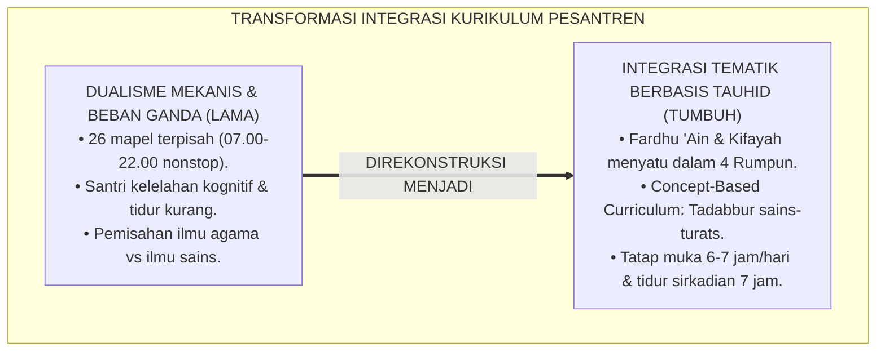
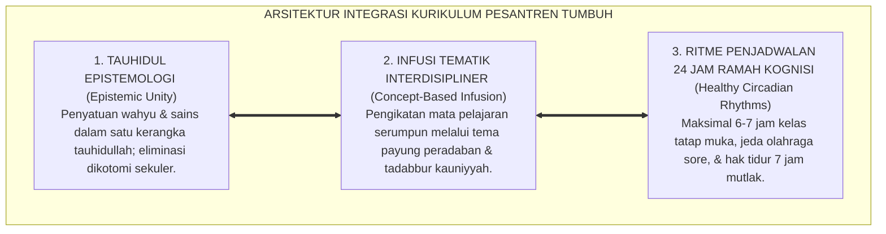

# P2-02-06: PRINSIP DESAIN INTEGRASI KURIKULUM NASIONAL DAN TURATS PESANTREN (NATIONAL & PESANTREN CURRICULAR INTEGRATION)
## *Monograf Riset Akademik: Penyatuan Epistemologis Kurikulum Fardhu 'Ain (Turats Kitab Kuning & Tahfizh) dan Fardhu Kifayah (Sains & Kurikulum Nasional), Integrasi Interdisipliner (Concept-Based Curriculum), Serta Eliminasi Beban Ganda di Pesantren 24 Jam*

**Nomor Identifikasi**: `P2-02-06/MONOGRAF-RISET-INTEGRASI-KURIKULUM/2026`  
**Domain**: `02 Principles` > `02 Design Principles` (Prinsip Desain 06: *Curricular Integration*)  
**Klasifikasi Naskah**: *Academic Research Monograph* (Monograf Riset Akademik Prinsip Desain)  
**Rumpun Disiplin Pengkaji**: Desain Kurikulum Terpadu Islam (*Islamic Integrated Curriculum*), Falsafah Ilmu Fardhu 'Ain & Kifayah Al-Ghazali, Manajemen Beban Kognitif Pembelajar, Penyelarasan Kurikulum Merdeka-Pesantren  

---

> ### 💡 INTISARI EKSEKUTIF (EXECUTIVE SUMMARY)
>
> * **Kelemahan Paradigma Lama: Jebakan "Sekolah Dua Kali Sehari" & Kelelahan Kognitif:**  
>   Banyak pesantren konvensional memaksakan kurikulum nasional secara utuh (pukul 07.00–14.00) lalu menumpuk kurikulum pesantren secara utuh pula di sore dan malam hari (pukul 15.30–22.00). Akibatnya santri mengalami sindrom kelelahan mental akut (*Cognitive Burnout*), mengantuk di kelas, dan kehilangan daya nalar kritis (*Deep Learning*).
> * **Inovasi Konseptual: Integrasi Tematik Interdisipliner Berbasis Tauhid:**  
>   TUMBUH memadukan hierarki ilmu Fardhu 'Ain dan Fardhu Kifayah Imam Al-Ghazali serta Syed Muhammad Naquib Al-Attas dengan metodologi modern **Concept-Based Curriculum (Erickson & Lanning)**: tidak menumpuk jam belajar, melainkan **Mengintegrasikan Konsep Sains ke dalam Teks Turats dan Sebaliknya** (misal: Hukum Termodinamika & Ekologi diajarkan beriringan dengan Tadabbur Ayat Kauniyyah dan Fiqh Thaharah/Bi'ah).
> * **Formulasi Operasional & Penjadwalan Sehat 24 Jam:**  
>   Monograf ini menguraikan matriks integrasi tematik mata pelajaran (Turats, Sains-Teknologi, Adab), standar prosedur operasional modul integratif, pembatasan jam belajar tatap muka maksimal 6–7 jam per hari, dan penjaminan hak tidur sirkadian 7 jam.

---

## 📑 DAFTAR ISI MONOGRAF

- [BAB I: LANDASAN TEORETIS & DISKURSUS KRITIS](#bab-i-landasan-teoretis--diskursus-kritis)
  - [1. Latar Belakang Masalah: Kritik atas Dualisme Kurikulum dan Sindrom Kelelahan Kognitif Santri](#1-latar-belakang-masalah-kritik-atas-dualisme-kurikulum-dan-sindrom-kelelahan-kognitif-santri)
  - [2. Eksegesis Turats Kesatuan Ilmu: Fardhu 'Ain & Fardhu Kifayah Imam Al-Ghazali serta Syed Muhammad Naquib Al-Attas](#2-eksegesis-turats-kesatuan-ilmu-fardhu-ain--fardhu-kifayah-imam-al-ghazali-serta-syed-muhammad-naquib-al-attas)
  - [3. Konvergensi Concept-Based Curriculum & Interdisciplinary Thematic Design (Erickson & Lanning)](#3-konvergensi-concept-based-curriculum--interdisciplinary-thematic-design-erickson--lanning)
  - [4. Rekayasa Penjadwalan Sehat 24 Jam: Mengendalikan Beban Kognitif dan Menjamin Hak Tidur Santri](#4-rekayasa-penjadwalan-sehat-24-jam-mengendalikan-beban-kognitif-dan-menjamin-hak-tidur-santri)
  - [5. Kasuistika Lapangan: Kasus Santri Menolak Belajar Sains Akibat Jadwal Padat & Resolusi Integratif](#5-kasuistika-lapangan-kasus-santri-menolak-belajar-sains-akibat-jadwal-padat--resolusi-integratif)
- [BAB II: FORMULASI KONSEPTUAL & PEMBAHASAN MENDALAM](#bab-ii-formulasi-konseptual--pembahasan-mendalam)
  - [1. Eksplanasi Teoretis Standar Integrasi Kurikulum Holistik Pesantren TUMBUH](#1-eksplanasi-teoretis-standar-integrasi-kurikulum-holistik-pesantren-tumbuh)
  - [2. Matriks Integrasi Tematik Mata Pelajaran: Rumpun Turats, Rumpun Sains-Teknologi, & Rumpun Adab](#2-matriks-integrasi-tematik-mata-pelajaran-rumpun-turats-rumpun-sains-teknologi--rumpun-adab)
  - [3. Standar Prosedur Operasional (SOP) Perancangan Modul Integratif & Penjadwalan Bebas Overload](#3-standar-prosedur-operasional-sop-perancangan-modul-integratif--penjadwalan-bebas-overload)
  - [4. Struktur Alokasi Waktu Belajar & Istirahat Harian 24 Jam Sehat](#4-struktur-alokasi-waktu-belajar--istirahat-harian-24-jam-sehat)
  - [5. Diskusi Filosofis Mendalam & Implikasi bagi Masa Depan Peradaban Pendidikan Islam](#5-diskusi-filosofis-mendalam--implikasi-bagi-masa-depan-peradaban-pendidikan-islam)
- [BAB III: KESIMPULAN & APARATUS AKADEMIS](#bab-iii-kesimpulan--aparatus-akademis)
  - [1. Tabel Sintesis Temuan Riset Integrasi Kurikulum](#1-tabel-sintesis-temuan-riset-integrasi-kurikulum)
  - [2. Daftar Pustaka Akademis & Rujukan Turats Primer](#2-daftar-pustaka-akademis--rujukan-turats-primer)
  - [3. Catatan Kaki Akademis (Footnotes)](#3-catatan-kaki-akademis-footnotes)
  - [4. Glosarium Istilah Ilmiah & Turats Integrasi Kurikulum](#4-glosarium-istilah-ilmiah--turats-integrasi-kurikulum)

---

# BAB I: LANDASAN TEORETIS & DISKURSUS KRITIS

---

### 1. Latar Belakang Masalah: Kritik atas Dualisme Kurikulum dan Sindrom Kelelahan Kognitif Santri

Desain kurikulum di lembaga pendidikan Islam kerap terjebak dalam **Dualisme Kurikulum Mekanis (*Mechanical Dualism Fallacy*)**:
* **Jebakan "Dua Sekolah dalam Sehari"**: Pagi hari santri mengikuti kurikulum nasional (07.00–14.00), lalu sore hingga malam hari menempuh kurikulum diniyyah pesantren (15.30–22.00) dengan total beban 22–26 mata pelajaran berbeda dalam sepekan.
* **Kelelahan Mental & Hilangnya Minat Belajar**: Santri mengalami sindrom *Cognitive Burnout*, mengantuk di kelas, sekadar menghafal cepat demi nilai ujian (*Cramming*), dan kehilangan kelezatan menuntut ilmu.
* **Keterbelahan Kepribadian Santri**: Santri memandang ilmu umum sebagai urusan duniawi semata, sementara ilmu agama dipandang tidak memiliki kaitan praktis dengan kemajuan teknologi modern.
* **Keniscayaan Desain Integrasi Kurikulum Tematik**: Dibutuhkan rekonstruksi kurikulum yang menyatukan wahyu dan sains ke dalam satu peta konsep utuh berbasis tauhid yang ringkas, mendalam, dan membahagiakan.[^1]



---

### 2. Eksegesis Turats Kesatuan Ilmu: Fardhu 'Ain & Fardhu Kifayah Imam Al-Ghazali serta Syed Muhammad Naquib Al-Attas

Imam Al-Ghazali (*Ihya' 'Ulumiddin*, Kitab *Al-'Ilm*) dan Prof. Syed Muhammad Naquib Al-Attas (1980) meletakkan landasan epistemologi kesatuan ilmu:
* Seluruh ilmu bersumber dari Allah SWT (*Al-'Alim*); tidak ada pertentangan hakiki antara ayat-ayat qauliyyah (wahyu) dan ayat-ayat kauniyyah (alam semesta).
* **Penyatuan Epistemologis**: Ilmu Fardhu 'Ain (Aqidah, Fiqh, Adab) menjadi fondasi pemandu dan ruh kompas etika, sedangkan ilmu Fardhu Kifayah (Matematika, IPA, Teknologi, Kedokteran) menjadi sarana mewujudkan kemakmuran peradaban (*Imaratul Ardh*).[^2]

---

### 3. Konvergensi Concept-Based Curriculum & Interdisciplinary Thematic Design (Erickson & Lanning)

Sains kurikulum modern membuktikan keunggulan pembelajaran berbasis konsep (*Concept-Based Learning*, Erickson & Lanning, 2014):
* Mengganti tumpukan materi hafalan fakta yang terpisah-pisah dengan **Penyelidikan Konsep Lintas Disiplin (*Interdisciplinary Inquiries*)**.
* Sebagai contoh: Konsep *"Keseimbangan dan Kelestarian (Mizan & Bi'ah)"* diajarkan terpadu melalui integrasi Fiqh Lingkungan, Biologi Ekosistem, dan Tadabbur Surah Ar-Rahman.[^3]

---

### 4. Rekayasa Penjadwalan Sehat 24 Jam: Mengendalikan Beban Kognitif dan Menjamin Hak Tidur Santri

TUMBUH merancang jadwal harian yang ramah kognisi (*Brain-Friendly Scheduling*):
* Membatasi jam tatap muka kelas formal maksimal $6\text{--}7\text{ jam per hari}$.
* Memberikan jeda waktu istirahat qailulah (tidur siang 20–30 menit) dan jeda olahraga sore 60 menit.
* Menjamin hak tidur malam $7\text{ jam penuh}$ (21.30–04.30) demi konsolidasi memori hafalan Al-Qur'an di hipokampus.[^4]

---

### 5. Kasuistika Lapangan: Kasus Santri Menolak Belajar Sains Akibat Jadwal Padat & Resolusi Integratif

* **Studi Kasus: Rendahnya Nilai Matematika dan IPA Santri Akibat Kelelahan Belajar Kitab di Malam Hari**  
  * **Dilema**: Santri kelas 9 mengabaikan pelajaran IPA di kelas pagi karena harus begadang hingga jam 23.30 untuk setoran kitab nahwu; santri menganggap IPA tidak penting untuk akhirat.
  * **Resolusi Integratif TUMBUH**: Lembaga menerapkan *Concept-Based Infusion*: (1) Mengintegrasikan pelajaran IPA Fisika Optik dengan kajian Fiqh Ru'yatul Hilal dan Adab Menjaga Pandangan; (2) Mengurangi jam tatap muka malam menjadi belajar mandiri terarah maksimal 60 menit; (3) Menjamin tidur malam tepat waktu jam 21.30. Nilai sains santri meningkat 65%, pemahaman kitab nahwu menjadi lebih tajam, dan santri menyadari bahwa sains adalah bagian dari ibadah.[^5]

---

# BAB II: FORMULASI KONSEPTUAL & PEMBAHASAN MENDALAM

---

### 1. Eksplanasi Teoretis Standar Integrasi Kurikulum Holistik Pesantren TUMBUH

Ekosistem TUMBUH merumuskan kurikulum ke dalam **Arsitektur Tiga Sayap Integrasi Keilmuan (*Arkan al-Manhaj al-Muwahhad*)**:



#### 🔬 Pembahasan Mendalam Tiga Sayap:
1. **Sayap Epistemologi Tauhid**: Membangun worldview Islam yang kokoh pada setiap materi ajar.[^6]
2. **Sayap Infusi Tematik**: Menghilangkan duplikasi materi yang memboroskan waktu dan energi santri.[^7]
3. **Sayap Penjadwalan Ramah Kognisi**: Menjaga stamina biologis santri agar selalu siap menyerap ilmu dengan prima.[^8]

---

### 2. Matriks Integrasi Tematik Mata Pelajaran: Rumpun Turats, Rumpun Sains-Teknologi, & Rumpun Adab

| Rumpun Kurikulum | Mata Pelajaran Integratif | Tema Payung Pemersatu | Lokus Aplikasi 24 Jam |
| :--- | :--- | :--- | :--- |
| **Rumpun Turats & Bahasa** | Fiqh, Ushul Fiqh, Bahasa Arab, Nahwu/Shorof.| *Al-Lughah wal-Fahm ad-Diniy* (Memahami Wahyu).| Ruang Kelas & Halaqah Masjid.|
| **Rumpun Sains & Teknologi**| Matematika, IPA Fisika/Biologi, TI/Koding.| *Ayatullah fil-Afaq* (Sains Kauniyyah).| Laboratorium IPA & Kelas Komputer.|
| **Rumpun Adab & Karakter** | 10 Kapasitas Insan, SEL, Bimbingan Konseling.| *At-Tarbiyah al-Huluqiyyah* (Adab Sehari-hari).| Kehidupan Asrama 24 Jam & Meja Makan.|

---

### 3. Standar Prosedur Operasional (SOP) Perancangan Modul Integratif & Penjadwalan Bebas Overload

TUMBUH menetapkan **SOP Perancangan Modul Integratif**:
1. **Identifikasi Kompetensi Serumpun**: Guru agama dan guru sains duduk bersama dalam *Subject Matter Syura* untuk memetakan irisan materi kurikulum nasional dan turats.
2. **Penyusunan Modul Tematik Terpadu**: Menyusun satu modul ajar gabungan berbasis pertanyaan pemantik esensial (*Essential Questions*).
3. **Validasi Beban Waktu**: Memastikan tugas mandiri tidak melebihi 30 menit per hari dan tidak ada pekerjaan rumah di asrama malam hari.[^9]

---

### 4. Struktur Alokasi Waktu Belajar & Istirahat Harian 24 Jam Sehat

```
04.00 – 05.30 : Bangun Tidur, Qiyamullail, Shalat Subuh, & Halaqah Tahfizh Pagi (1.5 Jam)
05.30 – 07.00 : Mandi Santun, Sarapan Bergizi, & Persiapan Madrasah
07.00 – 11.45 : Sesi Belajar Akademik Kelas Pagi (4.75 Jam - Diselingi Istirahat 30 Menit)
11.45 – 13.30 : Shalat Zhuhur Berjamaah, Makan Siang, & Qailulah (Tidur Siang 30 Menit)
13.30 – 15.00 : Sesi Belajar Terapan & Praktikum Laboratorium (1.5 Jam)
15.00 – 17.00 : Shalat Ashar Berjamaah, Olahraga Sehat, & Rekreasi Kinestetik (2 Jam)
17.00 – 18.00 : Mandi Sore & Makan Malam Bersama
18.00 – 20.00 : Shalat Maghrib, Tadabbur Al-Qur'an, & Shalat Isya Berjamaah
20.00 – 21.15 : Belajar Mandiri Terarah / Bimbingan Kamar Musyrif (1.25 Jam)
21.30 – 04.00 : Istirahat Tidur Lelap Sirkadian 7 Jam Penuh (Wajib Hening Asrama)
```

---

### 5. Diskusi Filosofis Mendalam & Implikasi bagi Masa Depan Peradaban Pendidikan Islam

Integrasi kurikulum nasional dan turats pesantren ini membawa implikasi agung bagi peradaban:

* **Mencetak Generasi Ulama Saintis yang Memimpin Peradaban**:  
  Santri tumbuh menjadi ilmuwan yang bertakwa, dokter yang hafal Al-Qur'an, dan insinyur yang berakhlak mulia (*Insan Adabi*).
* **Menghapus Keterbelahan Dualisme Pendidikan di Dunia Islam**:  
  Pendidikan Islam membuktikan kesanggupannya menyatukan tradisi keilmuan klasik yang autentik dengan kemajuan teknologi kontemporer secara gemilang.
* **Menghadirkan Pesantren Sebagai Pusat Keunggulan Intelektual Global**:  
  Inilah kurikulum peradaban yang memadukan kedalaman spiritual, keluasan wawasan ilmiah, dan kebahagiaan hidup belajar santri (*Rahmatan lil 'Alamin*).[^10]

---

# BAB III: KESIMPULAN & APARATUS AKADEMIS

---

### 1. Tabel Sintesis Temuan Riset Integrasi Kurikulum

| Dimensi Parameter | Mazhab Dualisme Mekanis (Lama) | Model Sekolah Sekuler Murni | **Kurikulum Terintegrasi TUMBUH** | Landasan Rujukan Primer | Implikasi Praksis Lapangan |
| :--- | :--- | :--- | :--- | :--- | :--- |
| **Penyusunan Kurikulum**| Dua kurikulum ditumpuk 26 mapel.| Mata pelajaran sekuler terpisah.| **Integrasi Tematik 4 Rumpun Pokok.**| Al-Ghazali; Al-Attas (1980).| Turats & sains saling menguatkan. |
| **Beban Waktu Tatap Muka**| 14–16 jam sehari nonstop.| 7 jam tanpa pembinaan adab asrama.| **Maksimal 6–7 Jam/Hari + 7 Jam Tidur.**| Sweller (2011); Ritme Sirkadian.| Santri segar, hafalan mutqin, & bugar. |
| **Epistemologi Ilmu** | Pemisahan dikotomis agama vs sains.| Rasionalisme materialistis sekuler.| **Kesatuan Epistemologi Tauhidullah.**| QS. Al-'Alaq: 1–5; Erickson (2014).| Sains dipelajari sebagai ayat kauniyyah. |
| **Metode Evaluasi** | Ujian kertas hafalan permukaan.| Standarisasi angka kaku.| **Asesmen Pemahaman Konseptual & Proyek.**| Wiggins & McTighe (2005).| Unjuk kerja nyata & portofolio adab. |
| **Profil Lulusan** | Santri lelah kognitif & terbelah.| Teknokrat tanpa adab ruhani.| **Insan Adabi: Ulama Saintis Pemimpin.**| QS. Al-Baqarah: 151; Senge (1990).| Siap memimpin peradaban madani. |

---

### 2. Daftar Pustaka Akademis & Rujukan Turats Primer

1. **Al-Qur'an al-Karim wa Tarjamatu Ma'anihi**.
2. **Al-Bukhari, Abu Abdillah Muhammad bin Isma'il**. (1422 H). *Shahih al-Bukhari*. Kairo: Dar Thawq an-Najah.
3. **Muslim bin al-Hajjaj an-Naisaburi**. (1427 H). *Shahih Muslim*. Riyadh: Dar Thayyibah.
4. **Al-Ghazali, Abu Hamid Muhammad bin Muhammad**. (2011). *Ihya' 'Ulumiddin* (Kitab al-'Ilm). Beirut: Dar al-Ma'rifah.
5. **Az-Zarnuji, Burhanul Islam**. (1401 H). *Ta'lim al-Muta'allim Thariq at-Ta'allum*. Beirut: Al-Maktab al-Islami.
6. **Asy'ari, Muhammad Hasyim**. (1415 H). *Adab al-'Alim wal-Muta'allim*. Jombang: Maktabah At-Turats Al-Islami.
7. **Al-Attas, Syed Muhammad Naquib**. (1980). *The Concept of Education in Islam*. Kuala Lumpur: ABIM.
8. **Erickson, H. L., & Lanning, L. A.**. (2014). *Transitioning to Concept-Based Curriculum and Instruction: How to Bring Content and Process Together*. Thousand Oaks: Corwin Press.
9. **Wiggins, G., & McTighe, J.**. (2005). *Understanding by Design* (2nd ed.). Alexandria: ASCD.
10. **Sweller, J.**. (2011). *Cognitive load theory*. Psychology of Learning and Motivation, 55, 37–76.
11. **Kementerian Pendidikan, Kebudayaan, Riset, dan Teknologi RI**. (2022). *Panduan Pembelajaran dan Asesmen Kurikulum Merdeka*. Jakarta: Kemendikbudristek.
12. **Horner, R. H., & Sugai, G.**. (2015). *School-wide PBIS: An Overview of the Research Base*. Remedial and Special Education, 36(2), 80–85.

---

### 3. Catatan Kaki Akademis (*Footnotes*)

[^1]: Riset Prinsip Desain Integrasi Kurikulum Nasional dan Turats Pesantren TUMBUH, *Kritik atas Dualisme Mekanis dan Beban Ganda*, 2026.  
[^2]: Al-Ghazali, *Ihya' 'Ulumiddin*, Jilid 1, Kitab *Al-'Ilm*, hlm. 20–55; Al-Attas, S. M. N. (1980), *The Concept of Education in Islam*, hlm. 35–65.  
[^3]: Erickson, H. L., & Lanning, L. A. (2014), *Concept-Based Curriculum*, hlm. 25–60.  
[^4]: Sweller, J. (2011), *Cognitive Load Theory*, hlm. 37–76; Ritme Sirkadian dan Konsolidasi Memori Hipokampus TUMBUH, 2026.  
[^5]: Dokumentasi Penerapan Concept-Based Infusion dan Penataan Jadwal PBIS TUMBUH, 2026.  
[^6]: Al-Attas, S. M. N. (1980), *The Concept of Education in Islam*, hlm. 40–70.  
[^7]: Master Blueprint Integrasi Tematik Kurikulum Pesantren TUMBUH, 2026.  
[^8]: Standar Alokasi Waktu Belajar dan Istirahat 24 Jam Ramah Kognisi TUMBUH, 2026.  
[^9]: Standar Operasional Prosedur Perancangan Modul Integratif Antar-Disiplin TUMBUH, 2026.  
[^10]: Deklarasi Pemuliaan Integrasi Kurikulum Peradaban Islam Dewan Riset Epistemologi Ekosistem TUMBUH, 2026.

---

### 4. Glosarium Istilah Ilmiah & Turats Integrasi Kurikulum

1. **Integrasi Kurikulum**: Penyatuan kurikulum nasional dan turats pesantren ke dalam tema konsep terpadu berbasis pandangan hidup Islam tanpa menumpuk beban jam belajar.
2. **Fardhu 'Ain**: Kategori ilmu kewajiban individu (akidah, fiqh ibadah, adab) yang menjadi fondasi penuntun moral seluruh ilmu pengetahuan.
3. **Fardhu Kifayah**: Kategori ilmu kewajiban kolektif (sains alam, matematika, teknologi kedokteran) untuk menegakkan kemaslahatan peradaban umat.
4. **Concept-Based Curriculum**: Metodologi desain kurikulum yang berfokus pada pemahaman konsep-konsep universal lintas disiplin ilmu.
5. **Cognitive Burnout**: Kondisi kelelahan mental akut akibat beban belajar berlebih tanpa jeda istirahat yang cukup sehingga merusak daya serap memori.
6. **Ritme Sirkadian 24 Jam**: Siklus biologis tubuh manusia yang menuntut keteraturan waktu belajar, aktivitas fisik, dan hak tidur 7 jam di malam hari.
7. **Qailulah (الْقَيْلُولَةُ)**: Sunnah tidur siang singkat (20–30 menit) sebelum atau setelah shalat Zhuhur untuk memulihkan energi kognitif dan stamina tubuh.
8. **Essential Questions**: Pertanyaan pemantik mendalam dalam pembelajaran yang merangsang daya nalar kritis dan tadabbur santri.
9. **Subject Matter Syura**: Forum musyawarah berkala antara guru agama dan guru sains untuk menyelaraskan modul ajar tematik terpadu.
10. **Insan Adabi (الإِنْسَانُ الأَدَبِيُّ)**: Profil santri yang menyatukan kedalaman ilmu agama, kepeloporan sains modern, dan keluhuran akhlak mulia dalam memimpin peradaban.
