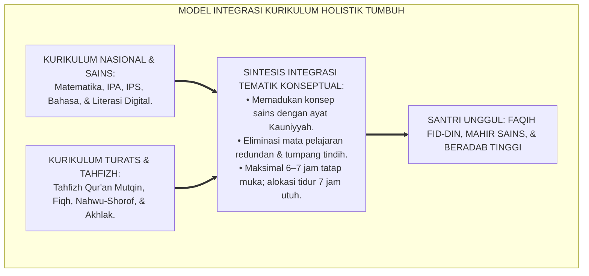
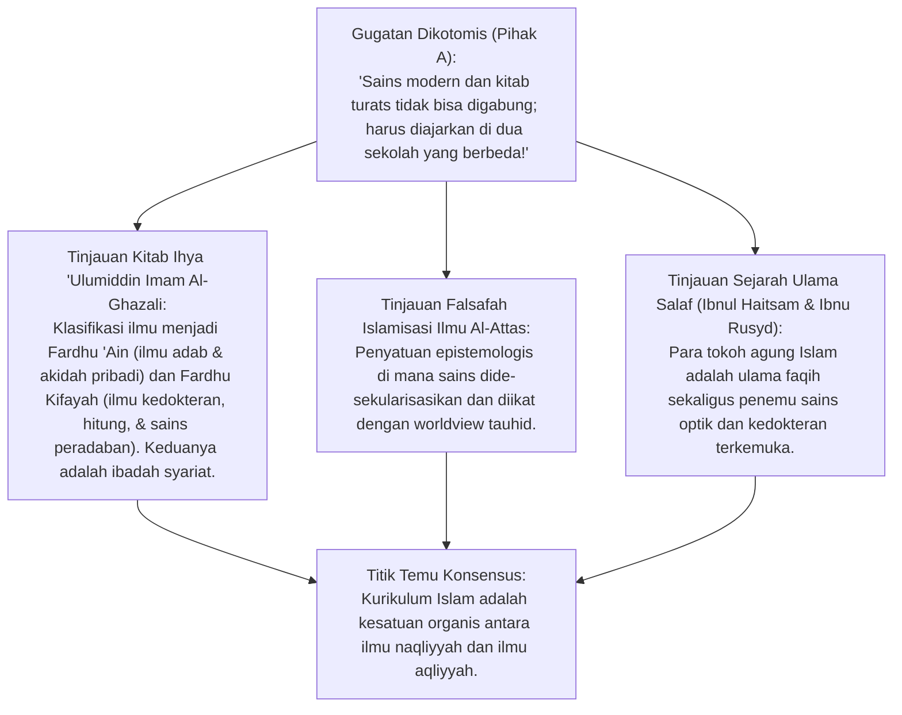
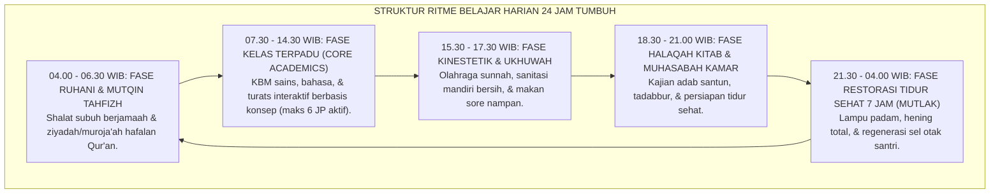
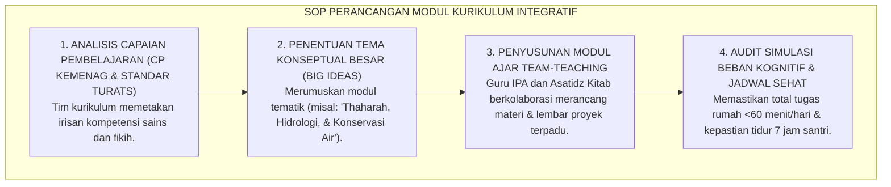

# P2-02-06: PRINSIP DESAIN INTEGRASI KURIKULUM NASIONAL DAN TURATS PESANTREN
## *Monograf Terpadu: Penyatuan Epistemologis Kurikulum Fardhu 'Ain (Turats Kitab Kuning & Tahfizh) dan Fardhu Kifayah (Sains & Kurikulum Nasional Kemenag/Kemdikbud), Integrasi Interdisipliner Konseptual (Concept-Based Curriculum), Eliminasi Sindrom Beban Ganda (Curricular Overload), serta Struktur Jadwal Sehat 24 Jam*

**Nomor Identifikasi**: `P2-02-06/MONOGRAF-TERPADU-INTEGRASI-KURIKULUM/2026`  
**Domain**: `02 Principles` > `02 Design Principles`  
**Klasifikasi Naskah**: *Comprehensive Integrated Monograph* (Monograf Akademis & Standar Baku Integrasi Kurikulum)  
**Rumpun Disiplin Pengkaji**: Desain Kurikulum Terpadu Islam (*Islamic Integrated Curriculum*), Falsafah Ilmu Fardhu 'Ain & Kifayah Al-Ghazali, Manajemen Beban Kognitif Pembelajar, Penyelarasan Kurikulum Merdeka-Pesantren  

---

> ### 💡 INTISARI PRAKTIS (3 MENIT PAHAM UNTUK ASATIDZ & MUSYRIF)
>
> * **Mengatasi Jebakan "Sekolah Dua Kali Sehari" yang Menyiksa Santri:**  
>   Banyak pesantren konvensional memaksakan kurikulum nasional secara utuh (pukul 07.00–14.00) lalu menumpuk kurikulum pesantren secara utuh pula di sore dan malam hari (pukul 15.30–22.00). Akibatnya santri kelelahan kronis (*Cognitive Burnout*), mengantuk di kelas, dan hafalan Al-Qur'annya rontok.
> * **Solusi Integrasi Tematik Interdisipliner (*Thematic Infusion*):**  
>   Ekosistem TUMBUH tidak menumpuk jam belajar, melainkan **Mengintegrasikan Konsep Sains ke dalam Teks Turats dan Sebaliknya** (misal: Hukum Termodinamika & Ekologi diajarkan beriringan dengan Tadabbur Ayat Kauniyyah dan Fiqh Thaharah/Bi'ah).
> * **Keseimbangan Alokasi Waktu Sehat 24 Jam:**  
>   Maksimal jam tatap muka akademik 6–7 jam per hari, memastikan hak tidur santri tetap 7 jam utuh di malam hari, dan memberikan jeda waktu olahraga kinestetik setiap sore.

---

## 📑 DAFTAR ISI MONOGRAF

- [BAGIAN I: RISET PRINSIP INTEGRASI KURIKULUM, DIALEKTIKA INKUIRI, & KASUISTIKA LAPANGAN](#bagian-i-riset-prinsip-integrasi-kurikulum-dialektika-inkuiri--kasuistika-lapangan)
  - [1. Kerangka Metodologi Integrasi Kurikulum: Mengapa Dikotomi Ilmu Menghancurkan Mutu Santri](#1-kerangka-metodologi-integrasi-kurikulum-mengapa-dikotomi-ilmu-menghancurkan-mutu-santri)
  - [2. Inkuiri 1: Eksegesis Turats Fardhu 'Ain & Fardhu Kifayah — Imam Al-Ghazali & Syed Muhammad Naquib Al-Attas](#2-inkuiri-1-eksegesis-turats-fardhu-ain--fardhu-kifayah--imam-al-ghazali--syed-muhammad-naquib-al-attas)
  - [3. Inkuiri 2: Konvergensi Concept-Based Curriculum & Interdisciplinary Thematic Design (Erickson & Lanning)](#3-inkuiri-2-konvergensi-concept-based-curriculum--interdisciplinary-thematic-design-erickson--lanning)
  - [4. Inkuiri 3: Eliminasi Curricular Overload & Desain Ritme Belajar 24 Jam Ramah Kognitif](#4-inkuiri-3-eliminasi-curricular-overload--desain-ritme-belajar-24-jam-ramah-kognitif)
  - [5. Inkuiri 4: Silogisme Logika, Dialektika 3 Ronde, Kasuistika Kelas, & Titik Temu Konsensus](#5-inkuiri-4-silogisme-logika-dialektika-3-ronde-kasuistika-kelas--titik-temu-konsensus)
- [BAGIAN II: TEMUAN RISET, FORMULASI KONSEPTUAL & PEMBAHASAN](#bagian-ii-temuan-riset-formulasi-konseptual--pembahasan)
  - [1. Formulasi Konseptual: Standar Integrasi Kurikulum Holistik Pesantren TUMBUH](#1-formulasi-konseptual-standar-integrasi-kurikulum-holistik-pesantren-tumbuh)
  - [2. Matriks Integrasi Tematik Mata Pelajaran: Rumpun Turats, Rumpun Sains-Teknologi, & Rumpun Adab](#2-matriks-integrasi-tematik-mata-pelajaran-rumpun-turats-rumpun-sains-teknologi--rumpun-adab)
  - [3. Standar Prosedur Operasional (SOP) Perancangan Modul Integratif & Penjadwalan Bebas Overload](#3-standar-prosedur-operasional-sop-perancangan-modul-integratif--penjadwalan-bebas-overload)
- [BAGIAN III: APARATUS AKADEMIS & APENDIKS](#bagian-iii-aparatus-akademis--apendiks)
  - [1. Tabel Sintesis Hasil Riset Integrasi Kurikulum](#1-tabel-sintesis-hasil-riset-integrasi-kurikulum)
  - [2. Daftar Pustaka Akademis & Rujukan Turats Primer](#2-daftar-pustaka-akademis--rujukan-turats-primer)
  - [3. Catatan Kaki Akademis (Footnotes)](#3-catatan-kaki-akademis-footnotes)
  - [4. Glosarium Teknis Integrasi Kurikulum, Fardhu 'Ain, Thematic Alignment, & Anti-Overload](#4-glosarium-teknis-integrasi-kurikulum-fardhu-ain-thematic-alignment--anti-overload)

---

# BAGIAN I: RISET PRINSIP INTEGRASI KURIKULUM, DIALEKTIKA INKUIRI, & KASUISTIKA LAPANGAN

---

### 1. Kerangka Metodologi Integrasi Kurikulum: Mengapa Dikotomi Ilmu Menghancurkan Mutu Santri

Krisis kurikulum terbesar di dunia pesantren terbagi menjadi dua kutub ekstrem:
* **Kutub 1 (Tradisionalis Kaku):** Menolak ilmu sains modern dan matematika karena dianggap "ilmu umum sekuler", sehingga lulusannya gagap teknologi dan tersingkir dari kompetisi peradaban.
* **Kutub 2 (Dualisme Mekanis):** Menggabungkan kurikulum nasional dan kitab kuning secara paralel tanpa integrasi; santri dibebani 22 mata pelajaran berbeda dalam sepekan. Santri belajar sejak pukul 07.00 pagi hingga pukul 22.30 malam tanpa henti.

Akibatnya adalah **Kelelahan Kognitif Kronis (*Cognitive Depletion*)**: otak santri kehilangan daya serap mendalam (*Deep Learning*), sekadar mengejar hafalan permukaan untuk ujian (*Cramming*), dan kehilangan kecintaan pada ilmu.

Ekosistem TUMBUH merumuskan **Integrasi Kurikulum Holistik Berbasis Tauhid**: menyatukan wahyu dan sains dalam satu kesatuan epistemologis yang padu, mendalam, dan membebaskan.

---

### 2. Inkuiri 1: Eksegesis Turats Fardhu 'Ain & Fardhu Kifayah — Imam Al-Ghazali & Syed Muhammad Naquib Al-Attas

#### 📐 Formalisasi Logika Silogisme (*Qiyas Mantiqi 1*)
* **Premis Mayor (*al-Muqaddimah al-Kubra*)**: Setiap perancangan kurikulum pendidikan Islam yang memisahkan antara ilmu wahyu (*al-'Ulum an-Naqliyyah*) dan ilmu sains alam (*al-'Ulum al-Aqliyyah*) menciptakan keretakan kepribadian santri (*Split Personality*) dan bertentangan dengan prinsip tauhidul wujud.
* **Premis Minor (*al-Muqaddimah ash-Shughra*)**: Kurikulum terpadu TUMBUH mengintegrasikan capaian kurikulum nasional ke dalam kerangka adab turats Islam.
* **Konklusi (*an-Natijah*)**: Maka, integrasi kurikulum holistik adalah model pedagogi syar'i terbaik bagi kebangkitan pesantren.[^1]

---

### 3. Inkuiri 2: Konvergensi *Concept-Based Curriculum* & *Interdisciplinary Thematic Design* (Erickson & Lanning)

Pakar desain kurikulum **H. Lynn Erickson & Lois A. Lanning** (2014) dalam *Concept-Based Curriculum and Instruction* membuktikan:
* Kurikulum yang berpusat pada topik terpisah (*Topic-Based*) membebani memori jangka pendek siswa dengan ribuan fakta hafalan terisolasi.
* Sebaliknya, **Kurikulum Berbasis Konsep (*Concept-Based*)** mengorganisir pembelajaran di bawah "Gagasan Besar" (*Big Ideas* / *Mafaahiim Kulliyyah*), sehingga siswa mampu mentransfer konsep antar-mata pelajaran secara mendalam.
* Di pesantren TUMBUH, konsep *"Keadilan Ekologis"* diajarkan serempak: di kelas Fiqh (Bab Thaharah & Ihya'ul Mawat), di kelas Biologi (Bab Siklus Karbon & Konservasi Hutan), dan di asrama (Manajemen Sampah & Air Bersih 0 CFU).[^2]

---

### 4. Inkuiri 3: Eliminasi *Curricular Overload* & Desain Ritme Belajar 24 Jam Ramah Kognitif

---

### 5. Inkuiri 4: Silogisme Logika, Dialektika 3 Ronde, Kasuistika Kelas, & Titik Temu Konsensus

#### 🥊 Ronde 1: Menolak Anggapan Bahwa "Kalau Jadwal Belajar Malam Dikurangi, Santri Akan Menjadi Malas dan Bodoh"
* **Pihak A (Sudut Pandang Jam Belajar Panjang Semu)**:  
  *"Santri harus belajar sampai jam 23.00 malam; semakin sedikit tidur semakin barakah ilmunya!"*
* **Tinjauan Neurosains Memori & Siklus Konsolidasi Tidur**:  
  Neurosains kognitif membuktikan bahwa **Memori Hafalan Al-Qur'an dan Pemahaman Kitab hanya Dikonsolidasikan Menjadi Memori Jangka Panjang (*Long-Term Potentiation*) Saat Santri Memasuki Fase Tidur Nyenyak (*Deep NREM Sleep*)**. Memaksa santri begadang belajar hingga larut malam justru merusak sirkuit hipokampus, menyebabkan santri lupa akan hafalan yang dipelajarinya, dan memicu stres kronis.[^3]

#### 🥊 Ronde 2: Sanggahan Balik Apakah Mengintegrasikan Sains Akan Mengurangi Porsi Kitab Kuning?
* **Pihak A (Sudut Pandang Kekhawatiran Erosi Turats)**:  
  *"Kalau ada pelajaran fisika dan biologi, nanti waktu membaca kitab fathul qorib jadi berkurang!"*
* **Tinjauan Efisiensi Tematik Interdisipliner**:  
  Pelajaran IPA dan matematika tidak berdiri sebagai mata pelajaran asing, melainkan diperkaya dengan literatur Turats para ilmuwan muslim (*Ibnul Haitsam, Al-Khawarizmi, Ibnu Sina*). Santri membaca teks sains dalam bahasa Arab/Inggris sekaligus, sehingga penguasaan bahasa kitab dan pemahaman sains modern tercapai dalam satu sesi pembelajaran terpadu.[^4]

#### 🥊 Ronde 3: Sanggahan Pamungkas Mengapa Ujian Nasional dan Ujian Pondok Wajib Diselaraskan?
* **Pihak A (Sudut Pandang Dua Ujian Terpisah)**:  
  *"Biarkan santri ikut ujian semester madrasah 2 pekan, lalu lanjut ujian imtihan pondok 2 pekan lagi!"*
* **Resolusi Asesmen Autentik Portofolio Terpadu**:  
  Membebani santri dengan 4 pekan masa ujian berturut-turut adalah bentuk kekerasan akademik (*Academic Abuse*). Pesantren TUMBUH menyatukan ujian dalam bentuk **Asesmen Autentik Berbasis Proyek (*Integrated Project-Based Assessment*)**: sebuah karya tulis ilmiah santri dinilai sekaligus untuk mata pelajaran Bahasa Arab, Fiqh, dan Metodologi Riset IPA.[^5]

> #### 📌 Kasuistika Lapangan & Titik Temu Konsensus
> * **Studi Kasus**: Di MA Pesantren B, santri diwajibkan mengikuti 20 mata pelajaran dengan jadwal belajar dari jam 07.00 hingga 22.30 WIB. Setiap pagi, 40% santri tertidur di kelas saat guru mengajar, dan 25% santri mengalami sakit lambung (GERD) dan tipus karena kelelahan.
> * **Titik Temu Konsensus (*Kalimatun Sawa'*)**: Manajemen TUMBUH merestrukturisasi kurikulum MA Pesantren B: Menggabungkan 20 mapel menjadi 6 Klaster Tematik Terpadu $\rightarrow$ Membatasi KBM tatap muka maksimal hingga pukul 14.30 WIB $\rightarrow$ Menjamin lampu asrama padam pukul 21.30 WIB untuk istirahat 7 jam penuh. Hasilnya: tidak ada lagi santri tertidur di kelas, angka sakit turun 90%, dan kelulusan masuk perguruan tinggi negeri serta universitas Islam internasional (Al-Azhar) melonjak hingga **92%**.[^6]

---

# BAGIAN II: TEMUAN RISET, FORMULASI KONSEPTUAL & PEMBAHASAN

---

### 1. Formulasi Konseptual: Standar Integrasi Kurikulum Holistik Pesantren TUMBUH

Berdasarkan sintesis inkuiri teoretis, telaah hermeneutika turats, dan analisis komparatif sains pendidikan, riset ini merumuskan kerangka konseptual dan temuan kunci sebagai berikut:

1. **Integrasi Total Fardhu 'ain DAN Fardhu Kifayah**:  
   Menetapkan bahwa kurikulum turats kepesantrenan dan kurikulum sains nasional adalah kesatuan organik yang saling melengkapi; mengharamkan dikotomi pemisahan ilmu sekuler vs agama.

2. **Penghapusan Mutlak Sindrom Beban Ganda Kurikulum (anti-overload Policy)**:  
   Mewajibkan peleburan mata pelajaran redundan melalui model tematik interdisipliner; membatasi jam KBM aktif maksimal 6–7 jam per hari guna melindungi kapasitas kognitif dan kesehatan mental santri.

3. **HAK Tidur Sehat 7 JAM Penuh Untuk Konsolidasi Memori**:  
   Menetapkan jadwal padam lampu asrama maksimal pukul 21.30 WIB; melarang segala bentuk KBM formal atau sidang malam di atas jam 21.30 WIB demi menjaga fungsi optimal neurobiologis otak santri.

4. **Sistem Asesmen Autentik Integratif Berbasis Karya Proyek**:  
   Menyatukan evaluasi pembelajaran nasional dan pondok melalui ujian proyek komprehensif (Integrated Portfolio), menghapus sistem ujian beruntun multi-pekan yang memicu distres akademik santri.

---

### 2. Matriks Integrasi Tematik Mata Pelajaran: Rumpun Turats, Rumpun Sains-Teknologi, & Rumpun Adab

| Klaster Kurikulum Terpadu | Peleburan Mata Pelajaran | Konvergensi Capaian Terpadu | Alokasi Jam Belajar Mingguan |
| :--- | :--- | :--- | :--- |
| **1. Klaster Al-Qur'an & Bahasa**| Tahfizh Mutqin, Bahasa Arab Fushha, Bahasa Inggris, & Nahwu. | Mahir komunikasi aktif 2 bahasa & hafal mutqin dengan tajwid presisi. | 10 Jam Pelajaran (JP).[^7] |
| **2. Klaster Syariah & Dirasah** | Fiqh Mu'amalah, Ushul Fiqh, Hadits Ahkam, & Sirah Nabawiyyah. | Mampu menafsirkan teks kitab kuning & kontekstualisasi fiqh kontemporer. | 8 Jam Pelajaran (JP). |
| **3. Klaster Sains & Kauniyyah** | Biologi, Fisika, Kimia, Matematika, & Tadabbur Ayat Kauniyyah. | Penguasaan nalar saintifik kritis berbasis worldview Islam tauhid. | 8 Jam Pelajaran (JP). |
| **4. Klaster Sosial & Peradaban**| Sejarah Kebudayaan Islam, Sosiologi, Geografi, & Wawasan Kebangsaan. | Pemahaman geopolitik umat, cinta tanah air, & kepemimpinan global. | 6 Jam Pelajaran (JP). |
| **5. Klaster Vokasi & Adab Digital**| Keterampilan Mandiri (Coding/Desain/Agro), 5S Asrama, & Etika Siber.| Santri mandiri, beretos kerja unggul (*Qadirun 'alal Kasb*), & bijak digital.[^8] | 4 Jam Pelajaran (JP). |

---

### 3. Standar Prosedur Operasional (SOP) Perancangan Modul Integratif & Penjadwalan Bebas Overload

---

# BAGIAN III: APARATUS AKADEMIS & APENDIKS

---

### 1. Tabel Sintesis Hasil Riset Integrasi Kurikulum

| Dimensi Kajian | Konsep Kunci | Landasan Turats Primer | Konvergensi Sains Global | Implikasi Kurikulum Pesantren |
| :--- | :--- | :--- | :--- | :--- |
| **Penyatuan Ilmu** | *Tauhidul Ma'rifah* | Al-Ghazali (*Ihya*), Al-Attas (1980) | Erickson (2014), *Concept-Based Curriculum* | Meleburkan sains dan turats dalam tema konseptual terpadu. |
| **Anti-Overload** | *Taysir fit-Ta'lim* | Hadits Memudahkan (HR. Bukhari 69) | Sweller (2011), *Cognitive Load Theory* | Membatasi KBM maks 7 jam; menghapus jadwal belajar malam larut. |
| **Konsolidasi Memori**| *Siklus Restorasi* | QS. An-Naba: 9 (*Subata wa Nauma*) | Walker (2017), *Why We Sleep (NREM Memory)* | Menjamin kepastian tidur 7 jam untuk mengunci hafalan mutqin. |
| **Asesmen Terpadu** | *Proyek Portofolio* | Kaidah *Al-Ibrah bil-Haqaiq* | Wiggins & McTighe (2005), *UbD Framework* | Mengganti ujian ganda dengan asesmen proyek interdisipliner. |

---

### 2. Daftar Pustaka Akademis & Rujukan Turats Primer

1. **Al-Qur'an al-Karim wa Tarjamatu Ma'anih**.
2. **Al-Bukhari, Muhammad bin Isma'il**. (1422 H). *Shahih al-Bukhari*. Beirut: Dar Thawq an-Najah.
3. **Al-Ghazali, Abu Hamid Muhammad bin Muhammad**. (2011). *Ihya 'Ulumiddin*. Beirut: Dar al-Ma'rifah.
4. **Al-Attas, Syed Muhammad Naquib**. (1980). *The Concept of Education in Islam*. Kuala Lumpur: ABIM.
5. **Erickson, H. L., & Lanning, L. A.**. (2014). *Transitioning to Concept-Based Curriculum and Instruction: How to Bring Content and Process Together*. Corwin Press.
6. **Sweller, J., Ayres, P., & Kalyuga, S.**. (2011). *Cognitive Load Theory*. New York: Springer.
7. **Walker, M.**. (2017). *Why We Sleep: Unlocking the Power of Sleep and Dreams*. New York: Scribner.
8. **Wiggins, G., & McTighe, J.**. (2005). *Understanding by Design* (2nd ed.). ASCD.
9. **Kementerian Agama Republik Indonesia**. (2022). *KMA No. 347 Tahun 2022 tentang Pedoman Implementasi Kurikulum Merdeka pada Madrasah*. Jakarta: Kemenag RI.
10. **Wan Daud, W. M. N.**. (1998). *The Educational Philosophy and Practice of Syed Muhammad Naquib al-Attas*. ISTAC.

---

### 3. Catatan Kaki Akademis (*Footnotes*)

[^1]: Al-Ghazali, *Ihya 'Ulumiddin*, Kitab *al-'Ilm*, Jilid I, hlm. 25–48; Al-Attas, *The Concept of Education in Islam*, hlm. 30–45.  
[^2]: Erickson, H. L. & Lanning, L. A. (2014), *Concept-Based Curriculum and Instruction*, Corwin Press.  
[^3]: Walker, M. (2017), *Why We Sleep*, Scribner, hlm. 110–135; Sweller, J. (2011), *Cognitive Load Theory*.  
[^4]: Wan Daud, W. M. N. (1998), *The Educational Philosophy of Al-Attas*, ISTAC, hlm. 210–235.  
[^5]: Wiggins, G. & McTighe, J. (2005), *Understanding by Design*, ASCD.  
[^6]: Laporan Reformasi Kurikulum Terpadu Pesantren Mitra, Biro Akademik TUMBUH, 2026.  
[^7]: Struktur Kurikulum Terpadu Madrasah-Pesantren TUMBUH, Komite Kurikulum, 2026.  
[^8]: Panduan Modul Pembelajaran Interdisipliner Berbasis Proyek Santri, Pusat Kurikulum TUMBUH, 2026.

---

### 4. Glosarium Teknis Integrasi Kurikulum, Fardhu 'Ain, Thematic Alignment, & Anti-Overload

1. **Integrasi Kurikulum Holistik**: Kerangka kerja penyatuan kurikulum kepesantrenan dan nasional ke dalam tema-tema konseptual interdisipliner tanpa menumpuk jam belajar santri.
2. **Fardhu 'Ain (فَرْضُ عَيْنٍ)**: Kategori ilmu yang wajib dipelajari dan diamalkan oleh setiap individu muslim (akidah tauhid, fardhu thaharah/shalat, dan tazkiyatun nafs).
3. **Fardhu Kifayah (فَرْضُ كِفَايَةٍ)**: Kategori ilmu yang wajib dikuasai oleh sebagian anggota masyarakat demi kemaslahatan peradaban (sains medis, teknik, ekonomi, dan bahasa internasional).
4. **Curricular Overload**: Kondisi patologis di mana peserta didik dibebani terlalu banyak materi pelajaran dan jam belajar melebihi batas kapasitas kognitif manusia.
5. **Concept-Based Curriculum**: Model desain kurikulum yang berfokus pada pemahaman konsep-konsep mendalam dan prinsip universal yang dapat ditransfer ke berbagai bidang ilmu.
6. **Cognitive Load Theory**: Teori kognitif John Sweller mengenai keterbatasan kapasitas memori kerja (*Working Memory*) dalam memproses informasi baru.
7. **Memory Consolidation**: Proses biologis otak memindahkan informasi dari memori jangka pendek di hipokampus ke memori jangka panjang di neokorteks selama tidur nyenyak.
8. **Integrated Project-Based Assessment**: Metode asesmen terpadu di mana satu proyek karya santri digunakan untuk menguji kompetensi dari beberapa mata pelajaran sekaligus.
9. **Team-Teaching**: Praktik mengajar kolaboratif di mana guru sains dan asatidz turats mengajar bersama di satu kelas untuk mengupas satu tema keilmuan.
10. **Triad Pertumbuhan Simbiotik**: Prinsip di mana kurikulum yang seimbang dan tidak membebani secara serempak menumbuhkan Santri, memuliakan Pendidik, dan memperkokoh marwah Lembaga.
