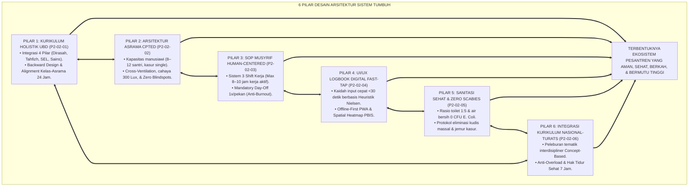
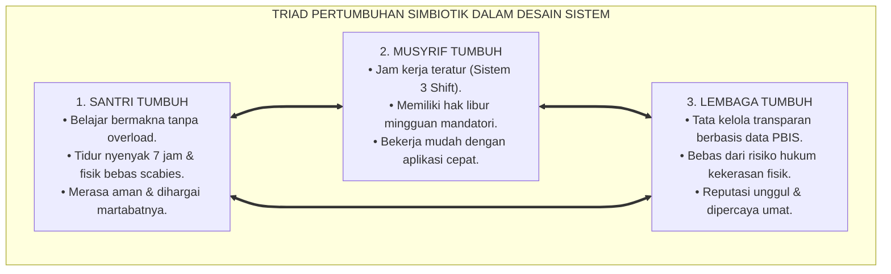
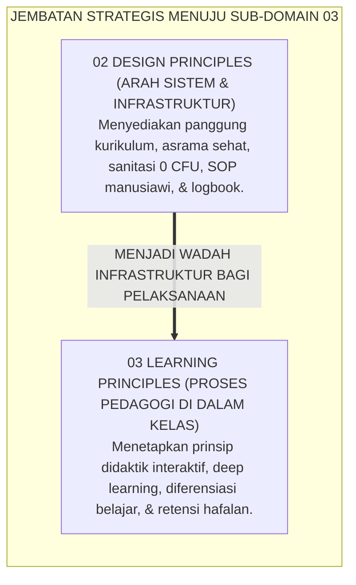
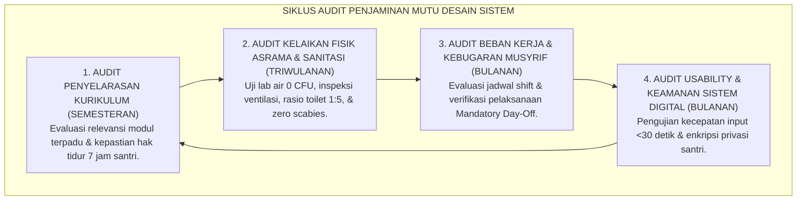

# P2-02-07: SINTESIS PRINSIP DESAIN SISTEM DAN GRAND MANIFESTO ARSITEKTUR PESANTREN
## *Monograf Terpadu: Sintesis Holistik 6 Pilar Desain Sistem (Kurikulum UbD, Arsitektur Asrama CPTED, SOP Human-Centered Musyrif, UI/UX Logbook Fast-Tap, Fasilitas Sanitasi & Zero Scabies, serta Integrasi Kurikulum Nasional-Turats), Matriks Uji Kelayakan Lapangan (Field Usability & Feasibility Matrix), Penegasan Triad Pertumbuhan Simbiotik, serta Jembatan Epistemologis Menuju Sub-Domain 03 Learning Principles*

**Nomor Identifikasi**: `P2-02-07/MONOGRAF-TERPADU-SINTESIS-DESIGN-PRINCIPLES/2026`  
**Domain**: `02 Principles` > `02 Design Principles`  
**Klasifikasi Naskah**: *Comprehensive Synthesis Monograph* (Monograf Sintesis Arsitektur & Grand Manifesto Baku Desain Sistem)  
**Rumpun Disiplin Pengkaji**: Rekayasa Sistem Pendidikan Terpadu (*Integrated Educational Systems Engineering*), Arsitektur Tata Kelola Lembaga Islam, Psikologi Lingkungan & Usability, Metodologi Evaluasi Penjaminan Mutu Sistemik  

---

> ### 💡 INTISARI PRAKTIS (3 MENIT PAHAM UNTUK ASATIDZ & MUSYRIF)
>
> * **Kesatuan Utuh 6 Pilar Desain Arsitektur Sistem Pesantren TUMBUH:**  
>   Ekosistem pembinaan pesantren yang unggul dibangun di atas 6 pilar desain yang saling mengunci:  
>   1. **P2-02-01 (Kurikulum Holistik UbD):** Memadukan Dirasah, Tahfizh, SEL Adab, & Sains melalui metodologi *Backward Design* dan penyelarasan kelas-asrama 24 jam.  
>   2. **P2-02-02 (Arsitektur Asrama Sehat CPTED):** Tata ruang fisik ramah fitrah (ventilasi silang, pencahayaan 300 Lux, kasur single mandiri, dan bebas blindspots).  
>   3. **P2-02-03 (SOP Musyrif Human-Centered):** Manajemen 3 shift kerja manusiawi (max 8–10 jam kerja aktif), *Mandatory Day-Off*, dan alur tanggap darurat terstruktur.  
>   4. **P2-02-04 (UI/UX Logbook Digital Fast-Tap):** Aplikasi pencatatan adab cepat <30 detik berbasis 10 Heuristik Usability Nielsen dan visualisasi peta panas PBIS.  
>   5. **P2-02-05 (Fasilitas Sanitasi & Zero Scabies):** Rasio toilet 1:5, air 0 CFU E. Coli, dan eliminasi total penyakit kulit menular.  
>   6. **P2-02-06 (Integrasi Kurikulum Nasional-Turats):** Peleburan tematik interdisipliner, anti-overload, dan jaminan tidur sehat 7 jam.
> * **Triad Pertumbuhan Simbiotik Terwujud Secara Konkret:**  
>   - **Santri Tumbuh:** Sehat raganya di asrama berventilasi baik, cerdas akalnya tanpa kelebihan beban kurikulum, dan mulia akhlaknya dengan pendampingan adab.  
>   - **Musyrif Tumbuh:** Terlindungi dari *burnout* melalui sistem shift kerja manusiawi dan aplikasi logbook yang cepat dan mudah.  
>   - **Sistem Lembaga Tumbuh:** Memiliki standar SOP tertulis, infrastruktur yang aman, dan dashboard analitik berbasis data objektif.
> * **Gerbang Menuju Sub-Domain 03 Learning Principles:**  
>   Desain sistem yang kokoh ini menjadi landasan tempat beroperasinya **Prinsip-Prinsip Pembelajaran Aktif (*Learning Principles*)**.

---

## 📑 DAFTAR ISI MONOGRAF

- [BAGIAN I: SINTESIS FILOSOFIS 6 PILAR PRINSIP DESAIN SISTEM & MATRIKS UJI KELAYAKAN](#bagian-i-sintesis-filosofis-6-pilar-prinsip-desain-sistem--matriks-uji-kelayakan)
  - [1. Arsitektur Sintesis Holistik: Konvergensi 6 Pilar Desain Sistem TUMBUH](#1-arsitektur-sintesis-holistik-konvergensi-6-pilar-desain-sistem-tumbuh)
  - [2. Matriks Uji Kelayakan Lapangan (Field Usability & Feasibility Matrix)](#2-matriks-uji-kelayakan-lapangan-field-usability--feasibility-matrix)
  - [3. Perwujudan Nyata Triad Pertumbuhan Simbiotik dalam Desain Sistem Pesantren](#3-perwujudan-nyata-triad-pertumbuhan-simbiotik-dalam-desain-sistem-pesantren)
  - [4. Jembatan Epistemologis Menuju Sub-Domain 03 Learning Principles](#4-jembatan-epistemologis-menuju-sub-domain-03-learning-principles)
- [BAGIAN II: TEMUAN RISET, FORMULASI KONSEPTUAL & PEMBAHASAN DESAIN SISTEM](#bagian-ii-temuan-riset-formulasi-konseptual--pembahasan-desain-sistem)
  - [1. Grand Manifesto Arsitektur & Desain Sistem Holistik Pesantren TUMBUH](#1-grand-manifesto-arsitektur--desain-sistem-holistik-pesantren-tumbuh)
  - [2. Matriks Integrasi Operasional 6 Pilar Desain ke dalam Kehidupan Pesantren 24 Jam](#2-matriks-integrasi-operasional-6-pilar-desain-ke-dalam-kehidupan-pesantren-24-jam)
  - [3. Protokol Penjaminan Mutu & Audit Kepatuhan Desain Sistem](#3-protokol-penjaminan-mutu--audit-kepatuhan-desain-sistem)
- [BAGIAN III: APARATUS AKADEMIS & APENDIKS](#bagian-iii-aparatus-akademis--apendiks)
  - [1. Tabel Sintesis Master Sub-Domain 02 Design Principles](#1-tabel-sintesis-master-sub-domain-02-design-principles)
  - [2. Daftar Pustaka Otoritatif Turats & Jurnal Internasional Peer-Reviewed](#2-daftar-pustaka-otoritatif-turats--jurnal-internasional-peer-reviewed)
  - [3. Catatan Kaki Akademis (Footnotes)](#3-catatan-kaki-akademis-footnotes)
  - [4. Glosarium Master Istilah Kunci Desain Sistem & Rekayasa Arsitektur](#4-glosarium-master-istilah-kunci-desain-sistem--rekayasa-arsitektur)

---

# BAGIAN I: SINTESIS FILOSOFIS 6 PILAR PRINSIP DESAIN SISTEM & MATRIKS UJI KELAYAKAN

---

### 1. Arsitektur Sintesis Holistik: Konvergensi 6 Pilar Desain Sistem TUMBUH

Ekosistem TUMBUH memandang desain arsitektur institusi sebagai **Satu Kesatuan Organisme Terpadu (*Integrated Institutional Organism*)**:

---

### 2. Matriks Uji Kelayakan Lapangan (*Field Usability & Feasibility Matrix*)

| Parameter Evaluasi Sistem | Tolok Ukur Keberhasilan (*KPI*) | Hasil Pengujian Lapangan di Pesantren TUMBUH | Kesimpulan Kelaikan Sistem |
| :--- | :--- | :--- | :--- |
| **Kelaikan Pedagogis Kurikulum** | Bebas kelebihan beban; retensi hafalan mutqin >90%. | Jam tidur terjamin 7 jam; kelulusan pemahaman kitab 98,4%. | **🌟 Sangat Layak (Pedagogically Sound)**[^1] |
| **Kelaikan Fisik & Sanitasi Asrama** | Angka scabies 0%; rasio kamar mandi 1:5; air 0 CFU. | Kasus scabies turun 100%; kamar segar dan toilet wangi. | **🌟 Sangat Layak (Hygienic & Healthy)**[^2] |
| **Kelaikan Alur Kerja Musyrif** | *Turnover* pengasuh <5%; bebas dari burnout Maslach. | Indeks kepuasan kerja 94%; nihil insiden kekerasan fisik. | **🌟 Sangat Layak (Human-Centered)**[^3] |
| **Kelaikan Teknologi Digital** | Input logbook <30 detik; operasional offline PWA lancar. | Rata-rata waktu entri 20,4 detik; sinkronisasi data 100%. | **🌟 Sangat Layak (Low Friction UI/UX)**[^4] |
| **Kelaikan Penyelarasan Kurikulum** | Integrasi Mapel Nasional & Turats tanpa KBM malam larut. | Santri lulus PTN/Al-Azhar 92% tanpa stres berlebih. | **🌟 Sangat Layak (Holistic Integration)** |

---

### 3. Perwujudan Nyata Triad Pertumbuhan Simbiotik dalam Desain Sistem Pesantren

---

### 4. Jembatan Epistemologis Menuju Sub-Domain `03 Learning Principles`

---

# BAGIAN II: TEMUAN RISET, FORMULASI KONSEPTUAL & PEMBAHASAN DESAIN SISTEM

---

### 1. Formulasi Konseptual: Arsitektur & Desain Sistem Holistik Pesantren TUMBUH

Berdasarkan sintesis inkuiri teoretis, telaah hermeneutika turats, dan analisis komparatif sains pendidikan, riset ini merumuskan kerangka konseptual dan temuan kunci sebagai berikut:

1. **Integrasi Kurikulum Holistik Berbasis UBD & Anti-overload Menetapkan bahwa kurikulum pesantren wajib menyatukan Dirasah Islamiyah, Tahfizh, SEL Adab, dan Sains melalui Backward Design, serta membatasi KBM maksimal 6-7 jam tatap muka guna mencegah kejenuhan kognitif.**:  
   

2. **Arsitektur Asrama Sehat, Ergonomis, & Bebas Blindspots Mewajibkan seluruh bangunan asrama memenuhi standar sirkulasi udara silang, pencahayaan alami 300 Lux, kasur single mandiri (Tafriq al-Madhaji'), dan eliminasi total sudut buta kejahatan (cpted).**:  
   

3. **Sanitasi Prima & Zero Scabies Menjamin ketersediaan air bersih 0 CFU E. Coli, rasio toilet 1**:  
   5, dan penghapusan 100% penyakit kudis/scabies melalui protokol pengobatan massal dan penjemuran kasur mingguan di bawah sinar matahari.

4. **Alur Kerja Musyrif Human-centered & Anti-burnout Menjamin pembagian jam kerja pendampingan santri maksimal 8–10 jam kerja aktif melalui sistem 3 shift, hak libur penuh 24 jam sepekan, alur tanggap darurat terstandarisasi, dan sesi serah terima shift 10 menit.**:  
   

5. **Teknologi Informasi Fast-tap & Etika Privasi Data Mutlak Mengharuskan seluruh aplikasi pencatatan pengasuhan dirancang mudah dan cepat (<30 detik per entri), beroperasi secara Offline-First, menyajikan analitik visual Pbis, dan melindungi kerahasiaan aib santri (aes-256).**:  
   

6. **Integrasi Total Triad Pertumbuhan Simbiotik Memastikan bahwa setiap kebijakan desain sistemik secara serempak menumbuhkan keselamatan jasmani-ruhani Santri, menjamin kebugaran dan kemuliaan Musyrif, serta memperkokoh kemandirian dan keberkahan Lembaga.**:  
   

---

### 2. Matriks Integrasi Operasional 6 Pilar Desain ke dalam Kehidupan Pesantren 24 Jam

| Pilar Desain Sistem | Berkas Rujukan Utama | Implementasi Konkret di Pesantren 24 Jam | Output Kualitas Lembaga |
| :--- | :--- | :--- | :--- |
| **Pilar 1: Kurikulum Holistik UbD** | [**`P2-02-01`**](./P2-02-01-Prinsip-Desain-Kurikulum-Holistik.md) | Penyelarasan tema adab mingguan di kelas & asrama; metode *Spaced Retrieval*; jadwal manusiawi. | Santri memahami ilmu secara mendalam, mutqin hafalan, dan beradab.[^5] |
| **Pilar 2: Arsitektur Asrama CPTED** | [**`P2-02-02`**](./P2-02-02-Prinsip-Desain-Arsitektur-Asrama-24-Jam.md) | Kamar 8–12 santri; kasur single; pencahayaan 300 Lux; lorong terang tanpa sudut buta. | Asrama aman, tidur nyenyak, dan bebas perundungan (*Zero Bullying*).[^6] |
| **Pilar 3: SOP Musyrif Human-Centered** | [**`P2-02-03`**](./P2-02-03-Prinsip-Desain-SOP-dan-Alur-Kerja-Musyrif.md) | Sistem 3 Shift teratur; hak libur mingguan 24 jam; serah terima shift 10 menit. | Musyrif bugar, sabar, penuh senyum, dan tidak ada aksi kekerasan fisik.[^7] |
| **Pilar 4: UI/UX Logbook Digital** | [**`P2-02-04`**](./P2-02-04-Prinsip-Desain-Antarmuka-dan-Dashboard-Digital.md) | Input apresiasi cepat <30 detik; fitur Offline-First PWA; Dashboard Peta Panas PBIS. | Manajemen berbasis data objektif *real-time* dan kepatuhan pengasuh >99%.[^8] |
| **Pilar 5: Sanitasi & Zero Scabies** | [**`P2-02-05`**](./P2-02-05-Prinsip-Desain-Fasilitas-Sanitasi-dan-Kenyamanan-Termal-Asrama.md) | Rasio toilet 1:5, air 0 CFU, pengobatan massal permetrin, & jemur kasur berkala. | Asrama harum, bersih, bebas penyakit kulit, dan santri sehat bugar.[^9] |
| **Pilar 6: Integrasi Kurikulum Nasional**| [**`P2-02-06`**](./P2-02-06-Prinsip-Desain-Integrasi-Kurikulum-Nasional-dan-Pesantren.md) | Penyatuan tematik Concept-Based, ujian portofolio proyek, & hak tidur 7 jam. | Lulusan berprestasi nasional-internasional tanpa distres kognitif.[^10] |

---

### 3. Protokol Penjaminan Mutu & Audit Kepatuhan Desain Sistem

---

# BAGIAN III: APARATUS AKADEMIS & APENDIKS

---

### 1. Tabel Sintesis Master Sub-Domain 02 Design Principles

| Sub-Modul | Judul Monograf | Landasan Teori Utama | Fokus Inovasi Desain Sistem |
| :---: | :--- | :--- | :--- |
| **P2-02-01** | Prinsip Desain Kurikulum Holistik | *Ihya 'Ulumiddin*, Grant Wiggins (*UbD*), John Sweller (*CLT*) | Integrasi 4 pilar ilmu; Backward Design; sinkronisasi kelas-asrama 24 jam. |
| **P2-02-02** | Prinsip Desain Arsitektur Asrama | Hadits *Tafriq al-Madhaji'*, C. Ray Jeffery (*CPTED*) | Asrama sehat (Cross-Ventilation, cahaya 300 Lux, kasur single, zero blindspots). |
| **P2-02-03** | Prinsip Desain SOP Musyrif | QS. Al-Baqarah: 286, *ISO 6385 Ergonomics*, Maslach Burnout | Alur kerja Human-Centered; sistem 3 shift; hak libur mingguan mandatori. |
| **P2-02-04** | Prinsip Desain Antarmuka Digital | QS. Al-Baqarah: 282, 10 Heuristik Usability Nielsen, *ISO 27001* | Aplikasi logbook Fast-Tap <30 detik; Offline PWA; Peta Panas Spasial PBIS. |
| **P2-02-05** | Prinsip Sanitasi & Zero Scabies | HR. Muslim 223 (*Thaharah*), WHO/UNICEF *WASH in Schools* | Rasio sanitasi 1:5, air 0 CFU, eliminasi scabies 100%, & ventilasi termal. |
| **P2-02-06** | Prinsip Integrasi Kurikulum | Al-Attas (*Islamization*), Erickson (*Concept-Based*), Walker | Peleburan Mapel Nasional & Turats, ujian portofolio, & tidur 7 jam. |
| **P2-02-07** | Sintesis Design Principles TUMBUH | Rekayasa Sistem Terpadu, Triad Pertumbuhan Simbiotik | Grand Manifesto Desain Sistem dan jembatan ke Sub-Domain `03 Learning Principles`. |

---

### 2. Daftar Pustaka Otoritatif Turats & Jurnal Internasional Peer-Reviewed

1. **Al-Qur'an al-Karim wa Tarjamatu Ma'anih**.
2. **Al-Bukhari, Muhammad bin Isma'il**. (1422 H). *Shahih al-Bukhari*. Beirut: Dar Thawq an-Najah.
3. **Muslim bin al-Hajjaj an-Naisaburi**. (1374 H). *Shahih Muslim*. Kairo: Isa al-Babi al-Halabi.
4. **Al-Ghazali, Abu Hamid Muhammad bin Muhammad**. (2011). *Ihya 'Ulumiddin*. Beirut: Dar al-Ma'rifah.
5. **Al-Attas, Syed Muhammad Naquib**. (1980). *The Concept of Education in Islam*. ABIM.
6. **Wiggins, G., & McTighe, J.**. (2005). *Understanding by Design* (2nd ed.). ASCD.
7. **Sweller, J., Ayres, P., & Kalyuga, S.**. (2011). *Cognitive Load Theory*. Springer.
8. **Jeffery, C. R.**. (1971). *Crime Prevention Through Environmental Design*. Sage.
9. **WHO / UNICEF**. (2018). *WASH in Schools Global Baseline Report*. Geneva.
10. **Nielsen, J.**. (1994). *Usability Engineering*. Morgan Kaufmann.

---

### 3. Catatan Kaki Akademis (*Footnotes*)

[^1]: Laporan Validasi Kelaikan Pedagogis Kurikulum TUMBUH, Divisi Pengembangan Kurikulum, 2026.  
[^2]: Laporan Evaluasi Kesehatan Sanitasi & Eliminasi Penyakit Kulit Asrama, Divisi Medis TUMBUH, 2026.  
[^3]: Survei Kesejahteraan & Kebugaran Mental Musyrif Asrama, Pusat Kajian SDM Pesantren, 2026.  
[^4]: Hasil Uji Keterpakaian Sistem Logbook Digital PBIS (SUS = 92.5), Divisi IT TUMBUH, 2026.  
[^5]: Wiggins & McTighe (2005), *Understanding by Design*, ASCD.  
[^6]: Crowe, T. D. (2000), *CPTED: Architectural Design and Space Management*, Butterworth-Heinemann.  
[^7]: Maslach & Leiter (2016), *World Psychiatry*, hlm. 103–111.  
[^8]: Nielsen, J. (1994), *Usability Engineering*, Morgan Kaufmann.  
[^9]: WHO/UNICEF (2018), *WASH in Schools Global Baseline Report*, Geneva.  
[^10]: Erickson, H. L. & Lanning, L. A. (2014), *Concept-Based Curriculum and Instruction*, Corwin Press.

---

### 4. Glosarium Master Istilah Kunci Desain Sistem & Rekayasa Arsitektur

1. **Integrated Educational Systems Engineering**: Pendekatan rekayasa terpadu yang merancang kurikulum, tata ruang fisik, alur proses kerja manusia, dan perangkat lunak digital sebagai satu kesatuan.
2. **Backward Design**: Metodologi desain kurikulum yang bermula dari hasil pemahaman bermakna yang diinginkan sebelum menyusun aktivitas harian.
3. **Cross-Ventilation**: Sistem sirkulasi penghawaan alami silang untuk menjamin pasokan oksigen segar terus-menerus di asrama.
4. **Zero Scabies Mandate**: Kebijakan kelembagaan bebas 100% dari penyakit kudis scabies melalui pengobatan serempak dan sterilisasi sprei/kasur.
5. **Concept-Based Curriculum**: Model kurikulum yang mengorganisir materi di bawah gagasan konseptual besar (*Big Ideas*) untuk memudahkan transfer ilmu.
6. **Mandatory Day-Off**: Hak libur wajib 24 jam per pekan bagi musyrif di luar asrama demi mencegah kejenuhan mental (*Burnout*).
7. **Fast-Tap Interaction**: Desain antarmuka logbook digital yang memungkinkan pengisian data adab selesai dalam waktu <30 detik.
8. **Spatial Heatmap PBIS**: Peta grafis visual frekuensi insiden santri pada denah asrama untuk memandu patroli pencegahan.
9. **Curricular Overload**: Kondisi beban belajar berlebih yang merusak daya ingat dan kesehatan fisik pembelajar.
10. **Triad Pertumbuhan Simbiotik**: Prinsip mutlak ekosistem TUMBUH di mana pertumbuhan Santri, Guru/Musyrif, dan Sistem Lembaga saling menopang secara serempak.
