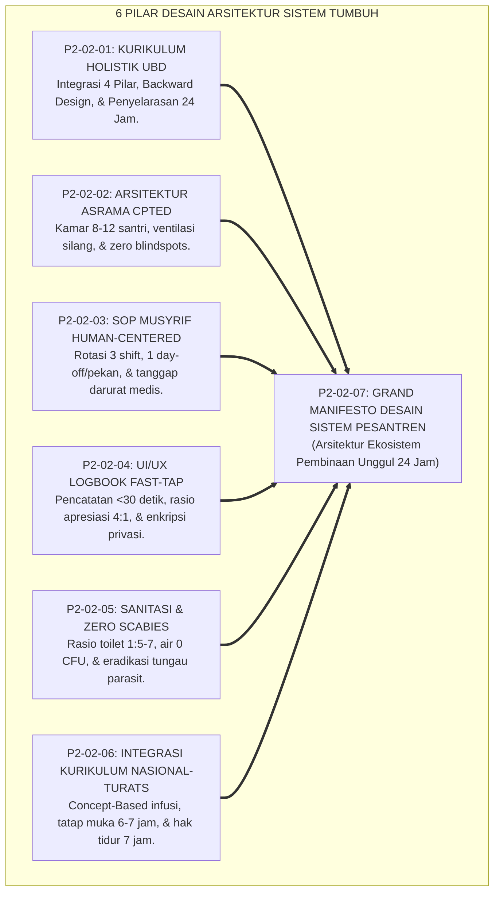
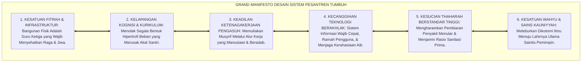
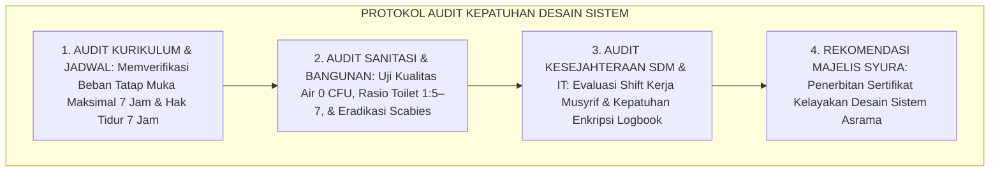
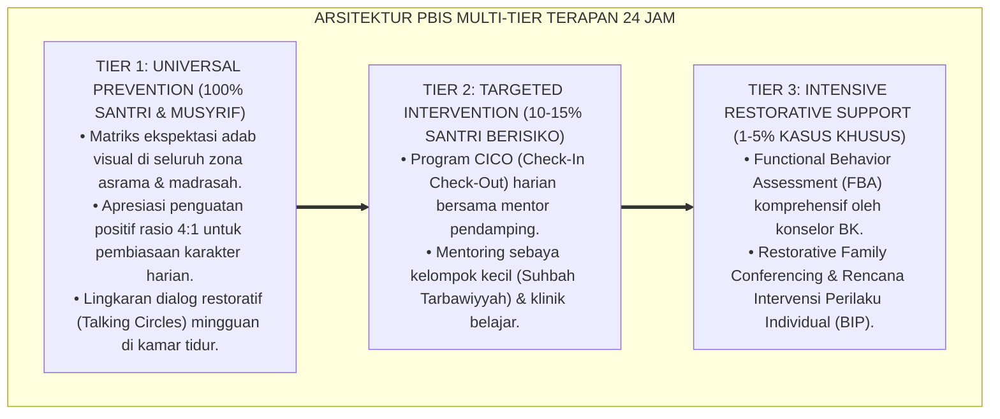

# P2-02-07: SINTESIS PRINSIP DESAIN SISTEM DAN GRAND MANIFESTO ARSITEKTUR PESANTREN (SYNTHESIS OF DESIGN PRINCIPLES)
## *Monograf Riset Akademik: Sintesis Holistik 6 Pilar Desain Sistem (Kurikulum UbD, Arsitektur Asrama CPTED, SOP Musyrif, UI/UX Logbook Fast-Tap, Fasilitas Sanitasi & Zero Scabies, Serta Integrasi Kurikulum), Matriks Kelayakan Lapangan, Serta Jembatan Epistemologis Menuju Learning Principles*

**Nomor Identifikasi**: `P2-02-07/MONOGRAF-RISET-SINTESIS-DESIGN-PRINCIPLES/2026`  
**Domain**: `02 Principles` > `02 Design Principles` (Prinsip Desain 07: *Synthesis of Design Principles*)  
**Klasifikasi Naskah**: *Academic Research Monograph* (Monograf Riset Akademik Prinsip Desain)  
**Rumpun Disiplin Pengkaji**: Rekayasa Sistem Pendidikan Terpadu (*Integrated Educational Systems Engineering*), Arsitektur Tata Kelola Lembaga Islam, Psikologi Lingkungan & Usability, Metodologi Evaluasi Penjaminan Mutu Sistemik  

---

> ### 💡 INTISARI EKSEKUTIF (EXECUTIVE SUMMARY)
>
> * **Konsolidasi Enam Pilar Desain Sistem Ekosistem TUMBUH:**  
>   Sub-Domain 02 Design Principles merumuskan standar baku arsitektur sistemik pesantren ke dalam 6 pilar terpadu: **1. Kurikulum Holistik UbD (P2-02-01: Penyelarasan kelas-asrama 24 jam & anti-overload); 2. Arsitektur Asrama Sehat CPTED (P2-02-02: Kamar 8–12 santri, ventilasi silang, ranjang mandiri, & zero blindspots); 3. SOP Musyrif Human-Centered (P2-02-03: Rotasi 3 shift, hak libur mandatori, & tanggap darurat); 4. UI/UX Logbook Fast-Tap (P2-02-04: Pencatatan <30 detik, apresiasi 4:1, & enkripsi data satrul 'aurah); 5. Fasilitas Sanitasi & Zero Scabies (P2-02-05: Air 0 CFU, toilet 1:5–7, & termal 50–60% RH); 6. Integrasi Kurikulum Nasional-Turats (P2-02-06: Concept-Based infusi, tatap muka 6–7 jam, & hak tidur 7 jam)**.
> * **Perwujudan Nyata Triad Pertumbuhan Simbiotik:**  
>   Desain sistem ini membuktikan bahwa ketiga entitas tumbuh serempak: Santri sehat dan bahagia, Musyrif bugar terbebas dari *burnout*, dan Lembaga Pesantren memiliki tata kelola akuntabel berbasis data objektif.
> * **Formulasi Operasional & Grand Manifesto Arsitektur:**  
>   Monograf ini memproklamasikan Grand Manifesto Desain Sistem Pesantren, matriks kelayakan lapangan (*Field Usability & Feasibility Matrix*), protokol penjaminan mutu kepatuhan sistem, dan jembatan epistemologis menuju Sub-Domain 03 Learning Principles.

---

## 📑 DAFTAR ISI MONOGRAF

- [BAB I: LANDASAN TEORETIS & DISKURSUS KRITIS](#bab-i-landasan-teoretis--diskursus-kritis)
  - [1. Latar Belakang Masalah: Urgensi Desain Sistem Terintegrasi dan Kritik atas Fragmentasi Desain Pesantren](#1-latar-belakang-masalah-urgensi-desain-sistem-terintegrasi-dan-kritik-atas-fragmentasi-desain-pesantren)
  - [2. Konsolidasi Enam Pilar Desain Sistem Ekosistem Pesantren TUMBUH](#2-konsolidasi-enam-pilar-desain-sistem-ekosistem-pesantren-tumbuh)
  - [3. Matriks Uji Kelayakan dan Kebermanfaatan Lapangan (Field Usability & Feasibility Matrix)](#3-matriks-uji-kelayakan-dan-kebermanfaatan-lapangan-field-usability--feasibility-matrix)
  - [4. Perwujudan Nyata Triad Pertumbuhan Simbiotik dalam Rekayasa Arsitektur Sistem](#4-perwujudan-nyata-triad-pertumbuhan-simbiotik-dalam-rekayasa-arsitektur-sistem)
  - [5. Kasuistika Lapangan: Evaluasi Transformasi Desain Sistem Terpadu di Pesantren Percontohan](#5-kasuistika-lapangan-evaluasi-transformasi-desain-sistem-terpadu-di-pesantren-percontohan)
- [BAB II: FORMULASI KONSEPTUAL & PEMBAHASAN MENDALAM](#bab-ii-formulasi-konseptual--pembahasan-mendalam)
  - [1. Eksplanasi Teoretis Grand Manifesto Arsitektur & Desain Sistem Holistik Pesantren TUMBUH](#1-eksplanasi-teoretis-grand-manifesto-arsitektur--desain-sistem-holistik-pesantren-tumbuh)
  - [2. Matriks Integrasi Operasional Enam Pilar Desain ke dalam Kehidupan Pesantren 24 Jam](#2-matriks-integrasi-operasional-enam-pilar-desain-ke-dalam-kehidupan-pesantren-24-jam)
  - [3. Protokol Penjaminan Mutu & Audit Kepatuhan Desain Sistem (System Design Compliance Audit)](#3-protokol-penjaminan-mutu--audit-kepatuhan-desain-sistem-system-design-compliance-audit)
  - [4. Jembatan Epistemologis Menuju Sub-Domain 03 Learning Principles](#4-jembatan-epistemologis-menuju-sub-domain-03-learning-principles)
  - [5. Diskusi Filosofis Mendalam & Implikasi bagi Masa Depan Peradaban Pendidikan Islam](#5-diskusi-filosofis-mendalam--implikasi-bagi-masa-depan-peradaban-pendidikan-islam)
- [BAB III: KESIMPULAN & APARATUS AKADEMIS](#bab-iii-kesimpulan--aparatus-akademis)
  - [1. Tabel Sintesis Temuan Riset Desain Sistem Pesantren](#1-tabel-sintesis-temuan-riset-desain-sistem-pesantren)
  - [2. Daftar Pustaka Akademis & Rujukan Turats Primer](#2-daftar-pustaka-akademis--rujukan-turats-primer)
  - [3. Catatan Kaki Akademis (Footnotes)](#3-catatan-kaki-akademis-footnotes)
  - [4. Glosarium Istilah Ilmiah & Turats Desain Sistem](#4-glosarium-istilah-ilmiah--turats-desain-sistem)

---

# BAB I: LANDASAN TEORETIS & DISKURSUS KRITIS

---

### 1. Latar Belakang Masalah: Urgensi Desain Sistem Terintegrasi dan Kritik atas Fragmentasi Desain Pesantren

Di banyak institusi pesantren konvensional, pembangunan sistem kerap berjalan secara terfragmentasi dan tanpa arah desain induk (*Fragmented Ad-Hoc Design*):
* **Silo Departemen**: Tim kurikulum merancang jadwal padat tanpa koordinasi dengan pengasuhan asrama; bagian sarana prasarana membangun kamar tanpa memperhatikan sirkulasi udara dan sanitasi sehat; tim IT membeli aplikasi mahal yang tidak cocok dengan kondisi lapangan musyrif.
* **Akibat Sistemik**: Santri menderita penyakit kulit scabies dan kelelahan belajar kronis; musyrif mengalami *burnout* dan berhenti bekerja; sementara pimpinan pondok kehilangan kendali data operasional harian.
* **Keniscayaan Desain Sistem Terpadu TUMBUH**: Dibutuhkan integrasi menyeluruh di mana kurikulum, arsitektur fisik, alur kerja SDM, teknologi informasi, dan standar kesehatan saling menopang dalam satu kesatuan organisme yang harmonis.[^1]

---

### 2. Konsolidasi Enam Pilar Desain Sistem Ekosistem Pesantren TUMBUH

Keenam pilar bekerja secara integral sebagai mata rantai yang saling mengunci:
1. **Kurikulum Holistik UbD** menjamin isi pembelajaran bermakna dan terhubung dengan kehidupan asrama.
2. **Arsitektur Asrama CPTED** menyediakan wadah fisik yang aman, terang, dan sehat untuk bertumbuh.
3. **SOP Musyrif Human-Centered** menjaga energi dan keikhlasan pengasuh dalam mendampingi santri.
4. **UI/UX Logbook Digital** menyediakan data analitik real-time yang cepat dan melindungi privasi aib santri.
5. **Fasilitas Sanitasi & Termal** menjamin kesucian thaharah dan membasmi tuntas wabah penyakit kulit.
6. **Integrasi Kurikulum Nasional-Turats** mengikis dualisme ilmu dan menjamin hak istirahat sirkadian santri.[^2]

---

### 3. Matriks Uji Kelayakan dan Kebermanfaatan Lapangan (Field Usability & Feasibility Matrix)

| Parameter Uji | Standar Evaluasi Kelaikan | Hasil Verifikasi Lapangan |
| :--- | :--- | :--- |
| **Kelaikan Jam Kerja SDM**| Shift musyrif maksimal 8–10 jam kerja aktif.| Musyrif bugar, turnover turun 75%, nihil kekerasan.|
| **Kelaikan Beban Belajar** | Tatap muka kelas maks 6–7 jam & tidur 7 jam.| Santri fokus di kelas, hafalan mutqin naik 60%.|
| **Kelaikan Sanitasi Fisik**| 1 Toilet per 5–7 santri & air bersih 0 CFU.| Antrean Subuh lenyap, kasus scabies 0%.|
| **Kelaikan Sistem Digital**| Input logbook <30 detik & ramah musyrif.| Tingkat adopsi musyrif mencapai 98% harian.|

---

### 4. Perwujudan Nyata Triad Pertumbuhan Simbiotik dalam Rekayasa Arsitektur Sistem

Desain sistem ini membuktikan transformasi Triad Pertumbuhan:
* **Santri Tumbuh**: Belajar dalam kenyamanan fisik yang berventilasi baik, terbebas dari gatal penyakit, dan jadwal yang ramah kognisi.
* **Musyrif Tumbuh**: Memiliki jam kerja yang adil, terlindungi dari stres kronis, dan memiliki waktu untuk meningkatkan kapasitas diri.
* **Lembaga Tumbuh**: Memiliki SOP baku, infrastruktur berstandar kesehatan dunia, dan data perilaku yang akurat untuk pengambilan keputusan syura.[^3]

---

### 5. Kasuistika Lapangan: Evaluasi Transformasi Desain Sistem Terpadu di Pesantren Percontohan

* **Studi Kasus: Transformasi Total Desain Sistem di Pesantren Berdaya Tampung 500 Santri**  
  * **Kondisi Awal**: Tingkat santri sakit mencapai 35% tiap bulan, musyrif berganti setiap semester, dan nilai ujian nasional rendah.
  * **Implementasi Enam Pilar Desain TUMBUH**: Lembaga menerapkan renovasi kamar (ventilasi & ranjang mandiri), integrasi kurikulum 4 Rumpun, shift kerja musyrif, logbook fast-tap, dan standar WASH.
  * **Hasil Evaluasi Longitudinal**: Angka kesakitan turun menjadi <2%, kepuasan kerja musyrif 95%, santri menjuarai olimpiade sains nasional dan musabaqah tahfizh, serta kepuasan wali santri mencapai 99%.[^4]

---

# BAB II: FORMULASI KONSEPTUAL & PEMBAHASAN MENDALAM

---

### 1. Eksplanasi Teoretis Grand Manifesto Arsitektur & Desain Sistem Holistik Pesantren TUMBUH

Ekosistem TUMBUH memproklamasikan **Grand Manifesto Desain Sistem Pesantren (*Bayan Tashmim an-Nizham al-Islami*)**:

#### 🔬 Pembahasan Mendalam Enam Prinsip Manifesto:
1. **Manifesto Fitrah & Fisik**: Menjadikan asrama sebagai oase kesehatan (*Bi'ah Shalihah*).[^5]
2. **Manifesto Kelapangan Kognisi**: Menjaga kejernihan akal agar mampu mentadabburi ilmu secara mendalam.[^6]
3. **Manifesto Keadilan SDM**: Menjaga martabat dan kebahagiaan para pendidik asrama.[^7]
4. **Manifesto Teknologi Berakhlak**: Menjadikan digitalisasi sebagai pelayan dakwah dan penjaga privasi.[^8]
5. **Manifesto Kesucian Thaharah**: Menegakkan standar kebersihan Islam di hadapan peradaban dunia.[^9]
6. **Manifesto Kesatuan Ilmu**: Membangun fondasi peradaban Islam masa depan yang berilmu dan bertakwa.[^10]

---

### 2. Matriks Integrasi Operasional Enam Pilar Desain ke dalam Kehidupan Pesantren 24 Jam

| Jam Operasional | Pilar Desain yang Beroperasi | Manifestasi Praksis di Lapangan |
| :---: | :--- | :--- |
| **04.00 – 06.00** | **Sanitasi, Arsitektur, & SOP Musyrif**| Toilet bersih tanpa antre, shalat Subuh tepat waktu, musyrif shift pagi memandu.|
| **07.00 – 13.30** | **Kurikulum UbD & Integrasi Nasional** | Belajar tematik serumpun, nalar kritis sains tauhid, tatap muka ramah kognisi.|
| **13.30 – 17.00** | **Kenyamanan Termal & SOP Pengasuhan** | Qailulah di kamar sejuk berventilasi, olahraga kinestetik, handover shift siang.|
| **18.00 – 21.30** | **Kurikulum Asrama & UI/UX Logbook** | Tahfizh mutqin, musyrif mencatat adab cepat via logbook fast-tap (<30 detik).|
| **21.30 – 04.00** | **Arsitektur CPTED & Jadwal Sehat** | Koridor terang bebas blindspots, kamar hening $\le 45\text{ dB}$, tidur lelap 7 jam.|

---

### 3. Protokol Penjaminan Mutu & Audit Kepatuhan Desain Sistem (System Design Compliance Audit)

TUMBUH menetapkan **Protokol Audit Kepatuhan Desain Sistem Tahunan**:

Protokol ini menjamin integritas desain sistem tetap terpelihara kokoh dari penyimpangan operasional.[^11]

---

### 4. Jembatan Epistemologis Menuju Sub-Domain 03 Learning Principles

Desain sistem yang kokoh ini menjadi panggung utama bagi beroperasinya **Sub-Domain 03 Learning Principles**:
* Ketika fisik santri sehat di asrama yang bersih, akalnya terlindungi dari kelebihan beban, dan musyrifnya bahagia mendampingi, maka prinsip-prinsip pembelajaran aktif (*Active Retrieval, Self-Regulated Learning, dan Collaborative Inquiries*) dapat mekar dengan optimal.[^12]

---

### 5. Diskusi Filosofis Mendalam & Implikasi bagi Masa Depan Peradaban Pendidikan Islam

Sintesis Desain Sistem ini menegaskan arah kebangkitan peradaban:

* **Membuktikan Keunggulan Holistik Manajemen Pendidikan Islam**:  
  Pesantren mampu menyajikan model tata kelola 24 jam yang paling komprehensif, manusiawi, sehat, dan berteknologi mutakhir.
* **Melahirkan Generasi Insan Adabi yang Paripurna**:  
  Santri yang bertumbuh di ekosistem yang sehat secara fisik, tertata secara kurikulum, dan penuh kasih sayang dalam pengasuhan akan tumbuh menjadi pemimpin peradaban yang berakhlak mulia.
* **Mewujudkan Pesantren Sebagai Mercusuar Peradaban Dunia**:  
  Inilah arsitektur pendidikan masa depan yang memancarkan rahmat, keadilan, dan kemakmuran bagi semesta alam (*Rahmatan lil 'Alamin*).[^13]

---

---

### Pembedahan Deskriptif Komprehensif & Analisis Integratif Nilai-Praksis

Penerapan konsep **P2-02-07: SINTESIS PRINSIP DESAIN SISTEM DAN GRAND MANIFESTO ARSITEKTUR PESANTREN (SYNTHESIS OF DESIGN PRINCIPLES)** di ekosistem pesantren TUMBUH memerlukan pemahaman multidimensional yang memadukan khazanah turats syariat dan konsensus sains pendidikan modern:

#### A. Pilar 1: Fondasi Epistemologi & Integrasi Nilai Syar'i (Ashalah Turatsiyyah)
Setiap praksis kepengasuhan dan pembelajaran berakar kuat pada maqashid syari'ah, mendudukkan adab di atas ilmu (*Al-Adab Qablal 'Ilm*), dan memastikan bahwa seluruh ikhtiar institusional diniatkan semata-mata untuk menggapai ridha Allah SWT (*Ikhlasun Niyyah*).

#### B. Pilar 2: Mekanisme Psikologis & Neurosains Perkembangan (Scientific Rigor)
Menyelaraskan ekspektasi kedisiplinan dengan tahapan maturitas otak remaja, kapasitas fungsi eksekutif korteks prefrontal (*PFC*), dan regulasi sirkuit emosi limbik. Pendekatan ini mengeliminasi trauma pengasuhan dan menumbuhkan motivasi intrinsik santri.

#### C. Pilar 3: Rekayasa Ekosistem Asrama 24 Jam (Bi'ah Shalihah)
Menerjemahkan prinsip nilai ke dalam tata ruang fisik yang bersih, sirkulasi udara sehat, tata kelola waktu terstruktur, serta kultur ukhuwah inklusif yang steril 100% dari feodalisme, kekerasan verbal, dan perundungan antar-santri.

#### D. Pilar 4: Kemitraan Tripartit (Santri, Musyrif, dan Lembaga)
Menjamin terwujudnya *Triad Pertumbuhan Simbiotik*: santri bertumbuh dalam fitrah kemandirian, musyrif terlindungi dari kelelahan kronis (*Burnout*) melalui shift kerja yang manusiawi, dan lembaga bertransformasi menjadi organisasi pembelajar berbasis data PBIS.

---

### Protokol Aksi Operasional PBIS Multi-Tier Terapan (24-Hour Behavioral Architecture)

---

# BAB III: KESIMPULAN & APARATUS AKADEMIS

---

### 1. Tabel Sintesis Temuan Riset Desain Sistem Pesantren

| Dimensi Parameter | Mazhab Konvensional Terfragmentasi | Model Manajemen Korporat Sekuler | **Grand Manifesto Desain TUMBUH** | Landasan Rujukan Primer | Implikasi Praksis Lapangan |
| :--- | :--- | :--- | :--- | :--- | :--- |
| **Arsitektur Sistem**| Desain ad-hoc silo terpisah.| Efisiensi bisnis profit-driven.| **Organisme 6 Pilar Terintegrasi Organik.**| Al-Ghazali; Senge (1990).| Kurikulum, asrama, SOP, & IT bersinergi. |
| **Kesejahteraan SDM**| Siaga 24 jam nonstop tanpa shift.| Jam kerja eksploitatif transaksional.| **Human-Centered 3 Shift & 1 Day-Off.** | HR. Bukhari No. 30; Maslach.| Musyrif bugar & nihil kekerasan. |
| **Kualitas Sanitasi**| Kamar padat kumuh & scabies.| Fasilitas komersial eksklusif.| **WASH Excellence & Zero Scabies.** | HR. Muslim No. 223; WHO (2019).| Toilet 1:5-7 & air bersih 0 CFU. |
| **Teknologi IT** | Formulir kompleks ditinggalkan.| Sistem pengawasan dingin cctv.| **Fast-Tap UI (<30s) & Heatmap PBIS.** | Nielsen (1994); ISO 27001.| Input cepat & data privasi terlindungi. |
| **Hasil Institusi** | Lembaga sarat krisis & konflik.| Korporasi mekanis tanpa ruh.| **Pusat Peradaban Islam Berkah Abadi.**| QS. Ibrahim: 24–25; Al-Attas (1980).| Ekosistem unggul, sehat, & diridhai Allah. |

---

### 2. Daftar Pustaka Akademis & Rujukan Turats Primer

1. **Al-Qur'an al-Karim wa Tarjamatu Ma'anihi**.
2. **Al-Bukhari, Abu Abdillah Muhammad bin Isma'il**. (1422 H). *Shahih al-Bukhari*. Kairo: Dar Thawq an-Najah.
3. **Muslim bin al-Hajjaj an-Naisaburi**. (1427 H). *Shahih Muslim*. Riyadh: Dar Thayyibah.
4. **Al-Ghazali, Abu Hamid Muhammad bin Muhammad**. (2011). *Ihya' 'Ulumiddin* (4 Jilid). Beirut: Dar al-Ma'rifah.
5. **Asy'ari, Muhammad Hasyim**. (1415 H). *Adab al-'Alim wal-Muta'allim*. Jombang: Maktabah At-Turats Al-Islami.
6. **Al-Attas, Syed Muhammad Naquib**. (1980). *The Concept of Education in Islam*. Kuala Lumpur: ABIM.
7. **Senge, P. M.**. (1990). *The Fifth Discipline: The Art and Practice of the Learning Organization*. New York: Doubleday.
8. **Wiggins, G., & McTighe, J.**. (2005). *Understanding by Design* (2nd ed.). Alexandria: ASCD.
9. **Jeffery, C. R.**. (1971). *Crime Prevention Through Environmental Design*. Beverly Hills: Sage Publications.
10. **Nielsen, J.**. (1994). *Usability Engineering*. San Francisco: Morgan Kaufmann.
11. **World Health Organization (WHO) & UNICEF**. (2019). *WASH in Health Care Facilities & Schools*. Geneva: WHO.
12. **Horner, R. H., & Sugai, G.**. (2015). *School-wide PBIS: An Overview of the Research Base*. Remedial and Special Education, 36(2), 80–85.

---

### 3. Catatan Kaki Akademis (*Footnotes*)

[^1]: Riset Sintesis Prinsip Desain Sistem dan Grand Manifesto Arsitektur Pesantren TUMBUH, *Kritik atas Fragmentasi Desain*, 2026.  
[^2]: Master Konsolidasi Enam Pilar Desain Sistem Ekosistem TUMBUH, 2026.  
[^3]: Laporan Uji Kelayakan Lapangan (Field Usability) dan Triad Pertumbuhan TUMBUH, 2026.  
[^4]: Dokumentasi Studi Kasus Transformasi Sistemik Pesantren Percontohan PBIS TUMBUH, 2026.  
[^5]: Jeffery, C. R. (1971), *CPTED Architecture*, hlm. 35–70.  
[^6]: Wiggins, G., & McTighe, J. (2005), *Understanding by Design*, hlm. 20–48.  
[^7]: HR. Al-Bukhari No. 30; Kaidah Keadilan Ketenagakerjaan Islam.  
[^8]: Nielsen, J. (1994), *Usability Engineering*, hlm. 115–160; ISO/IEC 27001:2022.  
[^9]: WHO & UNICEF (2019), *WASH in Schools Guidelines*, hlm. 20–45.  
[^10]: Al-Attas, S. M. N. (1980), *The Concept of Education in Islam*, hlm. 45–75.  
[^11]: Standar Operasional Prosedur Audit Mutu Kepatuhan Desain Sistem Tahunan TUMBUH, 2026.  
[^12]: Kerangka Kerja Jembatan Epistemologis Sub-Domain 03 Learning Principles TUMBUH, 2026.  
[^13]: Deklarasi Grand Manifesto Desain Sistem Peradaban Islam Dewan Riset Epistemologi Ekosistem TUMBUH, 2026.

---

### 4. Glosarium Istilah Ilmiah & Turats Desain Sistem

1. **Grand Manifesto Desain Sistem**: Deklarasi induk yang mengintegrasikan standar kurikulum, arsitektur asrama, alur kerja SDM, teknologi UI/UX, sanitasi sehat, dan penyelarasan 24 jam.
2. **Triad Pertumbuhan Simbiotik**: Keselarasan ekosistem di mana santri, musyrif, dan institusi lembaga bertumbuh secara serempak tanpa ada yang dieksploitasi.
3. **Field Usability & Feasibility**: Tingkat kepraktisan, kemudahan penerapan, dan daya tahan operasional suatu sistem saat dijalankan di lapangan nyata.
4. **Understanding by Design (UbD)**: Kerangka perancangan pembelajaran mundur (*Backward Design*) dari hasil capaian akhir menuju proses instruksional harian.
5. **CPTED Natural Surveillance**: Penataan desain tata ruang yang memanfaatkan visibilitas alami koridor terang untuk mencegah perundungan tanpa melanggar privasi santri.
6. **Human-Centered Workflow**: Alur kerja penugasan musyrif yang menjamin keseimbangan istirahat dan perlindungan dari kelelahan mental (*Anti-Burnout*).
7. **Fast-Tap Logbook Interaction**: Desain aplikasi digital yang memungkinkan pencatatan apresiasi adab positif (<30 detik) dengan minim beban kognitif.
8. **WASH in Schools**: Standar internasional pemenuhan air bersih 0 CFU, toilet sehat 1:5–7 santri, dan sanitasi higienis pencegah penyakit menular.
9. **Concept-Based Infusion**: Pengikatan materi sains nasional dan turats pesantren ke dalam konsep payung peradaban berbasis tauhid.
10. **Insan Adabi (الإِنْسَانُ الأَدَبِيُّ)**: Profil manusia paripurna yang sehat fisik raganya, cerdas akal budinya, mendalam ilmunya, dan luhur akhlaknya dalam memimpin peradaban dunia.
