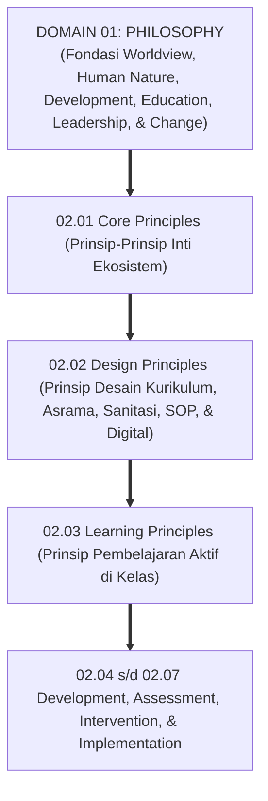
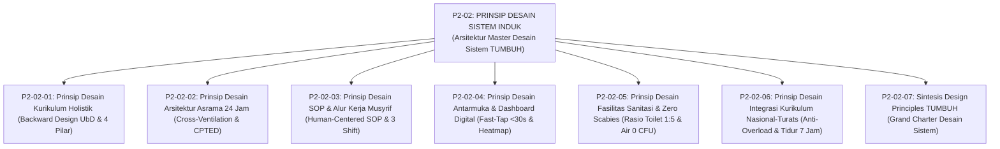
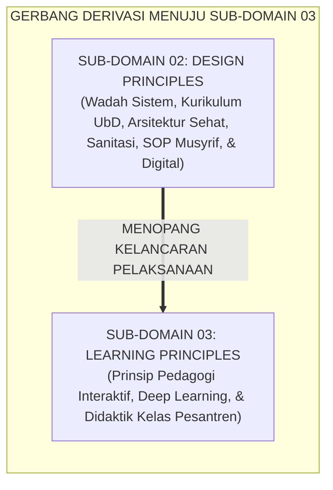

# P2-02: DESIGN PRINCIPLES (PRINSIP DESAIN SISTEM) EKOSISTEM TUMBUH
## *Monograf Induk Sub-Domain 02: Arsitektur Master Desain Sistem Pesantren Holistik, Rekapitulasi 6 Pilar Desain (Kurikulum UbD, Arsitektur Asrama CPTED, SOP Musyrif Human-Centered, UI/UX Fast-Tap Logbook Digital, Fasilitas Sanitasi & Zero Scabies, serta Integrasi Kurikulum Nasional-Turats), serta Gerbang Derivasi Menuju Sub-Domain 03 Learning Principles*

**Nomor Identifikasi**: `P2-02/MONOGRAF-INDUK-DESIGN-PRINCIPLES/2026`  
**Domain**: `02 Principles` > `02 Design Principles`  
**Klasifikasi Naskah**: *Master Sub-Domain Monograph* (Monograf Induk Sub-Domain Prinsip Desain Sistem)  
**Rumpun Disiplin Pengkaji**: Rekayasa Sistem Pendidikan Islam Terpadu, Desain Arsitektur & Ergonomi Pesantren, Manajemen Operasional Pengasuhan 24 Jam, Rekayasa Perangkat Lunak & Sistem Informasi PBIS  

---

> ### 💡 INTISARI PRAKTIS (3 MENIT PAHAM UNTUK ASATIDZ & MUSYRIF)
>
> * **Posisi Sub-Domain 02 Design Principles:**  
>   Menjawab pertanyaan mendasar kedua dalam perancangan ekosistem pesantren: *"Bagaimanakah seluruh infrastruktur dan proses pembinaan santri (kurikulum, bangunan fisik asrama, SOP kerja pengasuh, fasilitas sanitasi thaharah, integrasi mapel, dan sistem informasi digital) dirancang secara terpadu agar membentuk lingkungan yang aman, sehat, manusiawi, dan sarat nilai adab?"*
> * **Enam Pilar Desain Sistem Ekosistem TUMBUH yang Terintegrasi:**  
>   1. **P2-02-01 (Kurikulum Holistik UbD):** Memadukan Dirasah Turats, Tahfizh Qur'an, SEL Adab, dan Sains melalui *Backward Design* dan penyelarasan kelas-asrama 24 jam.  
>   2. **P2-02-02 (Arsitektur Asrama Sehat CPTED):** Tata ruang fisik ramah fitrah (Cross-Ventilation, cahaya 300 Lux, kasur single mandiri, dan bebas blindspots).  
>   3. **P2-02-03 (SOP Musyrif Human-Centered):** Manajemen 3 shift kerja manusiawi (max 8–10 jam kerja aktif), *Mandatory Day-Off*, dan alur tanggap darurat medis terstruktur.  
>   4. **P2-02-04 (UI/UX Logbook Digital Fast-Tap):** Aplikasi pencatatan adab cepat <30 detik berbasis 10 Heuristik Usability Nielsen dan visualisasi peta panas PBIS.  
>   5. **P2-02-05 (Fasilitas Sanitasi & Zero Scabies):** Rasio toilet 1:5, air 0 CFU E. Coli, eliminasi scabies 100%, dan ventilasi termal.  
>   6. **P2-02-06 (Integrasi Kurikulum Nasional-Turats):** Peleburan tematik interdisipliner Concept-Based, anti-overload, dan hak tidur sehat 7 jam.
> * **Fondasi Kuat Bagi Proses Pembelajaran (03 Learning Principles):**  
>   Infrastruktur dan sistem yang sehat ini menjadi wadah tempat beroperasinya prinsip-prinsip pembelajaran interaktif di Sub-Domain `03 Learning Principles`.

---

## 📑 DAFTAR ISI MONOGRAF INDUK

- [BAGIAN I: ARSITEKTUR ONTOLOGIS & POHON HUBUNGAN SUB-DOMAIN 02](#bagian-i-arsitektur-ontologis--pohon-hubungan-sub-domain-02)
  - [1. Posisi Dokumen dalam Taksonomi 11 Domain TUMBUH](#1-posisi-dokumen-dalam-taksonomi-11-domain-tumbuh)
  - [2. Pohon Hubungan Antar-Monograf Sub-Domain 02 Design Principles](#2-pohon-hubungan-antar-monograf-sub-domain-02-design-principles)
  - [3. Rangkuman 6 Pilar Desain Arsitektur Sistem Pesantren](#3-rangkuman-6-pilar-desain-arsitektur-sistem-pesantren)
  - [4. Penegasan Triad Pertumbuhan Simbiotik dalam Desain Sistem](#4-penegasan-triad-pertumbuhan-simbiotik-dalam-desain-sistem)
- [BAGIAN II: KODIFIKASI MATRIKS RESMI & DIREKTORI MONOGRAF TERPADU](#bagian-ii-kodifikasi-matriks-resmi--direktori-monograf-terpadu)
  - [1. Matriks Rujukan Lengkap 7 Berkas Monograf Sub-Domain 02](#1-matriks-rujukan-lengkap-7-berkas-monograf-sub-domain-02)
  - [2. Gerbang Derivasi Menuju Sub-Domain 03 Learning Principles](#2-gerbang-derivasi-menuju-sub-domain-03-learning-principles)
- [BAGIAN III: APARATUS AKADEMIS & APENDIKS](#bagian-iii-aparatus-akademis--apendiks)
  - [1. Daftar Pustaka Otoritatif Turats & Sains Global](#1-daftar-pustaka-otoritatif-turats--sains-global)
  - [2. Catatan Kaki Akademis (Footnotes)](#2-catatan-kaki-akademis-footnotes)
  - [3. Glosarium Istilah Kunci Desain Sistem Induk](#3-glosarium-istilah-kunci-desain-sistem-induk)

---

# BAGIAN I: ARSITEKTUR ONTOLOGIS & POHON HUBUNGAN SUB-DOMAIN 02

---

### 1. Posisi Dokumen dalam Taksonomi 11 Domain TUMBUH

---

### 2. Pohon Hubungan Antar-Monograf Sub-Domain 02 Design Principles

Sub-Domain `02 Design Principles` memuat 1 Monograf Induk dan 7 Monograf Riset Khusus yang saling menopang secara utuh:

---

### 3. Rangkuman 6 Pilar Desain Arsitektur Sistem Pesantren

1. **Pilar 1: Desain Kurikulum Holistik Terpadu (P2-02-01)**:  
   Menyatukan Dirasah Turats, Tahfizh Al-Qur'an, SEL Adab, dan Sains/Life Skills melalui metodologi *Understanding by Design (UbD)*.
2. **Pilar 2: Desain Arsitektur Fisik Asrama Sehat (P2-02-02)**:  
   Menegakkan syariat pemisahan ranjang tidur remaja (*Tafriq al-Madhaji'*), ventilasi silang, pencahayaan 300 Lux, dan arsitektur *CPTED* bebas blindspots.
3. **Pilar 3: Desain SOP & Alur Kerja Musyrif Human-Centered (P2-02-03)**:  
   Menerapkan sistem manajemen 3 shift kerja teratur (maks 8–10 jam kerja aktif), hak libur mingguan mandatori (*Day-Off* 24 jam), dan serah terima tugas 10 menit.
4. **Pilar 4: Desain UI/UX Antarmuka Logbook PBIS (P2-02-04)**:  
   Menerapkan 10 Heuristik Usability Jakob Nielsen, kaidah *Fast-Tap* (<30 detik), arsitektur *Offline-First PWA*, dan analitik Peta Panas Spasial PBIS.
5. **Pilar 5: Desain Fasilitas Sanitasi & Eliminasi Scabies (P2-02-05)**:  
   Menjamin rasio toilet 1:5, air bersih 0 CFU *E. Coli*, protokol eliminasi kudis massal, dan penjemuran kasur mingguan.
6. **Pilar 6: Desain Integrasi Kurikulum Nasional & Turats (P2-02-06)**:  
   Peleburan tematik interdisipliner *Concept-Based*, eliminasi kelebihan beban pelajaran, dan jaminan kepastian hak tidur sehat 7 jam di malam hari.[^1]

---

### 4. Penegasan Triad Pertumbuhan Simbiotik dalam Desain Sistem

* **Santri Tumbuh**: Terlindungi kesehatannya di asrama berventilasi segar, terhindar dari penyakit scabies, tidak mengalami overload kurikulum, dan tidur nyenyak 7 jam.
* **Musyrif Tumbuh**: Memiliki jam istirahat teratur, terhindar dari kelelahan mental (*Burnout*), dan dimudahkan pekerjaannya melalui aplikasi digital yang praktis.
* **Sistem Lembaga Tumbuh**: Memiliki standarisasi SOP baku tertulis, infrastruktur yang aman dan tahan lama, serta tata kelola transparan berbasis data analitik objektif.

---

# BAGIAN II: KODIFIKASI MATRIKS RESMI & DIREKTORI MONOGRAF TERPADU

---

### 1. Matriks Rujukan Lengkap 7 Berkas Monograf Sub-Domain 02

| Kode Berkas | Judul Naskah Monograf | Dewan Keilmuan Pengkaji | Tautan Berkas Markdown |
| :---: | :--- | :--- | :--- |
| **P2-02-01** | **Prinsip Desain Kurikulum Holistik** | `pakar-desain-kurikulum-adab` `pakar-psikologi-belajar` `pakar-epistemologi-turats` | [**`Buka Naskah P2-02-01`**](./P2-02-01-Prinsip-Desain-Kurikulum-Holistik.md) |
| **P2-02-02** | **Prinsip Desain Arsitektur Asrama 24 Jam** | `pakar-pengasuhan-asrama` `pakar-intervensi-preventif` `pakar-arsitektur-pbis-restoratif` | [**`Buka Naskah P2-02-02`**](./P2-02-02-Prinsip-Desain-Arsitektur-Asrama-24-Jam.md) |
| **P2-02-03** | **Prinsip Desain SOP dan Alur Kerja Musyrif** | `pakar-pengasuhan-asrama` `pakar-tata-kelola-qudwah` `pakar-bimbingan-konseling` | [**`Buka Naskah P2-02-03`**](./P2-02-03-Prinsip-Desain-SOP-dan-Alur-Kerja-Musyrif.md) |
| **P2-02-04** | **Prinsip Desain Antarmuka dan Dashboard Digital** | `pakar-arsitektur-digital-pesantren` `pakar-pbis` `pakar-perlindungan-anak-dan-advokasi-santri` | [**`Buka Naskah P2-02-04`**](./P2-02-04-Prinsip-Desain-Antarmuka-dan-Dashboard-Digital.md) |
| **P2-02-05** | **Prinsip Desain Fasilitas Sanitasi & Zero Scabies** | `pakar-pengasuhan-asrama` `pakar-intervensi-preventif` `pakar-arsitektur-pbis-restoratif` | [**`Buka Naskah P2-02-05`**](./P2-02-05-Prinsip-Desain-Fasilitas-Sanitasi-dan-Kenyamanan-Termal-Asrama.md) |
| **P2-02-06** | **Prinsip Desain Integrasi Kurikulum Nasional** | `pakar-desain-kurikulum-adab` `pakar-pedagogi-master-guru` `pakar-psikologi-belajar` | [**`Buka Naskah P2-02-06`**](./P2-02-06-Prinsip-Desain-Integrasi-Kurikulum-Nasional-dan-Pesantren.md) |
| **P2-02-07** | **Sintesis Design Principles TUMBUH** | `pakar-filosofi-tumbuh` `pakar-kritikus-dan-auditor-kualitas` `pakar-tata-kelola-qudwah` | [**`Buka Naskah P2-02-07`**](./P2-02-07-Sintesis-Design-Principles-TUMBUH.md) |

---

### 2. Gerbang Derivasi Menuju Sub-Domain 03 Learning Principles

---

# BAGIAN III: APARATUS AKADEMIS & APENDIKS

---

### 1. Daftar Pustaka Otoritatif Turats & Sains Global

1. **Al-Qur'an al-Karim wa Tarjamatu Ma'anih**.
2. **Al-Bukhari, Muhammad bin Isma'il**. (1422 H). *Shahih al-Bukhari*. Beirut: Dar Thawq an-Najah.
3. **Muslim bin al-Hajjaj an-Naisaburi**. (1374 H). *Shahih Muslim*. Kairo: Isa al-Babi al-Halabi.
4. **Al-Ghazali, Abu Hamid Muhammad bin Muhammad**. (2011). *Ihya 'Ulumiddin*. Beirut: Dar al-Ma'rifah.
5. **Al-Attas, Syed Muhammad Naquib**. (1980). *The Concept of Education in Islam*. ABIM.
6. **Wiggins, G., & McTighe, J.**. (2005). *Understanding by Design* (2nd ed.). ASCD.
7. **Sweller, J., Ayres, P., & Kalyuga, S.**. (2011). *Cognitive Load Theory*. Springer.
8. **Jeffery, C. R.**. (1971). *Crime Prevention Through Environmental Design*. Sage.
9. **WHO / UNICEF**. (2018). *WASH in Schools Global Baseline Report*. Geneva.
10. **Nielsen, J.**. (1994). *Usability Engineering*. Morgan Kaufmann.

---

### 2. Catatan Kaki Akademis (*Footnotes*)

[^1]: Wiggins & McTighe (2005), *Understanding by Design*; Jeffery, C. R. (1971), *CPTED*; WHO/UNICEF (2018), *WASH in Schools*.

---

### 3. Glosarium Istilah Kunci Desain Sistem Induk

1. **Integrated Educational Systems Engineering**: Pendekatan rekayasa terpadu yang merancang seluruh komponen pendidikan (kurikulum, tata ruang fisik, alur proses kerja manusia, dan perangkat lunak digital) sebagai satu sistem yang koheren.
2. **Backward Design**: Metodologi perancangan kurikulum yang dimulai dari penentuan hasil akhir pemahaman bermakna sebelum menyusun modul ajar.
3. **Tafriq al-Madhaji'**: Perintah syariat pemisahan tempat tidur anak untuk memelihara privasi aurat dan kesehatan jasmani.
4. **Cross-Ventilation**: Sistem sirkulasi penghawaan alami silang untuk menjamin ketersediaan oksigen segar terus-menerus di asrama.
5. **Zero Scabies Mandate**: Kebijakan kelembagaan bebas 100% dari penyakit kudis scabies melalui terapi serempak dan sterilisasi sprei/kasur.
6. **Concept-Based Curriculum**: Model kurikulum yang mengorganisir materi di bawah gagasan konseptual besar (*Big Ideas*).
7. **Mandatory Day-Off**: Hak libur wajib 24 jam per pekan bagi musyrif di luar asrama demi mencegah kejenuhan mental (*Burnout*).
8. **Fast-Tap Interaction**: Desain antarmuka logbook digital yang memungkinkan pengisian data adab selesai dalam waktu <30 detik.
9. **Spatial Heatmap PBIS**: Peta grafis visual frekuensi insiden santri pada denah asrama untuk memandu patroli pencegahan.
10. **Triad Pertumbuhan Simbiotik**: Prinsip mutlak ekosistem TUMBUH di mana pertumbuhan Santri, Guru/Musyrif, dan Sistem Lembaga saling menopang secara serempak.
