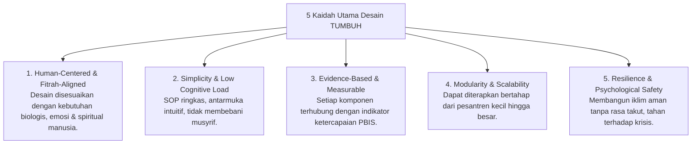

# P2-02-Prinsip-Desain-Sistem-TUMBUH (Design Principles Induk)

## Tujuan
Menetapkan prinsip-prinsip desain (*Design Principles*) yang memandu arsitektur seluruh subsistem dalam ekosistem TUMBUH: memastikan setiap modul kurikulum, tata ruang fisik asrama, SOP musyrif, dan perangkat lunak digital dirancang secara ergonomis, terpadu, berbasis fitrah, dan mudah dioperasikan di lapangan.

---

## 1. 5 Kaidah Utama Desain Ekosistem TUMBUH

---

## 2. Rincian 5 Kaidah Desain

### 1. Desain Berpusat pada Manusia & Selaras Fitrah (*Fitrah-Aligned*)
* Sistem tidak memperlakukan santri dan musyrif sebagai "roda gigi mesin pabrik".
* Menghormati ritme sirkadian biologis (jam tidur minimal 6–7 jam, nutrisi seimbang, waktu relaksasi, dan ruang privasi).

### 2. Kesederhanaan & Beban Kognitif Rendah (*Simplicity & Low Friction*)
* SOP musyrif tidak boleh berupa dokumen tebal 100 halaman yang tidak terbaca, melainkan kartu alur visual (*Flowchart / Quick Guide*) yang dapat diakses dalam hitungan detik.
* Input logbook digital musyrif dirancang selesai dalam waktu kurang dari 30–60 detik per entri.

### 3. Berbasis Bukti & Terukur (*Evidence-Based*)
* Desain perilaku mengacu pada taksonomi kompetensi adab yang jelas indikatornya (misal: bukan hanya *"beradab"*, melainkan *"meletakkan sandal di rak sesuai nomor"*).

### 4. Modular & Skalabel (*Modular Architecture*)
* Pesantren dapat memulai implementasi dari **Modul Dasar (Tier 1 & Pembiasaan Asrama)**, kemudian bertahap mengintegrasikan **Sistem Digital & Analitik Lanjutan**.

### 5. Keamanan Psikologis & Ketahanan Sistem (*Psychological Safety*)
* Desain sistem menjamin pelaporan pelanggaran atau kendala pengasuhan tidak berujung pada saling menyalahkan, melainkan memicu mekanisme dukungan terpadu.

---

## 3. Status Dokumen
* **Status**: 🌟 **A+ (Dokumen Induk Design Principles)**
* **Level**: Project 2 - `02 Principles / 02 Design Principles`
* **Langkah Berikutnya**: **`P2-02-01-Prinsip-Desain-Kurikulum-Holistik.md`**.
