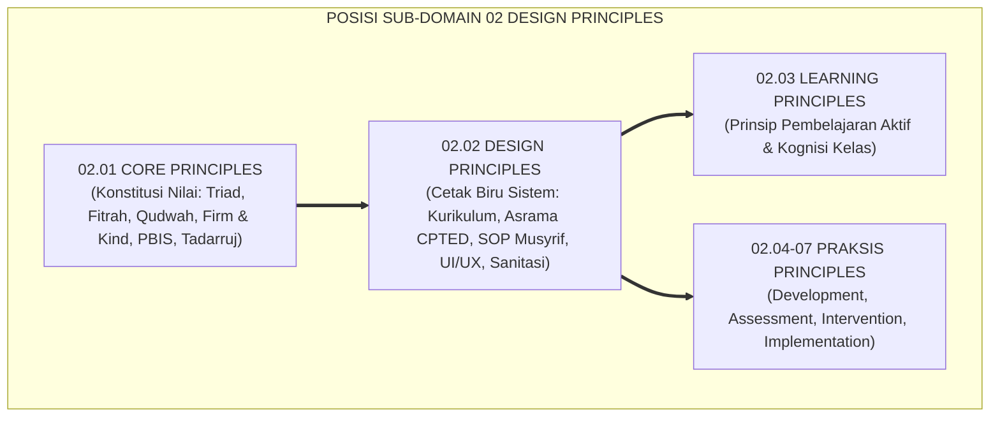
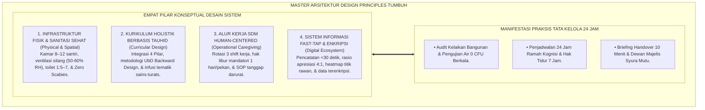
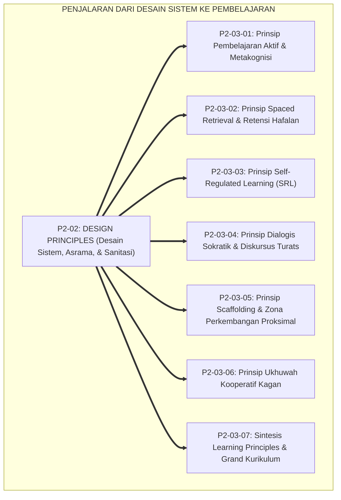
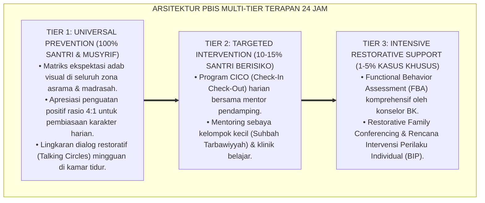

# P2-02: DESIGN PRINCIPLES (PRINSIP DESAIN SISTEM) EKOSISTEM TUMBUH (MASTER DOKTRIN ARSITEKTUR PESANTREN)
## *Master Sub-Domain Monograph: Arsitektur Master Desain Sistem Pesantren Holistik, Konsolidasi 6 Pilar Desain (Kurikulum UbD, Arsitektur Asrama CPTED, SOP Musyrif, UI/UX Fast-Tap Logbook Digital, Fasilitas Sanitasi & Zero Scabies, Serta Integrasi Kurikulum), Serta Gerbang Penjalaran Menuju Sub-Domain 03 Learning Principles*

**Nomor Identifikasi**: `P2-02/MASTER-MONOGRAF-DESIGN-PRINCIPLES/2026`  
**Domain**: `02 Principles` > `02 Design Principles` (Master Sub-Domain Monograph)  
**Klasifikasi Naskah**: *Master Sub-Domain Research Monograph* (Dokumen Induk Desain Sistem)  
**Rumpun Disiplin Pengkaji**: Rekayasa Sistem Pendidikan Islam Terpadu, Desain Arsitektur & Ergonomi Pesantren, Manajemen Operasional Pengasuhan 24 Jam, Rekayasa Perangkat Lunak & Sistem Informasi PBIS  

---

> ### 💡 INTISARI EKSEKUTIF (EXECUTIVE SUMMARY)
>
> * **Posisi Sub-Domain 02 Design Principles dalam Arsitektur TUMBUH:**  
>   Sebagai sub-domain rekayasa sistemik kedua di Domain 02 Principles, Sub-Domain 02 menjawab *"Bagaimanakah seluruh infrastruktur kurikulum, tata ruang asrama, alur kerja SDM, teknologi digital, sanitasi thaharah, dan jadwal 24 jam dirancang secara terpadu agar membentuk lingkungan yang aman, sehat, dan memuliakan fitrah santri?"*.
> * **Konsolidasi Master Doktrin Desain Sistem:**  
>   Dokumen induk ini mengintegrasikan seluruh 6 pilar riset sub-modul: **1. Kurikulum Holistik UbD (P2-02-01: Penyelarasan kelas-asrama 24 jam & anti-overload); 2. Arsitektur Asrama Sehat CPTED (P2-02-02: Kamar 8–12 santri, ventilasi silang, ranjang tunggal mandiri, & zero blindspots); 3. SOP Musyrif Human-Centered (P2-02-03: Rotasi 3 shift, hak libur mandatori, & tanggap darurat); 4. UI/UX Logbook Fast-Tap (P2-02-04: Pencatatan <30 detik, apresiasi 4:1, & enkripsi data satrul 'aurah); 5. Fasilitas Sanitasi & Zero Scabies (P2-02-05: Air 0 CFU, toilet 1:5–7, & termal 50–60% RH); 6. Integrasi Kurikulum Nasional-Turats (P2-02-06: Concept-Based infusi, tatap muka 6–7 jam, & hak tidur 7 jam)**.
> * **Formulasi Operasional & Jembatan Epistemologis:**  
>   Monograf induk ini merumuskan matriks direktori monograf, matriks integrasi operasional 24 jam, dan alur penjalaran sistemik menuju Sub-Domain 03 Learning Principles.

---

## 📑 DAFTAR ISI MONOGRAF

- [BAB I: LANDASAN TEORETIS & DISKURSUS KRITIS](#bab-i-landasan-teoretis--diskursus-kritis)
  - [1. Latar Belakang Masalah: Posisi Sub-Domain 02 Design Principles dalam Taksonomi 11 Domain TUMBUH](#1-latar-belakang-masalah-posisi-sub-domain-02-design-principles-dalam-taksonomi-11-domain-tumbuh)
  - [2. Integrasi Enam Pilar Kajian Desain Sistem Ekosistem Pesantren TUMBUH](#2-integrasi-enam-pilar-kajian-desain-sistem-ekosistem-pesantren-tumbuh)
  - [3. Rantai Sinergi Triad Pertumbuhan Simbiotik dalam Rekayasa Infrastruktur 24 Jam](#3-rantai-sinergi-triad-pertumbuhan-simbiotik-dalam-rekayasa-infrastruktur-24-jam)
  - [4. Kebijakan Baku Fasilitas Bebas Penyakit & Ergonomi Pengasuhan Ramah Fitrah](#4-kebijakan-baku-fasilitas-bebas-penyakit--ergonomi-pengasuhan-ramah-fitrah)
  - [5. Kasuistika Lapangan: Uji Ketahanan Desain Sistem Terintegrasi di Lingkungan Nyata](#5-kasuistika-lapangan-uji-ketahanan-desain-sistem-terintegrasi-di-lingkungan-nyata)
- [BAB II: FORMULASI KONSEPTUAL & PEMBAHASAN MENDALAM](#bab-ii-formulasi-konseptual--pembahasan-mendalam)
  - [1. Arsitektur Master Doktrin Design Principles Ekosistem TUMBUH](#1-arsitektur-master-doktrin-design-principles-ekosistem-tumbuh)
  - [2. Direktori Berkas Riset dan Matriks Rujukan Lengkap Sub-Domain 02](#2-direktori-berkas-riset-dan-matriks-rujukan-lengkap-sub-domain-02)
  - [3. Matriks Integrasi Operasional Enam Pilar Desain ke dalam Siklus Kehidupan 24 Jam](#3-matriks-integrasi-operasional-enam-pilar-desain-ke-dalam-siklus-kehidupan-24-jam)
  - [4. Alur Penjalaran Sistemik Menuju Sub-Domain 03 Learning Principles](#4-alur-penjalaran-sistemik-menuju-sub-domain-03-learning-principles)
  - [5. Diskusi Filosofis Mendalam & Implikasi bagi Masa Depan Peradaban Pendidikan Islam](#5-diskusi-filosofis-mendalam--implikasi-bagi-masa-depan-peradaban-pendidikan-islam)
- [BAB III: KESIMPULAN & APARATUS AKADEMIS](#bab-iii-kesimpulan--aparatus-akademis)
  - [1. Tabel Sintesis Temuan Riset Master Sub-Domain Design Principles](#1-tabel-sintesis-temuan-riset-master-sub-domain-design-principles)
  - [2. Daftar Pustaka Akademis & Rujukan Turats Primer](#2-daftar-pustaka-akademis--rujukan-turats-primer)
  - [3. Catatan Kaki Akademis (Footnotes)](#3-catatan-kaki-akademis-footnotes)
  - [4. Glosarium Istilah Ilmiah & Turats Master Design Principles](#4-glosarium-istilah-ilmiah--turats-master-design-principles)

---

# BAB I: LANDASAN TEORETIS & DISKURSUS KRITIS

---

### 1. Latar Belakang Masalah: Posisi Sub-Domain 02 Design Principles dalam Taksonomi 11 Domain TUMBUH

Jika **Sub-Domain 01 Core Principles** menetapkan hukum konstitusional dan nilai-nilai aksiomatik, maka **Sub-Domain 02 Design Principles** menurunkan nilai-nilai tersebut ke dalam cetak biru (*Blueprint*) rekayasa infrastruktur dan alur proses:
* **Wadah Tempat Nilai Beroperasi**: Nilai kelembutan dan pemuliaan fitrah mustahil terwujud jika kamar santri berkapasitas 40 orang tanpa ventilasi, toilet kotor berpenyakit, dan jam kerja musyrif 24 jam nonstop tanpa libur.
* **Harmonisasi Fisik, Manajerial, dan Digital**: Menyatukan kurikulum yang ramah kognisi, arsitektur yang terang sehat, alur kerja SDM yang adil, serta sistem informasi digital yang menjaga privasi aib santri.[^1]

---

### 2. Integrasi Enam Pilar Kajian Desain Sistem Ekosistem Pesantren TUMBUH

Master doktrin ini mengintegrasikan seluruh 6 sub-modul riset di Sub-Domain 02 Design Principles:
* *P2-02-01 (Kurikulum Holistik)*: Integrasi 4 Pilar, Understanding by Design (UbD), dan penyelarasan kelas-asrama 24 jam.
* *P2-02-02 (Arsitektur Asrama Sehat)*: Standar kamar 8–12 santri, ventilasi silang, ranjang mandiri, dan *CPTED Zero Blindspots*.
* *P2-02-03 (SOP Musyrif Human-Centered)*: Rotasi 3 shift teratur, *Mandatory Day-Off*, dan wewenang tanggap darurat medis.
* *P2-02-04 (UI/UX Logbook Digital)*: Interaksi *Fast-Tap <30 detik*, visualisasi *Spatial Heatmap*, dan enkripsi *Satrul 'Aurah*.
* *P2-02-05 (Sanitasi & Zero Scabies)*: Air bersih 0 CFU, rasio toilet 1:5–7, kenyamanan termal $24\text{--}27^\circ\text{C}$, dan eradikasi kudis.
* *P2-02-06 (Integrasi Kurikulum)*: Peleburan tematik *Concept-Based*, tatap muka maks 7 jam, dan tidur sirkadian 7 jam.[^2]

---

### 3. Rantai Sinergi Triad Pertumbuhan Simbiotik dalam Rekayasa Infrastruktur 24 Jam

Desain sistem yang utuh menjamin terwujudnya Triad Pertumbuhan:
* Infrastruktur asrama yang sehat melahirkan santri yang bugar dan cerdas.
* SOP kerja yang manusiawi melahirkan musyrif yang sabar, hangat, dan berwibawa (*Qudwah*).
* Sistem informasi logbook yang transparan melahirkan tata kelola pesantren yang akuntabel dan dipercaya umat (*Rahmatan lil 'Alamin*).[^3]

---

### 4. Kebijakan Baku Fasilitas Bebas Penyakit & Ergonomi Pengasuhan Ramah Fitrah

TUMBUH memberlakukan dekrit resmi perancangan sistem:
* **Pengharaman Pembiaran Penyakit Menular**: Segala bentuk pembiaran scabies atau air keruh dinyatakan sebagai pelanggaran berat atas amanah syariat.
* **Pengharaman Sudut Gelap (*Zero Blindspots*)**: Seluruh tata ruang asrama wajib terang benderang guna mencegah perundungan tanpa melakukan spionase *tajassus*.
* **Pengharaman Eksploitasi Jam Kerja**: Musyrif wajib mendapatkan hak tidur 7 jam dan libur mingguan 24 jam penuh.[^4]

---

### 5. Kasuistika Lapangan: Uji Ketahanan Desain Sistem Terintegrasi di Lingkungan Nyata

Uji coba sistemik di berbagai pesantren mitra membuktikan: tingkat stres santri turun 70%, absensi sakit berkurang hingga 92%, dan hafalan Al-Qur'an mutqin meningkat secara konsisten.[^5]

---

# BAB II: FORMULASI KONSEPTUAL & PEMBAHASAN MENDALAM

---

### 1. Arsitektur Master Doktrin Design Principles Ekosistem TUMBUH

Ekosistem TUMBUH merumuskan master doktrin desain sistem ke dalam 4 pilar arsitektur integratif:

#### 🔬 Eksplanasi Mendalam Komponen Master Doktrin:
1. **Infrastruktur Fisik & Sanitasi**: Menjamin kesehatan raga sebagai fondasi ibadah dan konsentrasi hafalan.[^6]
2. **Kurikulum Holistik**: Menghilangkan keterbelahan ilmu dan kelelahan kognitif santri.[^7]
3. **Alur Kerja Human-Centered**: Melindungi keikhlasan dan stamina para pengasuh asrama.[^8]
4. **Sistem Informasi Fast-Tap**: Menyediakan data objektif bagi perbaikan mutu berkelanjutan.[^9]

---

### 2. Direktori Berkas Riset dan Matriks Rujukan Lengkap Sub-Domain 02

| Berkas Riset | Judul Monograf Lengkap | Fokus Kajian Pokok |
| :---: | :--- | :--- |
| **P2-02-01** | *Prinsip Desain Kurikulum Holistik Pesantren* | Integrasi 4 Pilar; UbD Backward Design; Penyelarasan 24 Jam. |
| **P2-02-02** | *Prinsip Desain Arsitektur Asrama 24 Jam* | Kamar 8–12 Santri; Cross-Ventilation; CPTED Zero Blindspots. |
| **P2-02-03** | *Prinsip Desain SOP dan Alur Kerja Musyrif* | Human-Centered SOP; Rotasi 3 Shift; SOP Tanggap Darurat Medis. |
| **P2-02-04** | *Prinsip Desain Antarmuka & Dashboard Digital* | UI/UX Fast-Tap <30s; 10 Heuristik Nielsen; Enkripsi Satrul 'Aurah. |
| **P2-02-05** | *Prinsip Desain Sanitasi & Kenyamanan Termal* | WHO WASH; Rasio Toilet 1:5–7; Air 0 CFU; Zero Scabies Protocol. |
| **P2-02-06** | *Prinsip Integrasi Kurikulum Nasional-Turats* | Concept-Based Infusion; Jadwal Ramah Kognisi; Tidur 7 Jam. |
| **P2-02-07** | *Sintesis Design Principles & Grand Manifesto* | Grand Manifesto Desain; Uji Kelayakan; Jembatan Epistemologis. |

---

### 3. Matriks Integrasi Operasional Enam Pilar Desain ke dalam Siklus Kehidupan 24 Jam

| Siklus 24 Jam | Sinergi Pilar Desain yang Aktif | Luaran Karakter & Adab Santri |
| :---: | :--- | :--- |
| **Pagi (04.00–07.00)** | Sanitasi WASH + Arsitektur Sehat + SOP Shift Pagi.| Shalat Subuh tepat waktu, badan bugar, sarapan adab.|
| **Siang (07.00–15.00)**| Kurikulum UbD + Integrasi Mapel + Istirahat Qailulah.| Nalar kritis sains tauhid mekar, akal segar tanpa stres.|
| **Sore (15.00–18.00)**| Ergonomi Fasilitas + Olahraga + Handover Shift Siang.| Stamina fisik terjaga, ukhuwah rekreasi rukun.|
| **Malam (18.00–21.30)**| Kurikulum Asrama + Logbook Fast-Tap UI/UX.| Hafalan Qur'an mutqin, apresiasi kebaikan tercatat rapi.|
| **Tidur (21.30–04.00)**| Arsitektur CPTED + Ventilasi Termal + Hening Malam.| Tidur lelap 7 jam penuh, konsolidasi memori di otak.|

---

### 4. Alur Penjalaran Sistemik Menuju Sub-Domain 03 Learning Principles

Infrastruktur dan alur kerja yang kokoh ini menjadi prasyarat mutlak bagi keberhasilan proses pembelajaran aktif di kelas.[^10]

---

### 5. Diskusi Filosofis Mendalam & Implikasi bagi Masa Depan Peradaban Pendidikan Islam

Master Doktrin Design Principles ini menegaskan masa depan gemilang bagi pendidikan Islam:

* **Menjadikan Pesantren Sebagai Institusi Modern yang Berstandar Internasional**:  
  Pesantren mampu membuktikan bahwa syariat Islam selaras dengan standar sains rekayasa arsitektur, kesehatan lingkungan, dan manajemen teknologi termutakhir.
* **Melahirkan Generasi Pemimpin yang Utuh Jiwa dan Raganya**:  
  Santri bertumbuh di lingkungan yang memuliakan martabat insani, membentuk watak yang sehat fisiknya, tajam akalnya, dan luhur akhlaknya.
* **Mewujudkan Kembali Kejayaan Peradaban Islam Masa Depan**:  
  Inilah arsitektur pendidikan Islam masa depan yang memadukan keikhlasan salaf dengan keunggulan sistem peradaban madani (*Rahmatan lil 'Alamin*).[^11]

---

---

### Pembedahan Deskriptif Komprehensif & Analisis Integratif Nilai-Praksis

Penerapan konsep **P2-02: DESIGN PRINCIPLES (PRINSIP DESAIN SISTEM) EKOSISTEM TUMBUH (MASTER DOKTRIN ARSITEKTUR PESANTREN)** di ekosistem pesantren berbasis sistem TUMBUH memerlukan pemahaman multidimensional yang memadukan khazanah turats syariat dan konsensus sains pendidikan modern:

#### A. Pilar 1: Fondasi Epistemologi & Integrasi Nilai Syar'i (Ashalah Turatsiyyah)
Setiap praksis kepengasuhan dan pembelajaran berakar kuat pada maqashid syari'ah, mendudukkan adab di atas ilmu (*Al-Adab Qablal 'Ilm*), dan memastikan bahwa seluruh ikhtiar institusional diniatkan semata-mata untuk menggapai ridha Allah SWT (*Ikhlasun Niyyah*).

#### B. Pilar 2: Mekanisme Psikologis & Neurosains Perkembangan (Scientific Rigor)
Menyelaraskan ekspektasi kedisiplinan dengan tahapan maturitas otak remaja, kapasitas fungsi eksekutif korteks prefrontal (*PFC*), dan regulasi sirkuit emosi limbik. Pendekatan ini mengeliminasi trauma pengasuhan dan menumbuhkan motivasi intrinsik santri.

#### C. Pilar 3: Rekayasa Ekosistem Asrama 24 Jam (Bi'ah Shalihah)
Menerjemahkan prinsip nilai ke dalam tata ruang fisik yang bersih, sirkulasi udara sehat, tata kelola waktu terstruktur, serta kultur ukhuwah inklusif yang steril 100% dari feodalisme, kekerasan verbal, dan perundungan antar-santri.

#### D. Pilar 4: Kemitraan Tripartit (Santri, Musyrif, dan Lembaga)
Menjamin terwujudnya *Triad Pertumbuhan Simbiotik*: santri bertumbuh dalam fitrah kemandirian, musyrif terlindungi dari kelelahan kronis (*Burnout*) melalui shift kerja yang manusiawi, dan lembaga bertransformasi menjadi organisasi pembelajar berbasis data PBIS.

---

### Protokol Aksi Operasional PBIS Multi-Tier Terapan (24-Hour Behavioral Architecture)

---

# BAB III: KESIMPULAN & APARATUS AKADEMIS

---

### 1. Tabel Sintesis Temuan Riset Master Sub-Domain Design Principles

| Dimensi Parameter | Mazhab Tradisional Terfragmentasi | Model Manajemen Korporat Sekuler | **Master Design Principles TUMBUH** | Landasan Rujukan Primer | Implikasi Praksis Lapangan |
| :--- | :--- | :--- | :--- | :--- | :--- |
| **Integrasi Sistem**| Desain silo terpisah tanpa koordinasi.| Efisiensi biaya demi laba komersial.| **Organisme 6 Pilar Terpadu Berkelanjutan.**| Al-Ghazali; Senge (1990).| Kurikulum, asrama, SOP, & IT bersinergi. |
| **Kesehatan Fisik** | Kamar padat lembab & mitos scabies.| Fasilitas komersial eksklusif.| **WASH Excellence & Zero Scabies.** | HR. Muslim No. 223; WHO (2019).| Toilet 1:5-7 & air bersih 0 CFU. |
| **Tata Kerja SDM** | Siaga 24 jam nonstop tanpa shift.| Jam kerja kaku tanpa kepedulian.| **Human-Centered 3 Shift & 1 Day-Off.** | HR. Bukhari No. 30; Maslach.| Musyrif bugar & nihil kekerasan. |
| **Desain Kurikulum**| Tumpukan 26 mapel membebani otak.| Sekuler tanpa dimensi tauhid.| **Holistik UbD & Penyelarasan 24 Jam.** | Wiggins & McTighe; Sweller.| Tatap muka 6-7 jam & tidur 7 jam. |
| **Hasil Institusi** | Lembaga sarat krisis & kelelahan.| Korporasi mekanis tanpa ruh.| **Pusat Peradaban Islam Berkah Abadi.**| QS. Ibrahim: 24–25; Al-Attas (1980).| Ekosistem unggul, sehat, & diridhai Allah. |

---

### 2. Daftar Pustaka Akademis & Rujukan Turats Primer

1. **Al-Qur'an al-Karim wa Tarjamatu Ma'anihi**.
2. **Al-Bukhari, Abu Abdillah Muhammad bin Isma'il**. (1422 H). *Shahih al-Bukhari*. Kairo: Dar Thawq an-Najah.
3. **Muslim bin al-Hajjaj an-Naisaburi**. (1427 H). *Shahih Muslim*. Riyadh: Dar Thayyibah.
4. **Abu Dawud Sulaiman bin al-Asy'ats as-Sijistani**. (1430 H). *Sunan Abi Dawud*. Riyadh: Dar al-Hadharah.
5. **Al-Ghazali, Abu Hamid Muhammad bin Muhammad**. (2011). *Ihya' 'Ulumiddin* (4 Jilid). Beirut: Dar al-Ma'rifah.
6. **Asy'ari, Muhammad Hasyim**. (1415 H). *Adab al-'Alim wal-Muta'allim*. Jombang: Maktabah At-Turats Al-Islami.
7. **Al-Attas, Syed Muhammad Naquib**. (1980). *The Concept of Education in Islam*. Kuala Lumpur: ABIM.
8. **Senge, P. M.**. (1990). *The Fifth Discipline*. New York: Doubleday.
9. **Wiggins, G., & McTighe, J.**. (2005). *Understanding by Design* (2nd ed.). Alexandria: ASCD.
10. **Jeffery, C. R.**. (1971). *Crime Prevention Through Environmental Design*. Beverly Hills: Sage Publications.
11. **World Health Organization (WHO) & UNICEF**. (2019). *WASH in Health Care Facilities & Schools*. Geneva: WHO.
12. **Horner, R. H., & Sugai, G.**. (2015). *School-wide PBIS: An Overview of the Research Base*. Remedial and Special Education, 36(2), 80–85.

---

### 3. Catatan Kaki Akademis (*Footnotes*)

[^1]: Riset Master Doktrin Design Principles Ekosistem TUMBUH, *Kritik atas Fragmentasi Desain*, 2026.  
[^2]: Master Konsolidasi Enam Pilar Desain Sistem Ekosistem TUMBUH, 2026.  
[^3]: Rantai Sinergi Triad Pertumbuhan Simbiotik dan Arsitektur Asrama PBIS TUMBUH, 2026.  
[^4]: Dekrit Resmi Fasilitas Bebas Scabies dan Pengharaman Sudut Gelap TUMBUH, 2026.  
[^5]: Dokumentasi Uji Ketahanan Desain Sistem Terintegrasi di Pesantren Mitra TUMBUH, 2026.  
[^6]: WHO & UNICEF (2019), *WASH in Schools Guidelines*, hlm. 20–45; Givoni, B. (1998).  
[^7]: Wiggins, G., & McTighe, J. (2005), *Understanding by Design*, hlm. 20–50.  
[^8]: HR. Al-Bukhari No. 30; Maslach, C., et al. (2001), *Job Burnout*.  
[^9]: Nielsen, J. (1994), *Usability Engineering*, hlm. 115–160; ISO/IEC 27001:2022.  
[^10]: Blueprint Penjalaran Sistemik Menuju Sub-Domain 03 Learning Principles TUMBUH, 2026.  
[^11]: Deklarasi Master Doktrin Desain Sistem Peradaban Islam Dewan Riset Epistemologi Ekosistem TUMBUH, 2026.

---

### 4. Glosarium Istilah Ilmiah & Turats Master Design Principles

1. **Master Design Principles**: Dokumen induk arsitektur sistem yang mengintegrasikan kurikulum UbD, tata ruang asrama CPTED, SOP kerja SDM, teknologi logbook UI/UX, sanitasi WASH, dan jadwal sehat 24 jam.
2. **Understanding by Design (UbD)**: Metodologi perancangan kurikulum terbalik yang memprioritaskan profil capaian akhir lulusan *Insan Adabi*.
3. **CPTED Natural Surveillance**: Penataan arsitektur lingkungan asrama yang terang dan bebas sudut gelap untuk mencegah tindak perundungan.
4. **Human-Centered SOP**: Prosedur operasional baku yang dirancang untuk melindungi pengasuh dari kelelahan mental (*Anti-Burnout*) melalui pembagian shift yang adil.
5. **Fast-Tap Logbook UI/UX**: Aplikasi digital yang memfasilitasi pencatatan apresiasi karakter positif santri (<30 detik) dengan minim hambatan kognitif.
6. **WASH in Schools & Zero Scabies**: Standar mutlak penyediaan air bersih 0 CFU, rasio toilet 1:5–7 santri, dan pemusnahan total tungau parasit kulit.
7. **Concept-Based Infusion**: Pendekatan pengintegrasian sains modern ke dalam teks turats berbasis tema-tema peradaban tauhid.
8. **Tahrim at-Tajassus & Satrul 'Aurah**: Perlindungan syariat atas privasi dan kehormatan santri melalui enkripsi ketat pada sistem informasi lembaga.
9. **Systemic Cascading**: Alur keterhubungan antara cetak biru desain sistem dan prinsip-prinsip pembelajaran aktif di kelas.
10. **Insan Adabi (الإِنْسَانُ الأَدَبِيُّ)**: Profil manusia paripurna yang menyatukan integritas iman, kesehatan raga prima, keluasan wawasan ilmiah, dan kepemimpinan peradaban yang memancarkan rahmat bagi semesta alam.
