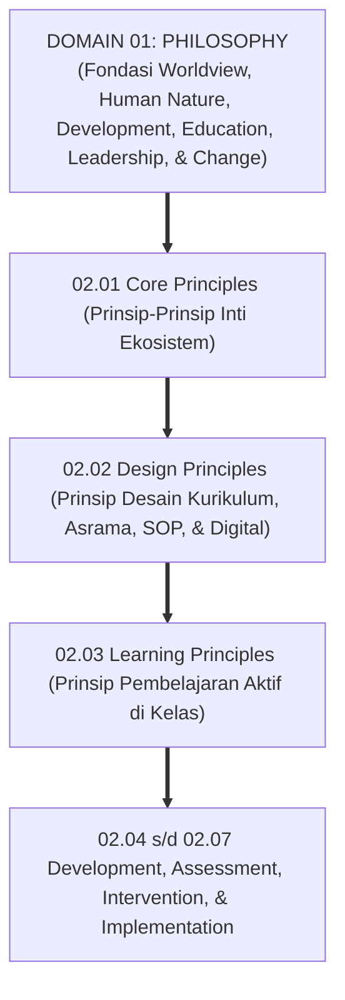
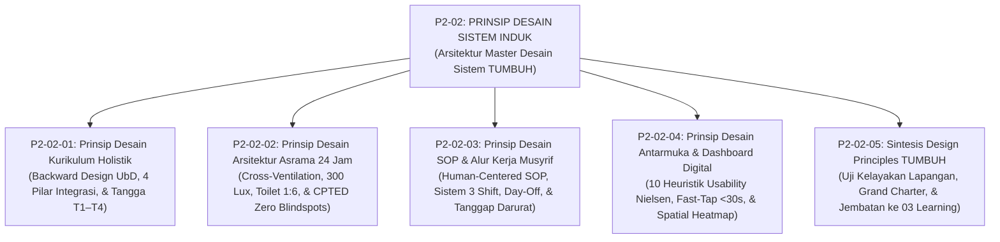
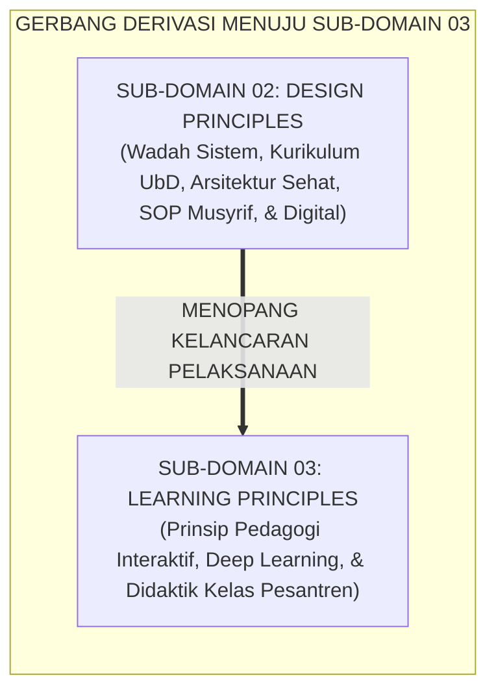

# P2-02: DESIGN PRINCIPLES (PRINSIP DESAIN SISTEM) EKOSISTEM TUMBUH
## *Monograf Induk Sub-Domain 02: Arsitektur Master Desain Sistem Pesantren Holistik, Rekapitulasi 4 Pilar Desain (Kurikulum UbD, Arsitektur Asrama CPTED, SOP Musyrif Human-Centered, & UI/UX Fast-Tap Logbook Digital), serta Gerbang Derivasi Menuju Sub-Domain 03 Learning Principles*

**Nomor Identifikasi**: `P2-02/MONOGRAF-INDUK-DESIGN-PRINCIPLES/2026`  
**Domain**: `02 Principles` > `02 Design Principles`  
**Klasifikasi Naskah**: *Master Sub-Domain Monograph* (Monograf Induk Sub-Domain Prinsip Desain Sistem)  
**Rumpun Disiplin Pengkaji**: Rekayasa Sistem Pendidikan Islam Terpadu, Desain Arsitektur & Ergonomi Pesantren, Manajemen Operasional Pengasuhan 24 Jam, Rekayasa Perangkat Lunak & Sistem Informasi PBIS  

---

> ### 💡 INTISARI PRAKTIS (3 MENIT PAHAM UNTUK ASATIDZ & MUSYRIF)
>
> * **Posisi Sub-Domain 02 Design Principles:**  
>   Menjawab pertanyaan mendasar kedua dalam perancangan ekosistem pesantren: *"Bagaimanakah seluruh infrastruktur dan proses pembinaan santri (kurikulum, bangunan fisik asrama, SOP kerja pengasuh, dan sistem informasi digital) dirancang secara terpadu agar membentuk lingkungan yang aman, sehat, manusiawi, dan sarat nilai adab?"*
> * **Empat Pilar Desain Sistem Ekosistem TUMBUH yang Terintegrasi:**  
>   1. **P2-02-01 (Kurikulum Holistik UbD):** Memadukan Dirasah Turats, Tahfizh Qur'an, SEL Adab, dan Sains melalui *Backward Design* dan penyelarasan kelas-asrama 24 jam.  
>   2. **P2-02-02 (Arsitektur Asrama Sehat CPTED):** Tata ruang fisik ramah fitrah (Cross-Ventilation, cahaya 300 Lux, toilet 1:6, kasur single mandiri, dan bebas blindspots).  
>   3. **P2-02-03 (SOP Musyrif Human-Centered):** Manajemen 3 shift kerja manusiawi (max 8–10 jam kerja aktif), *Mandatory Day-Off*, dan alur tanggap darurat medis terstruktur.  
>   4. **P2-02-04 (UI/UX Logbook Digital Fast-Tap):** Aplikasi pencatatan adab cepat <30 detik berbasis 10 Heuristik Usability Nielsen dan visualisasi peta panas PBIS.
> * **Fondasi Kuat Bagi Proses Pembelajaran (03 Learning Principles):**  
>   Infrastruktur dan sistem yang sehat ini menjadi wadah tempat beroperasinya prinsip-prinsip pembelajaran interaktif di Sub-Domain `03 Learning Principles`.

---

## 📑 DAFTAR ISI MONOGRAF INDUK

- [BAGIAN I: ARSITEKTUR ONTOLOGIS & POHON HUBUNGAN SUB-DOMAIN 02](#bagian-i-arsitektur-ontologis--pohon-hubungan-sub-domain-02)
  - [1. Posisi Dokumen dalam Taksonomi 11 Domain TUMBUH](#1-posisi-dokumen-dalam-taksonomi-11-domain-tumbuh)
  - [2. Pohon Hubungan Antar-Monograf Sub-Domain 02 Design Principles](#2-pohon-hubungan-antar-monograf-sub-domain-02-design-principles)
  - [3. Rangkuman 4 Pilar Desain Arsitektur Sistem Pesantren](#3-rangkuman-4-pilar-desain-arsitektur-sistem-pesantren)
  - [4. Penegasan Triad Pertumbuhan Simbiotik dalam Desain Sistem](#4-penegasan-triad-pertumbuhan-simbiotik-dalam-desain-sistem)
- [BAGIAN II: KODIFIKASI MATRIKS RESMI & DIREKTORI MONOGRAF TERPADU](#bagian-ii-kodifikasi-matriks-resmi--direktori-monograf-terpadu)
  - [1. Matriks Rujukan Lengkap 5 Berkas Monograf Sub-Domain 02](#1-matriks-rujukan-lengkap-5-berkas-monograf-sub-domain-02)
  - [2. Gerbang Derivasi Menuju Sub-Domain 03 Learning Principles](#2-gerbang-derivasi-menuju-sub-domain-03-learning-principles)
- [BAGIAN III: APARATUS AKADEMIS & APENDIKS](#bagian-iii-aparatus-akademis--apendiks)
  - [1. Daftar Pustaka Otoritatif Turats & Sains Global](#1-daftar-pustaka-otoritatif-turats--sains-global)
  - [2. Catatan Kaki Akademis (Footnotes)](#2-catatan-kaki-akademis-footnotes)
  - [3. Glosarium Istilah Kunci Desain Sistem Induk](#3-glosarium-istilah-kunci-desain-sistem-induk)

---

# BAGIAN I: ARSITEKTUR ONTOLOGIS & POHON HUBUNGAN SUB-DOMAIN 02

---

### 1. Posisi Dokumen dalam Taksonomi 11 Domain TUMBUH

Jika **Domain 01 Philosophy** meletakkan fondasi teologis dan ontologis (*Mengapa dan Apa Hakikat Pendidikan*), maka **Domain 02 Principles > 02 Design Principles** menetapkan **Bagaimana Seluruh Wadah Sistemik & Infrastruktur Pendidikan Pesantren Dirancang Secara Holistik**:

---

### 2. Pohon Hubungan Antar-Monograf Sub-Domain 02 Design Principles

Sub-Domain `02 Design Principles` memuat 1 Monograf Induk dan 5 Monograf Riset Khusus yang saling menopang secara utuh:

---

### 3. Rangkuman 4 Pilar Desain Arsitektur Sistem Pesantren

1. **Pilar 1: Desain Kurikulum Holistik Terpadu (P2-02-01)**:  
   Menyatukan Dirasah Turats, Tahfizh Al-Qur'an, SEL Adab, dan Sains/Life Skills. Menerapkan metodologi *Understanding by Design (UbD)*, menyelaraskan materi kelas pagi dengan praktik asrama malam 24 jam, dan mengeliminasi kelebihan beban kognitif (*Cognitive Load Theory*).
2. **Pilar 2: Desain Arsitektur Fisik Asrama Sehat (P2-02-02)**:  
   Menegakkan syariat pemisahan ranjang tidur remaja (*Tafriq al-Madhaji'* HR. Abu Dawud). Menjamin sirkulasi udara silang (*Cross-Ventilation*), pencahayaan alami 300 Lux, rasio toilet berkeadilan 1:6, dan arsitektur *CPTED* bebas dari titik buta kejahatan.
3. **Pilar 3: Desain SOP & Alur Kerja Musyrif Human-Centered (P2-02-03)**:  
   Menerapkan sistem manajemen 3 shift kerja teratur (maksimal 8–10 jam kerja aktif), hak libur mingguan mandatori (*Day-Off* 24 jam) guna mencegah *burnout*, standarisasi SOP tanggap darurat medis, dan sesi serah terima tugas (*Shift Handover*) 10 menit.
4. **Pilar 4: Desain UI/UX Antarmuka & Dashboard Logbook PBIS (P2-02-04)**:  
   Menerapkan 10 Heuristik Usability Jakob Nielsen dan kaidah *Fast-Tap* (<30 detik per entri data adab). Membangun sistem *Offline-First PWA*, menyajikan analitik Peta Panas Spasial PBIS, dan melindungi kerahasiaan data rekam psikologis santri (AES-256).[^1]

---

### 4. Penegasan Triad Pertumbuhan Simbiotik dalam Desain Sistem

* **Santri Tumbuh**: Terlindungi kesehatannya di asrama berventilasi segar, terhindar dari penyakit scabies, tidak mengalami overload kurikulum, dan merasakan keadilan pengasuhan.
* **Musyrif Tumbuh**: Memiliki jam istirahat teratur, terhindar dari kelelahan mental (*Burnout*), dan dimudahkan pekerjaannya melalui aplikasi digital yang praktis.
* **Sistem Lembaga Tumbuh**: Memiliki standarisasi SOP baku tertulis, infrastruktur yang aman dan tahan lama, serta tata kelola transparan berbasis data analitik objektif.

---

# BAGIAN II: KODIFIKASI MATRIKS RESMI & DIREKTORI MONOGRAF TERPADU

---

### 1. Matriks Rujukan Lengkap 5 Berkas Monograf Sub-Domain 02

| Kode Berkas | Judul Naskah Monograf | Dewan Keilmuan Pengkaji | Tautan Berkas Markdown |
| :---: | :--- | :--- | :--- |
| **P2-02-01** | **Prinsip Desain Kurikulum Holistik** | `pakar-desain-kurikulum-adab` `pakar-psikologi-belajar` `pakar-epistemologi-turats` | [**`Buka Naskah P2-02-01`**](./P2-02-01-Prinsip-Desain-Kurikulum-Holistik.md) |
| **P2-02-02** | **Prinsip Desain Arsitektur Asrama 24 Jam** | `pakar-pengasuhan-asrama` `pakar-intervensi-preventif` `pakar-arsitektur-pbis-restoratif` | [**`Buka Naskah P2-02-02`**](./P2-02-02-Prinsip-Desain-Arsitektur-Asrama-24-Jam.md) |
| **P2-02-03** | **Prinsip Desain SOP dan Alur Kerja Musyrif** | `pakar-pengasuhan-asrama` `pakar-tata-kelola-qudwah` `pakar-bimbingan-konseling` | [**`Buka Naskah P2-02-03`**](./P2-02-03-Prinsip-Desain-SOP-dan-Alur-Kerja-Musyrif.md) |
| **P2-02-04** | **Prinsip Desain Antarmuka dan Dashboard Digital** | `pakar-arsitektur-digital-pesantren` `pakar-pbis` `pakar-perlindungan-anak-dan-advokasi-santri` | [**`Buka Naskah P2-02-04`**](./P2-02-04-Prinsip-Desain-Antarmuka-dan-Dashboard-Digital.md) |
| **P2-02-05** | **Sintesis Design Principles TUMBUH** | `pakar-filosofi-tumbuh` `pakar-kritikus-dan-auditor-kualitas` `pakar-tata-kelola-qudwah` | [**`Buka Naskah P2-02-05`**](./P2-02-05-Sintesis-Design-Principles-TUMBUH.md) |

---

### 2. Gerbang Derivasi Menuju Sub-Domain 03 Learning Principles

---

# BAGIAN III: APARATUS AKADEMIS & APENDIKS

---

### 1. Daftar Pustaka Otoritatif Turats & Sains Global

1. **Al-Qur'an al-Karim wa Tarjamatu Ma'anih**.
2. **Al-Bukhari, Muhammad bin Isma'il**. (1422 H). *Shahih al-Bukhari*. Beirut: Dar Thawq an-Najah.
3. **Muslim bin al-Hajjaj an-Naisaburi**. (1374 H). *Shahih Muslim*. Kairo: Isa al-Babi al-Halabi.
4. **Abu Dawud, Sulaiman bin al-Asy'ats as-Sijistani**. (2009). *Sunan Abi Dawud*. Damaskus: Dar ar-Risalah.
5. **Al-Ghazali, Abu Hamid Muhammad bin Muhammad**. (2011). *Ihya 'Ulumiddin*. Beirut: Dar al-Ma'rifah.
6. **Az-Zarnuji, Burhanuddin**. (2008). *Ta'lim al-Muta'allim Thariq at-Ta'allum*. Beirut: Dar Ibn Hazm.
7. **Wiggins, G., & McTighe, J.**. (2005). *Understanding by Design* (2nd ed.). ASCD.
8. **Sweller, J., Ayres, P., & Kalyuga, S.**. (2011). *Cognitive Load Theory*. New York: Springer.
9. **Jeffery, C. R.**. (1971). *Crime Prevention Through Environmental Design*. Sage Publications.
10. **Maslach, C., & Leiter, M. P.**. (2016). *Understanding the burnout experience*. World Psychiatry.
11. **Nielsen, J.**. (1994). *Usability Engineering*. Morgan Kaufmann.
12. **Norman, D. A.**. (2013). *The Design of Everyday Things*. Basic Books.

---

### 2. Catatan Kaki Akademis (*Footnotes*)

[^1]: Wiggins & McTighe (2005), *Understanding by Design*; Jeffery, C. R. (1971), *CPTED*; Nielsen, J. (1994), *Usability Engineering*.

---

### 3. Glosarium Istilah Kunci Desain Sistem Induk

1. **Backward Design (UbD)**: Perancangan kurikulum yang berawal dari penetapan hasil pemahaman bermakna akhir sebelum merumuskan asesmen dan modul ajar.
2. **Tafriq al-Madhaji'**: Perintah syariat pemisahan tempat tidur anak saat berusia 10 tahun untuk menjaga privasi aurat dan kesehatan jasmani.
3. **Cross-Ventilation**: Sistem ventilasi alami dengan bukaan berhadapan untuk sirkulasi udara segar yang sehat.
4. **Human-Centered Workflow**: Alur kerja operasional yang disesuaikan dengan kapasitas fisik dan mental pendidik agar terhindar dari stres dan *burnout*.
5. **Fast-Tap Interaction**: Pola interaksi antarmuka perangkat lunak berbasis sentuhan ikon cepat yang dapat diselesaikan dalam waktu kurang dari 30 detik.
6. **Spatial Heatmap**: Visualisasi denah grafis asrama yang menampilkan pemetaan titik rawan insiden perilaku secara *real-time*.
7. **Triad Pertumbuhan Simbiotik**: Prinsip mutlak di mana Santri, Musyrif, dan Sistem Lembaga saling bertumbuh serempak tanpa saling mengorbankan.
