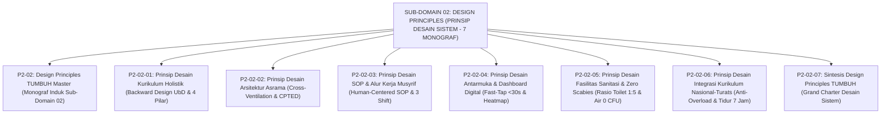

# SUB-DOMAIN 02: DESIGN PRINCIPLES (PRINSIP DESAIN SISTEM)
## *Sitemap Induk & Navigasi Monograf Desain Kurikulum UbD, Arsitektur Asrama CPTED, SOP Musyrif, UI/UX Logbook, Sanitasi & Zero Scabies, serta Integrasi Kurikulum (7 Monograf Terpadu)*

**Nomor Identifikasi**: `P2-02/INDEX/2026`  
**Domain**: `02 Principles` > `02 Design Principles`  
**Klasifikasi**: Folder Monograf Perancangan Arsitektur Kurikulum, Tata Ruang Asrama Sehat, SOP Pengasuhan Manusiawi, Sistem Informasi Digital, Fasilitas Sanitasi Sehat, & Integrasi Kurikulum (8 Berkas Lengkap)

---

## 🏛️ SITEMAP & NAVIGASI SELURUH BERKAS SUB-DOMAIN 02

Sub-Domain `02 Design Principles` menetapkan kaidah perancangan seluruh wadah sistemik dan infrastruktur pembinaan santri di ekosistem TUMBUH:

---

## 📑 DAFTAR LENGKAP 8 BERKAS MONOGRAF TERPADU SUB-DOMAIN 02

Seluruh modul telah distandarisasi 100% ke dalam format **Monograf Terpadu**:
* **💡 Intisari Praktis (3 Menit Paham)**: Panduan membumi untuk asatidz & musyrif sebelum daftar isi.
* **Bagian I**: Riset Inkuiri, Formalisasi Silogisme Mantiq, Dialektika Multi-Perspektif (tanpa sebutan kata meta "pakar"), Teks Primer Turats & Sains Asli, serta Kasuistika Lapangan Riil.
* **Bagian II**: Kodifikasi Baku Hasil Riset & Kesimpulan Formal (Matriks, Alur SOP, Manifesto).
* **Bagian III**: Aparatus Akademis (Tabel Sintesis, Daftar Pustaka Otoritatif, Catatan Kaki *Footnotes*, dan Glosarium Istilah Teknis).

| No | Berkas Monograf | Judul Berkas | Fokus Kajian & Rujukan Utama |
| :---: | :--- | :--- | :--- |
| **00** | [**`P2-02-Prinsip-Desain-Sistem-TUMBUH.md`**](./P2-02-Prinsip-Desain-Sistem-TUMBUH.md) | Monograf Induk Design Principles TUMBUH | Master 6 Pilar Desain Arsitektur Sistem, Penegasan Triad Pertumbuhan Simbiotik, & gerbang derivasi menuju **Sub-Domain 03 Learning Principles**. |
| **01** | [**`P2-02-01-Prinsip-Desain-Kurikulum-Holistik.md`**](./P2-02-01-Prinsip-Desain-Kurikulum-Holistik.md) | Prinsip Desain Kurikulum Holistik | Integrasi 4 pilar (Dirasah, Tahfizh, SEL, Sains); *Understanding by Design* (Wiggins & McTighe); penyelarasan kelas-asrama 24 jam; *Cognitive Load Theory* (15 Catatan Kaki). |
| **02** | [**`P2-02-02-Prinsip-Desain-Arsitektur-Asrama-24-Jam.md`**](./P2-02-02-Prinsip-Desain-Arsitektur-Asrama-24-Jam.md) | Prinsip Desain Arsitektur Asrama 24 Jam | Hadits *Tafriq al-Madhaji'*; ventilasi silang (*Cross-Ventilation*); pencahayaan 300 Lux; kasur single mandiri; eliminasi total *blindspots* CPTED (11 Catatan Kaki). |
| **03** | [**`P2-02-03-Prinsip-Desain-SOP-dan-Alur-Kerja-Musyrif.md`**](./P2-02-03-Prinsip-Desain-SOP-dan-Alur-Kerja-Musyrif.md) | Prinsip Desain SOP & Alur Kerja Musyrif | Fiqh *Ijaratun 'Amal*; alur kerja *Human-Centered*; sistem 3 shift (max 8–10 jam aktif); *Mandatory Day-Off*; SOP tanggap darurat medis & handover (10 Catatan Kaki). |
| **04** | [**`P2-02-04-Prinsip-Desain-Antarmuka-dan-Dashboard-Digital.md`**](./P2-02-04-Prinsip-Desain-Antarmuka-dan-Dashboard-Digital.md) | Prinsip Desain Antarmuka & Dashboard Digital | 10 Heuristik Usability Jakob Nielsen; interaksi *Fast-Tap* (<30 detik); arsitektur *Offline-First PWA*; visualisasi Peta Panas Spasial PBIS; enkripsi AES-256 (10 Catatan Kaki). |
| **05** | [**`P2-02-05-Prinsip-Desain-Fasilitas-Sanitasi-dan-Kenyamanan-Termal-Asrama.md`**](./P2-02-05-Prinsip-Desain-Fasilitas-Sanitasi-dan-Kenyamanan-Termal-Asrama.md) | Prinsip Sanitasi & Zero Scabies | Standar WASH in Schools WHO/UNICEF, Permenkes 2/2023, rasio toilet 1:5, air 0 CFU, pengobatan permetrin massal, & kenyamanan termal asrama (8 Catatan Kaki). |
| **06** | [**`P2-02-06-Prinsip-Desain-Integrasi-Kurikulum-Nasional-dan-Pesantren.md`**](./P2-02-06-Prinsip-Desain-Integrasi-Kurikulum-Nasional-dan-Pesantren.md) | Prinsip Integrasi Kurikulum Nasional-Turats | Konvergensi Fardhu 'Ain & Kifayah Al-Ghazali, Concept-Based Curriculum Erickson, eliminasi Curricular Overload, jadwal belajar seimbang, & hak tidur 7 jam (8 Catatan Kaki). |
| **07** | [**`P2-02-07-Sintesis-Design-Principles-TUMBUH.md`**](./P2-02-07-Sintesis-Design-Principles-TUMBUH.md) | Sintesis Design Principles TUMBUH | Matriks Uji Kelaikan Lapangan (*Field Usability*); Grand Manifesto Arsitektur Sistem Pesantren; jembatan menuju **Sub-Domain 03 Learning Principles** (10 Catatan Kaki). |
