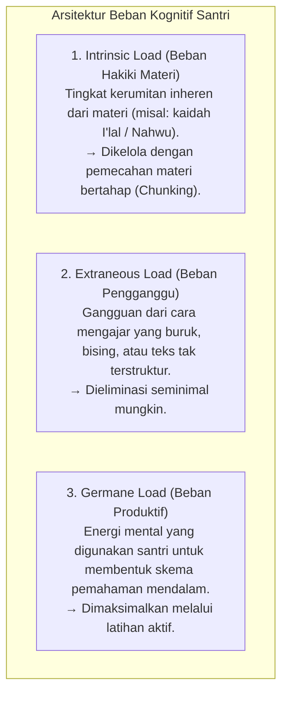

# P2-03-01-Prinsip-Kognitif-dan-Manajemen-Beban-Belajar

## Tujuan
Menerapkan **Cognitive Load Theory (John Sweller, 1988)** dalam desain pengajaran kelas dan halaqah pesantren, memastikan kapasitas memori kerja santri dioptimalkan untuk menyerap materi syariat dan sains tanpa mengalami kelelahan mental (*cognitive overload*).

---

## 1. Arsitektur Memori Manusia & 3 Jenis Beban Kognitif

---

## 2. Kaidah Baku Mengajar Asatidz TUMBUH

1. **Prinsip Segmentasi Materi (*Chunking & Segmenting*)**:
   - Menghindari mengajarkan 10 kaidah rumit sekaligus dalam satu sesi. Guru memecah materi menjadi 2–3 unit konsep terpadu, lalu memberikan latihan aplikasi langsung sebelum berpindah topik.
2. **Prinsip Modalitas Ganda (*Dual Coding Theory - Paivio*)**:
   - Memadukan penjelasan verbal dengan bagan visual/skema konsep (contoh: bagan silsilah pewaris dalam ilmu Faraidh).
3. **Prinsip Contoh Terpandu (*Worked-Example Effect*)**:
   - Sebelum menyuruh santri memecahkan soal/kasus Fiqh secara mandiri, asatidz mendemonstrasikan langkah demi langkah cara menalar dan mengambil hukum (*istinbath*).

---

## 3. Status Dokumen
* **Status**: 🌟 **A+ (Tervalidasi & Siap Diimplementasikan)**
* **Level**: Project 2 - `02 Principles / 03 Learning Principles`
* **Langkah Berikutnya**: **`P2-03-02-Prinsip-Retensi-Memori-dan-Hafalan-Mutqin.md`**.
