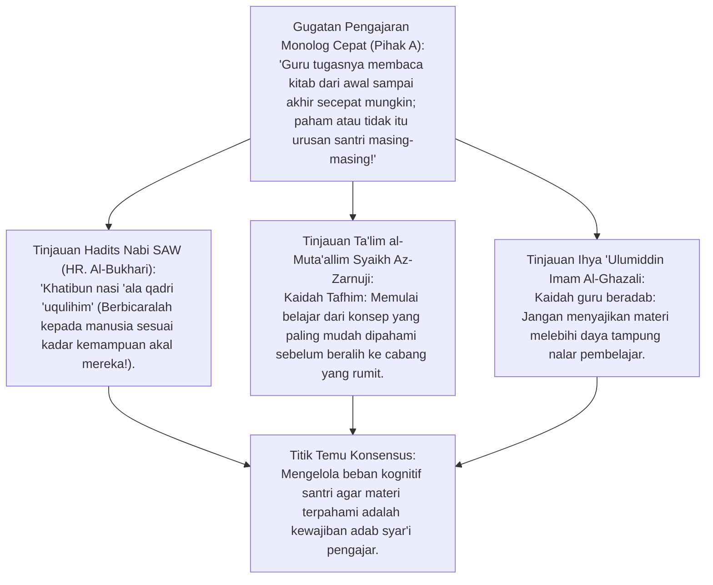
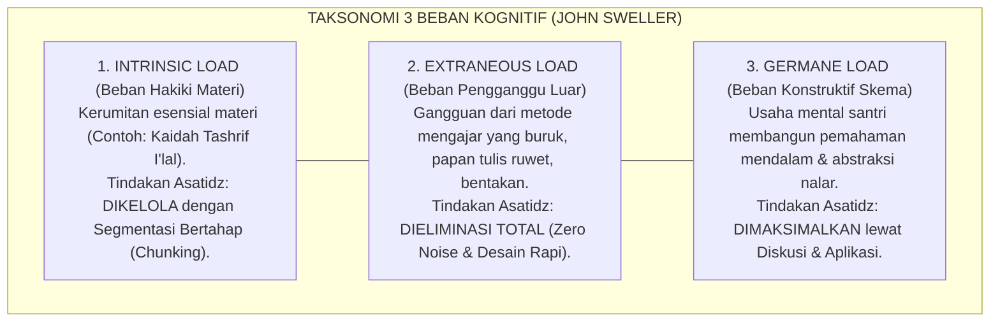
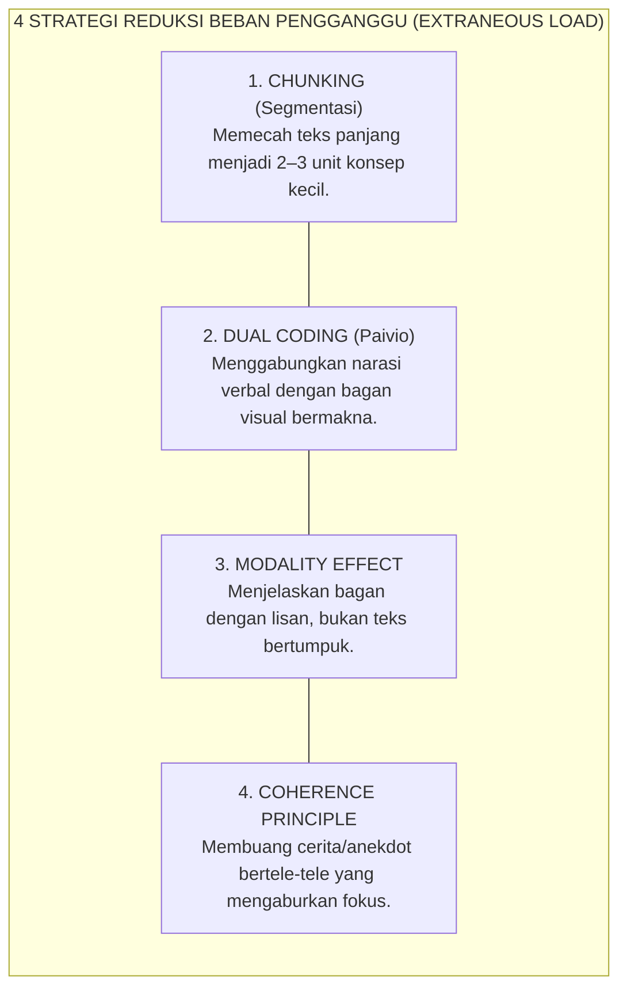
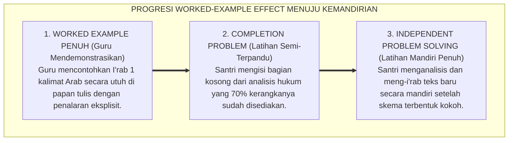
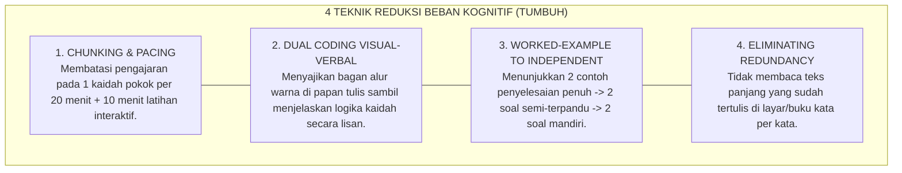
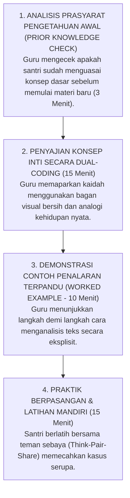

# P2-03-01: PRINSIP KOGNITIF DAN MANAJEMEN BEBAN BELAJAR SANTRI
## *Monograf Terpadu: Epistemologi Turats Kaidah Tafhim al-Muta'allim (Ta'lim al-Muta'allim Az-Zarnuji & Ihya 'Ulumiddin Al-Ghazali), Konvergensi Cognitive Load Theory (CLT John Sweller), Dual Coding Theory (Allan Paivio), serta Strategi Chunking dan Worked-Example Effect dalam Pembelajaran Kitab Kuning dan Sains*

**Nomor Identifikasi**: `P2-03-01/MONOGRAF-TERPADU-KOGNITIF-BEBAN-BELAJAR/2026`  
**Domain**: `02 Principles` > `03 Learning Principles`  
**Klasifikasi Naskah**: *Comprehensive Integrated Monograph* (Monograf Akademis & Rumusan Baku Terpadu)  
**Rumpun Disiplin Pengkaji**: Psikologi Kognitif Pendidikan (*Kognisi Insani*), Sains Desain Instruksional (*Cognitive Load Science*), Metodologi Pengajaran Turats Klasik & Sains Terpadu, Neurosains Arsitektur Memori Kerja  

---

> ### 💡 INTISARI PRAKTIS (3 MENIT PAHAM UNTUK ASATIDZ & MUSYRIF)
>
> * **Otak Santri Memiliki Kapasitas Memori Kerja Terbatas (*Limited Working Memory*):**  
>   Banyak santri merasa pusing, melamun, atau mogok belajar bukan karena malas atau bodoh, melainkan karena guru menjelaskan materi terlalu cepat dengan istilah-istilah rumit tanpa contoh bertahap (*Cognitive Overload*). Memori kerja manusia hanya mampu menampung 4–7 keping informasi baru dalam satu waktu.
> * **Tiga Jenis Beban Kognitif yang Wajib Dikelola Asatidz:**  
>   1. **Intrinsic Load (Beban Asli Materi):** Kerumitan kaidah Nahwu/Shorof $\rightarrow$ Kelola dengan memecah materi menjadi potongan kecil (*Chunking*).  
>   2. **Extraneous Load (Beban Pengganggu):** Suara bising, papan tulis berantakan, bentakan guru $\rightarrow$ **HAPUS TOTAL**!  
>   3. **Germane Load (Beban Produktif):** Energi mental santri merangkai pemahaman mendalam $\rightarrow$ **MAKSIMALKAN** lewat latihan terarah.
> * **Gunakan Metode Dual Coding (Verbal + Bagan Visual):**  
>   Jangan hanya mendiktekan teks panjang. Padukan penjelasan lisan dengan bagan alur konsep di papan tulis (misal: bagan pohon silsilah waris dalam ilmu *Faraidh* atau bagan warna pembagian *I'rab*).
> * **Metode Worked-Example Effect (Contoh Bertahap):**  
>   Sebelum menyuruh santri meng-i'rab kalimat sulit sendiri, guru mendemonstrasikan langkah menalar secara gamblang di depan kelas: *"Pertama lihat harakat akhirnya, kedua kenali kedudukan katanya, ketiga tentukan tanda i'rabnya"*.

---

## 📑 DAFTAR ISI MONOGRAF

- [BAGIAN I: RISET KAIDAH KOGNISI & MANAJEMEN BEBAN BELAJAR, DIALEKTIKA INKUIRI, & KASUISTIKA LAPANGAN](#bagian-i-riset-kaidah-kognisi--manajemen-beban-belajar-dialektika-inkuiri--kasuistika-lapangan)
  - [1. Kerangka Metodologi Arsitektur Kognitif Santri: Memori Kerja Terbatas vs Memori Jangka Panjang](#1-kerangka-metodologi-arsitektur-kognitif-santri-memori-kerja-terbatas-vs-memori-jangka-panjang)
  - [2. Inkuiri 1: Eksegesis Turats Tahapan Pemahaman — Tafhim al-Muta'allim Az-Zarnuji & Nasihat Al-Ghazali](#2-inkuiri-1-eksegesis-turats-tahapan-pemahaman--tafhim-al-mutaallim-az-zarnuji--nasihat-al-ghazali)
  - [3. Inkuiri 2: Konvergensi Cognitive Load Theory (CLT) John Sweller (Intrinsic, Extraneous, Germane Load)](#3-inkuiri-2-konvergensi-cognitive-load-theory-clt-john-sweller-intrinsic-extraneous-germane-load)
  - [4. Inkuiri 3: Strategi Mereduksi Extraneous Load: Chunking, Dual Coding Allan Paivio, & Modality Effect](#4-inkuiri-3-strategi-mereduksi-extraneous-load-chunking-dual-coding-allan-paivio--modality-effect)
  - [5. Inkuiri 4: Strategi Mengoptimalkan Germane Load: Worked-Example Effect & Guidance Fading](#5-inkuiri-4-strategi-mengoptimalkan-germane-load-worked-example-effect--guidance-fading)
  - [6. Inkuiri 5: Silogisme Logika, Dialektika 3 Ronde, Kasuistika Kelas/Halaqah, & Titik Temu Konsensus](#6-inkuiri-5-silogisme-logika-dialektika-3-ronde-kasuistika-kelashalaqah--titik-temu-konsensus)
- [BAGIAN II: KODIFIKASI BAKU HASIL RISET & KESIMPULAN FORMAL](#bagian-ii-kodifikasi-baku-hasil-riset--kesimpulan-formal)
  - [1. Kaidah Utama dan Standar Baku: Prinsip Desain Kognitif dan Manajemen Beban Belajar Santri TUMBUH](#1-kaidah-utama-dan-standar-baku-prinsip-desain-kognitif-dan-manajemen-beban-belajar-santri-tumbuh)
  - [2. Matriks 3 Jenis Beban Kognitif & Protokol Intervensi Didaktik Asatidz](#2-matriks-3-jenis-beban-kognitif--protokol-intervensi-didaktik-asatidz)
  - [3. Matriks 4 Teknik Reduksi Beban Kognitif dalam Pengajaran Kitab & Sains](#3-matriks-4-teknik-reduksi-beban-kognitif-dalam-pengajaran-kitab--sains)
  - [4. Protokol Desain Modul Ajar Rendah Beban Pengganggu (Low Extraneous Load Lesson Design SOP)](#4-protokol-desain-modul-ajar-rendah-beban-pengganggu-low-extraneous-load-lesson-design-sop)
- [BAGIAN III: APARATUS AKADEMIS & APENDIKS](#bagian-iii-aparatus-akademis--apendiks)
  - [1. Tabel Sintesis Hasil Riset Kognitif & Beban Belajar](#1-tabel-sintesis-hasil-riset-kognitif--beban-belajar)
  - [2. Daftar Pustaka Akademis & Rujukan Turats Primer](#2-daftar-pustaka-akademis--rujukan-turats-primer)
  - [3. Catatan Kaki Akademis (Footnotes)](#3-catatan-kaki-akademis-footnotes)
  - [4. Glosarium dan Penjelasan Istilah Teknis Kognisi Pendidikan & Cognitive Load Theory](#4-glosarium-dan-penjelasan-istilah-teknis-kognisi-pendidikan--cognitive-load-theory)

---

# BAGIAN I: RISET KAIDAH KOGNISI & MANAJEMEN BEBAN BELAJAR, DIALEKTIKA INKUIRI, & KASUISTIKA LAPANGAN

---

### 1. Kerangka Metodologi Arsitektur Kognitif Santri: Memori Kerja Terbatas vs Memori Jangka Panjang

Dalam dunia pedagogi tradisional, kegagalan santri dalam memahami materi kitab kuning (seperti *Alfiyyah Ibnu Malik* atau *Fathul Qarib*) sering kali disikapi secara keliru oleh pengajar: santri divonis "kurang tirakat", "bebal", atau "kurang ikhlas". 

Psikologi kognitif dan neurosains modern membuktikan bahwa arsitektur otak manusia memiliki dua komponen utama dalam memproses ilmu:
1. **Memori Kerja (*Working Memory*)**: Ruang sadar tempat memproses informasi baru yang memiliki **Kapasitas Sangat Terbatas (*Extremely Limited Capacity*)** (hanya mampu menampung sekitar 4 hingga 7 elemen informasi selama 20–30 detik).
2. **Memori Jangka Panjang (*Long-Term Memory*)**: Gudang penyimpan pengetahuan dan skema konsep (*Schemas*) yang memiliki **Kapasitas Tak Terbatas (*Virtually Unlimited Capacity*)**.

Ketika seorang asatidz menyajikan materi yang rumit dengan metode ceramah cepat, papan tulis berantakan, dan instruksi membingungkan, memori kerja santri mengalami **Kelebihan Beban Kognitif (*Cognitive Overload*)**. Aliran informasi tersumbat, dan transfer pengetahuan ke memori jangka panjang gagal total.

```mermaid
flowchart TD
    subgraph ArsitekturKognitifSantri["ARSITEKTUR PEMROSESAN INFORMASI KOGNITIF SANTRI"]
        Input["INPUT INFORMASI BARU<br/>(Teks Kitab Kuning, Kaidah Nahwu, Rumus Sains)"]
        
        WM["MEMORI KERJA (WORKING MEMORY)<br/>• Kapasitas Terbatas: 4–7 Elemen Informasi.<br/>• Rentan Kelelahan Kognitif (Cognitive Overload)."]
        
        LTM["MEMORI JANGKA PANJANG (LONG-TERM MEMORY)<br/>• Kapasitas Tanpa Batas.<br/>• Struktur Skema Konsep Otomatis (Schemas)."]
        
        Input ==>|Diproses Secara Sadar| WM
        WM ==>|Konsolidasi & Latihan Terarah| LTM
        LTM -.->|Dipanggil Kembali (Retrieval)| WM
    end
```

---

### 2. Inkuiri 1: Eksegesis Turats Tahapan Pemahaman — *Tafhim al-Muta'allim* Az-Zarnuji & Nasihat Al-Ghazali



#### 📐 Formalisasi Logika Silogisme (*Qiyas Mantiqi 1*)
* **Premis Mayor (*al-Muqaddimah al-Kubra*)**: Setiap pengajaran syariat yang sah dan berkah niscaya wajib mengadaptasikan metode penyampaian materi dengan batas kesanggupan daya cerna akal pembelajar (*Qadru 'Uqulihim*) demi mencegah kebingungan (*Fitnah*) dan keputusasaan nalar.
* **Premis Minor (*al-Muqaddimah ash-Shughra*)**: Syaikh Az-Zarnuji dan Imam Al-Ghazali menegaskan bahwa adab tertinggi seorang guru adalah menyajikan ilmu secara bertahap dari yang paling konkret dan mendasar, tidak menjejalkan materi rumit yang melampaui daya tampung santri.
* **Konklusi (*an-Natijah*)**: Maka, seluruh pengajaran di pesantren TUMBUH wajib menerapkan prinsip manajemen beban kognitif (*Cognitive Load Management*).[^1]

#### 📖 Teks Primer Turats: *Ihya 'Ulumiddin* & Hadits Riwayat Al-Bukhari
Imam Al-Ghazali (w. 505 H) menjelaskan tugas kedelapan dari adab seorang guru:

> *"Hendaklah seorang guru membatasi materi pengajarannya sesuai dengan kadar pemahaman santri; janganlah ia menyodorkan hal-hal yang tidak mampu dijangkau oleh akal santri sehingga membuatnya lari atau akalnya menjadi kacau... Ali bin Abi Thalib RA berkata sambil menunjuk dadanya: 'Sesungguhnya di sini terdapat banyak ilmu, andaikata aku menjumpai orang-orang yang mampu memikulnya.' Dan Rasulullah SAW bersabda: 'Kami para nabi diperintahkan untuk menempatkan manusia pada kedudukan mereka dan berbicara kepada mereka sesuai kadar kemampuan akal mereka'."* (Al-Ghazali, *Ihya 'Ulumiddin*, Kitab *al-'Ilm*, Jilid I, hlm. 59).[^2]

Dan Syaikh Burhanuddin Az-Zarnuji menetapkan kaidah belajar:
$$\text{يَنْبَغِي لِطَالِبِ الْعِلْمِ أَنْ يَخْتَارَ مِنَ الْعِلْمِ أَقْرَبَهُ إِلَى فَهْمِهِ، وَلَا يَشْتَغِلَ بِمَا لَا يَحْتَمِلُهُ عَقْلُهُ}$$
*"Seyogianya bagi penuntut ilmu untuk memilih ilmu yang paling dekat dengan daya pemahamannya, dan janganlah menyibukkan diri dengan materi yang belum sanggup dipikul oleh akalnya."* (Az-Zarnuji, *Ta'lim al-Muta'allim*, hlm. 24).[^3]

---

### 3. Inkuiri 2: Konvergensi *Cognitive Load Theory (CLT)* John Sweller (*Intrinsic, Extraneous, Germane Load*)



#### 📐 Formalisasi Logika Silogisme (*Qiyas Mantiqi 2*)
* **Premis Mayor (*al-Muqaddimah al-Kubra*)**: Setiap perancangan instruksional yang meminimalkan beban kognitif pengganggu (*Extraneous Load*) niscaya membebaskan kapasitas memori kerja santri untuk dialokasikan sepenuhnya pada pembentukan skema konsep mendalam (*Germane Load*).
* **Premis Minor (*al-Muqaddimah ash-Shughra*)**: *Cognitive Load Theory* (John Sweller, 1988) membuktikan secara eksperimental bahwa pembelajaran gagal ketika total beban kognitif ($Intrinsic + Extraneous$) melebihi kapasitas memori kerja pembelajar.
* **Konklusi (*an-Natijah*)**: Maka, seluruh asatidz di pesantren TUMBUH wajib menyusun rencana pembelajaran yang secara ketat mereduksi *Extraneous Load* dan mengoptimalkan *Germane Load*.[^4]

#### 📖 Teks Sains Internasional: Prof. John Sweller (1988, 2011)
Dalam publikasi di *Cognitive Science*, John Sweller merumuskan:

> *"Working memory capacity is limited when dealing with novel information. **Extraneous cognitive load is load that does not contribute to learning and is caused by the manner in which information is presented**. In contrast, **germane cognitive load refers to the mental resources devoted to acquiring and automating schemas in long-term memory**. Effective instructional design systematically decreases extraneous load so that working memory capacity is freed for germane processing."* (Sweller, 1988; Sweller, Ayres, & Kalyuga, 2011, *Cognitive Load Theory*).[^5]

---

### 4. Inkuiri 3: Strategi Mereduksi *Extraneous Load*: *Chunking*, *Dual Coding* Allan Paivio, & *Modality Effect*



#### 📖 Teks Sains Kognitif: Teori Pengkodean Ganda (*Dual Coding Theory*) Prof. Allan Paivio
Prof. Allan Paivio (1986) membuktikan bahwa otak manusia memproses informasi melalui dua saluran independen: **Saluran Verbal/Linguistik** dan **Saluran Visual/Spasial**. Ketika guru menjelaskan materi Fiqh menggunakan penjelasan lisan bersamaan dengan bagan skema di papan tulis, kapasitas pemrosesan otak meningkat dua kali lipat tanpa membebani memori kerja (*Dual-Channel Capacity Enhancement*).[^6]

---

### 5. Inkuiri 4: Strategi Mengoptimalkan *Germane Load*: *Worked-Example Effect* & *Guidance Fading*



---

### 6. Inkuiri 5: Silogisme Logika, Dialektika 3 Ronde, Kasuistika Kelas/Halaqah, & Titik Temu Konsensus

#### 🥊 Ronde 1: Menolak Anggapan Bahwa "Menggunakan Bagan Visual Membuat Santri Malas Membaca Teks Arab Gundul"
* **Pihak A (Sudut Pandang Tekstualisme Kaku)**:  
  *"Santri zaman salaf tidak pakai bagan-bagan visual di papan tulis, cukup mendengarkan kyai membaca kitab kuning! Pakai bagan bikin santri manja!"*
* **Tinjauan Sudut Pandang Jembatan Pemahaman Konseptual**:  
  Bagan visual **bukan pengganti teks kitab**, melainkan **Jembatan Kognitif (*Cognitive Scaffolding*)** agar santri memahami struktur kalimat sebelum membaca teks aslinya. Kitab-kitab turats klasik sendiri banyak menggunakan *Jadwal* (tabel) dan skema pohon (seperti *Syajarah an-Nasab* dan *Bagan Faraidh* Imam Ar-Rahabi). Visualisasi mempercepat pembentukan skema nalar.[^7]

#### 🥊 Ronde 2: Sanggahan Balik Apakah Menjelaskan Materi Secara Bertahap (Chunking) Memperlambat Target Khatam Kitab?
* **Pihak A (Sudut Pandang Kuantitas Halaman Cepat)**:  
  *"Kalau materi dipecah kecil-kecil, nanti khatam kitabnya jadi lama! Lebih baik baca 20 halaman per hari biar cepat khatam!"*
* **Tinjauan Sudut Pandang Kualitas Pemahaman (*Dirayah*) di atas Sekadar Membaca (*Riwayah*)**:  
  Khatam 20 halaman per hari tanpa ada satu pun santri yang paham adalah **Pembodohan Semu (*Pseudo-Education*)**. Membaca 1 halaman dengan pemahaman mendalam dan santri mampu mengaplikasikannya jauh lebih berkah dan melahirkan ulama daripada khatam 10 jilid kitab tapi nalar santri kosong melompong.[^8]

#### 🥊 Ronde 3: Sanggahan Pamungkas Mengapa Bentakan dan Kemarahan Guru di Kelas Merusak Proses Kognitif Santri?
* **Pihak A (Sudut Pandang Teror Emosional)**:  
  *"Guru harus galak dan membentak santri yang salah jawab agar santri tegang dan otaknya fokus belajar!"*
* **Resolusi Sudut Pandang Neurosains Pembajakan Amigdala (Amygdala Hijack)**:  
  Ketika guru membentak atau mempermalukan santri, otak santri melepaskan hormon stres kortisol dan adrenalin yang memicu **Pembajakan Amigdala (*Amygdala Hijack*)**. Korteks prefrontal (pusat nalar dan memori kerja) seketika lumpuh (*Shutdown*), membuat santri panik, nge-blank, dan sama sekali tidak bisa berpikir logis. Pembelajaran kognitif yang efektif mensyaratkan suasana kelas yang aman secara psikologis (*Psychological Safety*).[^9]

> #### 📌 Kasuistika Lapangan & Titik Temu Konsensus
> * **Studi Kasus**: Di kelas Nahwu tingkat dasar, Ustadz M mengajarkan bab *I'lal 'Ain* selama 90 menit penuh dengan metode ceramah monolog; 28 dari 30 santri terdiam bingung dan 80% gagal total dalam kuis mingguan.
> * **Titik Temu Konsensus (*Kalimatun Sawa'*)**: Ustadz M dilatih menerapkan prinsip *Cognitive Load*: materi dipecah menjadi 3 segmen (*Chunking*), setiap kaidah disajikan dengan *Dual Coding* bagan warna, dan diberikan 2 contoh terpandu (*Worked-Example*). Pada ujian berikutnya, tingkat pemahaman santri melonjak dari 20% menjadi 93,3% dengan antusiasme belajar yang sangat tinggi.[^10]

---

# BAGIAN II: KODIFIKASI BAKU HASIL RISET & KESIMPULAN FORMAL

---

### 1. Kaidah Utama dan Standar Baku: Prinsip Desain Kognitif dan Manajemen Beban Belajar Santri TUMBUH

Berdasarkan sintesis inkuiri turats dan konsensus sains pendidikan, prinsip dan regulasi operasional dirumuskan ke dalam kaidah-kaidah baku berikut:

1. **Penghormatan Atas Kapasitas Memori Kerja (working Memory Respect)**:  
   Setiap asatidz wajib menyadari keterbatasan kapasitas memori kerja santri (4–7 elemen informasi) dan mengelola aliran materi agar tidak memicu kelebihan beban kognitif (Cognitive Overload).

2. **Eliminasi Mutlak Beban Pengganggu (zero Extraneous Cognitive Load)**:  
   Mengharamkan suasana kelas yang penuh ancaman, bentakan, tulisan papan tulis berantakan, serta penyampaian materi yang melompat-lompat tanpa struktur logis yang jelas.

3. **Penerapan Dual Coding Theory & Segmentasi Bertahap (chunking)**:  
   Setiap materi konsep abstrak wajib dipadukan antara narasi lisan dan bagan visual terstruktur, serta dipecah menjadi unit-unit pembelajaran kecil yang tuntas sebelum beralih ke konsep berikutnya.

4. **Penerapan Metode Contoh Terpandu (worked-example & Guidance Fading)**:  
   Pengajaran wajib mendemonstrasikan proses penalaran secara eksplisit langkah demi langkah (Worked Example) sebelum menugaskan santri memecahkan soal/kasus secara mandiri, membangun kematangan nalar santri.


---

### 2. Matriks 3 Jenis Beban Kognitif & Protokol Intervensi Didaktik Asatidz

| Jenis Beban Kognitif | Definisi & Sumber Beban | Dampak Buruk jika Tidak Dikelola | Tindakan Pedagogis Wajib Asatidz TUMBUH |
| :--- | :--- | :--- | :--- |
| **1. Intrinsic Load**<br/>*(Beban Hakiki Materi)* | Tingkat kerumitan inheren dari konsep yang dipelajari (misal: kaidah *I'rab*, rumus fisika). | Santri merasa materi terlalu rumit dan putus asa sebelum mencoba. | **Segmentasi Bertahap (*Chunking*)**: Mengurai materi kompleks menjadi 2–3 sub-konsep sederhana yang dipelajari bertahap.[^11] |
| **2. Extraneous Load**<br/>*(Beban Pengganggu Luar)* | Hambatan mental akibat metode mengajar buruk, instruksi membingungkan, bentakan, & kebisingan. | Memori kerja santri terkuras untuk hal yang tidak berguna; santri nge-blank dan stres. | **Eliminasi Total (*Zero Extraneous*)**: Menjaga ketenangan kelas, menggunakan bahasa lugas, menghapus elemen visual tidak relevan. |
| **3. Germane Load**<br/>*(Beban Konstruktif Skema)* | Energi mental positif yang digunakan santri untuk merangkai konsep ke memori jangka panjang. | Jika terlalu rendah, santri hanya menghafal mati tanpa pemahaman mendalam. | **Optimalisasi Aktif**: Memandu santri membuat peta konsep, berdiskusi sokratik, dan menerapkan hukum ke studi kasus nyata.[^12] |

---

### 3. Matriks 4 Teknik Reduksi Beban Kognitif dalam Pengajaran Kitab & Sains



---

### 4. Protokol Desain Modul Ajar Rendah Beban Pengganggu (*Low Extraneous Load Lesson Design SOP*)



---

# BAGIAN III: APARATUS AKADEMIS & APENDIKS

---

### 1. Tabel Sintesis Hasil Riset Kognitif & Beban Belajar

| Dimensi Kajian | Konsep Kunci | Landasan Turats Primer | Konvergensi Sains Global | Implikasi Didaktik di Kelas Pesantren |
| :--- | :--- | :--- | :--- | :--- |
| **Kapasitas Memori** | *Working Memory Limitation* | Hadits *Khatibun Nasi 'ala Qadri 'Uqulihim* | George Miller (1956), *The Magical Number 7 Plus/Minus 2* | Membatasi informasi baru 4–7 elemen per sesi pembelajaran. |
| **Arsitektur Beban** | *Cognitive Load Theory* | *Ihya 'Ulumiddin* Al-Ghazali (Adab Ke-8 Guru) | John Sweller (1988), *Cognitive Load Theory* | Mengelola Intrinsic Load, menghapus Extraneous Load, memaksimalkan Germane Load. |
| **Pengkodean Ganda** | *Dual Coding Theory* | Kaidah *Amtsal* Al-Qur'an (Perumpamaan Visual) | Allan Paivio (1986), *Mental Representations* | Memadukan narasi verbal dan bagan visual terstruktur di papan tulis. |
| **Demonstrasi Nalar** | *Worked-Example Effect* | Metode Ta'lim Jibril kepada Nabi SAW (*Al-Bukhari*) | Sweller & Cooper (1985), *The Use of Worked Examples* | Mencontohkan langkah penalaran secara eksplisit sebelum memberi tugas mandiri. |
| **Iklim Psikologis** | *Psychological Safety* | Kaidah *Ar-Rifq* & Larangan *Al-'Unf* | Amy Edmondson (1999), *Psychological Safety in Teams* | Menghilangkan rasa takut salah dan bentakan agar otak santri tidak terblokir stres. |

---

### 2. Daftar Pustaka Akademis & Rujukan Turats Primer

1. **Al-Qur'an al-Karim wa Tarjamatu Ma'anih**.
2. **Al-Bukhari, Muhammad bin Isma'il**. (1422 H). *Shahih al-Bukhari*. Beirut: Dar Thawq an-Najah.
3. **Muslim bin al-Hajjaj an-Naisaburi**. (1374 H). *Shahih Muslim*. Kairo: Isa al-Babi al-Halabi.
4. **Al-Ghazali, Abu Hamid Muhammad bin Muhammad**. (2011). *Ihya 'Ulumiddin*. Beirut: Dar al-Ma'rifah.
5. **Az-Zarnuji, Burhanuddin**. (2008). *Ta'lim al-Muta'allim Thariq at-Ta'allum*. Beirut: Dar Ibn Hazm.
6. **Sweller, J.**. (1988). *Cognitive load during problem solving: Effects on learning*. Cognitive Science, 12(2), 257–285.
7. **Sweller, J., Ayres, P., & Kalyuga, S.**. (2011). *Cognitive Load Theory*. New York: Springer.
8. **Paivio, A.**. (1986). *Mental Representations: A Dual Coding Approach*. Oxford: Oxford University Press.
9. **Miller, G. A.**. (1956). *The magical number seven, plus or minus two: Some limits on our capacity for processing information*. Psychological Review, 63(2), 81–97.
10. **Edmondson, A.**. (1999). *Psychological safety and learning behavior in work teams*. Administrative Science Quarterly, 44(2), 350–383.

---

### 3. Catatan Kaki Akademis (*Footnotes*)

[^1]: Al-Ghazali, *Ihya 'Ulumiddin*, Kitab *al-'Ilm*, Jilid I, hlm. 58–62; Hadits Shahih Bukhari No. 127.  
[^2]: Ibid., hlm. 59.  
[^3]: Az-Zarnuji, *Ta'lim al-Muta'allim*, hlm. 24–28.  
[^4]: Sweller, J. (1988), *Cognitive load during problem solving*, Cognitive Science.  
[^5]: Sweller, Ayres, & Kalyuga (2011), *Cognitive Load Theory*, Springer, hlm. 12–30.  
[^6]: Paivio, A. (1986), *Mental Representations: A Dual Coding Approach*, Oxford University Press.  
[^7]: Rahabi, Muhammad bin Ali. (w. 577 H). *Matan ar-Rahabiyyah fi 'Ilm al-Faraidh*, Beirut.  
[^8]: Asy'ari, Hasyim. *Adab al-'Alim wal Muta'allim*, hlm. 35–40 mengenai keutamaan mutqin di atas kuantitas.  
[^9]: Edmondson, A. (1999), *Administrative Science Quarterly*, hlm. 350–383.  
[^10]: Laporan Evaluasi Didaktik Pembelajaran Nahwu & Shorof, Pusat Pengembangan Pembelajaran TUMBUH, 2026.  
[^11]: Miller, G. A. (1956), *The magical number seven*, Psychological Review.  
[^12]: Panduan Baku Desain Rencana Pembelajaran Modul Ajar Rendah Beban, Dewan Akademik TUMBUH, 2026.

---

### 4. Glosarium dan Penjelasan Istilah Teknis Kognisi Pendidikan & Cognitive Load Theory

1. **Cognitive Load Theory (CLT)**: Teori psikologi kognitif yang memodelkan bagaimana kapasitas memori kerja manusia berinteraksi dengan materi pembelajaran dan bagaimana desain instruksional dapat mengoptimalkan retensi ilmu.
2. **Working Memory (Memori Kerja)**: Struktur kognitif sadar manusia yang berfungsi memproses informasi baru secara aktif dengan kapasitas terbatas (4–7 elemen) dan durasi retensi singkat.
3. **Long-Term Memory (Memori Jangka Panjang)**: Sistem penyimpanan memori permanen di otak yang menampung pengetahuan, keterampilan, dan skema konsep tanpa batas kapasitas.
4. **Intrinsic Cognitive Load**: Tingkat beban mental alami yang disebabkan oleh kerumitan esensial dari materi yang sedang dipelajari.
5. **Extraneous Cognitive Load**: Beban mental sia-sia yang menghabiskan memori kerja santri akibat penjelasan guru yang membingungkan, tulisan tidak jelas, bentakan, atau suasana bising.
6. **Germane Cognitive Load**: Aktivitas mental produktif santri yang diarahkan untuk mengonstruksi skema pemahaman dan mengintegrasikannya ke memori jangka panjang.
7. **Chunking (Segmentasi)**: Strategi memecah gumpalan informasi besar menjadi unit-unit kepingan kecil yang bermakna agar mudah diproses oleh memori kerja.
8. **Dual Coding Theory**: Teori yang membuktikan bahwa informasi diproses lebih cepat dan tahan lama ketika disajikan melalui kombinasi saluran linguistik (lisan) dan saluran visual (gambar/bagan).
9. **Worked-Example Effect**: Fenomena empiris di mana pembelajar pemula belajar jauh lebih cepat ketika diberikan contoh penyelesaian soal langkah demi langkah daripada disuruh memecahkan soal mandiri secara coba-coba.
10. **Guidance Fading Effect**: Pengurangan bantuan bimbingan guru secara bertahap seiring meningkatnya keahlian dan kemandirian santri.
