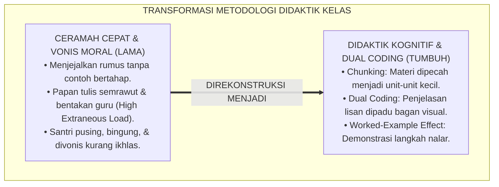
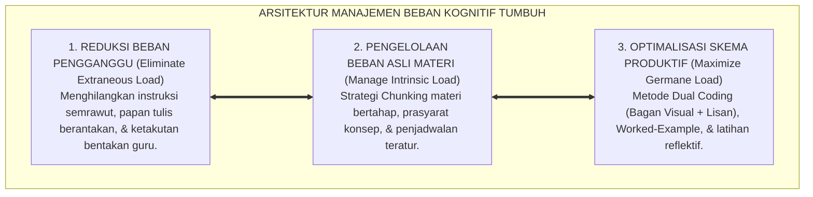
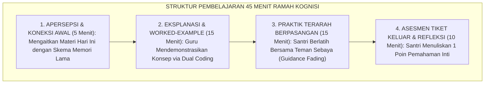
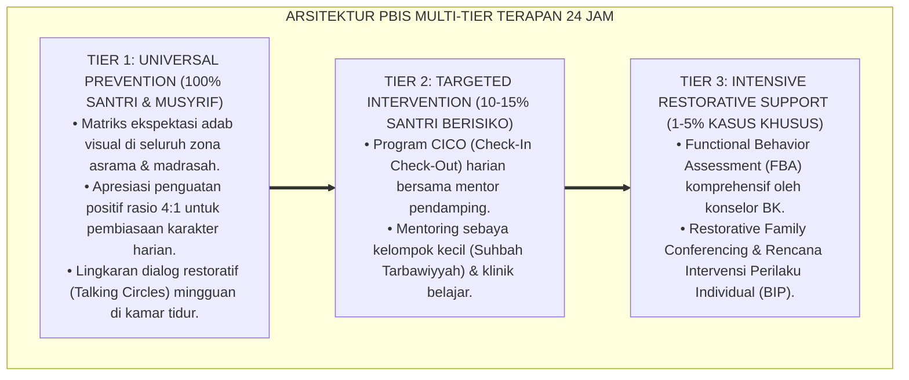

# P2-03-01: PRINSIP KOGNITIF DAN MANAJEMEN BEBAN BELAJAR SANTRI (COGNITIVE PRINCIPLES & COGNITIVE LOAD MANAGEMENT)
## *Monograf Riset Akademik: Kaidah Turats Tafhim al-Muta'allim (Ta'lim al-Muta'allim & Ihya' 'Ulumiddin), Konvergensi Cognitive Load Theory John Sweller, Dual Coding Theory Allan Paivio, Serta Strategi Worked-Example Effect dalam Pembelajaran Kitab dan Sains*

**Nomor Identifikasi**: `P2-03-01/MONOGRAF-RISET-KOGNITIF-BEBAN-BELAJAR/2026`  
**Domain**: `02 Principles` > `03 Learning Principles` (Prinsip Pembelajaran 01: *Cognitive Principles & Load Management*)  
**Klasifikasi Naskah**: *Academic Research Monograph* (Monograf Riset Akademik Prinsip Pembelajaran)  
**Rumpun Disiplin Pengkaji**: Psikologi Kognitif Pendidikan (*Kognisi Insani*), Sains Desain Instruksional (*Cognitive Load Science*), Metodologi Pengajaran Turats Klasik & Sains Terpadu, Neurosains Arsitektur Memori Kerja  

---

> ### 💡 INTISARI EKSEKUTIF (EXECUTIVE SUMMARY)
>
> * **Kelemahan Paradigma Lama: Salah Vonis "Kurang Tirakat" atas Kegagalan Kognitif:**  
>   Banyak pengajar memvonis santri "bebal" atau "kurang ikhlas" ketika gagal memahami kaidah nahwu/fiqh yang rumit. Faktanya, kegagalan tersebut terjadi akibat *Cognitive Overload*: guru menyajikan materi terlalu cepat dan berantakan tanpa mempertimbangkan kapasitas terbatas memori kerja otak santri (hanya 4–7 keping informasi dalam satu waktu).
> * **Inovasi Konseptual: Kaidah Tafhim al-Muta'allim & Triad Cognitive Load Theory (CLT):**  
>   TUMBUH mengintegrasikan kaidah turats *Tafhim al-Muta'allim* Imam Al-Ghazali dan Syekh Az-Zarnuji dengan **Cognitive Load Theory (John Sweller)**: (1) **Mengelola Intrinsic Load** melalui pemecahan materi bertahap (*Chunking*); (2) **Menghapus Extraneous Load** (beban bising, bentakan, papan tulis semrawut); dan (3) **Memaksimalkan Germane Load** melalui *Dual Coding* Allan Paivio (teks + bagan visual) dan *Worked-Example Effect* (contoh langkah menalar bertahap).
> * **Formulasi Operasional & Penjaminan Kelancaran Kognisi:**  
>   Monograf ini menguraikan matriks tiga jenis beban kognitif, matriks empat teknik reduksi beban pengganggu, SOP desain modul ajar rendah beban kognitif (*Low Extraneous Load Lesson Design*), dan etika instruksional ramah akal.

---

## 📑 DAFTAR ISI MONOGRAF

- [BAB I: LANDASAN TEORETIS & DISKURSUS KRITIS](#bab-i-landasan-teoretis--diskursus-kritis)
  - [1. Latar Belakang Masalah: Kritik atas Vonis Subjektif dan Pengabaian Arsitektur Kognitif Pembelajar](#1-latar-belakang-masalah-kritik-atas-vonis-subjektif-dan-pengabaian-arsitektur-kognitif-pembelajar)
  - [2. Eksegesis Turats Tahapan Pemahaman: Kaidah Tafhim al-Muta'allim Az-Zarnuji & Nasihat Pedagogis Imam Al-Ghazali](#2-eksegesis-turats-tahapan-pemahaman-kaidah-tafhim-al-mutaallim-az-zarnuji--nasihat-pedagogis-imam-al-ghazali)
  - [3. Konvergensi Sains Kognitif: Arsitektur Memori Kerja vs Memori Jangka Panjang & Cognitive Load Theory (CLT)](#3-konvergensi-sains-kognitif-arsitektur-memori-kerja-vs-memori-jangka-panjang--cognitive-load-theory-clt)
  - [4. Rekayasa Didaktik Reduksi Beban: Dual Coding Allan Paivio, Chunking, & Worked-Example Effect](#4-rekayasa-didaktik-reduksi-beban-dual-coding-allan-paivio-chunking--worked-example-effect)
  - [5. Kasuistika Lapangan: Kasus Santri Mengalami Kebuntuan Belajar Nahwu & Resolusi Kognitif Terpadu](#5-kasuistika-lapangan-kasus-santri-mengalami-kebuntuan-belajar-nahwu--resolusi-kognitif-terpadu)
- [BAB II: FORMULASI KONSEPTUAL & PEMBAHASAN MENDALAM](#bab-ii-formulasi-konseptual--pembahasan-mendalam)
  - [1. Eksplanasi Teoretis Prinsip Desain Kognitif dan Manajemen Beban Belajar Santri TUMBUH](#1-eksplanasi-teoretis-prinsip-desain-kognitif-dan-manajemen-beban-belajar-santri-tumbuh)
  - [2. Matriks Tiga Jenis Beban Kognitif & Protokol Intervensi Didaktik Asatidz](#2-matriks-tiga-jenis-beban-kognitif--protokol-intervensi-didaktik-asatidz)
  - [3. Matriks Empat Teknik Reduksi Beban Kognitif dalam Pengajaran Kitab & Sains](#3-matriks-empat-teknik-reduksi-beban-kognitif-dalam-pengajaran-kitab--sains)
  - [4. Protokol Desain Modul Ajar Rendah Beban Pengganggu (Low Extraneous Load Lesson Design SOP)](#4-protokol-desain-modul-ajar-rendah-beban-pengganggu-low-extraneous-load-lesson-design-sop)
  - [5. Diskusi Filosofis Mendalam & Implikasi bagi Masa Depan Peradaban Pendidikan Islam](#5-diskusi-filosofis-mendalam--implikasi-bagi-masa-depan-peradaban-pendidikan-islam)
- [BAB III: KESIMPULAN & APARATUS AKADEMIS](#bab-iii-kesimpulan--aparatus-akademis)
  - [1. Tabel Sintesis Temuan Riset Kognitif & Manajemen Beban Belajar](#1-tabel-sintesis-temuan-riset-kognitif--manajemen-beban-belajar)
  - [2. Daftar Pustaka Akademis & Rujukan Turats Primer](#2-daftar-pustaka-akademis--rujukan-turats-primer)
  - [3. Catatan Kaki Akademis (Footnotes)](#3-catatan-kaki-akademis-footnotes)
  - [4. Glosarium Istilah Ilmiah & Turats Manajemen Beban Kognitif](#4-glosarium-istilah-ilmiah--turats-manajemen-beban-kognitif)

---

# BAB I: LANDASAN TEORETIS & DISKURSUS KRITIS

---

### 1. Latar Belakang Masalah: Kritik atas Vonis Subjektif dan Pengabaian Arsitektur Kognitif Pembelajar

Dalam praktik pembelajaran pesantren tradisional, kerap dijumpai kekeliruan metodologis berupa **Vonis Moral atas Kegagalan Kognitif (*Moralization of Cognitive Failure*)**:
* Ketika santri kesulitan memahami kaidah nahwu, faraidh, atau matematika, guru kerap memvonis santri "kurang tirakat", "hati berkarat", atau "kurang ikhlas", tanpa mengevaluasi cara mengajar yang buruk.
* **Fakta Neurosains Kognitif**: Arsitektur otak santri memiliki **Memori Kerja (*Working Memory*)** dengan kapasitas sangat terbatas (hanya mampu menampung 4 hingga 7 elemen informasi baru selama 20–30 detik).
* Ketika guru mengajar secara monolog cepat, papan tulis semrawut, dan menuntut santri menghafal tanpa contoh bertahap, memori kerja santri mengalami **Kelebihan Beban Kognitif (*Cognitive Overload*)**, sehingga transmisi ilmu ke memori jangka panjang terhenti total.
* **Keniscayaan Desain Pembelajaran Berbasis Kognisi**: Diperlukan tata cara didaktik yang mengelola beban kognitif secara terukur dan penuh kasih sayang agar santri dapat menyerap ilmu dengan mudah dan gembira.[^1]

---

### 2. Eksegesis Turats Tahapan Pemahaman: Kaidah Tafhim al-Muta'allim Az-Zarnuji & Nasihat Pedagogis Imam Al-Ghazali

Syekh Az-Zarnuji (*Ta'lim al-Muta'allim*) meletakkan kaidah fundamental pentahapan takaran belajar:

$$\text{يَنْبَغِي لِلطَّالِبِ أَنْ يَأْخُذَ مِنَ السَّبَقِ قَدْرَ مَا يُمْكِنُهُ ضَبْطُهُ بِالتَّكْرَارِ مَرَّتَيْنِ، وَلَا يُكْثِرُ عَلَى نَفْسِهِ فَيَعْجَزُ}$$

*"**Seyogianya penuntut ilmu mengambil takaran pelajaran harian sekadar apa yang mampu ia kuasai dengan pengulangan dua kali, dan janganlah ia membebani dirinya dengan materi yang terlalu banyak sehingga ia menjadi lemah dan putus asa**."*[^2]

Imam Al-Ghazali (*Ihya' 'Ulumiddin*, Kitab *Al-'Ilm*) menegaskan adab guru dalam mengajar:
* Seorang mu'allim wajib menyampaikan ilmu sesuai dengan kadar kemampuan akal muridnya (*'Ala Qadri 'Uqulihim*). Mengajarkan materi yang terlalu rumit melampaui daya nalar murid ibarat memberi makanan daging keras kepada bayi yang baru menyusu.[^3]

---

### 3. Konvergensi Sains Kognitif: Arsitektur Memori Kerja vs Memori Jangka Panjang & Cognitive Load Theory (CLT)

Sains desain instruksional modern (**Cognitive Load Theory**, Sweller, 1988; 2011) membagi beban kognitif menjadi tiga jenis:
1. **Intrinsic Cognitive Load**: Kerumitan asli yang melekat pada materi (misal: struktur rumus fiqh mawaris). Dikelola dengan teknik pemecahan (*Chunking*).
2. **Extraneous Cognitive Load**: Beban pengganggu yang timbul dari desain instruksi yang buruk, lingkungan bising, atau teks berbelit-belit. Wajib dieliminasi 100%.
3. **Germane Cognitive Load**: Energi mental yang dicurahkan santri untuk membangun dan mengintegrasikan skema pengetahuan (*Schema Acquisition*) ke dalam memori jangka panjang. Wajib dioptimalkan secara terarah.[^4]

---

### 4. Rekayasa Didaktik Reduksi Beban: Dual Coding Allan Paivio, Chunking, & Worked-Example Effect

TUMBUH mengintegrasikan strategi pembelajaran berbasis bukti:
* **Dual Coding Theory (Allan Paivio, 1986)**: Menyajikan informasi melalui dua kanal terpisah secara simultan (kanal verbal/auditori dan kanal visual/spasial) untuk melipatgandakan kapasitas pemrosesan memori kerja tanpa menimbulkan kelelahan otak.
* **Worked-Example Effect (Sweller, 2006)**: Guru mendemonstrasikan penyelesaian masalah langkah demi langkah sebelum santri diminta berlatih secara mandiri (*Guidance Fading*).[^5]

---

### 5. Kasuistika Lapangan: Kasus Santri Mengalami Kebuntuan Belajar Nahwu & Resolusi Kognitif Terpadu

* **Studi Kasus: 60% Santri Kelas 7 Gagal Meng-I'rab Kalimat Bahasa Arab dan Merasa Putus Asa**  
  * **Dilema**: Guru langsung menyuruh santri membaca kitab gundul tanpa harakat di depan kelas; santri yang salah dibentak dan ditertawakan, memicu kecemasan kognitif akut (*Extraneous Load*).
  * **Resolusi Kognitif TUMBUH**: Guru merombak strategi mengajar: (1) Menghapus bentakan dan menciptakan iklim aman (*Safe Learning Climate*); (2) Menggunakan *Dual Coding*: membuat bagan pohon warna i'rab di papan tulis; (3) Menerapkan *Worked-Example Effect*: guru mencontohkan 3 kalimat pertama secara detail, lalu latihan berpasangan, baru unjuk kerja mandiri. Dalam 4 pekan, 92% santri mampu meng-i'rab kalimat dengan lancar dan penuh percaya diri.[^6]

---

# BAB II: FORMULASI KONSEPTUAL & PEMBAHASAN MENDALAM

---

### 1. Eksplanasi Teoretis Prinsip Desain Kognitif dan Manajemen Beban Belajar Santri TUMBUH

Ekosistem TUMBUH mengkodifikasikan didaktik kelas ke dalam **Arsitektur Tiga Sayap Manajemen Kognitif (*Arkan at-Tadris al-Khabir*)**:

#### 🔬 Pembahasan Mendalam Tiga Sayap:
1. **Sayap Eliminasi Beban Pengganggu**: Menciptakan ruang kelas yang hening, instruksi yang jernih, dan tata letak papan tulis yang rapi.[^7]
2. **Sayap Pengelolaan Beban Asli**: Membagi topik bahasan yang rumit menjadi potongan-potongan kecil yang mudah dikuasai (*Bite-Sized Chunks*).[^8]
3. **Sayap Optimalisasi Skema Produktif**: Membantu santri mengaitkan konsep baru dengan pengetahuan yang telah tersimpan di memori jangka panjang (*Schema Building*).[^9]

---

### 2. Matriks Tiga Jenis Beban Kognitif & Protokol Intervensi Didaktik Asatidz

| Jenis Beban Kognitif | Sumber Pemicu di Kelas | Target Intervensi Didaktik Asatidz TUMBUH |
| :--- | :--- | :--- |
| **1. Intrinsic Load (Beban Asli)** | Kerumitan alami rumus nahwu, fiqh, matematika.| **Kendalikan**: Pecah materi (*Chunking*) & mulai dari contoh konkret.|
| **2. Extraneous Load (Beban Pengganggu)**| Guru membentak, papan tulis acak-acakan, teks padat.| **Hilangkan 100%**: Tata papan tulis rapi & komunikasi ramah empatik.|
| **3. Germane Load (Beban Produktif)**| Latihan menalar, menghubungkan konsep, tadabbur.| **Tingkatkan**: Gunakan bagan visual & latihan pemecahan masalah terarah.|

---

### 3. Matriks Empat Teknik Reduksi Beban Kognitif dalam Pengajaran Kitab & Sains

| Teknik Didaktik | Mekanisme Operasional di Kelas | Contoh Penerapan Kitab & Sains |
| :--- | :--- | :--- |
| **1. Chunking (Pemotongan)** | Membagi 1 bab besar menjadi 3 sub-topik kecil harian.| Membagi Bab Shalat menjadi: Syarat Sah, Rukun, & Pembatal.|
| **2. Dual Coding (Ganda Saluran)**| Mengombinasikan ceramah lisan dengan bagan visual.| Menjelaskan Faraidh dengan diagram pohon waris berwarna.|
| **3. Worked-Example Effect** | Mendemonstrasikan langkah pemecahan secara bertahap.| Guru mencontohkan cara mencari akar kata di kamus bahasa Arab.|
| **4. Modality Principle** | Menggunakan narasi suara daripada menjejali teks layar.| Guru menjelaskan fenomena optik sambil menunjuk alat peraga fisik.|

---

### 4. Protokol Desain Modul Ajar Rendah Beban Pengganggu (Low Extraneous Load Lesson Design SOP)

TUMBUH menetapkan **SOP Struktur Pembelajaran 45 Menit Ramah Kognisi**:

Protokol ini menjamin setiap menit pembelajaran di kelas bernilai tinggi dan membahagiakan akal santri.[^10]

---

### 5. Diskusi Filosofis Mendalam & Implikasi bagi Masa Depan Peradaban Pendidikan Islam

Prinsip kognitif dan manajemen beban belajar ini membawa implikasi agung bagi peradaban:

* **Menghapus Mitos Bahwa Ilmu Islam Itu Sulit dan Menakutkan**:  
  Pembelajaran kitab kuning dan sains dirasakan santri sebagai petualangan intelektual yang memikat, mudah dipahami, dan menyenangkan.
* **Memuliakan Hak Fitrah Akal Santri**:  
  Pendidik memperlakukan akal santri sebagai amanah Ilahi yang harus dibimbing secara sabar, terstruktur, dan berbasis hukum-hukum fitrah biologis otak.
* **Melahirkan Generasi Pemikir yang Berdaya Nalar Tajam**:  
  Santri tidak sekadar menghafal di luar kepala tanpa paham, melainkan mampu mengonstruksi ilmu menjadi pemahaman mendalam (*Fahm 'Amiq*) yang siap diaplikasikan di masyarakat (*Rahmatan lil 'Alamin*).[^11]

---

---

### Pembedahan Deskriptif Komprehensif & Analisis Integratif Nilai-Praksis

Penerapan konsep **P2-03-01: PRINSIP KOGNITIF DAN MANAJEMEN BEBAN BELAJAR SANTRI (COGNITIVE PRINCIPLES & COGNITIVE LOAD MANAGEMENT)** di ekosistem pesantren TUMBUH memerlukan pemahaman multidimensional yang memadukan khazanah turats syariat dan konsensus sains pendidikan modern:

#### A. Pilar 1: Fondasi Epistemologi & Integrasi Nilai Syar'i (Ashalah Turatsiyyah)
Setiap praksis kepengasuhan dan pembelajaran berakar kuat pada maqashid syari'ah, mendudukkan adab di atas ilmu (*Al-Adab Qablal 'Ilm*), dan memastikan bahwa seluruh ikhtiar institusional diniatkan semata-mata untuk menggapai ridha Allah SWT (*Ikhlasun Niyyah*).

#### B. Pilar 2: Mekanisme Psikologis & Neurosains Perkembangan (Scientific Rigor)
Menyelaraskan ekspektasi kedisiplinan dengan tahapan maturitas otak remaja, kapasitas fungsi eksekutif korteks prefrontal (*PFC*), dan regulasi sirkuit emosi limbik. Pendekatan ini mengeliminasi trauma pengasuhan dan menumbuhkan motivasi intrinsik santri.

#### C. Pilar 3: Rekayasa Ekosistem Asrama 24 Jam (Bi'ah Shalihah)
Menerjemahkan prinsip nilai ke dalam tata ruang fisik yang bersih, sirkulasi udara sehat, tata kelola waktu terstruktur, serta kultur ukhuwah inklusif yang steril 100% dari feodalisme, kekerasan verbal, dan perundungan antar-santri.

#### D. Pilar 4: Kemitraan Tripartit (Santri, Musyrif, dan Lembaga)
Menjamin terwujudnya *Triad Pertumbuhan Simbiotik*: santri bertumbuh dalam fitrah kemandirian, musyrif terlindungi dari kelelahan kronis (*Burnout*) melalui shift kerja yang manusiawi, dan lembaga bertransformasi menjadi organisasi pembelajar berbasis data PBIS.

---

### Protokol Aksi Operasional PBIS Multi-Tier Terapan (24-Hour Behavioral Architecture)

---

# BAB III: KESIMPULAN & APARATUS AKADEMIS

---

### 1. Tabel Sintesis Temuan Riset Kognitif & Manajemen Beban Belajar

| Dimensi Parameter | Mazhab Monolog Tradisional (Lama) | Model Rote Learning Mekanis | **Didaktik Kognitif CLT TUMBUH** | Landasan Rujukan Primer | Implikasi Praksis Lapangan |
| :--- | :--- | :--- | :--- | :--- | :--- |
| **Cara Pandang Gagal** | Vonis malas & kurang tirakat.| Angka nilai rapor rendah.| **Kegagalan arsitektur instruksional.** | Az-Zarnuji; Sweller (2011).| Evaluasi metode ajar & kelola beban. |
| **Struktur Materi** | Teks panjang tanpa peta konsep.| Hafalan buta tanpa makna.| **Chunking & Bagan Visual Dual Coding.**| Paivio (1986); Al-Ghazali.| Memori kerja aman dari kelelahan. |
| **Metode Demonstrasi**| Santri langsung disuruh tanpa contoh.| Latihan soal mandiri tanpa bimbingan.| **Worked-Example & Guidance Fading.** | Sweller (2006); Ericsson (1993).| Guru memodelkan langkah menalar logis. |
| **Iklim Kelas** | Menegangkan & takut dibentak guru.| Kompetisi angka individualis.| **Aman Psikologis & Interaktif Santun.**| HR. Muslim No. 2594; Bandura.| Santri berani bertanya & antusias. |
| **Hasil Belajar** | Hafalan cepat menguap & stres.| Hafalan permukaan sesaat.| **Skema Pemahaman Mendalam Permanen.**| QS. Al-Mulk: 23; Al-Attas (1980).| Santri cerdas, paham, & beradab luhur. |

---

### 2. Daftar Pustaka Akademis & Rujukan Turats Primer

1. **Al-Qur'an al-Karim wa Tarjamatu Ma'anihi**.
2. **Muslim bin al-Hajjaj an-Naisaburi**. (1427 H). *Shahih Muslim*. Riyadh: Dar Thayyibah.
3. **Al-Bukhari, Abu Abdillah Muhammad bin Isma'il**. (1422 H). *Shahih al-Bukhari*. Kairo: Dar Thawq an-Najah.
4. **Az-Zarnuji, Burhanul Islam**. (1401 H). *Ta'lim al-Muta'allim Thariq at-Ta'allum*. Beirut: Al-Maktab al-Islami.
5. **Al-Ghazali, Abu Hamid Muhammad bin Muhammad**. (2011). *Ihya' 'Ulumiddin* (Kitab al-'Ilm). Beirut: Dar al-Ma'rifah.
6. **Asy'ari, Muhammad Hasyim**. (1415 H). *Adab al-'Alim wal-Muta'allim*. Jombang: Maktabah At-Turats Al-Islami.
7. **Al-Attas, Syed Muhammad Naquib**. (1980). *The Concept of Education in Islam*. Kuala Lumpur: ABIM.
8. **Sweller, J.**. (1988). *Cognitive load during problem solving: Effects on learning*. Cognitive Science, 12(2), 257–285.
9. **Sweller, J., Ayres, P., & Kalyuga, S.**. (2011). *Cognitive Load Theory*. New York: Springer.
10. **Paivio, A.**. (1986). *Mental Representations: A Dual Coding Approach*. Oxford: Oxford University Press.
11. **Mayer, R. E.**. (2009). *Multimedia Learning* (2nd ed.). Cambridge: Cambridge University Press.
12. **Horner, R. H., & Sugai, G.**. (2015). *School-wide PBIS: An Overview of the Research Base*. Remedial and Special Education, 36(2), 80–85.

---

### 3. Catatan Kaki Akademis (*Footnotes*)

[^1]: Riset Prinsip Kognitif dan Manajemen Beban Belajar Santri TUMBUH, *Kritik atas Vonis Moral dan Kelelahan Kognitif*, 2026.  
[^2]: Az-Zarnuji, *Ta'lim al-Muta'allim Thariq at-Ta'allum*, hlm. 35–48.  
[^3]: Al-Ghazali, *Ihya' 'Ulumiddin*, Jilid 1, Kitab *Al-'Ilm*, hlm. 65–85.  
[^4]: Sweller, J., et al. (2011), *Cognitive Load Theory*, hlm. 25–60.  
[^5]: Paivio, A. (1986), *Mental Representations*, hlm. 50–95; Sweller, J. (2006), *Worked-Example Effect*.  
[^6]: Dokumentasi Evaluasi Didaktik Nahwu dan Penerapan Dual Coding PBIS TUMBUH, 2026.  
[^7]: Mayer, R. E. (2009), *Multimedia Learning*, hlm. 40–75.  
[^8]: Kaidah Chunking dan Pengorganisasian Materi Ajar Ekosistem TUMBUH, 2026.  
[^9]: Sweller, J. (1988), *Cognitive Science*, hlm. 257–285.  
[^10]: Standar Operasional Prosedur Desain Pembelajaran 45 Menit Ramah Kognisi TUMBUH, 2026.  
[^11]: Deklarasi Pemuliaan Akal Pembelajar Dewan Riset Epistemologi Ekosistem TUMBUH, 2026.

---

### 4. Glosarium Istilah Ilmiah & Turats Manajemen Beban Kognitif

1. **Cognitive Load Theory (CLT)**: Teori desain instruksional John Sweller mengenai manajemen kapasitas terbatas memori kerja manusia dalam memproses informasi baru.
2. **Tafhim al-Muta'allim (تَفْهِيمُ الْمُتَعَلِّمِ)**: Prinsip pedagogis Islam untuk menyampaikan materi pelajaran sesuai takaran kesanggupan akal murid secara bertahap.
3. **Working Memory (Memori Kerja)**: Struktur kognitif otak tempat informasi aktif diproses dengan kapasitas terbatas (4–7 elemen).
4. **Long-Term Memory (Memori Jangka Panjang)**: Tempat penyimpanan permanen skema konsep dan pengetahuan dengan kapasitas tak terbatas.
5. **Intrinsic Cognitive Load**: Beban kognitif dasar yang melekat pada tingkat kerumitan materi pelajaran itu sendiri.
6. **Extraneous Cognitive Load**: Beban kognitif pengganggu yang timbul dari cara mengajar yang buruk, lingkungan bising, atau media yang semrawut.
7. **Germane Cognitive Load**: Usaha mental produktif pembelajar untuk mengonstruksi skema pemahaman ke dalam memori jangka panjang.
8. **Dual Coding Theory**: Pendekatan penyajian materi yang memadukan kanal verbal (kata-kata/suara) dan kanal visual (bagan/gambar) secara serempak.
9. **Worked-Example Effect**: Strategi pengajaran di mana guru memodelkan contoh langkah-langkah penyelesaian masalah secara utuh sebelum santri berlatih mandiri.
10. **Insan Adabi (الإِنْسَانُ الأَدَبِيُّ)**: Profil santri yang memiliki ketajaman daya nalar, kematangan pemahaman konsep, dan keluhuran akhlak dalam mengamalkan ilmu.
