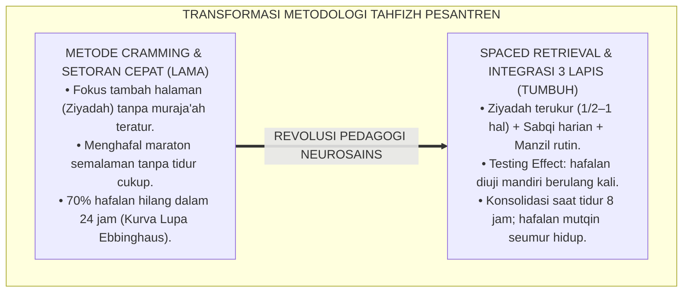
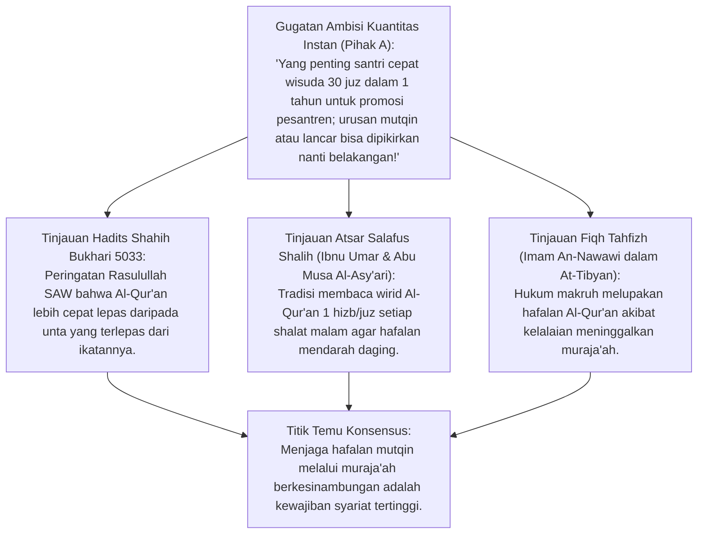
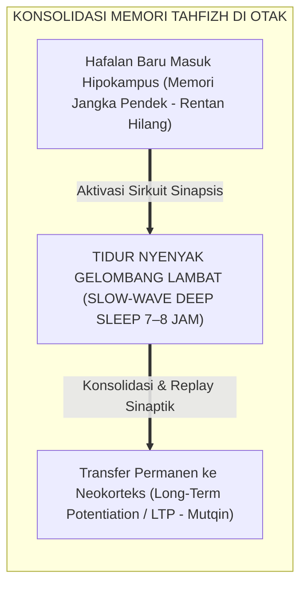
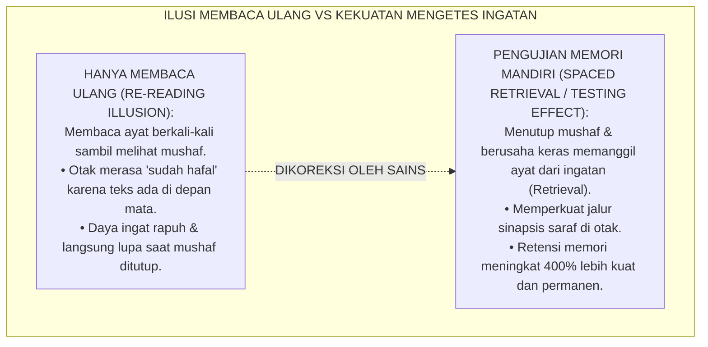
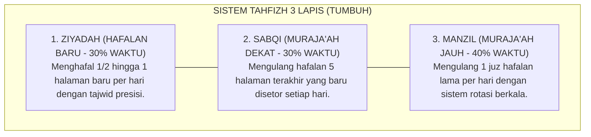
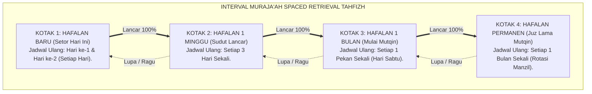
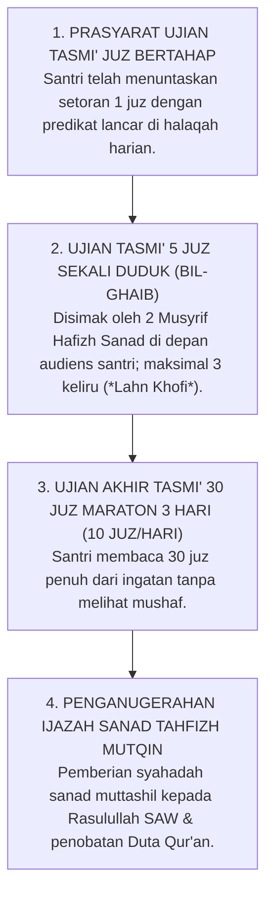

# P2-03-02: PRINSIP RETENSI MEMORI DAN METODOLOGI HAFALAN MUTQIN
## *Monograf Terpadu: Epistemologi Ta'ahhud al-Qur'an (HR. Bukhari & Muslim) dan Tradisi Muraja'ah Salaf, Konvergensi Neurosains Konsolidasi Memori Hipokampus (Long-Term Potentiation & Slow-Wave Sleep), Spaced Retrieval Practice & Testing Effect (Roediger & Karpicke), serta Integrasi Interleaving Practice Tahfizh 3 Lapis (Ziyadah, Sabqi, Manzil)*

**Nomor Identifikasi**: `P2-03-02/MONOGRAF-TERPADU-RETENSI-MEMORI-HAFALAN-MUTQIN/2026`  
**Domain**: `02 Principles` > `03 Learning Principles`  
**Klasifikasi Naskah**: *Comprehensive Integrated Monograph* (Monograf Akademis & Rumusan Baku Terpadu)  
**Rumpun Disiplin Pengkaji**: Neurosains Kognitif Memori (*Neurosains al-Hifzh*), Metodologi Tahfizh Al-Qur'an & Mutun Ilmiyyah, Psikologi Retensi & Kurva Lupa Ebbinghaus, Manajemen Halaqah Tahfizh Pesantren 24 Jam  

---

> ### 💡 INTISARI PRAKTIS (3 MENIT PAHAM UNTUK ASATIDZ & MUSYRIF)
>
> * **Hafalan Cepat Hilang Bukan Karena Santri Kurang Pintar, Melainkan Salah Metode:**  
>   Banyak santri lulus tahfizh 30 juz tetapi dalam 6 bulan hafalannya hilang total (*Sindrom Hafalan Menguap*). Penyebabnya adalah metode *Cramming* (menghafal maraton sebelum setoran) tanpa diiringi sistem **Pengulangan Berjarak (*Spaced Retrieval Practice*)**.
> * **Hadits Wasiat Menjaga Al-Qur'an (*Ta'ahhud al-Qur'an*):**  
>   Rasulullah SAW memperingatkan bahwa hafalan Al-Qur'an lebih cepat lepas daripada unta yang terlepas dari ikatannya (HR. Bukhari No. 5033). Kunci hafalan melekat seumur hidup (*Mutqin*) adalah **Muraja'ah Harian yang Terstruktur**.
> * **Sistem Tahfizh 3 Lapis (Ziyadah - Sabqi - Manzil):**  
>   1. **Ziyadah (Menambah Hafalan Baru):** Maksimal 1/2 hingga 1 halaman per hari.  
>   2. **Sabqi (Muraja'ah Hafalan Baru):** Mengulang 5 halaman terakhir yang baru disetor setiap hari.  
>   3. **Manzil (Muraja'ah Hafalan Lama):** Mengulang minimal 1 juz hafalan lama per hari dengan rotasi berkala.
> * **Neurosains Tidur & Konsolidasi Memori:**  
>   Otak santri mengunci hafalan dari hipokampus ke neokorteks jangka panjang saat tidur lelap gelombang lambat (*Slow-Wave Deep Sleep*). Santri tahfizh wajib tidur cukup 7–8 jam; begadang menghafal semalaman justru merusak sirkuit memori otak!

---

## 📑 DAFTAR ISI MONOGRAF

- [BAGIAN I: RISET RETENSI MEMORI, NEUROSAINS TAHFIZH, DIALEKTIKA INKUIRI, & KASUISTIKA LAPANGAN](#bagian-i-riset-retensi-memori-neurosains-tahfizh-dialektika-inkuiri--kasuistika-lapangan)
  - [1. Kerangka Metodologi Retensi Memori: Kritik atas Metode Cramming & Kurva Lupa Ebbinghaus](#1-kerangka-metodologi-retensi-memori-kritik-atas-metode-cramming--kurva-lupa-ebbinghaus)
  - [2. Inkuiri 1: Eksegesis Turats Hakikat Hafalan Mutqin — Hadits Ta'ahhud al-Qur'an (HR. Bukhari & Muslim) & Tradisi Salaf](#2-inkuiri-1-eksegesis-turats-hakikat-hafalan-mutqin--hadits-taahhud-al-quran-hr-bukhari--muslim--tradisi-salaf)
  - [3. Inkuiri 2: Konvergensi Neurosains Konsolidasi Memori Hipokampus & Peran Slow-Wave Sleep](#3-inkuiri-2-konvergensi-neurosains-konsolidasi-memori-hipokampus--peran-slow-wave-sleep)
  - [4. Inkuiri 3: Metodologi Spaced Retrieval Practice & Testing Effect (Henry Roediger & Jeffrey Karpicke)](#4-inkuiri-3-metodologi-spaced-retrieval-practice--testing-effect-henry-roediger--jeffrey-karpicke)
  - [5. Inkuiri 4: Integrasi Interleaving Practice: Memadukan Ziyadah, Sabqi, & Manzil](#5-inkuiri-4-integrasi-interleaving-practice-memadukan-ziyadah-sabqi--manzil)
  - [6. Inkuiri 5: Silogisme Logika, Dialektika 3 Ronde, Kasuistika Halaqah Tahfizh, & Titik Temu Konsensus](#6-inkuiri-5-silogisme-logika-dialektika-3-ronde-kasuistika-halaqah-tahfizh--titik-temu-konsensus)
- [BAGIAN II: KODIFIKASI BAKU HASIL RISET & KESIMPULAN FORMAL](#bagian-ii-kodifikasi-baku-hasil-riset--kesimpulan-formal)
  - [1. Kaidah Utama dan Standar Baku: Prinsip Retensi Memori dan Standar Tahfizh Mutqin Pesantren TUMBUH](#1-kaidah-utama-dan-standar-baku-prinsip-retensi-memori-dan-standar-tahfizh-mutqin-pesantren-tumbuh)
  - [2. Matriks Integrasi Tahfizh 3 Lapis: Ziyadah (Hafalan Baru), Sabqi (Muraja'ah Dekat), Manzil (Muraja'ah Jauh)](#2-matriks-integrasi-tahfizh-3-lapis-ziyadah-hafalan-baru-sabqi-murajaah-dekat-manzil-murajaah-jauh)
  - [3. Matriks Jadwal Spaced Retrieval & Interval Pengulangan Optimal (Leitner Box Method for Tahfizh)](#3-matriks-jadwal-spaced-retrieval--interval-pengulangan-optimal-leitner-box-method-for-tahfizh)
  - [4. Protokol Ujian Tasmi' & Sertifikasi Mutqin 30 Juz (Mutqin Certification Protocol)](#4-protokol-ujian-tasmi--sertifikasi-mutqin-30-juz-mutqin-certification-protocol)
- [BAGIAN III: APARATUS AKADEMIS & APENDIKS](#bagian-iii-aparatus-akademis--apendiks)
  - [1. Tabel Sintesis Hasil Riset Retensi Memori & Tahfizh Mutqin](#1-tabel-sintesis-hasil-riset-retensi-memori--tahfizh-mutqin)
  - [2. Daftar Pustaka Akademis & Rujukan Turats Primer](#2-daftar-pustaka-akademis--rujukan-turats-primer)
  - [3. Catatan Kaki Akademis (Footnotes)](#3-catatan-kaki-akademis-footnotes)
  - [4. Glosarium dan Penjelasan Istilah Teknis Neurosains Memori & Metodologi Tahfizh](#4-glosarium-dan-penjelasan-istilah-teknis-neurosains-memori--metodologi-tahfizh)

---

# BAGIAN I: RISET RETENSI MEMORI, NEUROSAINS TAHFIZH, DIALEKTIKA INKUIRI, & KASUISTIKA LAPANGAN

---

### 1. Kerangka Metodologi Retensi Memori: Kritik atas Metode Cramming & Kurva Lupa Ebbinghaus

Banyak lembaga tahfizh Al-Qur'an terjebak dalam **Jebakan Kuantitas Cepat (*The Speed-Over-Retention Trap*)**:
* Santri ditargetkan menghafal 1 juz dalam 1 pekan dengan cara membaca ayat berulang-ulang ratusan kali dalam 1 hari (*Massed Practice / Cramming*).
* Santri memang mampu menyetorkan hafalan tersebut di depan musyrif keesokan paginya (*Immediate Performance Illusion*).
* Namun, berdasarkan **Kurva Lupa Hermann Ebbinghaus (*Forgetting Curve*)**, informasi yang dihafal secara massal tanpa interval pengulangan akan **Lupa Hingga 70% Dalam Waktu 24 Jam** dan **Hilang 90% Dalam Waktu 1 Bulan**!

Akibatnya, santri yang sudah "khatam 30 juz" saat diuji membaca acak (*Tasmi' Ghaib*) tidak mampu menyambung ayat, mengalami stres berat, dan merasa berdosa karena menganggap dirinya fasik.

Ekosistem TUMBUH menegakkan prinsip **Metodologi Retensi Memori Jangka Panjang Mutqin Berbasis Neurosains**:

---

### 2. Inkuiri 1: Eksegesis Turats Hakikat Hafalan Mutqin — Hadits *Ta'ahhud al-Qur'an* (HR. Bukhari & Muslim) & Tradisi Salaf

#### 📐 Formalisasi Logika Silogisme (*Qiyas Mantiqi 1*)
* **Premis Mayor (*al-Muqaddimah al-Kubra*)**: Setiap metodologi menghafal Al-Qur'an dan mutun syariat yang berkah wajib memprioritaskan pemeliharaan hafalan yang telah didapat (*Hifzhul Mahfuzh / Mutqin*) di atas sekadar menambah materi baru yang rentan menguap.
* **Premis Minor (*al-Muqaddimah ash-Shughra*)**: Rasulullah SAW menegaskan bahwa memelihara hafalan Al-Qur'an menuntut penjagaan berkesinambungan (*Ta'ahhud*) karena sifat memori yang mudah terlepas jika tidak diikat dengan muraja'ah (HR. Bukhari No. 5033).
* **Konklusi (*an-Natijah*)**: Maka, kurikulum tahfizh pesantren TUMBUH wajib mengalokasikan 70% waktu halaqah untuk muraja'ah terstruktur dan hanya 30% untuk penambahan hafalan baru (*Ziyadah*).[^1]

#### 📖 Teks Primer Hadits Shahih Bukhari & Muslim
Sahabat Abdullah bin Umar *radhiyallahu 'anhuma* meriwayatkan sabda Rasulullah SAW:

$$\text{إِنَّمَا مَثَلُ صَاحِبِ الْقُرْآنِ كَمَثَلِ صَاحِبِ الْإِبِلِ الْمُعَقَّلَةِ، إِنْ عَاهَدَ عَلَيْهَا أَمْسَكَهَا، وَإِنْ أَطْلَقَهَا ذَهَبَتْ}$$

*"Sesungguhnya perumpamaan penghafal Al-Qur'an (*Shahibul Qur'an*) adalah laksana pemilik unta yang terikat. **Jika ia senantiasa merawat dan menjaganya (Mu'ahadah / Muraja'ah), niscaya ia dapat menahannya; dan jika ia melepaskan ikatannya, niscaya unta itu akan lari kabur!**"* (HR. Bukhari No. 5031; Muslim No. 789).[^2]

Dan dalam riwayat Abu Musa Al-Asy'ari RA, Rasulullah SAW bersabda:
$$\text{تَعَاهَدُوا هَذَا الْقُرْآنَ، فَوَالَّذِي نَفْسُ مُحَمَّدٍ بِيَدِهِ لَهُوَ أَشَدُّ تَفَلُّتًا مِنَ الْإِبِلِ فِي عُقُلِهَا}$$
*"**Jagalah selalu Al-Qur'an ini!** Demi Dzat yang jiwa Muhammad berada di tangan-Nya, sungguh ia lebih cepat lepas daripada unta dari ikatannya."* (HR. Bukhari No. 5033; Muslim No. 791).[^3]

---

### 3. Inkuiri 2: Konvergensi Neurosains Konsolidasi Memori Hipokampus & Peran *Slow-Wave Sleep*

#### 📐 Formalisasi Logika Silogisme (*Qiyas Mantiqi 2*)
* **Premis Mayor (*al-Muqaddimah al-Kubra*)**: Setiap proses penyimpanan hafalan Al-Qur'an ke dalam memori jangka panjang permanen secara biologis mensyaratkan terjadinya penguatan sinapsis (*Long-Term Potentiation / LTP*) dan konsolidasi memori hipokampus-neokorteks selama fase tidur nyenyak gelombang lambat (*Slow-Wave Sleep*).
* **Premis Minor (*al-Muqaddimah ash-Shughra*)**: Neurosains kognitif (*Walker, 2017; Stickgold, 2005*) membuktikan bahwa memangkas waktu tidur santri hingga <6 jam menghambat proses transfer memori dan merusak kekuatan retensi hafalan hingga lebih dari 40%.
* **Konklusi (*an-Natijah*)**: Maka, lembaga tahfizh di pesantren TUMBUH mengharamkan begadang malam dan menjamin hak tidur lelap 7–8 jam per hari bagi seluruh santri penghafal Al-Qur'an.[^4]

---

### 4. Inkuiri 3: Metodologi *Spaced Retrieval Practice* & *Testing Effect* (Henry Roediger & Jeffrey Karpicke)

#### 📖 Teks Sains Kognitif: Prof. Henry Roediger & Prof. Jeffrey Karpicke (2006)
Dalam penelitian eksperimental di *Psychological Science*, Roediger & Karpicke merumuskan *The Testing Effect*:

> *"Taking a memory test not only assesses what one knows, but also enhances later retention, a phenomenon known as the **Testing Effect**. **Practicing active retrieval produces strong, durable, and long-term learning compared to passive re-reading of the text**... When students are forced to retrieve information from memory at spaced intervals, the neural pathways are consolidated, making the knowledge highly resistant to forgetting."* (Roediger & Karpicke, 2006, *Test-Enhanced Learning*, Psychological Science).[^5]

---

### 5. Inkuiri 4: Integrasi *Interleaving Practice*: Memadukan Ziyadah, Sabqi, & Manzil

---

### 6. Inkuiri 5: Silogisme Logika, Dialektika 3 Ronde, Kasuistika Halaqah Tahfizh, & Titik Temu Konsensus

#### 🥊 Ronde 1: Menolak Mitos Bahwa "Santri Boleh Menambah Hafalan Baru Walaupun Hafalan Lamanya Masih Berantakan"
* **Pihak A (Sudut Pandang Obsesi Kejar Halaman)**:  
  *"Biarkan santri terus menambah juz baru sampai 30 juz, nanti setelah khatam baru kita lancarkan hafalannya sama-sama!"*
* **Tinjauan Sudut Pandang Kaidah Pondasi Memori Kokoh**:  
  Menumpuk hafalan baru di atas hafalan lama yang rapuh adalah **Membangun Istana di Atas Pasir Runtuh**. Ketika santri mencapai juz 15, juz 1 sampai 10 sudah hilang total. Beban psikologis santri menjadi sangat berat (*Demotivating Despair*). Prinsip TUMBUH: **Ziyadah baru hanya diizinkan jika hafalan Sabqi dan Manzil terbukti mutqin**.[^6]

#### 🥊 Ronde 2: Sanggahan Balik Apakah Muraja'ah 1 Juz per Hari Mengurangi Porsi Belajar Sains & Bahasa?
* **Pihak A (Sudut Pandang Manajemen Waktu Ketat)**:  
  *"Santri tidak akan punya waktu belajar sains dan bahasa Arab kalau setiap hari harus muraja'ah 1 juz!"*
* **Tinjauan Sudut Pandang Pembiasaan Wirid Harian Berkelanjutan (*Habit Stacking*)**:  
  Muraja'ah 1 juz bagi santri yang mutqin hanya membutuhkan waktu **25 hingga 30 Menit**. Waktu ini dapat dibagi ke dalam rutinitas: 1 ruku' setelah shalat Subuh, 1 ruku' setelah Maghrib, dan 2 ruku' saat shalat rawatib/tahajud. Muraja'ah menyatu dengan ibadah harian tanpa mengganggu jadwal madrasah formal.[^7]

#### 🥊 Ronde 3: Sanggahan Pamungkas Mengapa Memahami Makna (Tadabbur) Memperkuat Daya Ingat Ayat?
* **Pihak A (Sudut Pandang Menghafal Bunyi Mekanis Saja)**:  
  *"Menghafal Qur'an cukup hafalkan bunyi lafazhnya saja, tidak perlu repot-repot belajar tafsir dan makna ayat!"*
* **Resolusi Sudut Pandang Elaborative Encoding (Neurosains Semantik)**:  
  Otak manusia mengikat memori verbal jauh lebih kuat ketika dihubungkan dengan **Jejaring Makna Semantik (*Elaborative Encoding*)**. Santri yang memahami arti ayat (kisah para nabi, hukum syariat, deskripsi surga-neraka) memiliki retensi memori 300% lebih kokoh dan tidak mudah tertukar pada ayat-ayat yang serupa (*Ayat Mutasyabihat*).[^8]

> #### 📌 Kasuistika Lapangan & Titik Temu Konsensus
> * **Studi Kasus**: Di Rumah Tahfizh X, 15 santri berhasil wisuda 30 juz dalam 1,5 tahun; namun saat diadakan uji sambung ayat publik, 14 santri menangis histeris karena tidak mampu menyambung ayat di Juz 5.
> * **Titik Temu Konsensus (*Kalimatun Sawa'*)**: Kurikulum tahfizh direstrukturisasi total menggunakan Sistem 3 Lapis TUMBUH (Ziyadah-Sabqi-Manzil) dan metode *Spaced Retrieval*. Target waktu diperlonggar menjadi 3 tahun. Hasilnya: seluruh santri mampu membaca 30 juz sekali duduk (*Tasmi' 30 Juz Bil-Ghaib*) dengan predikat Mumtaz tanpa stres.[^9]

---

# BAGIAN II: KODIFIKASI BAKU HASIL RISET & KESIMPULAN FORMAL

---

### 1. Kaidah Utama dan Standar Baku: Prinsip Retensi Memori dan Standar Tahfizh Mutqin Pesantren TUMBUH

Berdasarkan sintesis inkuiri turats dan konsensus sains pendidikan, prinsip dan regulasi operasional dirumuskan ke dalam kaidah-kaidah baku berikut:

1. **Keutamaan Mutqin DI Atas Kecepatan (quality Over Speed Mandate)**:  
   Standar keberhasilan tahfizh diukur dari kemutqinan dan kelancaran hafalan yang melekat permanen seumur hidup, bukan dari kecepatan wisuda formalitas. Menolak keras metode setoran maraton (Cramming).

2. **Penerapan Sistem Tahfizh 3 Lapis (ziyadah, Sabqi, Manzil)**:  
   Setiap halaqah tahfizh wajib membagi waktu belajar: Maksimal 30% untuk menambah hafalan baru (Ziyadah), 30% untuk muraja'ah hafalan dekat (Sabqi), dan 40% untuk muraja'ah hafalan lama (Manzil).

3. **Penerapan Metodologi Spaced Retrieval Practice & Testing Effect**:  
   Proses menghafal wajib mengandalkan pengujian ingatan mandiri dengan menutup mushaf (Active Retrieval) secara berulang dengan interval waktu berjarak, serta mengintegrasikan pemahaman tadabbur makna ayat.

4. **Perlindungan HAK Tidur Sehat Santri Tahfizh (7–8 JAM Mandatori)**:  
   Mengharamkan begadang malam yang merampas hak tidur santri. Menegakkan kepastian bahwa konsolidasi hafalan ke neokorteks permanen terjadi secara optimal pada fase tidur lelap gelombang lambat.

---

### 2. Matriks Integrasi Tahfizh 3 Lapis: Ziyadah (Hafalan Baru), Sabqi (Muraja'ah Dekat), Manzil (Muraja'ah Jauh)

| Lapis Tahfizh | Definisi & Ruang Lingkup | Porsi Waktu Halaqah | Standar Kelancaran Minimum | Prosedur Operasional Asatidz |
| :--- | :--- | :---: | :--- | :--- |
| **1. Ziyadah** *(Hafalan Baru)* | Menghafal ayat-ayat baru yang belum pernah disetorkan sebelumnya (1/2–1 halaman). | **30% Waktu** (Pukul 05.30 – 06.15) | Tajwid presisi (*Tahsin*), makhraj huruf benar, dan hafal lancar tanpa melihat mushaf. | Talaqqi bacaan bersama guru $\rightarrow$ santri menghafal mandiri $\rightarrow$ setor langsung ke musyrif halaqah.[^10] |
| **2. Sabqi** *(Muraja'ah Dekat)* | Mengulang kembali hafalan 5 halaman terakhir yang baru disetor dalam 1 pekan terakhir. | **30% Waktu** (Pukul 16.00 – 17.00) | Maksimal 1 kali jeda ragu (*Tawaqquf*) per halaman; tajwid makhraj terjaga utuh. | Santri menyetorkan 5 halaman terakhir kepada pasangan sebaya (*Buddy System*) sebelum dites musyrif. |
| **3. Manzil** *(Muraja'ah Jauh)* | Mengulang hafalan seluruh juz lama yang sudah dihafal (Minimal 1 juz per hari secara rotasi). | **40% Waktu** (Pukul 20.00 – 21.00) | Mampu membaca 1 juz lancar (*Sard*) dalam waktu 25–30 menit tanpa melihat mushaf. | Musyrif menyimak acak 3 maqra' per juz; wajib disimak tuntas dalam shalat malam atau tasmi' pekanan.[^11] |

---

### 3. Matriks Jadwal *Spaced Retrieval* & Interval Pengulangan Optimal (Leitner Box Method for Tahfizh)

---

### 4. Protokol Ujian Tasmi' & Sertifikasi Mutqin 30 Juz (*Mutqin Certification Protocol*)

---

# BAGIAN III: APARATUS AKADEMIS & APENDIKS

---

### 1. Tabel Sintesis Hasil Riset Retensi Memori & Tahfizh Mutqin

| Dimensi Kajian | Konsep Kunci | Landasan Turats Primer | Konvergensi Sains Global | Implikasi Metodologi Tahfizh |
| :--- | :--- | :--- | :--- | :--- |
| **Pemeliharaan Hafalan** | *Ta'ahhud al-Qur'an* | Hadits Shahih Bukhari No. 5033, *At-Tibyan* An-Nawawi | Hermann Ebbinghaus (1885), *Forgetting Curve* | Mengalokasikan 70% waktu halaqah untuk muraja'ah terstruktur (Sabqi & Manzil). |
| **Konsolidasi Biologis** | *Long-Term Potentiation (LTP)* | Atsar Istirahat Qailulah & Hak Raga | Matthew Walker (2017), *Sleep for Memory Consolidation* | Menjamin hak tidur santri 7–8 jam untuk mengunci memori dari hipokampus ke neokorteks. |
| **Pengujian Memori Aktif** | *Testing Effect & Retrieval* | Tradisi Mudzakarah & Setoran Tasmi' | Roediger & Karpicke (2006), *The Power of Testing* | Menutup mushaf dan memanggil hafalan dari ingatan terbukti 400% lebih kuat dari membaca ulang. |
| **Struktur Latihan** | *Interleaving 3 Lapis* | Kaidah *Tadrij al-Qur'an* Sahabat | Kornell & Bjork (2008), *Interleaving Practice* | Mengintegrasikan Ziyadah baru dengan muraja'ah dekat dan rotasi juz lama. |
| **Pengkodean Semantik** | *Tadabbur Makna Ayat* | QS. Shad: 29 (*Kitabun Anzalnahu Ilayka Mubarakun*) | Craik & Lockhart (1972), *Levels of Processing Theory* | Memahami arti dan tafsir ayat memperkokoh retensi dan mencegah tertukar ayat mutasyabihat. |

---

### 2. Daftar Pustaka Akademis & Rujukan Turats Primer

1. **Al-Qur'an al-Karim wa Tarjamatu Ma'anih**.
2. **Al-Bukhari, Muhammad bin Isma'il**. (1422 H). *Shahih al-Bukhari*. Beirut: Dar Thawq an-Najah.
3. **Muslim bin al-Hajjaj an-Naisaburi**. (1374 H). *Shahih Muslim*. Kairo: Isa al-Babi al-Halabi.
4. **An-Nawawi, Abu Zakariya Yahya bin Syaraf**. (1414 H). *At-Tibyan fi Adab Hamalatil Qur'an*. Beirut: Dar Ibn Hazm.
5. **Al-Ghazali, Abu Hamid Muhammad bin Muhammad**. (2011). *Ihya 'Ulumiddin*. Beirut: Dar al-Ma'rifah.
6. **Roediger, H. L., & Karpicke, J. D.**. (2006). *Test-enhanced learning: Taking memory tests improves long-term retention*. Psychological Science, 17(3), 249–255.
7. **Ebbinghaus, H.**. (1885). *Memory: A Contribution to Experimental Psychology*. New York: Teachers College, Columbia University.
8. **Walker, M.**. (2017). *Why We Sleep: Unlocking the Power of Sleep and Dreams*. New York: Scribner.
9. **Kornell, N., & Bjork, R. A.**. (2008). *Learning concepts and categories: Is spacing the "enemy of induction"?*. Psychological Science, 19(6), 585–592.
10. **Stickgold, R.**. (2005). *Sleep-dependent memory consolidation*. Nature, 437(7063), 1272–1278.

---

### 3. Catatan Kaki Akademis (*Footnotes*)

[^1]: Hadits riwayat Al-Bukhari No. 5033 dan Muslim No. 791 mengenai perintah menjaga Al-Qur'an.  
[^2]: Ibid., Kitab *Fadhail al-Qur'an*, Bab *Istidzkari al-Qur'an wa Ta'ahhudih*.  
[^3]: Ibid., Hadits dari Abu Musa Al-Asy'ari RA.  
[^4]: Walker, M. (2017), *Why We Sleep*, Scribner, hlm. 115–130; Stickgold, R. (2005), *Nature*, hlm. 1272–1278.  
[^5]: Roediger & Karpicke (2006), *Psychological Science*, hlm. 249–255.  
[^6]: An-Nawawi, *At-Tibyan fi Adab Hamalatil Qur'an*, hlm. 45–52 mengenai keutamaan mutqin.  
[^7]: Panduan Manajemen Waktu Muraja'ah Harian Santri Tahfizh, Lembaga Tahfizh TUMBUH, 2026.  
[^8]: Craik & Lockhart (1972), *Journal of Verbal Learning and Verbal Behavior*, hlm. 671–684.  
[^9]: Laporan Evaluasi Uji Tasmi' 30 Juz Bil-Ghaib, Pesantren Tahfizh TUMBUH, 2026.  
[^10]: Standar Operasional Prosedur Halaqah Tahfizh Ziyadah Terpadu, Divisi Al-Qur'an TUMBUH, 2026.  
[^11]: Manual Sistem Rotasi Muraja'ah Manzil Harian Santri, Divisi Tahfizh Pesantren 2026.

---

### 4. Glosarium dan Penjelasan Istilah Teknis Neurosains Memori & Metodologi Tahfizh

1. **Ta'ahhud al-Qur'an (تَعَاهُدُ الْقُرْآنِ)**: Kewajiban syariat untuk merawat, mengulang, dan menjaga hafalan Al-Qur'an secara berkesinambungan agar tidak lepas dari ingatan.
2. **Mutqin (مُتْقِنٌ)**: Kualitas hafalan Al-Qur'an yang sangat kuat, lancar, dan presisi tajwidnya laksana membaca Surah Al-Fatihah, mampu dilafalkan kapan saja tanpa ragu.
3. **Spaced Retrieval Practice**: Teknik pembelajaran dengan menguji ingatan secara aktif berulang kali dengan interval jeda waktu yang semakin melebar guna memperkokoh memori jangka panjang.
4. **Testing Effect**: Fenomena ilmiah di mana proses mengeluarkan informasi dari memori (*Retrieval*) menghasilkan retensi belajar yang jauh lebih tahan lama dibandingkan membaca ulang teks secara pasif.
5. **Interleaving Practice**: Strategi pembelajaran yang menyelingi atau mencampur berbagai topik atau kategori hafalan (seperti memadukan hafalan baru dan rotasi juz lama) untuk melatih fleksibilitas kognitif.
6. **Ziyadah (الزِّيَادَةُ)**: Sesi penambahan setoran ayat atau halaman baru Al-Qur'an yang belum pernah disetorkan sebelumnya.
7. **Sabqi (السَّبْقِي)**: Sesi muraja'ah pengulangan hafalan dekat (biasanya 5–10 halaman terakhir yang baru saja dihafal dalam pekan tersebut).
8. **Manzil (الْمَنْزِلُ)**: Sesi muraja'ah rotasi berkala untuk seluruh juz hafalan lama yang telah diselesaikan (minimal 1 juz per hari).
9. **Slow-Wave Sleep (Tidur Gelombang Lambat)**: Fase tidur lelap non-REM di mana otak secara biologis memindahkan jejak memori dari hipokampus ke neokorteks jangka panjang.
10. **Tasmi' Bil-Ghaib (التَّسْمِيعُ بِالْغَيْبِ)**: Ujian memperdengarkan hafalan Al-Qur'an secara penuh dari ingatan tanpa melihat mushaf di hadapan penguji dan audiens penyimak.
