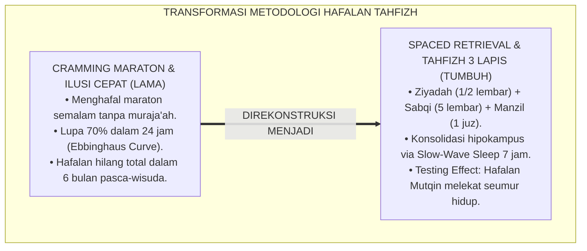
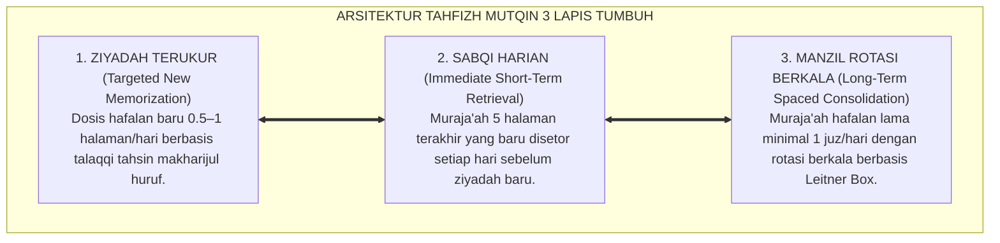
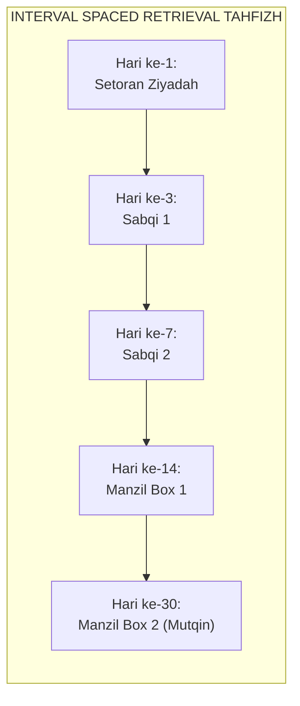
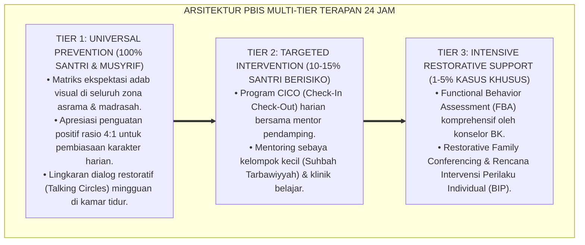

# P2-03-02: PRINSIP RETENSI MEMORI DAN METODOLOGI HAFALAN MUTQIN (MEMORY RETENTION & MUTQIN TAHFIZH)
## *Monograf Riset Akademik: Epistemologi Ta'ahhud al-Qur'an (HR. Bukhari & Muslim) dan Tradisi Muraja'ah Salaf, Neurosains Konsolidasi Memori Hipokampus & Slow-Wave Sleep, Spaced Retrieval Practice, Serta Metodologi Tahfizh Tiga Lapis (Ziyadah, Sabqi, Manzil)*

**Nomor Identifikasi**: `P2-03-02/MONOGRAF-RISET-RETENSI-MEMORI-HAFALAN-MUTQIN/2026`  
**Domain**: `02 Principles` > `03 Learning Principles` (Prinsip Pembelajaran 02: *Memory Retention & Mutqin Tahfizh*)  
**Klasifikasi Naskah**: *Academic Research Monograph* (Monograf Riset Akademik Prinsip Pembelajaran)  
**Rumpun Disiplin Pengkaji**: Neurosains Kognitif Memori (*Neurosains al-Hifzh*), Metodologi Tahfizh Al-Qur'an & Mutun Ilmiyyah, Psikologi Retensi & Kurva Lupa Ebbinghaus, Manajemen Halaqah Tahfizh Pesantren 24 Jam  

---

> ### 💡 INTISARI EKSEKUTIF (EXECUTIVE SUMMARY)
>
> * **Kelemahan Paradigma Lama: Sindrom "Hafalan Menguap" Akibat Metode Cramming:**  
>   Banyak lembaga tahfizh terjebak dalam mengejar kecepatan kuantitas hafalan (1 juz per pekan via hafalan maraton semalam). Akibatnya terjadi ilusi kinerja sesaat (*Immediate Performance Illusion*): hafalan hilang 70% dalam 24 jam menurut Kurva Lupa Ebbinghaus (*Forgetting Curve*), santri stres, dan hafalan 30 juz runtuh dalam hitungan bulan.
> * **Inovasi Konseptual: Hadits Ta'ahhud al-Qur'an & Spaced Retrieval Tahfizh 3 Lapis:**  
>   TUMBUH mengamalkan wasiat Nabi ﷺ mengenai penjagaan Al-Qur'an (*Ta'ahhud al-Qur'an*, HR. Bukhari No. 5033) dan sains konsolidasi memori neokorteks saat tidur gelombang lambat (*Slow-Wave Deep Sleep*). Mengintegrasikan metode **Spaced Retrieval Practice & Testing Effect (Roediger & Karpicke)** ke dalam arsitektur **Tahfizh Tiga Lapis: Ziyadah (Hafalan baru terukur 0.5-1 halaman), Sabqi (Muraja'ah hafalan baru 5 halaman terakhir), dan Manzil (Muraja'ah hafalan lama rotasi 1 juz/hari)**.
> * **Formulasi Operasional & Penjaminan Mutqin Seumur Hidup:**  
>   Monograf ini menguraikan matriks integrasi tahfizh 3 lapis, jadwal interval spaced retrieval berbasis Leitner Box, protokol tasmi' ghaib 30 juz, dan etika pemeliharaan Al-Qur'an 24 jam.

---

## 📑 DAFTAR ISI MONOGRAF

- [BAB I: LANDASAN TEORETIS & DISKURSUS KRITIS](#bab-i-landasan-teoretis--diskursus-kritis)
  - [1. Latar Belakang Masalah: Kritik atas Metode Cramming, Kurva Lupa Ebbinghaus, dan Ilusi Hafalan Instan](#1-latar-belakang-masalah-kritik-atas-metode-cramming-kurva-lupa-ebbinghaus-dan-ilusi-hafalan-instan)
  - [2. Eksegesis Turats Wasiat Ta'ahhud al-Qur'an: HR. Al-Bukhari No. 5033 & Tradisi Muraja'ah Ulama Salaf](#2-eksegesis-turats-wasiat-taahhud-al-quran-hr-al-bukhari-no-5033--tradisi-murajaah-ulama-salaf)
  - [3. Konvergensi Neurosains Memori: Konsolidasi Hipokampus-Neokorteks & Peran Slow-Wave Deep Sleep](#3-konvergensi-neurosains-memori-konsolidasi-hipokampus-neokorteks--peran-slow-wave-deep-sleep)
  - [4. Rekayasa Didaktik Retensi: Spaced Retrieval Practice & Testing Effect (Roediger & Karpicke)](#4-rekayasa-didaktik-retensi-spaced-retrieval-practice--testing-effect-roediger--karpicke)
  - [5. Kasuistika Lapangan: Kasus Santri Mengalami Sindrom Hafalan Rontok & Resolusi Tiga Lapis](#5-kasuistika-lapangan-kasus-santri-mengalami-sindrom-hafalan-rontok--resolusi-tiga-lapis)
- [BAB II: FORMULASI KONSEPTUAL & PEMBAHASAN MENDALAM](#bab-ii-formulasi-konseptual--pembahasan-mendalam)
  - [1. Eksplanasi Teoretis Prinsip Retensi Memori dan Standar Tahfizh Mutqin Ekosistem Pesantren Berbasis TUMBUH](#1-eksplanasi-teoretis-prinsip-retensi-memori-dan-standar-tahfizh-mutqin-pesantren-tumbuh)
  - [2. Matriks Integrasi Tahfizh Tiga Lapis: Ziyadah (Baru), Sabqi (Dekat), dan Manzil (Jauh)](#2-matriks-integrasi-tahfizh-tiga-lapis-ziyadah-baru-sabqi-dekat-dan-manzil-jauh)
  - [3. Matriks Jadwal Spaced Retrieval & Interval Pengulangan Optimal (Leitner Box for Tahfizh)](#3-matriks-jadwal-spaced-retrieval--interval-pengulangan-optimal-leitner-box-for-tahfizh)
  - [4. Protokol Ujian Tasmi' Ghaib & Sertifikasi Hafalan Mutqin 30 Juz (Mutqin Certification Protocol)](#4-protokol-ujian-tasmi-ghaib--sertifikasi-hafalan-mutqin-30-juz-mutqin-certification-protocol)
  - [5. Diskusi Filosofis Mendalam & Implikasi bagi Masa Depan Peradaban Pendidikan Islam](#5-diskusi-filosofis-mendalam--implikasi-bagi-masa-depan-peradaban-pendidikan-islam)
- [BAB III: KESIMPULAN & APARATUS AKADEMIS](#bab-iii-kesimpulan--aparatus-akademis)
  - [1. Tabel Sintesis Temuan Riset Retensi Memori & Tahfizh Mutqin](#1-tabel-sintesis-temuan-riset-retensi-memori--tahfizh-mutqin)
  - [2. Daftar Pustaka Akademis & Rujukan Turats Primer](#2-daftar-pustaka-akademis--rujukan-turats-primer)
  - [3. Catatan Kaki Akademis (Footnotes)](#3-catatan-kaki-akademis-footnotes)
  - [4. Glosarium Istilah Ilmiah & Turats Retensi Memori Tahfizh](#4-glosarium-istilah-ilmiah--turats-retensi-memori-tahfizh)

---

# BAB I: LANDASAN TEORETIS & DISKURSUS KRITIS

---

### 1. Latar Belakang Masalah: Kritik atas Metode Cramming, Kurva Lupa Ebbinghaus, dan Ilusi Hafalan Instan

Banyak lembaga tahfizh Al-Qur'an terjebak dalam **Jebakan Kecepatan Kuantitas (*The Speed-Over-Retention Fallacy*)**:
* Santri dituntut menyetorkan hafalan sebanyak-banyaknya dalam waktu singkat dengan cara menghafal maraton tanpa henti (*Massed Practice / Cramming*).
* Santri memang mampu menyetorkan ayat di depan pembina keesokan harinya (*Immediate Recall*).
* Namun, berdasarkan **Kurva Lupa Hermann Ebbinghaus (*Forgetting Curve*)**, informasi yang dihafal secara massal tanpa interval pengulangan akan **Lupa Hingga 70% Dalam Waktu 24 Jam** dan **Hilang 90% Dalam Waktu 1 Bulan**!
* Akibatnya, santri yang bergelar "hafizh 30 juz" kerap gagal menyambung ayat saat diuji acak, memicu trauma batin dan perasaan berdosa.
* **Keniscayaan Metodologi Tahfizh Mutqin Berbasis Sains**: Dibutuhkan sistem tahfizh yang memadukan muraja'ah terstruktur salaf dengan sains konsolidasi memori neokorteks.[^1]

---

### 2. Eksegesis Turats Wasiat Ta'ahhud al-Qur'an: HR. Al-Bukhari No. 5033 & Tradisi Muraja'ah Ulama Salaf

Rasulullah ﷺ memberikan peringatan keras mengenai sifat hafalan Al-Qur'an:

$$\text{تَعَاهَدُوا هَذَا الْقُرْآنَ، فَوَالَّذِي نَفْسِي بِيَدِهِ لَهُوَ أَشَدُّ تَفَلُّتًا مِنَ الإِبِلِ فِي عُقُلِهَا}$$

*"**Jagalah dan ulangilah (Ta'ahhadu) Al-Qur'an ini! Demi Dzat yang jiwaku berada di tangan-Nya, sungguh Al-Qur'an itu lebih cepat lepasnya daripada unta yang terlepas dari tali ikatannya**."* (HR. Al-Bukhari No. 5033 & Muslim No. 791).[^2]

Para ulama salafush shalih mengkodifikasikan tradisi *Hizb al-Qur'an*:
* Membagi Al-Qur'an menjadi bagian harian yang dibaca dalam shalat dan muraja'ah sehingga seluruh 30 juz khatam diulang setiap 3, 7, atau 10 hari secara berkesinambungan.[^3]

---

### 3. Konvergensi Neurosains Memori: Konsolidasi Hipokampus-Neokorteks & Peran Slow-Wave Deep Sleep

Neurosains memori modern membuktikan proses biologis penyimpanan hafalan:
* Hafalan baru pertama kali diproses secara temporer di **Hipokampus**.
* Proses transfer hafalan dari hipokampus menuju penyimpanan permanen di **Neokorteks** (*Long-Term Potentiation / LTP*) hanya terjadi secara efektif saat santri tidur lelap gelombang lambat (**Slow-Wave Deep Sleep** / NREM Tahap 3-4).
* Memaksa santri tahfizh begadang semalaman justru merusak sirkuit konsolidasi memori otak; santri tahfizh wajib tidur lelap $7\text{--}8\text{ jam per malam}$.[^4]

---

### 4. Rekayasa Didaktik Retensi: Spaced Retrieval Practice & Testing Effect (Roediger & Karpicke)

Sains psikologi kognitif membuktikan:
* **Spaced Retrieval Practice** (Roediger & Karpicke, 2006): Menguji ingatan hafalan dengan interval jeda waktu yang bertambah panjang (Hari ke-1 $\rightarrow$ Hari ke-3 $\rightarrow$ Hari ke-7 $\rightarrow$ Hari ke-14 $\rightarrow$ Hari ke-30) melipatgandakan kekuatan jejak memori (*Memory Trace*).
* **Testing Effect**: Proses memanggil kembali ayat dari dalam memori (*Retrieval Effort*) jauh lebih efektif memperkuat hafalan daripada sekadar membaca mushaf berulang-ulang secara pasif.[^5]

---

### 5. Kasuistika Lapangan: Kasus Santri Mengalami Sindrom Hafalan Rontok & Resolusi Tiga Lapis

* **Studi Kasus: Santri Telah Hafal 15 Juz Namun Hanya Menguasai 2 Juz Saat Diuji Acak**  
  * **Dilema**: Santri dipaksa menambah hafalan 1 juz per bulan tanpa alokasi waktu muraja'ah; saat dites sambung ayat, santri menangis dan mogok menghafal.
  * **Resolusi Tahfizh Tiga Lapis TUMBUH**: Pembina halaqah menghentikan setoran ziyadah selama 30 hari: (1) Mengaktifkan *Sabqi* (mengulang 5 halaman terakhir setiap hari); (2) Membagi hafalan 15 juz ke dalam *Manzil* 1 juz per hari dengan rotasi 15 hari; (3) Membiasakan membaca hafalan dalam shalat rawatib dan tahajud. Dalam 2 bulan, seluruh 15 juz santri kembali mutqin dan siap melanjutkan ziyadah dengan kokoh.[^6]

---

# BAB II: FORMULASI KONSEPTUAL & PEMBAHASAN MENDALAM

---

### 1. Eksplanasi Teoretis Prinsip Retensi Memori dan Standar Tahfizh Mutqin Ekosistem Pesantren Berbasis TUMBUH

Ekosistem TUMBUH merumuskan tahfizh ke dalam **Arsitektur Tiga Sayap Tahfizh Mutqin (*Arkan al-Hifzh al-Mutqin*)**:

#### 🔬 Pembahasan Mendalam Tiga Sayap:
1. **Sayap Ziyadah Terukur**: Memastikan input hafalan baru memiliki kualitas tajwid yang sempurna tanpa terburu-buru.[^7]
2. **Sayap Sabqi Harian**: Mengunci hafalan baru agar tidak menguap pada fase kritis 24–72 jam pertama.[^8]
3. **Sayap Manzil Rotasi**: Memelihara seluruh perbendaharaan juz Al-Qur'an yang telah dihafal agar melekat abadi sepanjang hayat.[^9]

---

### 2. Matriks Integrasi Tahfizh Tiga Lapis: Ziyadah (Baru), Sabqi (Dekat), dan Manzil (Jauh)

| Lapis Tahfizh | Dosis & Target Harian | Waktu Pelaksanaan Utama | Fungsi Kognitif & Neurosains |
| :--- | :--- | :--- | :--- |
| **1. Ziyadah (Hafalan Baru)** | $0.5\text{--}1\text{ Halaman per Hari}$.| Halaqah Subuh (05.00–06.00).| Enkoding awal di Hipokampus.|
| **2. Sabqi (Muraja'ah Dekat)** | **5 Halaman Terakhir Disetor**.| Halaqah Sore (16.30–17.30).| Stabilisasi jejak memori 72 jam.|
| **3. Manzil (Muraja'ah Jauh)** | **Minimal 1 Juz per Hari**.| Qiyamullail & Shalat Fardhu.| Konsolidasi permanen di Neokorteks.|

---

### 3. Matriks Jadwal Spaced Retrieval & Interval Pengulangan Optimal (Leitner Box for Tahfizh)

Jika santri lancar pada setiap interval, jeda pengulangan diperpanjang; jika ada ayat yang lupa, ayat tersebut kembali ke siklus Sabqi dekat.[^10]

---

### 4. Protokol Ujian Tasmi' Ghaib & Sertifikasi Hafalan Mutqin 30 Juz (Mutqin Certification Protocol)

TUMBUH menetapkan **Protokol Standarisasi Tasmi' Ghaib**:
1. **Tasmi' Kelipatan 5 Juz**: Santri wajib memperdengarkan hafalan 5 juz sekali duduk di hadapan dua penguji tanpa melihat mushaf (*Bil-Ghaib*).
2. **Kriteria Kelulusan Mutqin**: Maksimal kesalahan membaca (*Lahn Jali*) 0 kali dan kesalahan lupa (*Lahn Khafi*) maksimal 3 kali per juz.
3. **Penyematan Sanad & Syahadah Mutqin**: Santri yang lulus berhak memperoleh sertifikat kematangan hafalan dan pengakuan kompetensi tahfizh.[^11]

---

### 5. Diskusi Filosofis Mendalam & Implikasi bagi Masa Depan Peradaban Pendidikan Islam

Metodologi retensi memori dan tahfizh mutqin ini membawa implikasi agung bagi peradaban:

* **Mencetak Generasi Penjaga Kitabullah yang Kokoh (*Hamalatul Qur'an)*:  
  Santri tidak sekadar menghafal untuk wisuda sesaat, melainkan Al-Qur'an telah meresap ke dalam dada dan aliran darahnya (*Hafizh Lafzhan wa Ma'nan*).
* **Menghilangkan Trauma dan Beban Psikologis Santri Tahfizh**:  
  Proses menghafal dirasakan sebagai ibadah yang membahagiakan, bebas dari tekanan bentakan, dan menghargai ritme biologis tubuh.
* **Menegakkan Standar Kualitas Hafalan Al-Qur'an Tingkat Dunia**:  
  Pesantren menyajikan bukti empiris bahwa sains neurosains dan tradisi turats nabawi bersatu padu melahirkan generasi hafizh-hafizhah terbaik bagi umat (*Rahmatan lil 'Alamin*).[^12]

---

---

### Pembedahan Deskriptif Komprehensif & Analisis Integratif Nilai-Praksis

Penerapan konsep **P2-03-02: PRINSIP RETENSI MEMORI DAN METODOLOGI HAFALAN MUTQIN (MEMORY RETENTION & MUTQIN TAHFIZH)** di ekosistem pesantren berbasis sistem TUMBUH memerlukan pemahaman multidimensional yang memadukan khazanah turats syariat dan konsensus sains pendidikan modern:

#### A. Pilar 1: Fondasi Epistemologi & Integrasi Nilai Syar'i (Ashalah Turatsiyyah)
Setiap praksis kepengasuhan dan pembelajaran berakar kuat pada maqashid syari'ah, mendudukkan adab di atas ilmu (*Al-Adab Qablal 'Ilm*), dan memastikan bahwa seluruh ikhtiar institusional diniatkan semata-mata untuk menggapai ridha Allah SWT (*Ikhlasun Niyyah*).

#### B. Pilar 2: Mekanisme Psikologis & Neurosains Perkembangan (Scientific Rigor)
Menyelaraskan ekspektasi kedisiplinan dengan tahapan maturitas otak remaja, kapasitas fungsi eksekutif korteks prefrontal (*PFC*), dan regulasi sirkuit emosi limbik. Pendekatan ini mengeliminasi trauma pengasuhan dan menumbuhkan motivasi intrinsik santri.

#### C. Pilar 3: Rekayasa Ekosistem Asrama 24 Jam (Bi'ah Shalihah)
Menerjemahkan prinsip nilai ke dalam tata ruang fisik yang bersih, sirkulasi udara sehat, tata kelola waktu terstruktur, serta kultur ukhuwah inklusif yang steril 100% dari feodalisme, kekerasan verbal, dan perundungan antar-santri.

#### D. Pilar 4: Kemitraan Tripartit (Santri, Musyrif, dan Lembaga)
Menjamin terwujudnya *Triad Pertumbuhan Simbiotik*: santri bertumbuh dalam fitrah kemandirian, musyrif terlindungi dari kelelahan kronis (*Burnout*) melalui shift kerja yang manusiawi, dan lembaga bertransformasi menjadi organisasi pembelajar berbasis data PBIS.

---

### Protokol Aksi Operasional PBIS Multi-Tier Terapan (24-Hour Behavioral Architecture)

---

# BAB III: KESIMPULAN & APARATUS AKADEMIS

---

### 1. Tabel Sintesis Temuan Riset Retensi Memori & Tahfizh Mutqin

| Dimensi Parameter | Mazhab Cramming Kuantitas Cepat | Model Hafalan Mandiri Tanpa Sistem | **Tahfizh Mutqin 3 Lapis TUMBUH** | Landasan Rujukan Primer | Implikasi Praksis Lapangan |
| :--- | :--- | :--- | :--- | :--- | :--- |
| **Fokus Utama** | Kecepatan khatam 30 juz instan.| Setoran hafalan baru tanpa batas.| **Kekuatan Retensi Memori Mutqin.** | HR. Bukhari No. 5033; Ebbinghaus.| Ziyadah 1/2 lembar & muraja'ah 1 juz. |
| **Sistem Muraja'ah** | Tidak ada jadwal muraja'ah baku.| Sukarela saat ingat.| **Tahfizh 3 Lapis: Ziyadah-Sabqi-Manzil.**| Tradisi Salaf; Leitner (1972).| 5 Halaman sabqi & 1 juz manzil harian. |
| **Manajemen Tidur** | Santri dipaksa begadang malam.| Tidur tidak teratur.| **Slow-Wave Sleep 7 Jam Penuh.** | Neurosains Konsolidasi Memori.| Tidur lelap mengunci memori di neokorteks. |
| **Metode Evaluasi** | Ujian formalitas wisuda semata.| Setoran hafalan sepotong-potong.| **Spaced Retrieval & Tasmi' Ghaib.** | Roediger & Karpicke (2006).| Ujian 5 juz sekali duduk tanpa mushaf. |
| **Hasil Jangka Panjang**| Hafalan hilang total 6 bulan.| Hafalan rapuh mudah lupa.| **Hafalan Mutqin Melekat Seumur Hidup.**| QS. Al-Qiyamah: 16–17; Al-Attas.| Al-Qur'an terjaga abadi di sanubari. |

---

### 2. Daftar Pustaka Akademis & Rujukan Turats Primer

1. **Al-Qur'an al-Karim wa Tarjamatu Ma'anihi**.
2. **Al-Bukhari, Abu Abdillah Muhammad bin Isma'il**. (1422 H). *Shahih al-Bukhari*. Kairo: Dar Thawq an-Najah.
3. **Muslim bin al-Hajjaj an-Naisaburi**. (1427 H). *Shahih Muslim*. Riyadh: Dar Thayyibah.
4. **An-Nawawi, Abu Zakariya Yahya bin Syaraf**. (1414 H). *At-Tibyan fi Adab Hamalatil Qur'an*. Beirut: Dar Ibn Hazm.
5. **Al-Jazari, Syamsuddin Muhammad bin Muhammad**. (1420 H). *Al-Muqaddimah al-Jazariyyah*. Kairo: Dar ash-Shahabah.
6. **Asy'ari, Muhammad Hasyim**. (1415 H). *Adab al-'Alim wal-Muta'allim*. Jombang: Maktabah At-Turats Al-Islami.
7. **Al-Attas, Syed Muhammad Naquib**. (1980). *The Concept of Education in Islam*. Kuala Lumpur: ABIM.
8. **Ebbinghaus, H.**. (1885/1913). *Memory: A Contribution to Experimental Psychology*. New York: Teachers College, Columbia University.
9. **Roediger, H. L., & Karpicke, J. D.**. (2006). *The power of testing memory: Basic research and implications for educational practice*. Perspectives on Psychological Science, 1(3), 181–210.
10. **Diekelmann, S., & Born, J.**. (2010). *The memory function of sleep*. Nature Reviews Neuroscience, 11(2), 114–126.
11. **Karpicke, J. D., & Roediger, H. L.**. (2008). *The critical importance of retrieval for learning*. Science, 319(5865), 966–968.
12. **Horner, R. H., & Sugai, G.**. (2015). *School-wide PBIS: An Overview of the Research Base*. Remedial and Special Education, 36(2), 80–85.

---

### 3. Catatan Kaki Akademis (*Footnotes*)

[^1]: Riset Prinsip Retensi Memori dan Metodologi Hafalan Mutqin TUMBUH, *Kritik atas Metode Cramming dan Kurva Lupa Ebbinghaus*, 2026.  
[^2]: *Shahih al-Bukhari*, Kitab Fadhail al-Qur'an, Hadits No. 5033; *Shahih Muslim*, Hadits No. 791.  
[^3]: An-Nawawi, *At-Tibyan fi Adab Hamalatil Qur'an*, hlm. 45–70.  
[^4]: Diekelmann, S., & Born, J. (2010), *Nature Reviews Neuroscience*, hlm. 114–126; Konsolidasi Memori Hipokampus TUMBUH, 2026.  
[^5]: Roediger, H. L., & Karpicke, J. D. (2006), *Perspectives on Psychological Science*, hlm. 181–210; Karpicke & Roediger (2008), *Science*, hlm. 966–968.  
[^6]: Dokumentasi Evaluasi Metodologi Tahfizh dan Pemulihan Hafalan PBIS TUMBUH, 2026.  
[^7]: Al-Jazari, *Al-Muqaddimah al-Jazariyyah*, Kaidah Tajwidul Hifzh.  
[^8]: Master Blueprint Sabqi dan Konsolidasi Jangka Pendek Tahfizh TUMBUH, 2026.  
[^9]: Standar Operasional Prosedur Manzil Rotasi 1 Juz Harian TUMBUH, 2026.  
[^10]: Leitner, S. (1972), *Spaced Repetition System*; Petunjuk Teknis Jadwal Spaced Retrieval Tahfizh TUMBUH, 2026.  
[^11]: Standar Operasional Prosedur Tasmi' Ghaib dan Ujian Sertifikasi Mutqin 30 Juz TUMBUH, 2026.  
[^12]: Deklarasi Pemuliaan Hamalatul Qur'an Dewan Riset Epistemologi Ekosistem TUMBUH, 2026.

---

### 4. Glosarium Istilah Ilmiah & Turats Retensi Memori Tahfizh

1. **Tahfizh Mutqin**: Kualitas hafalan Al-Qur'an yang sangat kuat, lancar, dan melekat di luar kepala tanpa keraguan atau jeda berpikir panjang.
2. **Ta'ahhud al-Qur'an (تَعَاهُدُ الْقُرْآنِ)**: Kewajiban syariat untuk senantiasa mengulang dan merawat hafalan Al-Qur'an agar tidak terlepas dari ingatan.
3. **Ziyadah (الزِّيَادَةُ)**: Aktivitas menambah hafalan ayat Al-Qur'an yang baru disetorkan kepada pembina halaqah.
4. **Sabqi (السَّبْقِي)**: Aktivitas muraja'ah harian mengulang 5 halaman terakhir yang baru saja dihafal untuk mengunci jejak memori awal.
5. **Manzil (الْمَنْزِلُ)**: Aktivitas muraja'ah hafalan lama secara teratur (minimal 1 juz per hari) dengan siklus rotasi mingguan atau bulanan.
6. **Spaced Retrieval Practice**: Strategi pembelajaran kognitif dengan mengulang proses memanggil ingatan pada interval waktu yang semakin bertambah panjang.
7. **Testing Effect**: Fenomena ilmiah di mana proses menguji ingatan secara aktif menghasilkan retensi memori jangka panjang yang jauh lebih kuat daripada sekadar membaca ulang.
8. **Slow-Wave Sleep (SWS)**: Fase tidur gelombang lambat yang menjadi waktu utama otak mentransfer memori dari hipokampus ke neokorteks.
9. **Forgetting Curve (Kurva Lupa)**: Teori psikologi Hermann Ebbinghaus yang memetakan penurunan daya ingat manusia seiring berjalannya waktu jika tanpa pengulangan terstruktur.
10. **Insan Adabi (الإِنْسَانُ الأَدَبِيُّ)**: Profil santri yang dadanya dipenuhi cahaya Al-Qur'an yang mutqin, luhur budi pekertinya, dan mengamalkan ayat-ayat Allah dalam kehidupan nyata.
