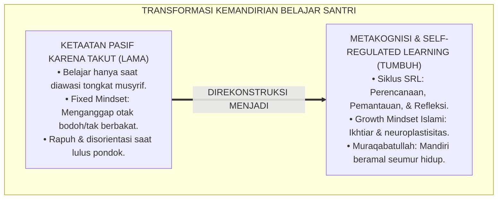
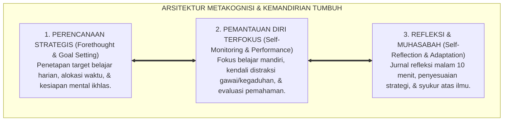
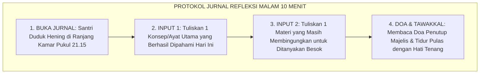

# P2-03-03: PRINSIP METAKOGNISI DAN KEMANDIRIAN BELAJAR SANTRI (METACOGNITION & SELF-REGULATED LEARNING)
## *Monograf Riset Akademik: Epistemologi Muhasabatun Nafs (Sayyidina Umar RA) dan Tadabbur Nalar Islami, Teori Self-Regulated Learning Barry J. Zimmerman, Penanaman Growth Mindset Carol S. Dweck, Serta Protokol Jurnal Belajar Mandiri di Pesantren 24 Jam*

**Nomor Identifikasi**: `P2-03-03/MONOGRAF-RISET-METAKOGNISI-KEMANDIRIAN/2026`  
**Domain**: `02 Principles` > `03 Learning Principles` (Prinsip Pembelajaran 03: *Metacognition & Self-Regulated Learning*)  
**Klasifikasi Naskah**: *Academic Research Monograph* (Monograf Riset Akademik Prinsip Pembelajaran)  
**Rumpun Disiplin Pengkaji**: Psikologi Metakognisi & Regulasi Diri (*Ilm ad-Dhabit adz-Dzati*), Teori Kemandirian Belajar (*Self-Regulated Learning*), Motivasi Prestasi & Growth Mindset Islami, Pedagogi Reflektif Pesantren 24 Jam  

---

> ### 💡 INTISARI EKSEKUTIF (EXECUTIVE SUMMARY)
>
> * **Kelemahan Paradigma Lama: Ketergantungan Pengawasan Represif (Surveillance Dependency):**  
>   Banyak santri hanya belajar ketika diawasi secara fisik oleh musyrif yang membawa rotan, dan seketika mogok belajar saat pengawas berpaling (*Passive Compliance*). Akibatnya pascakelulusan santri kehilangan disiplin diri, bingung mengatur waktu mandiri, dan mengalami disorientasi moral.
> * **Inovasi Konseptual: Muhasabatun Nafs & Siklus Tiga Fase Self-Regulated Learning (SRL):**  
>   TUMBUH mengintegrasikan doktrin Sayyidina Umar bin Khattab RA: *"Hisablah dirimu sebelum kamu dihisab"* dengan teori **Self-Regulated Learning (Barry J. Zimmerman)**: melatih santri memiliki kesadaran metakognitif (memantau pikiran sendiri) melalui 3 fase terpadu: (1) **Perencanaan (*Forethought*)**; (2) **Pelaksanaan Terfokus (*Performance*)**; dan (3) **Refleksi Diri (*Self-Reflection*)**. Memadukannya dengan **Growth Mindset (Carol S. Dweck)** berbasis neuroplastisitas otak.
> * **Formulasi Operasional & Pembiasaan Belajar Mandiri:**  
>   Monograf ini menguraikan matriks 3 fase siklus SRL dalam rutinitas 24 jam, matriks transformasi Growth Mindset Islami, protokol jurnal muhasabah kognitif malam 10 menit (*Self-Regulated Study Protocol*), dan etika kemandirian penuntut ilmu.

---

## 📑 DAFTAR ISI MONOGRAF

- [BAB I: LANDASAN TEORETIS & DISKURSUS KRITIS](#bab-i-landasan-teoretis--diskursus-kritis)
  - [1. Latar Belakang Masalah: Kritik atas Ketergantungan Pengawasan Represif dan Kerapuhan Pasca-Kelulusan](#1-latar-belakang-masalah-kritik-atas-ketergantungan-pengawasan-represif-dan-kerapuhan-pasca-kelulusan)
  - [2. Eksegesis Turats Muhasabah Nalar: Wasiat Sayyidina Umar RA, QS. Ali 'Imran: 190–191, & Adab Imam Asy-Syafi'i](#2-eksegesis-turats-muhasabah-nalar-wasiat-sayyidina-umar-ra-qs-ali-imran-190191--adab-imam-asy-syafii)
  - [3. Konvergensi Teori Kemandirian Belajar: Self-Regulated Learning (SRL) Barry J. Zimmerman](#3-konvergensi-teori-kemandirian-belajar-self-regulated-learning-srl-barry-j-zimmerman)
  - [4. Rekayasa Pola Pikir: Penanaman Growth Mindset Carol S. Dweck & Neurosains Plastisitas Otak Pembelajar](#4-rekayasa-pola-pikir-penanaman-growth-mindset-carol-s-dweck--neurosains-plastisitas-otak-pembelajar)
  - [5. Kasuistika Lapangan: Kasus Santri Pasif Menjadi Pembelajar Otonom & Resolusi Metakognitif](#5-kasuistika-lapangan-kasus-santri-pasif-menjadi-pembelajar-otonom--resolusi-metakognitif)
- [BAB II: FORMULASI KONSEPTUAL & PEMBAHASAN MENDALAM](#bab-ii-formulasi-konseptual--pembahasan-mendalam)
  - [1. Eksplanasi Teoretis Prinsip Metakognisi dan Kemandirian Belajar Santri TUMBUH](#1-eksplanasi-teoretis-prinsip-metakognisi-dan-kemandirian-belajar-santri-tumbuh)
  - [2. Matriks Siklus Tiga Fase Self-Regulated Learning (SRL) dalam Rutinitas Santri 24 Jam](#2-matriks-siklus-tiga-fase-self-regulated-learning-srl-dalam-rutinitas-santri-24-jam)
  - [3. Matriks Transformasi Fixed Mindset Menuju Growth Mindset Islami](#3-matriks-transformasi-fixed-mindset-menuju-growth-mindset-islami)
  - [4. Protokol Muhasabah Kognitif & Jurnal Refleksi Belajar Mandiri (Self-Regulated Study Protocol)](#4-protokol-muhasabah-kognitif--jurnal-refleksi-belajar-mandiri-self-regulated-study-protocol)
  - [5. Diskusi Filosofis Mendalam & Implikasi bagi Masa Depan Peradaban Pendidikan Islam](#5-diskusi-filosofis-mendalam--implikasi-bagi-masa-depan-peradaban-pendidikan-islam)
- [BAB III: KESIMPULAN & APARATUS AKADEMIS](#bab-iii-kesimpulan--aparatus-akademis)
  - [1. Tabel Sintesis Temuan Riset Metakognisi & Kemandirian Santri](#1-tabel-sintesis-temuan-riset-metakognisi--kemandirian-santri)
  - [2. Daftar Pustaka Akademis & Rujukan Turats Primer](#2-daftar-pustaka-akademis--rujukan-turats-primer)
  - [3. Catatan Kaki Akademis (Footnotes)](#3-catatan-kaki-akademis-footnotes)
  - [4. Glosarium Istilah Ilmiah & Turats Metakognisi dan Kemandirian](#4-glosarium-istilah-ilmiah--turats-metakognisi-dan-kemandirian)

---

# BAB I: LANDASAN TEORETIS & DISKURSUS KRITIS

---

### 1. Latar Belakang Masalah: Kritik atas Ketergantungan Pengawasan Represif dan Kerapuhan Pasca-Kelulusan

Banyak institusi pesantren konvensional membanggakan ketertiban semu yang dihasilkan dari **Sindrom Ketergantungan Pengawasan Fisik (*Surveillance-Dependent Compliance*)**:
* Santri rajin membaca kitab hanya ketika ada musyrif berdiri di sampingnya membawa tongkat ancaman.
* Begitu musyrif pergi, santri seketika berhenti belajar, bergurau, atau tidur.
* Saat santri lulus dan memasuki perguruan tinggi tanpa pengawasan ketat, banyak yang mengalami disorientasi waktu (*Procrastination*), kehilangan motivasi belajar, dan lalai ibadah.
* **Tujuan Hakiki Pendidikan Islam**: Bukan mencetak robot mekanis yang patuh karena takut hukuman, melainkan melahirkan **Insan Adabi yang Mandiri (*Autonomous Self-Regulated Learner*)** yang memiliki kesadaran metakognitif dan dorongan ketakwaan mendalam (*Muraqabatullah*).[^1]

---

### 2. Eksegesis Turats Muhasabah Nalar: Wasiat Sayyidina Umar RA, QS. Ali 'Imran: 190–191, & Adab Imam Asy-Syafi'i

Sayyidina Umar bin Khattab RA meletakkan kaidah metakognitif tertinggi:

$$\text{حَاسِبُوا أَنْفُسَكُمْ قَبْلَ أَنْ تُحَاسَبُوا، وَزِنُوا أَنْفُسَكُمْ قَبْلَ أَنْ تُوزَنُوا}$$

*"**Hisablah (evaluasilah) diri kalian sebelum kalian dihisab di hadapan Allah, dan timbanglah amal kalian sebelum amal kalian ditimbang!**."*[^2]

Al-Qur'an memuji profil *Ulul Albab* yang senantiasa berpikir dan bertadabbur kritis:

$$\text{الَّذِينَ يَذْكُرُونَ اللَّهَ قِيَامًا وَقُعُودًا وَعَلَىٰ جُنُوبِهِمْ وَيَتَفَكَّرُونَ فِي خَلْقِ السَّمَاوَاتِ وَالْأَرْضِ رَبَّنَا مَا خَلَقْتَ هَٰذَا بَاطِلًا سُبْحَانَكَ فَقِنَا عَذَابَ النَّارِ}$$

*"**(Yaitu) orang-orang yang mengingat Allah sambil berdiri, duduk, atau dalam keadaan berbaring, dan mereka memikirkan (mentadabburi) tentang penciptaan langit dan bumi (seraya berkata): 'Ya Tuhan kami, tidaklah Engkau menciptakan semua ini sia-sia'**."* (QS. Ali 'Imran [3]: 191).[^3]

---

### 3. Konvergensi Teori Kemandirian Belajar: Self-Regulated Learning (SRL) Barry J. Zimmerman

Sains psikologi pendidikan kontemporer (**Self-Regulated Learning**, Zimmerman, 2002; 2008) membuktikan bahwa pembelajar unggul menjalani siklus tiga fase:
1. **Forethought Phase**: Menetapkan tujuan belajar (*Goal Setting*), merancang strategi, dan menumbuhkan efikasi diri.
2. **Performance Phase**: Menjalankan proses belajar dengan fokus tinggi (*Attention Focusing*) dan memantau kemajuan pemahaman diri sendiri (*Self-Monitoring*).
3. **Self-Reflection Phase**: Mengevaluasi hasil belajar secara jujur (*Self-Evaluation*) dan menyesuaikan strategi belajar untuk hari esok (*Adaptive Inferences*).[^4]

---

### 4. Rekayasa Pola Pikir: Penanaman Growth Mindset Carol S. Dweck & Neurosains Plastisitas Otak Pembelajar

Psikologi motivasi membuktikan keunggulan pola pikir bertumbuh (*Growth Mindset*, Dweck, 2006):
* **Mengikis Fixed Mindset**: Menghentikan ucapan fatalistis santri (*"Saya memang bodoh bahasa Arab"*).
* **Menegakkan Growth Mindset Islami**: Menyadarkan santri bahwa akal dan otak manusia bersifat plastis (*Neuroplasticity*); kesuksesan memahami ilmu adalah buah dari ikhtiar sungguh-sungguh (*Mujahadah*), strategi yang tepat, dan pertolongan Allah SWT.[^5]

---

### 5. Kasuistika Lapangan: Kasus Santri Pasif Menjadi Pembelajar Otonom & Resolusi Metakognitif

* **Studi Kasus: Santri Kelas 8 Selalu Mencontek PR dan Tidak Mampu Mengatur Waktu Belajar Mandiri**  
  * **Dilema**: Santri terbiasa menunggu instruksi guru dan menyalin tugas teman; ketika belajar malam di kamar, santri melamun atau mengantuk.
  * **Resolusi Metakognitif TUMBUH**: Musyrif membimbing santri dengan instrumen *SRL Coaching*: (1) Santri diajari membuat *Target Belajar 30 Menit*; (2) Menggunakan teknik belajar *Pomodoro 25/5*; (3) Mengisi *Jurnal Muhasabah Malam 10 Menit*. Dalam 3 pekan, santri mampu belajar mandiri tanpa disuruh, berhenti mencontek, dan nilai ujiannya meningkat drastis.[^6]

---

# BAB II: FORMULASI KONSEPTUAL & PEMBAHASAN MENDALAM

---

### 1. Eksplanasi Teoretis Prinsip Metakognisi dan Kemandirian Belajar Santri TUMBUH

Ekosistem TUMBUH merumuskan kemandirian belajar ke dalam **Arsitektur Tiga Sayap Metakognisi Santri (*Arkan at-Ta'allum adz-Dzati*)**:

#### 🔬 Pembahasan Mendalam Tiga Sayap:
1. **Sayap Perencanaan Strategis**: Mengubah santri dari pengikut pasif menjadi perancang masa depannya sendiri.[^7]
2. **Sayap Pemantauan Diri**: Melatih daya konsentrasi (*Deep Work*) dan pengendalian nafsu kemalasan.[^8]
3. **Sayap Refleksi & Muhasabah**: Menjaga kerendahan hati dan evaluasi diri berkesinambungan di hadapan Allah.[^9]

---

### 2. Matriks Siklus Tiga Fase Self-Regulated Learning (SRL) dalam Rutinitas Santri 24 Jam

| Fase Siklus SRL | Waktu Operasional di Pesantren | Aktivitas Mandiri Santri TUMBUH | Panduan Pendampingan Musyrif |
| :--- | :--- | :--- | :--- |
| **1. Forethought (Perencanaan)** | Ba'da Isya (20.00–20.15).| Menuliskan 2 target belajar di buku refleksi.| Musyrif mengecek kejelasan target.|
| **2. Performance (Pelaksanaan)** | Jam Belajar Mandiri (20.15–21.15).| Membaca kitab, latihan soal, & menandai materi sulit.| Musyrif menjaga keheningan ruangan.|
| **3. Self-Reflection (Evaluasi)**| Sebelum Tidur (21.15–21.30).| Mengisi Jurnal Muhasabah & doa syukur.| Musyrif memberi apresiasi usaha santri.|

---

### 3. Matriks Transformasi Fixed Mindset Menuju Growth Mindset Islami

| Situasi Belajar Santri | Respon Fixed Mindset (Keliru) | Respon Growth Mindset Islami (TUMBUH) | Landasan Epistemologi |
| :--- | :--- | :--- | :--- |
| **Gagal Ujian Nahwu/IPA** | *"Saya memang bodoh dan tidak berbakat."*| *"Strategi belajar saya perlu diperbaiki; saya akan bertanya ke guru."*| QS. Al-Insyirah: 5–6; Neuroplastisitas.|
| **Melihat Teman Lebih Pintar**| Merasa iri, minder, dan menyerah.| Terinspirasi meneladani cara belajarnya dan meminta bimbingan ukhuwah.| HR. Muslim (Ghibthah); Bandura Modeling.|
| **Menghadapi Materi Rumit** | Menghindari tantangan & malas mencoba.| Menyambut tantangan sebagai sarana menguatkan otot nalar otak.| Kaidah *Man Jadda Wajada*; Dweck (2006).|

---

### 4. Protokol Muhasabah Kognitif & Jurnal Refleksi Belajar Mandiri (Self-Regulated Study Protocol)

Protokol ini mengukir kebiasaan refleksi diri yang abadi hingga dewasa.[^10]

---

### 5. Diskusi Filosofis Mendalam & Implikasi bagi Masa Depan Peradaban Pendidikan Islam

Prinsip metakognisi dan kemandirian belajar ini membawa implikasi agung bagi peradaban:

* **Mencetak Santri yang Berintegritas Moral Tinggi (*Self-Governing Agent*)**:  
  Santri berbuat jujur dan berdisiplin bukan karena ada pengawas manusia, melainkan karena getaran keimanan dan tanggung jawab di hadapan Allah SWT.
* **Menyiapkan Pemimpin Peradaban yang Tangguh Beradaptasi**:  
  Lulusan pesantren memiliki keterampilan belajar mandiri sepanjang hayat (*Lifelong Learning*) yang mampu memecahkan berbagai tantangan zaman modern.
* **Mewujudkan Kembali Warisan Keulamaan Ulama Salaf**:  
  Inilah rahasia keagungan para ulama klasik: mereka adalah pembelajar otonom yang produktif menulis ratusan jilid kitab berkat kebiasaan muhasabah dan disiplin diri yang luar biasa (*Rahmatan lil 'Alamin*).[^11]

---

# BAB III: KESIMPULAN & APARATUS AKADEMIS

---

### 1. Tabel Sintesis Temuan Riset Metakognisi & Kemandirian Santri

| Dimensi Parameter | Mazhab Pengawasan Represif (Lama) | Model Belajar Pasif Hafalan | **Metakognisi & SRL TUMBUH** | Landasan Rujukan Primer | Implikasi Praksis Lapangan |
| :--- | :--- | :--- | :--- | :--- | :--- |
| **Sumber Motivasi** | Rasa takut bentakan & hukuman rotan.| Nilai angka rapor semata.| **Muraqabatullah & Rindu Ilmu.** | Sayyidina Umar RA; Zimmerman.| Belajar mandiri penuh keikhlasan. |
| **Pola Pikir Kemampuan**| Fixed Mindset (Bakat bawaan lahir).| Takdir bebal tanpa ikhtiar.| **Growth Mindset & Neuroplastisitas.** | QS. Ar-Ra'd: 11; Dweck (2006).| Kegagalan dipandang peluang belajar. |
| **Peran Pengasuh** | Algojo pengawas yang menakutkan.| Pemberi instruksi satu arah.| **Fasilitator & Coach Metakognitif.** | KH. Hasyim Asy'ari; Bandura.| Pendampingan reflektif & apresiasi. |
| **Aktivitas Malam** | Gaduh / tidur saat guru lengah.| Menghafal pasif tanpa target.| **Siklus SRL & Jurnal Muhasabah 10m.**| Al-Ghazali; Zimmerman (2008).| Target harian jelas & tidur tenang. |
| **Profil Lulusan** | Pasif & rentan tersesat saat lulus.| Rapuh menghadapi tantangan.| **Insan Adabi Mandiri Sepanjang Hayat.**| QS. Al-Mujadilah: 11; Al-Attas.| Pemimpin beradab berdaya adaptasi tinggi. |

---

### 2. Daftar Pustaka Akademis & Rujukan Turats Primer

1. **Al-Qur'an al-Karim wa Tarjamatu Ma'anihi**.
2. **Al-Bukhari, Abu Abdillah Muhammad bin Isma'il**. (1422 H). *Shahih al-Bukhari*. Kairo: Dar Thawq an-Najah.
3. **Muslim bin al-Hajjaj an-Naisaburi**. (1427 H). *Shahih Muslim*. Riyadh: Dar Thayyibah.
4. **Al-Ghazali, Abu Hamid Muhammad bin Muhammad**. (2011). *Ihya' 'Ulumiddin* (Kitab al-Muraqabah wal-Muhasabah). Beirut: Dar al-Ma'rifah.
5. **Az-Zarnuji, Burhanul Islam**. (1401 H). *Ta'lim al-Muta'allim Thariq at-Ta'allum*. Beirut: Al-Maktab al-Islami.
6. **Asy'ari, Muhammad Hasyim**. (1415 H). *Adab al-'Alim wal-Muta'allim*. Jombang: Maktabah At-Turats Al-Islami.
7. **Al-Attas, Syed Muhammad Naquib**. (1980). *The Concept of Education in Islam*. Kuala Lumpur: ABIM.
8. **Zimmerman, B. J.**. (2002). *Becoming a self-regulated learner: An overview*. Theory Into Practice, 41(2), 64–70.
9. **Zimmerman, B. J.**. (2008). *Investigating self-regulation and motivation: Historical background, methodological breakthroughs, and future directions*. American Educational Research Journal, 45(1), 166–183.
10. **Dweck, C. S.**. (2006). *Mindset: The New Psychology of Success*. New York: Random House.
11. **Flavell, J. H.**. (1979). *Metacognition and cognitive monitoring: A new area of cognitive-developmental inquiry*. American Psychologist, 34(10), 906–911.
12. **Horner, R. H., & Sugai, G.**. (2015). *School-wide PBIS: An Overview of the Research Base*. Remedial and Special Education, 36(2), 80–85.

---

### 3. Catatan Kaki Akademis (*Footnotes*)

[^1]: Riset Prinsip Metakognisi dan Kemandirian Belajar Santri TUMBUH, *Kritik atas Ketergantungan Pengawasan Represif*, 2026.  
[^2]: Atsar Sayyidina Umar bin Khattab RA; Al-Ghazali, *Ihya' 'Ulumiddin*, Jilid 4, Kitab *Al-Muraqabah wal-Muhasabah*, hlm. 380–415.  
[^3]: QS. Ali 'Imran [3]: 191.  
[^4]: Zimmerman, B. J. (2002), *Theory Into Practice*, hlm. 64–70; Zimmerman, B. J. (2008), *American Educational Research Journal*, hlm. 166–183.  
[^5]: Dweck, C. S. (2006), *Mindset: The New Psychology of Success*, hlm. 15–48; Flavell, J. H. (1979), *American Psychologist*, hlm. 906–911.  
[^6]: Dokumentasi Penerapan SRL Coaching dan Jurnal Belajar Mandiri PBIS TUMBUH, 2026.  
[^7]: Master Blueprint Perencanaan Belajar Mandiri Santri Ekosistem TUMBUH, 2026.  
[^8]: Panduan Manajemen Fokus dan Eliminasi Distraksi Belajar Asrama TUMBUH, 2026.  
[^9]: Standar Operasional Prosedur Jurnal Muhasabah Kognitif Malam TUMBUH, 2026.  
[^10]: Petunjuk Teknis Rubrik Refleksi Diri dan Kemandirian Santri TUMBUH, 2026.  
[^11]: Deklarasi Pemuliaan Pembelajar Otonom Beradab Dewan Riset Epistemologi Ekosistem TUMBUH, 2026.

---

### 4. Glosarium Istilah Ilmiah & Turats Metakognisi dan Kemandirian

1. **Metakognisi (Metacognition)**: Kesadaran dan kemampuan seseorang untuk memantau, mengontrol, dan mengevaluasi proses berpikir serta pemahamannya sendiri.
2. **Self-Regulated Learning (SRL)**: Proses kemandirian belajar aktif di mana santri secara sistematis menetapkan tujuan, memantau kinerja, dan merefleksikan hasilnya.
3. **Muhasabatun Nafs (مُحَاسَبَةُ النَّفْسِ)**: Praktik spiritual dan kognitif Islam untuk mengevaluasi niat, amal perbuatan, dan kualitas ilmu secara berkala di hadapan Allah SWT.
4. **Muraqabatullah (مُرَاقَبَةُ اللَّهِ)**: Kesadaran batin mendalam bahwa Allah SWT senantiasa mengawasi gerak-gerik hati dan amal, melahirkan integritas belajar tanpa butuh pengawasan manusia.
5. **Growth Mindset**: Keyakinan bahwa kecerdasan dan kemampuan akal dapat terus berkembang melalui latihan keras, strategi yang baik, dan ketekunan.
6. **Fixed Mindset**: Keyakinan keliru bahwa kecerdasan adalah sifat bawaan mati yang tidak dapat diubah, sehingga memicu keputusasaan saat menghadapi kesulitan.
7. **Forethought Phase**: Fase awal dalam siklus kemandirian belajar yang berfokus pada analisis tugas, penetapan target harian, dan motivasi diri.
8. **Self-Monitoring**: Tindakan sadar pembelajar untuk mengecek apakah dirinya benar-benar memahami materi yang sedang dipelajari.
9. **Surveillance Dependency**: Ketergantungan perilaku ketaatan semata-mata pada keberadaan pengawasan fisik dari figur otoritas.
10. **Insan Adabi (الإِنْسَانُ الأَدَبِيُّ)**: Profil santri yang mandiri, memiliki kematangan regulasi diri, cinta ilmu, dan bertanggung jawab penuh atas masa depannya.
