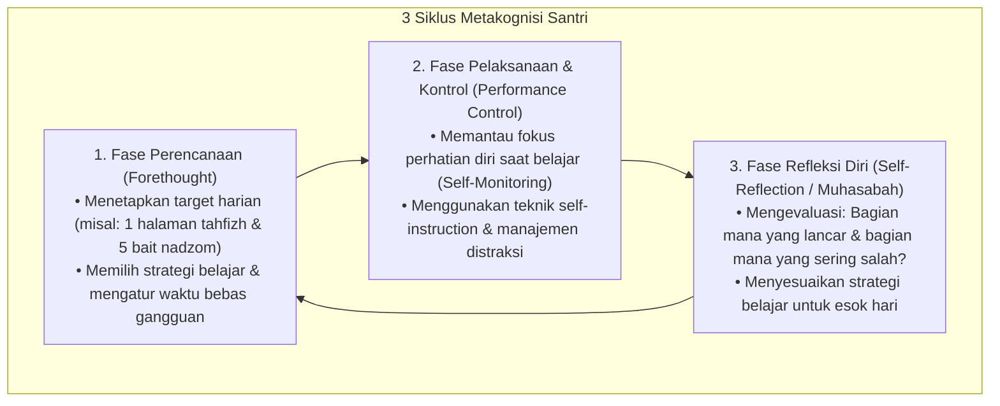

# P2-03-03-Prinsip-Metakognisi-dan-Kemandirian-Santri

## Tujuan
Menetapkan prinsip kemandirian belajar santri melalui penguasaan **Metakognisi** (kesadaran dan kontrol atas proses berpikir sendiri) dan model **Self-Regulated Learning (Barry Zimmerman, 2002)** yang diintegrasikan dengan tradisi *Muhasabah Kognitif*.

---

## 1. 3 Siklus Pembelajar Mandiri (*Self-Regulated Learner*)

---

## 2. Kaidah Penerapan di Pesantren

1. **Jurnal Belajar Mandiri (*Learning Log / Agenda Santri*)**:
   - Santri dilatih memiliki buku catatan harian kecil untuk menulis target belajar dan mencentang ketercapaian secara mandiri setiap malam sebelum tidur.
2. **Muhasabah Kesalahan (*Error Analysis*)**:
   - Santri diajarkan untuk tidak merasa rendah diri saat salah hafalan/soal, melainkan menganalisis: *"Mengapa saya salah di ayat ini? Apakah karena mirip dengan surat lain (*Mutasyabihat*)?"*
3. **Peralihan dari Bergantung ke Mandiri (*Gradual Release of Responsibility*)**:
   - Musyrif bertahap mengurangi kontrol pengawasan langsung seiring naiknya tangga santri dari T1 (butuh instruksi) menuju T3 & T4 (inisiatif mandiri).

---

## 3. Status Dokumen
* **Status**: 🌟 **A+ (Tervalidasi & Siap Diimplementasikan)**
* **Level**: Project 2 - `02 Principles / 03 Learning Principles`
* **Langkah Berikutnya**: **`P2-03-04-Prinsip-Didaktik-Interaktif-dan-Asesmen-Formatif.md`**.
