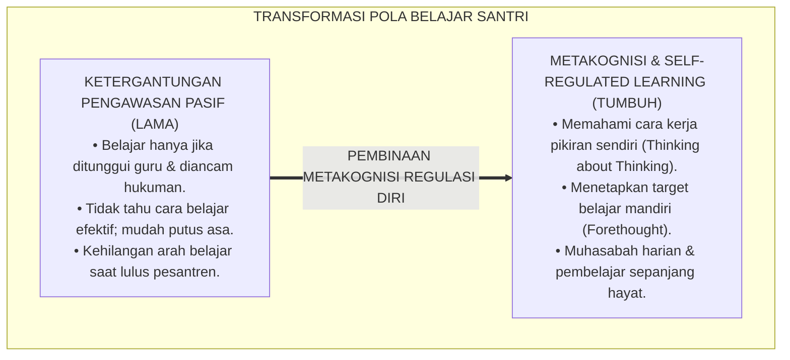
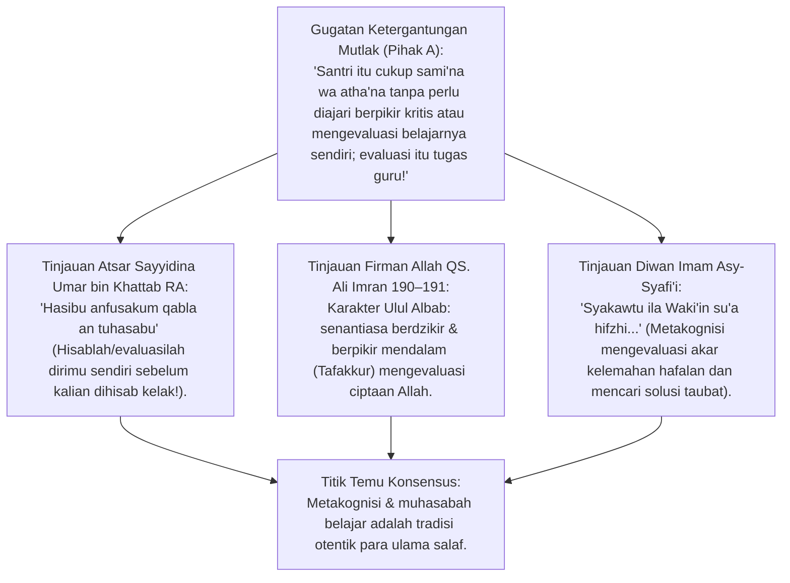
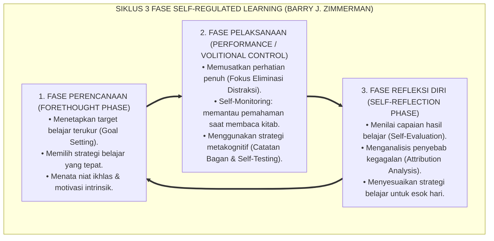
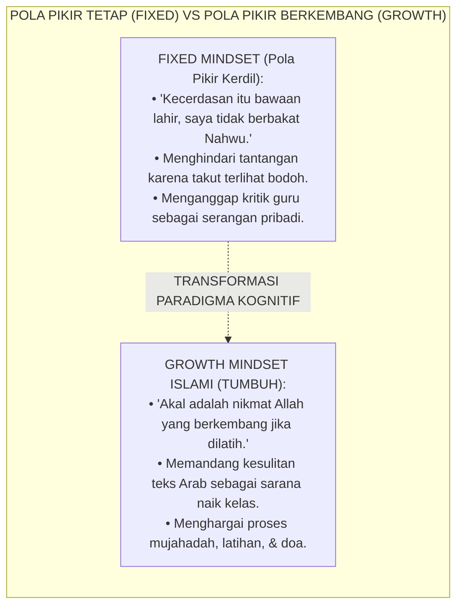
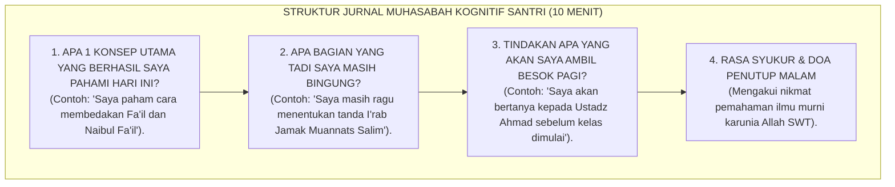
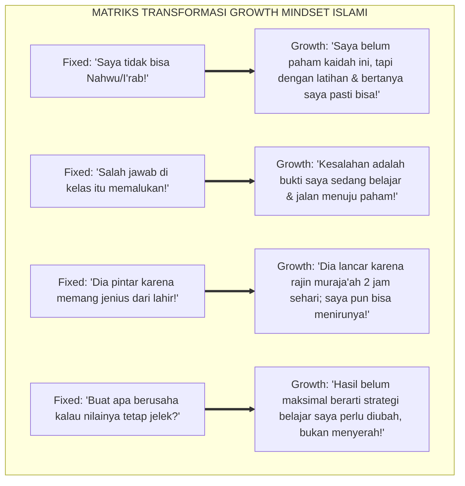
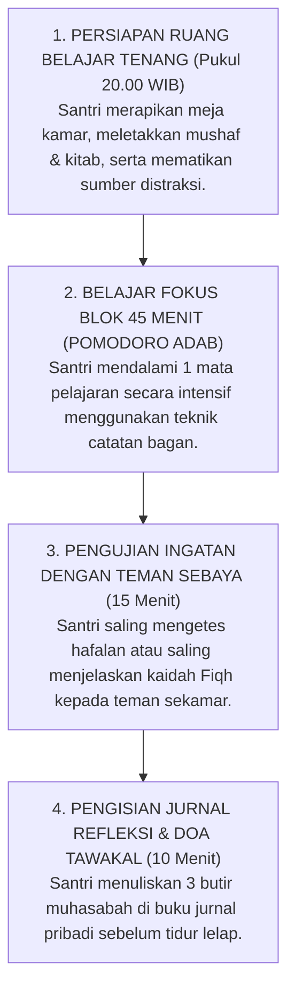

# P2-03-03: PRINSIP METAKOGNISI DAN KEMANDIRIAN BELAJAR SANTRI
## *Monograf Terpadu: Epistemologi Muhasabatun Nafs (Sayyidina Umar bin Khattab RA) dan Tadabbur Nalar Islami, Konvergensi Teori Self-Regulated Learning (SRL Barry J. Zimmerman), Penanaman Growth Mindset (Carol S. Dweck), serta Protokol Muhasabah Kognitif dan Jurnal Belajar Mandiri Santri 24 Jam*

**Nomor Identifikasi**: `P2-03-03/MONOGRAF-TERPADU-METAKOGNISI-KEMANDIRIAN/2026`  
**Domain**: `02 Principles` > `03 Learning Principles`  
**Klasifikasi Naskah**: *Comprehensive Integrated Monograph* (Monograf Akademis & Rumusan Baku Terpadu)  
**Rumpun Disiplin Pengkaji**: Psikologi Metakognisi & Regulasi Diri (*Ilm ad-Dhabit adz-Dzati*), Teori Kemandirian Belajar (*Self-Regulated Learning*), Motivasi Prestasi & Growth Mindset Islami, Pedagogi Reflektif Pesantren 24 Jam  

---

> ### 💡 INTISARI PRAKTIS (3 MENIT PAHAM UNTUK ASATIDZ & MUSYRIF)
>
> * **Kemandirian Belajar Adalah Puncak Kematangan Santri (*Thalibul 'Ilmi Mandiri*):**  
>   Banyak santri hanya belajar jika diawasi musyrif dengan rotan, dan langsung bermain santai saat guru tidak ada (*Ketergantungan Eksternal Pasif*). Santri TUMBUH dididik memiliki **Metakognisi (Kesadaran Memantau Pikiran Sendiri)** dan **Regulasi Diri (Self-Regulation)**: belajar karena dorongan rindu ilmu dan tanggung jawab di hadapan Allah SWT.
> * **Siklus 3 Tahap Belajar Mandiri (Self-Regulated Learning - Zimmerman):**  
>   1. **Tahap Perencanaan (*Forethought*):** Santri menetapkan target belajar harian sebelum mulai (misal: "Malam ini saya menuntaskan 2 halaman Nahwu").  
>   2. **Tahap Pelaksanaan (*Performance*):** Santri fokus belajar tanpa terdistraksi dan memantau pemahamannya sendiri.  
>   3. **Tahap Refleksi (*Self-Reflection*):** Santri mengevaluasi: *"Bagian mana yang tadi saya belum paham? Besok pagi saya harus bertanya ke ustadz!"*.
> * **Menghapus Mentalitas Pasrah (*Ubah Fixed Mindset Menjadi Growth Mindset*):**  
>   Jangan biarkan santri berkata: *"Saya memang tidak berbakat bahasa Arab, otak saya bodoh"*. Guru melatih santri memahami bahwa **Otak Manusia Berkembang Seperti Otot (*Neuroplastisitas*)**: semakin dilatih menalar dan berdoa, semakin tajam akal memahami kitab kuning.
> * **Jurnal Muhasabah Belajar Mandiri (10 Menit Sebelum Tidur):**  
>   Setiap malam santri mengisi jurnal refleksi ringkas: mencatat 1 hal baru yang dipahami hari ini, 1 hal yang perlu diperbaiki, dan rasa syukur atas nikmat ilmu.

---

## 📑 DAFTAR ISI MONOGRAF

- [BAGIAN I: RISET METAKOGNISI & KEMANDIRIAN BELAJAR, DIALEKTIKA INKUIRI, & KASUISTIKA LAPANGAN](#bagian-i-riset-metakognisi--kemandirian-belajar-dialektika-inkuiri--kasuistika-lapangan)
  - [1. Kerangka Metodologi Kemandirian Santri: Dari Pembelajar Pasif Menuju Pembelajar Otonom Beradab](#1-kerangka-metodologi-kemandirian-santri-dari-pembelajar-pasif-menuju-pembelajar-otonom-beradab)
  - [2. Inkuiri 1: Eksegesis Turats Muhasabah Nalar — Sayyidina Umar RA, QS. Ali Imran: 190–191, & Wasiat Imam Asy-Syafi'i](#2-inkuiri-1-eksegesis-turats-muhasabah-nalar--sayyidina-umar-ra-qs-ali-imran-190191--wasiat-imam-asy-syafii)
  - [3. Inkuiri 2: Konvergensi Self-Regulated Learning (SRL) Barry J. Zimmerman (Forethought, Performance, Reflection)](#3-inkuiri-2-konvergensi-self-regulated-learning-srl-barry-j-zimmerman-forethought-performance-reflection)
  - [4. Inkuiri 3: Penanaman Growth Mindset Carol Dweck vs Fixed Mindset dalam Pembelajaran Bahasa Arab & Kitab](#4-inkuiri-3-penanaman-growth-mindset-carol-dweck-vs-fixed-mindset-dalam-pembelajaran-bahasa-arab--kitab)
  - [5. Inkuiri 4: Strategi Metakognitif Harian Santri: Self-Monitoring Checklist & Jurnal Refleksi Malam](#5-inkuiri-4-strategi-metakognitif-harian-santri-self-monitoring-checklist--jurnal-refleksi-malam)
  - [6. Inkuiri 5: Silogisme Logika, Dialektika 3 Ronde, Kasuistika Kemandirian Santri, & Titik Temu Konsensus](#6-inkuiri-5-silogisme-logika-dialektika-3-ronde-kasuistika-kemandirian-santri--titik-temu-konsensus)
- [BAGIAN II: TEMUAN RISET, FORMULASI KONSEPTUAL & PEMBAHASAN](#bagian-ii-temuan-riset-formulasi-konseptual--pembahasan)
  - [1. Formulasi Konseptual: Prinsip Metakognisi dan Kemandirian Belajar Santri TUMBUH](#1-formulasi-konseptual-prinsip-metakognisi-dan-kemandirian-belajar-santri-tumbuh)
  - [2. Matriks Siklus 3 Fase Self-Regulated Learning (SRL) dalam Rutinitas Santri 24 Jam](#2-matriks-siklus-3-fase-self-regulated-learning-srl-dalam-rutinitas-santri-24-jam)
  - [3. Matriks Transformasi Fixed Mindset Menuju Growth Mindset Islami](#3-matriks-transformasi-fixed-mindset-menuju-growth-mindset-islami)
  - [4. Protokol Muhasabah Kognitif & Jurnal Refleksi Belajar Mandiri (Self-Regulated Study Protocol)](#4-protokol-muhasabah-kognitif--jurnal-refleksi-belajar-mandiri-self-regulated-study-protocol)
- [BAGIAN III: APARATUS AKADEMIS & APENDIKS](#bagian-iii-aparatus-akademis--apendiks)
  - [1. Tabel Sintesis Hasil Riset Metakognisi & Kemandirian Santri](#1-tabel-sintesis-hasil-riset-metakognisi--kemandirian-santri)
  - [2. Daftar Pustaka Akademis & Rujukan Turats Primer](#2-daftar-pustaka-akademis--rujukan-turats-primer)
  - [3. Catatan Kaki Akademis (Footnotes)](#3-catatan-kaki-akademis-footnotes)
  - [4. Glosarium dan Penjelasan Istilah Teknis Metakognisi, SRL, & Growth Mindset](#4-glosarium-dan-penjelasan-istilah-teknis-metakognisi-srl--growth-mindset)

---

# BAGIAN I: RISET METAKOGNISI & KEMANDIRIAN BELAJAR, DIALEKTIKA INKUIRI, & KASUISTIKA LAPANGAN

---

### 1. Kerangka Metodologi Kemandirian Santri: Dari Pembelajar Pasif Menuju Pembelajar Otonom Beradab

Kelemahan paling kronis dari sistem pengasuhan pesantren konvensional yang mengandalkan pengawasan represif adalah lahirnya **Sindrom Ketergantungan Ketaatan Semu (*Passive Surveillance-Dependent Syndrome*)**:
* Santri rajin membaca kitab hanya ketika musyrif berdiri di sampingnya membawa tongkat.
* Begitu musyrif bergeser ke ruangan lain, santri langsung berhenti belajar, tidur, atau bersenda gurau.
* Saat santri lulus dari pesantren dan masuk ke perguruan tinggi tanpa pengawasan ketat, banyak yang kehilangan arah, lalai shalat, dan tidak mampu mengatur waktu belajarnya sendiri.

Pendidikan Islam sejati bukanlah melatih robot yang taat karena takut hukuman, melainkan melahirkan **Insan Adabi yang Mandiri (*Autonomous Self-Regulated Learner*)** yang memiliki kesadaran metakognitif (*Metacognitive Awareness*): mampu merencanakan, memantau, dan mengevaluasi proses belajarnya sendiri karena merasa diawasi oleh Allah SWT (*Muraqabatullah*).

---

### 2. Inkuiri 1: Eksegesis Turats Muhasabah Nalar — Sayyidina Umar RA, QS. Ali Imran: 190–191, & Wasiat Imam Asy-Syafi'i

#### 📐 Formalisasi Logika Silogisme (*Qiyas Mantiqi 1*)
* **Premis Mayor (*al-Muqaddimah al-Kubra*)**: Setiap proses pencarian ilmu (*Thalabul 'Ilmi*) yang mengantarkan santri pada kematangan adab niscaya menuntut kemampuan santri untuk melakukan evaluasi diri (*Muhasabah*), pemantauan nalar (*Tafakkur*), dan regulasi kehendak secara mandiri.
* **Premis Minor (*al-Muqaddimah ash-Shughra*)**: Sayyidina Umar bin Khattab RA dan para ulama salaf menetapkan bahwa hisab diri (*Self-Assessment / Metacognition*) adalah syarat utama keselamatan amal dan kesuksesan ilmu.
* **Konklusi (*an-Natijah*)**: Maka, kurikulum pembelajaran pesantren TUMBUH wajib melatih keterampilan metakognisi dan regulasi belajar mandiri bagi seluruh santri.[^1]

#### 📖 Teks Primer Turats: Wasiat Sayyidina Umar RA & Imam Asy-Syafi'i
Amirul Mukminin Umar bin Khattab *radhiyallahu 'anhu* berwasiat:

$$\text{حَاسِبُوا أَنْفُسَكُمْ قَبْلَ أَنْ تُحَاسَبُوا، وَزِنُوا أَنْفُسَكُمْ قَبْلَ أَنْ تُوزَنُوا، فَإِنَّهُ أَهْوَنُ عَلَيْكُمْ فِي الْحِسَابِ غَدًا أَنْ تُحَاسِبُوا أَنْفُسَكُمُ الْيَوْمَ}$$

*"**Hisablah (evaluasilah) diri kalian sendiri sebelum kalian dihisab kelak!** Dan timbanglah amal kalian sebelum kalian ditimbang! Karena sesungguhnya hisab kalian di hari esok akan terasa jauh lebih ringan jika kalian senantiasa mengevaluasi diri kalian pada hari ini!"* (Diriwayatkan oleh Imam Ahmad dalam *Az-Zuhd* dan At-Tirmidzi No. 2459).[^2]

Dan Imam Muhammad bin Idris Asy-Syafi'i (w. 204 H) mendemonstrasikan muhasabah metakognitif atas proses belajarnya:
$$\text{شَكَوْتُ إِلَى وَكِيعٍ سُوءَ حِفْظِي ۞ فَأَرْشَدَنِي إِلَى تَرْكِ الْمَعَاصِي}$$
$$\text{وَأَخْبَرَنِي بِأَنَّ الْعِلْمَ نُورٌ ۞ وَنُورُ اللَّهِ لَا يُهْدَى لِعَاصِي}$$
*"Aku mengadukan kepada guruku Waki' tentang buruknya hafalanku ۞ Maka beliau membimbingku untuk meninggalkan maksiat; Dan beliau mengabarkan kepadaku bahwa ilmu itu adalah cahaya ۞ Dan cahaya Allah tidak akan diberikan kepada orang yang bermaksiat."* (Diwan al-Imam asy-Syafi'i, hlm. 88).[^3]

---

### 3. Inkuiri 2: Konvergensi *Self-Regulated Learning (SRL)* Barry J. Zimmerman (*Forethought, Performance, Reflection*)

#### 📐 Formalisasi Logika Silogisme (*Qiyas Mantiqi 2*)
* **Premis Mayor (*al-Muqaddimah al-Kubra*)**: Setiap santri yang menguasai siklus regulasi belajar mandiri (Perencanaan $\rightarrow$ Pengendalian Fokus $\rightarrow$ Evaluasi Diri) niscaya memiliki daya tahan akademik (*Academic Resilience*) yang tinggi dan mampu menguasai disiplin ilmu apapun secara mandiri sepanjang hayat.
* **Premis Minor (*al-Muqaddimah ash-Shughra*)**: Model *Self-Regulated Learning (SRL)* Barry J. Zimmerman membuktikan secara empiris bahwa pembelajar yang memiliki kesadaran metakognisi memiliki prestasi belajar dan kemandirian karakter yang jauh lebih unggul dibandingkan pembelajar pasif.
* **Konklusi (*an-Natijah*)**: Maka, ekosistem TUMBUH wajib membudayakan siklus SRL dalam rutinitas harian santri 24 jam.[^4]

#### 📖 Teks Sains Internasional: Prof. Barry J. Zimmerman (2000, 2002)
Dalam *Contemporary Educational Psychology*, Zimmerman merumuskan:

> *"Self-regulation is not a mental ability or an academic performance skill; rather it is the **self-directive process by which learners transform their mental abilities into academic skills**. Self-regulated learners view learning as an activity that they do for themselves in a proactive way rather than as a covert event that happens to them in reaction to instruction... **The three cyclic phases—Forethought, Performance, and Self-Reflection—enable students to monitor their learning effectiveness and adapt their strategies to achieve mastery**."* (Zimmerman, 2002, *Becoming a Self-Regulated Learner: An Overview*, Theory Into Practice).[^5]

---

### 4. Inkuiri 3: Penanaman *Growth Mindset* Carol Dweck vs *Fixed Mindset* dalam Pembelajaran Bahasa Arab & Kitab

#### 📖 Teks Sains Psikologi: Prof. Carol S. Dweck (2006)
Prof. Carol Dweck (Stanford University) membuktikan:
* Santri dengan *Growth Mindset* memandang kesalahan sebagai **Umpan Balik Berharga untuk Belajar (*Mistakes as Learning Opportunities*)**, bukan vonis kegagalan.
* Neurosains membuktikan konsep **Neuroplastisitas Otak (*Brain Plasticity*)**: ketika santri bersusah payah memahami kaidah sulit, jalur-jalur sinapsis saraf baru di otak tumbuh dan memperkuat jaringan kecerdasan nalar.[^6]

---

### 5. Inkuiri 4: Strategi Metakognitif Harian Santri: *Self-Monitoring Checklist* & Jurnal Refleksi Malam

---

### 6. Inkuiri 5: Silogisme Logika, Dialektika 3 Ronde, Kasuistika Kemandirian Santri, & Titik Temu Konsensus

#### 🥊 Ronde 1: Menolak Prasangka Bahwa "Santri SMP/MTs Masih Terlalu Kecil untuk Melakukan Self-Regulated Learning"
* **Pihak A (Sudut Pandang Infantilisasi Santri)**:  
  *"Anak usia kelas 7 itu masih anak-anak, belum bisa mikir mandiri! Harus dipaksa dan diawasi terus 100%!"*
* **Tinjauan Sudut Pandang Penahapan Scaffolding Metakognitif**:  
  Kemandirian tidak lahir tiba-tiba saat dewasa, melainkan dibiasakan sejak dini melalui **Perancah Bimbingan Bertahap (*Scaffolding*)**. Untuk santri kelas 7 (Jenjang J1), guru menyediakan *Checklist* visual sederhana. Seiring bertambahnya usia ke Jenjang J2 dan T3, santri secara bertahap mengambil alih kendali belajarnya sendiri hingga mandiri total di Jenjang J4.[^7]

#### 🥊 Ronde 2: Sanggahan Balik Apakah Mengakui Kebingungan di Jurnal Belajar Menunjukkan Kelemahan Santri?
* **Pihak A (Sudut Pandang Gengsi Akademik)**:  
  *"Santri harus selalu terlihat pintar di depan teman-temannya; mengakui tidak paham di catatan itu memalukan!"*
* **Tinjauan Sudut Pandang Keberanian Intelektual & Adab Menuntut Ilmu**:  
  Ulama salaf menegaskan: *"Tidak akan belajar orang yang pemalu dan orang yang sombong"* (Atsar Mujahid dalam Shahih Bukhari). Mengakui ketidaktahuan (*I'tiraf bil-Jahl*) adalah **Langkah Pertama Menuju Terbukanya Pintu Ilmu**. Santri yang berani mencatat kebingungannya adalah santri yang paling cepat menjadi pintar.[^8]

#### 🥊 Ronde 3: Sanggahan Pamungkas Mengapa Memuji Usaha Lebih Mendidik Daripada Memuji "Bakat Pintar"?
* **Pihak A (Sudut Pandang Kultus Bakat Bawaan)**:  
  *"Kalau ada santri nilainya 100, puji saja: 'Kamu memang jenius dari lahir!' Biar dia bangga!"*
* **Resolusi Sudut Pandang Process Praise vs Intelligence Praise**:  
  Memuji "kamu jenius" menumbuhkan *Fixed Mindset*: santri menjadi takut mencoba materi sulit karena takut nilainya turun dan dicap tidak jenius lagi. Sebaliknya, **Memuji Usaha (*Process Praise*)**: *"Ustadz bangga melihat ketekunanmu mengulang hafalan ini 5 kali sampai mutqin"* menumbuhkan *Growth Mindset* dan mental pejuang tangguh (*Grit*).[^9]

> #### 📌 Kasuistika Lapangan & Titik Temu Konsensus
> * **Studi Kasus**: Santri R merasa frustrasi dan putus asa di bulan ke-3 karena selalu mendapat nilai buruk dalam pelajaran Nahwu; ia meyakini dirinya "tidak punya otak bahasa" dan berniat kabur dari pondok.
> * **Titik Temu Konsensus (*Kalimatun Sawa'*)**: Musyrif dan Guru mendampingi Santri R dengan *Intervensi Growth Mindset & SRL*. Santri R dilatih menggunakan *Self-Monitoring Checklist* harian dan dibimbing bahwa otak bisa berkembang melalui latihan. Santri R mulai memetakan kesalahannya, aktif bertanya, dan dalam 2 bulan nilainya naik drastis menjadi peringkat 3 di kelas dengan kepercayaan diri yang pulih total.[^10]

---

# BAGIAN II: TEMUAN RISET, FORMULASI KONSEPTUAL & PEMBAHASAN

---

### 1. Formulasi Konseptual: Prinsip Metakognisi dan Kemandirian Belajar Santri TUMBUH

Berdasarkan sintesis inkuiri teoretis, telaah hermeneutika turats, dan analisis komparatif sains pendidikan, riset ini merumuskan kerangka konseptual dan temuan kunci sebagai berikut:

1. **Transformasi Menuju Pembelajar Mandiri Otonom (autonomous Learner)**:  
   Pendidikan pesantren wajib menumbuhkan regulasi diri internal santri (Self-Regulation) sehingga santri belajar atas dorongan cinta ilmu dan takwa, bukan karena ketergantungan pengawasan represif.

2. **Penerapan Siklus Self-regulated Learning (srl 3 Fase)**:  
   Setiap santri dilatih menjalankan siklus belajar mandiri: Perencanaan Target (Forethought), Pemantauan Fokus (Performance), dan Evaluasi Muhasabah Diri (Self-Reflection) dalam rutinitas harian.

3. **Penanaman Growth Mindset Islami & Neuroplastisitas Akal**:  
   Menghapus stigma kecerdasan statis (Fixed Mindset). Menanamkan keyakinan bahwa akal dan pemahaman ilmu berkembang melalui kesungguhan ikhtiar (Mujahadah), strategi belajar yang tepat, dan doa tawakal.

4. **Protokol Jurnal Refleksi Kognitif Harian (nightly Learning Journal)**:  
   Mewajibkan alokasi waktu 10 menit setiap malam di kamar asrama bagi santri untuk mengisi jurnal muhasabah belajar, memetakan konsep yang belum dipahami, dan menyusun rencana tindak lanjut esok hari.

---

### 2. Matriks Siklus 3 Fase Self-Regulated Learning (SRL) dalam Rutinitas Santri 24 Jam

| Fase SRL Zimmerman | Waktu Pelaksanaan di Pesantren | Aktivitas Mandiri Santri | Peran Pendampingan Asatidz / Musyrif |
| :--- | :--- | :--- | :--- |
| **1. Forethought** *(Perencanaan & Niat)* | Sore Hari (Pukul 17.00 – 17.30) / Sebelum Belajar Mandiri. | • Menentukan target halaman yang akan dipelajari malam ini. • Menyiapkan kitab, buku catatan, & alat tulis. • Membaca doa menuntut ilmu & menata niat ikhlas lillahi ta'ala. | Musyrif mengingatkan santri untuk menuliskan target belajar malam di kartu target kamar.[^11] |
| **2. Performance** *(Pelaksanaan & Fokus)* | Malam Hari (Pukul 20.00 – 21.15 WIB). | • Fokus membaca dan mengulang materi tanpa mengobrol. • Membuat peta konsep (*Mind Mapping*) dan meringkas kaidah. • Melakukan pengujian ingatan mandiri (*Self-Testing*). | Musyrif berkeliling menciptakan suasana hening khusyuk & siap menjawab pertanyaan santri. |
| **3. Self-Reflection** *(Muhasabah & Evaluasi)* | Menjelang Tidur (Pukul 21.15 – 21.30 WIB). | • Mengisi Jurnal Muhasabah Belajar 10 menit. • Menganalisis: materi apa yang sudah dikuasai & mana yang belum. • Menyusun daftar pertanyaan untuk guru madrasah esok hari. | Musyrif memandu muhasabah kamar, memvalidasi jurnal, & memberikan motivasi penguatan. |

---

### 3. Matriks Transformasi Fixed Mindset Menuju Growth Mindset Islami

---

### 4. Protokol Muhasabah Kognitif & Jurnal Refleksi Belajar Mandiri (*Self-Regulated Study Protocol*)

---

# BAGIAN III: APARATUS AKADEMIS & APENDIKS

---

### 1. Tabel Sintesis Hasil Riset Metakognisi & Kemandirian Santri

| Dimensi Kajian | Konsep Kunci | Landasan Turats Primer | Konvergensi Sains Global | Implikasi Pembelajaran Santri |
| :--- | :--- | :--- | :--- | :--- |
| **Hisab Diri** | *Muhasabatun Nafs* | Atsar Sayyidina Umar RA, QS. Ali Imran: 190–191 | John Flavell (1979), *Metacognition and Cognitive Monitoring* | Melatih santri memantau dan mengevaluasi proses berpikirnya sendiri secara mandiri. |
| **Regulasi Diri** | *Self-Regulated Learning (SRL)* | Kaidah *Mujahadatun Nafs* & Disiplin Waktu | Barry J. Zimmerman (2000), *Self-Regulatory Cycles* | Membudayakan 3 fase SRL (Perencanaan $\rightarrow$ Fokus $\rightarrow$ Refleksi Diri). |
| **Pola Pikir Tangguh** | *Growth Mindset Islami* | Hadits *Ihris 'ala ma Yanfa'uka* (HR. Muslim) | Carol S. Dweck (2006), *Mindset: The New Psychology of Success* | Mengubah mentalitas pasrah menjadi keyakinan bahwa kecerdasan berkembang lewat ikhtiar. |
| **Resiliensi Belajar** | *Academic Grit & Sabar* | Sabar dalam Menuntut Ilmu (*Ihya 'Ulumiddin*) | Angela Duckworth (2016), *Grit: The Power of Passion and Perseverance* | Membangun ketekunan santri dalam menghadapi teks kitab kuning yang sulit. |
| **Refleksi Harian** | *Nightly Learning Journal* | Tradisi Tadwin Catatan Harian Ulama Salaf | Donald Schön (1983), *The Reflective Practitioner* | Mengalokasikan waktu 10 menit muhasabah belajar setiap malam sebelum tidur. |

---

### 2. Daftar Pustaka Akademis & Rujukan Turats Primer

1. **Al-Qur'an al-Karim wa Tarjamatu Ma'anih**.
2. **Al-Bukhari, Muhammad bin Isma'il**. (1422 H). *Shahih al-Bukhari*. Beirut: Dar Thawq an-Najah.
3. **Muslim bin al-Hajjaj an-Naisaburi**. (1374 H). *Shahih Muslim*. Kairo: Isa al-Babi al-Halabi.
4. **Asy-Syafi'i, Muhammad bin Idris**. (1988). *Diwan al-Imam asy-Syafi'i*. Beirut: Dar al-Kutub al-'Ilmiyyah.
5. **Al-Ghazali, Abu Hamid Muhammad bin Muhammad**. (2011). *Ihya 'Ulumiddin*. Beirut: Dar al-Ma'rifah.
6. **Zimmerman, B. J.**. (2002). *Becoming a self-regulated learner: An overview*. Theory Into Practice, 41(2), 64–70.
7. **Dweck, C. S.**. (2006). *Mindset: The New Psychology of Success*. New York: Random House.
8. **Flavell, J. H.**. (1979). *Metacognition and cognitive monitoring: A new area of cognitive-developmental inquiry*. American Psychologist, 34(10), 906–911.
9. **Duckworth, A.**. (2016). *Grit: The Power of Passion and Perseverance*. New York: Scribner.
10. **Schön, D. A.**. (1983). *The Reflective Practitioner: How Professionals Think in Action*. New York: Basic Books.

---

### 3. Catatan Kaki Akademis (*Footnotes*)

[^1]: Ahmad bin Hanbal, *Kitab az-Zuhd*, hlm. 120 mengenai atsar hisab Sayyidina Umar RA.  
[^2]: At-Tirmidzi No. 2459, Kitab *Shifat al-Qiyamah*, Bab *Minhu*.  
[^3]: Asy-Syafi'i, *Diwan al-Imam asy-Syafi'i*, Dar al-Kutub al-'Ilmiyyah, hlm. 88.  
[^4]: Zimmerman, B. J. (2000), *Attaining Self-Regulation*, Academic Press, hlm. 13–39.  
[^5]: Zimmerman, B. J. (2002), *Theory Into Practice*, hlm. 64–70.  
[^6]: Dweck, C. S. (2006), *Mindset: The New Psychology of Success*, Random House.  
[^7]: Flavell, J. H. (1979), *American Psychologist*, hlm. 906–911.  
[^8]: Shahih Bukhari, Kitab *al-'Ilm*, Bab *al-Haya'u fil-'Ilm*.  
[^9]: Mueller, C. M., & Dweck, C. S. (1998), *Journal of Personality and Social Psychology*, 75(1), 33–52.  
[^10]: Laporan Studi Kasus Intervensi Growth Mindset Asrama Santri, Divisi Bimbingan Konseling TUMBUH, 2026.  
[^11]: Manual Pelaksanaan Belajar Mandiri & Jurnal Muhasabah Kamar Santri, Komite PBIS TUMBUH, 2026.

---

### 4. Glosarium dan Penjelasan Istilah Teknis Metakognisi, SRL, & Growth Mindset

1. **Metakognisi (الْمَعْرِفَةُ فَوْقَ الْمَعْرِفِيَّةِ)**: Kemampuan kognitif tingkat tinggi untuk menyadari, memantau, dan mengontrol proses berpikir serta strategi belajar diri sendiri (*Thinking about Thinking*).
2. **Self-Regulated Learning (SRL)**: Proses di mana pembelajar secara mandiri dan aktif menetapkan tujuan belajar, memantau kemajuan, dan menyesuaikan strategi kognitif demi mencapai penguasaan ilmu.
3. **Forethought Phase**: Tahap awal dalam siklus SRL yang mencakup penetapan target belajar (*Goal Setting*), perencanaan strategi, dan penataan motivasi diri.
4. **Performance Phase**: Tahap pelaksanaan belajar di mana santri memusatkan perhatian, menerapkan strategi instruksional, dan memantau pemahamannya secara aktif.
5. **Self-Reflection Phase**: Tahap evaluasi diri pasca-belajar di mana santri menilai efektivitas belajarnya dan merumuskan perbaikan untuk masa depan.
6. **Growth Mindset (Pola Pikir Berkembang)**: Keyakinan bahwa kemampuan nalar, kecerdasan akal, dan bakat dapat terus bertumbuh dan berkembang melalui ikhtiar, latihan, strategi yang baik, dan ketekunan.
7. **Fixed Mindset (Pola Pikir Tetap)**: Keyakinan keliru bahwa kecerdasan dan bakat adalah sifat bawaan yang statis dan tidak dapat diubah.
8. **Neuroplastisitas (Neuroplasticity)**: Kemampuan otak manusia untuk membentuk jalur sinapsis saraf baru dan memperkuat struktur kecerdasan sebagai respon terhadap pembelajaran intensif.
9. **Muhasabatun Nafs (مُحَاسَبَةُ النَّفْسِ)**: Praktik spiritual Islam dalam mengevaluasi, mengoreksi, dan menimbang amalan serta kekurangan diri secara jujur di hadapan Allah SWT.
10. **Process Praise (Pujian Berbasis Proses)**: Umpan balik positif yang berfokus pada usaha, strategi, dan ketekunan santri, terbukti memperkuat daya juang dan ketahanan mental belajar.
