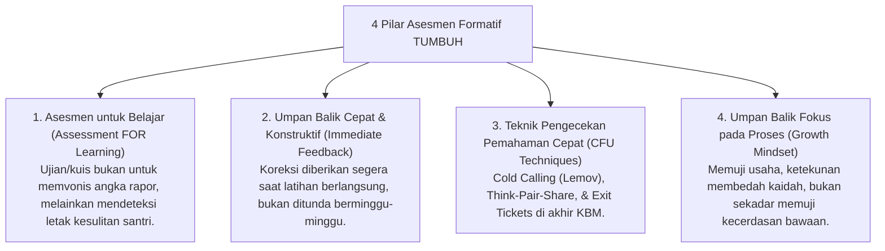

# P2-03-04-Prinsip-Didaktik-Interaktif-dan-Asesmen-Formatif

## Tujuan
Menetapkan standar didaktik pengajaran interaktif di kelas dan halaqah pesantren serta pemanfaatan **Asesmen Formatif & Umpan Balik Berkualitas (*Formative Assessment & Actionable Feedback - John Hattie & Dylan Wiliam*)** untuk melejitkan capaian belajar santri.

---

## 1. Menghidupkan Metode Didaktik Nabawiyyah

Rasulullah ﷺ adalah pendidik teragung yang tidak pernah mengajar dengan gaya ceramah yang membosankan (*monolog pasif*). Beliau menggunakan teknik didaktik interaktif:
* **Mengajukan Pertanyaan Retoris/Pemantik**: *"Tahukah kalian siapakah orang yang bangkrut (muflis) itu?"* (*HR. Muslim*).
* **Menggunakan Perumpamaan Nyata (*Tamsil / Visual Metaphor*)**: Menggambar garis lurus dan cabang-cabang garis di tanah untuk menjelaskan jalan kebenaran (*HR. Ahmad*).
* **Menghargai Inisiatif Menjawab Santri**: Memberi apresiasi saat sahabat menjawab dengan benar dan meluruskan dengan bijak saat keliru.

---

## 2. 4 Pilar Asesmen Formatif & Umpan Balik Cepat

---

## 3. Status Dokumen
* **Status**: 🌟 **A+ (Tervalidasi & Siap Diimplementasikan)**
* **Level**: Project 2 - `02 Principles / 03 Learning Principles`
* **Langkah Berikutnya**: **`P2-03-05-Sintesis-Learning-Principles-TUMBUH.md`**.
