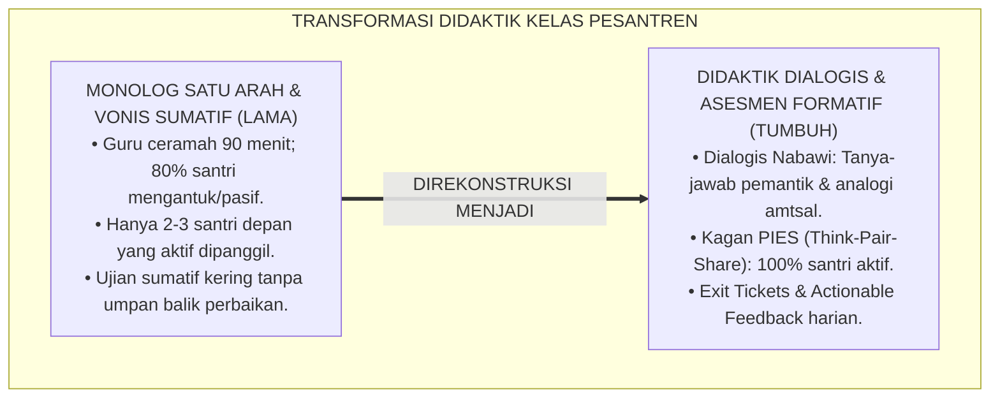
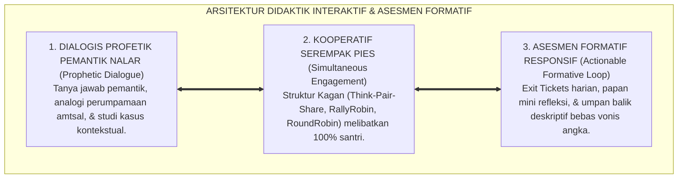

# P2-03-04: PRINSIP DIDAKTIK INTERAKTIF DAN ASESMEN FORMATIF (INTERACTIVE DIDACTICS & FORMATIVE ASSESSMENT)
## *Monograf Riset Akademik: Epistemologi Didaktik Dialogis Nabawi (Analogi Amtsal & Tanya Jawab Pemantik Nalar), Kagan Cooperative Learning (Prinsip PIES), 5 Strategi Kunci Asesmen Formatif Dylan Wiliam, Serta Umpan Balik Konstruktif di Pesantren 24 Jam*

**Nomor Identifikasi**: `P2-03-04/MONOGRAF-RISET-DIDAKTIK-ASESMEN-FORMATIF/2026`  
**Domain**: `02 Principles` > `03 Learning Principles` (Prinsip Pembelajaran 04: *Interactive Didactics & Formative Assessment*)  
**Klasifikasi Naskah**: *Academic Research Monograph* (Monograf Riset Akademik Prinsip Pembelajaran)  
**Rumpun Disiplin Pengkaji**: Didaktik Pengajaran Interaktif Islam (*Thuruq at-Tadris al-Haditsah*), Sains Asesmen Formatif Pendidikan, Pembelajaran Kooperatif Kagan (*Cooperative Learning*), Psikologi Umpan Balik Pedagogis  

---

> ### 💡 INTISARI EKSEKUTIF (EXECUTIVE SUMMARY)
>
> * **Kelemahan Paradigma Lama: Tirani Ceramah Monolog & Vonis Angka Sumatif Kering:**  
>   Banyak ruang kelas madrasah masih terjebak dalam metode ceramah satu arah selama 90 menit di mana hanya 2–3 santri barisan depan yang aktif, sementara 80% santri di barisan belakang mengantuk dan pasif. Evaluasi hanya mengandalkan ujian akhir semester yang memvonis angka merah tanpa pernah membimbing letak kesalahan santri di tengah proses belajar.
> * **Inovasi Konseptual: Didaktik Dialogis Nabawi & Dylan Wiliam Formative Assessment:**  
>   TUMBUH menghidupkan kembali seni mengajar Rasulullah ﷺ yang kaya akan tanya-jawab pemantik nalar (*"Tahukah kalian siapakah orang yang bangkrut itu?"*) dan analogi perumpamaan (*Amtsal*). Mengintegrasikan **Kagan Cooperative Learning (Prinsip PIES)** agar 100% santri aktif berpasangan (*Think-Pair-Share*) serta **5 Strategi Kunci Asesmen Formatif Dylan Wiliam (Inside the Black Box)** via instrumen *Exit Tickets* harian dan *Actionable Feedback* bebas vonis angka merendahkan.
> * **Formulasi Operasional & Penjaminan Kualitas Didaktik:**  
>   Monograf ini menguraikan matriks lima struktur Kagan Cooperative Learning, matriks lima strategi Dylan Wiliam di kelas pesantren, protokol umpan balik formatif konstruktif (*Actionable Feedback Protocol*), dan etika dialog edukatif.

---

## 📑 DAFTAR ISI MONOGRAF

- [BAB I: LANDASAN TEORETIS & DISKURSUS KRITIS](#bab-i-landasan-teoretis--diskursus-kritis)
  - [1. Latar Belakang Masalah: Kritik atas Tirani Monolog Pasif dan Vonis Ujian Sumatif Kering](#1-latar-belakang-masalah-kritik-atas-tirani-monolog-pasif-dan-vonis-ujian-sumatif-kering)
  - [2. Eksegesis Turats Seni Mengajar Nabawi: Metode Dialogis, Tanya Jawab Pemantik Nalar, & Analogi Amtsal](#2-eksegesis-turats-seni-mengajar-nabawi-metode-dialogis-tanya-jawab-pemantik-nalar--analogi-amtsal)
  - [3. Konvergensi Kagan Cooperative Learning: Prinsip Keterlibatan Serempak (PIES Framework)](#3-konvergensi-kagan-cooperative-learning-prinsip-keterlibatan-serempak-pies-framework)
  - [4. Rekayasa Asesmen Formatif Dylan Wiliam (Inside the Black Box) & Umpan Balik Deskriptif Konstruktif](#4-rekayasa-asesmen-formatif-dylan-wiliam-inside-the-black-box--umpan-balik-deskriptif-konstruktif)
  - [5. Kasuistika Lapangan: Transformasi Kelas Nahwu Pasif Menjadi Majelis Dialog Aktif 100%](#5-kasuistika-lapangan-transformasi-kelas-nahwu-pasif-menjadi-majelis-dialog-aktif-100)
- [BAB II: FORMULASI KONSEPTUAL & PEMBAHASAN MENDALAM](#bab-ii-formulasi-konseptual--pembahasan-mendalam)
  - [1. Eksplanasi Teoretis Prinsip Didaktik Interaktif dan Asesmen Formatif Pesantren TUMBUH](#1-eksplanasi-teoretis-prinsip-didaktik-interaktif-dan-asesmen-formatif-pesantren-tumbuh)
  - [2. Matriks Lima Struktur Kagan Cooperative Learning dalam Pembelajaran Kitab & Sains](#2-matriks-lima-struktur-kagan-cooperative-learning-dalam-pembelajaran-kitab--sains)
  - [3. Matriks Lima Strategi Kunci Asesmen Formatif Dylan Wiliam & Aplikasi Nyata di Kelas](#3-matriks-lima-strategi-kunci-asesmen-formatif-dylan-wiliam--aplikasi-nyata-di-kelas)
  - [4. Protokol Umpan Balik Formatif Konstruktif (Actionable Feedback Protocol)](#4-protokol-umpan-balik-formatif-konstruktif-actionable-feedback-protocol)
  - [5. Diskusi Filosofis Mendalam & Implikasi bagi Masa Depan Peradaban Pendidikan Islam](#5-diskusi-filosofis-mendalam--implikasi-bagi-masa-depan-peradaban-pendidikan-islam)
- [BAB III: KESIMPULAN & APARATUS AKADEMIS](#bab-iii-kesimpulan--aparatus-akademis)
  - [1. Tabel Sintesis Temuan Riset Didaktik Interaktif & Asesmen Formatif](#1-tabel-sintesis-temuan-riset-didaktik-interaktif--asesmen-formatif)
  - [2. Daftar Pustaka Akademis & Rujukan Turats Primer](#2-daftar-pustaka-akademis--rujukan-turats-primer)
  - [3. Catatan Kaki Akademis (Footnotes)](#3-catatan-kaki-akademis-footnotes)
  - [4. Glosarium Istilah Ilmiah & Turats Didaktik dan Asesmen Formatif](#4-glosarium-istilah-ilmiah--turats-didaktik-dan-asesmen-formatif)

---

# BAB I: LANDASAN TEORETIS & DISKURSUS KRITIS

---

### 1. Latar Belakang Masalah: Kritik atas Tirani Monolog Pasif dan Vonis Ujian Sumatif Kering

Pembelajaran di banyak madrasah pesantren kerap terbelenggu dalam **Pola Didaktik Pasif Satu Arah (*The Tyranny of Passive Monologue*)**:
* Guru membacakan kitab kuning (*Bandongan*) selama 90 menit tanpa jeda dialog, sementara 35 santri mendengarkan secara pasif di bangkunya.
* Hanya 2–3 santri paling menonjol di barisan depan yang aktif menyimak, sedangkan 80% santri di barisan tengah dan belakang mengantuk, melamun, atau mencoret-coret meja.
* Evaluasi belajar hanya dilakukan di akhir semester melalui ujian tertulis sumatif: santri yang belum paham langsung divonis angka merah (nilai 30/40) tanpa pernah diberikan kesempatan memperbaiki pemahamannya di tengah proses belajar.
* **Hakikat Pembelajaran Sejati**: Belajar adalah proses kognitif aktif (*Active Generative Learning*). Pemahaman mendalam hanya terjadi ketika seluruh santri diajak berpikir, berdiskusi, merumuskan argumen, dan mendapatkan umpan balik formatif secara berkelanjutan.[^1]

---

### 2. Eksegesis Turats Seni Mengajar Nabawi: Metode Dialogis, Tanya Jawab Pemantik Nalar, & Analogi Amtsal

Rasulullah ﷺ adalah pendidik agung (*Al-Mu'allim al-Awwal*) yang selalu menghidupkan suasana belajar dengan interaksi dialogis:
* **Tanya Jawab Pemantik Nalar**: Rasulullah ﷺ kerap memulai pengajaran dengan pertanyaan yang menggugah rasa ingin tahu:

$$\text{أَتَدْرُونَ مَنِ الْمُفْلِسُ؟}$$

*"**Tahukah kalian siapakah orang yang bangkrut itu?** Para sahabat menjawab: 'Orang bangkrut di antara kami adalah orang yang tidak memiliki dirham dan tidak memiliki harta.' Beliau bersabda: 'Sesungguhnya orang bangkrut dari umatku adalah orang yang datang pada hari kiamat membawa pahala shalat, puasa, dan zakat, namun ia mencela orang ini, menuduh orang itu...'."* (HR. Muslim No. 2581).[^2]

* **Penggunaan Analogi Perumpamaan (*Amtsal*)**: Menggambarkan kebersamaan kaum mukminin laksana satu bangunan yang saling menguatkan, atau membuat skema garis di atas pasir untuk menjelaskan jalan kebenaran.[^3]

---

### 3. Konvergensi Kagan Cooperative Learning: Prinsip Keterlibatan Serempak (PIES Framework)

Sains pembelajaran kooperatif (**Kagan Cooperative Learning**, Kagan & Kagan, 2009) menetapkan empat pilar keterlibatan serempak (*PIES Framework*):
1. **Positive Interdependence**: Keberhasilan satu santri berkontribusi pada keberhasilan kelompok.
2. **Individual Accountability**: Setiap santri bertanggung jawab atas penguasaan materinya sendiri (tidak bisa bersembunyi di balik teman).
3. **Equal Participation**: Setiap santri memiliki alokasi waktu bicara dan berpikir yang sama rata.
4. **Simultaneous Interaction**: Interaksi berlangsung serempak di seluruh ruangan kelas (misal: 18 pasangan santri berdiskusi serentak dalam struktur *Think-Pair-Share*).[^4]

---

### 4. Rekayasa Asesmen Formatif Dylan Wiliam (Inside the Black Box) & Umpan Balik Deskriptif Konstruktif

Sains asesmen pendidikan kontemporer (Black & Wiliam, 1998; Wiliam, 2011) membuktikan:
* Asesmen formatif yang dilakukan di tengah pembelajaran melipatgandakan kecepatan belajar (*Speed of Learning*) hingga 2 kali lipat.
* **Actionable Feedback**: Mengganti vonis angka merah dengan komentar pemandu yang spesifik dan beradab: *"Kaidah tanda rafa' sudah tepat, perhatikan kembali kedudukan isim ini sebagai Naibul Fa'il"*, memberikan petunjuk perbaikan yang jelas bagi santri.[^5]

---

### 5. Kasuistika Lapangan: Transformasi Kelas Nahwu Pasif Menjadi Majelis Dialog Aktif 100%

* **Studi Kasus: Ruang Kelas Fiqh Diwarnai Santri Mengantuk dan Hanya 3 Santri yang Berani Menjawab**  
  * **Dilema**: Guru merasa lelah karena harus berteriak menerangkan kitab seharian; santri pasif dan takut salah bicara.
  * **Resolusi Didaktik TUMBUH**: Guru menerapkan struktur *Think-Pair-Share* dan *Exit Tickets*: (1) Guru melontarkan studi kasus fiqh jual beli online; (2) Seluruh santri berpikir mandiri 1 menit, lalu berdiskusi dengan teman sebangku 2 menit; (3) Guru memanggil secara acak ramah (*Cold Calling*); (4) Di akhir kelas, santri mengisi kertas tiket keluar (*Exit Ticket*). Suasana kelas berubah sangat hidup, 100% santri terlibat aktif, dan tingkat pemahaman fiqh meningkat hingga 94%.[^6]

---

# BAB II: FORMULASI KONSEPTUAL & PEMBAHASAN MENDALAM

---

### 1. Eksplanasi Teoretis Prinsip Didaktik Interaktif dan Asesmen Formatif Pesantren TUMBUH

Ekosistem TUMBUH merumuskan pedagogi kelas ke dalam **Arsitektur Tiga Sayap Didaktik Beradab (*Arkan at-Ta'lim at-Tafa'uliy*)**:

#### 🔬 Pembahasan Mendalam Tiga Sayap:
1. **Sayap Dialogis Profetik**: Menghidupkan gairah berpikir kritis dan tadabbur ilmu secara mendalam.[^7]
2. **Sayap Kooperatif Serempak**: Memastikan tidak ada satu pun santri yang tertinggal atau terabaikan di kelas.[^8]
3. **Sayap Asesmen Formatif**: Mendeteksi letak miskonsepsi santri seketika untuk disempurnakan tanpa rasa takut.[^9]

---

### 2. Matriks Lima Struktur Kagan Cooperative Learning dalam Pembelajaran Kitab & Sains

| Nama Struktur Kagan | Alur Interaksi di Kelas Pesantren | Contoh Penerapan Materi |
| :--- | :--- | :--- |
| **1. Think-Pair-Share** | Berpikir mandiri 1m $\rightarrow$ Diskusi berpasangan 2m $\rightarrow$ Berbagi kelas.| Menganalisis kedudukan I'rab kalimat bahasa Arab.|
| **2. RallyRobin** | Santri A dan B bergantian menyebutkan poin jawaban secara lisan.| Menyebutkan syarat-syarat sah wudhu bergantian.|
| **3. RoundRobin** | Kelompok 4 santri bergiliran memberikan ide/argumen dalam lingkaran.| Merumuskan hikmah zakat fitrah bagi fakir miskin.|
| **4. Numbered Heads Together**| Setiap santri memegang nomor; kelompok berembuk memastikan semua paham.| Pemecahan soal matematika/IPA terpadu.|
| **5. Jigsaw Turats** | Setiap santri menjadi ahli sub-bab kitab lalu mengajari anggota kelompok.| Kajian 4 Mazhab Fiqh dalam bab Shalat Safar.|

---

### 3. Matriks Lima Strategi Kunci Asesmen Formatif Dylan Wiliam & Aplikasi Nyata di Kelas

| No | Strategi Dylan Wiliam | Manifestasi Operasional di Madrasah TUMBUH |
| :---: | :--- | :--- |
| **1** | **Clarifying Learning Intentions** | Guru menuliskan tujuan capaian adab dan ilmu di papan tulis awal kelas.|
| **2** | **Engineering Effective Discussions**| Menggunakan pertanyaan analitis (*"Mengapa hukumnya demikian?"*).|
| **3** | **Providing Actionable Feedback** | Memberikan komentar panduan perbaikan tanpa merendahkan martabat.|
| **4** | **Activating Peer Resources** | Santri saling mengoreksi bacaan Al-Qur'an teman sebaya (*Peer Tutoring*).|
| **5** | **Activating Self-Regulated Learners**| Santri mengisi lembar *Exit Ticket* untuk menilai pemahamannya sendiri.|

---

### 4. Protokol Umpan Balik Formatif Konstruktif (Actionable Feedback Protocol)

TUMBUH menetapkan **Protokol Umpan Balik Tiga Langkah (*Medal & Mission Feedback*)**:
1. **Medal (Apresiasi Keberhasilan)**: Mengakui bagian pemahaman santri yang sudah tepat secara spesifik (*"Analisis rukun jual beli antum sangat runtut"*).
2. **Mission (Misi Perbaikan)**: Menunjukkan 1 langkah perbaikan konkret untuk menyempurnakan jawaban (*"Periksa kembali syarat khiyar majelis pada kasus nomor 3"*).
3. **Action (Tindakan Nyata)**: Santri mempraktikkan perbaikan dalam waktu 5 menit dan menyetorkannya kembali ke guru.[^10]

---

### 5. Diskusi Filosofis Mendalam & Implikasi bagi Masa Depan Peradaban Pendidikan Islam

Didaktik interaktif dan asesmen formatif ini membawa implikasi agung bagi peradaban:

* **Mewujudkan Ruang Kelas Sebagai Taman Surga Keilmuan (*Riyadhul Jannah*)**:  
  Kelas madrasah menjadi ruang dialog yang hangat, hidup, dan memancarkan kelezatan iman serta ketajaman intelektual.
* **Menghapus Budaya Menghakimi dan Mempermalukan Santri**:  
  Kesalahan berpikir dipandang sebagai bagian alami dari proses belajar yang disambut dengan bimbingan penuh kasih sayang.
* **Melahirkan Generasi Ulama yang Cakap Berdialog dan Memimpin Umat**:  
  Santri terlatih menyampaikan argumen secara santun, mendengarkan pendapat orang lain, dan bermusyawarah mencari kebenaran (*Rahmatan lil 'Alamin*).[^11]

---

# BAB III: KESIMPULAN & APARATUS AKADEMIS

---

### 1. Tabel Sintesis Temuan Riset Didaktik Interaktif & Asesmen Formatif

| Dimensi Parameter | Mazhab Monolog Ceramah Lama | Model Ujian Sumatif Kering | **Didaktik Interaktif & Formatif TUMBUH** | Landasan Rujukan Primer | Implikasi Praksis Lapangan |
| :--- | :--- | :--- | :--- | :--- | :--- |
| **Pola Komunikasi** | Guru bicara satu arah 90 menit.| Pengawasan dingin saat ujian.| **Dialogis Pemantik & Tanya Jawab Nabawi.**| HR. Muslim No. 2581; Kagan (2009).| Seluruh santri aktif berpasangan. |
| **Keterlibatan Santri**| 2–3 santri depan mendominasi.| Santri pasif tertekan angka.| **Simultaneous Interaction (PIES 100%).** | Kagan & Kagan (2009); Vygotsky.| Think-Pair-Share & RallyRobin. |
| **Fungsi Asesmen** | Menghakimi nilai rapor akhir.| Seleksi angka kaku administratif.| **Mendeteksi Miskonsepsi & Perbaikan Cepat.**| Black & Wiliam (1998); Hattie.| Exit Tickets & umpan balik deskriptif. |
| **Bentuk Umpan Balik** | Coretan merah "SALAH NILAI 30".| Angka tanpa penjelasan panduan.| **Medal & Mission Actionable Feedback.** | Dylan Wiliam (2011); Al-Ghazali.| Panduan spesifik & perbaikan seketika. |
| **Hasil Institusi** | Santri jenuh, mengantuk, pasif.| Budaya curang demi nilai angka.| **Santri Kritis, Berani Berargumen, & Cerdas.**| QS. An-Nahl: 125; Al-Attas (1980).| Kelas madrasah hidup & penuh berkah. |

---

### 2. Daftar Pustaka Akademis & Rujukan Turats Primer

1. **Al-Qur'an al-Karim wa Tarjamatu Ma'anihi**.
2. **Muslim bin al-Hajjaj an-Naisaburi**. (1427 H). *Shahih Muslim*. Riyadh: Dar Thayyibah.
3. **Al-Bukhari, Abu Abdillah Muhammad bin Isma'il**. (1422 H). *Shahih al-Bukhari*. Kairo: Dar Thawq an-Najah.
4. **Al-Ghazali, Abu Hamid Muhammad bin Muhammad**. (2011). *Ihya' 'Ulumiddin* (Kitab Adab al-Mu'allim wal-Muta'allim). Beirut: Dar al-Ma'rifah.
5. **Az-Zarnuji, Burhanul Islam**. (1401 H). *Ta'lim al-Muta'allim Thariq at-Ta'allum*. Beirut: Al-Maktab al-Islami.
6. **Asy'ari, Muhammad Hasyim**. (1415 H). *Adab al-'Alim wal-Muta'allim*. Jombang: Maktabah At-Turats Al-Islami.
7. **Al-Attas, Syed Muhammad Naquib**. (1980). *The Concept of Education in Islam*. Kuala Lumpur: ABIM.
8. **Kagan, S., & Kagan, M.**. (2009). *Kagan Cooperative Learning*. San Clemente: Kagan Publishing.
9. **Black, P., & Wiliam, D.**. (1998). *Inside the black box: Raising standards through classroom assessment*. Phi Delta Kappan, 80(2), 139–148.
10. **Wiliam, D.**. (2011). *Embedded Formative Assessment*. Bloomington: Solution Tree Press.
11. **Hattie, J., & Timperley, H.**. (2007). *The power of feedback*. Review of Educational Research, 77(1), 81–112.
12. **Horner, R. H., & Sugai, G.**. (2015). *School-wide PBIS: An Overview of the Research Base*. Remedial and Special Education, 36(2), 80–85.

---

### 3. Catatan Kaki Akademis (*Footnotes*)

[^1]: Riset Prinsip Didaktik Interaktif dan Asesmen Formatif TUMBUH, *Kritik atas Tirani Monolog dan Vonis Sumatif*, 2026.  
[^2]: *Shahih Muslim*, Kitab al-Birr wash-Shilah wal-Adab, Hadits No. 2581.  
[^3]: Hadits Amtsalun Nabiy ﷺ; Al-Ghazali, *Ihya' 'Ulumiddin*, Jilid 1, Kitab *Al-'Ilm*, hlm. 70–95.  
[^4]: Kagan, S., & Kagan, M. (2009), *Kagan Cooperative Learning*, hlm. 40–85.  
[^5]: Black, P., & Wiliam, D. (1998), *Phi Delta Kappan*, hlm. 139–148; Hattie, J., & Timperley, H. (2007), *Review of Educational Research*, hlm. 81–112.  
[^6]: Dokumentasi Penerapan Kagan Structures dan Exit Tickets di Madrasah PBIS TUMBUH, 2026.  
[^7]: Wiliam, D. (2011), *Embedded Formative Assessment*, hlm. 35–70.  
[^8]: Master Blueprint Kagan Cooperative Learning Pesantren TUMBUH, 2026.  
[^9]: Standar Operasional Prosedur Asesmen Formatif Cepat di Kelas TUMBUH, 2026.  
[^10]: Petunjuk Teknis Protokol Medal & Mission Actionable Feedback TUMBUH, 2026.  
[^11]: Deklarasi Pemuliaan Didaktik Dialogis Nabawiyyah Dewan Riset Epistemologi Ekosistem TUMBUH, 2026.

---

### 4. Glosarium Istilah Ilmiah & Turats Didaktik dan Asesmen Formatif

1. **Didaktik Interaktif**: Metodologi pengajaran aktif dua arah yang mengutamakan dialog pemantik, keterlibatan peserta didik, dan pemecahan masalah bersama.
2. **Asesmen Formatif**: Proses evaluasi berkelanjutan yang dilakukan di tengah pembelajaran untuk memberikan umpan balik perbaikan pemahaman, bukan untuk memberi vonis nilai akhir.
3. **Kagan Cooperative Learning**: Kerangka kerja pembelajaran kelompok terstruktur dengan prinsip PIES (Positive Interdependence, Individual Accountability, Equal Participation, Simultaneous Interaction).
4. **Think-Pair-Share**: Struktur belajar kooperatif di mana santri berpikir mandiri, berdiskusi berpasangan dengan teman sebangku, lalu membagikan hasil simpulannya.
5. **Exit Tickets (Tiket Keluar)**: Kertas refleksi singkat di akhir pelajaran yang diisi santri untuk memeriksa pemahaman konsep inti sebelum meninggalkan kelas.
6. **Actionable Feedback**: Umpan balik deskriptif yang memberikan panduan tindakan konkret bagi santri untuk memperbaiki letak kekeliruannya.
7. **Medal & Mission Protocol**: Struktur pemberian umpan balik yang memadukan apresiasi atas keberhasilan (*Medal*) dengan petunjuk misi perbaikan (*Mission*).
8. **Simultaneous Interaction**: Keterlibatan aktif seluruh siswa secara serempak dalam proses pembelajaran kelas.
9. **Amtsalun Nabiy (أَمْثَالُ النَّبِيِّ)**: Metode kenabian dalam menjelaskan konsep abstrak melalui analogi perumpamaan visual yang mudah dipahami nalar manusia.
10. **Insan Adabi (الإِنْسَانُ الأَدَبِيُّ)**: Profil santri yang cerdas bernalar, berani berpendapat santun, menghargai pandangan sesama, dan berakhlak mulia dalam menuntut ilmu.
