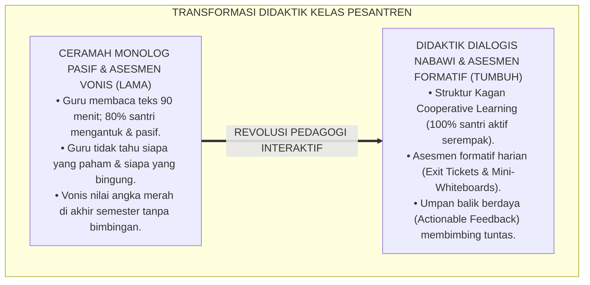
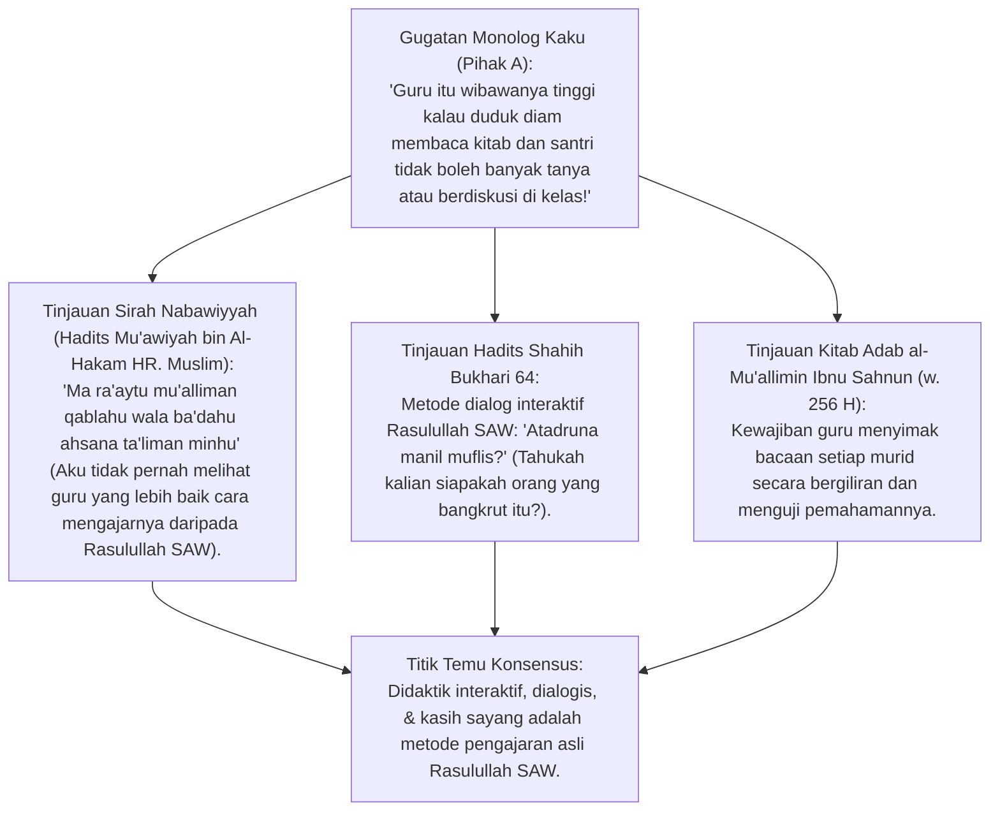
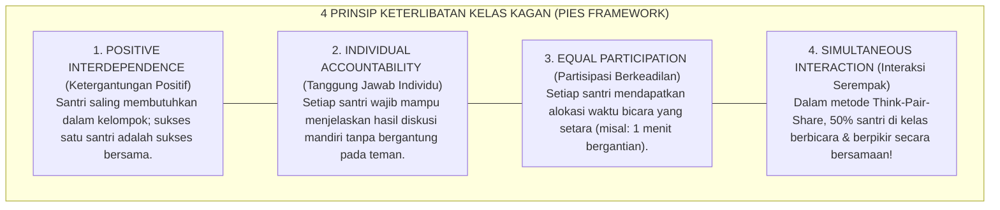
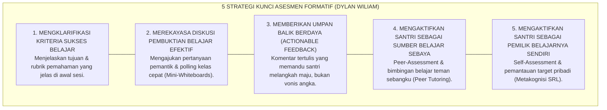
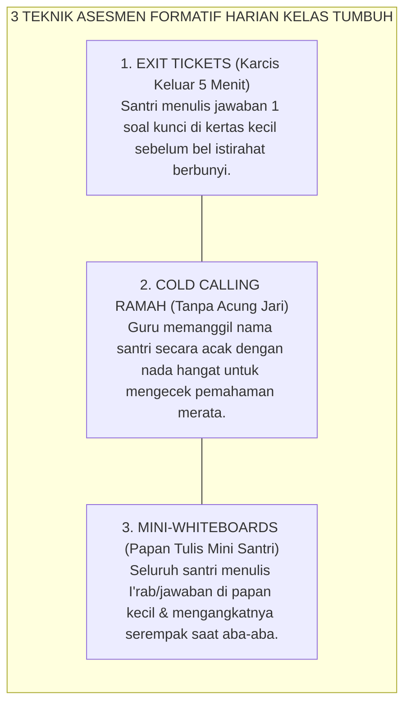
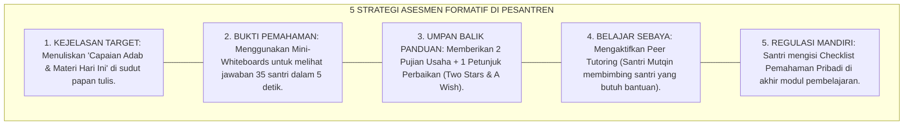
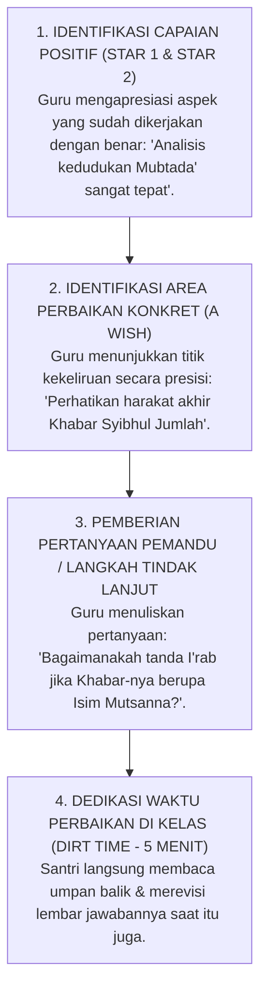

# P2-03-04: PRINSIP DIDAKTIK INTERAKTIF DAN ASESMEN FORMATIF
## *Monograf Terpadu: Epistemologi Didaktik Dialogis Nabawi (Analogi Amtsal & Tanya Jawab Pemantik Nalar), Konvergensi Kagan Cooperative Learning (Prinsip PIES), 5 Strategi Kunci Asesmen Formatif Dylan Wiliam (Inside the Black Box), serta Umpan Balik Konstruktif (Actionable Feedback) Bebas Vonis Angka*

**Nomor Identifikasi**: `P2-03-04/MONOGRAF-TERPADU-DIDAKTIK-ASESMEN-FORMATIF/2026`  
**Domain**: `02 Principles` > `03 Learning Principles`  
**Klasifikasi Naskah**: *Comprehensive Integrated Monograph* (Monograf Akademis & Rumusan Baku Terpadu)  
**Rumpun Disiplin Pengkaji**: Didaktik Pengajaran Interaktif Islam (*Thuruq at-Tadris al-Haditsah*), Sains Asesmen Formatif Pendidikan, Pembelajaran Kooperatif Kagan (*Cooperative Learning*), Psikologi Umpan Balik Pedagogis  

---

> ### 💡 INTISARI PRAKTIS (3 MENIT PAHAM UNTUK ASATIDZ & MUSYRIF)
>
> * **Ubah Kelas Monolog Membosankan Menjadi Dialog Hidup (Didaktik Nabawi):**  
>   Rasulullah SAW tidak pernah mengajar dengan ceramah panjang yang membuat murid mengantuk. Beliau mengajar dengan **Tanya-Jawab Pemantik Nalar** (*"Tahukah kalian siapakah orang yang bangkrut itu?"*), analogi perumpamaan visual (*Amtsal*), dan menggambar skema di atas pasir.
> * **Struktur Pembelajaran Kooperatif Kagan (Prinsip PIES):**  
>   Jangan hanya menunjuk 1 santri pintar di depan kelas. Gunakan struktur *Think-Pair-Share*: semua santri berpikir mandiri 1 menit $\rightarrow$ berdiskusi berpasangan dengan teman sebangku 2 menit $\rightarrow$ berbagi jawaban. Seluruh santri aktif 100% secara serempak!
> * **Asesmen Formatif: Memeriksa Pemahaman Sebelum Terlambat (*Exit Tickets*):**  
>   Jangan menunggu ujian semester untuk tahu santri tidak paham. Di 5 menit akhir kelas, bagikan selembar kertas kecil (*Exit Ticket*): santri menuliskan jawaban 1 pertanyaan kunci. Guru langsung tahu siapa yang butuh bimbingan tambahan besok pagi.
> * **Beri Umpan Balik Kualitas (*Feedback*), Bukan Sekadar Vonis Angka Merah:**  
>   Ketika santri salah meng-i'rab, jangan langsung dicoret merah dengan vonis "SALAH! NILAI 40". Tuliskan komentar panduan: *"Kaidah tanda rafa' sudah tepat, perhatikan kembali kedudukan isim mitsal ini sebagai Naibul Fa'il"*.

---

## 📑 DAFTAR ISI MONOGRAF

- [BAGIAN I: RISET DIDAKTIK INTERAKTIF & ASESMEN FORMATIF, DIALEKTIKA INKUIRI, & KASUISTIKA LAPANGAN](#bagian-i-riset-didaktik-interaktif--asesmen-formatif-dialektika-inkuiri--kasuistika-lapangan)
  - [1. Kerangka Metodologi Pengajaran Kelas Pesantren: Kritik atas Tirani Monolog & Vonis Nilai Sumatif](#1-kerangka-metodologi-pengajaran-kelas-pesantren-kritik-atas-tirani-monolog--vonis-nilai-sumatif)
  - [2. Inkuiri 1: Eksegesis Turats Didaktik Interaktif Nabawi — Seni Mengajar Rasulullah SAW (Amtsal & Tanya Jawab)](#2-inkuiri-1-eksegesis-turats-didaktik-interaktif-nabawi--seni-mengajar-rasulullah-saw-amtsal--tanya-jawab)
  - [3. Inkuiri 2: Konvergensi Kagan Cooperative Learning & Prinsip Keterlibatan Serempak (PIES Framework)](#3-inkuiri-2-konvergensi-kagan-cooperative-learning--prinsip-keterlibatan-serempak-pies-framework)
  - [4. Inkuiri 3: Lima Strategi Kunci Asesmen Formatif Dylan Wiliam (Inside the Black Box)](#4-inkuiri-3-lima-strategi-kunci-asesmen-formatif-dylan-wiliam-inside-the-black-box)
  - [5. Inkuiri 4: Teknik Asesmen Cepat di Kelas: Exit Tickets, Cold Calling Ramah, & Papan Mini](#5-inkuiri-4-teknik-asesmen-cepat-di-kelas-exit-tickets-cold-calling-ramah--papan-mini)
  - [6. Inkuiri 5: Silogisme Logika, Dialektika 3 Ronde, Kasuistika Kelas Madrasah, & Titik Temu Konsensus](#6-inkuiri-5-silogisme-logika-dialektika-3-ronde-kasuistika-kelas-madrasah--titik-temu-konsensus)
- [BAGIAN II: TEMUAN RISET, FORMULASI KONSEPTUAL & PEMBAHASAN](#bagian-ii-temuan-riset-formulasi-konseptual--pembahasan)
  - [1. Formulasi Konseptual: Prinsip Didaktik Interaktif dan Asesmen Formatif Pesantren TUMBUH](#1-formulasi-konseptual-prinsip-didaktik-interaktif-dan-asesmen-formatif-pesantren-tumbuh)
  - [2. Matriks 5 Struktur Kagan Cooperative Learning dalam Pembelajaran Kitab & Sains](#2-matriks-5-struktur-kagan-cooperative-learning-dalam-pembelajaran-kitab--sains)
  - [3. Matriks 5 Strategi Kunci Asesmen Formatif Dylan Wiliam & Aplikasi Nyata di Kelas Pesantren](#3-matriks-5-strategi-kunci-asesmen-formatif-dylan-wiliam--aplikasi-nyata-di-kelas-pesantren)
  - [4. Protokol Umpan Balik Formatif Konstruktif (Actionable Feedback Protocol)](#4-protokol-umpan-balik-formatif-konstruktif-actionable-feedback-protocol)
- [BAGIAN III: APARATUS AKADEMIS & APENDIKS](#bagian-iii-aparatus-akademis--apendiks)
  - [1. Tabel Sintesis Hasil Riset Didaktik Interaktif & Asesmen Formatif](#1-tabel-sintesis-hasil-riset-didaktik-interaktif--asesmen-formatif)
  - [2. Daftar Pustaka Akademis & Rujukan Turats Primer](#2-daftar-pustaka-akademis--rujukan-turats-primer)
  - [3. Catatan Kaki Akademis (Footnotes)](#3-catatan-kaki-akademis-footnotes)
  - [4. Glosarium dan Penjelasan Istilah Teknis Didaktik Interaktif, Cooperative Learning, & Asesmen Formatif](#4-glosarium-dan-penjelasan-istilah-teknis-didaktik-interaktif-cooperative-learning--asesmen-formatif)

---

# BAGIAN I: RISET DIDAKTIK INTERAKTIF & ASESMEN FORMATIF, DIALEKTIKA INKUIRI, & KASUISTIKA LAPANGAN

---

### 1. Kerangka Metodologi Pengajaran Kelas Pesantren: Kritik atas Tirani Monolog & Vonis Nilai Sumatif

Banyak ruang kelas madrasah pesantren masih terbelenggu dalam **Pola Pengajaran Pasif Satu Arah (*The Tyranny of Passive Monologue*)**:
* Asatidz duduk di depan membaca kitab kuning selama 90 menit tanpa jeda, sementara 35 santri mendengarkan secara pasif di bangkunya masing-masing.
* Hanya 2–3 santri paling pintar di barisan depan yang aktif menyimak, sementara 80% santri di barisan tengah dan belakang mengantuk, melamun, atau mencorat-coret meja.
* Evaluasi belajar hanya dilakukan di akhir semester melalui **Ujian Sumatif Kertas Kering**: santri yang belum paham langsung divonis angka merah (nilai 30/40) tanpa pernah diberikan kesempatan memperbaiki pemahamannya di tengah proses belajar.

Didaktik modern dan sunnah pedagogi Nabawiyyah membuktikan bahwa **Belajar Adalah Proses Kognitif Aktif (*Learning is an Active Generative Process*)**. Pemahaman mendalam hanya terjadi ketika santri diajak berpikir, berdiskusi, merumuskan argumen, dan mendapatkan umpan balik formatif (*Formative Assessment*) secara berkelanjutan.

---

### 2. Inkuiri 1: Eksegesis Turats Didaktik Interaktif Nabawi — Seni Mengajar Rasulullah SAW (Amtsal & Tanya Jawab)

#### 📐 Formalisasi Logika Silogisme (*Qiyas Mantiqi 1*)
* **Premis Mayor (*al-Muqaddimah al-Kubra*)**: Setiap metode didaktik pengajaran yang meneladani seni mengajar Rasulullah SAW niscaya mengaktifkan seluruh potensi akal dan kalbu pembelajar melalui pertanyaan pemantik nalar (*Inquiry*), perumpamaan konkret (*Amtsal*), dan interaksi dialogis yang memuliakan.
* **Premis Minor (*al-Muqaddimah ash-Shughra*)**: Rasulullah SAW mendidik para sahabat melalui dialog interaktif, analogi visual, dan mengajukan pertanyaan retoris yang menggugah nalar kritis sahabat sebelum memaparkan hukum syariat.
* **Konklusi (*an-Natijah*)**: Maka, seluruh asatidz di pesantren TUMBUH wajib menerapkan seni didaktik dialogis interaktif dalam setiap sesi pembelajaran.[^1]

#### 📖 Teks Primer Hadits Shahih Muslim & Al-Bukhari
Sahabat Abu Hurairah *radhiyallahu 'anhu* meriwayatkan metode tanya-jawab Rasulullah SAW:

$$\text{أَتَدْرُونَ مَا الْمُفْلِسُ؟ قَالُوا: الْمُفْلِسُ فِينَا مَنْ لَا دِرْهَمَ لَهُ وَلَا مَتَاعَ. فَقَالَ: إِنَّ الْمُفْلِسَ مِنْ أُمَّتِي يَأْتِي يَوْمَ الْقِيَامَةِ بِصَلَاةٍ وَصِيَامٍ وَزَكَاةٍ، وَيَأْتِي قَدْ شَتَمَ هَذَا، وَقَذَفَ هَذَا، وَأَكَلَ مَالَ هَذَا...}$$

*"Rasulullah SAW bertanya kepada para sahabat: **'Tahukah kalian siapakah orang yang bangkrut (al-Muflis) itu?'** Para sahabat menjawab: 'Orang yang bangkrut di antara kami adalah orang yang tidak memiliki dirham dan tidak memiliki harta benda.' **Maka Rasulullah SAW meluruskan nalar mereka: 'Sesungguhnya orang yang bangkrut dari umatku adalah orang yang datang pada hari kiamat membawa pahala shalat, puasa, dan zakat; namun ia datang dalam keadaan dahulu mencela si ini, menuduh si itu, memakan harta si ini...'**"* (HR. Muslim No. 2581; Tirmidzi No. 2418).[^2]

---

### 3. Inkuiri 2: Konvergensi *Kagan Cooperative Learning* & Prinsip Keterlibatan Serempak (*PIES Framework*)

#### 📐 Formalisasi Logika Silogisme (*Qiyas Mantiqi 2*)
* **Premis Mayor (*al-Muqaddimah al-Kubra*)**: Setiap struktur manajemen kelas yang menjamin keterlibatan serempak (*Simultaneous Interaction*) seluruh pembelajar niscaya mengeliminasi rasa bosan, mencegah distraksi perilaku, dan meningkatkan penguasaan materi secara merata.
* **Premis Minor (*al-Muqaddimah ash-Shughra*)**: *Kagan Cooperative Learning Framework* (Spencer Kagan, 1994) membuktikan bahwa struktur *PIES* melipatgandakan kesempatan aktif santri di kelas dari 3% (pada kelas monolog tradisional) menjadi lebih dari 50% dari total durasi waktu belajar.
* **Konklusi (*an-Natijah*)**: Maka, asatidz di pesantren TUMBUH wajib menerapkan struktur kooperatif Kagan dalam pembelajaran kelas madrasah.[^3]

---

### 4. Inkuiri 3: Lima Strategi Kunci Asesmen Formatif Dylan Wiliam (*Inside the Black Box*)

#### 📖 Teks Sains Asesmen: Prof. Dylan Wiliam & Prof. Paul Black (1998, 2011)
Dalam publikasi seminal *Inside the Black Box*, Paul Black & Dylan Wiliam merumuskan:

> *"Formative assessment is not a test, but a planned instructional process in which teachers and students use evidence of learning to adapt what they are doing... **Feedback to learners should be about particular qualities of his or her work, with guidance on what he or she can do to improve, rather than grades or scores that compare students with one another**. Grades create a culture of ego and failure, while descriptive actionable feedback creates a culture of learning and growth."* (Black & Wiliam, 1998, *Inside the Black Box*, Phi Delta Kappan).[^4]

---

### 5. Inkuiri 4: Teknik Asesmen Cepat di Kelas: *Exit Tickets*, *Cold Calling Ramah*, & Papan Mini

---

### 6. Inkuiri 5: Silogisme Logika, Dialektika 3 Ronde, Kasuistika Kelas Madrasah, & Titik Temu Konsensus

#### 🥊 Ronde 1: Menolak Mitos Bahwa "Asesmen Itu Hanya Berupa Ujian Kertas di Akhir Semester"
* **Pihak A (Sudut Pandang Evaluasionisme Sumatif)**:  
  *"Guru tidak perlu repot-repot menilai santri tiap hari; cukup bikin soal ujian pilihan ganda di akhir semester saja!"*
* **Tinjauan Sudut Pandang Asesmen Sebagai Kompas Navigasi Belajar**:  
  Menilai hanya di akhir semester adalah **Otopsi Kematian Pembelajaran (*Educational Autopsy*)**: guru baru tahu santri gagal ketika semuanya sudah terlambat. Asesmen Formatif harian adalah **Pemeriksaan Kesehatan Berkala (*Health Check-up*)**: guru mendeteksi kebingungan santri di hari itu juga dan langsung memberikan obat penjelasan yang tepat.[^5]

#### 🥊 Ronde 2: Sanggahan Balik Apakah Bertanya Acak (Cold Calling) Akan Mempermalukan Santri yang Belum Paham?
* **Pihak A (Sudut Pandang Kekhawatiran Kecemasan Santri)**:  
  *"Kalau guru menunjuk santri yang tidak mengacungkan tangan, nanti santri yang belum paham jadi malu dan trauma!"*
* **Tinjauan Sudut Pandang Budaya Ramah Kesalahan (*No-Shame Culture*)**:  
  *Cold Calling* ramah dijalankan dengan **Prinsip Bebas Rasa Malu (*Psychological Safety*)**. Jika santri belum mampu menjawab, guru tidak memarahinya, melainkan memberikan petunjuk (*Scaffolding Hint*) atau berkata dengan hangat: *"Terima kasih sudah mencoba, Ahmad. Mari kita dengarkan pendapat Zaid, lalu Ahmad ulangi lagi ya!"*. Santri merasa didukung dan dihargai martabatnya.[^6]

#### 🥊 Ronde 3: Sanggahan Pamungkas Mengapa Memberikan Nilai Angka Merah Tanpa Komentar Merusak Motivasi Belajar?
* **Pihak A (Sudut Pandang Kuantifikasi Nilai Kering)**:  
  *"Biar santri tahu diri kemampuannya, kasih saja coretan merah angka 30 besar-besar di lembar jawabannya!"*
* **Resolusi Sudut Pandang Ego-Threat vs Task-Involvement (Butler, 1988)**:  
  Riset psikologi pendidikan Ruth Butler membuktikan bahwa memberikan angka merah memicu **Ancaman Harga Diri (*Ego-Threat*)** yang membuat santri merasa dirinya bodoh dan menyerah. Sebaliknya, **Umpan Balik Deskriptif (*Comment-Only Marking*)** memicu keterlibatan tugas (*Task-Involvement*): santri fokus membaca saran perbaikan guru dan termotivasi memperbaiki kesalahannya hingga tuntas.[^7]

> #### 📌 Kasuistika Lapangan & Titik Temu Konsensus
> * **Studi Kasus**: Di kelas Fiqh Muamalah, Ustadz H selalu mengajar ceramah monolog 90 menit; pada ujian tengah semester, 65% santri gagal membedakan akad Mudharabah dan Musyarakah.
> * **Titik Temu Konsensus (*Kalimatun Sawa'*)**: Ustadz H mengubah metodologi: menerapkan struktur Kagan *RallyRobin* (santri berpasangan saling bertukar contoh akad secara bergantian) dan membagikan *Exit Ticket* 5 menit di akhir kelas. Dalam 2 pekan, guru berhasil mengidentifikasi miskonsepsi santri dan memperbaikinya langsung. Pada ujian berikutnya, 100% santri lulus dengan pemahaman analisis hukum yang sangat matang.[^8]

---

# BAGIAN II: TEMUAN RISET, FORMULASI KONSEPTUAL & PEMBAHASAN

---

### 1. Formulasi Konseptual: Prinsip Didaktik Interaktif dan Asesmen Formatif Pesantren TUMBUH

Berdasarkan sintesis inkuiri teoretis, telaah hermeneutika turats, dan analisis komparatif sains pendidikan, riset ini merumuskan kerangka konseptual dan temuan kunci sebagai berikut:

1. **Penghapusan Kelas Monolog Pasif (active Participation Mandate)**:  
   Menolak segala bentuk ceramah monolog satu arah yang menempatkan santri sebagai pendengar pasif. Setiap sesi pembelajaran wajib mengaktifkan 100% santri secara serempak melalui struktur Kagan Cooperative.

2. **Penerapan 5 Strategi Kunci Asesmen Formatif Dylan Wiliam**:  
   Setiap asatidz wajib menggunakan asesmen formatif harian untuk memantau bukti pemahaman santri secara real-time dan menyesuaikan strategi didaktik sebelum proses pembelajaran berakhir.

3. **Umpan Balik Berdaya Tanpa Vonis Stigma (actionable Feedback Charter)**:  
   Mengharamkan vonis angka kering tanpa bimbingan. Setiap koreksi tugas santri wajib memuat komentar panduan konstruktif yang menunjukkan letak kelebihan, kekurangan, dan langkah perbaikan konkret.

4. **Protokol Asesmen Cepat Ramah Fitrah (exit Tickets & Psychological Safety)**:  
   Mewajibkan pemanfaatan Exit Tickets 5 menit di akhir kelas, Cold Calling yang ramah dan suportif, serta membangun budaya kelas yang memandang kesalahan sebagai jembatan mulia menuju pemahaman sejati.

---

### 2. Matriks 5 Struktur Kagan Cooperative Learning dalam Pembelajaran Kitab & Sains

| Nama Struktur Kagan | Alur Interaksi di Kelas Pesantren | Manfaat Kognitif & Karakter Santri | Waktu Penerapan Optimal |
| :--- | :--- | :--- | :---: |
| **1. Think-Pair-Share** | 1. Santri berpikir mandiri (1 Menit). 2. Berdiskusi berpasangan dengan teman sebangku (2 Menit). 3. Berbagi hasil nalar ke forum kelas. | Melatih kemandirian nalar, komunikasi ukhuwah, dan keberanian berpendapat. | Sesi pembuka saat menganalisis kaidah baru.[^9] |
| **2. RallyRobin** | Santri berpasangan menyebutkan contoh kasus hukum Fiqh atau kosakata bahasa Arab secara bergantian cepat. | Melatih kelancaran memori (*Fluency*), interaksi serempak, dan fokus perhatian. | Sesi latihan kosa kata atau kaidah tashrif. |
| **3. Numbered Heads Together** | Santri dalam kelompok 4 orang bernomor (1–4). Guru mengajukan soal, kelompok berdiskusi memastikan semua paham. Guru memanggil nomor secara acak. | Membangun tanggung jawab kolektif (*Positive Interdependence*); santri pintar mengajari temannya. | Sesi bedah kasus Bahsul Masail atau soal sains. |
| **4. RoundRobin** | Setiap santri dalam kelompok mengemukakan 1 ide tadabbur ayat Al-Qur'an secara bergiliran searah jarum jam. | Menjamin keadilan partisipasi (*Equal Participation*); santri pendiam terfasilitasi bicara. | Sesi halaqah tadabbur atau diskusi sirah nabawiyyah. |
| **5. Stand Up, Hand Up, Pair Up** | Santri berdiri, mengangkat tangan, dan mencari pasangan dari kelompok lain untuk saling menguji hafalan matan. | Memecah kebosanan fisik (*Kinesthetic Energizer*), mempererat ukhuwah lintas kamar. | Sesi pertengahan kelas saat energi santri menurun.[^10] |

---

### 3. Matriks 5 Strategi Kunci Asesmen Formatif Dylan Wiliam & Aplikasi Nyata di Kelas Pesantren

---

### 4. Protokol Umpan Balik Formatif Konstruktif (*Actionable Feedback Protocol*)

---

# BAGIAN III: APARATUS AKADEMIS & APENDIKS

---

### 1. Tabel Sintesis Hasil Riset Didaktik Interaktif & Asesmen Formatif

| Dimensi Kajian | Konsep Kunci | Landasan Turats Primer | Konvergensi Sains Global | Implikasi Pengajaran di Kelas Pesantren |
| :--- | :--- | :--- | :--- | :--- |
| **Seni Didaktik** | *Ta'lim Dialogis Nabawi* | Hadits Muflis (HR. Muslim), Analogi *Amtsal* Qur'ani | Spencer Kagan (1994), *Cooperative Learning Structures* | Menghapus monolog pasif; menerapkan struktur Think-Pair-Share & RallyRobin. |
| **Pemeriksaan Pemahaman** | *Inside the Black Box* | Kaidah *Mura'atul Fahm* & Tabayyun Belajar | Paul Black & Dylan Wiliam (1998), *Formative Assessment* | Memeriksa bukti belajar harian melalui Exit Tickets dan Mini-Whiteboards. |
| **Umpan Balik Berdaya** | *Actionable Feedback* | Wasiat Nasihat Lembut (*Adab al-Mu'allimin*) | Ruth Butler (1988), *Effects of Feedback on Student Interest* | Memberikan komentar panduan deskriptif alih-alih sekadar vonis angka merah. |
| **Interaksi Serempak** | *PIES Framework* | Kaidah Ukhuwah & Ta'awun 'alal Birri (QS. 5:2) | Kagan & Kagan (2009), *PIES Structural Principles* | Memastikan 100% santri berpikir dan berpartisipasi secara serempak di kelas. |
| **Waktu Perbaikan** | *DIRT (Dedicated Improvement Time)* | Kaidah Perbaikan Cepat Kesalahan (*Islah*) | John Hattie (2009), *Visible Learning Feedback Effect* | Menyediakan waktu 5 menit bagi santri untuk langsung merevisi tugasnya di kelas. |

---

### 2. Daftar Pustaka Akademis & Rujukan Turats Primer

1. **Al-Qur'an al-Karim wa Tarjamatu Ma'anih**.
2. **Al-Bukhari, Muhammad bin Isma'il**. (1422 H). *Shahih al-Bukhari*. Beirut: Dar Thawq an-Najah.
3. **Muslim bin al-Hajjaj an-Naisaburi**. (1374 H). *Shahih Muslim*. Kairo: Isa al-Babi al-Halabi.
4. **Ibnu Sahnun, Muhammad**. (1414 H). *Adab al-Mu'allimin*. Tunis: Dar al-Kutub asy-Syarqiyyah.
5. **Al-Ghazali, Abu Hamid Muhammad bin Muhammad**. (2011). *Ihya 'Ulumiddin*. Beirut: Dar al-Ma'rifah.
6. **Kagan, S., & Kagan, M.**. (2009). *Kagan Cooperative Learning*. San Clemente, CA: Kagan Publishing.
7. **Black, P., & Wiliam, D.**. (1998). *Inside the black box: Raising standards through classroom assessment*. Phi Delta Kappan, 80(2), 139–148.
8. **Wiliam, D.**. (2011). *Embedded Formative Assessment*. Bloomington, IN: Solution Tree Press.
9. **Butler, R.**. (1988). *Enhancing and undermining intrinsic motivation: The effects of task-involving and ego-involving evaluation on interest and performance*. British Journal of Educational Psychology, 58(1), 1–14.
10. **Hattie, J., & Timperley, H.**. (2007). *The power of feedback*. Review of Educational Research, 77(1), 81–112.

---

### 3. Catatan Kaki Akademis (*Footnotes*)

[^1]: Hadits riwayat Muslim No. 537 mengenai kesaksian Mu'awiyah bin Al-Hakam atas kelembutan dan keindahan metode mengajar Rasulullah SAW.  
[^2]: Ibid., No. 2581 mengenai hadits orang yang bangkrut (*al-Muflis*).  
[^3]: Kagan & Kagan (2009), *Kagan Cooperative Learning*, Kagan Publishing, hlm. 12–28.  
[^4]: Black & Wiliam (1998), *Inside the black box*, Phi Delta Kappan, hlm. 139–148.  
[^5]: Wiliam, D. (2011), *Embedded Formative Assessment*, Solution Tree Press, hlm. 45–65.  
[^6]: Lemov, D. (2015), *Teach Like a Champion 2.0: 62 Techniques That Put Students on the Path to College*, Jossey-Bass.  
[^7]: Butler, R. (1988), *British Journal of Educational Psychology*, hlm. 1–14.  
[^8]: Laporan Keberhasilan Penerapan Cooperative Learning di Madrasah TUMBUH, Divisi Pengembangan Guru, 2026.  
[^9]: Panduan Praktis Struktur Kagan untuk Pengajaran Kitab Kuning, Pusat Inovasi Pedagogi TUMBUH, 2026.  
[^10]: Manual Didaktik Kelas Interaktif & Asesmen Formatif Guru Pesantren, Modul Pelatihan TUMBUH 2026.

---

### 4. Glosarium dan Penjelasan Istilah Teknis Didaktik Interaktif, Cooperative Learning, & Asesmen Formatif

1. **Didaktik Interaktif (التَّدْرِيسُ التَّفَاعُلِيُّ)**: Pendekatan seni mengajar yang menempatkan interaksi timbal-balik, dialog kritis, dan partisipasi aktif seluruh santri sebagai inti dari proses pembelajaran.
2. **Kagan Cooperative Learning**: Kerangka kerja pembelajaran kooperatif berbasis struktur interaksi spesifik yang dirancang untuk mengaktifkan seluruh pembelajar secara serempak dan berkeadilan.
3. **PIES Principles**: Empat pilar pengujian efektivitas pembelajaran kooperatif: *Positive Interdependence* (Saling Ketergantungan Positif), *Individual Accountability* (Tanggung Jawab Pribadi), *Equal Participation* (Partisipasi Setara), dan *Simultaneous Interaction* (Interaksi Serempak).
4. **Formative Assessment (Asesmen Formatif)**: Proses evaluasi berkelanjutan selama pembelajaran berlangsung untuk mengumpulkan bukti pemahaman santri dan mengadaptasi instruksi guru secara *real-time*.
5. **Summative Assessment (Asesmen Sumatif)**: Evaluasi pembelajaran yang dilakukan di akhir periode (seperti ujian akhir semester) untuk mengukur ketercapaian nilai akhir.
6. **Actionable Feedback**: Umpan balik pedagogis yang bersifat deskriptif dan memberikan petunjuk langkah konkret yang dapat langsung dilakukan santri untuk memperbaiki kualitas pemahamannya.
7. **Exit Tickets (Karcis Keluar)**: Instrumen asesmen formatif cepat berupa lembar pertanyaan singkat yang diisi santri di 5 menit terakhir sebelum meninggalkan ruang kelas.
8. **Cold Calling Ramah**: Teknik memanggil nama santri secara acak tanpa menunggu acungan tangan dalam suasana kelas yang hangat dan bebas dari rasa takut salah.
9. **DIRT Time (Dedicated Improvement and Reflection Time)**: Alokasi waktu khusus di dalam kelas di mana santri secara aktif membaca umpan balik guru dan langsung merevisi pekerjaannya.
10. **Think-Pair-Share**: Struktur pembelajaran kooperatif di mana santri berpikir mandiri terlebih dahulu, lalu berdiskusi berpasangan dengan teman sebangku, kemudian berbagi ke forum kelas.
