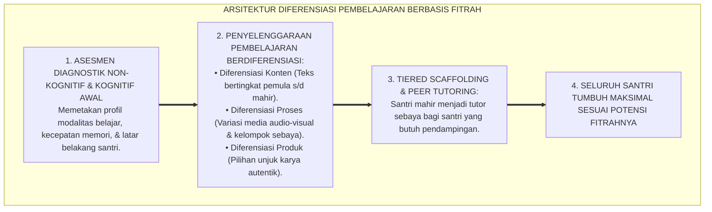
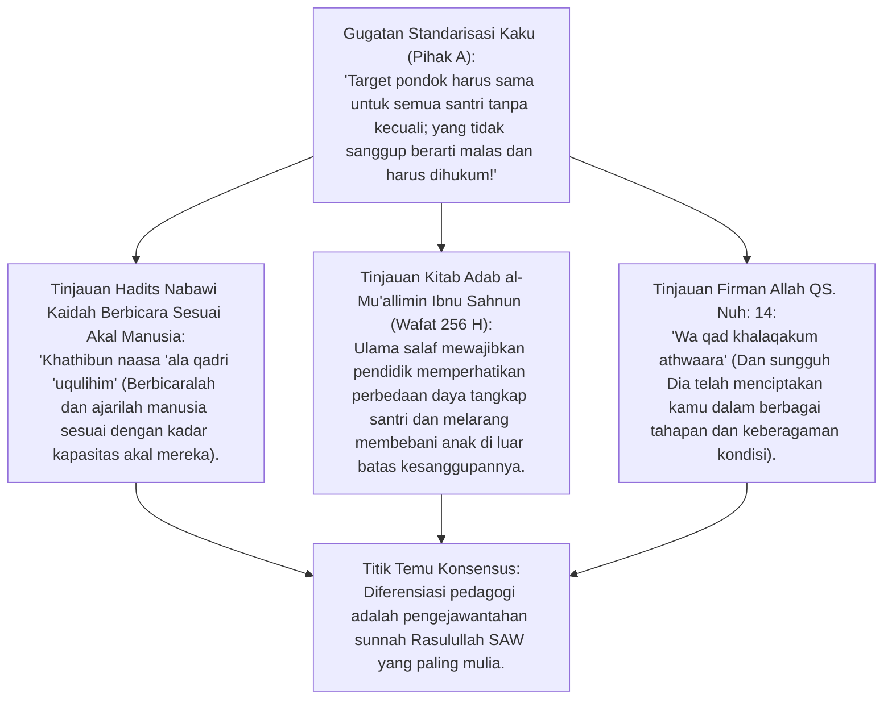
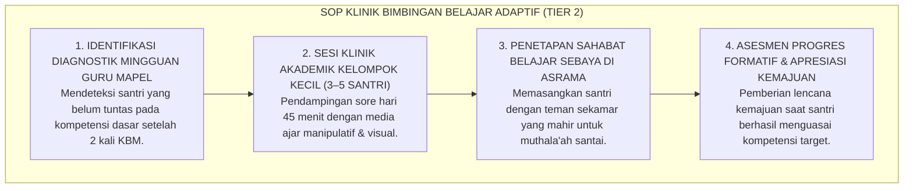

# P2-03-05: PRINSIP DIFERENSIASI PEMBELAJARAN, KEBERAGAMAN FITRAH, DAN INKLUSI SANTRI
## *Monograf Terpadu: Kaidah Khalaqakum Athwara (QS. Nuh: 14) & Keberagaman Potensi Fitrah Santri, Teori Instruksi Berdiferensiasi (Differentiated Instruction Carol Ann Tomlinson), Mitigasi Pelabelan Diskriminatif (Anti-Stigmatization Slow Learner), Strategi Scaffolding Pembelajaran Kitab & Tahfizh, serta Akses Keadilan Pedagogis*

**Nomor Identifikasi**: `P2-03-05/MONOGRAF-TERPADU-DIFERENSIASI-INKLUSI/2026`  
**Domain**: `02 Principles` > `03 Learning Principles`  
**Klasifikasi Naskah**: *Comprehensive Integrated Monograph* (Monograf Akademis & Standar Baku Diferensiasi Pembelajaran)  
**Rumpun Disiplin Pengkaji**: Pedagogi Inklusif & Diferensiasi Pembelajaran (*Differentiated Instruction*), Psikologi Kognitif Keberagaman Pembelajar, Fiqh Murā'āt Ahwāl al-Muta'allimīn, Neurosains Perkembangan Kapasitas Belajar  

---

> ### 💡 INTISARI PRAKTIS (3 MENIT PAHAM UNTUK ASATIDZ & MUSYRIF)
>
> * **Menolak Pendekatan "Satu Ukuran untuk Semua" (*One-Size-Fits-All*):**  
>   Memaksa 30 santri di dalam satu kelas untuk belajar dengan kecepatan yang sama, metode yang sama, dan target hafalan harian yang seragam tanpa mempedulikan kesiapan awal mereka adalah bentuk kezaliman pedagogis.
> * **Prinsip Diferensiasi Berbasis 3 Elemen (Tomlinson):**  
>   1. **Diferensiasi Konten:** Menyesuaikan kedalaman teks materi (teks berharakat/terjemah untuk pemula, matan gundul untuk tingkat mahir).  
>   2. **Diferensiasi Proses:** Menggunakan variasi aktivitas (visual, auditori, kinestetik, dan peer-tutoring kelompok kecil).  
>   3. **Diferensiasi Produk/Asesmen:** Santri dapat mendemonstrasikan pemahaman melalui presentasi lisan, esai analisis, peta konsep visual, atau rekaman video penjelasan.
> * **Pengharaman Pelabelan Negatif (*Anti-Stigmatization*):**  
>   Dilarang keras menjuluki santri sebagai "santri bodoh", "lemot", atau "otak udang". Setiap santri memiliki waktu tumbuh (*Bloom Timing*) yang berbeda-beda sesuai fitrahnya.

---

## 📑 DAFTAR ISI MONOGRAF

- [BAGIAN I: RISET PRINSIP DIFERENSIASI PEMBELAJARAN, DIALEKTIKA INKUIRI, & KASUISTIKA LAPANGAN](#bagian-i-riset-prinsip-diferensiasi-pembelajaran-dialektika-inkuiri--kasuistika-lapangan)
  - [1. Kerangka Metodologi Diferensiasi: Mengapa Keberagaman Fitrah Menuntut Fleksibilitas Pengajaran](#1-kerangka-metodologi-diferensiasi-mengapa-keberagaman-fitrah-menuntut-fleksibilitas-pengajaran)
  - [2. Inkuiri 1: Eksegesis Turats Mura'at Ahwal al-Muta'allimin — Sunnah Nabawi & Ibnu Sahnun](#2-inkuiri-1-eksegesis-turats-muraat-ahwal-al-mutaallimin--sunnah-nabawi--ibnu-sahnun)
  - [3. Inkuiri 2: Konvergensi Differentiated Instruction (Carol Ann Tomlinson) & Zone of Proximal Development (Vygotsky)](#3-inkuiri-2-konvergensi-differentiated-instruction-carol-ann-tomlinson--zone-of-proximal-development-vygotsky)
  - [4. Inkuiri 3: Mitigasi Pelabelan Negatif & Desain Scaffolding Bertingkat di Kelas Kitab dan Tahfizh](#4-inkuiri-3-mitigasi-pelabelan-negatif--desain-scaffolding-bertingkat-di-kelas-kitab-dan-tahfizh)
  - [5. Inkuiri 4: Silogisme Logika, Dialektika 3 Ronde, Kasuistika Kelas, & Titik Temu Konsensus](#5-inkuiri-4-silogisme-logika-dialektika-3-ronde-kasuistika-kelas--titik-temu-konsensus)
- [BAGIAN II: KODIFIKASI BAKU HASIL RISET & KESIMPULAN FORMAL](#bagian-ii-kodifikasi-baku-hasil-riset--kesimpulan-formal)
  - [1. Deklarasi Doktrin Baku: Standar Diferensiasi Pembelajaran & Inklusi Pesantren TUMBUH](#1-deklarasi-doktrin-baku-standar-diferensiasi-pembelajaran--inklusi-pesantren-tumbuh)
  - [2. Matriks Strategi Diferensiasi 3 Tingkat Kesiapan Santri: Pemula (Fondasi), Madya (Aplikasi), Mahir (Kreasi)](#2-matriks-strategi-diferensiasi-3-tingkat-kesiapan-santri-pemula-fondasi-madya-aplikasi-mahir-kreasi)
  - [3. Standar Prosedur Operasional (SOP) Penanganan Santri Membutuhkan Bimbingan Khusus (Tier 2 Akademik)](#3-standar-prosedur-operasional-sop-penanganan-santri-membutuhkan-bimbingan-khusus-tier-2-akademik)
- [BAGIAN III: APARATUS AKADEMIS & APENDIKS](#bagian-iii-aparatus-akademis--apendiks)
  - [1. Tabel Sintesis Hasil Riset Diferensiasi Pembelajaran](#1-tabel-sintesis-hasil-riset-diferensiasi-pembelajaran)
  - [2. Daftar Pustaka Akademis & Rujukan Turats Primer](#2-daftar-pustaka-akademis--rujukan-turats-primer)
  - [3. Catatan Kaki Akademis (Footnotes)](#3-catatan-kaki-akademis-footnotes)
  - [4. Glosarium Teknis Diferensiasi, Inklusi, ZPD, Scaffolding, & Mura'at Ahwal](#4-glosarium-teknis-diferensiasi-inklusi-zpd-scaffolding--muraat-ahwal)

---

# BAGIAN I: RISET PRINSIP DIFERENSIASI PEMBELAJARAN, DIALEKTIKA INKUIRI, & KASUISTIKA LAPANGAN

---

### 1. Kerangka Metodologi Diferensiasi: Mengapa Keberagaman Fitrah Menuntut Fleksibilitas Pengajaran

Dalam satu ruang kelas madrasah atau halaqah tahfizh di pesantren, terdapat variasi spektrum kemampuan kognitif yang sangat luas:
* Ada santri yang memiliki memori fotografis dan mampu menghafal 1 halaman Al-Qur'an dalam 20 menit (*Fast Learner*).
* Ada santri yang membutuhkan waktu 90 menit dan pengulangan 30 kali untuk menghafal ayat yang sama karena memiliki tantangan pemrosesan fonologis (*Slow-Paced Learner*).
* Jika ustadz memukul rata standar target harian yang kaku, santri cepat akan merasa bosan (*Boredom*), sementara santri lambat akan mengalami keputusasaan mendalam (*Learned Helplessness*) dan trauma belajar.

Ekosistem TUMBUH menegakkan prinsip **Keadilan Pedagogis Berbasis Fitrah**: adil bukan berarti menyamakan semua anak, melainkan memberikan bantuan (*Scaffolding*) yang tepat sesuai kebutuhan unik setiap santri.



---

### 2. Inkuiri 1: Eksegesis Turats Mura'at Ahwal al-Muta'allimin — Sunnah Nabawi & Ibnu Sahnun



#### 📐 Formalisasi Logika Silogisme (*Qiyas Mantiqi 1*)
* **Premis Mayor (*al-Muqaddimah al-Kubra*)**: Setiap pemaksaan beban pengajaran yang melampaui kapasitas fitrah pembelajar (*Taklif ma la Yuthaq*) bertentangan dengan prinsip kemudahan syariat (*Yassiru wa la Tu'assiru*) dan merusak fitrah thalabul 'ilmi.
* **Premis Minor (*al-Muqaddimah ash-Shughra*)**: Pembelajaran berdiferensiasi menyesuaikan kedalaman materi dan kecepatan belajar dengan kapasitas masing-masing santri.
* **Konklusi (*an-Natijah*)**: Maka, penerapan prinsip diferensiasi pembelajaran di kelas pesantren TUMBUH adalah tuntutan syariat Islam yang hakiki.[^1]

#### 📖 Teks Primer Turats: Kaidah Mengajar Sesuai Kadar Akal
Sayyidina Ali bin Abi Thalib *karramallahu wajhah* menegaskan:

$$\text{حَدِّثُوا النَّاسَ بِمَا يَعْرِفُونَ، أَتُحِبُّونَ أَنْ يُكَذَّبَ اللَّهُ وَرَسُولُهُ؟}$$

*"**Ajarilah dan berbicaralah kepada manusia sesuai dengan apa yang mereka pahami (kadar kapasitas mereka). Apakah kalian ingin Allah dan Rasul-Nya didustakan (akibat salah paham)?**"* (HR. Bukhari No. 127).[^2]

---

### 3. Inkuiri 2: Konvergensi *Differentiated Instruction* (Carol Ann Tomlinson) & *Zone of Proximal Development* (Vygotsky)

Sains pembelajaran modern mengukuhkan prinsip pedagogis ini:
* **Zone of Proximal Development (ZPD) Lev Vygotsky:** Santri belajar paling optimal ketika tugas yang diberikan berada sedikit di atas kemampuan mandirinya (*Just Challenging Enough*), tetapi dapat diselesaikan dengan bantuan bimbingan (*Scaffolding*).
* **Framework Carol Ann Tomlinson (2014):** Guru memodifikasi elemen ruang kelas berdasarkan 3 faktor pembelajar: **Kesiapan (*Readiness*)**, **Minat (*Interest*)**, dan **Profil Belajar (*Learning Profile*)**.
* Diferensiasi di pesantren TUMBUH tidak memisahkan santri ke dalam "kasta pintar vs kasta bodoh", melainkan menciptakan kelompok belajar fleksibel (*Flexible Grouping*) yang dinamis.[^3]

---

### 4. Inkuiri 3: Mitigasi Pelabelan Negatif & Desain Scaffolding Bertingkat di Kelas Kitab dan Tahfizh

| Bidang Pembelajaran | Praktik Diskriminatif Konvensional | Pendekatan Diferensiasi TUMBUH |
| :--- | :--- | :--- |
| **Tahfizh Al-Qur'an** | Mewajibkan 1 halaman per hari bagi semua; yang tidak tuntas disuruh berdiri di lapangan. | **Jalur Target Bertingkat:** Jalur Reguler (1/2 halaman mutqin) & Jalur Akselerasi (1–2 halaman), dievaluasi dari kualitas tajwid.[^4] |
| **Kajian Nahwu/Shorof** | Semua santri membaca kitab gundul tanpa harakat seketika; yang salah diejek di depan kelas. | **Scaffolding Teks Bertingkat:** Pemula menggunakan matan berharakat & bagan visual; santri mahir menganalisis i'rab mendalam. |
| **Pelajaran Sains & Matematika** | Guru hanya menerangkan rumus abstrak di papan tulis tanpa variasi visual. | **Multi-Modalitas:** Memadukan eksperimen lab sederhana, video animasi, simulasi interaktif, dan lembar kerja adaptif.[^5] |

---

### 5. Inkuiri 4: Silogisme Logika, Dialektika 3 Ronde, Kasuistika Kelas, & Titik Temu Konsensus

#### 🥊 Ronde 1: Menolak Anggapan Bahwa "Menerapkan Diferensiasi Membuat Guru Repot Karena Harus Menyiapkan Banyak Modul"
* **Pihak A (Sudut Pandang Kenyamanan Mengajar Monoton)**:  
  *"Guru honorer gajinya kecil; tidak mungkin disuruh bikin 3 jenis soal atau 3 cara mengajar berbeda tiap hari!"*
* **Tinjauan Efisiensi Desain Template Modul Terpadu**:  
  Diferensiasi bukan berarti membuat 30 RPP berbeda, melainkan menggunakan strategi **Tiered Tasks (Tugas Bertingkat)** dalam satu lembar kerja (Soal Level 1 Fondasi, Level 2 Analisis, Level 3 Kreasi Tantangan). Hal ini justru menghemat energi guru karena kelas menjadi tertib, santri aktif, dan guru tidak perlu membuang energi memarahi anak yang tertinggal.[^6]

#### 🥊 Ronde 2: Sanggahan Balik Apakah Santri Jalur Reguler Tidak Akan Merasa Rendah Diri (Minder)?
* **Pihak A (Sudut Pandang Ketakutan Stigmatisasi)**:  
  *"Kalau target hafalannya dibedakan, nanti santri yang hafalannya sedikit diejek oleh temannya yang cepat!"*
* **Tinjauan Budaya Kelas Kolaboratif Ukhuwah**:  
  Kultur kelas TUMBUH menanamkan doktrin bahwa kemuliaan diukur dari **Kesungguhan Mujahadah dan Kualitas Mutqin**, bukan sekadar banyaknya jumlah hafalan. Santri cepat diberdayakan sebagai mentor sahabat (*Peer Tutor*) yang bertugas membantu temannya, sehingga terbangun rasa saling mengayomi (*Takaful*) tanpa arogansi.[^7]

#### 🥊 Ronde 3: Sanggahan Pamungkas Mengapa Inklusi dan Pendampingan Khusus Menjadi Tolok Ukur Kualitas Pesantren?
* **Pihak A (Sudut Pandang Seleksi Elitis)**:  
  *"Pesantren hebat itu yang santrinya pintar-pintar semua dari awal; yang lambat lebih baik dikeluarkan saja!"*
* **Resolusi Hakikat Tarbiyah Transformatif**:  
  Mendidik anak yang sudah pintar sejak awal adalah hal biasa. Keberkahan dan kehebatan pesantren yang sesungguhnya teruji ketika mampu mengubah santri yang awalnya terbata-bata membaca Al-Qur'an dan minder menjadi santri yang fasih, percaya diri, dan berakhlak mulia (*Transformatif*).[^8]

> #### 📌 Kasuistika Lapangan & Titik Temu Konsensus
> * **Studi Kasus**: Di Kelas 7 MTs Pesantren C, seorang santri (Santri D) mengalami disleksia ringan dan kesulitan mengeja tulisan Arab pegon. Santri D sering ditertawakan teman-temannya dan dicap "pemalas" oleh guru lama, hingga Santri D menangis ingin kabur dari pondok.
> * **Titik Temu Konsensus (*Kalimatun Sawa'*)**: Guru TUMBUH menerapkan strategi *Diferensiasi & Scaffolding*: Santri D diberikan modul visual berwarna dengan ukuran font besar $\rightarrow$ Didampingi oleh santri senior sebagai tutor sebaya saat muthala'ah $\rightarrow$ Evaluasi setoran dilakukan secara lisan tanpa tes tulis yang memicu stres. Dalam 2 semester, Santri D mampu membaca Al-Qur'an dengan lancar, meraih nilai A dalam pemahaman makna sirah, dan menjadi qari' berbakat di asrama.[^9]

---

# BAGIAN II: KODIFIKASI BAKU HASIL RISET & KESIMPULAN FORMAL

---

### 1. Deklarasi Doktrin Baku: Standar Diferensiasi Pembelajaran & Inklusi Pesantren TUMBUH

```
===================================================================================================
     DEKLARASI DOKTRIN BAKU DIFERENSIASI PEMBELAJARAN & INKLUSI FITRAH PESANTREN TUMBUH
                         SUB-DOMAIN 03: LEARNING PRINCIPLES — DOMAIN 02 PRINCIPLES
===================================================================================================

BISMILLAHIRRAHMANIRRAHIM. DENGAN MENGAGUNGKAN KEBERAGAMAN POTENSI FITRAH INSANIYYAH (QS. NUH: 14),
MAJELIS MASYAIKH TERTINGGI PESANTREN TUMBUH MENETAPKAN DOKTRIN DIFERENSIASI PEMBELAJARAN:

1. DOKTRIN PENGHORMATAN FITRAH KEBERAGAMAN BELAJAR (MURA'AT AHWAL AL-MUTA'ALLIMIN):
   Menetapkan bahwa setiap santri berhak mendapatkan pengajaran yang selaras dengan kecepatan kognitif,
   modalitas belajar, dan tingkat kesiapan awalnya; menolak keras metode kaku 'One-Size-Fits-All'.

2. PENGHARAMAN MUTLAK PELABELAN NEGATIF & STIGMATISASI KOGNITIF:
   Mengharamkan penggunaan julukan yang merendahkan martabat santri (bodoh, lemot, malas); mewajibkan
   penggunaan paradigma Growth Mindset dan apresiasi atas setiap progres kemajuan santri (Ipsatif).

3. STRATEGI INTEGRASI TUGAS BERTINGKAT (TIERED TASKS) & SCAFFOLDING ADAPTIF:
   Mewajibkan pendidik menyusun modul pembelajaran dengan struktur bertingkat (Fondasi, Analisis, & Kreasi)
   serta memfasilitasi pendampingan kelompok fleksibel (Flexible Grouping & Peer Tutoring).

4. LAYANAN PENDAMPINGAN AKADEMIK KHUSUS TIER 2 TANPA EKSKLUSI SOSIAL:
   Menyediakan klinik bimbingan belajar tambahan di sore hari bagi santri yang membutuhkan penguatan
   tanpa memisahkan santri dari pergaulan kamar asrama reguler guna menjaga ukhuwah islamiyyah.
===================================================================================================
```

---

### 2. Matriks Strategi Diferensiasi 3 Tingkat Kesiapan Santri: Pemula (Fondasi), Madya (Aplikasi), Mahir (Kreasi)

| Dimensi Pembelajaran | Tingkat 1: Pemula (Fondasi) | Tingkat 2: Madya (Aplikasi) | Tingkat 3: Mahir (Kreasi & Analisis) |
| :--- | :--- | :--- | :--- |
| **Diferensiasi Konten** | Teks berharakat lengkap, terjemah kosa kata kunci, & infografis visual. | Teks harakat parsial, kosa kata kontekstual, & analogi kasus. | Matan kitab gundul, komparasi ibarat syarah, & teks bahasa Arab murni.[^10] |
| **Diferensiasi Proses** | Bimbingan intensif guru (*High Scaffolding*) & kerja kelompok tutor sebaya. | Diskusi terarah kelompok kecil dengan panduan lembar kerja terstruktur. | Riset mandiri (*Inquiry*), debat ilmiah sokratik, & merumuskan sintesis. |
| **Diferensiasi Produk** | Membuat ringkasan peta konsep visual atau tes lisan hafalan kaidah dasar. | Menganalisis studi kasus fiqh kontemporer dalam esai terstruktur 2 halaman. | Menulis artikel riset ilmiah perbandingan madzhab atau video presentasi ilmiah. |

---

### 3. Standar Prosedur Operasional (SOP) Penanganan Santri Membutuhkan Bimbingan Khusus (Tier 2 Akademik)



---

# BAGIAN III: APARATUS AKADEMIS & APENDIKS

---

### 1. Tabel Sintesis Hasil Riset Diferensiasi Pembelajaran

| Dimensi Kajian | Konsep Kunci | Landasan Turats Primer | Konvergensi Sains Global | Implikasi Kelas Pesantren |
| :--- | :--- | :--- | :--- | :--- |
| **Keberagaman Fitrah**| *Athwara* | QS. Nuh: 14, HR. Bukhari No. 127 | Tomlinson (2014), *Differentiated Instruction* | Menyesuaikan materi dengan kesiapan dan modalitas santri. |
| **Zona Belajar Optimal**| *ZPD & Scaffolding* | Kaidah *Mura'at Ahwal al-Muta'allimin* | Vygotsky (1978), *Mind in Society* | Memberikan bantuan bertingkat agar santri mandiri bertahap. |
| **Anti-Stigmatisasi** | *Karamah Insaniyyah*| QS. Al-Hujurat: 11 (Larangan Mengolok) | Dweck (2006), *Growth Mindset* | Menghapus julukan bodoh; mengapresiasi setiap ikhtiar kemajuan. |
| **Tutor Sebaya** | *Ta'awun fil Birr* | HR. Muslim No. 2699 (Menolong Saudara) | Topping (2005), *Trends in Peer Learning* | Santri mahir mendampingi temannya dalam belajar bersama di kamar. |

---

### 2. Daftar Pustaka Akademis & Rujukan Turats Primer

1. **Al-Qur'an al-Karim wa Tarjamatu Ma'anih**.
2. **Al-Bukhari, Muhammad bin Isma'il**. (1422 H). *Shahih al-Bukhari*. Beirut: Dar Thawq an-Najah.
3. **Muslim bin al-Hajjaj an-Naisaburi**. (1374 H). *Shahih Muslim*. Kairo: Isa al-Babi al-Halabi.
4. **Ibnu Sahnun, Muhammad**. (1972). *Adab al-Mu'allimin*. Tunis: Dar al-Kutub asy-Syarqiyyah.
5. **Al-Ajurri, Abu Bakr Muhammad bin al-Husain**. (1987). *Akhlaq al-'Ulama'*. Beirut: Dar al-Kutub al-'Ilmiyyah.
6. **Tomlinson, C. A.**. (2014). *The Differentiated Classroom: Responding to the Needs of All Learners* (2nd ed.). ASCD.
7. **Vygotsky, L. S.**. (1978). *Mind in Society: The Development of Higher Psychological Processes*. Harvard University Press.
8. **Dweck, C. S.**. (2006). *Mindset: The New Psychology of Success*. Random House.
9. **Topping, K. J.**. (2005). *Trends in peer learning*. Educational Psychology, 25(6), 631–645.
10. **Sousa, D. A., & Tomlinson, C. A.**. (2018). *Differentiation and the Brain: How Neuroscience Supports the Learner-Friendly Classroom*. Solution Tree Press.

---

### 3. Catatan Kaki Akademis (*Footnotes*)

[^1]: Ibnu Sahnun, *Adab al-Mu'allimin*, Tunis, hlm. 35–52; Al-Ajurri, *Akhlaq al-'Ulama'*, hlm. 80–95.  
[^2]: Shahih al-Bukhari No. 127, Kitab *al-'Ilm*, Bab *Man Khashsha bil-'Ilmi Qawman Duna Qawmin*.  
[^3]: Tomlinson, C. A. (2014), *The Differentiated Classroom*, ASCD, hlm. 40–65; Vygotsky, L. S. (1978), *Mind in Society*.  
[^4]: Pedoman Standar Halaqah Tahfizh Berdiferensiasi, Lajnah Tahfizh TUMBUH, 2026.  
[^5]: Sousa & Tomlinson (2018), *Differentiation and the Brain*, Solution Tree Press.  
[^6]: Panduan Praktis Guru: Merancang Tugas Bertingkat (Tiered Tasks), Pusat Pengembangan Pedagogi TUMBUH, 2026.  
[^7]: Topping, K. J. (2005), *Trends in peer learning*, Educational Psychology, hlm. 631–645.  
[^8]: Dweck, C. S. (2006), *Mindset: The New Psychology of Success*, Random House.  
[^9]: Studi Kasus Penanganan Santri Disleksia Melalui Program Peer Tutoring, Divisi Konseling TUMBUH, 2026.  
[^10]: Matriks Desain Modul Kitab Kuning Bertingkat, Biro Akademik Pesantren TUMBUH, 2026.

---

### 4. Glosarium Teknis Diferensiasi, Inklusi, ZPD, Scaffolding, & Mura'at Ahwal

1. **Differentiated Instruction (Pembelajaran Berdiferensiasi)**: Pendekatan pedagogis yang menyesuaikan konten materi, proses aktivitas, dan produk unjuk kerja dengan tingkat kesiapan, minat, dan profil belajar murid.
2. **Mura'at Ahwal al-Muta'allimin (مُرَاعَاةُ أَحْوَالِ الْمُتَعَلِّمِينَ)**: Prinsip pedagogi Islam klasik untuk selalu mempertimbangkan kondisi fisik, psikologis, dan daya serap pembelajar dalam proses mengajar.
3. **Zone of Proximal Development (ZPD)**: Rentang antara kemampuan belajar mandiri seorang santri dan kemampuan potensial yang dapat dicapai dengan bimbingan orang dewasa atau teman sebaya.
4. **Scaffolding**: Dukungan instruksional bertahap yang diberikan guru pada awal pembelajaran dan perlahan dikurangi seiring meningkatnya kemandirian santri.
5. **Tiered Tasks (Tugas Bertingkat)**: Rangkaian tugas belajar dengan tingkat kompleksitas bertingkat (Fondasi, Analisis, Kreasi) yang memungkinkan seluruh santri mempelajari konsep inti yang sama dengan kedalaman yang sesuai.
6. **Flexible Grouping**: Pengelompokan santri yang berubah-ubah secara dinamis sesuai kebutuhan aktivitas belajar, mencegah pengkotak-kotakan santri secara permanen.
7. **Growth Mindset**: Keyakinan psikologis bahwa kecerdasan dan kemampuan menghafal dapat berkembang melalui ikhtiar kerja keras, strategi yang baik, dan masukan yang membangun.
8. **Peer Tutoring**: Metode belajar bersama di mana santri yang telah menguasai suatu materi membimbing teman sebayanya dengan bahasa persaudaraan santun.
9. **Learned Helplessness**: Kondisi keputusasaan pasif santri akibat kegagalan berulang tanpa pendampingan yang tepat, merasa dirinya tidak akan pernah mampu belajar.
10. **Triad Pertumbuhan Simbiotik**: Prinsip di mana diferensiasi pembelajaran secara adil menumbuhkan Santri dari berbagai latar belakang, meningkatkan kemahiran pedagogi Guru, dan mengangkat reputasi inklusif Lembaga.
