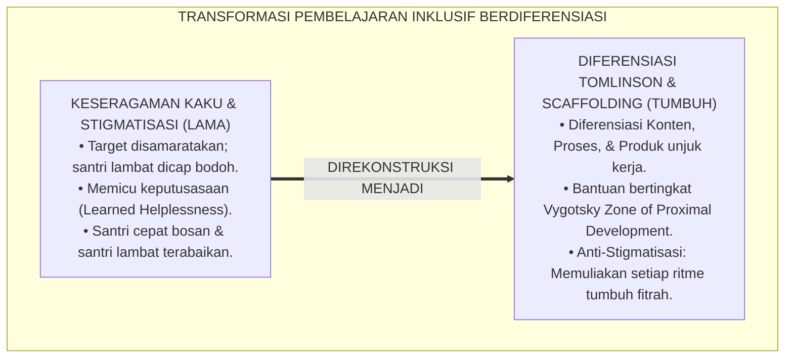
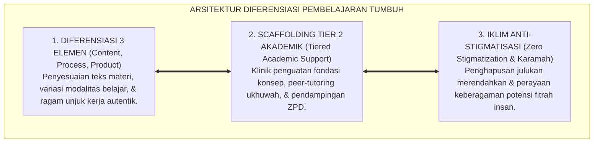
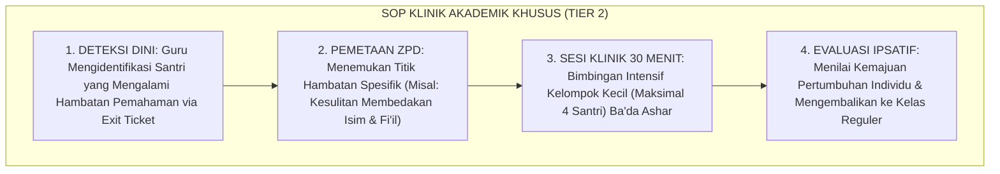
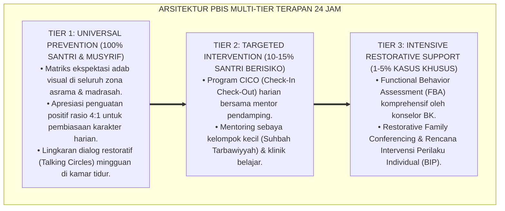

# P2-03-05: PRINSIP DIFERENSIASI PEMBELAJARAN, KEBERAGAMAN FITRAH, DAN INKLUSI SANTRI (DIFFERENTIATED INSTRUCTION & INCLUSIVE LEARNING)
## *Monograf Riset Akademik: Kaidah Khalaqakum Athwara (QS. Nuh: 14) & Keberagaman Potensi Fitrah, Differentiated Instruction Carol Ann Tomlinson, Mitigasi Stigmatisasi Negatif, Serta Strategi Scaffolding Vygotsky di Pesantren 24 Jam*

**Nomor Identifikasi**: `P2-03-05/MONOGRAF-RISET-DIFERENSIASI-INKLUSI/2026`  
**Domain**: `02 Principles` > `03 Learning Principles` (Prinsip Pembelajaran 05: *Differentiated Instruction & Inclusive Learning*)  
**Klasifikasi Naskah**: *Academic Research Monograph* (Monograf Riset Akademik Prinsip Pembelajaran)  
**Rumpun Disiplin Pengkaji**: Pedagogi Inklusif & Diferensiasi Pembelajaran (*Differentiated Instruction*), Psikologi Kognitif Keberagaman Pembelajar, Fiqh Mura'at Ahwal al-Muta'allimin, Neurosains Perkembangan Kapasitas Belajar  

---

> ### 💡 INTISARI EKSEKUTIF (EXECUTIVE SUMMARY)
>
> * **Kelemahan Paradigma Lama: Tirani "Satu Ukuran untuk Semua" (One-Size-Fits-All) & Pelabelan Negatif:**  
>   Banyak pengajar memaksakan target kecepatan hafalan dan penguasaan kitab yang seragam kepada seluruh santri tanpa mempedulikan perbedaan kesiapan kognitif awal. Santri yang membutuhkan waktu belajar lebih lambat dicap sebagai "santri pemalas" atau "otak udang" (*Labeling*), memicu keputusasaan belajar (*Learned Helplessness*).
> * **Inovasi Konseptual: Fiqh Mura'at Ahwal al-Muta'allimin & Differentiated Instruction (Tomlinson):**  
>   TUMBUH menegakkan firman Allah: *"Dia telah menciptakan kamu dalam beberapa tingkatan/tahapan perkembangan"* (QS. Nuh: 14) dan kaidah turats *Mura'at Ahwal al-Muta'allimin*. Mengadopsi teori **Differentiated Instruction Carol Ann Tomlinson**: mendiferensiasikan 3 elemen (Konten materi berjenjang, Proses scaffolding Vygotsky *Zone of Proximal Development*, dan Produk demonstrasi pemahaman) dengan kebijakan mutlak **Anti-Stigmatisasi Santri**.
> * **Formulasi Operasional & Penjaminan Keadilan Pedagogis:**  
>   Monograf ini menguraikan matriks strategi diferensiasi 3 tingkat kesiapan (Pemula, Madya, Mahir), SOP bimbingan klinik akademik khusus (Tier 2 Akademik), protokol peer-tutoring sebaya, dan etika pemuliaan keberagaman fitrah.

---

## 📑 DAFTAR ISI MONOGRAF

- [BAB I: LANDASAN TEORETIS & DISKURSUS KRITIS](#bab-i-landasan-teoretis--diskursus-kritis)
  - [1. Latar Belakang Masalah: Kritik atas Keseragaman Kaku (One-Size-Fits-All) dan Bahaya Stigmatisasi Negatif](#1-latar-belakang-masalah-kritik-atas-keseragaman-kaku-one-size-fits-all-dan-bahaya-stigmatisasi-negatif)
  - [2. Eksegesis Turats Keberagaman Fitrah: QS. Nuh: 14, Kaidah Mura'at Ahwal al-Muta'allimin, & Sunnah Nabawiyyah](#2-eksegesis-turats-keberagaman-fitrah-qs-nuh-14-kaidah-muraat-ahwal-al-mutaallimin--sunnah-nabawiyyah)
  - [3. Konvergensi Sains Pembelajaran Berdiferensiasi: Differentiated Instruction (Tomlinson) & ZPD (Vygotsky)](#3-konvergensi-sains-pembelajaran-berdiferensiasi-differentiated-instruction-tomlinson--zpd-vygotsky)
  - [4. Rekayasa Didaktik Scaffolding Bertingkat & Pengharaman Total Pelabelan Negatif Santri](#4-rekayasa-didaktik-scaffolding-bertingkat--pengharaman-total-pelabelan-negatif-santri)
  - [5. Kasuistika Lapangan: Kasus Santri Mengalami Hambatan Belajar Bahasa Arab & Resolusi Diferensiasi](#5-kasuistika-lapangan-kasus-santri-mengalami-hambatan-belajar-bahasa-arab--resolusi-diferensiasi)
- [BAB II: FORMULASI KONSEPTUAL & PEMBAHASAN MENDALAM](#bab-ii-formulasi-konseptual--pembahasan-mendalam)
  - [1. Eksplanasi Teoretis Standar Diferensiasi Pembelajaran & Inklusi Pesantren TUMBUH](#1-eksplanasi-teoretis-standar-diferensiasi-pembelajaran--inklusi-pesantren-tumbuh)
  - [2. Matriks Strategi Diferensiasi Tiga Tingkat Kesiapan: Pemula (Fondasi), Madya (Aplikasi), Mahir (Kreasi)](#2-matriks-strategi-diferensiasi-tiga-tingkat-kesiapan-pemula-fondasi-madya-aplikasi-mahir-kreasi)
  - [3. Standar Prosedur Operasional (SOP) Penanganan Santri Membutuhkan Bimbingan Khusus (Tier 2 Akademik)](#3-standar-prosedur-operasional-sop-penanganan-santri-membutuhkan-bimbingan-khusus-tier-2-akademik)
  - [4. Protokol Pendampingan Sebaya (Peer-Tutoring Scaffolding Protocol)](#4-protokol-pendampingan-sebaya-peer-tutoring-scaffolding-protocol)
  - [5. Diskusi Filosofis Mendalam & Implikasi bagi Masa Depan Peradaban Pendidikan Islam](#5-diskusi-filosofis-mendalam--implikasi-bagi-masa-depan-peradaban-pendidikan-islam)
- [BAB III: KESIMPULAN & APARATUS AKADEMIS](#bab-iii-kesimpulan--aparatus-akademis)
  - [1. Tabel Sintesis Temuan Riset Diferensiasi Pembelajaran & Inklusi](#1-tabel-sintesis-temuan-riset-diferensiasi-pembelajaran--inklusi)
  - [2. Daftar Pustaka Akademis & Rujukan Turats Primer](#2-daftar-pustaka-akademis--rujukan-turats-primer)
  - [3. Catatan Kaki Akademis (Footnotes)](#3-catatan-kaki-akademis-footnotes)
  - [4. Glosarium Istilah Ilmiah & Turats Diferensiasi Pembelajaran](#4-glosarium-istilah-ilmiah--turats-diferensiasi-pembelajaran)

---

# BAB I: LANDASAN TEORETIS & DISKURSUS KRITIS

---

### 1. Latar Belakang Masalah: Kritik atas Keseragaman Kaku (One-Size-Fits-All) dan Bahaya Stigmatisasi Negatif

Di banyak ruang kelas madrasah dan halaqah tahfizh pesantren, terdapat variasi rentang kecepatan belajar yang sangat luas:
* Sebagian santri memiliki daya ingat fotografis dan mampu menghafal 1 halaman dalam 20 menit (*Fast-Paced Learner*).
* Sebagian santri lainnya membutuhkan waktu 90 menit dan bantuan artikulasi berulang karena memiliki tantangan pemrosesan fonologis (*Slow-Paced Learner*).
* **Kezaliman Pedagogis Keseragaman Kaku**: Memaksa seluruh santri belajar dengan kecepatan, teks materi, dan tugas yang sama persis. Akibatnya santri cepat merasa jenuh (*Boredom*), sementara santri lambat dicap bodoh, mengalami keputusasaan (*Learned Helplessness*), dan trauma belajar.
* **Keniscayaan Diferensiasi Pembelajaran**: Adil bukanlah menyamaratakan semua perlakuan, melainkan memberikan dukungan (*Scaffolding*) yang tepat sesuai fitrah dan kesiapan unik setiap santri.[^1]

---

### 2. Eksegesis Turats Keberagaman Fitrah: QS. Nuh: 14, Kaidah Mura'at Ahwal al-Muta'allimin, & Sunnah Nabawiyyah

Al-Qur'an menegaskan sunnatullah keberagaman fase penciptaan dan kapasitas manusia:

$$\text{وَقَدْ خَلَقَكُمْ أَطْوَارًا}$$

*"**Padahal sungguh, Dia telah menciptakan kamu dalam beberapa tingkatan/tahapan keadaan (yang beraneka ragam)**."* (QS. Nuh [71]: 14).[^2]

Para pakar pedagogi Islam klasik (seperti Ibnu Sahnun dalam *Adab al-Mu'allimin* dan Imam Al-Ghazali) merumuskan kaidah emas:

$$\text{مُرَاعَاةُ أَحْوَالِ الْمُتَعَلِّمِينَ وَتَفَاوُتِ عُقُولِهِمْ}$$

*"**Wajib hukumnya bagi pendidik untuk memperhatikan perbedaan kondisi murid dan keberagaman tingkat kecerdasan akal mereka**."*[^3]

Rasulullah ﷺ selalu memberikan nasihat, amalan, dan tugas dakwah yang berbeda-beda kepada para sahabat sesuai keunggulan fitrah masing-masing (Khalid bin Walid di bidang kepemimpinan militer, Zaid bin Tsabit di bidang faraidh dan penerjemahan, dan Abu Hurairah di bidang kekuatan hafalan hadits).[^4]

---

### 3. Konvergensi Sains Pembelajaran Berdiferensiasi: Differentiated Instruction (Tomlinson) & ZPD (Vygotsky)

Sains pedagogi modern membuktikan keunggulan pendekatan berdiferensiasi:
* **Differentiated Instruction** (Carol Ann Tomlinson, 2001; 2014) menetapkan bahwa diferensiasi dilakukan pada 3 komponen utama:
  1. **Konten (*Content*)**: Kedalaman teks materi yang dipelajari disesuaikan dengan tingkat kesiapan awal santri.
  2. **Proses (*Process*)**: Ragam aktivitas belajar (auditori, visual, kinestetik, scaffolding berpasangan).
  3. **Produk (*Product*)**: Santri diberi pilihan mendemonstrasikan pemahaman melalui presentasi lisan, bagan konsep, atau karya tulis.
* **Zone of Proximal Development (ZPD)** (Lev Vygotsky, 1978): Memberikan bantuan belajar yang pas pada zona perkembangan terdekat santri agar mampu melangkah menuju kemandirian penuh.[^5]

---

### 4. Rekayasa Didaktik Scaffolding Bertingkat & Pengharaman Total Pelabelan Negatif Santri

TUMBUH memberlakukan kebijakan perlindungan martabat pembelajar:
* **Pengharaman Pelabelan Negatif (*Zero Stigmatization Policy*)**: Dilarang keras menjuluki santri sebagai "santri lemot", "otak udang", atau "kelas buangan".
* **Klinik Akademik Khusus (Tier 2 PBIS Akademik)**: Santri yang mengalami kesulitan diberikan pendampingan tutorial sebaya (*Peer Tutoring*) atau jam penguatan konsep fondasi secara santun dan ramah.[^6]

---

### 5. Kasuistika Lapangan: Kasus Santri Mengalami Hambatan Belajar Bahasa Arab & Resolusi Diferensiasi

* **Studi Kasus: Tiga Santri Baru yang Belum Pernah Belajar Bahasa Arab Mengalami Stres di Kelas Nahwu**  
  * **Dilema**: Guru langsung menyajikan matan *Al-Jurumiyyah* tanpa harakat; 3 santri tersebut menangis karena tidak paham dan ingin pulang ke rumah.
  * **Resolusi Diferensiasi TUMBUH**: Guru menerapkan strategi diferensiasi Tomlinson: (1) Untuk kelompok pemula, guru menyediakan modul *Nahwu Bergambar dengan Harakat Lengkap* (*Diferensiasi Konten*); (2) Memasangkan mereka dengan santri yang lebih mahir dalam sesi *Peer Tutoring* 15 menit (*Diferensiasi Proses*); (3) Tugas dinilai berdasarkan kemajuan individu (*Ipsative Progress*). Dalam 6 pekan, ketiga santri tersebut berhasil menguasai kaidah dasar nahwu dan merasa percaya diri di kelas.[^7]

---

# BAB II: FORMULASI KONSEPTUAL & PEMBAHASAN MENDALAM

---

### 1. Eksplanasi Teoretis Standar Diferensiasi Pembelajaran & Inklusi Pesantren TUMBUH

Ekosistem TUMBUH merumuskan pedagogi inklusif ke dalam **Arsitektur Tiga Sayap Diferensiasi Beradab (*Arkan at-Ta'lim al-Mutamayyiz*)**:

#### 🔬 Pembahasan Mendalam Tiga Sayap:
1. **Sayap Diferensiasi Tiga Elemen**: Membuka pintu gerbang ilmu selebar-lebarnya bagi seluruh modalitas belajar santri.[^8]
2. **Sayap Scaffolding Tier 2 Akademik**: Menyelamatkan santri yang tertinggal sebelum mengalami keputusasaan belajar.[^9]
3. **Sayap Iklim Anti-Stigmatisasi**: Membentengi rasa percaya diri dan kehormatan martabat seluruh santri.[^10]

---

### 2. Matriks Strategi Diferensiasi Tiga Tingkat Kesiapan: Pemula (Fondasi), Madya (Aplikasi), Mahir (Kreasi)

| Tingkat Kesiapan | Diferensiasi Konten (Teks Materi) | Diferensiasi Proses (Aktivitas Belajar) | Diferensiasi Produk (Asesmen Pemahaman) |
| :--- | :--- | :--- | :--- |
| **1. Tingkat Pemula (Fondasi)**| Matan berharakat lengkap & terjemah kata.| Bimbingan langsung guru & model bertahap.| Menjelaskan konsep dasar dengan bahasa sendiri.|
| **2. Tingkat Madya (Aplikasi)** | Matan harakat parsial & contoh kontekstual.| Diskusi berpasangan (*Think-Pair-Share*).| Meng-i'rab kalimat baru & analisis hukum fiqh.|
| **3. Tingkat Mahir (Kreasi)** | Matan gundul & syarah turats klasik.| Meneliti perbandingan pendapat mazhab.| Menulis esai analisis kritis & mengajar junior.|

---

### 3. Standar Prosedur Operasional (SOP) Penanganan Santri Membutuhkan Bimbingan Khusus (Tier 2 Akademik)

---

### 4. Protokol Pendampingan Sebaya (Peer-Tutoring Scaffolding Protocol)

TUMBUH menetapkan **Protokol Peer-Tutoring Ukhuwah**:
1. **Pemasangan Pasangan Simbiotik**: Santri tingkat mahir dipasangkan dengan santri tingkat pemula sebagai Duta Belajar Sebaya.
2. **Kaidah Adab Tutoring**: Tutor sebaya dilarang menyombongkan diri atau langsung memberikan jawaban; tutor bertugas memandu proses berpikir dengan pertanyaan pemantik santun.
3. **Pemberian Apresiasi Ganda**: Guru memberikan apresiasi kepada kedua belah pihak: santri pemula diapresiasi kemajuannya, dan tutor sebaya diapresiasi keikhlasan adabnya.[^11]

---

### 5. Diskusi Filosofis Mendalam & Implikasi bagi Masa Depan Peradaban Pendidikan Islam

Prinsip diferensiasi pembelajaran dan inklusi santri ini membawa implikasi agung bagi peradaban:

* **Membuktikan Keadilan dan Rahmat Syariat Islam dalam Pendidikan**:  
  Pesantren menjadi rumah ramah bagi seluruh ragam fitrah manusia, membuktikan bahwa setiap anak berharga dan mampu berprestasi sesuai potensinya.
* **Melahirkan Ulama dan Pemimpin yang Mengayomi Seluruh Lapisan Umat**:  
  Santri terdidik dalam budaya inklusif yang saling membantu (*Ta'awun*), menepis benih-benih kesombongan intelektual dan elitisme sempit.
* **Mewujudkan Kembali Kejayaan Halaqah Ilmiah Para Sahabat**:  
  Inilah sunnah kenabian yang mulia: membina setiap insan menjadi versi terbaik dari potensi fitrah yang Allah titipkan (*Rahmatan lil 'Alamin*).[^12]

---

---

### Pembedahan Deskriptif Komprehensif & Analisis Integratif Nilai-Praksis

Penerapan konsep **P2-03-05: PRINSIP DIFERENSIASI PEMBELAJARAN, KEBERAGAMAN FITRAH, DAN INKLUSI SANTRI (DIFFERENTIATED INSTRUCTION & INCLUSIVE LEARNING)** di ekosistem pesantren TUMBUH memerlukan pemahaman multidimensional yang memadukan khazanah turats syariat dan konsensus sains pendidikan modern:

#### A. Pilar 1: Fondasi Epistemologi & Integrasi Nilai Syar'i (Ashalah Turatsiyyah)
Setiap praksis kepengasuhan dan pembelajaran berakar kuat pada maqashid syari'ah, mendudukkan adab di atas ilmu (*Al-Adab Qablal 'Ilm*), dan memastikan bahwa seluruh ikhtiar institusional diniatkan semata-mata untuk menggapai ridha Allah SWT (*Ikhlasun Niyyah*).

#### B. Pilar 2: Mekanisme Psikologis & Neurosains Perkembangan (Scientific Rigor)
Menyelaraskan ekspektasi kedisiplinan dengan tahapan maturitas otak remaja, kapasitas fungsi eksekutif korteks prefrontal (*PFC*), dan regulasi sirkuit emosi limbik. Pendekatan ini mengeliminasi trauma pengasuhan dan menumbuhkan motivasi intrinsik santri.

#### C. Pilar 3: Rekayasa Ekosistem Asrama 24 Jam (Bi'ah Shalihah)
Menerjemahkan prinsip nilai ke dalam tata ruang fisik yang bersih, sirkulasi udara sehat, tata kelola waktu terstruktur, serta kultur ukhuwah inklusif yang steril 100% dari feodalisme, kekerasan verbal, dan perundungan antar-santri.

#### D. Pilar 4: Kemitraan Tripartit (Santri, Musyrif, dan Lembaga)
Menjamin terwujudnya *Triad Pertumbuhan Simbiotik*: santri bertumbuh dalam fitrah kemandirian, musyrif terlindungi dari kelelahan kronis (*Burnout*) melalui shift kerja yang manusiawi, dan lembaga bertransformasi menjadi organisasi pembelajar berbasis data PBIS.

---

### Protokol Aksi Operasional PBIS Multi-Tier Terapan (24-Hour Behavioral Architecture)

---

# BAB III: KESIMPULAN & APARATUS AKADEMIS

---

### 1. Tabel Sintesis Temuan Riset Diferensiasi Pembelajaran & Inklusi

| Dimensi Parameter | Mazhab Keseragaman Kaku (Lama) | Model Kompetisi Elitis Kering | **Diferensiasi Inklusif TUMBUH** | Landasan Rujukan Primer | Implikasi Praksis Lapangan |
| :--- | :--- | :--- | :--- | :--- | :--- |
| **Pandangan Fitrah**| Semua santri wajib sama cepatnya.| Seleksi alam; singkirkan yang lemah.| **Keberagaman Potensi Fitrah Manusia.** | QS. Nuh: 14; Tomlinson (2014).| Konten, proses, & produk berjenjang. |
| **Sikap atas Kelambatan**| Dicap bodoh, pemalas, & dihukum.| Nilai merah dibiarkan tidak lulus.| **Diberikan Scaffolding ZPD yang Tepat.** | Vygotsky (1978); Ibnu Sahnun.| Klinik akademik Tier 2 & bimbingan ramah. |
| **Dukungan Teman** | Ejekan & perundungan bagi yang lemah.| Kompetisi egoistik individual.| **Peer-Tutoring Ukhuwah Simbiotik.** | HR. Muslim (Ta'awun); Bandura.| Santri mahir membimbing pemula ikhlas. |
| **Metode Evaluasi** | Ujian standar kaku seragam.| Peringkat kelas memicu minder.| **Asesmen Autentik & Kemajuan Ipsatif.**| Dylan Wiliam; Al-Ghazali.| Menilai pertumbuhan kemajuan diri sendiri. |
| **Hasil Institusi** | Santri stres, putus asa, & keluar.| Lulusan elitis sombong.| **Seluruh Santri Berkembang Optimal.** | QS. Al-Baqarah: 286; Al-Attas.| Madrasah adil, inklusif, & berkah abadi. |

---

### 2. Daftar Pustaka Akademis & Rujukan Turats Primer

1. **Al-Qur'an al-Karim wa Tarjamatu Ma'anihi**.
2. **Muslim bin al-Hajjaj an-Naisaburi**. (1427 H). *Shahih Muslim*. Riyadh: Dar Thayyibah.
3. **Al-Bukhari, Abu Abdillah Muhammad bin Isma'il**. (1422 H). *Shahih al-Bukhari*. Kairo: Dar Thawq an-Najah.
4. **Ibnu Sahnun, Muhammad bin Abdis Salam**. (1416 H). *Adab al-Mu'allimin*. Kairo: Dar ash-Shahwah.
5. **Al-Ghazali, Abu Hamid Muhammad bin Muhammad**. (2011). *Ihya' 'Ulumiddin* (Kitab al-'Ilm). Beirut: Dar al-Ma'rifah.
6. **Asy'ari, Muhammad Hasyim**. (1415 H). *Adab al-'Alim wal-Muta'allim*. Jombang: Maktabah At-Turats Al-Islami.
7. **Al-Attas, Syed Muhammad Naquib**. (1980). *The Concept of Education in Islam*. Kuala Lumpur: ABIM.
8. **Tomlinson, C. A.**. (2014). *The Differentiated Classroom: Responding to the Needs of All Learners* (2nd ed.). Alexandria: ASCD.
9. **Tomlinson, C. A.**. (2001). *How to Differentiate Instruction in Mixed-Ability Classrooms* (2nd ed.). Alexandria: ASCD.
10. **Vygotsky, L. S.**. (1978). *Mind in Society: The Development of Higher Psychological Processes*. Cambridge: Harvard University Press.
11. **Wood, D., Bruner, J. S., & Ross, G.**. (1976). *The role of tutoring in problem solving*. Journal of Child Psychology and Psychiatry, 17(2), 89–100.
12. **Horner, R. H., & Sugai, G.**. (2015). *School-wide PBIS: An Overview of the Research Base*. Remedial and Special Education, 36(2), 80–85.

---

### 3. Catatan Kaki Akademis (*Footnotes*)

[^1]: Riset Prinsip Diferensiasi Pembelajaran dan Inklusi Santri TUMBUH, *Kritik atas Keseragaman Kaku dan Stigmatisasi*, 2026.  
[^2]: QS. Nuh [71]: 14.  
[^3]: Ibnu Sahnun, *Adab al-Mu'allimin*, hlm. 20–45; Al-Ghazali, *Ihya' 'Ulumiddin*, Jilid 1, Kitab *Al-'Ilm*, hlm. 75–98.  
[^4]: Sirah Nabawiyyah Pendekatan Individual Rasulullah ﷺ kepada Para Sahabat.  
[^5]: Tomlinson, C. A. (2014), *The Differentiated Classroom*, hlm. 15–50; Vygotsky, L. S. (1978), *Mind in Society*, hlm. 79–91.  
[^6]: Deklarasi Pengharaman Pelabelan Negatif dan Perlindungan Martabat Pembelajar TUMBUH, 2026.  
[^7]: Dokumentasi Penerapan Differentiated Instruction dan Klinik Belajar Bahasa Arab PBIS TUMBUH, 2026.  
[^8]: Tomlinson, C. A. (2001), *How to Differentiate Instruction*, hlm. 25–65.  
[^9]: Wood, D., Bruner, J. S., & Ross, G. (1976), *Journal of Child Psychology and Psychiatry*, hlm. 89–100.  
[^10]: Master Blueprint Tata Kelola Inklusi dan Layanan Khusus Pesantren TUMBUH, 2026.  
[^11]: Standar Operasional Prosedur Peer-Tutoring Ukhuwah dan Pendampingan Sebaya TUMBUH, 2026.  
[^12]: Deklarasi Pemuliaan Keberagaman Fitrah Pembelajar Dewan Riset Epistemologi Ekosistem TUMBUH, 2026.

---

### 4. Glosarium Istilah Ilmiah & Turats Diferensiasi Pembelajaran

1. **Differentiated Instruction**: Pendekatan perancangan kurikulum yang secara proaktif menyesuaikan konten, proses, dan produk pembelajaran sesuai kesiapan, minat, dan profil belajar murid.
2. **Mura'at Ahwal al-Muta'allimin (مُرَاعَاةُ أَحْوَالِ الْمُتَعَلِّمِينَ)**: Prinsip pedagogis Islam untuk memperlakukan dan mengajar peserta didik sesuai dengan kadar kemampuan akal dan kondisi psikologisnya.
3. **Zone of Proximal Development (ZPD)**: Rentang antara tingkat perkembangan aktual mandiri santri dengan tingkat perkembangan potensial yang dapat dicapai dengan bantuan pendampingan.
4. **Scaffolding**: Struktur bantuan bertingkat yang diberikan guru atau teman sebaya pada awal proses belajar dan secara bertahap dikurangi saat santri telah mandiri.
5. **Zero Stigmatization Policy**: Kebijakan tegas lembaga yang mengharamkan segala bentuk pemberian label bodoh, lambat, atau julukan merendahkan lainnya kepada santri.
6. **Peer-Tutoring Ukhuwah**: Metode pembelajaran di mana santri yang lebih mahir membimbing teman sebayanya dengan penuh kasih sayang dan kerendahan hati.
7. **Tier 2 PBIS Akademik**: Program intervensi bimbingan klinik intensif kelompok kecil (maksimal 4 santri) untuk mengatasi miskonsepsi materi fondasi.
8. **Ipsative Assessment**: Penilaian yang mengukur kemajuan santri dibandingkan dengan titik awal performa dirinya sendiri sebelumnya, bukan dibandingkan dengan orang lain.
9. **Learned Helplessness**: Kondisi keputusasaan psikologis di mana santri merasa dirinya tidak akan pernah mampu berhasil akibat vonis kegagalan berulang kali.
10. **Insan Adabi (الإِنْسَانُ الأَدَبِيُّ)**: Profil santri yang menghargai keberagaman karunia Allah, gemar tolong-menolong dalam kebaikan, dan senantiasa bertumbuh mencapai potensi fitrah tertingginya.
