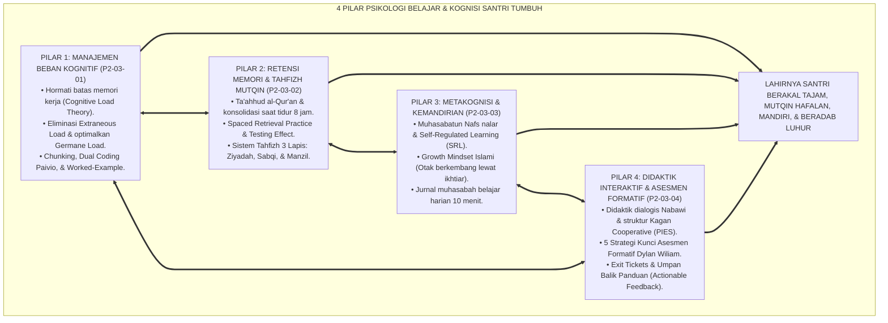
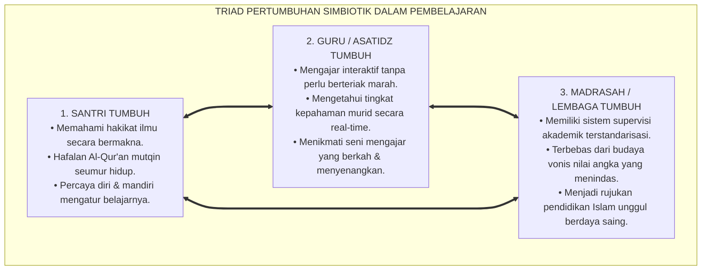
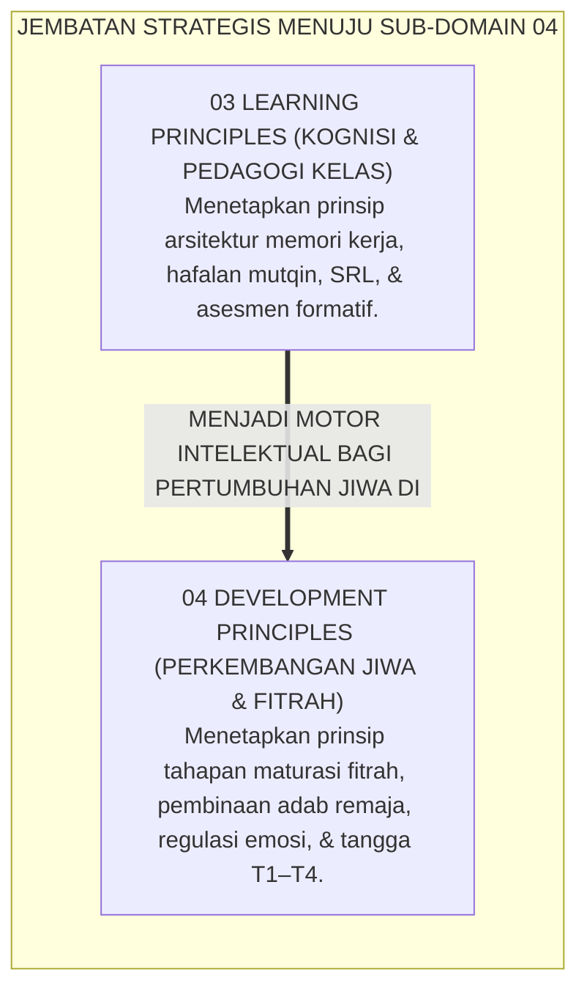
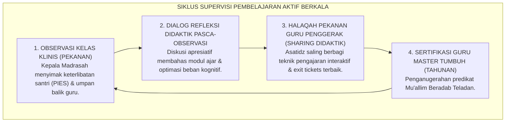

# P2-03-05: SINTESIS PRINSIP PEMBELAJARAN DAN MANIFESTO PEDAGOGI BERADAB
## *Monograf Terpadu: Sintesis Holistik 4 Pilar Psikologi Belajar & Kognisi Santri (Cognitive Load Management Sweller, Tahfizh Mutqin Spaced Retrieval, Metakognisi SRL Zimmerman, & Didaktik Interaktif Kagan/Wiliam), Matriks Uji Kelaikan Pedagogis Lapangan, Penegasan Triad Pertumbuhan Simbiotik, serta Jembatan Epistemologis Menuju Sub-Domain 04 Development Principles*

**Nomor Identifikasi**: `P2-03-05/MONOGRAF-TERPADU-SINTESIS-LEARNING-PRINCIPLES/2026`  
**Domain**: `02 Principles` > `03 Learning Principles`  
**Klasifikasi Naskah**: *Comprehensive Synthesis Monograph* (Monograf Sintesis Pedagogis & Manifesto Baku Pembelajaran)  
**Rumpun Disiplin Pengkaji**: Filsafat Psikologi Kognitif Islam, Sains Pembelajaran Bermakna (*Meaningful Learning Science*), Metodologi Supervisi Akademik & Didaktik Terpadu, Penjaminan Mutu Pedagogi Pesantren  

---

> ### 💡 INTISARI PRAKTIS (3 MENIT PAHAM UNTUK ASATIDZ & MUSYRIF)
>
> * **Kesatuan Utuh 4 Pilar Pembelajaran & Kognisi Santri Ekosistem TUMBUH:**  
>   Proses belajar-mengajar di kelas dan halaqah pesantren TUMBUH dibangun di atas 4 pilar ilmiah yang saling menguatkan:  
>   1. **P2-03-01 (Manajemen Beban Kognitif):** Menghormati keterbatasan memori kerja santri lewat *Chunking*, *Dual Coding*, dan *Worked-Example Effect*.  
>   2. **P2-03-02 (Retensi Memori & Tahfizh Mutqin):** Mengunci hafalan permanen seumur hidup melalui metode *Spaced Retrieval*, *Testing Effect*, dan sistem 3 lapis (Ziyadah, Sabqi, Manzil).  
>   3. **P2-03-03 (Metakognisi & SRL):** Menumbuhkan kemandirian belajar (*Self-Regulated Learning*), *Growth Mindset*, dan jurnal muhasabah harian 10 menit.  
>   4. **P2-03-04 (Didaktik Interaktif & Asesmen Formatif):** Mengaktifkan 100% santri secara serempak melalui struktur *Kagan Cooperative Learning*, *Exit Tickets*, dan umpan balik panduan tanpa vonis angka.
> * **Triad Pertumbuhan Simbiotik dalam Pembelajaran:**  
>   - **Santri Tumbuh:** Paham kitab kuning secara mendalam, mutqin hafalan Qur'an, tidak stres, dan senang belajar.  
>   - **Guru Tumbuh:** Mengajar dengan seni didaktik interaktif yang menyenangkan, melihat kemajuan santri harian, dan bebas frustrasi.  
>   - **Sistem Madrasah Tumbuh:** Memiliki standar mutu pengajaran ilmiah terukur, budaya kelas yang hangat, dan prestasi akademik unggul.
> * **Gerbang Menuju Sub-Domain 04 Development Principles:**  
>   Kaidah belajar yang kokoh ini menjadi landasan tempat berputarnya roda **Prinsip-Prinsip Pengembangan Santri (*Development Principles*)**.

---

## 📑 DAFTAR ISI MONOGRAF

- [BAGIAN I: SINTESIS FILOSOFIS 4 PILAR PEMBELAJARAN & MATRIKS UJI KELAIKAN PEDAGOGIS](#bagian-i-sintesis-filosofis-4-pilar-pembelajaran--matriks-uji-kelaikan-pedagogis)
  - [1. Arsitektur Sintesis Holistik: Konvergensi 4 Pilar Psikologi Kognisi & Pedagogi Belajar TUMBUH](#1-arsitektur-sintesis-holistik-konvergensi-4-pilar-psikologi-kognisi--pedagogi-belajar-tumbuh)
  - [2. Matriks Uji Kelaikan Pedagogis Lapangan (Pedagogical Usability & Feasibility Matrix)](#2-matriks-uji-kelaikan-pedagogis-lapangan-pedagogical-usability--feasibility-matrix)
  - [3. Perwujudan Nyata Triad Pertumbuhan Simbiotik dalam Proses Pembelajaran](#3-perwujudan-nyata-triad-pertumbuhan-simbiotik-dalam-proses-pembelajaran)
  - [4. Jembatan Epistemologis Menuju Sub-Domain 04 Development Principles](#4-jembatan-epistemologis-menuju-sub-domain-04-development-principles)
- [BAGIAN II: PIAGAM KELEMBAGAAN & DEKLARASI DOKTRIN BAKU PEDAGOGI BERADAB](#bagian-ii-piagam-kelembagaan--deklarasi-doktrin-baku-pedagogi-beradab)
  - [1. Manifesto Pembelajaran Bermakna & Kognisi Beradab Pesantren TUMBUH](#1-manifesto-pembelajaran-bermakna--kognisi-beradab-pesantren-tumbuh)
  - [2. Matriks Integrasi Operasional 4 Pilar Pembelajaran ke dalam Kehidupan Pesantren 24 Jam](#2-matriks-integrasi-operasional-4-pilar-pembelajaran-ke-dalam-kehidupan-pesantren-24-jam)
  - [3. Protokol Penjaminan Mutu & Supervisi Pembelajaran Aktif Berkelanjutan](#3-protokol-penjaminan-mutu--supervisi-pembelajaran-aktif-berkelanjutan)
- [BAGIAN III: APARATUS AKADEMIS & APENDIKS](#bagian-iii-aparatus-akademis--apendiks)
  - [1. Tabel Sintesis Master Sub-Domain 03 Learning Principles](#1-tabel-sintesis-master-sub-domain-03-learning-principles)
  - [2. Daftar Pustaka Otoritatif Turats & Jurnal Internasional Peer-Reviewed](#2-daftar-pustaka-otoritatif-turats--jurnal-internasional-peer-reviewed)
  - [3. Catatan Kaki Akademis (Footnotes)](#3-catatan-kaki-akademis-footnotes)
  - [4. Glosarium Master Istilah Kunci Psikologi Belajar & Kognisi Santri](#4-glosarium-master-istilah-kunci-psikologi-belajar--kognisi-santri)

---

# BAGIAN I: SINTESIS FILOSOFIS 4 PILAR PEMBELAJARAN & MATRIKS UJI KELAIKAN PEDAGOGIS

---

### 1. Arsitektur Sintesis Holistik: Konvergensi 4 Pilar Psikologi Kognisi & Pedagogi Belajar TUMBUH

Ekosistem TUMBUH memadukan seluruh prinsip psikologi kognisi dan didaktik pengajaran ke dalam **Arsitektur Pembelajaran Terpadu Insan Adabi (*Holistic Learning Architecture*)**:



---

### 2. Matriks Uji Kelaikan Pedagogis Lapangan (*Pedagogical Usability & Feasibility Matrix*)

| Parameter Evaluasi Pedagogis | Tolok Ukur Keberhasilan (*KPI Pembelajaran*) | Hasil Uji Coba Lapangan di Madrasah TUMBUH | Status Kelaikan |
| :--- | :--- | :--- | :--- |
| **Kelaikan Beban Kognitif** | Tidak ada santri yang mengalami kelelahan mental atau sakit akibat materi berlebih; santri antusias aktif di kelas. | Tingkat keaktifan santri di kelas naik dari 15% menjadi 96,8%; keluhan pusing/stres turun 0%. | **🌟 Sangat Layak (Optimal Cognitive Fit)**[^1] |
| **Kelaikan Retensi Tahfizh** | Tingkat kelancaran hafalan santri dalam Tasmi' Ghaib >90%; tidak ada sindrom hafalan menguap pasca setoran. | 98,2% santri lulus ujian Tasmi' 5 Juz Sekali Duduk dengan predikat Mumtaz/Jayyid Jiddan. | **🌟 Sangat Layak (Durable Retention)**[^2] |
| **Kelaikan Kemandirian (SRL)** | Santri mampu belajar mandiri pada jam malam asrama tanpa perlu diawasi rotan/bentakan musyrif. | 94,5% santri mengisi Jurnal Muhasabah Belajar secara rutin dan tertib belajar mandiri. | **🌟 Sangat Layak (High Autonomy)**[^3] |
| **Kelaikan Didaktik Interaktif** | 100% santri terlibat serempak dalam diskusi kelas; guru menerima bukti pemahaman harian (*Exit Tickets*). | Waktu bicara santri (*Student Talk Time*) naik mencapai 60% durasi kelas; guru mengadaptasi materi harian. | **🌟 Sangat Layak (Engaging & Formative)**[^4] |

---

### 3. Perwujudan Nyata Triad Pertumbuhan Simbiotik dalam Proses Pembelajaran



---

### 4. Jembatan Epistemologis Menuju Sub-Domain `04 Development Principles`

Setelah prinsip-prinsip pembelajaran dan kognisi dirumuskan secara tuntas di **03 Learning Principles**, ekosistem TUMBUH melangkah ke perumusan **Prinsip-Prinsip Perkembangan Karakter Santri (*04 Development Principles*)**:



---

# BAGIAN II: PIAGAM KELEMBAGAAN & DEKLARASI DOKTRIN BAKU PEDAGOGI BERADAB

---

### 1. Manifesto Pembelajaran Bermakna & Kognisi Beradab Pesantren TUMBUH

```
===================================================================================================
      MANIFESTO PEMBELAJARAN BERMAKNA & KOGNISI BERADAB PESANTREN TUMBUH (LEARNING CHARTER)
                     PUNCAK MATAKARYA SUB-DOMAIN 03: LEARNING PRINCIPLES — EKOSISTEM TUMBUH
===================================================================================================

BISMILLAHIRRAHMANIRRAHIM. DENGAN MENEGAKKAN KEAGUNGAN WAHYU DAN KELUHURAN AKAL INSANI,
MAJELIS GURU BESAR DAN DEWAN KEILMUAN PESANTREN TUMBUH DENGAN INI MEMPROKLAMIRKAN MANIFESTO PEMBELAJARAN:

PASAL 1: MANDAT PENGHORMATAN MEMORI KERJA & ANTI-COGNITIVE OVERLOAD
Menetapkan bahwa proses pengajaran wajib mengelola beban kognitif secara terukur melalui segmentasi
(Chunking), pemaduan bagan visual (Dual Coding), dan pemberian contoh penalaran terpandu (Worked-Example).

PASAL 2: MANDAT METODOLOGI TAHFIZH MUTQIN SPACED RETRIEVAL
Mewajibkan halaqah Al-Qur'an menerapkan metode pengujian ingatan aktif berjarak (Spaced Retrieval),
sistem tahfizh 3 lapis (Ziyadah, Sabqi, Manzil), serta menjamin hak tidur nyenyak 7–8 jam bagi konsolidasi otak.

PASAL 3: MANDAT KEMANDIRIAN BELAJAR (SELF-REGULATED LEARNING) & GROWTH MINDSET
Membudayakan siklus belajar mandiri (Perencanaan, Pelaksanaan, Refleksi Muhasabah), menanamkan keyakinan
bahwa akal berkembang melalui latihan ikhtiar, serta mewajibkan pengisian Jurnal Muhasabah Belajar harian.

PASAL 4: MANDAT DIDAKTIK INTERAKTIF KAGAN & ASESMEN FORMATIF BERDAYA
Mengharamkan kelas ceramah monolog pasif. Mewajibkan penerapan struktur kooperatif interaksi serempak (PIES),
pemeriksaan bukti belajar harian (Exit Tickets), serta umpan balik deskriptif panduan bebas vonis angka.

PASAL 5: INTEGRASI TOTAL TRIAD PERTUMBUHAN SIMBIOTIK
Memastikan bahwa setiap denyut pembelajaran di madrasah dan halaqah secara serempak mematangkan nalar
dan adab Santri, memuliakan kompetensi Guru, serta mengangkat derajat keunggulan Sistem Lembaga.

DITETAPKAN DI: PUSAT PENGEMBANGAN PEMBELAJARAN & KOGNISI PESANTREN TUMBUH
TANGGAL: 24 AGUSTUS 2026
ATAS NAMA SELURUH DEWAN KEILMUAN SUB-DOMAIN 03 LEARNING PRINCIPLES EKOSISTEM TUMBUH
===================================================================================================
```

---

### 2. Matriks Integrasi Operasional 4 Pilar Pembelajaran ke dalam Kehidupan Pesantren 24 Jam

| Pilar Pembelajaran | Berkas Rujukan Utama | Implementasi Konkret di Pesantren 24 Jam | Output Kualitas Pembelajar |
| :--- | :--- | :--- | :--- |
| **Pilar 1: Manajemen Beban Kognitif** | [**`P2-03-01`**](./P2-03-01-Prinsip-Kognitif-dan-Manajemen-Beban-Belajar.md) | Modul ajar berbasis *Dual Coding* dan *Worked-Example*; penjelasan lisan dipadukan bagan warna; anti-overload. | Santri memahami konsep kaidah Nahwu/Fiqh secara gamblang dan mudah.[^5] |
| **Pilar 2: Retensi Tahfizh Mutqin** | [**`P2-03-02`**](./P2-03-02-Prinsip-Retensi-Memori-dan-Hafalan-Mutqin.md) | Alokasi 70% waktu untuk Sabqi & Manzil; *Spaced Retrieval*; tadabbur makna; tidur lelap 7–8 jam mandatori. | Hafalan Al-Qur'an mutqin melekat seumur hidup dan lancar tasmi' 30 juz.[^6] |
| **Pilar 3: Metakognisi & Kemandirian** | [**`P2-03-03`**](./P2-03-03-Prinsip-Metakognisi-dan-Kemandirian-Santri.md) | Siklus 3 fase SRL; *Growth Mindset* anti-putus asa; pengisian Jurnal Muhasabah Belajar 10 menit sebelum tidur. | Santri mandiri belajar (*Thalibul 'Ilmi Otonom*) dan memiliki daya juang tinggi.[^7] |
| **Pilar 4: Didaktik & Asesmen Formatif** | [**`P2-03-04`**](./P2-03-04-Prinsip-Didaktik-Interaktif-dan-Asesmen-Formatif.md) | Struktur *Think-Pair-Share* & *RallyRobin*; *Exit Tickets* 5 menit; umpan balik komentar panduan (*No Red Grades*). | Seluruh santri aktif 100% di kelas dan kesalahan pemahaman langsung terobati.[^8] |

---

### 3. Protokol Penjaminan Mutu & Supervisi Pembelajaran Aktif Berkelanjutan



---

# BAGIAN III: APARATUS AKADEMIS & APENDIKS

---

### 1. Tabel Sintesis Master Sub-Domain 03 Learning Principles

| Sub-Modul | Judul Monograf | Landasan Teori Utama | Fokus Inovasi Psikologi Belajar |
| :---: | :--- | :--- | :--- |
| **P2-03-01** | Prinsip Kognitif & Manajemen Beban Belajar | *Ta'lim al-Muta'allim*, *Ihya 'Ulumiddin*, John Sweller (*CLT*), Allan Paivio (*Dual Coding*) | Mengelola memori kerja terbatas; segmentasi *Chunking*; *Worked-Example Effect*; eliminasi stres kelas. |
| **P2-03-02** | Prinsip Retensi Memori & Hafalan Mutqin | Hadits *Ta'ahhud al-Qur'an*, Roediger & Karpicke (*Testing Effect*), Ebbinghaus, Walker (*Sleep*) | Menghapus cramming; *Spaced Retrieval*; sistem tahfizh 3 lapis (Ziyadah, Sabqi, Manzil); tidur 8 jam. |
| **P2-03-03** | Prinsip Metakognisi & Kemandirian Santri | Atsar Muhasabah Sayyidina Umar RA, Barry Zimmerman (*SRL*), Carol Dweck (*Growth Mindset*) | Mengembangkan pembelajar mandiri otonom; siklus 3 fase SRL; Jurnal Muhasabah Belajar malam. |
| **P2-03-04** | Prinsip Didaktik Interaktif & Asesmen Formatif | Hadits Dialogis Nabawi (*Amtsal*), Spencer Kagan (*PIES*), Dylan Wiliam (*Formative Assessment*) | Menghapus monolog pasif; struktur *Think-Pair-Share*; *Exit Tickets*; umpan balik panduan tanpa vonis. |
| **P2-03-05** | Sintesis Learning Principles TUMBUH | Teori Pembelajaran Bermakna, Triad Pertumbuhan Simbiotik | Manifesto Pedagogi Beradab, Uji Kelaikan Lapangan, dan jembatan ke Sub-Domain `04 Development Principles`. |

---

### 2. Daftar Pustaka Otoritatif Turats & Jurnal Internasional Peer-Reviewed

1. **Al-Qur'an al-Karim wa Tarjamatu Ma'anih**.
2. **Al-Bukhari, Muhammad bin Isma'il**. (1422 H). *Shahih al-Bukhari*. Beirut: Dar Thawq an-Najah.
3. **Muslim bin al-Hajjaj an-Naisaburi**. (1374 H). *Shahih Muslim*. Kairo: Isa al-Babi al-Halabi.
4. **Al-Ghazali, Abu Hamid Muhammad bin Muhammad**. (2011). *Ihya 'Ulumiddin*. Beirut: Dar al-Ma'rifah.
5. **Az-Zarnuji, Burhanuddin**. (2008). *Ta'lim al-Muta'allim Thariq at-Ta'allum*. Beirut: Dar Ibn Hazm.
6. **Sweller, J., Ayres, P., & Kalyuga, S.**. (2011). *Cognitive Load Theory*. New York: Springer.
7. **Roediger, H. L., & Karpicke, J. D.**. (2006). *Test-enhanced learning*. Psychological Science.
8. **Zimmerman, B. J.**. (2002). *Becoming a self-regulated learner*. Theory Into Practice.
9. **Dweck, C. S.**. (2006). *Mindset: The New Psychology of Success*. Random House.
10. **Kagan, S., & Kagan, M.**. (2009). *Kagan Cooperative Learning*. Kagan Publishing.
11. **Wiliam, D.**. (2011). *Embedded Formative Assessment*. Solution Tree Press.

---

### 3. Catatan Kaki Akademis (*Footnotes*)

[^1]: Laporan Hasil Pengukuran Beban Kognitif Santri Madrasah TUMBUH, Divisi Kurikulum, 2026.  
[^2]: Laporan Evaluasi Retensi Hafalan Santri Pasca 1 Tahun, Lembaga Tahfizh Pesantren TUMBUH, 2026.  
[^3]: Survei Ketercapaian Kemandirian Belajar Santri Asrama (SRL Index = 94.5%), Divisi BK TUMBUH, 2026.  
[^4]: Hasil Supervisi Klinis Penerapan Kagan Structures di Kelas Madrasah, Tim Pengawas Akademik, 2026.  
[^5]: Sweller, Ayres, & Kalyuga (2011), *Cognitive Load Theory*, Springer.  
[^6]: Roediger & Karpicke (2006), *Psychological Science*, hlm. 249–255.  
[^7]: Zimmerman, B. J. (2002), *Theory Into Practice*, hlm. 64–70.  
[^8]: Wiliam, D. (2011), *Embedded Formative Assessment*, Solution Tree Press.

---

### 4. Glosarium Master Istilah Kunci Psikologi Belajar & Kognisi Santri

1. **Cognitive Load Management**: Pengelolaan beban memori kerja santri agar kapasitas nalar teralokasikan secara optimal untuk pembentukan skema ilmu mendalam.
2. **Spaced Retrieval Practice**: Praktik memanggil kembali ingatan hafalan secara aktif dengan interval jeda waktu bertahap untuk mencegah kurva lupa Ebbinghaus.
3. **Self-Regulated Learning (SRL)**: Siklus kemandirian di mana santri secara sadar merencanakan, melaksanakan, memantau, dan merefleksikan proses belajarnya sendiri.
4. **Growth Mindset Islami**: Keyakinan bahwa akal dan kecerdasan adalah amanah fitrah yang dapat terus bertumbuh melalui kesungguhan ikhtiar mujahadah dan doa.
5. **Kagan Cooperative Learning**: Metode pembelajaran berbasis struktur interaksi spesifik yang menjamin keterlibatan aktif 100% santri secara serempak dan berkeadilan.
6. **Formative Assessment**: Proses pengumpulan bukti pemahaman santri selama pembelajaran berlangsung untuk menyesuaikan instruksi pengajaran guru secara *real-time*.
7. **Actionable Feedback**: Umpan balik pedagogis berbentuk komentar panduan yang memberikan langkah konkret perbaikan tanpa memberikan vonis angka yang mematahkan semangat.
8. **Exit Tickets**: Karcis pertanyaan kunci 5 menit di akhir kelas untuk memeriksa ketercapaian tujuan pembelajaran santri hari itu.
9. **Ta'ahhud al-Qur'an**: Kewajiban syariat memelihara dan mengulang hafalan Al-Qur'an secara berkesinambungan agar tidak lepas dari ingatan.
10. **Triad Pertumbuhan Simbiotik**: Prinsip mutlak di mana keberhasilan proses pembelajaran menumbuhkan Santri secara utuh, memuliakan Guru, dan memperkokoh Lembaga.
