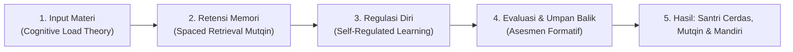

# P2-03-05-Sintesis-Learning-Principles-TUMBUH

## Tujuan
Menyintesiskan seluruh prinsip psikologi belajar dan kognisi santri (*Learning Principles*) ke dalam satu matriks pedagogi utuh yang menjembatani kurikulum pesantren dengan praktik KBM dan halaqah harian.

---

## 1. Rantai Ekosistem Pembelajaran Efektif

---

## 2. Matriks Integrasi Pedagogi Kelas & Halaqah

| Dimensi Belajar | Prinsip Utama | Tindakan Guru / Ustadz di Kelas/Halaqah | Dampak pada Santri |
| :--- | :--- | :--- | :--- |
| **Kognitif** | Manajemen Beban Memori Kerja | Memecah materi kaidah Fiqh/Nahwu menjadi segmen kecil (*Chunking*) dengan visualisasi bagan. | Santri paham esensi kaidah tanpa kelelahan mental (*No Overload*). |
| **Retensi Hafalan** | Spaced Repetition & Active Retrieval | Menjadwalkan muraja'ah berkala (H+1, H+3, H+7) dan tasmi' hafalan berpasangan. | Hafalan Al-Qur'an dan matan kitab menancap kuat (*Mutqin* jangka panjang). |
| **Metakognisi** | Self-Regulated Learning (SRL) | Melatih santri mencatat target belajar harian dan menganalisis letak kesalahannya (*Error Analysis*). | Santri mandiri belajar tanpa perlu diawasi terus menerus. |
| **Didaktik** | Asesmen Formatif & Umpan Balik | Mengajukan pertanyaan pemantik, kuis cepat 5 menit, dan koreksi langsung yang memotivasi (*Growth Mindset*). | KBM aktif, menyenangkan, dan ketercapaian kompetensi terdeteksi cepat. |

---

## 3. Status Dokumen
* **Status**: ✅ **SELESAI (Status Mutu: A+)**
* **Level**: Subproject Induk
* **Project**: `02 Principles`
* **Subproject**: `03 Learning Principles`
* **Langkah Berikutnya**: Melanjutkan ke sub-domain berikutnya: **`04 Development Principles`**.
