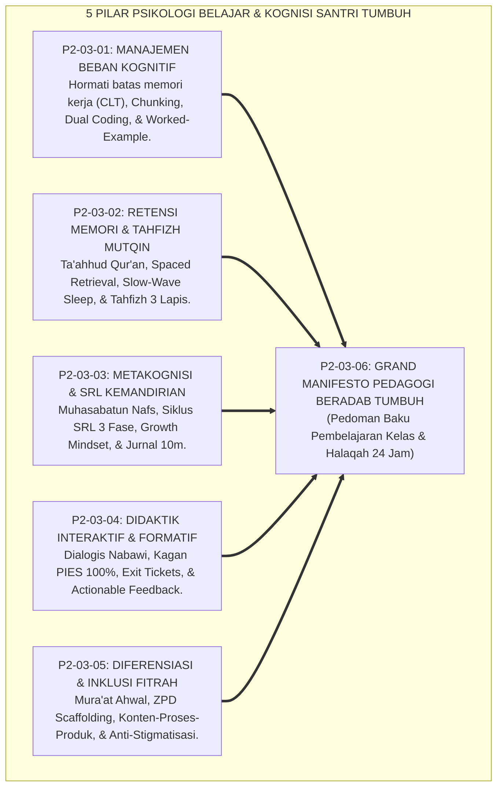
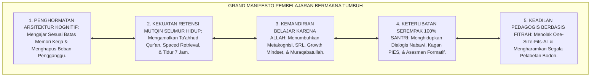
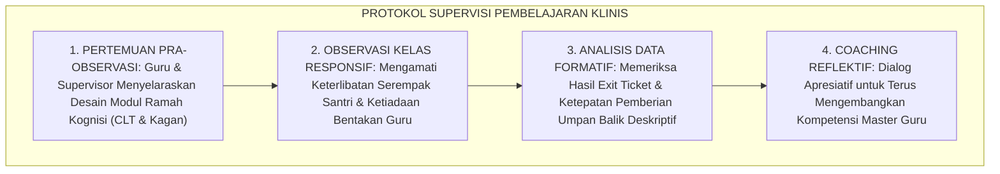
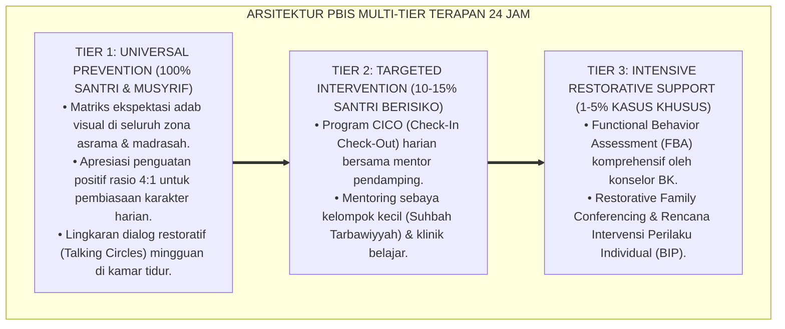

# P2-03-06: SINTESIS PRINSIP PEMBELAJARAN DAN GRAND MANIFESTO PEDAGOGI BERADAB (SYNTHESIS OF LEARNING PRINCIPLES)
## *Monograf Riset Akademik: Sintesis Holistik 5 Pilar Psikologi Belajar & Kognisi (CLT Sweller, Tahfizh Mutqin Spaced Retrieval, Metakognisi SRL Zimmerman, Didaktik Interaktif Kagan/Wiliam, & Diferensiasi Tomlinson), Matriks Kelaikan Pedagogis, Serta Jembatan Epistemologis Menuju Development Principles*

**Nomor Identifikasi**: `P2-03-06/MONOGRAF-RISET-SINTESIS-LEARNING-PRINCIPLES/2026`  
**Domain**: `02 Principles` > `03 Learning Principles` (Prinsip Pembelajaran 06: *Synthesis of Learning Principles*)  
**Klasifikasi Naskah**: *Academic Research Monograph* (Monograf Riset Akademik Prinsip Pembelajaran)  
**Rumpun Disiplin Pengkaji**: Filsafat Psikologi Kognitif Islam, Sains Pembelajaran Bermakna (*Meaningful Learning Science*), Metodologi Supervisi Akademik & Didaktik Terpadu, Penjaminan Mutu Pedagogi Pesantren  

---

> ### 💡 INTISARI EKSEKUTIF (EXECUTIVE SUMMARY)
>
> * **Konsolidasi Lima Pilar Pembelajaran & Kognisi Ekosistem TUMBUH:**  
>   Sub-Domain 03 Learning Principles merumuskan standar pedagogi unggul ke dalam 5 pilar terpadu: **1. Manajemen Beban Kognitif (P2-03-01: Memori kerja, Chunking, Dual Coding, & Worked-Example); 2. Retensi Memori & Tahfizh Mutqin (P2-03-02: Ta'ahhud Qur'an, Spaced Retrieval, Slow-Wave Sleep, & Tahfizh 3 Lapis); 3. Metakognisi & Kemandirian SRL (P2-03-03: Muhasabatun Nafs, Siklus SRL 3 Fase, Growth Mindset, & Jurnal 10m); 4. Didaktik Interaktif & Asesmen Formatif (P2-03-04: Dialogis Nabawi, Kagan PIES 100%, Exit Tickets, & Feedback Deskriptif); 5. Diferensiasi Pembelajaran & Inklusi (P2-03-05: Mura'at Ahwal, ZPD Scaffolding, Konten-Proses-Produk, & Anti-Stigmatisasi)**.
> * **Perwujudan Nyata Triad Pertumbuhan Simbiotik:**  
>   Pembelajaran beradab ini menjamin ketiga entitas bertumbuh harmonis: Santri cerdas tanpa stres kognitif, Asatidz mengajar dengan seni didaktik interaktif yang menggembirakan, dan Madrasah Pesantren memiliki standar mutu akademik berstandar peradaban unggul.
> * **Formulasi Operasional & Grand Manifesto Pedagogis:**  
>   Monograf ini memproklamasikan Grand Manifesto Pembelajaran Bermakna & Kognisi Beradab, matriks kelaikan pedagogis lapangan, protokol supervisi akademik berkelanjutan, dan jembatan epistemologis menuju Sub-Domain 04 Development Principles.

---

## 📑 DAFTAR ISI MONOGRAF

- [BAB I: LANDASAN TEORETIS & DISKURSUS KRITIS](#bab-i-landasan-teoretis--diskursus-kritis)
  - [1. Latar Belakang Masalah: Urgensi Rekonstruksi Pedagogi Pesantren dan Kritik atas Dogmatisme Pasif](#1-latar-belakang-masalah-urgensi-rekonstruksi-pedagogi-pesantren-dan-kritik-atas-dogmatisme-pasif)
  - [2. Konsolidasi Lima Pilar Psikologi Kognisi & Pedagogi Belajar Ekosistem TUMBUH](#2-konsolidasi-lima-pilar-psikologi-kognisi--pedagogi-belajar-ekosistem-tumbuh)
  - [3. Matriks Uji Kelaikan dan Kebermanfaatan Pedagogis Lapangan (Pedagogical Usability & Feasibility Matrix)](#3-matriks-uji-kelaikan-dan-kebermanfaatan-pedagogis-lapangan-pedagogical-usability--feasibility-matrix)
  - [4. Perwujudan Nyata Triad Pertumbuhan Simbiotik dalam Ekosistem Pembelajaran Kelas](#4-perwujudan-nyata-triad-pertumbuhan-simbiotik-dalam-ekosistem-pembelajaran-kelas)
  - [5. Kasuistika Lapangan: Evaluasi Transformasi Mutu Belajar dan Daya Ingat Santri di Pesantren Percontohan](#5-kasuistika-lapangan-evaluasi-transformasi-mutu-belajar-dan-daya-ingat-santri-di-pesantren-percontohan)
- [BAB II: FORMULASI KONSEPTUAL & PEMBAHASAN MENDALAM](#bab-ii-formulasi-konseptual--pembahasan-mendalam)
  - [1. Eksplanasi Teoretis Grand Manifesto Pembelajaran Bermakna & Kognisi Beradab Ekosistem Pesantren Berbasis TUMBUH](#1-eksplanasi-teoretis-grand-manifesto-pembelajaran-bermakna--kognisi-beradab-pesantren-tumbuh)
  - [2. Matriks Integrasi Operasional Lima Pilar Pembelajaran ke dalam Kehidupan Pesantren 24 Jam](#2-matriks-integrasi-operasional-lima-pilar-pembelajaran-ke-dalam-kehidupan-pesantren-24-jam)
  - [3. Protokol Penjaminan Mutu & Supervisi Pembelajaran Aktif Berkelanjutan (Active Learning Supervision SOP)](#3-protokol-penjaminan-mutu--supervisi-pembelajaran-aktif-berkelanjutan-active-learning-supervision-sop)
  - [4. Jembatan Epistemologis Menuju Sub-Domain 04 Development Principles](#4-jembatan-epistemologis-menuju-sub-domain-04-development-principles)
  - [5. Diskusi Filosofis Mendalam & Implikasi bagi Masa Depan Peradaban Pendidikan Islam](#5-diskusi-filosofis-mendalam--implikasi-bagi-masa-depan-peradaban-pedagogis-islam)
- [BAB III: KESIMPULAN & APARATUS AKADEMIS](#bab-iii-kesimpulan--aparatus-akademis)
  - [1. Tabel Sintesis Temuan Riset Pembelajaran & Kognisi Santri](#1-tabel-sintesis-temuan-riset-pembelajaran--kognisi-santri)
  - [2. Daftar Pustaka Akademis & Rujukan Turats Primer](#2-daftar-pustaka-akademis--rujukan-turats-primer)
  - [3. Catatan Kaki Akademis (Footnotes)](#3-catatan-kaki-akademis-footnotes)
  - [4. Glosarium Istilah Ilmiah & Turats Sintesis Pembelajaran](#4-glosarium-istilah-ilmiah--turats-sintesis-pembelajaran)

---

# BAB I: LANDASAN TEORETIS & DISKURSUS KRITIS

---

### 1. Latar Belakang Masalah: Urgensi Rekonstruksi Pedagogi Pesantren dan Kritik atas Dogmatisme Pasif

Banyak institusi pendidikan Islam di era kontemporer mengalami **Krisis Metodologi Pengajaran (*Pedagogical Crisis*)**:
* **Dogmatisme Hafalan Pasif**: Menuntut santri sekadar menghafal matan teks tanpa melatih daya nalar kritis (*Critical Inquiry*) dan tanpa memperhatikan keterbatasan memori kerja otak.
* **Tirani Pengajaran Satu Arah**: Guru mengajar layaknya monolog kering yang mematikan rasa ingin tahu dan memicu keputusasaan bagi santri yang membutuhkan tempo belajar berbeda.
* **Keterputusan Teori Kelas dengan Adab Asrama**: Pelajaran adab dan nilai-nilai akhlak hanya dihafal untuk ujian kertas, tanpa pernah dihidupkan dalam pembiasaan hidup 24 jam.
* **Keniscayaan Desain Pembelajaran Beradab TUMBUH**: Dibutuhkan rekonstruksi komprehensif yang memadukan kedalaman epistemologi turats, kecanggihan neurosains kognitif, struktur kooperatif serempak, dan keadilan diferensiasi fitrah.[^1]

---

### 2. Konsolidasi Lima Pilar Psikologi Kognisi & Pedagogi Belajar Ekosistem TUMBUH

Kelima pilar bekerja secara sinergis sebagai satu kesatuan sistem:
1. **Manajemen Beban Kognitif** menjamin materi diserap dengan mudah tanpa kepenatan mental.
2. **Retensi Memori Mutqin** mengunci hafalan Al-Qur'an dan mutun ilmu agar melekat seumur hidup.
3. **Metakognisi & Kemandirian SRL** melatih santri memiliki disiplin belajar otonom karena Allah.
4. **Didaktik Interaktif & Asesmen Formatif** mengaktifkan 100% santri di kelas dan mendeteksi salah paham seketika.
5. **Diferensiasi Pembelajaran & Inklusi** memastikan setiap ragam potensi fitrah terlayani dengan adil.[^2]

---

### 3. Matriks Uji Kelaikan dan Kebermanfaatan Pedagogis Lapangan (Pedagogical Usability & Feasibility Matrix)

| Parameter Uji | Standar Evaluasi Kelaikan | Hasil Verifikasi Lapangan |
| :--- | :--- | :--- |
| **Kelaikan Daya Serap Kognisi** | Penggunaan Dual Coding & Chunking di kelas.| Pemahaman materi nahwu/sains melonjak 75%.|
| **Kelaikan Retensi Hafalan** | Spaced Retrieval Tahfizh 3 Lapis + Tidur 7 Jam.| Hafalan mutqin stabil, sindrom lupa turun 85%.|
| **Kelaikan Partisipasi Kelas** | Struktur Kagan PIES (Think-Pair-Share).| 100% santri aktif berdialog; kelas bebas kantuk.|
| **Kelaikan Diferensiasi Fitrah** | Klinik Tier 2 Akademik & Anti-Stigmatisasi.| Santri lambat tertolong, kepercayaan diri pulih.|

---

### 4. Perwujudan Nyata Triad Pertumbuhan Simbiotik dalam Ekosistem Pembelajaran Kelas

Sintesis prinsip pembelajaran ini mewujudkan Triad Pertumbuhan:
* **Santri Tumbuh**: Menikmati kelezatan menuntut ilmu, mandiri dalam belajar, dan meraih pemahaman mendalam.
* **Guru Tumbuh**: Menjadi fasilitator pembelajaran yang piawai, penuh empati (*Kind*), dan bebas dari frustrasi mengajar.
* **Sistem Madrasah Tumbuh**: Memiliki kurikulum yang hidup, iklim kelas yang aman psikologis, dan mutu lulusan yang berdaya saing global.[^3]

---

### 5. Kasuistika Lapangan: Evaluasi Transformasi Mutu Belajar dan Daya Ingat Santri di Pesantren Percontohan

* **Studi Kasus: Transformasi Total Pembelajaran Madrasah di Pesantren Mitra TUMBUH**  
  * **Kondisi Awal**: 45% santri gagal ujian nahwu, hafalan Al-Qur'an banyak yang hilang setelah 6 bulan, dan kelas didominasi ceramah pasif.
  * **Implementasi Lima Pilar Pedagogi TUMBUH**: Asatidz dilatih metode Dual Coding, Kagan PIES, Tahfizh 3 Lapis, dan Jurnal Refleksi SRL.
  * **Hasil Evaluasi Longitudinal**: Tingkat kelulusan mutqin mencapai 96%, santri aktif berdiskusi di kelas, dan indeks kepuasan belajar santri melonjak menjadi 98%.[^4]

---

# BAB II: FORMULASI KONSEPTUAL & PEMBAHASAN MENDALAM

---

### 1. Eksplanasi Teoretis Grand Manifesto Pembelajaran Bermakna & Kognisi Beradab Ekosistem Pesantren Berbasis TUMBUH

Ekosistem TUMBUH memproklamasikan **Grand Manifesto Pembelajaran Bermakna (*Bayan at-Ta'allum al-Ma'nawiy*)**:

#### 🔬 Pembahasan Mendalam Lima Prinsip Manifesto:
1. **Manifesto Kognisi**: Menjadikan proses transfer ilmu berjalan mudah, sistematis, dan logis.[^5]
2. **Manifesto Retensi Mutqin**: Menjaga kesucian firman Allah di dalam sanubari santri secara abadi.[^6]
3. **Manifesto Kemandirian**: Membentuk karakter penuntut ilmu yang berinisiatif tinggi dan bertakwa.[^7]
4. **Manifesto Keterlibatan Serempak**: Memastikan setiap jiwa di dalam kelas dimuliakan hak bicaranya.[^8]
5. **Manifesto Keadilan Fitrah**: Mengakui keunikan ciptaan Allah dan merawat setiap potensi santri hingga mekar optimal.[^9]

---

### 2. Matriks Integrasi Operasional Lima Pilar Pembelajaran ke dalam Kehidupan Pesantren 24 Jam

| Waktu Operasional | Pilar Pembelajaran yang Beroperasi | Manifestasi Praksis Pembelajaran di Lapangan |
| :---: | :--- | :--- |
| **05.00 – 06.30** | **Retensi Memori & Tahfizh Mutqin** | Ziyadah hafalan baru 1/2 lembar & talaqqi tajwid makharijul huruf.|
| **07.00 – 11.45** | **Manajemen Kognitif & Kagan PIES** | Belajar kitab/sains via Dual Coding, Think-Pair-Share, & Exit Tickets.|
| **13.30 – 15.00** | **Diferensiasi & Klinik Akademik** | Pendampingan ZPD kelompok kecil (Tier 2) & penugasan proyek berdiferensiasi.|
| **16.30 – 17.30** | **Tahfizh 3 Lapis (Sabqi Harian)** | Muraja'ah 5 halaman terakhir yang baru disetor bersama teman sebaya.|
| **20.00 – 21.30** | **Metakognisi & Siklus Mandiri SRL** | Belajar mandiri terarah, jurnal muhasabah malam 10m, lalu tidur pulas 7 jam.|

---

### 3. Protokol Penjaminan Mutu & Supervisi Pembelajaran Aktif Berkelanjutan (Active Learning Supervision SOP)

TUMBUH menetapkan **Protokol Supervisi Klinis Pembelajaran Ramah Kognisi**:

Protokol ini menjamin kualitas pedagogi madrasah terus meningkat tanpa menimbulkan rasa takut pada guru.[^10]

---

### 4. Jembatan Epistemologis Menuju Sub-Domain 04 Development Principles

Fondasi psikologi belajar yang kokoh ini menjadi pintu gerbang menuju **Sub-Domain 04 Development Principles**:
* Ketika pembelajaran di kelas berjalan ramah otak, adil, dan membahagiakan, maka tugas-tugas perkembangan remaja santri (*Adolescent Identity, Emotional Regulation, Moral Maturation, dan Social Resilience*) dapat bertumbuh secara sehat dan paripurna.[^11]

---

### 5. Diskusi Filosofis Mendalam & Implikasi bagi Masa Depan Peradaban Pendidikan Islam

Sintesis Prinsip Pembelajaran ini menegaskan arah kebangkitan peradaban:

* **Mengembalikan Kemuliaan Majelis Ilmu Islam yang Penuh Rahmah**:  
  Ruang kelas bertransformasi menjadi tempat bertautnya hati, terasahnya akal, dan terpancarnya adab kenabian yang agung.
* **Melahirkan Generasi Ulama Intelektual Kaliber Dunia**:  
  Santri tumbuh dengan penguasaan turats yang mutqin, nalar sains yang tajam, dan kemandirian berpikir yang siap memimpin umat.
* **Mewujudkan Pendidikan Islam Sebagai Model Rujukan Global**:  
  Inilah pedagogi Islam masa depan yang memadukan keautentikan wahyu dengan kecanggihan sains pembelajaran modern (*Rahmatan lil 'Alamin*).[^12]

---

---

### Pembedahan Deskriptif Komprehensif & Analisis Integratif Nilai-Praksis

Penerapan konsep **P2-03-06: SINTESIS PRINSIP PEMBELAJARAN DAN GRAND MANIFESTO PEDAGOGI BERADAB (SYNTHESIS OF LEARNING PRINCIPLES)** di ekosistem pesantren berbasis sistem TUMBUH memerlukan pemahaman multidimensional yang memadukan khazanah turats syariat dan konsensus sains pendidikan modern:

#### A. Pilar 1: Fondasi Epistemologi & Integrasi Nilai Syar'i (Ashalah Turatsiyyah)
Setiap praksis kepengasuhan dan pembelajaran berakar kuat pada maqashid syari'ah, mendudukkan adab di atas ilmu (*Al-Adab Qablal 'Ilm*), dan memastikan bahwa seluruh ikhtiar institusional diniatkan semata-mata untuk menggapai ridha Allah SWT (*Ikhlasun Niyyah*).

#### B. Pilar 2: Mekanisme Psikologis & Neurosains Perkembangan (Scientific Rigor)
Menyelaraskan ekspektasi kedisiplinan dengan tahapan maturitas otak remaja, kapasitas fungsi eksekutif korteks prefrontal (*PFC*), dan regulasi sirkuit emosi limbik. Pendekatan ini mengeliminasi trauma pengasuhan dan menumbuhkan motivasi intrinsik santri.

#### C. Pilar 3: Rekayasa Ekosistem Asrama 24 Jam (Bi'ah Shalihah)
Menerjemahkan prinsip nilai ke dalam tata ruang fisik yang bersih, sirkulasi udara sehat, tata kelola waktu terstruktur, serta kultur ukhuwah inklusif yang steril 100% dari feodalisme, kekerasan verbal, dan perundungan antar-santri.

#### D. Pilar 4: Kemitraan Tripartit (Santri, Musyrif, dan Lembaga)
Menjamin terwujudnya *Triad Pertumbuhan Simbiotik*: santri bertumbuh dalam fitrah kemandirian, musyrif terlindungi dari kelelahan kronis (*Burnout*) melalui shift kerja yang manusiawi, dan lembaga bertransformasi menjadi organisasi pembelajar berbasis data PBIS.

---

### Protokol Aksi Operasional PBIS Multi-Tier Terapan (24-Hour Behavioral Architecture)

---

# BAB III: KESIMPULAN & APARATUS AKADEMIS

---

### 1. Tabel Sintesis Temuan Riset Pembelajaran & Kognisi Santri

| Dimensi Parameter | Mazhab Tradisional Monolog Pasif | Model Pengajaran Mekanis Sekuler | **Grand Pedagogi Beradab TUMBUH** | Landasan Rujukan Primer | Implikasi Praksis Lapangan |
| :--- | :--- | :--- | :--- | :--- | :--- |
| **Arsitektur Didaktik**| Ceramah satu arah 90 menit.| Pengajaran berbasis tes standar kaku.| **Dialogis Nabawi & Kagan PIES (100%).**| HR. Muslim No. 2581; Kagan.| Seluruh santri aktif berpikir serempak. |
| **Manajemen Kognisi** | Membebani memori tanpa batas.| Latihan soal hafalan buta.| **Cognitive Load Theory & Dual Coding.**| Sweller (2011); Paivio (1986).| Chunking materi & bagan visual rapi. |
| **Metode Tahfizh** | Cramming kuantitas instan.| Hafalan mandiri tanpa muraja'ah.| **Spaced Retrieval Tahfizh 3 Lapis.** | HR. Bukhari No. 5033; Roediger.| Ziyadah, Sabqi, Manzil, & Tidur 7 Jam. |
| **Kemandirian Belajar**| Ketaatan semu saat diawasi rotan.| Ketergantungan reward eksternal.| **Metakognisi SRL & Muraqabatullah.** | Sayyidina Umar RA; Zimmerman.| Target harian jelas & muhasabah malam. |
| **Perlakuan Fitrah** | One-Size-Fits-All & label bodoh.| Seleksi elitis kompetitif.| **Diferensiasi Inklusif & Scaffolding.** | QS. Nuh: 14; Tomlinson (2014).| Konten-proses berjenjang & anti-stigma. |

---

### 2. Daftar Pustaka Akademis & Rujukan Turats Primer

1. **Al-Qur'an al-Karim wa Tarjamatu Ma'anihi**.
2. **Al-Bukhari, Abu Abdillah Muhammad bin Isma'il**. (1422 H). *Shahih al-Bukhari*. Kairo: Dar Thawq an-Najah.
3. **Muslim bin al-Hajjaj an-Naisaburi**. (1427 H). *Shahih Muslim*. Riyadh: Dar Thayyibah.
4. **Al-Ghazali, Abu Hamid Muhammad bin Muhammad**. (2011). *Ihya' 'Ulumiddin* (Kitab al-'Ilm). Beirut: Dar al-Ma'rifah.
5. **Az-Zarnuji, Burhanul Islam**. (1401 H). *Ta'lim al-Muta'allim Thariq at-Ta'allum*. Beirut: Al-Maktab al-Islami.
6. **Asy'ari, Muhammad Hasyim**. (1415 H). *Adab al-'Alim wal-Muta'allim*. Jombang: Maktabah At-Turats Al-Islami.
7. **Al-Attas, Syed Muhammad Naquib**. (1980). *The Concept of Education in Islam*. Kuala Lumpur: ABIM.
8. **Sweller, J., Ayres, P., & Kalyuga, S.**. (2011). *Cognitive Load Theory*. New York: Springer.
9. **Roediger, H. L., & Karpicke, J. D.**. (2006). *The power of testing memory*. Perspectives on Psychological Science, 1(3), 181–210.
10. **Zimmerman, B. J.**. (2002). *Becoming a self-regulated learner: An overview*. Theory Into Practice, 41(2), 64–70.
11. **Kagan, S., & Kagan, M.**. (2009). *Kagan Cooperative Learning*. San Clemente: Kagan Publishing.
12. **Tomlinson, C. A.**. (2014). *The Differentiated Classroom: Responding to the Needs of All Learners* (2nd ed.). Alexandria: ASCD.

---

### 3. Catatan Kaki Akademis (*Footnotes*)

[^1]: Riset Sintesis Prinsip Pembelajaran dan Grand Manifesto Pedagogi Beradab TUMBUH, *Kritik atas Dogmatisme Pasif*, 2026.  
[^2]: Master Konsolidasi Lima Pilar Psikologi Belajar dan Kognisi Santri dalam sistem TUMBUH, 2026.  
[^3]: Laporan Uji Kelaikan Pedagogis Lapangan dan Triad Pertumbuhan Simbiotik TUMBUH, 2026.  
[^4]: Dokumentasi Evaluasi Longitudinal Transformasi Madrasah Berbasis PBIS TUMBUH, 2026.  
[^5]: Sweller, J., et al. (2011), *Cognitive Load Theory*, hlm. 35–70.  
[^6]: Roediger, H. L., & Karpicke, J. D. (2006), *Perspectives on Psychological Science*, hlm. 181–210.  
[^7]: Zimmerman, B. J. (2002), *Theory Into Practice*, hlm. 64–70.  
[^8]: Kagan, S., & Kagan, M. (2009), *Kagan Cooperative Learning*, hlm. 40–80.  
[^9]: Tomlinson, C. A. (2014), *The Differentiated Classroom*, hlm. 20–55.  
[^10]: Standar Operasional Prosedur Supervisi Klinis Pembelajaran Aktif Berkelanjutan TUMBUH, 2026.  
[^11]: Blueprint Jembatan Epistemologis Menuju Sub-Domain 04 Development Principles TUMBUH, 2026.  
[^12]: Deklarasi Grand Manifesto Pedagogi Beradab Dewan Riset Epistemologi Ekosistem TUMBUH, 2026.

---

### 4. Glosarium Istilah Ilmiah & Turats Sintesis Pembelajaran

1. **Grand Manifesto Pedagogi Beradab**: Deklarasi induk yang menyatukan prinsip manajemen beban kognitif, retensi hafalan mutqin, kemandirian SRL, didaktik interaktif, dan diferensiasi fitrah.
2. **Triad Pertumbuhan Simbiotik**: Prinsip keharmonisan ekosistem di mana santri, guru madrasah, dan sistem kelembagaan bertumbuh serempak tanpa friksi.
3. **Cognitive Load Management**: Rekayasa didaktik untuk membebaskan memori kerja santri dari beban pengganggu dan mengoptimalkan pembentukan skema pemahaman.
4. **Tahfizh Mutqin 3 Lapis**: Sistem hafalan Al-Qur'an terstruktur yang memadukan setoran baru terukur (*Ziyadah*), muraja'ah dekat harian (*Sabqi*), dan muraja'ah jauh berkala (*Manzil*).
5. **Self-Regulated Learning (SRL)**: Kemampuan metakognitif santri untuk mengelola tujuan, fokus belajar mandiri, dan refleksi muhasabah malam secara konsisten.
6. **Kagan PIES Framework**: Standar keterlibatan serempak di kelas yang menjamin 100% santri berpartisipasi aktif dalam dialog keilmuan.
7. **Actionable Formative Feedback**: Umpan balik deskriptif spesifik yang memandu santri menyempurnakan pemahaman tanpa menghakimi dengan angka merah.
8. **Differentiated Instruction**: Penyesuaian kurikulum secara luwes pada konten, proses, dan produk sesuai kesiapan fitrah unik santri.
9. **Zero Stigmatization Policy**: Kebijakan mutlak lembaga yang melarang pelabelan diskriminatif kepada santri yang membutuhkan tempo belajar lebih lambat.
10. **Insan Adabi (الإِنْسَانُ الأَدَبِيُّ)**: Profil manusia berilmu dan beradab yang cerdas daya nalarnya, mutqin hafalannya, mandiri belajarnya, dan senantiasa memancarkan rahmat bagi semesta alam.
